Introduzione alle Basi di dati
==============================

Importanza dei Dabase
---------------------

Un database (base di dati) è insieme organizzato di dati, che esistono e
si evolvono nel tempo, disponibili in una certa struttura (impresa,
banca, ospedale, …) per lo svolgimento della propria attività.

Le basi di dati al giorno d’oggi sono essenziali in ogni tipologia di
attività.

*Es*. – usate per mantenere “record” interni ad una struttura;

– per offrire servizi attraverso il World-Wide-Web;

– per supportare diversi altri processi (commerciali).

> – Alla base di ricerche scientifiche, utilizzate per memorizzare e
> rappresentare dati.

*Sistema organizzativo di un’azienda*

La struttura di un’azienda comprende:

-   *Insieme di risorse*: le risorse di una azienda: persone, denaro,
    materiali, beni, e **informazioni** (gestite dal sistema
    informativo);

-   *Regole*: necessarie per lo svolgimento coordinato delle attività al
    fine del perseguimento degli scopi.

*Sistema informativo e Sistema informatico*

{width="2.311111111111111in"
height="1.3270833333333334in"}Il **sistema informativo** (SI) è parte
del sistema organizzativo di un’azienda o ente (eventualmente non
esplicitato nella struttura), che esegue/gestisce processi informativi
(cioè i processi che coinvolgono informazioni).

Un SI gestisce informazioni, ma ciò non significa necessariamente fare
ricorso a strumenti automatici propri della tecnologia dell’informazione
(IT); esistono organizzazioni la cui ragion d’essere è la gestione di
informazioni (es. servizi anagrafici e banche) e che operano da secoli.

La parte automatizzata di un SI viene più propriamente denominata
**Sistema Informatico**. La porzione **automatizzata** del sistema
informativo è la parte del sistema informativo che gestisce informazioni
con tecnologia informatica.

{width="2.077777777777778in"
height="0.7861111111111111in"}*Valore dell’informazione*

L’informazione è un bene a valore crescente, necessario per pianificare
e controllare con efficacia le attività dell’organizzazione, e
rappresenta la materia prima che viene trasformata dai sistemi
informativi, così come i semilavorati vengono trasformati dai sistemi di
produzione.

*Gestione delle informazioni*

Gestire un’informazione significa acquisire, elaborare, conservare,
produrre e distribuire dati. Un aspetto fondamentale per la gestione
delle informazioni è la razionalizzazione e standardizzazione
dell’organizzazione delle informazioni e delle procedure. Anche prima di
essere informatizzati, molti sistemi informativi si sono evoluti in
questa direzione (es. gli uffici anagrafe fino a pochi anni fa).

In qualsiasi attività le informazioni vengono gestite (registrate e
scambiate) in diversi modi: idee informali, linguaggio naturale (scritto
o parlato, formale o colloquiale, in una lingua o in un’altra), disegni,
grafici, schemi, numeri e codici; e su vari supporti: memoria umana,
carta, dispositivi elettronici.

*Dati*

Nei sistemi informatici (e non solo), le informazioni vengono
rappresentate in modo essenziale e spartano attraverso i **dati.** Dal
Vocabolario della lingua italiana (1987) distinguiamo:

-   **Informazione**: notizia, dato o elemento che consente di avere
    conoscenza più o meno esatta di fatti, situazioni, modi di essere.

-   **Dato**: ciò che è immediatamente presente alla conoscenza, prima
    di ogni elaborazione; (in informatica) elementi di informazione
    costituiti da simboli che debbono essere elaborati.

I dati hanno bisogno di essere interpretati.

*Es*. “*Mario*”, “*Rossi*” e “*12345*” sono tre dati. Se essi vengono
forniti in risposta alla domanda “Qual è la

> matricola dell’ultimo studente che ha fatto esami di Programmazione 2”
> allora i dati possono essere interpretati per fornire informazione e
> arricchire la conoscenza. Dunque dai dati si arriverà
> all’informazione:
>
> “Lo studente Mario Rossi ha numero di matricola 12345”.

*Perché i dati*

La rappresentazione precisa di forme più ricche di informazione e
conoscenza è difficile. I dati costituiscono spesso una risorsa
strategica, perché più stabili nel tempo di altre componenti (processi,
tecnologie, ruoli umani).

Sistema di gestione di basi di dati (DataBase Management System - DBMS)
-----------------------------------------------------------------------

Il modo più comune con cui un sistema informatico gestisce le
informazioni è attraverso la rappresentazione codificata dei dati di
interesse. Intuitivamente, una **Base di Dati** (DB - Data Base o
Database) può pensarsi come una collezione di dati che rappresentano le
informazioni di interesse per un’organizzazione.

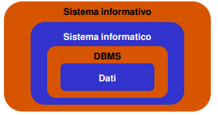{width="1.75in" height="0.925in"}

La potenza delle basi di dati deriva da un bagaglio di conoscenze e
tecnologie che sono state sviluppate in diverse decadi che hanno dato
luogo a software specializzati chiamati: ***Sistema di gestione di basi
di dati*** - ***DataBase Management System*, o DBMS.**

*Scopo di un DBMS*

Un DBMS è uno strumento particolarmente potente per la creazione e la
gestione efficiente ed efficace di grandi quantità di dati. Esso è un
Sistema (**prodotto software**) in grado di gestire **collezioni di
dati** che sono caratterizzati da:

-   **Grandezza,** dimensioni (molto) maggiori della memoria centrale
    dei sistemi di calcolo utilizzati;

-   **Persistenza**, con un periodo di vita indipendente dalle singole
    esecuzioni dei programmi che le utilizzano e a prova di guasti;

-   **Condivisione,** molteplici applicazioni diverse che utilizzano gli
    stessi dati;

-   **Prestazionali,** in grado di garantire elevate prestazioni, cioè
    l’utilizzo efficiente delle risorse e ottimizzazione dei tempi di
    esecuzione delle operazioni;

-   **Visione struttura dei dati,** che dipende dal modello (logico) dei
    dati supportato.

Un DBMS consente all’utente o ad un’applicazione di accedere e
modificare i dati attraverso un potente linguaggio di interrogazione
garantendo **affidabilità** (resistenza a malfunzionamenti hardware e
software) e **privatezza** (con una disciplina e un controllo degli
accessi). Come ogni prodotto informatico, un DBMS deve essere
**efficiente** (utilizzando al meglio le risorse di spazio e tempo del
sistema) ed **efficace** (rendendo produttive le attività dei suoi
utilizzatori).

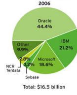{width="1.3631944444444444in"
height="1.6902777777777778in"}

Esempi di prodotti software (complessi) disponibili sul mercato:

-   DB2 (sviluppato da IBM)

-   Oracle (sviluppato da Oracle)

-   SQLServer (sviluppato da Microsoft)

-   MySQL (open-source)

-   PostgreSQL (open-source)

-   Access (sviluppato da Microsoft)

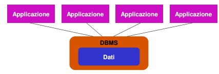{width="2.7916666666666665in"
height="0.94375in"}*Condivisione*

Ogni organizzazione (specie se grande) è divisa in settori o comunque
svolge diverse attività. A ciascun settore o attività corrisponde un
(sotto)sistema informativo, e possono esistere sovrapposizioni fra i
dati di interesse dei vari settori. I problemi relativi alla
condivisione sono: **ridondanza**, ovvero informazioni ripetute; e
rischio di **incoerenza**, cioè le versioni possono non coincidere.

Una base di dati è una risorsa **integrata**, condivisa fra le varie
applicazioni; le conseguenze sono:

-   Attività diverse su dati in parte condivisi: meccanismi di
    **autorizzazione**

-   Attività multi-utente su dati condivisi: controllo della
    **concorrenza**

{width="2.441666666666667in" height="1.8076388888888888in"}Modello dei dati
------------------------------------------------------------------------------------------------

Un **modello dei dati** è un insieme di *concetti* utilizzati per
*organizzare i dati* e *descriverne la struttura* in modo che essa
risulti comprensibile a un elaboratore. Ogni modello di dati fornisce
*meccanismi di strutturazione.* Questi meccanismi di astrazione
costituiscono l’equivalente delle **strutture dati** nella
programmazione.

*Caratteristiche di un buon modello*

-   **Espressività:** permette di rappresentare in modo semplice e
    naturale i dati e le proprietà.

-   **Semplicità**: basato su un numero minimo di meccanismi semplici da
    utilizzare e capire.

-   **Realizzabilità:** deve essere realizzabile in modo efficiente su
    di un calcolatore

*Composizione*

Il modello di rappresentazione dei dati è composto dalla **notazione**
per descriverli, e da un insieme di **operatori** per manipolarli. Una
componente fondamentale sono i **meccanismi di strutturazione** (o
**costruttori di tipo**), che come nei linguaggi di programmazione sono
meccanismi che permettono di definire nuovi tipi, così ogni modello dei
dati prevede alcuni costruttori.

Descrizioni e rappresentazioni dei dati a livelli diversi permettono
l’**indipendenza dei dati** dalla rappresentazione fisica: i programmi
fanno riferimento alla struttura a livello più alto, e le
rappresentazioni sottostanti possono essere modificate senza necessità
di modifica dei programmi.

*Tipi di modelli*

-   **Modello logico**: utilizzato nei DBMS esistenti per
    l’organizzazione dei dati. Si chiama logico per sottolineare il
    fatto che le strutture utilizzate da questi modelli, pure essendo
    astratte, riflettono una particolare organizzazione; sono utilizzati
    dai programmi e indipendenti dalle strutture fisiche

> *Es*. **Relazionale**, reticolare, gerarchico, a oggetti.

-   **Modello concettuale**: permette di rappresentare i dati in modo
    indipendente da ogni sistema; cercano di descrivere i concetti del
    mondo reale piuttosto che i dati utili a rappresentarli e sono
    utilizzati nelle fasi preliminari di progettazione.

> *Es*. **Entity-Relationship.**

*Schemi e istanze*

In ogni database esistono:

-   **Schema**: sostanzialmente invariante nel tempo, ne descrive la
    struttura (aspetto intensionale).

-   Raccolta di **definizioni** che descrivono i dati, le restrizioni
    sui valori (vincoli di integrità), le relazioni fra essi ed
    eventualmente alcune operazioni disponibili.

-   **Istanza**: valori attuali che possono cambiare anche molto
    rapidamente (aspetto estensionale)

-   **Record**: oggetto di una banca dati strutturata in dati compositi,
    che contengono un insieme di campi o elementi, ciascuno dei quali
    possiede nome e tipo propri.

> {width="1.6854166666666666in"
> height="0.6902777777777778in"}
>
> *Es*. Nello schema a sinistra possiamo individuare la raccolta di
> definizioni che

sono le intestazioni della tabella, mentre le istanze sono il corpo di

ciascuna tabella.

*Architettura standard (ANSI/SPARC) a tre livelli per DBMS*

-   **Schema logico:** descrizione dell’intera base di dati nel modello
    logico “principale” del DBMS

-   **Schema fisico:** rappresentazione dello schema logico per mezzo di
    strutture fisiche di memorizzazione

-   **Schema esterno (o delle viste):** descrizione di parte dello
    schema logico secondo le esigenze dei diversi utenti tramite
    **viste.**

Il livello logico è indipendente da quello fisico: una tabella è
utilizzata nello stesso modo qualunque sia la sua realizzazione fisica
(che può anche cambiare nel tempo).

{width="2.9881944444444444in"
height="2.0381944444444446in"}

*Scopo delle viste*

{width="2.1277777777777778in"
height="1.4638888888888888in"}Oltre a fornire una visione
“personalizzata” del DB, le viste possono svolgere un ruolo importante
anche per diversi altri motivi:

-   Una ristrutturazione dello schema logico integrato può, in alcuni
    casi, essere opportunamente “mascherata” facendo uso di viste;

-   Mediante le viste è possibile regolare meglio il controllo degli
    accessi al DB, ad es. mascherando dati riservati;

-   Le viste possono essere usate per “calcolare” dinamicamente nuovi
    dati a partire da quelli memorizzati nel DB, senza per questo
    introdurre ridondanza.

*Indipendenza dei dati*

L’indipendenza è una conseguenza della articolazione in livelli.
L’accesso avviene solo tramite il livello esterno (che può coincidere
con il livello logico). Abbiamo due forme di indipendenza:

-   **Indipendenza fisica**: il livello logico e quello esterno sono
    indipendenti da quello fisico. Una relazione è utilizzata nello
    stesso modo qualunque sia la sua realizzazione fisica. La
    realizzazione fisica può cambiare senza che debbano essere
    modificati i programmi.

<!-- -->

-   **Indipendenza logica**: il livello esterno è indipendente da quello
    logico. Aggiunte o modifiche alle viste non richiedono modifiche al
    livello logico. Modifiche allo schema logico che lascino inalterato
    lo schema esterno sono trasparenti.

Linguaggi e personaggi
----------------------

  **Data-Definition Language (DDL)**     Consente all’utente di creare nuovi database e di specificarne i loro **schemi** (logici, esterni, fisici) la loro strutturazione logica.
  -------------------------------------- -------------------------------------------------------------------------------------------------------------------------------------------
  **Data Manipulation Language (DML)**   Dà agli utenti la possibilità di inserire, gestire e modificare **istanze** di basi di dati.
  **Data Query Language (DQL)**          Consente di avviare interrogazioni, sia semplici che complesse, dei dati memorizzati.
  **Data Control Language (DCL)**        Consente allo sviluppatore di database di creare e gestire strumenti di controllo e accesso ai dati.

*SQL*

SQL (*Structured Query Language*) è un linguaggio standardizzato per
database basati sul modello relazionale progettato per incorporare tutte
le funzioni DDL, DML, DQL e DCL.

A differenza del nome, non si tratta dunque solo di un semplice query
language (linguaggio di interrogazione), ma include anche gli altri
linguaggi tipici per la progettazione e gestione/amministrazione del
database

*Query*

Il termine query viene utilizzato per indicare l'**interrogazione** di
un database per compiere determinate operazioni sui dati (selezione,
inserimento, cancellazione dati, ecc.). Solitamente una query viene
interpretata, dal linguaggio **SQL** (Structured Query Language) per
renderla più comprensibile al DBMS. L'analisi del risultato della query
è oggetto di studio dell'algebra relazionale.

Una semplice ed esemplificativa query SQL di selezione può essere la
seguente: SELECT \* FROM AULE

Una *query* di selezione inizia classicamente con il comando *select*,
che apre una stringa di interrogazione sul database; *\** sta per *all*,
ovvero tutti (i campi della tabella); *from* dichiara l'origine dei
dati, ovvero, nell'esempio, UNIVERSITA’.

Si possono aggiungere criteri restrittivi di selezione introdotti
abitualmente dal comando *WHERE*. Vediamo un esempio: SELECT \* FROM
UNIVERSITA’ WHERE AULA=“Aula 4”

In questo caso la query restituirà, tra tutti i record, solo quelli che
avranno nel campo AULA il valore "Aula 4". Se al posto dell'operatore
logico = si usa &lt;&gt; verranno selezionati i record diversi dal
valore immesso.

Si possono inoltre combinare più filtri di ricerca, uniti dall'operatore
*and* e *or*, ottenendo una condizione per la quale una query deve
essere valida, oppure combinare più query insieme (tramite la funzione
Join).

*Un’operazione DDL*

CREATE TABLE orario (insegnamento CHAR(20) , docente CHAR(20) , aula
CHAR(4) , ora CHAR(5) )

*Personaggi e interpreti*

Le funzioni del DBA (DataBase Administrator, sistemista specializzato
nell'amministrazione di database) includono quelle di progettazione,
anche se in progetti complessi ci possono essere distinzioni.

-   **Amministratori:** Persona o gruppo di persone responsabile del
    controllo centralizzato e della gestione del sistema, delle
    prestazioni, dell’affidabilità, delle autorizzazioni

<!-- -->

-   **Progettisti:** Realizzatori di **DBMS**

-   **Utenti:** Colui che usa il DB, si dividono in:

    -   Utenti **finali** (terminalisti), eseguono applicazioni
        predefinite (transazioni)

    -   Utenti **casuali**, eseguono operazioni non previste a priori,
        usando linguaggi interattivi

*Transazioni (per l’utente)*

Programmi che realizzano attività frequenti e predefinite, con poche
eccezioni, previste a priori.

*Es*. - versamento presso uno presso sportello bancario

- emissione di certificato anagrafico

- dichiarazione presso l’ufficio di stato civile

- prenotazione aerea

Le transazioni sono di solito realizzate in linguaggio ospite
(tradizionale o ad hoc).

-   Per l'utente: programma a disposizione, da eseguire per realizzare
    una funzione di interesse

-   Per il sistema: sequenza indivisibile di operazioni (cfr.
    affidabilità).

*Vantaggi dei DBMS*

  ---------------------------------------------------------------------------------------- -------------------------------------------------------------------------
  *Pro*                                                                                    *Contro*

  -   dati come risorsa comune, base di dati come modello della realtà                     -   costo dei prodotti e della transizione
                                                                                           
  -   gestione centralizzata con possibilità di standardizzazione ed “economia di scala”   -   non scorporabilità delle funzionalità (con riduzione di efficienza)
                                                                                           
  -   disponibilità di servizi integrati                                                   
                                                                                           
  -   riduzione di ridondanze e inconsistenze                                              
                                                                                           
  -   indipendenza dei dati                                                                
                                                                                           
  ---------------------------------------------------------------------------------------- -------------------------------------------------------------------------

*Perché non i file system?*

Per gestire grandi quantità di dati in modo persistente e condiviso
sarebbe anche possibile fare uso dei file system, ma ciò ha una serie di
inconvenienti, tra cui:

-   Non sono disponibili i servizi aggiuntivi offerti da un DBMS

-   I meccanismi di condivisione sono limitati, in particolare il
    livello di granularità è quello del file (due utenti non possono
    modificare contemporaneamente parti (record) diverse di uno stesso
    file)

-   L’accesso a file condivisi richiede una descrizione degli stessi nel
    codice delle applicazioni, con rischi di descrizioni errate e quindi
    inconsistenti.

Modello Relazionale
===================

Venne proposto da Edgar F. **Codd** nel 1970 per semplificare la
scrittura di interrogazioni sui database e per favorire l’indipendenza
dei dati; venne reso disponibile come modello logico in DBMS reali nel
1981. Oggi è uno dei modelli logici più utilizzati, implementato su
moltissimi DBMS sia commerciali che open source. Si basa sulla teoria
degli insiemi e sulla logica del primo ordine ed è strutturato intorno
al concetto matematico di **relazione.** Per il suo trattamento ci si
avvale di strumenti quali il calcolo relazionale e l'algebra
relazionale.

**RDBMS** = DBMS che supporta il modello relazionale dei dati

{width="2.825in"
height="1.6743055555555555in"}*Concetto di relazione*

Il termine “relazione” può essere usato con diverse accezioni, che non
vanno confuse tra loro:

-   Nel linguaggio comune = “legame” di qualche tipo

-   Nella teoria degli insiemi = relazione matematica

-   Nel modello relazionale = generalizzazione della relazione
    matematica

-   Nel modello Entity-Relationship indica una classe di legami tra due
    o più entità (si parla anche di “associazione”)

-   Nei DBMS è usato come sinonimo di “**tabella**”

*Relazione matematica*

Si considerino n insiemi $D_{1},D_{2},\ldots,D_{n}$ non necessariamente
distinti. Il prodotto cartesiano
$D_{1} \times D_{2} \times \ldots \times D_{n}$ è l’insieme di tutte le
n-ple ordinate $\left( d_{1},d_{2},\ldots,d_{n} \right)$ tali che
$d_{1} \in D_{1},\ d_{2} \in D_{2},\ldots,d_{n} \in D_{n}$. Una
relazione matematica su $D_{1},D_{2},\ldots,D_{n}$ è un qualunque
sottoinsieme del prodotto cartesiano
$D_{1} \times D_{2} \times \ldots \times D_{n}$.

*Es*. $D_{1} = \left\{ a,b,c \right\},\ \ D_{2} = \left\{ 1,2 \right\};$
$D_{1} \times D_{2} = \left\{ \left( a,1 \right),\left( a,2 \right),\left( b,1 \right),\left( b,2 \right),\left( c,1 \right),\left( c,2 \right) \right\}$

$r = \left\{ \left( a,1 \right),\left( b,2 \right),\left( c,1 \right),\left( c,2 \right) \right\}$
è una relazione su $D_{1}$ e
$D_{2}\left( r \subseteq D_{1} \times D_{2} \right)$.

> Dove $D_{1},\ldots,D_{n}$ sono i *domini* delle relazione, il valore
> di n è detto *grado* della relazione, il numero di n-ple di una
> relazione è la sua *cardinalità*.

*Schemi relazionali*

Uno schema di relazione $R:\left\{ T \right\}$ è una coppia formata dal
nome di una relazione R e da un tipo di relazione dove i tipi di dati
*“Interi; Reali; Booleani; Stringhe;”* sono tipi primitivi.

Se $T_{1},T_{2},\ldots,T_{n}$ sono tipi primitivi e
$A_{1},A_{2},\ldots,A_{n}$ sono etichette, dette attributi, allora
$\left( A_{1}:T_{1},A_{2}:T_{2},\ldots,A_{n}:T_{n} \right)$ è un tipo di
**n-upla** di grado n. Se $T$ è un tipo n-upla allora
$\left\{ T \right\}$ è un tipo relazione.

Lo **schema relazionale** è costituito da un insieme di schemi di
relazione $R_{i}:\left\{ T_{i} \right\},\ i = 1,2,\ldots,k$ e da un
insieme di vincoli di integrità relativi a tali schemi. Costituisce
l’aspetto **intensionale** del dato modello relazionale dei dati.

L’aspetto **estensionale** invece ci dice che una n-upla
$t = \left( A_{1} ,A_{2} v_{2},\ldots,A_{n} v_{n} \right)$ di tipo
$\left( A_{1}:T_{1},A_{2}:T_{2},\ldots,A_{n}:T_{n} \right)$ è un insieme
di coppie $\left( A_{i},v_{1} \right)$ con $v_{i}$ di tipo $T_{i}$.

Una **relazione R** di tipo
$\left( A_{1}:T_{1},A_{2}:T_{2},\ldots,A_{n}:T_{n} \right)$ è un insieme
finito di n-uple di tipo
$\left( A_{1}:T_{1},A_{2}:T_{2},\ldots,A_{n}:T_{n} \right)$.

{width="2.7319444444444443in"
height="0.6055555555555555in"}*Es*.

È una relazione di tipo
$\left\{ \left( Nome:char,\ Matricola:int,\ Indirizzo:char,\ Telefono:int \right) \right\}$
e ciascuna riga è una n-upla della relazione.

Le tabelle (Nome, Matricola, Indirizzo, Telefono),
(Corso,Matricola,Voto), (Corso, Professore) costituiscono un istanza
dello schema relazionale.

$\{ Studenti\left( Nome:\ char\ ,\ Matricola:int\left( 6 \right),Indirizzo:\ char\ ,\ Telefono:int\left( 6 \right) \right);$

$\text{Esami\ }\left( Corso:\ char\ ,\ Matricola:int\left( 6 \right),Voto:\left\{ 18,19,\ldots,30 \right\} \right);$

$Corsi(Corso:char,\ Professore:char)\}\ $

$dom(A_{i})$ è l’insieme dei possibili valori dell’attributo $A_{i}$. Ad
esempio nella tabella Studenti(Corso,Matricola,Voto), dom(Voto) =
{18,19,…,30,31}.

Struttura del modello relazionale
---------------------------------

L'assunto fondamentale del modello relazionale è che tutti i dati sono
rappresentati come relazioni e manipolati con gli **operatori
dell'algebra relazionale** o del calcolo relazionale, da cui appunto il
nome.

Il modello relazionale consente al progettista di database di creare una
rappresentazione **consistente** e logica dell'informazione. La
consistenza è ottenuta inserendo nel progetto del database appropriati
vincoli, normalmente chiamati **schema logico**.

*Scomposizione di una relazione*

Una *relazione* può essere informalmente definita come una *tabella* le
cui colonne (*attributi*) rappresentano le proprietà di interesse, e le
cui righe (*tuple*) rappresentano ciascuna uno specifico oggetto
descritto nel DB.

Quando si parla di “relazione” ci si riferisce a un oggetto composto di
2 parti:

-   **Testata (o schema)**. Insieme di attributi o campi dati, formato
    dal *nome della relazione* e dal *nome degli attributi*.

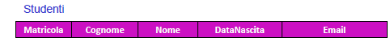{width="4.597402668416448in"
height="0.49868219597550306in"}

-   **Corpo (o istanza)**. Insieme di n-tuple o record di dati o valori,
    formato dai *dati* veri e propri:

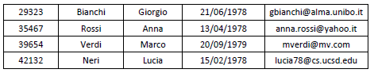{width="4.2979713473315835in"
height="0.8414752843394576in"}

Esaminando questi due componenti, in dettaglio abbiamo:

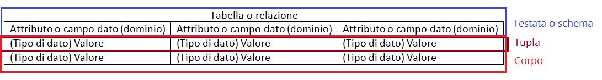

-   ***Tabella (o relazione)***. Termine normalmente usato in
    sostituzione del termine teorico relazione per indicare l'insieme
    delle righe e delle colonne della matrice di dati. La struttura di
    una tabella è specificata da una lista di colonne, ciascuna delle
    quali ha un nome univoco (l'attributo o campo dato), un tipo di dato
    e un dominio, cioè un insieme cioè di valori accettati. Essa è la
    rappresentazione grafica normalmente accettata per rappresentare la
    relazione tra attributi e valori.

<!-- -->

-   ***Attributo (o campo dato)***. Termine usato per indicare
    l'intestazione iniziale di una colonna; ad esso si associa un certo
    **tipo di dato** con il suo **dominio** di possibili valori.

<!-- -->

-   Il **tipo di dato** usato nei database relazionali può essere un
    insieme di numeri interi, un insieme di caratteri alfanumerici,
    l'insieme delle date, i valori booleani vero e falso ecc... I
    corrispondenti "nomi di tipo", ad esempio, saranno dunque le
    stringhe "int", "char", "date", "boolean", etc.

-   Il **dominio** su quel tipo di dato è definito come l'insieme dei
    valori che può assumere un determinato attributo o campo dato; esso
    è un sotto insieme del prodotto cartesiano
    $D_{1} \times D_{2} \times \ldots \times D_{n}$ degli insiemi di
    valori di tipo elementare.

<!-- -->

-   ***Valore*.** È il dato o valore di una cella identificata da una
    specifica coppia riga - colonna, come ad esempio "Mario Rossi" o
    "2006"

    -   **Tupla.** È praticamente la stessa cosa di una riga o record di
        dati o valori, cioè l'insieme non ordinato di valori assunti
        dagli attributi, indicato con $< d_{1},d_{2},..,d_{n} >$.

Il principio base del modello relazionale è che tutte le informazioni
siano rappresentate da valori inseriti in **relazioni** (tabelle);
dunque un database relazionale è *un insieme di relazioni contenenti
valori* e il risultato di qualunque interrogazione (o manipolazione) dei
dati può essere rappresentato anch'esso da relazioni (tabelle).

Una **relazione** è dunque la definizione di una tabella, cioè un
insieme di colonne e righe, cioè attributi o campi dato insieme ai
rispettivi dati o valori che vi compaiono. La definizione della tabella
è la testata iniziale e i dati che vi appaiono sono il corpo cioè un
insieme di righe.

Vincoli di integrità dei dati
-----------------------------

Una relazione non deve (e non può) essere vista come un contenitore di
dati a piacimento di tipo. Se così fosse non riusciremmo più a
interpretare correttamente i dati e molte operazioni non si potrebbero
eseguire in maniera affidabile. Si rende pertanto necessaria un’attività
di analisi rivolta a evidenziare quali sono i vincoli che le nostre
istanze devono soddisfare affinché si possano considerare valide (o
“legali”, “corrette” “ammissibili”, ecc.).

Un vincolo di integrità è una proprietà che deve essere soddisfatta
dalle istanze; ogni vincolo può quindi essere descritto da una funzione
booleana che associa a ogni istanza il valore VERO o FALSO. Essi servono
a migliorare la qualità delle informazioni contenute nella base di dati.

*Es*. Il voto dev’essere compreso tra 18 e 30

La lode può apparire solo se voto = 30

Ogni studente deve avere un numero di matricola

Il numero di matricola di uno studente dev’essere univoco

Esami dati devono fare riferimento solo a corsi offerti

*Prima forma normale (1NF)*

Nel modello relazionale non è in generale possibile usare domini
strutturati (array, set, liste, alberi, …). Vi sono delle eccezioni
notevoli (ad es. le date e le stringhe).

Concisamente, una relazione in cui ogni dominio è “**atomico**” (non
ulteriormente decomponibile), e si dice che è in

**Prima Forma Normale**, o 1NF (1st Normal Form). In molti casi è
pertanto richiesta un’attività di **normalizzazione** dei dati che dia
luogo a relazioni in 1NF preservando l’informazione originale.

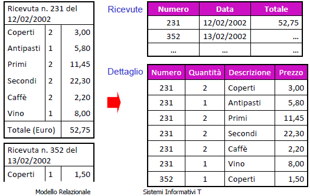{width="3.4930555555555554in" height="2.20625in"}

Il fatto che una rappresentazione normalizzata sia adeguata o meno
dipende (molto) dal contesto.

*Es*. L’ordine delle righe nella ricevuta è rilevante o meno?

Lo stesso dicasi per eventuali ridondanze che si possono venire ad
osservare.

*Es*. Il coperto ed il caffè hanno un prezzo che non varia da ricevuta a
ricevuta?

In generale è bene ricordare che ogni caso presenta una sua specificità,
e quindi non va trattato automaticamente.

Normalizzare in 1NF è, a tutti gli effetti, un’attività di progettazione
(logica), e in quanto tale può essere solo oggetto di “regole guida” che
però non hanno validità assoluta.

*Valori NULL*

Le informazioni che si vogliono rappresentare mediante relazioni non
sempre corrispondono pienamente allo schema prescelto, in particolare
per alcune tuple e alcuni attributi potrebbe non essere possibile
specificare, per diversi motivi, un valore del dominio.

*Es*.

{width="4.0in" height="0.55in"}Lucia Neri non ha
un’email (valore non applicabile). Anna Rossi ha un reddito, ma non lo
conosciamo (applicabile ma ignoto). Anna Rossi non si sa se ha un’email
(ignota l’applicabilità).

In diversi casi, in mancanza di informazione, si tende a usare un
“valore speciale” del dominio (0, “”, “‐1”, ecc.) che non si utilizza
per altri scopi. Questa pratica è fortemente sconsigliata, in quanto,
anche dove possibile:

-   Valori inutilizzati potrebbero successivamente diventare
    significativi

-   Le applicazioni dovrebbero sapere “cosa significa in realtà” il
    valore usato allo scopo

-   Tali valori incidono nel caso di calcoli (es. media, ecc.)

Nel modello relazionale si opera in maniera pragmatica: si adotta il
concetto di valore nullo (NULL), che denota assenza di un valore nel
dominio (e non è un valore del dominio).

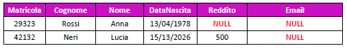{width="4.805383858267716in"
height="0.6746402012248469in"}

La presenza di un valore nullo non fornisce alcuna informazione
sull’applicabilità o meno. È importante ricordare che NULL non è un
valore del dominio; in particolare, se due tuple hanno entrambe valore
NULL per un attributo, non si può inferire che esse abbiano lo stesso
valore per quell’attributo.

D’altro canto, la presenza di valori nulli non può essere sempre
tollerata, ovvero è necessario imporre delle restrizioni al loro uso.

*Es*. Il valore nullo per Matricola non permette di sapere chi ha
sostenuto l’esame; Il valore nullo per Voto non è ammissibile nel
contesto considerato. Istanze di questo tipo non sono accettabili!

*Vincoli di dominio*

Un vincolo che si riferisce ai valori ammissibili per un singolo
attributo viene detto vincolo di dominio (o sui valori). In pratica i
domini che si possono usare dipendono dal DBMS e includono i tipi più
comuni di dati (interi, stringhe, date).

*Es*. Il Voto deve essere compreso tra 18 e 30 (Voto ≥ 18) AND (Voto ≤
30)

La Lode può solo assumere i valori \`SÌ’ o \`NO’ (Lode = \`SÌ’) OR (Lode
= \`NO’)

I vincoli di dominio sono un caso particolare dei vincoli di tupla,
ovvero vincoli che esprimono condizioni su ciascuna tupla,
indipendentemente dalle altre.

*Vincoli di chiave*

Un tipo importantissimo di vincoli sono i vincoli di chiave, che vietano
la presenza di tuple distinte che hanno lo stesso valore su uno o più
attributi.

*Es*. Il valore di Matricola identifica univocamente uno studente, lo
stesso vale per CodiceFiscale.

Chiavi e superchiavi
--------------------

-   Si definisce **chiave** un insieme di uno o più attributi di una
    relazione che identificano univocamente le tuple della relazione
    stessa.

-   Si definisce **superchiave** un insieme di attributi *K* di una
    relazione *r* che non contiene due tuple che hanno valori uguali su
    *K*.

    -   *K* è **superchiave minimale** o **chiave** di *r* se si toglie
        un attributo e non è più superchiave

-   Si definisce **chiave primaria** di una relazione una chiave
    costituita da un attributo aggiunto appositamente per
    l’identificazione univoca delle tuple. Non ammette valori nulli per
    i suoi attributi.

{width="2.095138888888889in"
height="1.1055555555555556in"}*Es*. {Matricola} è una chiave primaria
poiché ha la funzione di identificare univocamente le tuple;

{Cognome,Nome,Nascita} è una chiave poiché l’insieme identifica
univocamente una tupla;

{Matricola,Corso} è una superchiave poiché non hanno valori uguali su K;

{Nome,Corso} non è una superchiave poiché può contenere valori uguali.

*Chiave primaria*

Per evitare problemi di chiavi nulle, è necessario scegliere una chiave,
detta chiave primaria, su cui non si ammettono valori nulli. Ogni riga
della tabella è identificata in maniera univoca da una *chiave
primaria*. I dati di più tabelle possono essere messi in relazione
logica tramite l’uso di chiavi secondarie.

*Chiave esterna (foreign key)*

{width="1.929861111111111in"
height="1.1381944444444445in"}Un insieme di attributi {A~1~, A~2~ , …,
A~n~} di uno schema di relazione R è una **chiave esterna** che
riferisce una chiave primaria {B~1~, B~2~ , …, B~n~} di un altro schema
S se, in ogni istanza valida della base di dati, per ogni n-upla
$r \in R$ esiste una n-upla $s \in S$ (riferita da r) tale che
$\text{r.}A_{i} = s.B_{i}$

*Es*. {Matricola} per **Esami** e’ chiave esterna che si riferisce a
Matricola di **Studenti**, per la quale è chiave primaria.

*Importanza delle chiavi*

L’esistenza delle chiavi garantisce l’accessibilità a ciascun dato del
DB, in quanto ogni singolo valore è univocamente individuato da:

nome della relazione individua una relazione del DB

valore della chiave individua una tupla della relazione

nome dell’attributo individua il valore desiderato

Algebra relazionale
-------------------

Un linguaggio di manipolazione, o **DML**, permette di interrogare e
modificare istanze di Basi di Dati. A parte i linguaggi utente, quali
SQL, esistono altri linguaggi, formalmente definiti, che rivestono
notevole importanza in quanto enfatizzano gli aspetti “essenziali”
dell’interazione con un DB relazionale.

In particolare:

-   **Calcolo relazionale**: linguaggio dichiarativo basato sulla logica
    dei predicati del primo ordine che permette di descrivere le
    proprietà del risultato invece che il modo per ottenerlo.

-   **Algebra relazionale**: linguaggio procedurale di tipo algebrico,
    cioè una descrizione della procedura da attuare per ottenere il
    risultato, i cui operandi sono relazioni.

L'**algebra relazionale** e il collegato **calcolo relazionale** fanno
parte dell'insieme di linguaggi che permettono di esaminare le query
(interrogazioni) da effettuare nell'ambito della gestione di un
database. Calcolo e algebra sono equivalenti in termini di potere
espressivo (“ciò che riescono a calcolare”).

Le operazioni principali da eseguire su un database sono due:

-   **Aggiornamento**: Una funzione che data un’istanza di una base di
    dati produce un’altra basi di dati sullo stesso schema.

-   **Interrogazione**: Una funzione che data una base di dati produce
    una relazione su un dato schema.

*Operatori dell’algebra relazionale*

L'algebra relazionale prevede un set di **operatori** che operano su una
o più relazioni e danno sempre come risultato un'altra relazione. Gli
operatori possono essere combinati per formare espressioni complesse.

L'algebra relazionale ha 6 **operatori di base** e diversi **operatori
derivati**, che possono cioè essere definiti come combinazione di
operatori primitivi.

  -----------------------------------------------------------------------------------------------------------------
  Operatori fondamentali (di base)            Operatori derivati (da quelli di base)
  ------------------------------------------- ---------------------------------------------------------------------
  - operatori binari di Unione                - operatore insiemistico binario di Intersezione
                                              
  - operatori binari di Differenza            - operatore di Join in varie forme (Theta-Join, Natural-Join, etc.)
                                              
  - operatori binari di Prodotto cartesiano   - operatore di Divisione
                                              
  - operatori unari di Selezione              
                                              
  - operatori unari di Proiezione             
                                              
  - operatori unari di Ridenominazione        
  -----------------------------------------------------------------------------------------------------------------

I simboli *R,S,…* denotano relazioni, *A,B,…* denotano attributo e
*X,Y,…* insiemi di attributi.

*Unione, Differenza e Intersezione (*$\cup , \cap , -$*)*

Dato che le relazioni sono degli insiemi ha senso definire su di esse
gli operatori insiemistici tradizionali come unione, differenza e
intersezione. L'unico vincolo è quello di avere delle tuple omogenee
cioè definite sugli stessi attributi.

-   l'unione di due relazioni r1 e r2 definite sullo stesso insieme di
    attributi X è indicata con $\mathbf{r}\mathbf{1 \cup r}\mathbf{2}$
    ed è una relazione ancora su X contenente le tuple che appartengono
    a r1 oppure a r2,senza ripetizioni delle eventuali tuple ripetute.

-   l'intersezione di r1(X) e r2(X) è indicata con
    $\mathbf{r}\mathbf{1 \cap r}\mathbf{2}$ ed è una relazione su X
    contenente le tuple che appartengono sia a r1 che r2.

-   la differenza di r1(x) e r2(x) è indicata come
    $\mathbf{r}\mathbf{1 - r}\mathbf{2}$ ed è una relazione su X
    contenente le tuple che appartengono a r1 e non appartengono a r2.

  Esempio Unione   Esempio Intersezione   Esempio Differenza
  ---------------- ---------------------- --------------------
                                          

*Ridenominazione (*$\delta$*)*

L'operatore di ridenominazione modifica lo schema di una relazione,
cambiando i nomi di uno o più attributi. Quest'operazione è molto utile
per ottenere delle tuple omogenee quando non lo sono anche se il campo
semantico di applicazione della query lo è.

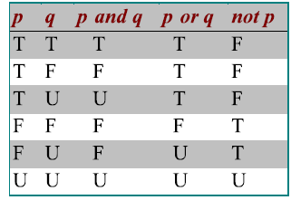{width="2.7194444444444446in"
height="0.9868055555555556in"}

*Es*. “Father” e “Mother” sono attributi con nomi, diversi ma entrambi
sono “Genitori”

Soluzione: *ridenominare* gli attributi.

Sia r una relazione definita sull'insieme di attributi X e sia Y un
(altro) insieme di attributi con ordinamento per gli attributi in X e un
ordinamento per quelli in Y. Allora la ridenominazione
$\mathbf{\text{δ\ }}\mathbf{B}_{\mathbf{1}}\mathbf{B}_{\mathbf{2}}\mathbf{,\ldots}\mathbf{B}_{\mathbf{k}}\mathbf{\leftarrow}\mathbf{A}_{\mathbf{1}}\mathbf{,}\mathbf{A}_{\mathbf{2}}\mathbf{,}\mathbf{\ldots A}_{\mathbf{k}}\left( \mathbf{r} \right)$
contiene una tupla t' per ciascuna tupla t in r, definita come segue: t'
è una tupla su Y e
$t^{'}\left\lbrack B_{i} \right\rbrack = t\left\lbrack A_{i} \right\rbrack$,
per i = 1,..., n. La definizione conferma che ciò che cambia sono i nomi
degli attributi, mentre i valori rimangono inalterati e vengono
associati ai nuovi attributi.

  Esempio di Ridenominazione
  ----------------------------------------------------------------------------------
  {width="2.826087051618548in" height="2.020688976377953in"}

*Prodotto cartesiano (*$\times$*)*

È definito solo nel caso in cui le relazioni non abbiano attributi in
comune, e al contrario dell'omonimo operatore sugli insiemi, il
risultato non è un insieme di tuple, ma un'unica tupla composta dalle
due tuple delle relazioni originarie.

Siano $R\left( A_{1}:T_{1},\ldots,A_{n}:T_{n} \right)$ ed
$S\left( A_{n + 1}:T_{n + 1},\ldots,A_{n + m}:T_{n + m} \right)$ con
$\left\{ A_{1},\ldots,A_{n} \right\} \cap \left\{ A_{n + 1},\ldots,A_{n + m} \right\} = \varnothing$.
Allora si pone $\mathbf{R \times S}$.

  Esempio di Prodotto Cartesiano
  --------------------------------

*Selezione (*$\sigma_{\lambda}$*)*

Sia R una relazione, allora
$\mathbf{\sigma}_{\mathbf{\lambda}}\mathbf{(R)}$**,** dove $\lambda$ è
una formula proposizionale costituta a partire da $\text{A\ θ\ B}$ e
utilizzando i connettivi proposizionali $\neg, \land , \vee$. A e B sono
attributi di R o costanti, mentre
$\theta \in \{ = , < , > , \neq , \leq , \geq \}$.

La selezione da una tabella non è altro che l'insieme di righe che
appartengono alla tabella e che soddisfano una serie di condizioni
indicate nella selezione stessa.

  Esempio di Selezione
  ----------------------

*Proiezione (*$\pi$*)*

Sia R una relazione, e siano $A_{1},A_{2},\ldots,A_{n}$ alcuni suoi
attributi, allora $\pi_{A1,A2,\ldots An}\left( R \right)$

L'operatore di proiezione effettua una modifica al *grado* della
relazione a cui si applica. Il simbolo è $\mathbf{\pi}$ , a pedice del
quale viene indicata la lista degli attributi che costituiscono la nuova
relazione, tali attributi sono un sottoinsieme degli attributi della
relazione originale. La proiezione produce una relazione $r_{p}$ il cui
schema è l'insieme degli attributi $A_{n}$ e la cui istanza è la
restrizione delle tuple r di sugli attributi $A_{n}$.

  Esempio di Proiezione
  -----------------------

Formalmente la proiezione elimina le tuple che dovessero risultare
duplicate nella relazione finale, infatti istanze con presenza di tuple
duplicate non sono ammesse dal modello relazionale.

Join ($\mathbf{\bowtie}$)
-------------------------

Join (o giunzione) è l’operatore più importante dell’algebra
relazionale. Il join è un'operazione binaria che si applica a due
relazioni $R\left( A_{1},A_{2},\ldots,A_{m} \right)$ ed
$S\left( B_{1},B_{2},\ldots,B_{n} \right)$. La funzione del join è unire
tuple logicamente collegate delle due relazioni in un'unica tupla. La
relazione risultante
$\text{Rj}\left( A_{1},A_{2},\ldots,A_{m},B_{1},B_{2},\ldots,B_{n} \right)$
ha come schema l'insieme degli attributi di R ed S, mentre l'estensione
viene espressa come il prodotto cartesiano di R ed S seguito dalla
selezione delle tuple che soddisfano la condizione di join. Permette di
combinare tuple da relazioni diverse basandosi sui valori degli
attributi. Fondamentalmente abbiamo due tipi (più qualche variante):
Natural-JOIN e Theta-JOIN.

*Natural-JOIN*

Sia R con attributi XY ed S con attributi YZ. $R \bowtie S$ è una
relazione di attributi XYZ costituita da tutte le n-uple t tali che
$t\left\lbrack \text{XY} \right\rbrack \in R,\ t\left\lbrack \text{YZ} \right\rbrack \in S$.
Cioè le n-uple del risultato sono ottenute combinando le n-uple di R e S
che hanno gli stessi valori negli attributi con lo stesso nome.

In presenza di due attributi uguali, viene rinominato l'attributo comune
in una delle due relazioni e viene eliminata una delle colonne che
risultano uguali. Nel natural-join, quindi, la condizione di join è
implicita, e lo schema della relazione risultante è l'insieme degli
attributi di R ed S meno uno degli attributi uguali.

1

  Esempio di Natural-JOIN   Altro esempio di Natural-JOIN
  ------------------------- -------------------------------
                            

*Theta-JOIN*

Nel caso che il criterio di selezione delle tuple sia determinato da un
operatore di confronto (&lt;,&gt;,=,ecc.) si può parlare di theta-join.
È un’estensione del natural-join dove viene specificato un predicato per
la selezione delle n-uple. Esso è un operatore derivato:

$$R \bowtie_{f}S = \sigma_{F}\left( R \times S \right)$$

Un caso particolare del theta-join è l'**equi-join**, in cui si applica
l'operatore di uguaglianza, quindi nella formula *F* è una congiunzione
di uguaglianza.

  Esempio di Equi-JOIN
  ----------------------

*Casi di JOIN*

-   *JOIN incompleti*: sono dei join nel caso in cui alcuni valori tra
    gli attributi comuni non coincidono, quindi alcune n-uple non
    partecipano al JOIN.

-   *JOIN vuoti*: sono dei join nel caso in cui nessuna n-upla trova il
    corrispettivo

  Esempio di JOIN incompleto   Esempio di JOIN vuoto
  ---------------------------- -----------------------
                               

*Giunzione esterna*

Esiste una particolare giunzione chiamata **Outer JOIN**, definita una
giunzione esterna, cioè una variante del JOIN per mantenere nel
risultato le n-uple che non partecipano al JOIN; in questo caso gli
attributi delle *dangling* (penzoloni) n-uple vengono riempiti con NULL.
Abbiamo tre varianti:

-   Left: vengono presi tutti i valori del primo operando, e alcuni di
    essi posso diventare dangling;

-   Right: vengono presi tutti i valori del secondo operando, e alcuni
    di essi posso diventare dangling;

-   Full: vengono presi tutti i valori, e alcuni sia del primo che del
    secondo operando posso diventare dangling.

  Esempio di Natural Outer JOIN
  -------------------------------

La giunzione esterna è la giunzione naturale estesa con tutte le n-uple
che non appartengono alla giunzione naturale, completate con valori null
per gli attributi mancanti. Siano R\[XY\],S\[YZ\], $R\begin{matrix}
 \leftrightarrow \\
\infty \\
\end{matrix}S = \left( R\infty S \right) \cup (\left( R - \pi_{\text{XY}}\left( R\infty S \right) \right) \times \left\{ Z = \text{null} \right\} \cup \left\{ X = \text{null} \right\} \times \left( \left( S - \pi_{\text{YZ}}\left( R\infty S \right) \right) \right)$.

Nelle giunzioni esterne sinistre e destre si aggiungono solo le parti
sinistre e destre. Siano R\[XY\],S\[YZ\]

-   Giunzione esterna sinistra:
    $R\infty^{\leftarrow}S = \left( R\infty S \right) \cup \left( \left( R - \pi_{\text{XY}}\left( R\infty S \right) \right) \times \left\{ Z = null \right\} \right)$

-   Giunzione esterna destra:
    $R\infty^{\rightarrow}S = \left( R\infty S \right) \cup \left( \left\{ X = null \right\} \times \left( S - \pi_{\text{YZ}}\left( R\infty S \right) \right) \right)$

*Perché Join è derivato*

Siano $R\left( A_{1}:T_{1},\ldots,A_{n}:T_{n} \right)$ ed
$S\left( A_{n + 1}:T_{n + 1},\ldots,A_{n + m}:T_{n + m} \right)$ con
$\left\{ A_{1},\ldots,A_{n} \right\} \cap \left\{ A_{n + 1},\ldots,A_{n + m} \right\} = \varnothing$.
Allora si pone

$R\infty_{Ai = Ak}S = \{ tu|t\ in\ R,\ u\ in\ S,\ t.A_{i} = u.A_{k}\}$ e
$i = 1\ldots n,\ k = n + 1\ldots n + m$

L’equi-JOIN è derivato perché
$R\infty_{Ai = Ak}S = \sigma_{Ai = Ak}\left( R \times S \right)$.

Siano R con attributi XY ed S con attributi YZ. $R \times S$ è una
relazione di attributi XYZ costituita da tutte le n-uple t tali che:
t\[XY\] in R, t\[YZ\] in S,
$R\infty S = \left\{ t \middle| \left\lbrack \text{XY} \right\rbrack\ in\ R \land t\left\lbrack \text{YZ} \right\rbrack\text{\ in\ S} \right\}$.

Il Natural-JOIN è derivato perché si rinominano gli attributi Y in S
come Y’ e si ottiene S’. Si opera l’equijoin rispetto ad Y e Y’. Si
proietta rispetto a XYZ.
$R\infty S = \pi_{\text{XYZ}}\left( R\infty_{Y = Y^{'}}S^{'} \right)$.

*Proprietà del JOIN*

Il JOIN è

- Commutativo $R\infty S = S\infty R$

- Associativo
$\left( R\infty S \right)\infty T = R\infty\left( S\infty T \right)$

Quindi possiamo avere sequenze di JOIN senza rischio di ambiguità.

  Esempio di JOIN multipli
  --------------------------

*Prodotto cartesiano a partire dal JOIN*

Il JOIN è definito anche se non ci sono attributi comuni fra le
relazioni. In questo caso, non essendoci vincoli sulle tuple da
selezionare, vengono selezionate tutte le tuple dalle relazioni del JOIN
e quindi otteniamo un prodotto cartesiano.

  Esempio di prodotto cartesiano generato dal JOIN
  --------------------------------------------------

Dati due relazioni definite sulla stessa lista di attributi, allora il
natural join coincide con l’intersezione delle due relazioni.

*Semi-JOIN*

Siano R con attributi XY ed S con attributi YZ; $R \ltimes S$ è una
relazione di attributi XY costituita da tutte le n-uple di R che
partecipano a $R\infty S$. La semi-giunzione è derivata perché
$R \ltimes S = \pi_{\text{XY}}\left( R\infty S \right)$

  Esempio di Semi-Giunzione
  ---------------------------

Altri operatori relazionali
---------------------------

*Unione esterna*

Siano R\[XY\],S\[YZ\] due relazioni, allora l’unione esterna
$R \cup^{\leftrightarrow}S$ si ottiene estendendo le due tabelle con le
colonne dell’altro con valori nulli e si fa l’unione.

  Esempio di Unione esterna
  ---------------------------

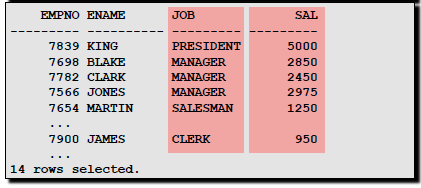{width="2.1041666666666665in"
height="1.0083333333333333in"}*Selezione con valori nulli*

La condizione del SEL in questo caso è atomica, cioè non divisibile in
condizioni più semplici. La condizione atomica è vera solo per valori
non nulli.

Se facciamo
$\text{SE}L_{Eta > 30}\left( \text{Persone} \right) \cup SEL_{Eta \leq 30}\left( \text{Persone} \right) \neq Persone$

Perché le selezioni vengono valutate separatamente. Ma anche

$$\text{SE}L_{Eta > 30 \vee Eta \leq 30}\left( \text{Persone} \right) \neq Persone$$

Perché anche le condizioni atomiche vengono valutate separatamente.

Facendo $\text{SE}L_{Eta > 40}\left( \text{Impiegati} \right)$ la
condizione atomica è vera solo per valori non nulli per riferirsi ai
valori nulli esistono forme apposite di condizioni:

-   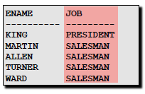{width="1.6388888888888888in"
    height="1.1270833333333334in"}IS NULL

-   IS NOT NULL

Si potrebbe usare una "logica a tre valori" (vero T, falso F,
sconosciuto U) di cui abbiamo la tabella di verità a sinistra. Una
selezione produce come risultato le ennuple per cui il predicato di
selezione è vero; in molti casi la logica a tre valori produce un
risultato sensato, in altri no.

Quindi
$\text{SE}L_{Eta > 30}\left( \text{Persone} \right) \cup SEL_{Eta \leq 30}\left( \text{Persone} \right) \cup SEL_{Eta\ IS\ NULL}\left( \text{Persone} \right) = SEL_{Eta > 30 \vee Eta \leq 30 \vee Eta\ IS\ NULL}\left( \text{Persone} \right) = Persone$

{width="2.263888888888889in"
height="0.6041666666666666in"}

*Es*. Dalla tabella “Impiegati” voglio prendere tutti quelli con
Età&gt;40 e anche i NULL. Faccio dunque:

$$\text{SE}L_{\left( Eta > 40 \right)\text{OR}\left( Eta\ IS\ NULL \right)}\left( \text{Impiegati} \right)$$

*Quoziente (divisione)*

La divisione è un'operazione binaria che si applica a due relazioni r ed
s, rispettivamente con schemi relazionali
$R = \left( A_{1},\ldots,A_{m} \right)$ ed
$S = \left( A_{i1},\ldots,A_{\text{in}} \right)$, dove S è un
sottoinsieme proprio di R (e quindi $m - n > 0$ sempre).

La relazione risultante $r\backslash s$ è detta quoziente della
divisione r per s e ha come schema $R - S$, cioè l’insieme degli
attributi di R non compresi in S. In essa saranno presenti tutte (e
solo) le tuple che possano essere combinate con una qualsiasi tupla di s
in modo tale che la tupla risultante appartenga ad r.

Siano XY gli attributi di R, ed Y quelli di S, allora
$R/S = \left\{ w \middle| \left\{ w \right\} \times S \subseteq R \right\}$.

La divisione serve a rispondere a query del tipo: trova tutte le n-uple
di R associate a tutte le nuple di S.

*Es*.
$\{^{'}\text{DB}I^{'},'\text{Progr}'\} = \pi_{\text{Corso}}\sigma_{\text{Corso} =^{'}\text{DB}I^{'} \vee \text{Corso} =^{'}\text{Prog}r^{'}}(\text{Esami})(\pi_{\text{Matricola},\ \text{Corso}}\text{Esami})/\{'\text{DBI}','\text{Progr}'\} =$
matricole di studenti che hanno superato DBI e Progr.

Viste nel modello relazionale
-----------------------------

Le viste sono un elemento utilizzato dalla maggior parte dei DBMS. Si
tratta, come suggerisce il nome, di "modi di vedere i dati", ovvero
rappresentazioni diverse per gli stessi dati.

Altro non sono che espressioni a cui viene assegnato un nome (come un
assegnazione di un valore in JAVA). È quindi possibile utilizzare le
viste all’interno di altre espressioni, il che semplifica la scrittura
di espressioni complesse. La sintassi è **V:=E**, in cui V è il nome
della vista.

*Es*.
$\text{ProgettiRossi} \sigma_{\text{Nome} =^{'}\text{Ross}i^{'}}\left( \text{Ricercatori} \bowtie \text{Progetti} \right)$

*Rappresentazione di una vista*

{width="2.5347222222222223in"
height="2.0097222222222224in"}Una vista è rappresentata da una query
(SELECT), il cui risultato può essere utilizzato come se fosse una
tabella. Da un punto di vista fisico esistono diversi modi di fare
questo. Generalmente i DBMS rielaborano le query sulle viste in modo che
agiscano sulle tabelle che fanno parte della vista stessa. Ad esempio
possono farlo trattando la SELECT che compone la vista come se fosse una
subquery delle query eseguite su di essa (questo è il modo più semplice,
ma essendo poco prestante i DBMS dovrebbero farlo solo in casi
particolari).

-   *Relazioni derivate*: relazioni il cui contenuto è funzione del
    contenuto di altre relazioni (definito per mezzo di interrogazioni)

-   *Relazioni di base*: contenuto autonomo; le relazioni derivate
    possono essere definite su altre derivate

Una vista può essere composta da una o più tabelle.

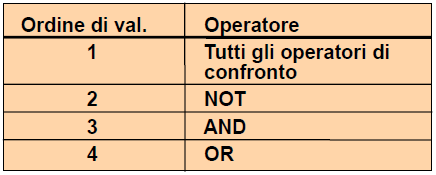{width="2.3604166666666666in"
height="0.5861111111111111in"}

*Es*. Una vista potrebbe essere:

$$Supervisione = PROJ_{Impiegato,Capo}(Afferenza\ JOIN\ Direzione)$$

*Viste materializzate*

Relazioni derivate memorizzate nella base di dati. Supportate da alcuni
DBMS come Oracle, si tratta di viste che vengono scritte fisicamente su
disco per consentirne una lettura più rapida. I dati ivi contenuti
vengono aggiornati automaticamente a intervalli regolari dal DBMS.
Queste viste vengono utilizzate di solito per applicazioni di
datawarehousing (archivi informatici contenenti i dati di
un'organizzazione).

  -------------------------------------------------------------------------------------------------
  **Pro**                                                   **Contro**
  --------------------------------------------------------- ---------------------------------------
  - Dati immediatamente disponibili per le interrogazioni   - Ridondanti (perdita di significato)
                                                            
                                                            - Appesantiscono gli aggiornamenti
                                                            
                                                            - Raramente supportate dai DBMS
  -------------------------------------------------------------------------------------------------

*Viste virtuali*

Sono le normali viste supportate da tutti i DBMS; una interrogazione su
una vista viene eseguita "ricalcolando" la vista. Le interrogazioni dono
eseguite sostituendo alla vista la sua definizione:

$\text{SE}L_{\text{Capo} =^{'}\text{Leon}i^{'}}(Supervisione)$ viene
eseguita come

$\text{SE}L_{\text{Capo} =^{'}\text{Leon}i^{'}}\left( \text{PRO}J_{Impiegato,Capo}\left( \text{Afferenza\ JOIN\ Direzione} \right) \right)$

*Scopo delle viste*

Le viste generalmente vengono utilizzate per semplificare le query. Se
il database è realmente relazionale, leggere un insieme di dati avente
un significato potrebbe essere complesso, perché potrebbe richiedere
eccessive JOIN fra tabelle; con una vista è possibile semplificare molto
la stesura di query che leggono le informazioni.

Un altro scopo delle viste potrebbe essere semplificare o potenziare la
gestione dei permessi. Ad esempio si potrebbe creare una query che legge
solo alcuni dati da una tabella, per poi assegnare il permesso in
lettura ad un certo utente sulla vista, ma non sulla tabella di base. In
questo modo l'utente non vedrà i dati che non vengono estratti dalla
vista.

{width="2.325in" height="1.1118055555555555in"}

*Es*. Trovare gli impiegati che hanno lo stesso capo di Rossi.

*Query (interrogazioni)*

L’algebra relazionale può quindi essere usata per interrogare una base
di dati. Una query è una funzione da una istanza di un database (insieme
di relazioni) ad una relazione.

Algoritmo di Ottimizzazione della Query
---------------------------------------

Un algoritmo di ottimizzazione di una query cerca di determinare il modo
più efficiente di eseguire una data query considerando la sua
implementazione base. Due espressioni sono equivalenti se producono lo
stesso risultato qualunque sia l'istanza attuale della base di dati.
L'equivalenza è importante in pratica perché i DBMS cercano di eseguire
espressioni equivalenti a quelle date, ma meno "costose".

La *Push selection* è un esempio di equivalenza importante, se A è
attribuito di $R_{2}$

$$\text{SE}L_{A = 10}\left( R_{1}\text{\ JOIN\ }R_{2} \right) = R_{1}\text{\ JOIN\ SE}L_{A = 10}\left( R_{2} \right)$$

Essa riduce in modo significativo la dimensione del risultato intermedio
(e quindi il costo dell'operazione).

*Es*. Supponiamo che vogliamo trovare tutti i professori che hanno dato
a Mario Rossi più di 27.

$\pi_{\text{Professore}}\sigma_{\text{Nome} =^{'}\text{Mario\ Ross}i^{'}\ \&\ Voto > 27}\left( Studenti \bowtie Esami \bowtie Corsi \right)$

La stessa query può essere espressa come

$\pi_{\text{Professore}}\left( \sigma_{\text{Nome} =^{'}\text{Mario\ Ross}i^{'}}Studenti \bowtie \left( \sigma_{Voto > 27}Esami \bowtie Corsi \right) \right)$

Che risulta essere molto più efficiente. Abbiamo applicato una query
optimization.

*Regole per la query optimization*

Anticipare l’applicazione delle proiezioni e delle restrizioni rispetto
al prodotto (e quindi alle giunzioni), in modo da ridurre la dimensione
delle tabelle a cui applicare il prodotto (e le giunzioni).

Le seguenti regole possono essere utilizzate per l’ottimizzazione di
espressioni:

1.  Raggruppamento di restrizioni:
    $\sigma_{C\left( X \right)}\left( \sigma_{C\left( Y \right)}\left( E \right) \right) = \sigma_{C\left( X \right)\& C(Y)}\left( E \right)$

2.  Atomizzazione delle selezioni:
    $\sigma_{C\left( X \right)\& C(Y)}\left( E \right) = \sigma_{C\left( X \right)}\left( \sigma_{C\left( Y \right)}\left( E \right) \right)$

*Es*.
$\text{PRO}J_{\text{HEAD}}\left( \text{SE}L_{\text{Number} = \text{Employee}\  \land \ \text{Age} < 30}\left( \text{Employees} \times \text{Supervision} \right) \right)$

$\text{PRO}J_{\text{HEAD}}$
$\left( \text{SE}L_{\ \text{Number} = \text{Employee}}\left( \text{SE}L_{\text{Age} < 30}\left( \text{Employees} \times \text{Supervision} \right) \right) \right)$

$\text{PRO}J_{\text{HEAD}}$
$\left( \text{SE}L_{\ \text{Number} = \text{Employee}}\left( \text{SE}L_{\text{Age} < 30}\left( \text{Employees}) \times \text{Supervision} \right) \right) \right)$

1.  Commutatività di $\sigma$ e $\pi$:
    $\sigma_{C\left( X \right)}\left( \pi_{Y}\left( E \right) \right) = \pi_{Y}\left( \sigma_{C\left( X \right)}\left( E \right) \right),$
    se $X \subseteq Y$;

> $\pi_{Y}(\sigma_{C\left( X \right)}\left( \pi_{\text{XY}}\left( E \right) \right) = \pi_{Y}\left( \sigma_{C\left( X \right)}\left( E \right) \right)$
> se $X \nsubseteq Y$

1.  Anticipazione di $\sigma$ rispetto a x:
    $\sigma_{C\left( X \right)}\left( E \times F \right) = \sigma_{C\left( X \right)}\left( E \right) \times F,$
    se $X \subseteq attr\left( E \right)$

> $\sigma_{C\left( X \right)\& C(Y)}\left( E \times F \right) = \sigma_{C\left( X \right)}\left( E \right) \times \sigma_{C\left( Y \right)}\left( F \right)$,
> se $X \subseteq attr\left( E \right),\ Y \subseteq attr(F)$
>
> $\sigma_{C\left( X \right)\& C(Y)\& C(Z)}\left( E \times F \right) = \sigma_{C\left( Z \right)}\left( \sigma_{C\left( X \right)}\left( E \right) \times \sigma_{C\left( Y \right)}\left( F \right) \right),$
> se
> $\ X \subseteq attr\left( E \right),\ Y \subseteq attr\left( F \right),\ Z \cap attr\left( E \right) \neq \varnothing,\ Z \cap attr\left( F \right) \neq \varnothing$

1.  Raggruppamento di proiezioni:
    $\pi_{x}\left( \pi_{Y}\left( E \right) \right) = \pi_{x}\left( E \right),$
    se $X \subseteq Y$

2.  Eliminazione di proiezioni superflue: $\pi_{X}\left( E \right) = E$,
    se $X = attr\left( E \right)$

3.  Anticipazione della $\pi$ rispetto a x:
    $\pi_{\text{XY}}\left( E \times F \right) = \pi_{X}\left( E \right) \times \pi_{Y}\left( F \right)$,
    se
    $X \subseteq attr\left( E \right),\ Y \subseteq attr\left( F \right)$.

*Algoritmo per anticipare la selezione*

Si applicazioni le seguenti tre regole

a.  Si anticipa $\sigma$ rispetto a $\pi$ usando la 3
    $\pi_{Y}\left( \sigma_{C\left( X \right)}\left( E \right) \right) = \sigma_{C\left( X \right)}\left( \pi_{Y}\left( E \right) \right)$;

b.  Si raggruppano le restrizioni usando la 1
    $\sigma_{C\left( X \right)}\left( \sigma_{C\left( Y \right)}\left( E \right) \right) = \sigma_{C\left( X \right)\& C(Y)}\left( E \right)$

c.  Si anticipa l’esecuzione di $\sigma$ su $\times$ usando la 4

*Algoritmo per anticipare le proiezioni*

a.  Si eliminano le proiezioni superflue usando la 6
    $\pi_{x}\left( E \right) = E$, se $X = attr\left( E \right)$

b.  Si raggruppano le proiezioni mediante la regola 5
    $\pi_{x}\left( \pi_{Y}\left( E \right) \right) = \pi_{x}\left( E \right)$,
    se $X \subseteq Y$

c.  Si anticipa l’esecuzione delle proiezioni rispetto al prodotto
    usando ripetutamente la 3

> $\lbrack\pi_{y}\left( \sigma_{C\left( X \right)}\left( \pi_{\text{XY}}\left( E \right) \right) \right) = \pi_{y}\left( \sigma_{C\left( X \right)}\left( E \right) \right)$
> se $X \nsubseteq Y$ quando E è un prodotto, applicata da destra verso
> sinistra\] e la 6 \[Anticipazione della $\pi$ rispetto a $\times$\].

*Distributività*

-   $\sigma_{c}\left( R_{1} \cup R_{2} \right) = \sigma_{C}\left( R_{1} \right) \cup \sigma_{c}\left( R_{2} \right)$

-   $\sigma_{c}\left( R_{1} - R_{2} \right) = \sigma_{C}\left( R_{1} \right) - \sigma_{c}\left( R_{2} \right)$

-   $\pi_{X}\left( R_{1} \cup R_{2} \right) = \pi_{X}\left( R_{1} \right) \cup \pi_{x}\left( R_{2} \right)$

-   NON VALE
    $\pi_{X}\left( R_{1} - R_{2} \right) = \pi_{x}\left( R_{1} \right) - \pi_{x}\left( R_{2} \right)$

-   $\sigma_{c\  \vee D}\left( R \right) = \sigma_{C}\left( R \right) \cup \sigma_{D}\left( R \right)$

-   $\sigma_{c\  \land \ D}\left( R \right) = \sigma_{c}\left( R \right) \cap \sigma_{D}\left( R \right)$

-   $\sigma_{c\  \land \ D}\left( R \right) = \sigma_{C}\left( R \right) - \sigma_{D}\left( R \right)$

SQL: DDL e DML
==============

L’SQL (Structured Query Language) è un linguaggio standardizzato per
database basati sul modello relazionale progettato per inglobare (come
nell’algebra relazionale) i seguenti linguaggi:

  **Data-Definition Language (DDL)**     Consente all’utente di creare nuovi database e di specificarne i loro **schemi** (logici, esterni, fisici) la loro strutturazione logica.
  -------------------------------------- -------------------------------------------------------------------------------------------------------------------------------------------
  **Data Manipulation Language (DML)**   Dà agli utenti la possibilità di inserire, gestire e modificare **istanze** di basi di dati.
  **Data Query Language (DQL)**          Consente di avviare interrogazioni, sia semplici che complesse, dei dati memorizzati.
  **Data Control Language (DCL)**        Consente allo sviluppatore di database di creare e gestire strumenti di controllo e accesso ai dati.

Caratteristiche generali dell’SQL
---------------------------------

SQL è *relazionalmente completo*, nel senso che ogni espressione
dell’algebra relazionale può essere tradotta in SQL; dunque, a
differenza del nome, non si tratta dunque solo di un semplice query
language, ma include anche gli altri linguaggi tipici per la
progettazione e gestione/amministrazione del database.

SQL è un linguaggio *dichiarativo* (non‐procedurale), ovvero non
specifica la sequenza di operazioni da compiere per ottenere il
risultato.

Il modello dei dati di SQL è basato su **tabelle** anziché relazioni:
possono essere presenti righe (tuple) duplicate; in alcuni casi l’ordine
delle colonne (attributi) ha rilevanza. Il motivo è pragmatico (ossia
legato a considerazioni sull’efficienza).

*Storia*

Esso è stato sviluppato alla IBM nel 1973 ed è lo standard per tutti i
sistemi commerciali ed open source (Oracle, Informix, Postgres, MySql,
Sybase, DB2 etc..). Esistono sistemi commerciali che utilizzano
interfacce tipo QBE:ACCESS. Tuttavia hanno sistemi per la traduzione
automatica in SQL.

Esistono diversi standard come SQL-86/89/, SQL-2 del 1992 e SQL 3 del
99/2003. SQL-3 introduce i trigger, le viste ricorsive, e il supporto
per il paradigma ad oggetti. Faremo riferimento fondamentalmente a
SQL-92.

Data Definition Language (DDL) in SQL
-------------------------------------

Il DDL di SQL permette di:

1)  Definire schemi di relazioni (o “table”, tabelle), modificarli ed
    eliminarli;

2)  Permette di specificare vincoli, sia a livello di tupla (o “riga”)
    che a livello di tabella;

3)  Permette di definire nuovi **domini**, oltre a quelli predefiniti
    (per vincoli e domini si può anche fare uso del DML)

4)  Permette di definire viste (“view”), ovvero tabelle virtuali

5)  Altro ancora (ad es. schemi = spazi di nomi) si vedranno in
    laboratorio

Ad ogni utente tipicamente viene associata una base di dati, creata
dall’amministratore del sistema. L’utente diventa l’amministratore di
quella base di dati, potendo stabilire gli accessi di eventuali altri
utenti alla sua base di dati.

La creazione consiste nel definire incrementalmente uno **schema** con
un certo nome, interattivamente o da programma, e tutti i suoi elementi
vengono registrati in un catalogo.

*CREATE SCHEMA*

  --------------------------
  **CREATE SCHEMA** Nome
  
  **AUTHORIZATION** Utente
  
  *Definizioni*
  --------------------------

Con questo comando si crea il database chiamato *Nome;*

*Utente* è l’amministratore;

*Definizoni* creano gli elementi dello schema (Tabelle, Viste, Indici,
ecc.).

*CREATE TABLE*

  -----------------------------
  **CREATE TABLE** Studenti (
  
  Matricola char(5),
  
  Cognome varchar(30),
  
  Nome varchar(30),
  
  DataNascita date )
  -----------------------------

Una **CREATE TABLE** definisce uno schema di relazione e ne crea
un’istanza vuota, specifica **attributi**, **domini** e **vincoli** di
tali attributi.

*Domini*

Un dominio è un insieme di valori accettati, ovvero un range di valori
che possiamo immettere nel valore del dato. I domini possono essere
**elementari**, cioè quelli predefiniti dal DBMS, o **definiti
dall’utente**.

I domini elementari possono essere *caratteri*, ovvero singoli caratteri
o stringhe, anche di lunghezza variabile; *numerici*, esatti e
approssimati; *data, ora*; sistemi diversi che estendono il set di base
con domini non standard (vettori, periodi, ecc.).

Riepilogando, i tipi con i relativi domini sono:

-   CHAR(n): stringhe di lunghezza fissa n
    $\left( 1 \leq n \leq 254 \right)$

-   VARCHAR(n): stringhe di lunghezza variabile con al massimo n
    caratteri $\left( n < 32672 \right)$

-   INTEGER: interi a 4 byte

-   SMALLINT: interi a 2 byte

-   DECIMAL(p,s) o NUMERIC(p,s): numeri decimali, di cui p precisione
    (numero totale di cifre), 1 ≤ p ≤ 31 e s scala (numero di cifre a
    destra del punto decimale), 0 ≤ s ≤ p.

-   REAL: numeri reali a 32 bit, singola precisione floating-point

-   FLOAT(p) o DOUBLE(p): numeri a 64 bit, doppia precisione
    floating-point (es. 0.17E16)

-   DATE: 10 byte ‐ DD‐MM‐YYYY (giorno, mese e anno)

-   TIME: 8 byte ‐ HH.MM.SS (ore, minuti e secondi)

-   TIMESTAMP: 26 byte ‐ YYYY‐MM‐DD‐HH‐MM‐SS‐NNNNNN (anno, mese, giorno,
    ora, minuti, sec. e nanosec.)

-   BOOLEAN: in DB2 il tipo boolean NON può essere usato per definire il
    dominio di un attributo

  -------------------------------------------
  **CREATE DOMAIN** Voto
  
  AS SMALLINT DEFAULT NULL
  
  CHECK (value &gt;= 18 AND value &lt;= 30)
  -------------------------------------------

Per definire un dominio si usa l’istruzione CREATE DOMAIN, il quale
definisce un dominio (semplice), utilizzabile in definizioni di
relazioni, anche con vincoli e valori di default.

*Drop (cancellazione) schema*

Mediante l’istruzione **DROP TABLE** è possibile eliminare lo schema di
una tabella (e conseguentemente la corrispondente istanza).

  ----------------------------
  **DROP SCHEMA** Nome
  
  **\[RESTRICT | CASCADE\]**
  ----------------------------

Cancella la base di dati *Nome*, se con il comando *Restrict*, il drop
non viene eseguito se il database non è vuoto; se con *Cascade* vengono
rimossi automaticamente tutti i dati presenti nel database.

DML - Operazioni sui dati
-------------------------

La modifica delle tabelle avviene tramite i comandi **INSERT**,
**DELETE** e **UPDATE**.

*Insert*

Il comando ha la funzione di inserire i dati nelle tabelle. Le colonne
(o campi) di destinazione dei valori possono essere o meno dichiarate
nel comando. Se non vengono dichiarate, è necessario passare al comando
un valore per ogni colonna della tabella, rispettando rigorosamente
l'ordine delle colonne stesse. Se, invece, le colonne di destinazione
vengono dichiarate, è possibile indicare le sole colonne per le quali
vengono passati dei valori, purché vengano inseriti comunque i valori
per tutte le colonne *not null* (che non possono essere nulle) della
tabella.

  ---------------------------------
  **INSERT INTO** Esami
  
  **VALUES** (‘DB1’, 123456, 27),
  
  (‘PRG1’,123457,30)
  ---------------------------------

Di per sé il comando insert opera inserendo in tabella una sola riga per
volta. È possibile, però, inserire più di una riga "in modo automatico"
passando all'insert una serie di righe (o tuple) risultanti da un
comando di select, purché tali righe siano compatibili con le colonne
della tabella su cui si inseriscono i dati. Se la lista non include
tutti gli attributi, i restanti assumono valore NULL (se ammesso) o il
valore di default (se specificato)

*Update*

Il comando *update* ha la tripla funzione di modificare i dati delle
tabelle. Il nome di ogni campo che deve essere modificato va dichiarato
dopo la parola chiave **SET** e deve essere seguito dal simbolo " = "
(uguale) e dal nuovo valore che deve assumere. È possibile modificare
più campi della stessa riga in un unico comando update, separandoli
l'uno dall'altro con il simbolo ", " (virgola).

Il comando generico aggiorna tutte le righe della tabella. È possibile
restringerne il numero applicando la parola chiave aggiuntiva **WHERE**,
che permette di effettuare una selezione qualitativa delle righe
imponendo delle condizioni sui dati presenti nelle righe prima
dell'aggiornamento.

  --------------------
  **UPDATE** Aule
  
  **SET** Aula = 126
  
  **WHERE** Aula = 3
  --------------------

Nell’esempio aggiorniamo l’aula 3 in 126

*Delete*

  ------------------------------
  **DELETE FROM** Esami
  
  **WHERE** Matricola = 123456
  ------------------------------

Il comando **DELETE** ha la funzione di cancellare i dati dalle tabelle.
Come il comando update anche delete può operare in modo generico
cancellando tutte le righe della tabella oppure può identificare le
righe da cancellare mediante la parola chiave aggiuntiva **WHERE** e la
condizione (o le condizioni) ad essa associata.

Vincoli di integrità
--------------------

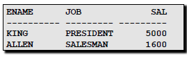{width="2.1569444444444446in"
height="1.8020833333333333in"}Un **vincolo di integrità** dei dati è una
proprietà che deve essere soddisfatta dalle istanze di una base di dati.
Ogni vincolo può essere visto come un predicato che può assumere il
valore vero o falso: si dirà che l'istanza soddisfa il vincolo, se il
predicato assume il valore vero, viceversa se assume valore falso.

Essi vengono controllati durante le tre possibili operazioni di modifica
SQL (INSERT,DELETE e UPDATE), devono essere sempre soddisfatti
altrimenti la transazione fallisce, oppure l’utente può opzionalmente
definire della azioni

(correttive) da intraprendere per ripristinare l’integrità.

Scopo

-   Migliorare la qualità dei dati

-   Arricchire semanticamente la base di dati

-   La loro definizione è parte del processo di progettazione del data
    base

-   Usati internamente dal sistema per ottimizzare l’esecuzione

*Vincoli intrarelazionali*

I vincoli intrarelazionali sono vincoli che interessano una sola tabella
(che nel modello relazionale viene detta relazione, da cui il nome).
Essi sono:

-   **NOT NULL**

Usato per dichiarare che un dato attributo non può assumere il valore
nullo. Solitamente questo attributo viene corredato da un valore di
default, che viene assegnato automaticamente all'atto della creazione di
una nuova tupla. È implicito se l’attributo fa parte di una chiave
primaria.

*Es*. CF char(16) **NOT NULL**

-   **DEFAULT**

Per ogni attributo è possibile specificare un valore di default, che
verrà usato se all’atto dell’inserimento di una tupla non viene fornito
un valore per quell’attributo.

*Es*. Anno smallint **DEFAULT** 1

-   **CHECK(condizione)**

Specifica i valori ammissibili e i vincoli sul dominio, dove la
condizione è un’espressione booleana per il controllo di attributi,
costanti ed espressioni. Deve essere valutata True per la corretta
esecuzione della transazione.

*Es.* Voto INTEGER **NOT NULL CHECK** (18&lt;= Voto **AND** Voto&lt;=31)

*Chiavi*

-   **PRIMARY KEY**

Una chiave primaria (*primary key*) serve a identificare univocamente le
righe della tabella ove essa è definita. Può essere specificato una sola
volta per tabella, dichiarando uno o più attributi o campi dato come
chiave primaria. Due righe distinte non possono avere lo stesso valore
sui campi scelti come primary key, e gli attributi devono essere tutti
dichiarati NOT NULL.

*Es*. Create table con Primary Key

  ------------------------------------
  **CREATE TABLE** Impiegato(
  
  Matricola CHAR(6) **PRIMARY KEY**,
  
  Nome CHAR(20) NOT NULL,
  
  Cognome CHAR(20) NOT NULL,
  
  Dipart CHAR(15),
  
  Stipendio NUMERIC(9) DEFAULT 0,
  
  )
  ------------------------------------

In alternativa all’implementazione dell’esempio, possiamo indicare la
primary key nella seguente maniera:

Matricola CHAR(6),

…,

PRIMARY KEY (Matricola)

Si noti che la specifica di una chiave primaria non è obbligatoria, e
che si può specificare al massimo una chiave primaria per tabella.

-   **UNIQUE**

Una chiave univoca (*unique key*) implementa una caratteristica simile
alla chiave primaria, con la particolarità che gli attributi coinvolti
possono assumere il valore nullo. Si può definire il vincolo su uno o
più attributi della tabella.

Es. Create table di prima con attributi unique

  ------------------------------------
  **CREATE TABLE** Impiegato(
  
  Matricola CHAR(6) **PRIMARY KEY**,
  
  Nome CHAR(20) NOT NULL,
  
  Cognome CHAR(20) NOT NULL,
  
  Dipart CHAR(15),
  
  Stipendio NUMERIC(9) DEFAULT 0,
  
  Dipartimento(NomeDip),
  
  UNIQUE(Cognome,Nome)
  
  )
  ------------------------------------

Nota:

Nome not null unique,

Cognome not null unique

è diverso da:

Nome not null,

Cognome not null,

UNIQUE (Nome, Cognome)

*Vincoli interrelazionali*

Sono vincoli che definiscono legami tra due o più tabelle. Il vincolo
interrelazionale più utilizzato è il vincolo di **integrità
referenziale**: gli attributi di una data tabella (slave) possono
assumere soltanto dei valori specificati in un'altra tabella (master).

I vari linguaggi per basi dati solitamente implementano appositi
costrutti per questo vincolo (ad esempio la **FOREIGN KEY** o chiave
esterna in SQL, o **REFERENCES**).

*Es*.

  ----------------------------------------------
  **CREATE TABLE** Infrazioni(
  
  Codice CHAR(6) **NOT NULL** **PRIMARY KEY**,
  
  Data **DATE NOT NULL**,
  
  Vigile **INTEGER NOT NULL**
  
  **REFERENCES** Vigili(Matricola),
  
  Provincia CHAR(2),
  
  Numero Char(6),
  
  **FOREIGN KEY** (Provincia,Numero)
  
  **REFERENCES** Auto(Provincia,Numero)
  
  )
  ----------------------------------------------

{width="4.662790901137358in"
height="1.7485454943132108in"}

*Azioni per vincoli su chiavi esterne*

-   **ON DELETE NO ACTION**: rifiuta l’operazione (la più diffusa nei
    DBMS).

-   **ON DELETE CASCADE**: cancella tutte le n-uple con valori della
    chiave esterna corrispondenti alla chiave primaria delle nuple
    cancellate.

-   **ON DELETE SET NULL**: assegna il valore NULL agli attributi della
    chiave esterna.

*Es*. Viene eliminata una tupla causando così una violazione; tre
possibili azioni:

-   Rifiuto dell'operazione con ON DELETE NO ACTION

-   Eliminazione in cascata con ON DELETE CASCADE: cancella tutte le
    tuple con valori della

-   Introduzione di valori nulli con ON DELETE SET NULL

{width="2.157638888888889in"
height="4.441666666666666in"}

SQL: DQL
========

La sintassi del *database query language* è:

  ---------------------------------------------------------
  **SELECT** \[ALL | DISTINCT | TOP\] A1, A2, …
  
  **FROM** T1, T2, …
  
  \[ **WHERE** &lt;condizione&gt;\]
  
  \[ **GROUP BY** C1 \[**HAVING** &lt;condizione&gt;\] \]
  
  \[ **ORDER BY** C2 \] ;
  ---------------------------------------------------------

Ovvero:

-   Clausola SELECT (cosa si vuole come risultato)

-   Clausola FROM (da dove si prende)

-   Clausola WHERE (che condizioni deve soddisfare)

-   Clausole GROUP BY E ORDER BY (colonne di riferimento per

> i dati in uscita)

Le proprietà dei comandi SQL sono le seguenti:

-   I comandi SQL non sono case sensitive.

-   Possono essere distribuiti in una o più righe.

-   Le parole chiave non possono essere abbreviate o spezzate in due
    linee.

-   Le clausole sono usualmente inserite in linee separate.

-   In ogni istruzione SQL si possono inserire commenti, con -- se su
    singola riga oppure /\* in questo modo se si tratta di commenti su
    più righe \*/.

Il comando che ci permette di estrarre i dati, in modo mirato, dal
database, e quindi di eseguire query è **SELECT**.

Clausola SELECT
---------------

La SELECT implementa gli operatori Ridenominazione Proiezione, Selezione
e Join dell’algebra relazionale

  ----------------------------------------------------
  **SELECT** \[DISTINCT\] $A_{1},A_{2},\ldots,A_{n}$
  
  **FROM** $R_{1},R_{2},\ldots,R_{m}$
  
  **WHERE** C
  ----------------------------------------------------

Equivale a

$\pi_{A_{1},A_{2},\ldots,A_{n}}\sigma_{C}\left( R_{1} \times R_{2} \times \ldots \times R_{m} \right)$

*Esempi di query di una tabella con il SELECT*

  **Studenti**
  -------------- --------------- --------------
  **Studente**   **Indirizzo**   **Telefono**
  Teo Verdi      Via Enna 3      45678

  --------------------------------
  **SELECT** Indirizzo, Telefono
  
  **FROM** Studenti
  
  **WHERE** Studente=‘Teo Verdi’
  --------------------------------

Vorrei conoscere indirizzo e telefono dello studente Teo Verdi

Altro esempio:

  ---------------------------------------------------------
  **SELECT** **DISTINCT** cognome, nome, citta\_residenza
  
  **FROM** utenti
  
  **WHERE** anni &gt;= 18
  
  **ORDER BY** cognome
  ---------------------------------------------------------

Questa query estrae l'elenco di tutti gli utenti maggiorenni ordinando
l'output in base al cognome.

Altro esempio:

  ----------------------------
  **SELECT** **DISTINCT** \*
  
  **FROM** utenti
  ----------------------------

L’asterisco permette di includere nella selezione tutte le colonne della
tabella utenti

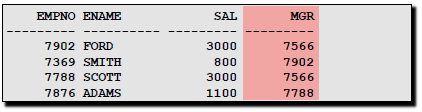{width="2.941666666666667in"
height="1.6208333333333333in"}*Espressioni Aritmetiche*

Con SELECT è possibile eseguire dei calcoli creando espressioni
attraverso l’uso degli operatori aritmetici (+,-,\*,/).

Questo produce dati estratti ma anche dati calcolati. Ovviamente valgono
le stesse regole delle espressioni aritmetiche come la precedenza degli
operatori \* e / rispetto al + e -, e le operazioni dentro le parentesi
() vanno svolte prima.

*Query su più tabelle*

{width="4.641715879265091in"
height="1.0099551618547682in"}

Quali esami ha superato Mario Rossi?

  ------------------------------------------------
  **SELECT** Corso
  
  **FROM** Esami, Studenti
  
  **WHERE** Esami.Matricola = Studenti.Matricola
  
  **AND** Nome=‘Mario Rossi’
  ------------------------------------------------

L’uso del punto “.” Serve ad indicare l’attributo della tabella
specificata prima.

Tabella.Attributo

{width="4.731944444444444in"
height="0.9840277777777777in"}Quali professori hanno dato più di 24 a
Teo Verdi, ed in quali corsi?

  -------------------------------------------------
  **SELECT** Professore, Corsi.Corso
  
  **FROM** Corsi,Esami,Studenti
  
  **WHERE** Corsi.Corso **=** Esami.Corso **AND**
  
  Esami.Matricola = Studenti.Matricola **AND**
  
  Nome=‘Teo Verdi’ **AND** Voto &gt; 24
  -------------------------------------------------

Alias, ***referenziazione e concatenazione stringe***
-----------------------------------------------------

L’utilizzo dell’alias ci permette di rinominare il nome dell’attributo
di una colonna; esso è utile con dei calcoli.

Sintatticamente deve seguire immediatamente il nome di una colonna, o
può essere usata opzionalmente la parola chiave *AS* tra il nome della
colonna e l’alias. Richiede doppio apice se l’alias ha degli spazi.

*Es*. Rinominazione

  ------------------------- ------------------------------------------ ---------------------------
    **emp**                   --------------------------------------     **emp**
    ----------- ---------     **SELECT** ename AS name, sal salary       ---------- ------------
    **ename**   **sal**                                                  **name**   **salary**
    …           …             **FROM** emp                               …          …
                              --------------------------------------   
                                                                       
  ------------------------- ------------------------------------------ ---------------------------

*Es*. Operazione + Rinominazione

  ------------------------- ------------------------------------------------------ ----------------------------------
    **emp**                   --------------------------------------------------     **emp**
    ----------- ---------     **SELECT** ename “Name”, sal\*12 “Annual Salary”       ---------- -------------------
    **ename**   **sal**                                                              **Name**   **Annual Salary**
    …           …             **FROM** emp                                           …          …
                              --------------------------------------------------   
                                                                                   
  ------------------------- ------------------------------------------------------ ----------------------------------

*Alias nelle tabelle*

  -----------------------------------------
  **SELECT** Professore
  
  **FROM** Corsi p, Esami e
  
  **WHERE** p.Corso **=** e.Corso **AND**
  
  Matricola = ‘12345’
  -----------------------------------------

Seleziona i professori con cui la matricola 12345 ha fatto esami

*Referenziazione*

Per referenziare una colonna in SQL si può anche fare uso della forma
estesa **&lt;nome tabella&gt;.&lt;nomecolonna&gt;**.

Inoltre, per abbreviare la scrittura si può introdurre un alias per la
tabella.

*Es*.

  -----------------------------------
  **SELECT** E.CodCorso
  
  **FROM** Esami E
  
  **WHERE** Esami.Matricola=’29323’
  -----------------------------------

Come si nota, la tabella “Esami” è stata rinominata in “E”, la quale
tramite “E.CodCorso” è stata usata per referenziare la colonna CodCorso
di Esami.

*Espressioni con stringhe*

{width="1.7604166666666667in"
height="1.1506944444444445in"}Per lavorare con la stringhe è utile
l’operatore **CONCAT**.

*Es*. Selezionare matricola e nome e cognome su uno stesso attributo

  ---------------------------------------------------------------------
  **SELECT** Matricola, Nome CONCAT ‘ ’ CONCAT Cognome AS NomeCognome
  
  **FROM** Studenti
  ---------------------------------------------------------------------

Clausola DISTINCT
-----------------

Di default il comando SELECT agisce con il metodo *ALL*, ma specificando
*DISTINCT* è possibile eliminare dai risultati le righe duplicate.

*Es*. Selezionare tutti gli impiegati del dipartimento 10

  -- --------------------------------------------------- --
       -----------------------------------------------   
       **SELECT DISTINCT** empno, ename, job, deptno     
                                                         
       **FROM** Impiegati;                               
                                                         
       **WHERE** deptno = 10                             
       -----------------------------------------------   
                                                         
  -- --------------------------------------------------- --

Mettendo il simbolo \* su qualunque attributo sto indicando di
selezionare tutto

Clausola WHERE
--------------

La clausola WHERE può servire quando vogliamo limitare le righe
selezionate tramite una condizione.

*Es*. Selezionare tutti i dipendenti che come lavoro fanno gli impiegati

  -------------------------------
  **SELECT** ename, job, deptno
  
  **FROM** emp
  
  **WHERE** job=‘CLERK’;
  -------------------------------

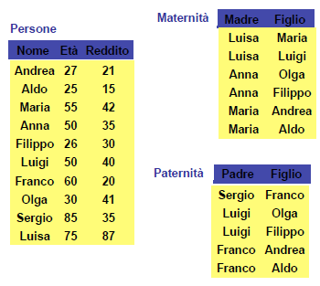{width="2.4166666666666665in"
height="0.6673611111111111in"}

In questo modo FROM dice di prendere i dati dalla tabella “emp” mentre
WHERE dice di prendere solo le tuple cui “job=‘CLERK’”

*Operatori logici*

La clausola WHERE consiste, nel caso generale, di una espressione logica
(operatori AND, OR, NOT) di predicate. Una tupla soddisfa la clausola
WHERE se e solo se l’espressione risulta **vera** per tale tuple.

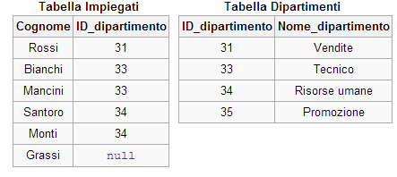{width="2.65625in" height="1.275in"}

  --------------------------------------------
  **SELECT** \*
  
  **FROM** Esami
  
  **WHERE** CodCorso=913 **AND** Voto&gt;28;
  --------------------------------------------

*Es*.

*Es*. Selezionare tutti i dipendenti il cui salario è maggiore di 1100 o
sono impiegati

  --------------------------------------------
  **SELECT** empno, ename, job, sal
  
  **FROM** emp
  
  **WHERE** sal&gt;=1100 **OR** job=‘CLERK’;
  --------------------------------------------

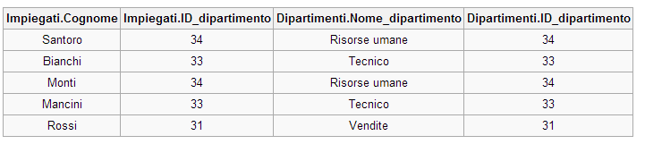{width="2.9375in" height="1.3117574365704288in"}

*Es*. Selezionare tutti i dipendenti che non sono impiegati, manager e
analisti

  -------------------------------------------------------
  **SELECT** ename, job
  
  **FROM** emp
  
  **WHERE** job NOT IN (‘CLERK’, ‘MANAGER’, ‘ANALYST’);
  -------------------------------------------------------

{width="1.3125in" height="0.8556988188976378in"}

*Operatori di confronto*

Gli operatori di confronto che possiamo utilizzare sono:

{width="1.6770833333333333in"
height="1.297597331583552in"}

*Es*. Selezionare tutti gli impiegati con un salario minore del comune

  -----------------------------
  **SELECT** ename, sal, comm
  
  **FROM** emp
  
  **WHERE** sal&lt;=comm;
  -----------------------------

{width="4.114583333333333in"
height="0.6128105861767279in"}

*Regole di precedenza*

{width="2.2906977252843395in"
height="0.9190813648293963in"}

La modifica delle regole di precedenza è ottenuta con l’uso delle
parentesi.

*Es*. Selezionare tutti i dipendenti che sono commessi o presidenti e
hanno un salario maggiore di 1500.

  ----------------------------
  **SELECT** ename, job, sal
  
  **FROM** emp
  
  **WHERE** job=‘SALESMAN’
  
  **OR** job=‘PRESIDENT’
  
  **AND** sal&gt;1500;
  ----------------------------

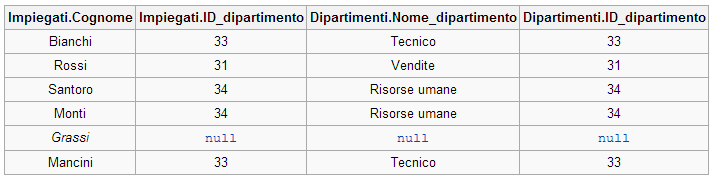{width="2.03125in" height="1.0080457130358704in"}

*Es*. Lo stesso di prima, ma con l’uso delle parentesi, quindi forzando
la priorità.

  ----------------------------
  **SELECT** ename, job, sal
  
  **FROM** emp
  
  **WHERE** (job=‘SALESMAN’
  
  **OR** job=‘PRESIDENT’)
  
  **AND** sal&gt;1500;
  ----------------------------

{width="2.8020833333333335in"
height="0.9166666666666666in"}

*Operatori di confronto speciali*

Esistono altri operatori di confronto speciali:

{width="2.7978412073490815in"
height="1.3252941819772528in"}

*Operatore BETWEEN*

L’operatore BETWEEN consente la selezione di righe con attributi in un
particolare range (estremi inclusi).

*Es*. Selezionare tutti gli impiegati con un salario compreso tra 1000 e
1500

  ----------------------------------------------
  **SELECT** ename, sal
  
  **FROM** emp
  
  **WHERE** sal **BETWEEN** 1000 **AND** 1500;
  ----------------------------------------------

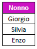{width="0.9479166666666666in"
height="0.6064873140857393in"}

L’espressione **\[NOT\]** attrib **BETWEEN** espr1 **AND** espr2

Equivale a **\[NOT\]** espr1$\leq$ attrib $\leq$ espr2

*Operatore IN*

L’operatore IN è utilizzato per selezionare righe che hanno un attributo
che assume valori contenuti in una lista.

*Es*. Selezionare tutti gli impiegati aventi i seguenti numeri mgr:
(7902, 7566, 7788)

  --------------------------------------
  **SELECT** empno, ename, sal, mgr
  
  **FROM** emp
  
  **WHERE** mgr IN (7902, 7566, 7788);
  --------------------------------------

{width="2.3125in" height="0.6137445319335083in"}

*Operatore LIKE*

L’operatore LIKE è usato per effettuare ricerche *wildcard* di una
stringa di valori. Le condizioni di ricerca possono contenere sia
letterali, caratteri o numeri.

Si definisce **WILD CARD** (dall' inglese "carta selvaggia", indica i
Jolly nei giochi di carte) un carattere che può sostituire altri
caratteri in una chiave di ricerca. Supponiamo di avere una lunga lista
di nomi di persone (non in ordine alfabetico) e che dovete trovare
coloro nel cui nome compaiono le lettere "*ste*".

-   Il carattere "**\_**" denota un carattere; è la WILD CARD che
    sostituisce un qualsiasi altro carattere: "*ste\_ \_ \_*" troverà
    "*stella*" e "*stelio*" ma non "*stefano*" che ha un carattere in
    più.

-   Il carattere "**%**" denota zero o più caratteri; può sostituire un
    numero qualsiasi di caratteri: "*ste%*" troverà sia "*stella*" che
    "*stefano*" che qualsiasi nome cominci per "*ste*", però non troverà
    "*estelle*" (c'è una E prima del resto), né troverà "*alceste*". Per
    trovare anche tali nomi useremo "*%ste%*" e così via.

*Es*. Selezionare tutti gli impiegati il cui nome inizia per S.

  ----------------------------
  **SELECT** ename
  
  **FROM** emp
  
  **WHERE** ename LIKE ‘S%’;
  ----------------------------

Inoltre il pattern-matching di caratteri può essere combinato.

*Es*. Selezionare tutti gli impiegati il cui nome ha la lettera ‘A’ nel
secondo carattere.

  ------------------------------
  **SELECT** ename
  
  **FROM** emp
  
  **WHERE** ename LIKE ‘\_A%’;
  ------------------------------

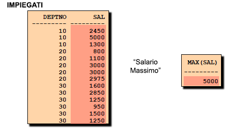{width="1.1145833333333333in"
height="0.6496041119860018in"}

*Operatore IS \[NOT\] NULL*

L’operatore IS NULL controlla l’esistenza di valori null.

*Es*. Selezionare tutti gli studenti che non hanno fornito il numero di
telefono.

  -----------------------------
  **SELECT** Nome
  
  **FROM** Studenti
  
  **WHERE** Telefono IS NULL;
  -----------------------------

Clausola ORDER BY
-----------------

Per ordinare il risultato secondo i valori di una o più colonne si
introduce la clausola ORDER BY, e per ogni colonna si specifica se
l’ordinamento è:

-   ASC: ordine crescente, di default, quindi funzionante anche senza
    specificarlo

<!-- -->

-   DESC: ordine decrescente

La clausola ORDER BY è inserita per ultima nei comandi SELECT.

*Es*. Selezionare tutti gli impiegati ordinandoli per data di
assunzione.

  ------------------------------------------
  **SELECT** ename, job, deptnom, hiredate
  
  **FROM** emp
  
  **ORDER BY** hiredate;
  ------------------------------------------

{width="2.6041666666666665in"
height="0.666324365704287in"}

*Es*. Selezionare tutti gli impiegati ordinandoli per data di assunzione
decrescente.

  ------------------------------------------
  **SELECT** ename, job, deptnom, hiredate
  
  **FROM** emp
  
  **ORDER BY** hiredate DESC;
  ------------------------------------------

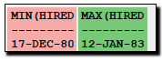{width="2.0416666666666665in"
height="0.8983333333333333in"}

*Ordinamento tramite alias*

*Es*. Selezionare tutti gli impiegati ordinandoli per salario annuale.

  -----------------------------------------
  **SELECT** empno, ename, sal\*12 annsal
  
  **FROM** emp
  
  **ORDER BY** annsal;
  -----------------------------------------

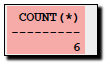{width="1.5861373578302713in"
height="1.1145833333333333in"}

*Ordinamento su colonne multiple*

Possiamo specificare due tipi di ordinamento quando sappiamo che ci sono
ripetizioni.

*Es*. Selezionare gli impiegati ordinandoli per numero di dipartimento
crescente e per salario decrescente.

  --------------------------------
  **SELECT** ename, deptno, sal
  
  **FROM** emp
  
  **ORDER BY** deptno, sal DESC;
  --------------------------------

{width="2.1638910761154855in"
height="0.7916666666666666in"}

L’ordinamento può essere fatto anche con colonne che non sono nella
lista SELECT.

JOIN
----

Il JOIN è una clausola del linguaggio SQL che serve a combinare (unire)
le righe di due o più tabelle di un database, in modo tale
da{width="2.2558136482939632in"
height="2.0177930883639545in"} effettuare query su più tabelle. La
condizione di join va scritta nella clausola WHERE o tramite la funzione
JOIN messa nella clausola FROM. Bisogna mettere come prefisso della
colonna il nome della tabella se questa stessa colonna appare in più di
una tabella.

*Es*. Selezionare padre e madre di ogni persona (Paternità JOIN
Maternità)

  -----------------------------------------------
  **SELECT** Paternità.Figlio, Padre, Madre
  
  **FROM** Maternità, Paternità
  
  **WHERE** Maternità.Figlio = Paternità.Figlio
  -----------------------------------------------

Lo standard ANSI definisce alcune specifiche per il linguaggio SQL sul
tipo di JOIN da effettuare: *INNER, FULL, LEFT* e *RIGHT*. In alcuni
casi è possibile che una tabella possa essere combinata con se stessa,
in questo caso si parlerà di *self-join*.

*Inner JOIN (join interno)*

Una inner join crea una nuova tabella combinando i valori delle due
tabelle di partenza (A and B) basandosi su una certa regola di
confronto. La query compara ogni riga della tabella A con ciascuna riga
della tabella B cercando di soddisfare la regola di confronto definita.
Quando la regola di join viene soddisfatta, i valori di tutte le colonne
delle tabelle A e B vengono combinate in un'unica riga nella costruzione
della tabella risultante. La inner join è la forma di join usata più di
frequente nelle applicazioni e rappresenta la modalità di default.

{width="2.961038932633421in"
height="1.3264238845144356in"}

*Es*. Unire le due tabelle “Impiegati” e “Dipartimenti” usando l’ID

dipartimento che è presente in entrambe le tabelle. Possiamo

> fare ciò indicanto il JOIN sia in forma **implicita** che in forma
> **esplicita**:

Forma Implicita

  ----------------------------------------------------------------------
  **SELECT** \*
  
  **FROM** Impiegati, Dipartimenti
  
  **WHERE** Impiegati.ID\_dipartimento = Dipartimenti.ID\_dipartimento
  ----------------------------------------------------------------------

{width="3.6256944444444446in"
height="0.8097222222222222in"}

Forma esplicita

  ------------------------------------------------------------
  **SELECT** \*
  
  **FROM** Impiegati **\[INNER\] JOIN** Dipartimenti **ON**
  
  Impiegati.ID\_dipartimento = Dipartimenti.ID\_dipartimento
  ------------------------------------------------------------

Quando *ID\_dipartimento* corrisponde in entrambe le tabelle (ovvero la
regola è soddisfatta), la query combinerà le colonne *Cognome*,
*ID\_dipartimento* e *Nome\_dipartimento* in un'unica riga per la
tabella risultante.

Nota che l'impiegato "Grassi" e il dipartimento "Promozione" non sono
presenti in quanto l'impiegato Grassi ha un null mentre Promozione non
compare in nessun impiegato. A volte come risultato finale si desidera
avere anche i campi che non hanno corrispondenza: in tal caso è
possibile usare la query di tipo **Outer join**.

-   *Equi-JOIN:* La equi-join, ha un particolare tipo di comparatore,
    detto *theta join*, che utilizza come metodo di verifica, solamente
    l'uguaglianza matematica come regola di confronto. Usando altri
    operatori di confronto (come ad esempio &lt;) squalifica la join
    come equi-join.

SQL fornisce una scorciatoia per definire le equi-joins attraverso la
keyword USING

  -----------------------------------------------------------------------
  **SELECT** \*
  
  **FROM** Impiegati **JOIN** Dipartimenti **USING** (ID\_dipartimento)
  -----------------------------------------------------------------------

-   *Natural-join*: Una natural join offre ulteriori specializzazioni di
    equi-joins. Solitamente la join confronta colonne di tabelle diverse
    che hanno lo stesso nome. La natural join fa proprio questo.

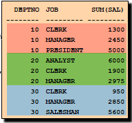{width="2.6744181977252843in"
height="1.5415627734033246in"}
{width="2.6218449256342957in"
height="1.4526323272090989in"}

  --------------------------------------------------
  **SELECT** \*
  
  **FROM** Impiegati **NATURAL JOIN** Dipartimenti
  --------------------------------------------------

-   *Cross-JOIN (prodotto cartesiano)*: Il risultato di una cross join è
    il prodotto cartesiano di tutte le righe delle tabelle che
    concorrono alla query di join. È come dire che stiamo facendo una
    inner join senza impostare la regola di confronto o in cui la regola
    di confronto ritorna sempre vero. Date le due tabelle di partenza A
    e B, la cross join si scrive A × B.

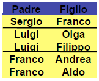{width="4.122916666666667in"
height="3.533333333333333in"}

Il prodotto cartesiano è ottenuto quando:

-   Una condizione join è omessa

-   Tutte le righe della prima tabella ammettono join con tutte le righe
    della seconda

Per evitare il prodotto cartesiano, è necessario includere sempre
condizioni join valide nella clausola WHERE.

*Es*. Cross-JOIN implicito

  --------------------------------------
  **SELECT** \*
  
  **FROM** Impiegati**,** Dipartimenti
  --------------------------------------

*Es*. Cross-JOIN esplicito

  ------------------------------------------------
  **SELECT** \*
  
  **FROM** Impiegati **CROSS JOIN** Dipartimenti
  ------------------------------------------------

*Outer JOIN (join esterno)*

Una outer join non richiede che ci sia corrispondenza esatta tra le
righe di due tabelle. La tabella risultante da una outer join trattiene
tutti quei record che non hanno alcuna corrispondenza tra le tabelle.

Le outer joins si suddividono in *left outer joins, right outer joins, e
full outer joins*, in base a quale sia la tabella di cui intendiamo
trattenere i valori in caso di mancata corrispondenza della regola di
confronto da (sinistra, destra, o entrambi, in questo caso left
(sinistra) e right (destra) si riferiscono ai due lati della keyword
JOIN).

-   *Left Outer JOIN:* Il risultato di una query left outer join (o
    semplicemente **left join**) per le tabelle A e B contiene sempre
    tutti i record della tabella di sinistra ("left") A, mentre vengono
    estratti dalla tabella di destra ("right") B solamente le righe che
    trovano corrispondenza nella regola di confronto della join. Questo
    significa che se la clausola ON trova 0 (zero) righe in B, la join
    mostrerà una riga risultante con valore NULL in tutte le colonne
    corrispondenti al risultato per le colonne di B.

{width="2.9604166666666667in"
height="1.3263888888888888in"}Esempio di una left outer join della
tabella a sinistra:

  --------------------------------------------------------------------
  **SELECT** \*
  
  **FROM** Impiegati **LEFT \[OUTER\] JOIN** Dipartimenti
  
  **ON** Impiegati.ID\_dipartimento = Dipartimenti.ID\_dipartimento;
  --------------------------------------------------------------------

Risultato:

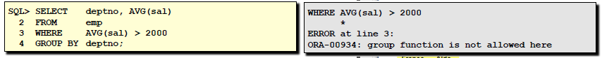{width="5.382352362204724in"
height="1.3953488626421697in"}

-   *Right Outer JOIN:* Una right outer join (o **right join**)
    semplicemente ricalca il funzionamento della left outer join, ma
    invertendo l'ordine delle tabelle interessate.

> Il risultato di una query right outer join per le tabelle A e B
> contiene sempre tutti i record della tabella di destra ("right") B,
> mentre vengono estratti dalla tabella di sinistra ("left") A solamente
> le righe che trovano corrispondenza nella regola di confronto della
> join. Questo significa che se la clausola ON trova 0 (zero) righe in
> A, la join mostrerà una riga risultante con valore NULL in tutte le
> colonne corrispondenti al risultato per le colonne di A.

Esempio di una right outer join della tabella sopra:

  --------------------------------------------------------------------
  **SELECT** \*
  
  **FROM** Impiegati **RIGHT \[OUTER\] JOIN** Dipartimenti
  
  **ON** Impiegati.ID\_dipartimento = Dipartimenti.ID\_dipartimento;
  --------------------------------------------------------------------

Risultato:

{width="5.848837489063867in"
height="1.4972801837270342in"}

> In pratica sono utilizzate maggiormente le query di left outer join
> rispetto a quelle di right outer join, ma possono verificarsi rari
> casi in cui in query molto complesse ci sia la necessità di utilizzare
> contemporaneamente il criterio di left outer join e di right outer
> join.
>
> Lo stesso risultato della precedente right outer join si può ripetere
> usando il tipo left outer join invertendo l’ordine delle tabelle, cioè
> facendo diventare $A \rightarrow B$ e $B \rightarrow A$:

  --------------------------------------------------------------------
  **SELECT** \*
  
  **FROM** Dipartimenti **LEFT \[OUTER\] JOIN** Impiegati
  
  **ON** Impiegati.ID\_dipartimento = Dipartimenti.ID\_dipartimento;
  --------------------------------------------------------------------

-   *Full Outer-JOIN:* Una full outer join combina i risultati delle due
    tabelle A e B tenendo conto di tutte le righe delle tabelle, anche
    di quelle che non hanno corrispondenza tra di loro.

> Il risultato di una query *full outer join* per le tabelle A e B
> contiene sempre tutti i record della tabella di sinistra ("left") A,
> estraendo dalla tabella di destra ("right") B solamente le righe che
> trovano corrispondenza nella regola di confronto della join; inoltre
> verranno estratti tutti i record della tabella di sinistra ("left") A
> che non trovano corrispondenza nella tabella di destra ("right") B
> impostando a NULL i valori di tutte le colonne della tabella B e tutti
> i record della tabella di destra ("right") B che non trovano
> corrispondenza nella tabella di sinistra ("left") A impostando a NULL
> i valori di tutte le colonne della tabella A.

{width="3.2743055555555554in"
height="0.9534722222222223in"}

Esempio di una full outer join:

  -------------------------------------------------------------------
  **SELECT** \*
  
  **FROM** Impiegati **FULL \[OUTER\] JOIN** Dipartimenti
  
  **ON** Impiegati.ID\_dipartimento = Dipartimenti.ID\_dipartimento
  -------------------------------------------------------------------

-   *Union*: Alcuni database (come ad esempio MySQL) non supportano
    direttamente la funzionalità della full-join, ma la si può emulare
    attraverso la combinazione di left e right outer joins per mezzo
    della keyword **union**.

La creazione di una query di full outer join si realizzerà come segue:

  -------------------------------------------------------------------
  **SELECT** \*
  
  **FROM** Impiegati **LEFT JOIN** Dipartimenti
  
  **ON** Impiegati.ID\_dipartimento = Dipartimenti.ID\_dipartimento
  
  **UNION**
  
  **SELECT \***
  
  **FROM** Impiegati **RIGHT JOIN** Dipartimenti
  
  **ON** Impiegati.ID\_dipartimento = Dipartimenti.ID\_dipartimento
  
  **WHERE** Impiegati.ID\_dipartimento **IS NULL**
  -------------------------------------------------------------------

> Con la UNION i duplicati vengono eliminati, per mantenerli bisogna
> specificarlo **UNION ALL**. Analogamente funziona **INERSECT
> \[ALL\]**, ed **EXCEPT \[ALL\]**.

  ------------------------------ ------------------------------
  Notazione scorretta:           Notazione corretta:
                                 
    --------------------------     --------------------------
    **SELECT** padre, figlio       **SELECT** padre, figlio
                                   
    **FROM** paternita             **FROM** paternita
                                   
    **UNION**                      **UNION**
                                   
    **SELECT** figlio, madre       **SELECT** madre, figlio
                                   
    **FROM** maternita             **FROM** maternita
    --------------------------     --------------------------
                                 
  ------------------------------ ------------------------------

*Self-JOIN*

La self-join serve ad unire una tabella con se stessa. L’uso di alias è
forzato quando si deve eseguire un self‐join.

*Es.*

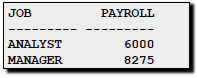{width="0.6625in"
height="0.8701388888888889in"}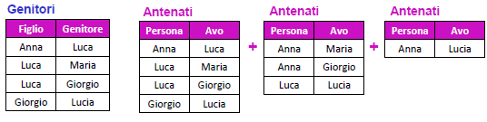{width="1.99375in"
height="1.1166666666666667in"}Trovare i nonni di Anna

  -----------------------------------
  **SELECT** G1.Genitore AS Nonno
  
  **FROM** Genitori G1, Genitori G2
  
  **WHERE** G1.Figlio = G2.Genitore
  
  **AND** G2.Figlio = ‘Anna’
  -----------------------------------

*Esempio di JOIN in SQL e in algebra relazionale*

Es. I padri di persone che guadagnano più di 20

  ------------------------------------------------
  **SELECT DISTINCT** padre
  
  **FROM** persone, paternita
  
  **WHERE** figlio = nome **AND** reddito &gt;20
  ------------------------------------------------

$$\pi_{\text{padre}}\left( \text{paternita\ JOI}N_{figlio = nome}\left( \sigma_{reddito > 20}\left( \text{persone} \right) \right) \right)$$

*Es*. Le persone che guadagnano più dei rispettivi padri; mostrare nome,
reddito e reddito del padre

  ------------------------------------------
  **SELECT** f.nome, f.reddito, p.reddito
  
  **FROM** persone p, paternita, persone f
  
  **WHERE** p.nome = padre **AND**
  
  figlio = f.nome **AND**
  
  **f.**reddito &gt; p.reddito
  ------------------------------------------

$$\pi_{nome,reddito,RP}(\sigma_{reddito > RP}(\sigma_{NP,EP,RP \leftarrow nome,\ eta,\ reddito}\left( \text{persone} \right)$$

$$\text{JOI}N_{NP = padre}(paterninta\ JOIN_{figlio = nome}persone)))$$

  ------------------------------------------------------
  **SELECT** x.figlio, f.reddito **AS** reddito,
  
  p.reddito **AS** redditoPadre
  
  **FROM** persone p, paternita x, persone f
  
  **WHERE** p.nome = x.padre **AND** x.figlio = f.nome
  
  **AND** f.reddito &gt; p.reddito
  ------------------------------------------------------

  -------------------------------------------------------------
  **SELECT** f.nome, f.reddito, p.reddito
  
  **FROM** persone p **JOIN** paternita **ON** p.nome = padre
  
  **JOIN** persone f **ON** figlio = f.nome
  
  **WHERE** f.reddito &gt; p.reddito
  -------------------------------------------------------------

SQL: Aggregazione di dati
=========================

Gli operatori aggregati (o funzioni di aggregazione), sono di
fondamentale importanza per effettuare **subquery** **complesse**.
Questi operatori si caratterizzano per il fatto di restituire un valore
in corrispondenza di un gruppo di valori o dei valori che formano una
colonna di una tabella contenuta in un database.

Operatori di aggregamento
-------------------------

Lo standard SQL mette a disposizione una serie di funzioni aggregate (o
di colonna) tramite gli operatori di aggregamento.

Nelle espressioni della target list possiamo avere anche espressioni che
calcolano valori a partire da insiemi di ennuple. SQL-2 prevede 5
possibili operatori di aggregamento:

-   Conteggio con **COUNT()**, per contare i record;

-   Minimo con **MIN()**, per ottenere il valore minimo dell’attributo
    numerico scelto

-   Massimo con **MAX()**, per ottenere il valore massimo dell'attributo
    numerico prescelto;

-   Media con **AVG(),** per calcolare la media aritmetica
    dell'attributo numerico prescelto;

-   Somma con **SUM(),** per sommare i valori della colonna prescelta.

Gli operatori di aggregamento NON sono rappresentabili in Algebra
Relazionale

  --------------------------------------
  *Es.*
  --------------------------------------
  **SELECT** SUM(Stipendio) AS TotStip
  
  **FROM** Imp
  
  **WHERE** Sede = ‘S01’
  --------------------------------------

*Utilizzo*

Tali operatori operano su insiemi di righe per dare un risultato per
gruppo. L’argomento di una funzione aggregata è una qualunque
espressione che può figurare nella SELECT list, e producono un unico
valore che sintetizza il contenuto di tale tabella.

{width="2.7736111111111112in"
height="1.58125in"}*AVG e SUM*

Gli operatori AVG e SUM possono essere usati solo su dati numerici.

*Es*. Media e somma dei guadagni dei salariati

  -------------------------------------
  **SELECT AVG** (sal), **SUM** (sal)
  
  **FROM** emp
  
  **WHERE** job LIKE ‘SALES%’**;**
  -------------------------------------

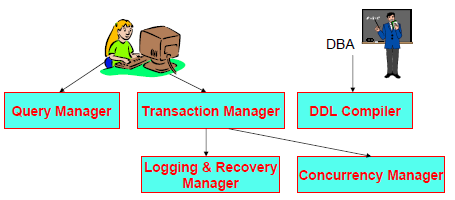{width="1.7555555555555555in"
height="0.6513888888888889in"}

*Es*. Media dei redditi di coloro che hanno meno di 30 anni

  ----------------------------
  **SELECT AVG** (reddito)
  
  **FROM** Persone
  
  **WHERE** eta &lt; 30**;**
  ----------------------------

Per alcune funzioni aggregate (AVG e altre qui non descritte), al fine
di ottenere il risultato desiderato è necessario operare un casting
dell’argomento.

*Es*. Uso del JOIN: media dei redditi dei figli di Franco

  --------------------------------------------------------
  **SELECT AVG** (reddito) AS MediaReddito
  
  **FROM** persone **JOIN** paternita **ON** nome=figlio
  
  **WHERE** padre = ‘Franco’**;**
  --------------------------------------------------------

*MIN e MAX*

Gli operatori MIN e MAX possono essere usati su qualsiasi tipo di dati.

*Es*. Selezionare il primo e l’ultimo impiegato assunto salariato

  ---------------------------------------------------
  **SELECT MIN** (Hired date), **MAX** (Hired date)
  
  **FROM** emp
  
  **WHERE** job **LIKE** ‘SALES%’**;**
  ---------------------------------------------------

{width="1.7555555555555555in"
height="0.6733366141732283in"}

*Es*. Seleziona il reddito medio, minimo e massimo delle persone con età
minore di 30 anni

  ----------------------------------------------------------------
  **SELECT AVG** (reddito), **MIN** (reddito), **MAX** (reddito)
  
  **FROM** persone
  
  **WHERE** eta &lt; 30**;**
  ----------------------------------------------------------------

Attenzione! Se si usano funzioni aggregate, la SELECT list non può
includere altri elementi che non siano a loro volta funzioni aggregate.
Ad esempio, **SELECT** Nome, **MIN** (Stipendio) non va bene; il motivo
è che una funzione aggregata restituisce un singolo valore, mentre il
riferimento a una colonna è in generale un insieme di valori
(eventualmente ripetuti).

*COUNT*

L’operatore COUNT(\*) ritorna il numero di righe di una tabella.

*Es*.

  ----------------------------
  **SELECT COUNT(\*)**
  
  **FROM** emp
  
  **WHERE** deptno = 30**;**
  ----------------------------

{width="1.0232556867891514in"
height="0.6463681102362204in"}

L’operatore COUNT(attributo) invece ritorna il numero di valori di un
particolare attributo non null.

{width="1.5229166666666667in"
height="1.363888888888889in"}

*Es*. Seleziona il numero di figli di Franco

  --------------------------------------------------
  **SELECT COUNT**(Figlio) **AS** NumFigliDiFranco
  
  **FROM** Paternita
  
  **WHERE** Padre = ‘Franco’**;**
  --------------------------------------------------

Operatori aggregati e valori nulli
----------------------------------

*COUNT e valori nulli*

La forma COUNT(\*) conta le tuple del risultato; viceversa, specificando
una colonna, si omettono quelle con valore nullo in tale colonna.

*Es*. Numero di tuple della tabella Persone

  -----------------------
  **SELECT COUNT**(\*)
  
  **FROM** Persone**;**
  -----------------------

{width="2.6277777777777778in" height="1.1375in"}

Risultato = 4

*Es*. Numero di volte che il campo ‘reddito’ non è NULL

  ---------------------------
  **SELECT COUNT**(reddito)
  
  **FROM** Persone**;**
  ---------------------------

Risultato = 3

*Es*. Numero di valori distinti del campo ‘reddito’ senza i NULL

  ----------------------------------------
  **SELECT COUNT**(**DISTINCT** reddito)
  
  **FROM** Persone**;**
  ----------------------------------------

L’opzione DISTINCT considera solo i valori distinti

*NULL negli altri operatori aggregati*

Se una colonna A contiene solo valori nulli, MAX, MIN, AVG, SUM
restituiscono NULL, mentre Count vale zero.

{width="1.6388888888888888in"
height="1.7694444444444444in"}AVG e SUM ignorano i valori nulli

*Es*. Selezionare il reddito medio di tutte le persone

  ----------------------------------------------
  **SELECT avg** (reddito) **AS** redditomedio
  
  **FROM** Persone**;**
  ----------------------------------------------

Clausola GROUP BY
-----------------

Gli operatori di aggregazione si riferiscono a tutte le tuple che
soddisfano la clausola WHERE, ma i valori restituiti non sono
raggruppati secondo una certa regola ma sparsi nei risultati.

La clausola GROUP BY serve a definire tali gruppi, specificando una o
più colonne (di raggruppamento) sulla base della/e quale/i le tuple sono
raggruppate per valori uguali. In poche parola, essa divide le righe di
una tabella in gruppi più piccoli.

Raggruppa i risultati di una SELECT in base al campo specificato dopo il
BY, che può essere numerico, testuale, ecc.

*Es*. Selezionare quanti sono i programmatori e raggrupparli per sede.

  --------------------------------------------
  **SELECT** Sede, **COUNT (\*) AS** NumProg
  
  **FROM** Imp
  
  **WHERE** Ruolo = ‘Programmatore’
  
  **GROUP BY** Sede
  --------------------------------------------

  Prima si selezionano le tuple che soddisfano la clausola WHERE   Si raggruppano per valori uguali delle colonne presenti nella clausola GROUP BY   E infine a ciascun gruppo si applica la funzione aggregata
  ---------------------------------------------------------------- --------------------------------------------------------------------------------- ------------------------------------------------------------
                                                                                                                                                     

*GROUP BY su colonne multiple*

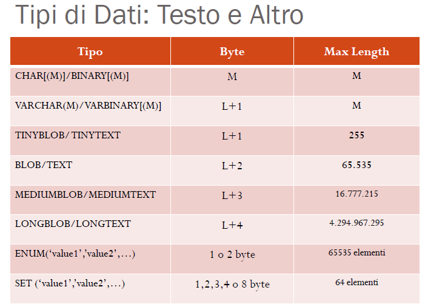{width="1.4831867891513562in"
height="2.0697670603674543in"}*Es.* Sommare i salari in ‘Impiegati’ per
ogni lavoro e raggrupparli per dipartimento

  ----------------------------------
  **SELECT** deptno, job, sum(sal)
  
  **FROM** emp
  
  **GROUP BY** deptno, job;
  ----------------------------------

{width="1.9881944444444444in"
height="1.8604166666666666in"}

*Operatori aggregati e raggruppamenti*

Le funzioni possono essere applicate a partizioni delle relazioni.
Utilizzando la clausola GROUP BY, la sintassi è: GROUP BY
listaAttributi.

*Es*. Selezionare il numero di figli di ciascun padre

  -------------------------------------------------
  **SELECT** padre, **COUNT(**\***) AS** NumFigli
  
  **FROM** paternita
  
  **GROUP BY** padre;
  -------------------------------------------------

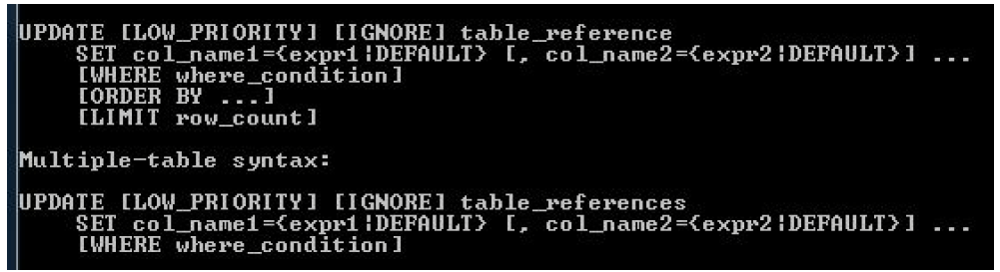{width="1.5784722222222223in"
height="0.8138888888888889in"}{width="1.0694444444444444in"
height="0.8777777777777778in"}

*Query illegali con le funzioni di raggruppamento*

La clausola WHERE non può essere usata per restringere i gruppi.

{width="7.267361111111111in"
height="0.7090277777777778in"}

Deve essere usata la HAVING, la quale va usato solamente per specificare
un criterio di raggruppamento o di aggregazione.

Clausola HAVING
---------------

{width="1.6743055555555555in" height="2.5in"}La
clausola HAVING viene usata per restringere i gruppi quando le righe
sono raggruppate e la funzione di raggruppamento è applicata,
selezionando dei gruppi sula base di loro proprietà complessive.

*Es*. Selezionare il salario massimo per dipartimento maggiore di \$2900

  ----------------------------------
  **SELECT** deptno, **MAX** (sal)
  
  **FROM** emp
  
  **GROUP BY** deptno
  
  **HAVING** **MAX**(sal)&gt;2900;
  ----------------------------------

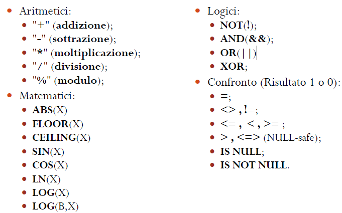{width="1.4534722222222223in"
height="0.7791666666666667in"}

*Es*. Selezionare la somma dei valori dei lavori con salari &gt;5000
ordinati in modo crescente

  ---------------------------------------
  **SELECT** job, **SUM** (sal) PAYROLL
  
  **FROM** emp
  
  **WHERE** job **NOT LIKE** ‘SALES%’
  
  **GROUP BY** job
  
  **HAVING** **SUM**(sal)&gt;5000
  
  **ORDER BY SUM**(sal);
  ---------------------------------------

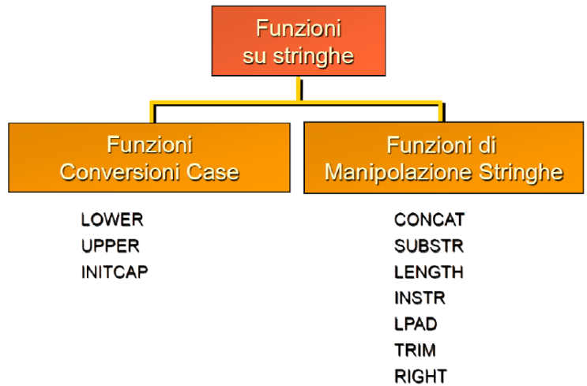{width="2.046527777777778in"
height="0.8138888888888889in"}

*Esempio completo*

Per ogni sede di Bologna in cui il numero di impiegati è almeno 3, si
vuole conoscere il valor medio degli stipendi, ordinando il risultato
per valori decrescenti di stipendio medio e quindi per sede.

  -------------------------------------------------------------
  **SELECT** Sede, **AVG**(Stipendio)
  
  **FROM** Imp, Sedi
  
  **WHERE** Imp.Sede = Sedi.Sede **AND** Imp.Citta= ‘Bologna’
  
  **GROUP BY** Imp.Sede
  
  **HAVING COUNT(\*)** &gt;= 3
  
  **ORDER BY AVG**(Stipendio) **DESC**, Sede
  -------------------------------------------------------------

Subquery (query annidate)
-------------------------

Le query annidate rappresentano uno strumento sintattico molto
importante per effettuare interrogazioni complesse sui database.
Un'**interrogazione nidificata** (o *subquery*), è una query che sta
all'interno di un'altra interrogazione. La query interna, cioè la
subquery, passa i risultati alla query esterna che li verifica nella
condizione che segue la clausola WHERE.

*Es*. Trovare nome e reddito del padre di Franco

Query normale Query Annidate

  --------------------------------------------------
  **SELECT** Nome, Reddito
  
  **FROM** Persone, Paternità
  
  **WHERE** Nome = Padre **AND** Figlio = ‘Franco’
  --------------------------------------------------

  ------------------------------------------------------------------------------------
  **SELECT** Nome, Reddito
  
  **FROM** Persone
  
  **WHERE** Nome = (**SELECT** Padre **FROM** Paternità **WHERE** Figlio = ‘Franco’)
  ------------------------------------------------------------------------------------

Esistono vari tipi di subquery, ma principalmente possiamo suddividerle
in subquery che restituiscono un solo valore, e subquery che
restituiscono un insieme di valori.

*Subquery che restituisce un solo valore*

  -----------------------------------------
  **SELECT** \*
  
  **FROM** Dipendenti
  
  **WHERE** età &gt; (**SELECT AVG**(età)
  
  **FROM** Dipendenti)
  -----------------------------------------

La query restituisce tutti i *Dipendenti* la cui età supera l'età media
di tutti i dipendenti. Il compito di andare a calcolare questa media è
svolto dalla query interna (subquery), però si suppone di avere un
database con all'interno la tabella *Dipendenti* con i relativi
attributi o campi.

*Subquery che restituisce un insieme di valori*

  --------------------------------------------------------------------
  **SELECT** \*
  
  **FROM** Studenti
  
  **WHERE** Matricola **NOT IN** (**SELECT DISTINCT** rif\_matricola
  
  **FROM** Esami)
  --------------------------------------------------------------------

La query restituisce tutti gli *Studenti* che non hanno mai sostenuto un
esame, la subquery invece ricerca tutte le matricole degli Studenti che
hanno sostenuto almeno un esame. La clausola Distinct permette di
eliminare la ripetizione delle matricole degli Studenti che hanno
sostenuto più di un esame.

*Condizioni di confronto*

Gli operatori di confronto =, &lt;,… si possono usare solo se la
subquery restituisce non più di una tupla (**subquery scalare**).

Se la subquery può restituire più di un valore si possono usare le forme

-   **&lt;op&gt; ANY** (subquery): il predicato è vero se la relazione
    &lt;op&gt; vale per almeno uno dei valori della subquery

-   **&lt;op&gt; ALL** (subquery): il predicato è vero se la relazione
    &lt;op&gt; vale per tutti i valori della subquery

-   **\[NOT\] EXIST** (subquery): il predicato è vero se la subquery
    restituisce almeno una tupla

-   **\[NOT\] IN** (subquery): il predicato è vero se la relazione
    &lt;op&gt; è uguale per almeno uno dei valori della subquery

*Es*. Trovare nome e reddito del padre il cui figlio ha più di 20 anni

Query normale Query Annidate

  --------------------------------------------------
  **SELECT** P.Nome, P.Reddito
  
  **FROM** Persone P, Paternità, Persone F
  
  **WHERE** P.Nome = Padre **AND** Figlio = F.Nome
  
  **AND** F.Reddito &gt;20
  --------------------------------------------------

  -----------------------------------------------------------------------------------
  **SELECT** Nome, Reddito
  
  **FROM** Persone
  
  **WHERE** Nome *IN* (**SELECT** Padre **FROM** Paternità **WHERE** Figlio = *ANY*
  
  (**SELECT** Nome **FROM** Persone **WHERE** Reddito &gt; 20) )
  -----------------------------------------------------------------------------------

*Es*. Trovare quei dipartimenti dove non c’è nessuno che si chiama
‘Brown’

  ----------------------------------------------------
  **SELECT** DeptName
  
  **FROM** Department
  
  **WHERE** DeptName &lt;&gt; *all* (**SELECT** Dept
  
  **FROM** Employee **WHERE** Surname = ‘Brown’)
  ----------------------------------------------------

  -----------------------------------
  **SELECT** DeptName
  
  **FROM** Department *except*
  
  **SELECT** Dept **FROM** Employee
  
  **WHERE** Surname = ‘Brown’
  -----------------------------------

IN è sinonimo di = ANY NOT IN è sinonimo di &lt;&gt;ALL

  ------------------------------------------------
  **SELECT** FirstName, Surname
  
  **FROM** Employee
  
  **WHERE** Dept *in* (**SELECT** DeptName
  
  **FROM** Department **WHERE** City = ‘London’)
  ------------------------------------------------

  ------------------------------------------------
  **SELECT** DeptName
  
  **FROM** Department
  
  **WHERE** DeptName *not in* (**SELECT** Dept
  
  **FROM** Employee **WHERE** Surname = ‘Brown’)
  ------------------------------------------------

*Min e Max con le query nidificate*

*Es*. Trovare i dipartimenti dove lavora colui con lo stipendio più alto
di tutta l’azienda

  ------------------------------------------------
  **SELECT** Dept
  
  **FROM** Employee
  
  **WHERE** Salary *in* (**SELECT** MAX (Salary)
  
  **FROM** Employee)
  ------------------------------------------------

  ------------------------------------------------
  **SELECT** Dept
  
  **FROM** Employee
  
  **WHERE** Salary &gt;=*all* (**SELECT** Salary
  
  **FROM** Employee)
  ------------------------------------------------

*Quantificazione esistenziale*

Un ulteriore tipo di condizione è la clausola **EXISTS** (subquery), la
quale valuta l’interrogazione esterna per ogni riga di quella interna.
In poche parole, con EXISTS(…)è possibile verificare se il risultato di
una subquery restituisce almeno una tupla.

Viceversa, facendo uso di NOT EXISTS il predicato è vero se la subquery
non restituisce alcuna tupla

*Es*. Trovare le persone che hanno almeno un figlio *Es*. Trovare i
padri i cui figli guadagnano tutti più di venti milioni

  ---------------------------------------------------
  **SELECT** \*
  
  **FROM** Persone
  
  **WHERE** *EXISTS* (**SELECT** \*
  
  **FROM** Paternità **WHERE** Padre = Nome)
  
  **OR** *Exists* (**SELECT** \* **FROM** Maternità
  
  **WHERE** Madre = Nome)
  ---------------------------------------------------

  -------------------------------------------------------
  **SELECT DISTINCT** Padre
  
  **FROM** Paternità Z
  
  **WHERE** *NOT EXISTS* (**FROM** Paternità W, Persone
  
  **WHERE** W.Padre = Z.Padre **AND** W.Figlio = Nome
  
  **AND** Reddito &lt;= 20)
  -------------------------------------------------------

*Regole di visibilità*

-   Non è possibile fare riferimenti a variabili definite in blocchi più
    interni

-   Se la subquery fa riferimento a variabili definite in un blocco
    esterno, allora si dice che è **correlata**

-   Se un nome di variabile è omesso, si assume riferimento alla
    variabile più “vicina”

*Es*. Visibilità scorretta

  --------------------------------------------------------------------
  **SELECT** \*
  
  **FROM** Impiegato
  
  **WHERE** *Dipart in* (**SELECT** Nome **FROM** Dipartimento D1
  
  **WHERE** Nome = ‘Produzione’) **OR** *Dipart in* (**SELECT** Nome
  
  **FROM** Dipartimento D2 **WHERE** D2.Città = D1.Città)
  --------------------------------------------------------------------

D1 non è visibile nella seconda query nidificata in quanto le due
subquery sono allo stesso livello

In un blocco si può fare riferimento a variabili definite in blocchi più
esterni. L’interrogazione interna viene eseguita una volta per ciascuna
ennupla dell’interrogazione esterna.

*Es*. Trovare tutti gli studenti che hanno un omonimo *Es*. Trovare
tutti gli studenti che non hanno un omonimo

  ------------------------------------------------
  **SELECT** \*
  
  **FROM** Student S
  
  **WHERE** *EXISTS* (**SELECT** \*
  
  **FROM** Student S2 **WHERE** S2.Nome = S.Nome
  
  **AND** S2.Cognome = S.Cognome **AND**
  
  S2.Matricola &lt;&gt; S.Matricola)
  ------------------------------------------------

  ------------------------------------------------
  **SELECT** \*
  
  **FROM** Student S
  
  **WHERE** *NOT EXISTS* (**SELECT** \*
  
  **FROM** Student S2 **WHERE** S2.Nome = S.Nome
  
  **AND** S2.Cognome = S.Cognome **AND**
  
  S2.Matricola &lt;&gt; S.Matricola)
  ------------------------------------------------

*Divisione con subquery*

Con le subquery è possibile eseguire la divisione relazionale. Ad
esempio:

Sedi in cui sono presenti tutti i ruoli equivale a Sedi in cui non
esiste un ruolo non presente

  -------------------------------------------------------
  **SELECT** Sede
  
  **FROM** Sedi S
  
  **WHERE** *NOT EXISTS* (**SELECT** \* **FROM** Imp I1
  
  **WHERE** NOT EXISTS ( **SELECT** \* **FROM** Imp I2
  
  **WHERE** S.Sede = I2.Sede
  
  **AND** I1.Ruolo = I2.Ruolo))
  -------------------------------------------------------

Il blocco più interno viene valutato per ogni combinazione di S e I1

Il blocco intermedio funge da “divisore” (interessa I1.Ruolo)

Data una sede S, se in S manca un ruolo:

- la subquery più interna non restituisce nulla

- quindi la subquery intermedia restituisce almeno una tupla

- quindi la clausola WHERE non è soddisfatta per S

*Aggiornamento dei dati con subquery*

Le subquery si possono efficacemente usare per aggiornare i dati di una
tabella sulla base di criteri che dipendono dal contenuto di altre
tabelle.

  ----------------------------------------------------------- -- ------------------------------------------------------------------
  **DELETE FROM** Imp *-- elimina gli impiegati di Bologna*      **UPDATE** Imp
                                                                 
  **WHERE** Sede **IN** (**SELECT** Sede                         **SET** Stipendio = 1.1\*Stipendio
                                                                 
  **FROM** Sedi                                                  **WHERE** Sede **IN** (**SELECT** S.Sede **FROM** Sede S, Prog P
                                                                 
  **WHERE** Citta = ‘Bologna’)                                   **WHERE** S.Citta = P.Citta **AND** P.CodProg = ‘P02’)
  ----------------------------------------------------------- -- ------------------------------------------------------------------

*Considerazioni*

-   La forma nidificata è meno dichiarativa, ma talvolta più leggibile
    (richiede meno variabili).

-   La forma piana e quella nidificata possono essere combinate.

-   È spesso possibile ricondursi a una forma “piana, ma la cosa non è
    sempre così ovvia.

-   Le sottointerrogazioni non possono contenere operatori insiemistici
    (“l’unione si fa solo al livello esterno”).

-   Query nidificate complesse possono essere di difficile comprensione,
    soprattutto quando si usano molte variabili comuni tra blocchi
    diversi.

SQL: Viste, Transazioni e Trigger
=================================

Oltre alle tabelle di base che fanno parte dello schema si possono
creare delle tabelle ausiliarie **virtuali**. Sono virtuali in quanto
sembrano tabelle a tutti gli effetti ma sono delle relazioni “create al
volo”, e utilizzate per vari scopi:

-   Semplificazione e visione personalizzata del DB

-   Protezione dati

-   Scomposizione query complesse

-   Riorganizzazione dati secondo nuovi schemi

-   Controllo degli accessi, fornendo ad ogni classe di utenti gli
    opportuni privilegi

-   Etc.

Sintassi creazione VIEW Esempio

  ------------------------------------
  **CREATE VIEW** NomeVista
  
  \[“(“ Attributo {,Attributo} “)”\]
  
  **AS** Query-Select
  ------------------------------------

  ---------------------------------------------
  **CREATE VIEW** MediaVoti (Matricola,Media)
  
  **AS SELECT** Matricola, AVG(Voto)
  
  **FROM** Esami **GROUP BY** Matricola
  ---------------------------------------------

Le VIEW possono essere usate come tabelle da cui prendere i dati, o
anche per semplificare query complesse.

  ----------------------------------------------------
  **SELECT** Nome, Media
  
  **FROM** Studenti, MediaVoti
  
  **WHERE** Studenti.Matricola = MediaVoti.Matricola
  ----------------------------------------------------

*Es*.

*Drop (cancellazione) delle viste*

Le viste possono essere distrutte al pari delle tabelle con DROP (TABLE
| VIEW) Nome \[RESTRICT|CASCADE\]

-   Con RESTRICT non viene cancellata se è utilizzata in altre viste

-   Con CASCADE verranno rimosse tutte le viste che usano la View o la
    Tabella rimossa

-   La distruzione di una VIEW non altera le tabelle su cui la VIEW si
    basa

Che succede se una tabella usata in una VIEW viene alterata o cancellata
(senza specificare RESTRICT o

CASCADE)? Dipende dal DBMS: la VIEW viene marcata ‘*inoperative’*,
oppure la modifica/cancellazione viene negata.

*Uso delle viste*

-   Viste come semplificazioni di query complesse:

  -----------------------------------
  **SELECT** AVG(Count(\*))
  
  **FROM** Agenti **GROUP BY** Zone
  -----------------------------------

*Es*. Non possiamo scrivere come a destra, poiché AVG deve agire sui
valori di un attributo. Dobbiamo invece creare una vista prima:

  ----------------------------------------------
  **CREATE VIEW** AgPerZona(Zona,NumAg) **AS**
  
  **SELECT** Zona, COUNT(\*)
  
  **FROM** Agenti **GROUP BY** Zona
  ----------------------------------------------

  -----------------------
  **SELECT** AVG(NumAg)
  
  **FROM** AgPerZona
  -----------------------

-   Viste usate per la sicurezza:

*Es.* Immaginiamo la seguente tabella:
Agenti(CodiceAgente,Nome,Zona,Commissione,Supervisore)

Per riorganizzazione aziendale si decide di assegnare un Supervisore ad
una zona intera invece del singolo

agente.

  ----------------------------------------------------------- -------------------------------------------------- ----------------- --------------------------------------------
  **CREATE TABLE** Zone (Zona CHAR(8), Supervisore CHAR(3))   **CREATE TABLE** NuoviAgenti                       **DROP** Agenti   **CREATE VIEW** Agenti
                                                                                                                                   
  **AS SELECT DISTINCT** Zona,Supervisore                     **AS SELECT** CodiceAgente,Nome,Zona,Commissione                     **AS SELECT** \*
                                                                                                                                   
  **FROM** Agenti                                             **FROM** Agenti                                                      **FROM** NuoviAgenti **NATURAL JOIN** Zone
  ----------------------------------------------------------- -------------------------------------------------- ----------------- --------------------------------------------

Aggiornamento delle viste
-------------------------

Le operazioni INSERT/UPDATE/DELETE sulle VIEW non erano permesse nelle
prime edizioni di SQL. I nuovi DBMS permettono di farlo con certe
limitazioni dovute alla definizione della VIEW stessa. Che senso ha
aggiornare una VIEW? Dopotutto si potrebbe aggiornare la tabella di base
direttamente… Ma è utile nel caso di accesso dati controllato.

*Es*. Impiegato( Nome, Cognome, Dipart, Ufficio, Stipendio)

> Il personale della segreteria non può accedere ai dati sullo stipendio
> ma può modificare gli altri campi della tabella, aggiungere e/o
> cancellare tuple. Si può controllare l’accesso tramite la definizione
> della VIEW:

  -------------------------------------------
  **CREATE VIEW** Impiegato2 AS
  
  **SELECT** Nome, Cognome, Dipart, Ufficio
  
  **FROM** Impiegato
  -------------------------------------------

> Con il comando INSERT INTO Impiegato2 VALUES (…) stipendio verrà
> inizializzato a Null; se Null non è permesso per Stipendio
> l’operazione fallisce.

Le più comuni restrizioni riguardano la non aggiornabilità di viste in
cui il blocco più esterno della query di definizione contiene:

-   GROUP BY

-   Funzioni aggregate

-   DISTINCT

-   JOIN (espliciti o impliciti)

*Opzione WITH CHECK OPTION*

Immaginiamo la seguente view:

  ------------------------------------------------
  **CREATE VIEW** ImpiegatoRossi AS
  
  **SELECT** \*
  
  **FROM** Impiegato **WHERE** Cognome = ‘Rossi’
  ------------------------------------------------

La seguente operazione ha senso: INSERT INTO ImpiegatoRossi (…’Rossi’,…)

Ma che succede nel caso di: INSERT INTO ImpiegatoRossi (…’Bianchi’,…) In
genere è permesso, finisce nella tabella base ma non è visibile dalla
VIEW. Si può controllare tramite l’opzione WITH CHECK OPTION:

  ------------------------------------------------
  **CREATE VIEW** ImpiegatoRossi AS
  
  **SELECT** \*
  
  **FROM** Impiegato **WHERE** Cognome = ‘Rossi’
  
  **WITH CHECK OPTION**
  ------------------------------------------------

Adesso l’insert con ‘Bianchi’ fallisce, quella con ‘Rossi’ viene invece
eseguita.

In genere una VIEW definita su una singola tabella è modificabile se gli
attributi della VIEW contengono la chiave primaria (e altre chiavi). In
genere VIEW definite su più tabelle non sono aggiornabili. Alcuni DBMS,
come discusso prima, lo permettono nel caso certe condizioni, molto
restrittive, siano rispettate. VIEW che usano funzioni di aggregazione
non sono aggiornabili.

*Principio base per l’aggiornamento delle viste*

Il **principio di base** per l’aggiornamento delle VIEW è che ogni riga
ed ogni colonna della VIEW deve corrispondere ad una ed una sola riga ed
una ed una sola colonna della tabella base.

Viste ricorsive
---------------

Introdotte in SQL-3, una vista ricorsiva è una vista V definita usando V
stessa oppure usando un'altra vista V' che usa, direttamente o
indirettamente, la vista V.

Prendiamo per esempio lo schema di relazione che segue:

Genitori (Figlio, Genitore)

Supponiamo di voler trovare tutti gli antenati (genitori, nonni,
bisnonni, …) di Anna. La query è ricorsiva e pertanto non è esprimibile
in algebra relazionale, in quanto richiede un numero di (self‐)join non
noto a priori

Vediamo una soluzione che prima definisce una vista ricorsiva temporanea
Antenati(Persona, Avo) facendo l’unione di una “subquery base” non
ricorsiva (che inizializza Antenati con le tuple di Genitori) e una
“subquery ricorsiva” che ad ogni iterazione aggiunge ad Antenati le
tuple che risultano dal join tra Genitori e Antenati.

{width="4.142361111111111in"
height="1.0402777777777779in"}

  ---------------------------------------------------------
  **WITH RECURSIVE** Antenati(Persona,Avo)
  
  **AS** ((**SELECT** Figlio, Genitore *-- subquery base*
  
  **FROM** Genitori)
  
  **UNION ALL**
  
  (**SELECT** G.Figlio, A.Avo *-- subquery ricorsiva*
  
  **FROM** Genitori G, Antenati A
  
  **WHERE** G.Genitore = A.Persona))
  
  **SELECT** Avo
  
  **FROM** Antenati
  
  **WHERE** Persona = ‘Anna’
  ---------------------------------------------------------

Per capire meglio come funziona la valutazione di una query ricorsiva, e
come “ci si ferma”, si tenga presente che ad ogni iterazione il DBMS
aggiunge ad Antenati le tuple che risultano dal join tra Genitori e le
sole tuple aggiunte ad Antenati al passo precedente.

{width="3.311111111111111in"
height="1.7020833333333334in"}

Il caso precedentemente visto corrisponde a un DB “aciclico” in cui
prima o poi l’esecuzione è garantita terminare.

Inoltre non viene calcolata nessuna informazione aggiuntiva per i
“**percorsi**” trovati (Percorso: intuitivamente è la sequenza di tuple
di cui si fa il join e che generano una tupla nel risultato finale;
nell’esempio visto corrisponde a una “linea genealogica” specifica).

Funzioni scalari
----------------

Le funzioni scalari sono funzioni a livello di ennupla che restituiscono
singoli valori. Possono essere:

-   Temporali: current\_date, extract(year from …)

-   Manipolazione di stringhe: char\_length, lower

-   Conversione: cast

-   Condizionali

*Funzioni condizionali*

Costrutti definiti in SQL-2 che estendono la sintassi delle espressioni
nella target list. Vengono valutate per ogni riga estratta dalla query e
non aumentano il potere espressivo, ma semplificano la scrittura delle
query (altrimenti bisognerebbe fare un’unione di diverse query).

-   **coalesce(list)**: restituisce il primo valore non nullo nella
    lista.

  -------------------------------------------------------
  **SELECT** Nome, coalesce(DataNasc,’Non disponibile’)
  
  **FROM** Persona
  -------------------------------------------------------

-   **nullif(input,value)**: restituisce il valore nullo se
    l’espressione input ha come valore value, altrimenti restituisce
    input.

  --------------------------------------------
  **SELECT** Nome, nullif(DataNasc,’Ignota’)
  
  **FROM** Persona
  --------------------------------------------

-   **case** **WHEN** Condizione **THEN**Espr : restituisce
    l’espressione associata alla prima condizione

> { **WHEN** Condizione **THEN** Espr } soddisfatta
>
> **ELSE** Espr **END**

*Altre funzioni scalari*

-   *Funzioni matematiche*: abs(), degrees(), exp(), ln(), log(),
    radians(), round(), sqrt(), trunc(), float(), integer(), acos(),
    asin(), atan(), cos(), cot(), sin(), tan().

-   *Funzioni su stringhe*: char\_length(), lower(), upper(),
    substring(), trim().

Controllo dell’accesso
----------------------

In SQL ogni operazione deve essere autorizzata, è dunque possibile
specificare chi (utente) e come (lettura, scrittura, …) può utilizzare
la base di dati (o parte di essa). Oggetto dei **privilegi** (diritti di
accesso) sono di solito le tabelle, ma anche altri tipi di **risorse**,
quali singoli attributi, viste o domini.

Un utente predefinito **\_system** (amministratore della base di dati)
ha tutti i privilegi, mentre il creatore di una risorsa ha tutti i
privilegi su di essa.

Un principio fondamentale è che un utente che ha ricevuto un certo
privilegio può a sua volta accordarlo ad altri utenti solo se è stato
esplicitamente autorizzato a farlo.

*Privilegi*

Un privilegio è caratterizzato da:

-   La risorsa cui si riferisce

-   L'utente che concede il privilegio

-   L'utente che riceve il privilegio

-   L'azione che viene permessa

-   La trasmissibilità del privilegio

I tipi di privilegi offerti da SQL sono:

-   **insert**: permette di inserire nuovi oggetti (ennuple)

-   **update**: permette di modificare il contenuto

-   **delete**: permette di eliminare oggetti

-   **select**: permette di leggere la risorsa

-   **references**: permette la definizione di vincoli di integrità
    referenziale verso la risorsa (può limitare la possibilità di
    modificare la risorsa)

-   **usage**: permette l'utilizzo in una definizione (per esempio, di
    un dominio)

*Concessione e revoca delle autorità*

Mediante GRANT e REVOKE si controllano le autorità, ovvero il diritto ad
eseguire azioni amministrative di un certo tipo. Ad esempio, se si ha
l’autorità **SYSADM** (che include anche quella di **DBADM**) è
possibile passare ad altri utenti l’autorità **DBADM** (Database
Administrator Authority):

  -------------------------------------------------------------
  **GRANT DBADM ON DATABASE TO** Pippo **WITH GRANT OPTION;**
  -------------------------------------------------------------

In cui la clausola WITH GRANT OPTION autorizza l’utente Pippo a passare
l’autorità ad altri utenti

*GRANT: privilegi per SCHEMI*

Il formato dell’istruzione GRANT per assegnare privilegi su schemi è:

  ------------------------------------------------------------------------------------
  **GRANT** **&lt;** lista dei privilegi **&gt;**
  
  **ON** **SCHEMA** &lt;schema madre&gt;
  
  **TO** {&lt;lista di utenti e gruppi&gt; | **PUBLIC**} **\[ WITH GRANT OPTION \]**
  ------------------------------------------------------------------------------------

  -----------------------------------
  *Es*.
  -----------------------------------
  **GRANT CREATEIN, ALTERIN**
  
  **ON SCHEMA** Magazzino
  
  **TO USER** Azienda, Magazziniere
  -----------------------------------

I privilegi possibili sono:

-   **CREATEIN**: per creare oggetti (tables,views) nello schema

-   **ALTERIN**: per modificare la struttura di tables dello schema

-   **DROPIN**: per eliminare oggetti dallo schema

*GRANT: privilegi per TABLES e VIEWS*

Il formato per assegnare privilegi su tables e views è:

  --------------------------------------------------------------------------------------
  **GRANT** { **ALL** | &lt; lista di privilegi &gt; }
  
  **ON** \[ **TABLE** \] &lt;table name&gt;
  
  **TO** { &lt;lista di utenti e gruppi&gt; | **PUBLIC** } **\[ WITH GRANT OPTION \]**
  --------------------------------------------------------------------------------------

I privilegi possibili includono quello “master” di **CONTROL**
(posseduto automaticamente da chi ha creato l’oggetto) e quelli di
**ALTER, DELETE, INSERT, SELECT, INDEX, REFERENCES e UPDATE**.

Per REFERENCES e UPDATE si può anche specificare una lista di attributi;
ALL conferisce tutti i privilegi che chi conferisce il privilegio può
passare ad altri, ma in ogni caso non CONTROL; PUBLIC concede i
privilegi specificati a tutti gli utenti, inclusi quelli futuri.

*Dettagli sui privilegi*

-   **CONTROL**: comprende tutti i privilegi (su una view sono solo
    SELECT, INSERT, DELETE e UPDATE). Inoltre permette di conferire tali
    privilegi ad altri utenti; può essere conferito solo da qualcuno che
    ha autorità SYSADM o DBADM

-   **ALTER**: attribuisce il diritto di modificare la definizione di
    una tabella

-   **DELETE**: attribuisce il diritto di cancellare righe di una
    tabella

-   **INDEX**: attribuisce il diritto di creare un indice sulla tabella

-   **INSERT**: attribuisce il diritto di inserire righe nella tabella

-   **REFERENCES**: attribuisce il diritto di definire foreign keys in
    altre tabelle che referenziano la tabella

-   **SELECT**: attribuisce il diritto di eseguire query sulla
    tabella/vista e di definire VIEW

-   **UPDATE**: attribuisce il diritto di modificare righe della
    tabella/vista

Per eseguire una query, è necessario avere il privilegio di SELECT o di
CONTROL su tutte le table e le view referenziate dalla query.

*Comando *

Il comando REVOKE invece viene usato per revocare privilegi ad un
utente, la sintassi è:

  ------------------------------------------------------------
  **REVOKE** { **ALL** | &lt; lista di privilegi &gt; }
  
  **ON \[ TABLE \] &lt;**table name**&gt;**
  
  **FROM { &lt;**lista di utenti e gruppi**&gt; | PUBLIC }**
  
  **\[ restrict | cascade \]**
  ------------------------------------------------------------

A differenza del GRANT, per eseguire REVOKE bisogna avere l’autorità
SYSADM o DBADM, oppure il privilegio di CONTROL sulla relazione.

Il REVOKE non agisce a livello di singoli attributi; pertanto non si
possono revocare privilegi di UPDATE solo su un attributo e non su altri
(per far ciò è quindi necessario revocarli tutti e poi riassegnare solo
quelli che si vogliono mantenere).

*Autorizzazioni e commenti*

La gestione delle autorizzazioni deve “nascondere” gli elementi cui un
utente non può accedere, senza sospetti.

*Es*. Impiegati e ImpiegatiSegreti esistono, ma l’ultima tabella
l’utente non è autorizzato a visualizzarla.

Come autorizzare un utente a vedere solo alcune ennuple di una
relazione? Attraverso una vista: Definiamo la vista con una condizione
di selezione e attribuiamo le autorizzazioni sulla vista, anziché sulla
relazione di base.

Transazioni
-----------

Una transazione è un’unità logica di elaborazione che corrisponde a una
serie di operazioni fisiche elementari (letture/scritture) sul DB.

*Es*. Trasferimento di una somma da un conto corrente ad un altro

  ---------------------------- ----------------------------
  **UPDATE** CC                **UPDATE** CC
                               
  **SET** Saldo = Saldo - 50   **SET** Saldo = Saldo + 50
                               
  **WHERE** Conto = 123        **WHERE** Conto = 253
  ---------------------------- ----------------------------

Tutte le operazioni elementari devono essere eseguite.

*Proprietà ACID di una transazione*

L’acronimo **ACID** indica le 4 proprietà che il DBMS deve garantire che
valgano per ogni transazione:

-   **Atomicity**: una transazione è un’unità di elaborazione; il DBMS
    garantisce che la transazione venga eseguita come un tutt’uno (per
    intero o per niente).

*Es*. Trasferimento di fondi da un conto A ad un conto B: o si fanno il
prelevamento da A e il versamento su B o

nessuno dei due.

-   **Consistency**: una transazione lascia il DB in uno stato
    consistente; il DBMS garantisce che nessuno dei vincoli di integrità
    del DB venga violato.

*Es*. "Durante" l'esecuzione ci possono essere errori come la violazione
del limite di denaro trasferibile, ma se

questi errori restano alla fine allora la transazione deve essere
annullata per intero ("abortita").

-   **Isolation**: una transazione esegue indipendentemente dalle altre;
    se più transazioni eseguono in concorrenza, il DBMS garantisce che
    l’effetto netto è equivalente a quello di una qualche esecuzione
    sequenziale delle stesse.

*Es*. Se due assegni emessi sullo stesso conto corrente vengono
incassati contemporaneamente si deve evitare di

trascurarne uno.

-   **Durability**: gli effetti di una transazione che ha terminato
    correttamente la sua esecuzione devono essere persistenti nel tempo;
    il DBMS deve proteggere il DB a fronte di guasti.

*Moduli di un DBMS*

> {width="3.1555555555555554in"
> height="1.382638888888889in"}**- Transaction Manager** : coordina
> l’esecuzione delle transazioni,
>
> ricevendo i comandi SQL ad esse relativi
>
> **- Logging & Recovery Manager**: si fa carico di Atomicity e
>
> Durability
>
> **- Concurrency Manager**: garantisce l’Isolation
>
> **- DDL Compiler**: genera parte dei controlli per la Consistency

*Inizio e fine di una transazione*

Una transazione inizia al primo comando SQL dopo la "connessione" alla
base di dati oppure alla conclusione di una precedente transazione (lo
standard indica anche un comando **start transaction**, non
obbligatorio, e quindi non previsto in molti sistemi).

{width="2.973611111111111in"
height="1.1145833333333333in"}Essa può essere vista come una sequenza di
operazioni elementari di lettura (R, reading) e scrittura (W, writing)
di oggetti (tuple) del DB che, a partire da uno stato iniziale
consistente del DB, porta il DB in un nuovo stato finale consistente.

La transizione può avere solo due esiti:

1)  Terminare correttamente: Questo avviene solo quando l’applicazione,
    dopo aver eseguito tutte le proprie operazioni, esegue una
    particolare istruzione SQL, detta **COMMIT** (o COMMIT WORK), che
    comunica “ufficialmente” al Transaction Manager il termine delle
    operazioni.

{width="3.766233595800525in"
height="1.2312685914260717in"}

1)  Terminare non correttamente (anticipatamente); sono possibili 2
    casi:

-   È la transazione che, per qualche motivo, decide che non ha senso
    continuare e quindi “abortisce” eseguendo l’istruzione SQL
    **ROLLBACK** (o ROLLBACK WORK)

-   È il sistema che non è in grado (ad es. per un guasto o per la
    violazione di un vincolo) di garantire la corretta prosecuzione
    della transazione, che viene quindi abortita

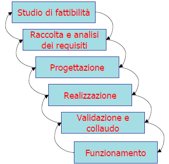{width="3.3839577865266843in"
height="0.8831167979002624in"}

Se per qualche motivo la transazione non può terminare correttamente la
sua esecuzione il DBMS deve “disfare” (**UNDO**) le eventuali modifiche
da essa apportate al DB.

{width="3.6680555555555556in"
height="1.1034722222222222in"}*Transazioni con savepoint*

Il modello di transazioni usato dai DBMS è in realtà più articolato; in
particolare è possibile definire dei cosiddetti “**savepoint**”, che
vengono utilizzati da una transazione per disfare solo parzialmente il
lavoro svolto.

Per definire un savepoint in DB2 si usa la sintassi SAVEPOINT &lt;nome
savepoint&gt; ON ROLLBACK RETAIN CURSORS

e per eseguire un rollback parziale ROLLBACK WORK TO SAVEPOINT &lt;nome
savepoint&gt;.

*Es*. Di default è abilitato l'**AUTOCOMMIT**, cioè ogni istruzione SQL
è una transazione a sé; è pertanto necessario invocare il CLP con DB2
+c.

  ----------------------------------------------------------------------------------------------
  **CONNECT TO** Sample
  
  **SELECT \* FROM** Department
  
  **INSERT INTO** Department(DeptNo,DeptName,AdmrDept) **VALUES** ('X00',‘nuovo dept 1','A00')
  
  **SAVEPOINT** pippo **ON ROLLBACK RETAIN CURSORS**
  
  **SELECT \* FROM** Department *-- per vedere che succede*
  
  **INSERT INTO** Department(DeptNo,DeptName,AdmrDept) **VALUES** ('Y00','nuovo dept 2','A00')
  
  **SELECT \* FROM** Department
  
  **ROLLBACK WORK TO SAVEPOINT** pippo
  
  **SELECT \* FROM** Department
  
  **COMMIT WORK**
  ----------------------------------------------------------------------------------------------

Trigger
-------

Un DBMS si dice **attivo** quando dispone di un sottosistema integrato
per definire e gestire **regole**. I trigger sono un caso specifico di
regole di tipo **ECA** (Evento, Condizione, Azione): un trigger si
attiva a fronte di un dato *evento* e, se sussiste una data
*condizione*, allora esegue una data *azione*.

*Composizione di un trigger*

  ----------------------------------------------------------------------
  **CREATE TRIGGER** EmpSalaryTooHigh
  
  **AFTER UPDATE OF** Salary **ON** Employee *-- evento*
  
  **REFERENCING NEW AS** N **OLD AS** O
  
  **FOR EACH ROW**
  
  **WHEN (N.Salary &gt; (SELECT Salary FROM Employee** *-- condizione*
  
  **WHERE** EmpCode = N.EmpManager**))**
  
  **UPDATE** Employee *-- azione*
  
  **SET** Salary = O.Salary
  
  **WHERE** EmpCode = N.EmpCode
  ----------------------------------------------------------------------

- Un trigger fa sempre riferimento a una singola tabella (**target**);
nell’esempio *Employee*

- Un **evento** è un istruzione SQL di manipolazione dei dati (INSERT,
DELETE, UPDATE); nell’esempio è UPDATE

- Una **condizione** è un predicato booleano; nell’esempio N.Saraly &gt;
(SELECT …)

- Un’**azione** è una sequenza di una o più istruzioni SQL; nell’esempio
le ultime tre righe

Se sono presenti più azioni vengono eseguite in maniera atomica con:
BEGIN ATOMIC &lt;istr1&gt;; &lt;istr2&gt;; END.

*Scopo dei trigger*

I trigger vengono tipicamente usati per gestire vincoli di integrità,
calcolare dati derivati, gestire eccezioni, ecc. Mediante i trigger è il
sistema che si fa cario di garantire la consistenza del DB, sollevando
quindi le applicazioni da tale onere e, allo stesso tempo, prevenendo
rischi di inconsistenze dovuti ad applicazioni mal progettate.

*Attivazione e granularità*

Un trigger può attivarsi prima (BEFORE) o dopo (AFTER) l’evento
corrispondente:

-   I **before trigger** vengono usati per condizionare l’esito
    dell’operazione oppure per bloccarla segnalando errore.

-   Gli **after trigger** servono invece a reagire alla modifica del DB
    mediante opportune azioni.

Nel caso di eventi che coinvolgano più tuple della tabella target, un
trigger può essere attivato come:

-   **Row trigger**: per ognuna di queste tiple (FOR EACH ROW), ad es.
    per controllare che tutti gli update siano legali

-   **Statement trigger**: solo una volta per data istruzione (FOR EACH
    STATEMENT), di fatto lavorando in modo aggregato, ad es. per contare
    quanti inserimenti sono stati eseguiti.

*Variabili e tabelle di transizione*

Un trigger ha spesso necessità di fare riferimento allo stato del DB
prima e/o dopo l’evento (ad es. per verificare che il nuovo stipendio
non sia maggiore di più del 20% di quello vecchio). A tale scopo si
possono usare 2 variabili e 2 tabelle di transizione:

-   **OLD:** valore della tupla prima della modifica

-   **NEW:** valore della tupla dopo la modifica

-   **OLD\_TABLE:** una ipotetica table che contiene tutte le tuple
    modificate, con i valori prima della modifica

-   **NEW\_TABLE:** idem, ma dopo la modifica

Non tutti i riferimenti hanno senso per tutti i tipi di eventi:

-   OLD e OLD\_TABLE hanno senso in caso di **INSERT**

-   NEW e NEW\_TABLE non hanno senso in caso di **DELETE**

Per usarli bisogna dichiararli con la clausola **REFERENCING**

  -----------------------------------
  **REFERENCING NEW AS** NewEmplyee
  
  **NEW\_TABLE AS** NewEmpTable
  -----------------------------------

*Es*. di statement trigger

  --------------------------------------------------------------------
  **CREATE TRIGGER** CheckSalariesUpdates
  
  **AFTER UPDATE OF** Salary **ON** Employee
  
  **REFERENCING NEW\_TABLE AS** NewEmpTable
  
  **FOR EACH STATEMENT**
  
  **WHEN ((SELECT AVG(**Salary**) FROM** Employee**) &gt; 1000)**
  
  **UPDATE** Employee
  
  **SET** Salary = 0.9\*Salary
  
  **WHERE** EmpCode **IN (SELECT** EmpCode **FROM** NewEmpTable**)**
  --------------------------------------------------------------------

Si vuole evitare che lo stipendio medio superi il valore di 1000.

Serve anche un trigger analogo per gli inserimenti.

*Before trigger*

I trigger di questo tipo sono tipicamente usati per far rispettare dei
vincoli di integrità. Un before trigger è necessariamente un *row
tigger*, e può usare solo le variabili NEW e OLD. Inoltre non può
includere azioni che modifichino il DB (quindi non può nemmeno attivare
gli altri trigger: NO CASCADE), ad eccezione della tupla in esame

  -------------------------------------------------------------------
  **CREATE TRIGGER** CheckEmpSalary
  
  **NO CASCADE BEFORE INSERT ON** Employee
  
  **REFERENCING NEW AS** NewEmp
  
  **FOR EACH ROW**
  
  **WHEN (**NewEmp.Salary **&gt; (SELECT** Salary **FROM** Employee
  
  **WHERE** EmpCode = NewEmp.EmpManager**))**
  
  **SIGNAL SQLSTATE** ‘70000’ **(**‘Stipendio troppo elevato!’**)**
  -------------------------------------------------------------------

L’istruzione SIGNAL annulla gli effetti dell’evento che ha attivato il
trigger.

Le azioni di un before trigger possono essere: SELECT, SIGNAL, SET (il
quale serve a modificare uno o più campi di una nuova tupla NEW). Ad
esempio:

  -------------------------------------------------------------------
  **CREATE TRIGGER** EmpMinSalary
  
  **NO CASCADE BEFORE INSERT ON** Employee
  
  **REFERENCING NEW AS** NewEmp
  
  **FOR EACH ROW**
  
  **SET** NewEmp.Salary **= (SELECT MIN(**Salary**) FROM** Employee
  
  **WHERE** Dept = NewEmp.Dept**),**
  
  NewEmp.EmpManager **= (SELECT** MgrCode **FROM** Department
  
  **WHERE** DeptCode = NewEmp.Dept**)**
  -------------------------------------------------------------------

Si ha una business rule che impone di assegnare ad ogni nuovo impiegato
lo stipendio minimo del suo dipartimento (e automaticamente anche il
manager di quel dipartimento).

I before trigger possono essere efficacemente usati per far rispettare
vincoli persi nella traduzione da schema concettuale a schema
relazionale. Ad esempio per i vincoli di *mutua esclusione*:

  -----------------------------------------------------------------
  **CREATE TRIGGER** DisjointFromErasmus
  
  **NO CASCADE BEFORE INSERT ON** StudIscritti
  
  **REFERENCING NEW AS** NewStud
  
  **FOR EACH ROW**
  
  **WHEN (EXISTS(SELECT \* FROM** StudErasmus E
  
  **WHERE** E.Matr = NewStud.Matr**))**
  
  **SIGNAL SQLSTATE ‘**70000’ **(‘**Matricola già presente!**’)**
  -----------------------------------------------------------------

Le matricole degli studenti iscritti devono essere distinte da quelle
degli studenti Erasmus.

Analogo trigger per inserimenti in StudErasmus.

*After trigger*

Un after trigger può includere le seguenti azioni: SELECT, INSERT,
DELETE, UPDATE, SIGNAL.

Un tipico esempio d’uso riguarda il *calcolo di dati derivati*:

  ---------------------------------------------------------
  **CREATE TRIGGER** UpdateQtaResidua
  
  **AFTER INSERT ON** Vendite
  
  **REFERENCING NEW AS** NuovaVendita
  
  **FOR EACH ROW**
  
  **UPDATE** Giacenze
  
  **SET** QtaResidua = Qtaresidua – NuovaVendita.Quantita
  
  **WHERE** CodProd = NuovaVendita.CodProd
  ---------------------------------------------------------

FATTURE(NumFattura, Data, Importo)

VENDITE(NumFattura,CodProd,Quantita)

GIACENZE(CodProd,Qtaresidua,ScortaMinima)

Aggiorna la quantità residua di tutti i prodotti venduti inseriti in una
nuova fattura

*Attivazioni di trigger in cascata*

In generale ragionare con i trigger è complesso, in quanti si possono
anche avere attivazioni in cascata:

  -----------------------------------------------------------
  **CREATE TRIGGER** InsertQtaDaOrdinare
  
  **AFTER UPDATE ON** Giacenze
  
  **REFERENCING NEW AS** NG
  
  **FOR EACH ROW**
  
  **WHEN (**NG.QtaResidua &lt; NG.ScortaMinima**)**
  
  **INSERT INTO** CARENZE
  
  **VALUES (**NG.CodProd,NG.SCortaMinima-NG.QtaResidua**)**
  -----------------------------------------------------------

GIACENZE(CodProd,Qtaresidua,ScortaMinima)

CARENZE(CodProd,QtaDaOrdinare)

Se la giacenza di un prodotto è minore del minimo provvede a inserire
una tupla in CARENZE

*Cicli di trigger*

Quando si ha attivazione in cascata è possibile avere anche cicli
infiniti

  -------------------------- --------------------------
  **CREATE TRIGGER** T1      **CREATE TRIGGER** T2
                             
  **AFTER INSERT INTO** R    **AFTER DELETE FROM** R
                             
  **REFERENCING NEW AS** N   **REFERENCING OLD AS** O
                             
  **FOR EACH ROW**           **FOR EACH ROW**
                             
  **DELETE FROM** R          **INSERT INTO** R
                             
  **WHERE** id=N.id          **VALUES** (O.id,…)
  -------------------------- --------------------------

  -------------------------------------------------------------
  **CREATE TRIGGER** CheckSalariesWrong
  
  **AFTER UPDATE OF** Salary **ON** Employee
  
  **FOR EACH ROW**
  
  **WHEN ((SELECT AVG**(Salary) **FROM** Employee) &gt; 1000)
  
  **UPDATE** Employee
  
  **SET** Salary = 1.1\*Salary
  -------------------------------------------------------------

I cicli si possono presentare anche con un solo trigger (ricorsivo, in
quanti ri-attiva se stesso)

*Costrutto IF…THEN…\[ELSE…\] END IF*

Un’azione può essere eseguita solo se sussiste una data condizione, ad
esempio:

  -----------------------------------------------------------------------
  **CREATE TRIGGER** DisjointFromErasmus
  
  **NO CASCADE BEFORE INSERT ON** StudIscritti
  
  **REFERENCING NEW AS** NewStud
  
  **FOR EACH ROW**
  
  **IF (EXISTS(SELECT \* FROM** StudErasmus E
  
  **WHERE** E.Matr = NewStud.Matr**))**
  
  **THEN SIGNAL SQLSTATE ‘**70000’ **(‘**Matricola già presente!**’);**
  
  **END IF**
  -----------------------------------------------------------------------

La condizione può ovviamente anche inserirsi nella clausola WHEN.

Con l’IF si può spezzare una condizione composta in due parti:

-   Parte semplice da valutare per il DBMS nel

> WHEN

-   Parte complessa nell’IF

> Inoltre si può diversificare l’azione se si usa ELSE

*Esempio di azioni alternative*

  -------------------------------------------------------------------
  **CREATE TRIGGER** DUEAZIONI
  
  **NO CASCADE BEFORE INSERT ON** Employee
  
  **REFERENCING NEW AS N**
  
  **FOR EACH ROW**
  
  **IF (**N.CodImp &gt; 100**) THEN**
  
  **SIGNAL SQLSTATE ‘**80000’ **(‘**Codice invalido’**);**
  
  **ELSE SET** N.Salary = **(SELECT MIN(**Salary**) FROM** Employee
  
  **WHERE** Dept = N.Dept**);**
  
  **END IF**
  -------------------------------------------------------------------

Questo trigger o segnala errore oppure provvede a completare la tupla
dell’impiegato inserito.

Notare i punti e virgola.

*Attivazione di più trigger in DB2*

In DB”, se un evento attiva più trigger, questi vengono eseguiti
rispettando l’ordine con cui sono stati definiti. Se un trigger T1
attiva un trigger T2, DB2 sospende l’esecuzione di T1 e inizia a
eseguire T2, il quale vede già gli eventuali effetti prodotti da T1.

Nel caso di attivazioni ricorsive, DB2 pone un limite massimo di 16
livelli di ricorsione.

MySQL e PHP
===========

MySQL è un Relational database management system (**RDBMS**, ovvero un
DBMS basato sul modello relazionale), composto da un client con
interfaccia a riga di comando e un server, entrambi disponibili sia per
sistemi Unix o Unix-like come GNU/Linux che per Windows, anche se
prevale un suo utilizzo in ambito Unix.

*Storia*

Creato dalla società MySQLAB sin dal 1979 soltanto dal 1996 supporta
anche SQL. Sun Microsystem nel 2008 rileva la società per 1 miliardo di
dollari. Nel 2010 Oracle acquista Sun per 7,5 miliardi di dollari
possedendo così anche MySQL. Dal 1996 supporta la maggior parte della
sintassi SQL e si prevede in futuro il pieno rispetto dello standard
ANSI. Possiede delle interfacce per diversi linguaggi, compreso un
driver ODBC, due driver Java, un driver per Mono e .NET ed una libreria
per python. Oggi l’ultima versione disponibile è la 5.6

*Amministrazione*

Esistono diversi tipi di **MySQL Manager**, ovvero di strumenti per
l'amministrazione di MySQL. Uno dei programmi più popolari per
amministrare i database MySQL è *phpMyAdmin* che si può utilizzare
facilmente tramite un qualsiasi browser, poi abbiamo altri di terze
parti come *HeidiSQL*, *SQLYog* o *Toad* *for MySQL*. In alternativa a
gestori grafici è possibile utilizzare direttamente la riga di comando,
preferita da utenti/amministratori esperti.

Engine
------

MySQL mette a disposizione diversi tipi di tabelle, ovvero degli
**Storage Engine** per la memorizzazione dei dati dove ognuna presenta
proprietà e caratteristiche differenti. Gli Storage Engine sono librerie
per MySQL e i suoi fork che implementano la gestione fisica dei dati.
Alcuni dei compiti affidati agli Storage Engine sono: scrittura dei
record, lettura dei record, indicizzazione, cache, transazioni.

Esiste una **API** che si può utilizzare per creare nuovi tipi di
tabella che si possono installare senza necessità di riavviare il
server.

Due sono i sistemi principali:

-   **Transazionali**: sono più sicuri, permettono di recuperare i dati
    anche in caso di crash, e consentono di effettuare modifiche tutte
    insieme;

-   **Non transazionali**: sono più veloci, occupano meno spazio su
    disco e minor richiesta di memoria.

*Engine: MyISAM*

MyISAM era lo storage engine di default dal MySQL 3.23 fino al MySQL
5.4. MyISAM utilizza la struttura ISAM e deriva da un tipo più vecchio,
oggi non più utilizzato, che si chiamava appunto ISAM. È un motore di
immagazzinamento dei dati estremamente veloce e richiede poche risorse,
sia in termini di memoria RAM, sia in termini di spazio su disco. Il suo
limite principale rispetto ad alcuni altri SE consiste nel mancato
supporto delle transazioni e alle foreign key. Ogni tabella MyISAM è
memorizzata all’interno del disco con tre file:

-   un file *.frm* che contiene la definizione della tabella,

-   un file *.MYD* per i dati

-   un file *.MYI* per gli indici (149% dei dati indicizzati)

*Engine: InnoDB*

InnoDB è un motore per il salvataggio di dati per MySQL, fornito in
tutte le sue distribuzioni (Default dalla versione 5.5). La sua
caratteristica principale è quella di supportare le transazioni di tipo
ACID (Atomicity, Consistency, Isolation, e Durability). InnoDB mette a
disposizione le seguenti funzionalità:

-   transazioni SQL con savepoint e transazioni XA;

-   lock a livello di record;

-   foreign key;

-   integrità referenziale;

-   colonne AUTOINCREMENT;

-   tablespace.

InnoDB offre delle ottime performance in termini di prestazioni e
utilizzo della CPU specialmente quando si ha a che fare con una grande
quantità di dati. InnoDB può interagire tranquillamente con tutti gli
altri tipi di tabelle in MySQL.

Le tabelle InnoDB sono soggette alle seguenti limitazioni:

-   Non è possibile creare più di **1000** colonne per tabella;

-   Su alcuni sistemi operativi le dimensioni del **tablespace** non
    possono superare i **2 Gb**;

-   La grandezza di tutti i **file di log** di InnoDB deve essere
    inferiore ai **4 Gb**;

-   La grandezza minima di un **tablespace** è di **10 MB**;

-   Non possono essere creati indici di tipo **FULLTEXT** con MySQL 5.5
    o precedente;

-   Le **SELECT COUNT(\*)** su tabelle di grandi dimensioni possono
    essere molto lente.

*MyISAM vs InnoDB*

Le differenze tra InnoDB e MyISAM sono:

-   {width="3.0625in"
    height="2.1055555555555556in"}Minore tempo necessario per riparare
    le tabelle in caso di crash. (InnoDB: tempo costante; MyISAM:
    dipendente dalle dimensioni della tabella);

-   InnoDB ha un sistema interno per la gestione della cache, mentre
    MyISAM si affida all’OS;

-   MyISAM generalmente immagazzina i record di una tabella nell'ordine
    in cui sono state create, mentre InnoDB le immagazzina nell'ordine
    seguito dalla chiave primaria. Quando viene utilizzata la chiave per
    la lettura di una riga, l'operazione avviene più rapidamente;

-   InnoDB comprime i record molto meno rispetto a MyISAM nonostante ciò
    InnoDB richiede il 20% di spazio in meno;

-   In InnoDB, le ricerche fulltext sono supportate sollo dalla versione
    5.6 di MySQL.

*Engine: Altri*

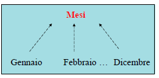{width="4.181817585301837in"
height="2.229316491688539in"}

Tipi di dati accettati
----------------------

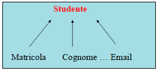{width="3.0625in" height="2.520249343832021in"}
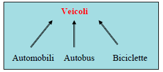{width="3.6354166666666665in"
height="2.2614009186351707in"}

{width="3.2065037182852145in"
height="2.2916666666666665in"}

Account e privilegi
-------------------

-   Creazione di un utente: **CREATE USER** ‘name’@‘host’ **IDENTIFIED**
    **BY** ‘PASSWORD’;

-   Assegnare privilegi ad un utente: **GRANT** privilege,… **ON** \*|
    ‘db’. \*| ‘db’. ‘table’ TO ‘username’@’host’, …;

    -   ‘**privilege**’ può essere uno dei seguenti valori:

        -   ALL

        -   USAGE

        -   SELECT, INSERT, UPDATE, DELETE

        -   CREATE, ALTER, INDEX, DROP, CREATE VIEW, TRIGGER

-   Rimuovere un utente: **DROP USER** ‘name’@’host’,…;

-   Rimuovere i privilegi di un utente: **REVOKE** privilege,… **ON**
    \*| ‘db’. \*| ‘db’. ‘table’ **FROM** ‘username’@’host’

    -   ‘**privilege**’ può essere uno dei seguenti valori:

        -   ALL PRIVILEGES

        -   USAGE

        -   SELECT, INSERT, UPDATE, DELETE

        -   CREATE, ALTER, INDEX, DROP, CREATE VIEW, TRIGGER

Comandi MySQL
-------------

*Gestione database*

-   Creazione di un database: **CREATE DATABASE \[IF NOT EXISTS\]**
    nome;

-   Cancellazione di un database: **DROP DATABASE \[IF EXISTS\]** nome;

-   Accesso ad un database: **USE** nome;

*Gestione tabelle*

  -------------------------------------------
  **CREATE TABLE \[IF NOT EXISTS\]** nome (
  
  campo1 TIPO1 ALTRI PARAMETRI,
  
  campo2 TIPO2 ALTRI PARAMETRI,
  
  …
  
  campoN TIPON ALTRI PARAMETRI,
  
  PRIMARY KEY(campo1, campo2)
  
  ) **ENGINE**=InnoDB;
  -------------------------------------------

Parametri:

**IF NOT EXISTS:** crea la tabella se non esiste

**NOT NULL**: non permette valori NULL nella colonna;

**AUTO\_INCREMENT**: una colonna il cui valore è calcolato
automaticamente in base ad un contatore interno;

**DEFAULT** valore: specifica un valore di default per un campo;

**NULL**: specifica che un campo può contenere valori NULL.

*Inserimento*

  -------------------------------------------------------------------------- ---------------------------------------------
  **INSERT INTO** table (field1, …, fieldN) **VALUES** (value1, …, valueN)   **INSERT INTO** table (field1, …, fieldN)
                                                                             
  \[ **ON DUPLICATE KEY UPDATE**                                             **SELECT** … **\[ ON DUPLICATE KEY UPDATE**
                                                                             
  field1=value1,                                                             field1=value1,
                                                                             
  …                                                                          …
                                                                             
  fieldN=valueN \]                                                           fieldN=valueN \]
  -------------------------------------------------------------------------- ---------------------------------------------

**DESCRIBE** nome: mostra informazioni sui campi contenuti in una
tabella.

*SELECT*

{width="5.090908792650919in"
height="2.7198009623797024in"}

-   **SELECT** seguita da una o più espressioni che saranno le colonne
    della tabella risultato;

-   **FROM** seguita da i nomi di una o più tabelle dalle quali devono
    essere estratti i dati, per ogni tabella si può specificare un
    alias;

-   **WHERE** che specifica le condizioni in base alle quali ogni riga
    sarà estratta oppure no dalle tabelle;

-   **GROUP BY** che specifica le colonne sui cui valori devono essere
    raggruppate le righe nel risultato: tutte le righe con valori uguali
    saranno ridotte a una;

-   **HAVING** che specifica ulteriori condizioni da applicare alle
    righe dopo il raggruppamento effettuato dalla GROUPBY;

-   **ORDER BY** che specifica in quale ordine figureranno le righe del
    risultato;

-   **LIMIT** che stabilisce il massimo numero di righe da estrarre.

*Valori NULL*

Il valore **NULL** per un campo assume il significato di «mancante,
sconosciuto». Esso è trattato diversamente dagli altri valori. Per
testare il valore di NULL non si possono usare i consueti operatori di
confronto =,&lt;, o &lt;&gt;. Esistono due operatori di confronto
appositi per valori NULL:

-   **IS NULL**

-   **IS NOT NULL**

Quando si usa **ORDER BY** i valori **NULL** sono inseriti all’inizio
con **ASC** ed alla fine con **DESC**.

*UPDATE*

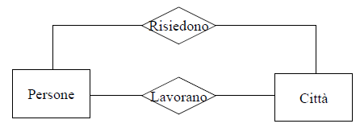{width="5.441558398950131in"
height="1.4798501749781277in"}

-   **SET**: specifichiamo quali colonne modificare e quali valori
    assegnare;

-   **WHERE**: le condizioni che determinano quali righe saranno
    modificate;

-   **ORDER BY**: per decidere in che ordine effettuare gli
    aggiornamenti;

-   **LIMIT**: per indicare il numero massimo di righe da modificare.

*DELETE*

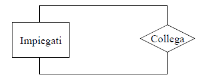{width="4.354166666666667in"
height="2.508206474190726in"}

-   **ORDER BY e LIMIT**: funzionano come in **UPDATE**;

-   **WHERE**: stabilisce le condizioni in base alle quali le righe
    verranno eliminate.

Funzioni e operatori
--------------------

  ------------------------------------------------------------------------------------ -------------------------------------------------------------------------------------
  {width="2.6666666666666665in" height="1.231946631671041in"}   {width="2.4895833333333335in" height="1.5823326771653543in"}
  ------------------------------------------------------------------------------------ -------------------------------------------------------------------------------------

*Operatori*

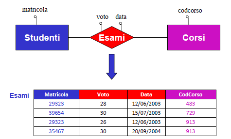{width="4.135416666666667in"
height="2.5808398950131233in"}

Per controllare se un numero è all’interno di un range di valori si può
usare una delle seguenti espressioni:

-   expr **BETWEEN** min **AND** max

-   expr **NOT BETWEEN** min **AND** max

Per confrontare rispetto ad una lista fissata di valori:

expr **IN** (value, …)

expr **NOT IN** (value, …)

**COALESCE**(val, …)

restituisce il primo elemento non-NULL di una lista;

**INTERVAL**(N,N1,N2,N3,...)

Ritorna:

-   0 se N &lt; N1;

-   1 se N &lt; N2;

-   ecc...

-   -1 se N è NULL.

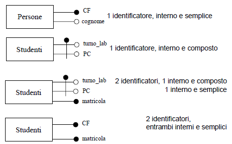{width="3.376388888888889in"
height="2.220138888888889in"}*Funzioni per il controllo di flusso*

{width="4.428472222222222in"
height="1.1958333333333333in"}Sono utili quando vogliamo eseguire dei
test sui valori contenuti in una tabella e decidere cosa estrarre in
base al risultato.

Le prime due (**CASE**) sono quasi uguali: nel primo caso viene
specificato un valore che sarà confrontato con quelli espressi dopo la
WHEN; il primo che risulta uguale determinerà il risultato
corrispondente (quello espresso con THEN).

Nel secondo caso non c’è un valore di riferimento, ma vengono valutate
le varie condizioni come espressioni booleane: la prima che risulta vera
determina il risultato corrispondente. In entrambi i casi, se è presente
il valore ELSE finale viene usato nel caso in cui nessuna delle
condizioni precedenti sia soddisfatta (in mancanza di ELSE verrebbe
restituito NULL).

Con la **IF** viene valutata la prima espressione: se vera viene
restituita la seconda, altrimenti la terza. **IFNULL** restituisce la
prima espressione se diversa da NULL, altrimenti la seconda. **NULLIF**
restituisce NULL se le due espressioni sono uguali; in caso contrario
restituisce la prima.

*Funzioni su stringhe*

Funzione conversioni che consentono di trasformare una stringa in tutta
minuscola o tutta maiuscola:

-   **LOWER**(str) , **LCASE**(str)

-   **UPPER**(str) , **UCASE**(str)

-   **LEFT** e **RIGHT** estraggono n caratteri a sinistra o a destra
    della stringa.

-   **SUBSTRING** restituisce una parte della stringa, a partire dal
    carattere specificato fino alla fine della stringa o, se indicato,
    per un certo numero di caratteri.

-   **LPAD** e **RPAD** aggiungono, a sinistra (LPAD) o a destra, i
    caratteri necessari a portare la stringa alla lunghezza specificata
    (eventualmente accorciandola se più lunga).

-   **LTRIM** e **RTRIM** eliminano gli spazi a sinistra (LTRIM) o a
    destra.

Funzioni manipolazione stringhe:

-   **ASCII**(str): ritorna il valore numerico del carattere più a
    sinistra di str;

-   **BIN**(N): Ritorna una stringa che rappresenta il valore binario di
    N;

-   **CONCAT\_WS**(separator,str1,str2,…): il primo argomento è il
    separatore il resto gli argomenti;

-   **CONV**(N,from\_base,to\_base): converte i numeri tra differenti
    basi;

-   **BIT\_LENGHT**(str): Ritorna la lunghezza della stringa str in bit;

-   **CHAR**(N,...): interpreta ogni argomento N come intero e ritorna
    una stringa consistente dei caratteri dati dal codice numerico degli
    interi;

-   **CHAR\_LENGTH**(str): ritorna la lunghezza della stringa misurata
    in caratteri;

-   **CONCAT**(str1,str2,...): ritorna la stringa che si ottiene
    concatenando gli argomenti. Ritorna NULL se un argomento è NULL.

Funzioni manipolazione stringhe:

-   **ELT**(N,str1,str2,str3,…): Ritorna str1 se N=1, str2 se N=2 ect…;

-   **FIELD**(str,str1,str2,str3,…): Ritorna la posizione di str in
    str1,str2,ect…;

-   **FIND\_IN\_SET**(str,strlist): Ritorna un valore nel range tra 1 a
    N se la stringa str è nella lista delle stringhe strlist (ovvero N
    sottostringhe, separate da “,”);

-   **HEX**(N\_o\_S): ritorna il valore esadecimale della stringa;

-   **LEFT**(str,len): Ritorna i len caratteri più a sinistra di str;

-   **INSTR**(str, substr): Ritorna la posizione della prima occorrenza
    della substr in str;

-   **LENGTH**(str): Ritorna la lunghezza della stringa str in bytes;

-   **LOCATE**(substr,str) / LOCATE(substr,str,pos): La prima sintassi
    ritorna la posizione delle prima occorrenza di substr in str, la
    seconda inizia la ricerca dalla posizione pos;

-   **LTRIM**(str): Ritorna str con gli spazi iniziali rimossi.

-   **REPEAT**(str,count): Ritorna una stringa formata da str ripetura
    count volte;

-   **REPLACE**(str,from,to): Rimpiazza tutte le occorrenze di from in
    to da str;

-   **REVERSE**(str): Ritorna la stringa invertita;

-   **RIGHT**(str,len): Ritorna i len caratteri più a destra di str;

-   **RTRIM**(str): Ritorna la stringa str con gli spazi finali rimossi;

-   **STRCMP**(expr1,expr2): Ritorna 0 (zero) se le due stringhe sono
    uguali, -1 se il primo argomento è più piccolo del secondo, 1
    altrimenti.

*Es*.

  -----------------------------------------------------------------------------------------------------------------------------------------
  **SELECT CONCAT\_WS**(‘;’,'Primo’,'Secondo’,'Terzo’);
  
  -&gt; Primo;Secondo;Terzo
  
  **SELECT LOWER**(‘Primo’);
  
  -&gt; primo
  
  **SELECT RIGHT**(‘Primo’,2);
  
  -&gt; mo
  
  **SELECT LENGTH**(‘Primo’);
  
  -&gt; 5
  
  **SELECT LPAD**(‘Primo’,7,’\_');
  
  -&gt; \_\_Primo
  
  **SELECT LTRIM**(‘ Primo’);
  
  -&gt; Primo
  
  **SELECT SUBSTRING**(‘Primo’,2);
  
  -&gt; rimo
  
  **SELECT SUBSTRING**(‘Primo’,2,3);
  
  -&gt; rim
  
  **SELECT \* FROM** tabella **WHERE FIND\_IN\_SET**(‘Primo’,col1) &gt; 0
  
  -&gt; (restituisce le righe in cui il valore ‘Primo’ è attivo nella colonna col1, ipotizzando che si tratti di una colonna di tipo SET)
  -----------------------------------------------------------------------------------------------------------------------------------------

*Riceca Full-Text*

  --------------------------------------------------
  **MATCH** (col1,col2,…) **AGAINST** (expr
  
  \[**IN BOOLEAN MODE | WITH QUERY EXPANSION**\]):
  --------------------------------------------------

MATCH ... AGAINST è utilizzata per ricerche full text; ritorna la
rilevanza tra il testo che si trova nelle colonne (col1,col2,...) e la
query expr.

La similarità è un valore positivo in virgola mobile.

La funzione **match** esegue una ricerca in linguaggio naturale per una
stringa contro un testo che è rappresentato da una o più colonne incluse
in un indice FULL TEXT. La ricerca di default è case-insensitive.

È possibile eseguire una ricerca full-text in boolean mode, i segni + e
– indicano le parole che devono essere presenti o assenti,
rispettivamente per un match che occorre. A volte la stringa di ricerca
è troppo corta e potrebbe tralasciare dei risultati significativi, è
possibile utilizzare query expansion per ovviare a questo problema.

Esempi di script in MySQL
-------------------------

  ----------------------------------------------------------------------------------------------------------------------------------------------------------------------------
  **Example 1 MySQL**
  ----------------------------------------------------------------------------------------------------------------------------------------------------------------------------
  *-- 1. Mostra il nome dell'utente corrente*
  
  **SELECT** **user**();
  
  *-- 2. Mostra la versione, la data, e l'ora corrente*
  
  **SELECT** **version**(), **current\_date**, **current\_time**, **current\_timestamp**;
  
  *-- 3. Mostra l'elenco dei database*
  
  **SHOW** **DATABASES**;
  
  *-- 4. Crea un database*
  
  **CREATE** **DATABASE** **IF** **NOT** **EXISTS** prova;
  
  *-- 5. Seleziona il database di prova*
  
  **USE** prova;
  
  *-- 6. Crea una tabella di esempio*
  
  **CREATE** **TABLE** country (
  
  > country\_id **SMALLINT** **UNSIGNED** **NOT** **NULL** **AUTO\_INCREMENT**,
  >
  > country **VARCHAR**(50) **NOT** **NULL**,
  >
  > last\_update **TIMESTAMP** **NOT** **NULL** **DEFAULT** **CURRENT\_TIMESTAMP** **ON** **UPDATE** **CURRENT\_TIMESTAMP**,
  >
  > **PRIMARY** **KEY** (country\_id)
  
  )**ENGINE**=**InnoDB** **DEFAULT** **CHARSET**=**utf8**;
  
  **CREATE** **TABLE** city (
  
  > city\_id **SMALLINT** **UNSIGNED** **NOT** **NULL** **AUTO\_INCREMENT**,
  >
  > city **VARCHAR**(50) **NOT** **NULL**,
  >
  > country\_id **SMALLINT** **UNSIGNED** **NOT** **NULL**,
  >
  > last\_update **TIMESTAMP** **NOT** **NULL** **DEFAULT** **CURRENT\_TIMESTAMP** **ON** **UPDATE** **CURRENT\_TIMESTAMP**,
  >
  > **PRIMARY** **KEY** (city\_id),
  >
  > **KEY** idx\_fk\_country\_id (country\_id),
  >
  > **CONSTRAINT** \`fk\_city\_country\` **FOREIGN** **KEY** (country\_id) **REFERENCES** country (country\_id) **ON** **DELETE** **RESTRICT** **ON** **UPDATE** **CASCADE**
  
  )**ENGINE**=**InnoDB** **DEFAULT** **CHARSET**=**utf8**;
  
  *-- 7. Uso del comando DESCRIBE*
  
  **DESCRIBE** city;
  
  *-- 8. Esempio Insert*
  
  *-- USE prova;*
  
  **INSERT** **INTO** country (country\_id, country) **VALUES** (1,'Afghanistan'),(**NULL**, 'Algeria');
  
  **INSERT** **INTO** city (city\_id, city, country\_id) **VALUES** (1,'Kabul',1);
  
  *-- Cancella la tabella di esempio*
  
  **DROP** **TABLE** city;
  
  *-- Cancella un database*
  
  **DROP** **DATABASE** **IF** **EXISTS** prova;
  ----------------------------------------------------------------------------------------------------------------------------------------------------------------------------

  -------------------------------------------------------------------------------------------------------------
  **Example 2 MySQL**
  -------------------------------------------------------------------------------------------------------------
  *-- 1. Seleziona gli identificativi, i nomi e le email dei primi 10 clienti ordinati per cognome e nome*
  
  **SELECT** customer\_id, last\_name, first\_name, email
  
  > **FROM** customer
  >
  > **ORDER** **BY** last\_name **ASC**, first\_name **ASC**
  >
  > **LIMIT** 0,10;
  
  *-- 2. Seleziona gli utenti che sono stati aggiunti dopo le 22:04:37 del 14 aprile 2006*
  
  **SELECT** \* **FROM** customer
  
  > **WHERE** create\_date &gt;= '2006-02-14 22:04:37'
  >
  > **ORDER** **BY** last\_name **ASC**;
  
  *-- 3. Cerca i film il cui nome inizia per "W"*
  
  **SELECT** \* **FROM** film
  
  > **WHERE** title **LIKE** 'W%'
  >
  > **ORDER** **BY** title **ASC**;
  
  *-- 4. Altro modo*
  
  **SELECT** \* **FROM** film
  
  > **WHERE** title **REGEXP** '\^W'
  >
  > **ORDER** **BY** title **ASC**;
  
  *-- 5. Cerca i film che contengono "W\*R"*
  
  **SELECT** \* **FROM** film
  
  > **WHERE** title **LIKE** '% W\_R %'
  >
  > **ORDER** **BY** title **ASC**;
  
  *-- 6. Cerca i film che non sono ancora stati restituiti;*
  
  **SELECT** F.film\_id, F.title, F.description, I.store\_id, R.return\_date
  
  > **FROM** film **AS** F, inventory **AS** I, rental **AS** R
  >
  > **WHERE**
  >
  > I.film\_id = F.film\_id **AND**
  >
  > R.inventory\_id = I.inventory\_id **AND**
  >
  > R.return\_date = **NULL**
  
  **ORDER** **BY** F.title **ASC**;
  
  *-- Perchè 6 non funziona?*
  
  **SELECT** 1=**NULL**, 1&lt;&gt;**NULL**, 1&lt;**NULL**, 1&gt;**NULL**;
  
  *-- 7. Cerca i film che non sono ancora stati restituiti;*
  
  **SELECT** F.film\_id, F.title, F.description, I.store\_id, R.return\_date
  
  **FROM** film **AS** F, inventory **AS** I, rental **AS** R
  
  **WHERE**
  
  > I.film\_id = F.film\_id **AND**
  >
  > R.inventory\_id = I.inventory\_id **AND**
  >
  > R.return\_date **IS** **NULL**
  
  **ORDER** **BY** F.title **ASC**;
  
  *-- 8. Quante volte un film è stato noleggiato e restituito?*
  
  **SELECT** F.film\_id, F.title, **COUNT**(R.rental\_id) **AS** Conteggio
  
  **FROM** film **AS** F, inventory **AS** I, rental **AS** R
  
  **WHERE**
  
  > I.film\_id = F.film\_id **AND**
  >
  > R.inventory\_id = I.inventory\_id
  >
  > **GROUP** **BY** F.film\_id
  >
  > **ORDER** **BY** Conteggio **DESC**;
  
  *-- 9. Perchè non compaiogno quelli con 0 nolegi e restituzioni? Bisogna costruire una query più complessa*
  
  **SELECT** F.film\_id, F.title, **IFNULL**(C.Conteggio, 0) **AS** ConteggioCorretto
  
  **FROM** film **AS** F
  
  **LEFT** **JOIN** (
  
  **SELECT** I.film\_id, **COUNT**(R.rental\_id) **AS** Conteggio
  
  **FROM** inventory **AS** I
  
  **LEFT** **JOIN** rental **AS** R **ON** R.inventory\_id = I.inventory\_id
  
  **GROUP** **BY** I.film\_id
  
  ) **AS** C **ON** F.film\_id = C.film\_id
  
  **ORDER** **BY** Conteggio **DESC**;
  -------------------------------------------------------------------------------------------------------------

  ----------------------------------------------------------------------------------------------------------------------------
  **Example 3 MySQL**
  ----------------------------------------------------------------------------------------------------------------------------
  *-- 1. Alcune operazioni matematiche*
  
  **SELECT** 3\*5, 3-5, 3\*5, 3/5, 3%5, **ABS**(-3), **FLOOR**(3/5), **CEIL**(3/5);
  
  *-- 2. Alcune operazioni matematiche - Continua*
  
  **SELECT** **SIN**(90), **COS**(90), **LN**(2), **LOG**(2), **LOG**(10, 100);
  
  *-- 3. Operatori logici*
  
  **SELECT** **NOT** 0, **NOT** **NULL**, 1 && 1, 1 && 0, 1 && **NULL**, 0 && **NULL**;
  
  *-- 4. Operatori logici - Continua*
  
  **SELECT** 1 || 1, 0 || 1, 0 || **NULL**, 1 || **NULL**, 1 **XOR** 1, 1 **XOR** 0, 1 **XOR** **NULL**, 0 **XOR** **NULL**;
  
  *-- 5. Operatori di confronto*
  
  **SELECT** 1=0, 1=1, 1&lt;&gt;1, 1=**NULL**, 1&lt;=&gt;**NULL**, **NULL**&lt;=&gt;**NULL**;
  
  *-- 6. Operatore between*
  
  **SELECT** 1 **BETWEEN** 2 **AND** 3, 2 **BETWEEN** 2 **AND** 3, 1 **NOT** **BETWEEN** 2 **AND** 3;
  
  *-- 7. Operatore IN*
  
  **SELECT** 0 **IN** (1,2,5,7), 3 **NOT** **IN** (1,2,5,7);
  
  *-- 8. Lavorare con i NULL*
  
  **SELECT** **ISNULL**(0), **ISNULL**(**NULL**), **COALESCE**(**NULL**, **NULL**, 1), **IFNULL**(**NULL**, 10);
  
  *-- 9. Operatore INTERVAL*
  
  **SELECT** **INTERVAL**(23,1,15,17,30,44,200);
  
  *-- 10. Controllo del flusso*
  
  **SELECT** film\_id, title,
  
  **CASE** rating
  
  > **WHEN** 'G' **THEN** 'General Audiences'
  >
  > **WHEN** 'PG' **THEN** 'Parental Guidance Suggested'
  >
  > **WHEN** 'PG-13' **THEN** 'Parents Strongly Cautioned'
  >
  > **WHEN** 'R' **THEN** 'Restricted'
  >
  > **WHEN** 'NC-17' **THEN** 'No one 17 and under admitted'
  
  **ELSE** 'There is nothing else'
  
  **END** **AS** ExplainedRating,
  
  **IF**(**STRCMP**(rating, 'NC-17')=0, 'YES', 'no') **AS** RequireID **FROM** film;
  
  *-- 11. Operatori su stringhe*
  
  **SELECT** **ASCII**('d'), **ASCII**('dx'), **BIN**(12), **BIT\_LENGTH**('text'), **CHAR**(77,121,83,81,76);
  
  *-- 12. Operatori su stringhe - Continua*
  
  **SELECT** C.customer\_id,
  
  **CONCAT**(C.first\_name, ' ', C.last\_name) **AS** name,
  
  **CONCAT\_WS**(', ', A.address, **IF**(**STRCMP**(A.address2,'')=0, **NULL**, A.address2)) **AS** address,
  
  A.postal\_code, A.phone, CI.city, CO.country
  
  **FROM**
  
  customer **AS** C
  
  > **JOIN** address **AS** A **ON** A.address\_id = C.address\_id
  >
  > **JOIN** city **AS** CI **ON** CI.city\_id = A.city\_id
  >
  > **JOIN** country **AS** CO **ON** CO.country\_id = CI.country\_id
  
  **WHERE** active &lt;&gt; 0;
  
  *-- 13. Full-Text Search*
  
  **SET** @WORD = 'circus';
  
  **SELECT** film\_id, title,
  
  **MATCH**(title, description) **AGAINST** (@WORD) **AS** score
  
  **FROM** film\_text
  
  **WHERE**
  
  **MATCH**(title, description) **AGAINST** (@WORD);
  
  *-- 14. Full-Text Search - Continua*
  
  **SET** @WORD = 'circus';
  
  **SELECT** film\_id, title,
  
  > **MATCH**(title, description) **AGAINST** (@WORD **WITH** **QUERY** **EXPANSION**) **AS** score,
  >
  > **MATCH**(title, description) **AGAINST** (@WORD) **AS** score2
  
  **FROM** film\_text
  
  **WHERE**
  
  **MATCH**(title, description) **AGAINST** (@WORD **WITH** **QUERY** **EXPANSION**);
  ----------------------------------------------------------------------------------------------------------------------------

  -------------------------------------------------------------------------------------------------------------------------------------------------------------------------------------------------------------------
  **Example 4 MySQL**
  -------------------------------------------------------------------------------------------------------------------------------------------------------------------------------------------------------------------
  **SET** @STAFF = 1, @CUSTOMER = 3, @STORE = 2, @FILM = 2, @INVENTORY = **NULL**;
  
  *-- 1. Nolegio di un FILM*
  
  *-- 1.1 Il film è disponibile?*
  
  **SELECT**
  
  @INVENTORY := inventory\_id
  
  **FROM** inventory
  
  **WHERE**
  
  > film\_id = @FILM **AND** store\_id = @STORE **AND**
  >
  > inventory\_in\_stock(inventory\_id)
  
  **LIMIT** 0, 1;
  
  **SELECT** @INVENTORY **AS** ID, inventory\_in\_stock(@INVENTORY) **AS** Available;
  
  *-- 1.2 Se si aggiungo il nuovo record per il nolegio*
  
  **INSERT** **INTO** rental(rental\_date, inventory\_id, customer\_id, staff\_id)
  
  **VALUES** (**NOW**(), @INVENTORY, @CUSTOMER, @STAFF);
  
  **SELECT** @RENTAL\_ID := **LAST\_INSERT\_ID**();
  
  *-- 1.3 Calcolo il costo del nolegio:*
  
  *-- 1.3.1 Calcolo il costo del nolegio corrente e di tutti i precedenti*
  
  **SELECT**
  
  @RENT\_FEES := **IFNULL**(**SUM**(film.rental\_rate),0)
  
  **FROM**
  
  film, inventory, rental
  
  **WHERE**
  
  > film.film\_id = inventory.film\_id **AND** inventory.inventory\_id = rental.inventory\_id **AND**
  >
  > rental.rental\_date &lt;= **NOW**() **AND** rental.customer\_id = @CUSTOMER;
  
  *-- 1.3.2 Calcolo gli eventuali costi di ritardo per nolegi passati*
  
  **SELECT**
  
  @OVER\_FEES :=
  
  **IFNULL**(
  
  **SUM**(
  
  > **IF**((**TO\_DAYS**(rental.return\_date) - **TO\_DAYS**(rental.rental\_date)) &gt; film.rental\_duration, ((**TO\_DAYS**(rental.return\_date) - **TO\_DAYS**(rental.rental\_date)) - film.rental\_duration),0)
  
  ),0)
  
  **FROM** rental, inventory, film
  
  **WHERE**
  
  > film.film\_id = inventory.film\_id **AND** inventory.inventory\_id = rental.inventory\_id **AND**
  >
  > rental.rental\_date &lt;= **NOW**() **AND** rental.customer\_id = @CUSTOMER;
  
  *-- 1.3.3 Calcolo quanto l'utente ha pagato fino ad ora*
  
  **SELECT**
  
  @PAID := **IFNULL**(**SUM**(payment.amount),0)
  
  **FROM** payment
  
  **WHERE** payment.payment\_date &lt;= **NOW**()
  
  **AND** payment.customer\_id = @CUSTOMER;
  
  *-- 1.3 Ecco l'ammontare da pagare*
  
  **SELECT** @TOPAY := @RENT\_FEES + @OVER\_FEES - @PAID;
  
  *-- 1.4 L'utente paga tutto adesso quindi aggiungo il pagamento*
  
  **INSERT** **INTO** payment (customer\_id, staff\_id, rental\_id, amount, payment\_date)
  
  **VALUES**(@CUSTOMER, @STAFF, @RENTAL\_ID, @TOPAY, **NOW**());
  
  *-- --------------------------------------------------------------------------------------------------------------*
  
  *-- 2. L'utente restituisce un Film*
  
  *-- 2.1 Recupero l'identificativo del nolegio*
  
  **SELECT** @RENTAL\_ID := rental\_id
  
  **FROM** rental
  
  **WHERE**
  
  > inventory\_id = @INVENTORY **AND**
  >
  > customer\_id = @CUSTOMER **AND**
  >
  > return\_date **IS** **NULL**;
  
  **SELECT** \* **FROM** rental **WHERE** rental\_id = @RENTAL\_ID;
  
  *-- 2.2 Aggiorno la data di restituzione*
  
  **UPDATE** rental
  
  **SET** return\_date = **NOW**()
  
  **WHERE** rental\_id = @RENTAL\_ID;
  
  **SELECT** \* **FROM** rental **WHERE** rental\_id = @RENTAL\_ID;
  
  *-- 2.3 C'è altro da pagare?*
  
  **SELECT** get\_customer\_balance(@CUSTOMER, **NOW**());
  
  *-- --------------------------------------------------------------------------------------------------------------*
  
  *-- 3. Trovare tutti i film scaduti che non sono stati restituiti*
  
  **SELECT**
  
  **CONCAT**(C.last\_name, ' ', C.first\_name) **AS** customer,
  
  A.phone, F.title,
  
  (**TO\_DAYS**(**CURRENT\_DATE**()) - **TO\_DAYS**(R.rental\_date)) **AS** overdue
  
  **FROM** rental **AS** R
  
  **INNER** **JOIN** customer **AS** C **ON** R.customer\_id = C.customer\_id
  
  **INNER** **JOIN** address **AS** A **ON** C.address\_id = A.address\_id
  
  **INNER** **JOIN** inventory **AS** I **ON** R.inventory\_id = I.inventory\_id
  
  **INNER** **JOIN** film **AS** F **ON** I.film\_id = F.film\_id
  
  **WHERE**
  
  R.return\_date **IS** **NULL** **AND**
  
  (R.rental\_date + **INTERVAL** F.rental\_duration **DAY**) &lt; **CURRENT\_DATE**()
  
  **ORDER** **BY** customer **ASC**;
  -------------------------------------------------------------------------------------------------------------------------------------------------------------------------------------------------------------------

*Installazione*

Da questa pagina
[*http://dev.mysql.com/downloads/mysql/*](http://dev.mysql.com/downloads/mysql/)
è possibile scaricare tutte le versioni di MySQL disponibili. A noi
interessa la versione solo Server, per poi andare ad installare
**phpMyAdmin** per gestire il server. Installaremo comunque tutto in
seguito tramite il pachetto XAMPP.

*Connessione al server*

{width="3.545138888888889in"
height="1.79375in"}Dopo aver installato MySQL server, al primo avvio
configuriamo *nome utente* e *password* del database e dopo avviamo la
finestra a linea di comando.

Per uscire digitare “quit” o “exit”, mentre per ricevere la lista di
tutti i comandi disponibili digitare “help”.

Con “status” si visualizzano alcune informazioni relative al server e
alla connessione.

{width="2.4298611111111112in"
height="1.8333333333333333in"}

phpMyAdmin
----------

phpMyAdmin è un'applicazione web scritta in **PHP**, rilasciata con
**licenza GPL**, che consente di amministrare un database MySQL tramite
un qualsiasi browser. L'applicazione è indirizzata sia agli
amministratori del database, sia agli utenti. Gestisce i permessi
prelevandoli dal database MySQL.

phpMyAdmin permette di creare un database da zero, creare le tabelle ed
eseguire operazioni di ottimizzazione sulle stesse. Presenta un feedback
sulla creazione delle tabelle per evitare eventuali errori. Sono
previste delle funzionalità per l'inserimento dei dati (popolazione del
database), per le query, per il backup dei dati, ecc.

L'amministratore ha anche a disposizione un'interfaccia grafica per la
gestione degli utenti: l'interfaccia permette l'inserimento di un nuovo
utente, la modifica della relativa password e la gestione dei permessi
che l'utente ha sul database.

*Licenza GPL*

{width="2.1555555555555554in"
height="1.0694444444444444in"}La GNU General Public License, comunemente
indicata con l'acronimo GNU GPL o semplicemente GPL, è una licenza per
software libero, originariamente stesa nel 1989 da Richard Stallman per
distribuire i programmi creati nell'ambito del Progetto GNU della Free
Software Foundation (FSF). La versione 2.0 di tale licenza è attualmente
la licenza di software libero per antonomasia.

Contrapponendosi alle licenze per software proprietario, la GNU GPL
assicura all'utente **libertà di utilizzo, copia, modifica e
distribuzione**. La GPL ha incontrato un gran successo fra gli autori di
software sin dalla sua creazione, ed è oggi la più diffusa licenza per
il software libero, arrivata ormai alla versione 3.

*Installazione*

Innanzitutto bisogna aver installato e configurato MySQL e Apache, e
bisogna che siano attivi. phpMyAdmin va salvato in una cartella web (per
esempio www, wwwroot, etc). Se non si è esperti nell'installazione di
Apache, PHP o MySQL, si possono utilizzare pacchetti già preconfezionati
che installano tutti i software in un singolo passaggio, come XAMPP.

*Apache*

Apache HTTP Server, o più comunemente Apache, è il nome dato alla
piattaforma server Web modulare più diffusa, in grado di operare da
sistemi operativi UNIX/Linux e Microsoft.

Apache è un software che realizza le funzioni di **trasporto** delle
informazioni, di internetwork e di **collegamento**, ha il vantaggio di
offrire anche funzioni di controllo per la **sicurezza** come quelli che
compie il proxy.

*XAMPP*

XAMPP è una piattaforma software gratuita costituita da Apache HTTP
Server, il database MySQL e tutti gli strumenti necessari per utilizzare
i linguaggi di programmazione PHP e Perl. Il nome è un acronimo dei
programmi sopra citati: la **X** sta per cross-platform, la **A** sta
per Apache HTTP Server, la **M** sta per MySQL, la **P** sta per PHP e
l'ultima **P** sta per Perl.

Su queste piattaforme si appoggiano spesso siti web e altre piattaforme
di sviluppo web dinamico (CMS) come Wordpress, Drupal e Joomla!.

Download:
[*http://www.apachefriends.org/it/xampp.html*](http://www.apachefriends.org/it/xampp.html)

*Configurazione di phpMyAdmin*

Dopo aver installato il pacchetto XAMPP, avviare **XAMPP Control
Center**.

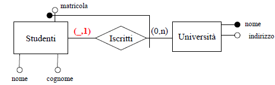{width="4.311111111111111in"
height="2.761111111111111in"}

Cliccare su *Start* per quanto riguarda i moduli Apache e MySQL;
cliccare su *Admin* del modulo MySQL e si aprirà il browser predefinito
con phpMyAdmin.

Indirizzo: [*localhost/phpmyadmin/*](http://localhost/phpmyadmin/)

PHP
---

PHP (acronimo ricorsivo di "*PHP: Hypertext Preprocessor*",
preprocessore di ipertesti) è un linguaggio di programmazione
**interpretato**, originariamente concepito per la programmazione Web
ovvero per la realizzazione di pagine web dinamiche.

*Scopo*

Attualmente è utilizzato principalmente per sviluppare applicazioni web
lato server, ma può essere usato anche per scrivere script a riga di
comando o **applicazioni stand-alone con interfaccia** grafica. Un
esempio di software scritto in PHP è MediaWiki, su cui si basano
progetti wiki come Wikipedia e Wikizionario.

*Caratteristiche*

PHP riprende per molti versi la sintassi del C, come peraltro fanno
molti linguaggi moderni, e del Perl. È un linguaggio a tipizzazione
debole e dalla versione 5 migliora il supporto al paradigma di
programmazione ad oggetti. Certi costrutti derivati dal C, come gli
operatori fra bit e la gestione di stringhe come array, permettono in
alcuni casi di agire a basso livello; tuttavia è fondamentalmente un
linguaggio di alto livello, caratteristica questa rafforzata
dall'esistenza delle sue moltissime API, oltre 3.000 funzioni del nucleo
base.

*Interfacciarsi con un database*

PHP è in grado di interfacciarsi a innumerevoli database tra cui MySQL,
PostgreSQL, MariaDB, Oracle, Firebird, IBM DB2, Microsoft SQL Server,
solo per citarne alcuni, e supporta numerose tecnologie, come XML, SOAP,
IMAP, FTP, CORBA. Si integra anche con altri linguaggi/piattaforme quali
Java e .NET e si può dire che esista un wrapper per ogni libreria
esistente, come CURL, GD, Gettext, GMP, Ming, OpenSSL ed altro.

Fornisce un'API specifica per interagire con Apache, nonostante funzioni
naturalmente con numerosi altri server web. È anche ottimamente
integrato con il database MySQL, per il quale possiede più di una API.
Per questo motivo esiste un'enorme quantità di script e librerie in PHP,
disponibili liberamente su Internet. La versione 5, comunque, integra al
suo interno un piccolo database embedded, SQLite.

*Associazione con phpMyAdmin*

Usando phpMyAdmin possiamo creare lo schema e la struttura di un
database, e possiamo anche eseguire query e inserimenti di elementi nel
DB. Ma cosa bisogna fare per creare una pagina web dinamica che associ
ad un bottone una funzione SELECT o INSERT? Dobbiamo utilizzare gli
schemi creati con phpMyAdmin associati con il linguaggio PHP.

Esso è, come già detto, un linguaggio di programmazione “lato server”
che permette la creazione di pagine dinamiche. PHP produce codice HTML
(condizionato) tramite i tag:

  -------------------------
  &lt;?php //tag apertura
  
  ?&gt; //tag chisura
  -------------------------

Ovviamente per provare questo file non possiamo farlo partire
direttamente cliccandoci, poiché deve essere interpretato dal server.
Faremo dunque uso del Localhost

*Localhost*

Nelle reti TCP/IP l'indirizzo IP di localhost è 127.0.0.1 in IPv4, o ::1
in IPv6, che può essere usato dalle applicazioni per comunicare con lo
stesso sistema su cui sono in esecuzione. Essere in grado di comunicare
con la propria macchina locale come se fosse una **macchina remota** è
utile a scopo di **test**, nonché per contattare servizi che si trovano
sulla propria macchina, ma che il client si aspetta siano remoti.

L'RFC "Special-Use IPv4 Addresses" (RFC 3330) descrive 127.0.0.0/8
(quindi 127.0.0.0 con subnet mask 255.0.0.0) come un insieme di
indirizzi IPv4 riservati al loopback.

Ulteriori lezioni sulla sintassi e l’utilizzo del linguaggio PHP possono
essere trovate qui:
[*http://www.youtube.com/watch?v=m63mcQ55\_WA&list=PL1B0EA7FB4A308CA9*](http://www.youtube.com/watch?v=m63mcQ55_WA&list=PL1B0EA7FB4A308CA9)

Progettazione di una base di dati
=================================

{width="1.976388888888889in"
height="1.925in"}Come in ogni ciclo di vita di un sistema informatico,
il progetto di una basi di dati ha anche essa un’attività **ciclica**
(iterativa), ovvero un insieme o sequenza di attività svolte da
analisti, progettisti, utenti, nello sviluppo e nell’uso dei sistemi
informativi, che consiste dei seguenti passi:

-   Studio di fattibilità

-   Raccolta ed analisi dei requisiti (Individuare proprietà e
    funzionalità del sistema)

-   Progettazione (individua l’organizzazione e la struttura della base
    di dati e schematizza le operazioni sui dati)

-   Implementazione

-   Validazione e collaudo

-   Funzionamento e manutenzione

Questa procedura, ripresa dall’ingegneria del software, separa in
maniera netta le decisioni relative a cosa rappresentare in una base di
dati (prima fase), da quelle relative a come farlo (seconda fase).

*Progettazione guidata dai dati*

La progettazione di un sistema informativo riguarda 2 aspetti:

-   Progettazione dei dati

-   Progettazione delle applicazioni

Il ruolo primario viene svolto dai dati, in quanto sono
(strutturalmente) più stabili e sono condivisi da più applicazioni. È
quindi opportuno progettare innanzitutto la base di dati e
successivamente le applicazioni. In pratica lo sviluppo può anche
procedere in parallelo, anziché in cascata, alternando le due attività.

*Metodologia di progettazione*

Per progettare una base di dati (ma non solo) di buona qualità è
opportuno seguire una **metodologia di progettazione** che: definisca le
**fasi** in cui l’attività di progettazione si articola; fornisca dei
**criteri** per scegliere tra diverse alternative; sia supportata da dei
**modelli** di rappresentazione; sia di **applicabilità generale** e
**facile da utilizzare**.

{width="4.020833333333333in"
height="2.557665135608049in"}

*Fasi di progettazione*

La metodologia introdotta prevede 3 fasi di progettazione; distinguiamo:

– la progettazione concettuale;

– la progettazione logica;

– la progettazione fisica.

Ognuna delle fasi si basa su un modello, che permette di generare una
rappresentazione formale (schema) della base di dati ad un dato livello
di astrazione (concettuale, logico e fisico): schema concettuale; schema
logico e schema fisico.

*Modello dei dati: logici vs concettuali*

Un **modello dei dati** è una collezione di concetti che vengono
utilizzati per descrivere i dati, le loro associazioni, e i vincoli che
questi devono rispettare.

Un ruolo di primaria importanza nella definizione di un modello dei dati
è svolto dai meccanismi che possono essere usati per strutturare i dati
(cfr. i costruttori di tipo in un linguaggio di programmazione).

-   *Modelli logici*: utilizzati nei DBMS esistenti per l’organizzazione
    dei dati; utilizzati dai programmi, indipendenti dalle strutture
    fisiche.

-   *Modelli concettuali*: permettono di rappresentare i dati in modo
    indipendente da ogni sistema; cercano di descrivere i concetti del
    mondo reale, sono utilizzati nelle fasi preliminari di
    progettazione.

*Scopo di un modello dei dati*

Tranne casi banali, passare direttamente dai requisiti allo schema
logico della base di dati è un’impresa destinata al fallimento. Da dove
si parte? Si rischia di perdersi subito nei dettagli (es. tipo dei
campi), e bisogna subito stabilire come correlare le varie tabelle (PK e
FK).

Per contro, con un modello concettuale è possibile concentrarsi
inizialmente sui soli aspetti importanti, senza bisogno di specificare
*come* gli oggetti del DB devono essere tra loro in relazione, ma *cosa*
deve essere posto in relazione.

Inoltre, ogni modello concettuale prevede *efficaci rappresentazioni
grafiche*, utili anche per documentazione e comunicazione. Il più noto è
il modello Entity‐Relationship.

Modello Entità-Relazione
------------------------

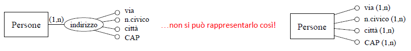{width="0.8951388888888889in"
height="1.6493055555555556in"}Il modello Entità-Relazione (E-R) è **un
modello concettuale di dati** che contiene alcuni **costrutti** atti a
descrivere la realtà in maniera semplice, indipendente dalla
organizzazione dei dati nel computer, come: entità, associazioni
(relazioni), proprietà (attributi), cardinalità, identificatori,
generalizzazioni, sottoinsiemi.

È un livello di astrazione “intermedio” tra sistema e utenti, che sia al
tempo stesso flessibile, intuitivo ed espressivo, ovvero tutte le
caratteristiche che mancano ai modelli logici. I modelli concettuali
prevedono tipicamente una rappresentazione grafica, che risulta utile
anche come strumento di documentazione e comunicazione.

*Qualità di uno schema concettuale*

Viene giudicata in base a delle proprietà che lo schema deve possedere:

-   **Correttezza**: se si utilizzano propriamente i costrutti. Gli
    errori possono essere *sintattici* (uso non ammesso dei costrutti,
    ad esempio generalizzazione fra relazioni) o *semantici* (uso che
    non rispetta il loro significato, ovvero si usa una relazione per
    descrivere che un’entità è generalizzazione di un’altra).

-   **Completezza**: tutti i dati di interesse sono rappresentati e
    tutte le operazioni possono essere eseguite a partire dai concetti
    dello schema)

-   **Leggibilità**: Uno schema è leggibile quando rappresenta i
    requisiti in maniera naturale e facilmente comprensibile. Alcune
    regole:

    -   disporre al centro i costrutti con più legami

    -   usare linee perpendicolari cercando di minimizzare le
        intersezioni.

    -   Disporre i padri di generalizzazioni sopra i figli

    -   Verificare con gli utenti la leggibilità

-   **Minimalità**: Uno schema è minimale quando tutte le specifiche
    sono rappresentate una sola volta. Non devono contenere ridondanze
    ovvero concetti deducibili da altri oppure cicli di relazioni e
    generalizzazioni. Una ridondanza a volte può nascere da una scelta
    precisa di progettazione

*Meccanismi di astrazione*

Quando ragioniamo su un problema usiamo sempre, in funzione del tipo di
problema da risolvere, dei procedimentali mentali di un certo tipo per
arrivare alla soluzione, ovvero astraiamo dal caso specifico per
ricondurci a un “pattern” più generale che conosciamo

**Astrazione**: procedimento mentale che si adotta quando si concentra
l’attenzione su alcune caratteristiche, trascurando le altre giudicate
non rilevanti.

{width="1.7527777777777778in"
height="0.8597222222222223in"}

Nel nostro caso i meccanismi fondamentali di astrazione sono:

-   *Classificazione*: identifica classi di oggetti del mondo reale
    aventi proprietà (caratteristiche) comuni

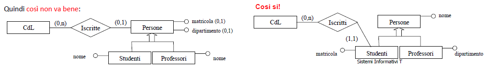{width="1.882638888888889in"
height="0.8416666666666667in"}

*Es*. Febbraio è un’istanza (elemento) della classe (entità) Mesi.

In generale, dato un insieme di oggetti, le classi definibili non sono

univocamente determinate, dipende da ciò che interessa modellare.

-   {width="1.9604166666666667in"
    height="0.86875in"}*Aggregazione*: definisce un nuovo concetto
    (classe) a partire da concetti componenti

*Es*. La Matricola è una parte (part of) dello Studente. È la tipica
astrazione che viene utilizzata quando si definiscono dei record
(tuple).

-   *Generalizzazione*: definisce una classe (superclasse) a partire da
    più classi (sottoclassi)

*Es*. Le istanze di Automobili sono un sottoinsieme delle istanze di
Veicoli,

ovvero, ogni automobile è un (is a) veicolo. Ciò che caratterizza un
veicolo caratterizza anche ogni suo

> sottoinsieme, ovvero ogni sottoclasse eredita dalla superclasse, ma
> può anche avere caratteristiche proprie.

*Costrutti fondamentali*

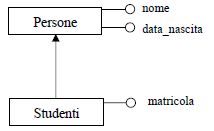{width="1.4847222222222223in"
height="1.9083333333333334in"}

-   **Entità**

Sono classi o schemi di oggetti (cose, persone) che hanno proprietà
comuni ai fini dell’applicazione di interesse che si intende modellare,
e che hanno un esistenza autonoma.

L’**istanza** (elemento) di un’entità è uno specifico oggetto
appartenente a quella entità.

*Es*. Nel grafico a destra un’istanza di studenti può essere “Mario
Rossi”, mentre

un‘istanza di materie può essere “Programmazione 2”.

-   **Associazione (o relazioni)**

Rappresentano legami logici fra due o più entità dell’applicazione
rilevanti nella realtà che si sta considerando. Possono esserci più
relazioni fra le stesse entità (associazioni ricorsive).

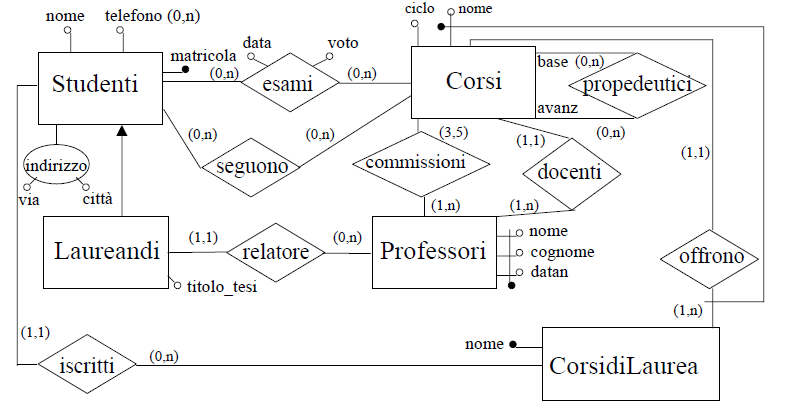{width="3.438888888888889in"
height="0.6618055555555555in"}

L’**istanza di associazione** è una combinazione (aggregazione) di
istanze delle entità che prendono parte all’associazione.

*Es*. Nel grafico a destra se “Mario” è un’istanza di Persone, e
“Catania” è un’istanza di Città, la coppia

(Mario, Catania) o la frase “Mario risiede a Catania” è un’istanza
dell’associazione Risiedono

Non ci possono essere istanze ripetute nell’associazione. Nell’esempio
di sopra, Mario può risiedere solo a Catania.

Il numero di istanze di entità che sono coinvolte in un’istanza
dell’associazione (= numero di “rami” dell’associazione) è detto **grado
delle associazioni**.

  Associazione binaria (grado 2)   Associazione ternaria (grado 3)
  -------------------------------- ---------------------------------
                                   

È possibile stabilire più associazioni, di diverso significato, tra le
stesse entità

{width="3.129869860017498in"
height="1.154242125984252in"}

{width="2.251388888888889in"
height="0.8652777777777778in"}Esistono inoltre le **associazioni ad
anello**, le quali coinvolgono più volte la stessa entità, e quindi
mette in relazione tra loro le istanze di una stessa entità.
Un’associazione ad anello può essere o meno:

-   *Simmetrica*: (a,b) ∈ A ⇒ (b,a) ∈ A

-   *Riflessiva*: (a,a) ∈ A

-   *Transitiva*: (a,b) ∈ A, (b,c) ∈ A ⇒ (a,c) ∈ A

Nell’associazione a destra Collega è simmetrica, irriflessiva e
transitiva

  Nelle associazioni ad anello non simmetriche è necessario specificare, per ogni ramo dell’associazione, il relativo ruolo   È possibile avere anelli anche in relazioni n‐arie generiche (n &gt; 2). Il significato di un’istanza (d1,d2,p) come sotto è: “il dipendente d1 dirige il dipendente d2 all’interno del progetto p”
  --------------------------------------------------------------------------------------------------------------------------- -----------------------------------------------------------------------------------------------------------------------------------------------------------------------------------------------------
                                                                                                                              

-   {width="2.2465277777777777in"
    height="1.2465277777777777in"}**Proprietà** **(o attributi)**

Caratteristiche elementari delle entità e delle associazioni.

Ogni attributo è definito su un dominio di valori. Quindi un attributo
associa ad ogni istanza di entità o associazione un valore del
corrispondente dominio.

Esempi di proprietà di istanze di entità sono: “Ferro ha nome Alfredo”,
“Il recapito della ditta Rossi è via Etnea 22”; esempi di proprietà di
istanze di associazione sono: “Ferro insegna Programmazione 2 dall’anno
1995”, “La ditta Rossi ordina 15 computer portatili”

*Rappresentare un’associazione*

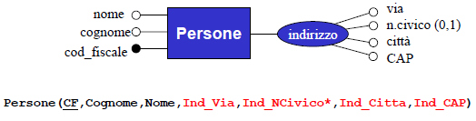{width="3.636111111111111in"
height="0.6923611111111111in"}Consideriamo il seguente schema, completo
di attributi.

Sappiamo che un’istanza dell’associazione è la combinazione
(aggregazione, part of) di istanze delle entità che vengono associate.
Quindi un’istanza dello schema potrebbe essere:

{width="2.5840277777777776in"
height="1.5819444444444444in"}“*\[inizio istanza entità Studenti\]* Lo
studente Giorgio Bianchi, nato il 21 Giugno 1978, con numero di
matricola 29323 ed email <bianchi@alma.unibo.it> *\[fine istanza entità
Studenti\]*, *\[inizio istanza associazione Esami\]* ha superato con
voto 28 il 12 Giugno 2003 l’esame *\[fine istanza associazione Esami\]*
del *\[inizio istanza entità Corsi\]* corso di Analisi, codice 483,
tenuto dal Prof. Biondi al primo anno *\[fine istanza entità Corsi\]*”

Osserviamo che CodCorso è la sola chiave di Corsi, e quindi anche chiave
primaria, e che Matricola è la chiave primaria di Studenti. Possiamo
pertanto dire, senza perdita di informazioni, la stessa cosa in modo più
compatto:

“*\[inizio istanza entità Studenti\]* Lo studente con numero di
matricola 29323 *\[fine istanza entità Studenti\]* ha *\[inizio istanza
associazione Esami\]* superato con voto 28 il 12 Giugno 2003 l’esame
*\[fine istanza associazione Esami\]* del *\[inizio istanza entità
Corsi\]* corso con codice 483 *\[fine istanza entità Corsi\]*”

Quindi per l’associazione di fatto dobbiamo rappresentare solo come nel
grafico a destra:

*Identificatori*

Un identificatore permette l’individuazione univoca delle istanze di
un’entità che corrispondono al concetto di chiave del modello
relazionale. Per definire un identificatore per un’entità si hanno due
possibilità:

-   **Identificatore interno**: identificano l’entità tramite uno o più
    attributi propri dell’entità

Se il numero di elementi (attributi o entità) che costituiscono
l’identificatore è pari a 1 si parla di **identificatore semplice**,
altrimenti l’**identificatore è composto**. Ogni entità deve avere
almeno un identificatore, in generale può averne più di uno.

Esempi di identificatori interni:

{width="3.9870133420822396in"
height="2.488180227471566in"}

-   **Identificatore esterno**: identificano l’entità tramite una o più
    altre entità collegate da associazioni più eventuali attributi

Gli identificatori esterni servono a modellare le situazioni, molto
comuni nella realtà, in cui un’istanza di E ha valori che sono univoci,
ma solo all’interno di un dato contesto, definito dalle istanze delle
entità che vengono usate per l’identificazione.

Esempio di identificatore esterno:

{width="3.720833333333333in"
height="1.1645833333333333in"}

Un valore di matricola identifica univocamente uno studente, ma solo nel
contesto della propria Università; quindi, per identificare uno studente
bisogna specificare qual è l’Università cui è iscritto e il suo numero
di matricola.

*Differenze con il modello relazionale*

Nel modello relazionale abbiamo, per ogni relazione, una chiave primaria
ed eventuali altre chiavi; la chiave primaria viene “esportata”,
definendo così delle *foreign keys*. Quindi, per definire una foreign
key dobbiamo aver prima definito qual è la chiave primaria della
relazione che vogliamo referenziare.

*Es*. Dato Stundeti(Matricola,CodiceFiscale,Cognome,Nome,DataNascita) se
in Esami vogliamo referenziare la primary key di Studenti dobbiamo prima
scegliere se è Matricola o CodiceFiscale.

Nel modello E/R il “riferimento” di un’associazione a un’entità è
esplicito nello schema, anche quando non è stato ancora definito alcun
identificatore. Dato dunque il seguente grafico:

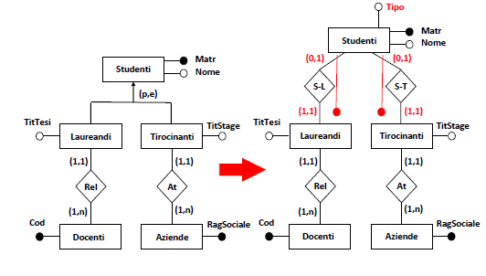{width="1.5451388888888888in"
height="0.35555555555555557in"}Lo schema dice già, senza ambiguità, che
ogni istanza di Esami referenzia una specifica istanza di Studenti.

*Vincoli nel modello E/R*

In ogni schema E/R sono presenti dei vincoli, alcuni sono **impliciti**
in quanto dipendono dalla semantica stessa dei costrutti del modello:

-   Ogni istanza di associazione deve riferirsi ad istanze di entità

-   Istanze diverse della stessa associazione devono riferirsi a
    differenti combinazioni di istanze delle entità partecipanti
    all'associazione

-   … ed altri che vedremo

Altri vincoli sono **espliciti**, e vengono definiti da chi progetta lo
schema E/R sulla base della conoscenza della realtà che si sta
modellando.

-   **Vincoli di identificazione**

-   **Vincoli di cardinalità** (per associazioni e attributi): Sono
    coppie di valori (*min‐card,max‐card*) associati a ogni entità che
    partecipa a un’associazione, che specificano il numero minimo e
    massimo di istanze dell’associazione a cui un’istanza dell’entità
    può partecipare.

> Ad esempio, se i vincoli di cardinalità per un’entità E relativamente
> a un’associazione A sono (1,n) questo significa che ogni istanza di E
> partecipa almeno ad una istanza di A: min-card = 1, e che ogni istanza
> di E può partecipare a più istanze di A (senza limiti): max-card = n
>
> {width="2.6618055555555555in"
> height="0.58125in"}
>
> Graficamente:
>
> 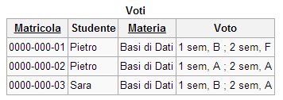{width="3.640277777777778in"
> height="0.6361111111111111in"}
>
> *Es*.

-   min-card(Automobili,Proprietà) = 0: esistono automobili non
    possedute da alcuna persona

-   max-card(Automobili,Proprietà) = 1: ogni automobile può avere al più
    un proprietario

-   min-card(Persone,Proprietà) = 0: esistono persone che non posseggono
    alcuna automobile

-   max-card(Persone,Proprietà) = n: ogni persona può essere
    proprietaria di un numero arbitrario di automobili

> I vincoli di cardinalità si possono stabilire correttamente solo se è
> ben chiaro cosa rappresentano le diverse entità (**analisi della
> realtà**). In molti casi i vincoli di cardinalità corretti si ricavano
> ragionando sulla “tempistica di creazione delle istanze”.
>
> La terminologia di un’associazione binaria A tra due entità E1 ed E2
> è:

-   A è uno a uno se le cardinalità massime di entrambe le entità
    > rispetto ad A sono 1

-   A è uno a molti se max -card(E1,A) = 1 e max-card(E2,A) = n, o
    > viceversa

-   A è molti a molti se max-card(E1,A) = n e max-card(E2,A) = n

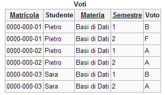{width="3.953472222222222in"
height="1.2347222222222223in"}Se E è identificata esternamente
attraverso l’associazione A, allora si ha sempre max‐card(E,A) =1

Se fosse max-card(Studenti,Iscritti) &gt;1 allora uno studente sarebbe
identificato dall’insieme di università cui è iscritto, ma ciò non è
possibile.

NB: se min-card(E,A) = 0 parte dell’identificatore non è definito
(possibile, ma raro nella pratica)

Se basta E1, tramite A, a identificare E, allora max‐card(E1,A) =1; in
caso contrario max‐card(E1,A) = n

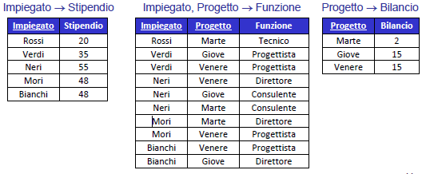{width="1.7673611111111112in"
height="0.5354166666666667in"}*Attributi composti*

Sono attributi che si ottengono aggregando altri (sotto‐)attributi, i
quali presentano una forte affinità nel loro uso e significato. Un
attributo non composto viene anche detto semplice.

*Attributi e vincoli di cardinalità*

{width="2.2465277777777777in"
height="0.66875in"}Anche per gli attributi è possibile specificare il
numero minimo e massimo di valori dell’attributo che possono essere
associati ad un’istanza della corrispondente associazione o entità.
Graficamente si può indicare la coppia (min‐card,max‐card) sulla linea
che congiunge l’attributo all'associazione/entità, o affianco al nome
dell’attributo (se non si indica niente il valore di default è (1,1)).

Si parla di attributi:

-   *Opzionali*: se la cardinalità minima è 0 (es. n. patente)

-   *Monovalore*: se la cardinalità massima è 1 (es. cod\_fiscale)

-   *Multivalore* (o ripetuti): se la cardinalità massima è n (es.
    telefono)

Nel caso di presenza di più attributi multivalore, la creazione di un
attributo composto può rendersi necessaria per evitare ambiguità. Ad
esempio, se una persona ha più indirizzi:

{width="6.58441491688539in"
height="0.8117771216097988in"}

*Gerarchie di generalizzazione*

Un’entità E è una generalizzazione di un gruppo di entità E1, E2, ...,
En se ogni istanza di E1, E2, ..., En è anche un’istanza di E. Le entità
E1, E2, ... En sono dette **specializzazioni** di E.

Graficamente:

{width="3.3895833333333334in" height="1.03125in"}

Le proprietà di E sono ereditate da E1, E2, ..., En; ogni Ei ha gli
attributi di E e partecipa alle associazioni definite per E (non vanno
quindi replicati nello schema, sarebbe un errore)

Per le gerarchie di generalizzazione va anche specificato il tipo di
copertura.

Gli attributi vanno riferiti all’entità più generica in cui sono
presenti obbligatoriamente; analogamente per le associazioni.

{width="7.259722222222222in"
height="1.0652777777777778in"}

Le generalizzazioni si caratterizzano per due dimensioni indipendenti:

-   Confronto fra unione delle specializzazioni e classe generalizzata

    -   ***t**otale* se la classe generalizzata è l’unione delle
        specializzazioni

    -   ***p**arziale* se la classe generalizzata contiene l’unione
        delle specializzazioni

-   Confronto fra le classi specializzate

    -   ***e**sclusiva* se le specializzazioni sono fra loro disgiunte

    -   *sovrapposta (**o**verlapped*) se può esistere una intersezione
        non vuota fra le specializzazioni

Sono ovviamente possibili le quattro combinazioni (t,e) (p,e) (t,o)
(p,o)

Esempi di copertura

{width="7.3in" height="1.0in"}

{width="1.4020833333333333in"
height="0.85625in"}Un **subset** è un caso particolare di gerarchia in
cui si evidenzia una sola classe specializzata.

*Es*. Studenti eredita le proprietà di Persone e in più ha la matricola

Non ha ovviamente senso parlare di tipo di copertura.

*Esempio di uno schema E/R completo*

{width="6.025973315835521in"
height="3.1368077427821524in"}

  ------------------------------------------------------------------------------------------------------------------------------------------------------------------------------------------------------- --------------------------------------------------------------------------------------------------------------------------------------------------------------------------------------
  *Pro del modello E/R*                                                                                                                                                                                   *Contro del modello E/R*

  Uno schema E/R è più espressivo di uno schema relazionale, inoltre può essere utilizzato con successo per alcuni compiti diversi dalla progettazione, ad esempio:                                       Per quanto più espressivo di uno schema relazionale, uno schema E/R non è sempre in grado di rappresentare tutti gli aspetti di interesse. I limiti sono essenzialmente di due tipi:
                                                                                                                                                                                                          
  - *Documentazione*: La simbologia grafica del modello E/R può essere facilmente compresa anche dai non “addetti ai lavori”                                                                              - i nomi dei vari concetti possono non essere sufficienti per comprenderne il significato
                                                                                                                                                                                                          
  - *Reverse engineering*: A partire da un DB esistente si può fornirne una descrizione in E/R allo scopo di meglio analizzarlo ed eventualmente reingegnerizzarlo                                        - non tutti i vincoli di integrità sono esprimibili in uno schema E/R
                                                                                                                                                                                                          
  *- Integrazione di sistemi*: Essendo indipendente dal modello logico dei dati, è possibile usare il modello E/R come “linguaggio comune” in cui rappresentare DB eterogenei, allo scopo di integrarli   In fase di progettazione bisogna quindi “corredare” lo schema con una documentazione appropriata e successivamente prendere delle misure per far rispettare tali vincoli.
  ------------------------------------------------------------------------------------------------------------------------------------------------------------------------------------------------------- --------------------------------------------------------------------------------------------------------------------------------------------------------------------------------------

*Riassunto della notazione grafica del modello E/R*

{width="4.125in" height="2.62251312335958in"}

Progettazione concettuale
-------------------------

Scopo della progettazione concettuale è tradurre la descrizione
informale della realtà, risultato dell’analisi dei requisiti del DB
(tipicamente sotto forma di documenti e moduli di vario genere), in uno
schema formale e completo che dovrà essere indipendente dai criteri di
rappresentazione del DBMS usato.

La descrizione formale fa riferimento ad un modello concettuale, cioè un
insieme di concetti e notazioni standard adatti alla rappresentazione
del dominio applicativo.

*Raccolta dei requisiti*

I requisiti devono innanzitutto essere acquisiti. Le fonti possono
essere molto diversificate tra loro:

-   *Utenti*, attraverso: interviste, documentazione apposita;

-   *Documentazione esistente*: normative (leggi, regolamenti di
    settore), regolamenti interni, procedure aziendali, realizzazioni
    preesistenti;

-   *Modulistica*.

La raccolta dei requisiti è un’attività difficile e non
standardizzabile; in genere procede di pari passo con la fase di analisi
(la prima analisi stimola nuove domande, ecc.).

*Interagire con gli utenti* è un’attività da considerare con molta
attenzione, in quanto:

-   Utenti diversi possono fornire informazioni diverse

-   Utenti a livello più alto hanno spesso una visione più ampia ma meno
    dettagliata

In generale, risulta utile: effettuare spesso *verifiche* di
comprensione e coerenza, verificare anche per mezzo di *esempi*
(generali e relativi a casi limite), richiedere *definizioni* e
*classificazioni*, far evidenziare gli *aspetti essenziali* rispetto a
quelli marginali.

*Analisi dei requisiti*

L’analisi dei requisiti deve:

-   Individuare le proprietà e le funzionalità del sistema;

-   Produrre una descrizione dei dati coinvolti e delle operazioni su di
    essi;

-   Individuare (in linea di massima) i requisiti software ed hardware
    del sistema;

-   Costruire di un glossario dei termini;

-   Eliminare le ambiguità (sinonimi, omonimi);

-   Raggruppare dei requisiti “omogenei”;

-   Rendere esplicito il riferimento tra termini:

-   Riorganizzare le frasi per concetti;

-   Capire cosa gli utenti vogliono.

Ciò si ottiene attraverso le seguenti regole generali:

-   Scegliere il corretto livello di astrazione

-   Standardizzare la struttura delle frasi

-   Suddividere le frasi articolate

-   Separare le frasi sui dati da quelle sulle funzioni (operazioni)

*Tipi di requisiti*

-   *Requisiti informativi*: caratteristiche dei dati

-   *Requisiti sui processi*: operazioni sui dati

-   *Requisiti sui vincoli di integrità*: proprietà dei dati e delle
    operazioni

*Studio di fattibilità*

Bisogna affrontare uno **studio di fattibilità** che stimi:

-   I costi in termini di budget, di impegno del personale;

-   Le inefficienze temporanee dovute al cambio di sistema e di modalità
    di lavoro;

-   I benefici in termini di riduzione dei tempi di lavoro o migliore
    efficienza dei processi aziendali;

-   Un **piano di sviluppo** del sistema con priorità e tempi di
    realizzazione.

*Procedure per l’analisi*

Per ogni settore aziendale in esame si procede con i seguenti passi:

1.  Si analizza il sistema informativo esistente, si intervistano i
    responsabili del settore;

2.  Si produce una prima versione dei requisiti in linguaggio naturale,
    raggruppando frasi descrittive relative a categorie diverse di dati
    e di operazioni.

3.  Si analizzano le descrizioni per eliminare ambiguità provocate da
    pluralismo di percezione e incompletezze di descrizione (ambiguità
    del tipo: omonimie, sinonimie, conflitti di descrizione,
    similitudini)

4.  Si ricontrollano insieme ai responsabili di settore le **frasi**
    relative alle varie categorie di dati e alle operazioni che li
    coinvolgono

5.  Si costruisce a partire dalle frasi verificate un **glossario di
    termini**; Il glossario tipicamente per ogni termine contiene: la
    descrizione, l’elenco dei sinonimi e l’elenco dei termini collegati.
    Il suo scopo è fornire per ogni concetto rilevante una breve
    descrizione del concetto, eventuali sinomi e relazioni con altri
    concetti del glossario stesso. Questo perché raramente i requisisti
    espressi in linguaggio naturale sono privi di

> ambiguità. È infatti frequente il caso di *Omonimi*: lo stesso termine
> viene usato per descrivere concetti differenti (es: libro e copia di
> libro, posto: di lavoro e geografico) e *Sinonimi*: termini diversi
> vengono usati per descrivere lo stesso concetto (es: studente e
> partecipante). Il glossario in questi casi ci viene in aiuto.

1.  Si verifica la **completezza**, dove tutti gli aspetti importanti
    sono stati considerati

2.  Si verifica la **consistenza** delle specifiche vedendo se tutti i
    termini sono stati definiti, tutti i termini compaiono in delle
    operazioni e le operazioni fanno riferimento a termini definiti.

{width="2.267361111111111in" height="1.51875in"}

*Es*. Frasi descrittive di un magazzino

-   il magazzino è composto da scaffali

-   i fornitori forniscono prodotti Glossario

-   i clienti ordinano prodotti

-   gli scaffali contengono prodotti

-   gli operai sono addetti agli scaffali

*Es*. Base di dati per una società di formazione

  -- ----------- --
     Glossario   
  -- ----------- --

*Dai concetti allo schema E/R*

Va sempre ricordato che un concetto non è di per sé un’entità,
un’associazione, un attributo, o altro, ma **dipende dal contesto**.
Come regole guida, un concetto verrà rappresentato come:

-   *Entità*, se ha proprietà significative e descrive oggetti con
    esistenza autonoma;

-   *Attributo*, se è semplice e non ha proprietà;

-   *Associazione*, se correla due o più concetti;

-   *Generalizzazione/specializzazione*, se è caso più
    generale/particolare di un altro.

*Strategie di progettazione*

Per affrontare progetti complessi è opportuno adottare uno specifico
modo di procedere, ovvero una strategia di progettazione. I casi
notevoli sono:

-   **Strategia top-down**: Si parte da uno schema iniziale molto
    astratto ma completo, che viene successivamente raffinato fino ad
    arrivare allo schema finale.

-   **Strategia bottom-up**: Si suddividono le specifiche in modo da
    sviluppare semplici schemi parziali ma dettagliati, che poi vengono
    integrati tra loro.

-   **Strategia inside-out**: Lo schema si sviluppa “a macchia d’olio”,
    partendo dai concetti più importanti, che quindi vengono espansi
    aggiungendo quelli ad essi correlati, e così via.

  **Strategia**   **Pro**                                                **Contro**
  --------------- ------------------------------------------------------ ---------------------------------------------------------------------------------------------------------
  Top‐down        Non è inizialmente necessario specificare i dettagli   Richiede sin dall’inizio una visione globale del problema, non sempre ottenibile in casi complessi
  Bottom‐up       Permette una ripartizione delle attività               Richiede una fase di integrazione
  Inside‐out      Non richiede passi di integrazione                     Richiede ad ogni passo di esaminare tutte le specifiche per trovare i concetti non ancora rappresentati

Nella pratica si fa spesso uso di una strategia ibrida, nella quale:

1.  Si individuano i concetti principali e si realizza uno *schema
    scheletro*, che contiene solamente i concetti più importanti

2.  Sulla base di questo si può *decomporre*

3.  Poi si *raffina*, si *espande*, si *integra*

*Es*. Schema scheletro per la società di formazione.

{width="2.610389326334208in"
height="1.4485126859142607in"}

  Raffinamento di *Partecipanti*   Raffinamento di *Corsi*   Raffinamento di *Docenti*
  -------------------------------- ------------------------- ---------------------------
                                                             

  Integrazione di *Partecipanti* e *Corsi*   Integrazione di *Docenti* e *Corsi*
  ------------------------------------------ -------------------------------------
                                             

*Metodologia basata sulla strategia mista*

  -----------------------------------------------------------------------------------------------------------------------------------
  **Analisi dei requisiti**     - Analizzare i requisiti ed eliminare le ambiguità
                                
                                - Costruire un glossario dei termini, raggruppare i requisiti
  ----------------------------- -----------------------------------------------------------------------------------------------------
  **Passo base**                - Definire uno schema scheletro con i concetti più rilevanti

  **Passo di decomposizione**   - Decomporre i requisiti con riferimento ai concetti nello schema scheletro

  **Passo iterativo**           - Raffinare i concetti presenti sulla base delle loro specifiche
                                
                                - Aggiungere concetti per descrivere specifiche non descritte

  **Passo di integrazione**     - Integrare i vari sottoschemi in uno schema complessivo, facendo riferimento allo schema scheletro

  **Analisi di qualità**        - Verificare le qualità dello schema e modificarlo
  -----------------------------------------------------------------------------------------------------------------------------------

Progettazione logica
--------------------

Obiettivo della fase di progettazione logica è la traduzione di uno
schema concettuale in uno schema logico (es. DB relazionale) che lo
rappresenti in **modo fedele** e che sia, al tempo stesso, “efficiente”.

L’efficienza è legata alle **prestazioni**, ma poiché queste non sono
valutabili precisamente a livello concettuale e logico si deve far
ricorso a degli indicatori semplificati per poter confrontare tra loro
diverse alternative di traduzione. Per quanto detto dividiamo il lavoro
in due parti:

-   Progettazione logica “fedele”

-   Progettazione logica “efficiente”

In ogni caso, a livello logico non introduciamo nuova informazione, con
la possibile eccezione di qualche ridondanza (ma questa non è
informazione “nuova”).

Include anche l’ottimizzazione della rappresentazione in funzione delle
operazioni eseguite (es. **normalizzazione**).

*Progettazione logica fedele*

Quando si dice che uno schema relazione DBrel rappresenta *fedelmente*
uno schema concettuale (E/R) DBconc vuol dire che mediante DBrel
possiamo rappresentare esattamente le stesse informazioni che possiamo
rappresentare con DBconc (possiamo memorizzare gli stessi dati). Più
precisamente “fedeltà” significa che i due schemi sono **equivalenti**
dal punto di vista della loro capacità informativa.

*Progettazione che preserva l’informazione*

Dato uno schema concettuale DBconc consideriamo una progettazione che ne
deriva uno schema logico‐relazionale DBrel. La nostra attività di
progettazione può essere vista, a livello astratto, come la definizione
di un **mapping M** che ci dice come trasformare ogni istanza legale
dbconc di DBconc in una corrispondente istanza dbrel di DBrel. Diciamo
che la progettazione preserva l’informazione se M è totale e iniettiva:

-   *Totale*: per ogni istanza dbconc di DBconc esiste un’istanza dbrel
    di DBrel tale che M(dbconc) = dbrel

-   *Iniettiva*: non esistono due istanze db1conc e db2conc tali che
    M(db1conc) = M(db2conc)

{width="2.275in" height="0.8506944444444444in"}

Tale definizione asserisce che lo schema relazionale può contenere i
dati dello schema E/R (totalità) e che si può “tornare indietro”
(iniettività).

*Progettazione che garantisce l’equivalenza*

Diciamo che la progettazione garantisce l’equivalenza se preserva
l’informazione, e per ogni istanza legale dbrel di DBrel esiste
un’istanza legale dbconc di DBconc tale che **M(dbconc) = dbrel**.

La definizione asserisce che esiste una biiezione tra gli insiemi di
istanze legali.

In pratica, la traduzione avviene operando una sequenza di
trasformazioni/traduzioni semplici, per ognuna delle quali è altrettanto
semplice dare delle regole che garantiscono l’equivalenza. Per quanto
visto, possiamo dividere queste regole in:

-   Regole che preservano l’informazione (regole sulla “struttura”)

-   Regole aggiuntive che garantiscono l’equivalenza (regole sui
    vincoli)

*Traduzione di schemi E/R semplici*

Consideriamo il seguente schema E/R in cui abbiamo entità e
associazioni, ma non gerarchie, ogni entità ha un singolo
identificatore, ed è interno, e non abbiamo attributi ripetuti.

{width="4.220778652668416in"
height="1.6692093175853018in"}

1)  Traduzione delle entità

Ogni entità è tradotta con una **relazione** con gli stessi attributi;
la **chiave primaria** coincide con l’**identificatore** dell’entità; se
un attributo è **opzionale** permettiamo la presenza di valori nulli, e
usiamo l’asterisco (\*) per indicare tale possibilità.

{width="7.259722222222222in"
height="1.038888888888889in"}

1)  Traduzione delle associazioni

Ogni associazione è tradotta con una relazione con gli stessi attributi,
cui si aggiungono gli **identificatori** di tutte le entità che essa
collega; gli identificatori delle entità collegate costituiscono una
**superchiave**; la **chiave primaria** dipende dalle **cardinalità
massime** delle entità nell’associazione.

{width="6.259739720034996in"
height="1.0394050743657044in"}

*Associazioni*

-   **Associazioni molti a molti**: La chiave primaria coincide con
    l’unione degli identificatori delle entità collegate.

-   **Associazioni uno a molti**: La chiave primaria coincide con
    l’identificatore dell’entità che partecipa con cardinalità
    massima 1.

-   **Associazioni uno a uno**: La chiave primaria è uno dei due
    identificatori, l’altro diventa una chiave alternativa.

-   **Associazioni ad anello**: I nomi delle foreign key si possono
    derivare dai ruoli presenti nei rami dell’associazione.

*Attributi composti*

{width="3.917361111111111in"
height="0.9965277777777778in"}Gli attributi composti vengono tradotti
suddividendoli ricorsivamente nelle loro componenti. In alternativa si
possono mappare in un singolo attributo della relazione, il cui dominio
va opportunamente definito, ma questa scelta ovviamente porta a un
impoverimento della rappresentazione. È consigliabile usare un prefisso
comune per gli attributi che si ottengono.

*Entità con più identificatori*

Nel caso di più identificatori si pone il problema di quale scegliere
per generare la corrispondente chiave primaria. I criteri da adottare
sono:

-   Assenza di opzionalità (valori NULL)

-   Semplicità

-   Utilizzo nelle operazioni più frequenti o importanti

Se nessuno degli identificatori soddisfa i requisiti si introducono dei
nuovi attributi (dei “codici”) allo scopo

*Es*.

{width="2.4923611111111112in"
height="1.3875in"}L’identificatore {Interno, Indirizzo} è opzionale,
quindi non può essere scelto.

Tra Codice fiscale e Codice SSN la scelta dipende da quale è più
“importante” (frequentemente usato) per accedere a una persona.

*Eliminazione delle gerarchie*

Il modello relazionale non può rappresentare direttamente le
generalizzazioni. Si eliminano perciò le gerarchie, sostituendole con
entità e associazioni.

Vi sono 3 possibilità (più altre soluzioni intermedie, o “ibride”):

-   Accorpare le entità figlie nel genitore (collasso verso l’alto)

{width="5.610416666666667in"
height="2.701388888888889in"}

-   Accorpare il genitore nelle entità figlie (collasso verso il basso)

{width="4.1038965441819775in"
height="2.537374234470691in"}

-   Sostituire la generalizzazione con associazioni (traduzione
    indipendente)

{width="4.272727471566054in"
height="2.421836176727909in"}

*Normalizzazione*

La normalizzazione è un procedimento volto all'eliminazione della
**ridondanza informativa** e del rischio di **incoerenza** dal database.
Esistono vari livelli di normalizzazione (**forme normali**) che
certificano la qualità dello schema del database Una forma normale è una
proprietà di uno schema relazionale che ne garantisce la **qualità**,
cioè l’assenza di determinati difetti. Una relazione non normalizzata:

-   Presenta ridondanze

-   Esibisce comportamenti poco desiderabili durante gli aggiornamenti

Esempio di relazione con anomalie:

{width="3.545138888888889in"
height="2.0256944444444445in"}Lo stipendio di ciascun impiegato è
ripetuto in tutte le tuple relative: *ridondanza*;

Se lo stipendio di un impiegato varia, è necessario modificare il valore
in diverse tuple: *anomalia di aggiornamento*;

Se un impiegato interrompe la partecipazione a tutti i progetti,
dobbiamo cancellarlo: *anomalia di cancellazione*;

Un nuovo impiegato senza progetto non può essere inserito: *anomalia di
inserimento*.

Storicamente, le forme normali sono state definite per il modello
relazionale, ma hanno senso anche in altri contesti, ad esempio nel
modello E/R. La normalizzazione va utilizzata come tecnica di verifica
dei risultati della progettazione di una base di dati, non costituisce
quindi una metodologia di progettazione; inoltre viene usata anche per
analizzare la bontà di un DB preesistente.

*Dipendenza funzionale*

Per formalizzare i problemi visti si introduce un nuovo tipo di vincolo,
la dipendenza funzionale. Dato uno schema R(XYZ), diciamo che in R vale
la dipendenza funzionale $(FD)\ X\  \rightarrow \ Y$ (X determina
funzionalmente Y) se e solo se in ogni istanza ammissibile r di R(X) non
esistono due tuple distinte t1 e t2 tali che t1\[X\] = t2\[X\] e t1\[Y\]
≠ t2\[Y\]

Ovvero: se t1 e t2 hanno gli stessi valori su X, allora hanno gli stessi
valori anche su Y

*Es*. Nella relazione vista si hanno diverse FD, tra cui: Impiegato →
Stipendio Impiegato, Progetto → Funzione

La prima FD causa anomalie, la seconda FD ha sulla sinistra una
superchiave e non ne causa.

*Cosa deve garantire una decomposizione di una relazione*

Una decomposizione dovrebbe sempre soddisfare due proprietà:

-   La decomposizione senza perdita, che garantisce la ricostruzione
    delle informazioni originarie;

-   La conservazione delle dipendenze, che garantisce il mantenimento
    dei vincoli di integrità originari.

Per "decomposizione senza perdita" si intende l'atto della manipolazione
di una relazione R volta ad ottenere (eventualmente) due o più relazioni
(ad esempio R1 e R2) che oltre a conservare le dipendenze funzionali
verificano anche la seguente condizione: **R = R1 join R2**

*Teorema*: Sia data una relazione R(X), con X insieme degli attributi di
R, e due sottoinsiemi A, B di X tali che A unito B coincide con X; siano
inoltre R1 e R2 due relazioni rispettivamente su A e su B. Allora è
condizione sufficiente affinché la decomposizione su A e B sia senza
perdita se, detto C l'insieme intersezione tra A e B, è superchiave per
R1(A) o R2(B).

*Prima forma normale*

Si dice che una base dati è in **1NF** (prima forma normale) se vale la
seguente relazione per ogni relazione contenuta nella base dati: una
relazione è in 1NF se e solo se:

1)  Non presenta gruppi di attributi che si ripetono (ossia ciascun
    attributo è definito su un dominio con valori atomici).

2)  Esiste una chiave primaria (ossia esiste un insieme di attributi,
    che identifica in modo univoco ogni tupla della relazione)

-   Esempio di violazione della 1NF per atomicità dei valori:

  Il seguente esempio viola la 1NF, perché pur esistendo una chiave primaria *({Matricola,Materia})*, l'attributo Voto non è definito su un dominio con valori atomici.   {width="2.5972222222222223in" height="0.9201388888888888in"}
  ----------------------------------------------------------------------------------------------------------------------------------------------------------------------- -------------------------------------------------------------------------------------
  È necessario ristrutturare la relazione come segue:                                                                                                                     {width="2.0649343832021in" height="1.1908136482939633in"}

-   Esempio di violazione della 1NF per chiave primaria:

  Il seguente esempio viola la 1NF, perché pur non presentando gruppi di attributi che si ripetono, manca una chiave primaria, rendendo impossibile distinguere studentesse e studenti con lo stesso nome:   
  ---------------------------------------------------------------------------------------------------------------------------------------------------------------------------------------------------------- --
  È necessario ristrutturare la relazione, per esempio, come segue:                                                                                                                                          

*Seconda forma normale*

Una base dati è in **2NF** (seconda forma normale) quando è in 1NF e per
ogni tabella tutti i campi non chiave dipendono funzionalmente
dall'intera chiave composta e non da una parte di essa.

*Es*. Supponiamo di avere una tabella con gli esami sostenuti dagli
studenti universitari. La tabella sarà:

Esami(id\_corso\_laurea, id\_esame, id\_studente, voto, data). La chiave
candita è la tripletta dei primi 3 attributi; essa infatti risulta
essere l'insieme di chiavi minimale per poter identificare in modo
univoco le tuple (i record) della tabella. Gli altri campi invece sono
campi non chiave, e fanno riferimento all'intera superchiave. Difatti,
se dipendessero solo da:

-   "Codice corso di laurea" si perderebbero le informazioni relative
    allo studente e all'esame superato

-   "Codice esame" si perderebbero le informazioni relative allo
    studente ed al corso di laurea a cui l'esame appartiene

-   "Matricola studente" si perderebbero le informazioni relative
    all'esame superato e al corso di laurea a cui lo studente è
    iscritto.

-   "Codice corso di laurea", "Codice esame" si perderebbero le
    informazioni relative allo studente che ha superato l'esame

-   "Codice corso di laurea", "Matricola studente" si perderebbero le
    informazioni relative all'esame superato

-   "Matricola studente", "Codice esame" si perderebbero le informazioni
    relative al Corso di Laurea di appartenenza.

*Terza forma normale*

Una base dati è in **3NF** (terza forma normale) se è in 2NF e per ogni
dipendenza funzionale $X \rightarrow Y$ è vera una delle seguenti
condizioni:

-   X è una superchiave della relazione

-   Y è membro di una chiave della relazione

Quindi, una relazione si dice in terza forma normale (3FN) quando è
innanzitutto in seconda forma normale e tutti gli attributi non-chiave
dipendono dalla chiave soltanto, ossia non esistono attributi che
dipendono da altri attributi non-chiave. Tale normalizzazione elimina la
dipendenza transitiva degli attributi dalla chiave.

Teorema: Ogni relazione può essere portata in 3NF.

*Forma normale di Boyce e Codd (BCNF*)

Una relazione R è in forma normale di Boyce e Codd (BCNF) se e solo se è
in 3NF e, per ogni dipendenza funzionale non banale $X \rightarrow Y$, X
è una superchiave per R.

Si noti che, come al solito, il vincolo si riferisce allo schema, in
quanto dipende dalla semantica degli attributi. Un’istanza può pertanto
soddisfare “per caso” il vincolo, ma ciò non garantisce che lo schema
sia normalizzato; in altri termini, le FD non si “ricavano” dall’analisi
dei dati, ma ragionando sugli attributi dello schema.

*Normalizzazione e decomposizione in BCNF*

Se uno schema non è in BCNF, la soluzione è decomporlo. L’intuizione è
che si devono “estrarre” gli attributi che sono determinati da attributi
non chiave ovvero “creare uno schema per ogni funzione”.

{width="4.0in" height="1.6549114173228348in"}

La soluzione non è tuttavia sempre così semplice, bisogna fare anche
altre considerazioni; ad esempio se proviamo a tornare indietro con il
JOIN potremmo trovare uno schema diverso dalla relazione di partenza.

*Decomposizione senza perdita*

La decomposizione non deve assolutamente alterare il contenuto
informativo del DB. Si introduce pertanto il seguente requisito:

*Decomposizione senza perdita (lossless)*: Uno schema R(X) si decompone
senza perdita negli schemi R1(X1) e R2(X2) se, per ogni istanza legale r
su R(X), il join naturale delle proiezioni di r su X1 e X2 è uguale a r
stessa:

$$\pi_{x1}\left( r \right)\text{\ JOIN\ }\pi_{x2}\left( r \right) = r$$

Una decomposizione con perdita può generare tuple spurie. Per decomporre
senza perdita è necessario e sufficiente che il join naturale sia
eseguito su una superchiave di uno dei due sottoschemi, ovvero che valga
X1 ∩ X2 → X1 oppure X1 ∩ X2 → X2.

{width="3.261596675415573in"
height="0.9870133420822397in"}

Diciamo che una decomposizione **preserva le dipendenze** se ciascuna
delle dipendenze funzionali dello schema originario coinvolge attributi
che compaiono tutti insieme in uno degli schemi decomposti. Se una FD
non si preserva diventa più complicato capire quali sono le modifiche
del DB che non violano la FD stessa. In generale si devono prima
eseguire query SQL di verifica (o, meglio, fare uso di trigger).

Una decomposizione:

-   Deve essere senza perdita, per garantire la ricostruzione delle
    informazioni originarie;

-   Dovrebbe preservare le dipendenze, per semplificare il mantenimento
    dei vincoli di integrità originari

*Algoritmi per la normalizzazione*

Quando si hanno diverse FD è difficile ragionare sullo schema, ed è
quindi altrettanto difficile operare manualmente buone decomposizioni.
Esiste un algoritmo per normalizzare in BCNF, ma tale algoritmo ha
elevata complessità e genera più schemi del necessario; viceversa, se si
cambia “leggermente” il requisito di BCNF si ha a disposizione un
algoritmo efficiente e che risolve la maggior parte dei casi che si
presentano nella pratica…

La terza forma normale (3NF), discussa nel seguito, è un target di
normalizzazione che consente di ottenere automaticamente:

-   Decomposizioni senza perdita

-   Decomposizioni che preservano tutte le dipendenze

Se uno schema non è in BCNF si hanno 3 alternative:

1.  Si lascia così com’è, gestendo le anomalie residue (se
    l’applicazione lo consente)

2.  Si decompone in BCNF, predisponendo trigger o query di verifica

{width="3.609722222222222in"
height="0.8423611111111111in"}*Es*. È innanzitutto opportuno osservare
che {Progetto, Dirigente} è una chiave. La decomposizione a sinistra non
va bene, perché è con perdita; mentre quella a destra è corretta:P
rogetto, Sede → Dirigente

> Dirigente → Sede

1.  Si cerca di rimodellare la situazione iniziale, al fine di
    permettere di ottenere schemi in BCNF

{width="2.7527777777777778in"
height="1.4333333333333333in"}Nell’esempio, introduciamo il concetto di
Reparto per distinguere i dirigenti di una stessa sede (ogni dirigente
opera in un reparto di una sede, e viceversa)

Dirigente Sede, Reparto

Sede, Reparto Dirigente

Progetto, Sede Reparto

È ora possibile operare una decomposizione in BCNF

Progettazione fisica
--------------------

Si completa lo schema logico con la specifica dei parametri fisici di
memorizzazione dei dati. Ad esempio, lo stesso schema logico può essere
fisicamente rappresentato in modo diverso in DB2 e in Oracle, al fine di
meglio sfruttare le caratteristiche dei due DBMS. Il risultato è lo
schema fisico, che descrive le strutture di memorizzazione e accesso ai
dati (tablespace, clustering, indici, ecc.).

Stored Procedure
================

Una stored procedure è un programma scritto in SQL od in altri
linguaggi, memorizzato nel database stesso, archiviato nel cosiddetto
database *data dictionary* ed eseguito su esplicita richiesta degli
utenti.

*Linguaggi utilizzati*

Spesso è scritta in versioni proprietarie di SQL, che sono dei veri e
propri linguaggi strutturati, come il PL/pgSQL di PostgreSQL o il PL/SQL
di Oracle, all'interno dei quali è possibile scrivere codice SQL.
Possono anche essere scritte in linguaggi standard come C/C++, Java, o
compilate come oggetti esterni e integrati dal DBMS.

Generalmente i DBMS che supportano le stored procedure effettuano una
loro compilazione in modo da ottimizzarne le esecuzioni. Le stored
procedure possono accettare parametri ma non restituiscono valori;
l’eventuale valore viene restituito attraverso una variabile di output
passata in input per indirizzo.

In alcuni casi possono eseguire azioni esterne come cancellare un file o
spedire una email. Si tratta di un linguaggio procedurale che grazie ai
suoi costrutti riesce a completare la natura dichiarativa di SQL: BEGIN,
END, DECLARE, FOR, WHILE, LOOP, IF, etc.

{width="2.2333333333333334in"
height="1.3604166666666666in"}*Tipi di sottoprogrammi*

Generalizzando, a seconda delle loro caratteristiche si distinguono
diversi tipi di sottoprogrammi:

-   **Funzioni**: restituiscono un singolo valore oltre ad accettare
    parametri di ingresso e/o uscita

-   **Procedure**: non restituiscono valori ma accettano parametri di
    ingresso e/o uscita

-   **Trigger**: sono attivati da eventi

*Vantaggi e svantaggi delle S.P.*

I principali vantaggi che derivano dall'utilizzo delle stored procedure
sono i seguenti:

-   Modularizzazione tra programmi.

-   Integrazione tra applicazione, libreria condivisa e DB server.

-   Portabilità.

-   Riusabilità del codice e creazione di librerie.

-   Accesso controllato alle tabelle (sicurezza).

-   Consente la gestione degli errori.

-   La stored procedure evita al client di riscrivere query complesse
    offrendo la possibilità di richiamare una procedura archiviata
    all'interno del database.

-   Di conseguenza anche il numero di informazioni che saranno scambiate
    tra client e server sarà minore a tutto vantaggio delle prestazioni.

-   Trattandosi di linguaggi strutturati, diventano possibili
    elaborazioni complesse non altrimenti realizzabili usando unicamente
    query SQL.

-   La compilazione di una stored procedure avviene una volta sola, al
    suo inserimento. Ogni volta che la procedura viene richiamata viene
    semplicemente eseguita e questo aumenta significativamente le
    prestazioni.

-   L'utilizzo di stored procedure permette di mantenere librerie di
    funzioni da utilizzare all'interno del database stesso.
    Potenzialmente si potrebbe eseguire ogni operazione richiamando una
    diversa procedura, senza conoscere la struttura di un database
    magari complesso, o avendone una conoscenza limitata.

-   Proprio per questo motivo, l'amministratore di database può a volte
    evitare di concedere i permessi di modifica o di lettura su molte
    tabelle a determinati utenti, concedendo semplicemente il permesso
    di eseguire le stored procedure.

-   La compilazione di una stored procedure avviene una volta sola, al
    suo inserimento.

-   Consentono di condividere fra gli utenti delle attività comuni, in
    modo da centralizzare la manutenzione, la modifica etc…

-   Unificano la semantica di certe operazioni sul DB per ogni
    applicazione.

-   Possono controllare in modo centralizzato certi vincoli d’integrità
    non esprimibili nelle tabelle.

*Gli svantaggi principali sono invece i seguenti:*

-   Le stored procedure aumentano il carico di lavoro per il server.

-   A volte non si può utilizzare il linguaggio che si vorrebbe
    utilizzare, perché il DBMS non lo supporta.

-   La logica del programma viene spostata sul server; questo non è
    necessariamente uno svantaggio, ma non è compatibile con il modello
    logico di applicativi a tre livelli.

Stored Procedure in MySQL
-------------------------

Definizione di una procedura

  -------------------------------------------------------
  CREATE
  
  **\[DEFINER = { user | CURRENT\_USER }\]**
  
  PROCEDURE **nome\_procedura (\[parametri\[,...\]\])**
  
  \[caratteristiche ...\] corpo\_della\_routine
  -------------------------------------------------------

DEFINER non è un parametro obbligatorio; serve per assegnare un
proprietario alla routine.

Nel caso in cui questo non venga specificato verrà considerato come
owner predefinito l'utente corrente.

Definizione UDF

  ------------------------------------------------------
  CREATE **\[DEFINER = { user | CURRENT\_USER }\]**
  
  FUNCTION **nome\_procedura (\[parametri\[,...\]\])**
  
  RETURNS **type**
  
  \[caratteristiche ...\] corpo\_della\_routine
  ------------------------------------------------------

La clausola RETURNS è valida per la sintassi delle UDF, queste infatti
restituiscono un valore e per questo ad esso è associato il relativo
tipo di dato.

*Istruzioni e delimitatori*

Quando si definisce una Stored Procedure dalla linea di comando, è
necessario introdurre un nuovo delimitatore per terminare il blocco di
istruzioni:

  -----------------------------------------------------
  mysql&gt; delimiter //
  
  mysql&gt; CREATE PROCEDURE nome\_procedura (p1 INT)
  
  -&gt; BEGIN
  
  -&gt; blocco istruzioni
  
  -&gt; END
  
  -&gt; //
  
  mysql&gt; delimiter ;
  -----------------------------------------------------

In pratica l'istruzione DELIMITER iniziale ha lo scopo di comunicare a
MySQL che (fino a quando non verrà ordinato diversamente) il
delimitatore utilizzato alla fine dell'istruzione non sarà più il “punto
e virgola”.

Per riportare il delimitatore al suo standard, ricordiamoci di dare il
comando: … mysql&gt; delimiter ;

  ---------------------------------------------------------------------------------------------------------------------
  *Es*. “Ciao Mondo”                                                        *Es*.
  ------------------------------------------------------------------------- -------------------------------------------
    ---------------------------------------------------------------------     ---------------------------------------
    **mysql&gt; CREATE PROCEDURE proc\_ciao () SELECT 'Ciao Mondo' //**       **DELIMITER //**
                                                                              
    **mysql&gt; CALL proc\_ciao ()//**                                        **CREATE PROCEDURE GetAllProducts()**
                                                                              
    **+----------------+**                                                    **BEGIN**
                                                                              
    **| Ciao Mondo |**                                                        **SELECT \* FROM products;**
                                                                              
    **+----------------+**                                                    **END //**
                                                                              
    **| Ciao Mondo |**                                                        DELIMITER ;
                                                                              ---------------------------------------
    +----------------+                                                      
    ---------------------------------------------------------------------   
                                                                            
  ---------------------------------------------------------------------------------------------------------------------

Parametri
---------

-   **IN**: rappresenta gli argomenti in ingresso della routine; a
    questo parametro viene assegnato un valore quando viene invocata la
    stored procedure; il parametro utilizzato non subirà in seguito
    modifiche.

  -----------------------------------------------------------------------------
  mysql&gt; CREATE PROCEDURE proc\_in (IN p INT(3)) SET @x = p//
  
  mysql&gt; CALL nome\_procedura CALL proc\_in (14)// (\[parametro\[,...\]\])
  
  mysql&gt; SELECT @x//
  
  +----------+
  
  | @x |
  
  +----------+
  
  | 14 |
  
  +----------+
  -----------------------------------------------------------------------------

Nel corpo della procedura è stata impostata una variabile x il cui
valore sarà qualsiasi valore associato al parametro p.

Passando come parametro alla procedura l'intero 14 (che viene associato
a p), sarà possibile ottenere lo stesso valore interrogando il database
con una SELECT applicata alla variabile x.

-   **OUT** (non è standard): è il parametro relativo ai valori che
    vengono assegnati con l'uscita dalla procedura; questi parametri
    diventano disponibili per gli utenti per eseguire ulteriori
    elaborazioni.

  --------------------------------------------------
  mysql&gt; CREATE PROCEDURE proc\_out (OUT p INT)
  
  -&gt; SET p = -2 //
  
  mysql&gt; CALL proc\_out (@y)//
  
  mysql&gt; SELECT @y//
  
  +------+
  
  | @y |
  
  +------+
  
  | -2 |
  
  +------+
  --------------------------------------------------

In questo caso p rappresenta il nome di un parametro di output che viene
passato come valore alla variabile y introdotta nel momento in cui viene
espresso il comando che invoca la procedura.

Nel corpo della routine il valore del parametro viene indicato come pari
all'intero negativo -2, a questo punto spetta ad OUT segnalare a MySQL
che il valore sarà associato tramite la procedura.

-   **INOUT** (non è standard): rappresenta una combinazione tra i due
    parametri precedenti.

  ----------------------------------------------------------
  DELIMITER \$\$
  
  CREATE PROCEDURE \`Capitalize\`(INOUT str VARCHAR(1024))
  
  BEGIN
  
  DECLARE i INT DEFAULT 1;
  
  DECLARE myc, pc CHAR(1);
  
  DECLARE outstr VARCHAR(1000) DEFAULT str;
  
  WHILE i &lt;= CHAR\_LENGTH(str) DO
  
  SET myc = SUBSTRING(str, i, 1);
  
  SET pc = CASE WHEN i = 1 THEN ' ‘
  
  ELSE SUBSTRING(str, i - 1, 1) END;
  
  IF pc IN (' ', '&', '''', '\_', '?', ';',
  
  ':', '!', ',', '-', '/', '(', '.') THEN
  
  SET outstr = INSERT(outstr, i, 1, UPPER(myc));
  
  END IF;
  
  SET i = i + 1;
  
  END WHILE;
  
  SET str = outstr;
  
  END\$\$
  
  DELIMITER ;
  ----------------------------------------------------------

Richiamare la procedura con un parametro di INOUT:

  ---------------------------------------------------------
  mysql&gt; SET @str = 'mysql stored procedure tutorial';
  
  mysql&gt; CALL Capitalize(@str);
  
  mysql&gt; SELECT @str;
  ---------------------------------------------------------

La variabile @str conterrà il valore ‘Mysql Stored Procedure Tutorial’

Variabili
---------

L’uso delle variabili nelle stored procedure avviene come segue:

  ---------------------------------------------------------------
  DECLARE variable\_name datatype(size) DEFAULT default\_value;
  ---------------------------------------------------------------

I tipi delle variabili sono quelli primitivi supportati da MySQL: INT,
VARCHAR,DATETIME,… .

Quando viene dichiarata una variabile, il suo valore iniziale è NULL. E’
possibile assegnare un valore utilizzando il comando DEFAULT.

  -----------------------------------
  DECLARE total\_sale INT DEFAULT 0
  -----------------------------------

  ----------------------------
  DECLARE x, y INT DEFAULT 0
  ----------------------------

*Assegnazione variabili*

  ------------------------------------
  DECLARE total\_count INT DEFAULT 0
  
  SET total\_count = 10;
  ------------------------------------

Un altro modo per assegnare un valore ad una variabile è tramite
l’istruzione SQL:

  ---------------------------------------
  DECLARE total\_products INT DEFAULT 0
  
  SELECT COUNT(\*) INTO total\_products
  
  FROM products
  ---------------------------------------

*Consigli*

-   Seguire una convenzione per i nomi.

-   Inizializzare variabili a NOT NULL.

-   Inizializzare identificatori attraverso l’uso dell’operatore di
    assegnamento (SET) o con la parola chiave DEFAULT.

-   Dichiarare al più un identificatore per linea.

-   I nomi delle variabili non dovrebbero essere uguali a quelli di
    tabelle e colonne per evitare errori di comprensione durante la
    lettura del codice.

*Scope (visibilità) nelle variabili*

Ogni variabile ha il suo proprio scope (visibilità).

Se dichiariamo una variabile dentro una stored procedure, questa sarà
visibile (ed utilizzabile) fin quando non si conclude la procedura con
il comando END.

{width="2.18125in"
height="1.2791666666666666in"}È possibile dichiarare due o più variabili
con lo stesso nome in scope differenti; la variabile potrà essere usata
all’interno del suo scope. Una variabile preceduta dal simbolo ‘@’ è una
variabile di sessione e persisterà fino alla chiusura di ogni sessione.

*Es*. Blocchi annidati e scope delle variabili

Controlli condizionati (IF…THEN…ELSE)
-------------------------------------

I controlli condizionali permettono di eseguire parti di codice secondo
il valore di un’espressione logica (espressione che utilizza operatori
logici e che può essere vera o falsa).

MySQL consente due dichiarazioni condizionali:

-   IF … THEN … ELSE …

-   CASE WHEN … THEN … ELSE …

  -------------------------------------
  IF expression THEN commands
  
  \[ELSEIF expression THEN commands\]
  
  \[ELSE commands\]
  
  END IF;
  -------------------------------------

  -----------------------------
  IF expression THEN commands
  
  END IF;
  -----------------------------

  ---------------------------------
  IF expression THEN commands
  
  ELSEIF expression THEN commands
  
  ELSE commands
  
  END IF;
  ---------------------------------

  -------------------------------
  CASE
  
  WHEN expression THEN commands
  
  …
  
  WHEN expression THEN commands
  
  ELSE commands
  
  END CASE;
  -------------------------------

L’utilizzo del comando IF in alcuni casi riduce la leggibilità del
codice (ad es. quando vengono scritti IF

annidati o di seguito).

In questi casi è consigliabile usare il comando CASE.

Loop
----

Le stored procedure di MySQL consentono la definzione di loop per
consentire di processare comandi iterativamente.

I cicli consentiti sono:

-   WHILE… DO… ELSE …

-   REPEAT … UNTIL …

*While*

  ----------------------
  WHILE espressione DO
  
  Istruzione
  
  END WHILE
  ----------------------

La prima cosa è valutare l’espressione: se è vera viene eseguita
l’istruzione fino a che l’espressione non diventa falsa.

*Es*.

  --------------------------------------------
  DELIMITER \$\$
  
  DROP PROCEDURE IF EXISTS WhileLoopProc\$\$
  
  CREATE PROCEDURE WhileLoopProc()
  
  BEGIN
  
  DECLARE x INT;
  
  DECLARE str VARCHAR(255);
  
  SET x = 1;
  
  SET str = '';
  
  WHILE x &lt;= 5 DO
  
  SET str = CONCAT(str,x,',');
  
  SET x = x + 1;
  
  END WHILE;
  
  SELECT str;
  
  END\$\$
  
  DELIMITER ;
  --------------------------------------------

*Repeat*

  -------------------
  REPEAT
  
  Istruzione;
  
  UNTIL Espressione
  
  END REPEAT
  -------------------

Inizialmente viene eseguita l’istruzione e poi viene valutata
l’espressione. Se l’espressione risulta vera, viene nuovamente
rieseguita l’istruzione sino a quando l’espressione non diventa falsa.

*Es*.

  --------------------------------------------
  DELIMITER \$\$
  
  DROP PROCEDURE IF EXISTS WhileLoopProc\$\$
  
  CREATE PROCEDURE WhileLoopProc()
  
  BEGIN
  
  DECLARE x INT;
  
  DECLARE str VARCHAR(255);
  
  SET x = 1;
  
  SET str = '';
  
  REPEAT
  
  SET str = CONCAT(str,x,',');
  
  SET x = x + 1;
  
  UNTIL x &gt; 5
  
  END REPEAT;
  
  SELECT str;
  
  END\$\$
  
  DELIMITER ;
  --------------------------------------------

Cursori
-------

MySQL supporta i cursori nelle stored procedures, nelle funzioni e nei
triggers. I cursori vengono usati per setacciare un insieme di righe
restituite da una query e permette di controllarle individualmente.

*Proprietà*

Con la versione corrente di MySQL ( &gt; 5.x), i cursori hanno le
seguenti proprietà:

-   **Read only**: non è possibile modificare il contenuto di un
    cursore.

-   **Non-scrollable**: è possibile leggere i dati nel cursore solo in
    avanti e senza salti in maniera sequenziale.

-   **Asensitive**: evitare di aggiornare le tabelle sulle quali sono
    stati aperti dei cursori: in questi casi è possibile ottenere dalla
    lettura dei cursori risultati sbagliati.

*Comandi*

  ----------------------------------------------------
  DECLARE cursor\_name CURSOR FOR SELECT\_statement;
  ----------------------------------------------------

Dopo la dichiarazione di un cursore, esso va aperto con il comando
**OPEN**. Prima di leggerne le righe, occorre aprire il cursore.

  --------------------
  OPEN cursor\_name;
  --------------------

Successivamente recuperiamo le righe con il comando **FETCH**.

  ----------------------------------------
  FETCH cursor\_name INTO variable list;
  ----------------------------------------

Per chiudere e rilasciare la memoria occupata, usare il comando
**CLOSE**:

  ---------------------
  CLOSE cursor\_name;
  ---------------------

Il comando **NOT FOUND** handler serve per evitare che si verifichi la
condizione fatale “no data to fetch”:

  -----------------------------------------------------
  DELIMITER \$\$
  
  DROP PROCEDURE IF EXISTS CursorProc\$\$
  
  CREATE PROCEDURE CursorProc()
  
  BEGIN
  
  DECLARE no\_more\_products, quantity\_in\_stock INT
  
  DEFAULT 0;
  
  DECLARE prd\_code VARCHAR(255);
  
  DECLARE cur\_product CURSOR FOR
  
  SELECT productCode FROM products;
  
  DECLARE CONTINUE HANDLER FOR
  
  NOT FOUND SET no\_more\_products = 1;
  
  OPEN cur\_product;
  
  REPEAT
  
  FETCH cur\_product INTO prd\_code;
  
  SELECT quantityInStock INTO quantity\_in\_stock
  
  FROM products
  
  WHERE productCode = prd\_code;
  
  UNTIL no\_more\_products = 1
  
  END REPEAT;
  
  CLOSE cur\_product;
  
  …
  -----------------------------------------------------

Database Multidimensionali
==========================

I database multidimensionali, ignorano la indipendenza tra gli aspetti
fisici e logici della base di dati insita nel modello relazionale, e al
contrario, lasciano la definizione dei puntatori ai programmatori.
Invece di cercare l'indirizzo del Signor Rossi in diverse tabelle, il
DBMS memorizza un puntatore al record "Indirizzo". In effetti, se il
dato "appartiene" ad un certo record nella "tabella padre", questo può
essere memorizzato nella stessa area di memoria del primo, ed in tal
modo è possibile velocizzare l'accesso. Naturalmente il dato deve
appartenere solamente ad un dato-padre.

Questo tipo di implementazione fisica dei dati può (e dovrebbe) essere
fatta in questi database pseudo relazionali, pur mantenendo una
indipendenza logica: il programmatore dovrebbe vedere solamente la
chiave primaria che poi andrebbe "tradotta" dal DBMS in un puntatore. A
causa degli scarsi risultati in termini di tempo di accesso ai dati,
spesso dovute a cattive implementazioni di questi concetti, i database
multidimensionali hanno avuto scarso successo, anche se molti concetti
sono stati ripresi dai database ad oggetti.

Decision Support System (DSS)
-----------------------------

Un Decision Support System (DSS) è un sistema software di supporto alle
decisioni, che permette di aumentare l'efficacia dell'analisi in quanto
fornisce supporto a tutti coloro che devono prendere decisioni
strategiche di fronte a problemi che non possono essere risolti con i
modelli della ricerca operativa.

*Scopo*

La funzione principale di un DSS è quella di estrarre in poco tempo e in
modo versatile le informazioni utili ai processi decisionali,
provenienti da una rilevante quantità di dati.

Nasce dall'enorme accumulo di dati dell'ultimo ventennio e dalla
richiesta di utilizzo di tali dati per scopi al di fuori della normale
elaborazione giornaliera.

*Caratteristiche*

Il DSS si appoggia su dati in un database o una base di conoscenza, che
aiutano l'utilizzatore a decidere meglio; esso non è solo
un'applicazione informatica, perché contiene anche strumenti di Business
Intelligence e di tecnologie dei Sistemi Esperti, quali modelli di
supporto decisionale.

In definitiva, gli aspetti essenziali di un DSS si possono racchiudere
in:

-   facilità d’uso alla portata di tutti gli utenti;

-   ambiente interattivo;

-   possibilità per il sistema di fornire supporto al processo
    decisionale;

-   efficacia nell’utilizzo dei modelli e nell’analisi dei dati

Transaction Processing System (TPS)
-----------------------------------

I transaction processing system (TPS, inglese per "sistemi di
elaborazione delle transazioni"), rappresentano i primi sistemi
informativi aziendali realizzati attraverso l'uso delle tecnologie
informatiche (ICT). Tali sistemi permettevano di automatizzare procedure
come: l'emissione di fatture, la gestione delle presenze del personale,
il controllo delle movimentazioni a magazzino, la tenuta della
contabilità generale.

*Tipi di elaborazione*

-   Nei Transaction Processing Systems: On-Line Transaction Processing
    (**OLTP**)

Tradizionale elaborazione di transazioni, che realizzano i processi
operativi dell’azienda-ente

-   Operazioni predefinite, brevi e relativamente semplici

-   Ogni operazione coinvolge “pochi” dati

-   Dati di dettaglio, aggiornati

-   Le proprietà “acide” (atomicità, correttezza, isolamento,
    durabilità) delle transazioni sono essenziali

<!-- -->

-   Nei Decision Support Systems: On-Line Analytical Processing
    (**OLAP**)

OLAP acronimo di On Line AnalyticalProcessing è una tecnica che analizza
in maniera approfondita una grande quantità di dati, si limita a fornire
elementi a conferma o a smentita delle ipotesi formulate dai
decisionmaker.

Elaborazione di operazioni per il supporto alle decisioni

-   Operazioni complesse e casuali

-   Ogni operazione può coinvolgere molti dati

-   Dati aggregati, storici, anche non attualissimi

-   Le proprietà “acide” non sono rilevanti, perché le operazioni sono
    di sola lettura

  -- --
     
  -- --

Data warehouse
--------------

Un data warehouse (o DW, o DWH) (termine inglese traducibile con
magazzino di dati) è un archivio informatico contenente i dati di
un'organizzazione, progettati per consentire di produrre facilmente
analisi e relazioni utili a fini decisionali-aziendali.

Componenti essenziali di un sistema data warehouse sono anche gli
strumenti per localizzare, estrarre, trasformare e caricare i dati, come
pure gli strumenti per gestire un dizionario dei dati. Le definizioni di
DW considerano solitamente questo ampio contesto. Una definizione
ulteriormente ampliata comprende anche gli strumenti per gestire e
recuperare i metadati e gli strumenti di business intelligence.

*Caratteristiche*

-   **Integrata**: requisito fondamentale di un data warehouse è
    l'integrazione dei dati raccolti. Nel data warehouse confluiscono
    dati provenienti da più sistemi transazionali e da fonti esterne.
    L'obiettivo dell'integrazione può essere raggiunto percorrendo
    differenti strade: mediante l'utilizzo di metodi di codifica
    uniformi, mediante il perseguimento di una omogeneità semantica di
    tutte le variabili, mediante l'utilizzo delle stesse unità di
    misura;

-   **Orientata al soggetto**: il DW è orientato a temi aziendali
    specifici piuttosto che alle applicazioni o alle funzioni. In un DW
    i dati vengono archiviati in modo da essere facilmente letti o
    elaborati dagli utenti. L'obiettivo, quindi, non è più quello di
    minimizzare la ridondanza mediante la normalizzazione, ma quello di
    fornire dati organizzati in modo tale da favorire la produzione di
    informazioni. Si passa dalla progettazione per funzioni ad una
    modellazione dei dati che consenta una visione multidimensionale
    degli stessi;

-   **Variabile nel tempo**: i dati archiviati all'interno di un DW
    coprono un orizzonte temporale molto più esteso rispetto a quelli
    archiviati in un sistema operazionale. Nel DW sono contenute una
    serie di informazioni relative alle aree di interesse che colgono la
    situazione relativa ad un determinato fenomeno in un determinato
    intervallo temporale piuttosto esteso. Ciò comporta che i dati
    contenuti in un DW siano aggiornati fino ad una certa data che,
    nella maggior parte dei casi, è antecedente a quella in cui l'utente
    interroga il sistema. Ciò differisce da quanto si verifica in un
    sistema transazionale, nel quale i dati corrispondono sempre ad una
    situazione aggiornata, solitamente incapace di fornire un quadro
    storico del fenomeno analizzato;

-   **Non volatile**: tale caratteristica indica la non modificabilità
    dei dati contenuti nel DW che consente accessi in sola lettura. Ciò
    comporta una semplicità di progettazione del database rispetto a
    quella di un'applicazione transazionale. In tale contesto non si
    considerano le possibili anomalie dovute agli aggiornamenti, né
    tanto meno si ricorre a strumenti complessi per gestire l'integrità
    referenziale o per bloccare record a cui possono accedere altri
    utenti in fase di aggiornamento.

Il data warehouse, quindi, descrive il processo di acquisizione,
trasformazione e distribuzione di informazioni presenti all'interno o
all'esterno delle aziende come supporto ai decision maker.

*Componenti*

Gli elementi costitutivi dell'architettura sono:

-   **I dati provenienti dai sistemi transazionali**: sono quell'insieme
    di dati elaborati dai sistemi transazionali dell'azienda. Essi
    possono essere contenuti all'interno dello stesso database o
    provenire da diversi database o anche esterni all'azienda. Spesso
    l'architettura di un data warehouse prevede l'integrazione dei dati
    interni con quelli esterni. L'utilizzo di questi ultimi consente di
    arricchire il patrimonio informativo.

-   **Il data movement**: tale componente è responsabile dell'estrazione
    dei dati dai sistemi transazionali, dell'integrazione tra dati
    aziendali e dati esterni, del pre-processing dei dati, del controllo
    della consistenza dei dati, della conversione delle strutture dati,
    e dell'aggiornamento dei dizionari dei dati.

-   **Il data warehouse**: i dati estratti dagli archivi transazionali
    vengono memorizzati internamente al data warehouse. Nel data
    warehouse l'accesso ai dati è consentito in sola lettura. Tali dati
    hanno una dimensione storica e sono riferiti a soggetti di business.
    Essi possono essere memorizzati in un archivio centrale o in un data
    mart. Il termine data mart identifica un data warehouse di
    dimensioni ridotte, specializzato per una particolare area di
    attività. Si pensi, ad esempio, al data mart per il marketing, in
    cui i dati filtrati dagli archivi transazionali sono memorizzati per
    consentire l'analisi della clientela. All'interno della banca
    possono quindi esistere più data mart, aventi finalità diverse e
    orientati a coprire diverse aree di business. I dati contenuti nel
    data warehouse possono essere aggregati e indicizzati per rispondere
    a specifiche necessità informative.

-   **I metadati**: i metadati costituiscono informazione aggiuntiva che
    arricchisce i dati contenuti nel data warehouse. Spesso essi vengono
    chiamati in gergo "data about data" indicando la provenienza,
    l'utilizzo, il valore o la funzione del dato. A tale proposito
    vengono costituiti dei veri e propri information catalog. Questi
    ultimi sono i file che contengono i metadati. Il catalog consente di
    spiegare all'utente la natura dei dati nel data warehouse, il loro
    significato semantico, da quali archivi essi provengono e la loro
    storicità.

-   **L'utente finale**: i dati contenuti nel data warehouse vengono
    presentati all'utente finale, il quale dispone di un insieme di
    strumenti per effettuare elaborazioni e produrre informazioni
    appropriate. I tool a disposizione dell'utente possono essere
    semplici generatori di query e report, interfacce grafiche che
    consentono la rappresentazione dei dati o sistemi di analisi dati
    più complessi.

*Architettura*

{width="3.767442038495188in"
height="1.7082589676290463in"}Nel suo complesso il data warehouse è un
sistema periferico, cioè non risiede fisicamente sul sistema informativo
centrale. Il motivo di ciò va ricercato nel tipo di attività svolto: una
piattaforma di tipo transazionale è maggiormente orientata
all'esecuzione costante di operazioni di aggiornamento, per cui
l'ottimizzazione viene fatta soprattutto sull'I/O; una piattaforma di
supporto alle decisioni invece deve essere ottimizzata per effettuare un
numero limitato di query particolarmente complesse. Un'eccezione a tale
regola può essere rappresentata da soluzioni di tipo mainframe, ove la
possibilità di definire macchine virtuali all'interno della stessa
macchina fisica consente la coesistenza sullo stesso server fisico delle
applicazioni transazionali e delle applicazioni di decision support.

-   **Data transformation layer**

L'architettura parte dallo strato denominato data transformation, cioè
dall'insieme di applicazioni che svolgono l'attività di estrazione,
trasformazione e caricamento dei dati dai sistemi transazionali che
alimentano il data warehouse.

Nella maggior parte dei casi la fase di estrazione dei dati dai sistemi
alimentanti viene implementata utilizzando i linguaggi proprietari delle
piattaforme alimentanti. Si tratta per lo più di interrogazioni ad hoc,
parametrizzate per quanto riguarda l'arco temporale, eseguite
periodicamente solitamente nei momenti di minore attività del sistema.

La fase di trasformazione, quella a maggiore valore aggiunto tra le tre
contenute in questo layer applicativo, applica regole di integrazione,
trasformazione e cleansing (business rule) ai dati estratti dai sistemi
alimentanti. È in questo layer che molto spesso si gioca la credibilità
dei dati del data warehouse presso gli utenti. Nella maggior parte dei
casi i dati estratti dai sistemi transazionali sono incompleti o
comunque inadatti a prendere decisioni, in quanto non sono coerenti con
le analisi da effettuare.

In alcuni casi le operazioni di trasformazione possono causare un reject
(rifiuto), il quale segnala l'impossibilità di accettare parte del
flusso alimentante a causa di ‘impurità’ nei dati di origine.

Le possibili cause di rifiuto sono varie:

-   *Codifiche incoerenti*. Lo stesso oggetto è codificato in modo
    diverso a seconda del sistema alimentante. In fase di trasformazione
    ogni flusso alimentante andrà ricodificato seguendo la codifica
    convenzionale definita per il data warehouse;

-   *Unità di misura/formati incoerenti*. È il caso in cui la stessa
    grandezza viene misurata con unità di misura o rappresentata con
    formati differenti a seconda del sistema alimentante di provenienza.
    In fase di trasformazione ogni flusso alimentante andrà convertito
    in un'unica unità di misura convenzionale per il data warehouse;

-   *Denominazioni incoerenti*. È il caso in cui, a seconda della fonte,
    lo stesso oggetto (di solito un dato) viene denominato in modo
    diverso. Solitamente il dato all'interno del warehouse viene
    identificato in base alla definizione contenuta nei metadati del
    sistema;

-   *Dati incompleti o errati*. Nei tre casi precedenti le operazioni di
    trasformazione consistevano essenzialmente in attività di
    conversione, entro certi limiti automatizzabili. In questo caso,
    invece, l'operazione di trasformazione può richiedere l'intervento
    umano per risolvere casistiche non prevedibili a priori.

-   **Data preparation and storage layer**

Una volta che i dati hanno superato il transformation layer, essi
vengono ‘stoccati’ in questo livello architetturale per consentire:

-   la creazione di sintesi informative per gli utenti (data mart e
    aggregazioni) mediante procedure ad hoc che solitamente vengono
    innescate (in termini di update) al completamento delle operazioni
    di estrazione, trasformazione e caricamento;

-   l'esecuzione di analisi avanzate, basate prevalentemente su
    algoritmi di tipo statistico, che richiedono di operare sul massimo
    dettaglio disponibile dei dati per restituire risultati
    significativi.

Questo livello coincide con il massimo dettaglio disponibile (in termini
di dati) all'interno del sistema di data warehousing.

-   **Data interpretation and analysis layer**

A questo livello si trovano oggetti tra loro molto diversi per funzione
e tecnologia. Le funzionalità base espletate da questo livello
architetturale sono: aggregazione, analisi e interpretazione.

-   *Aggregazione*: La funzionalità di "aggregazione" provvede a
    costruire sintesi decisionali partendo dai dati di dettaglio
    presenti nel layer precedente. Qui si deve fare un'importante
    precisazione architetturale.

> In una situazione in cui non esiste il data warehouse gli utenti sono
> costretti ad accedere ai sistemi legacy per ottenere le informazioni
> loro necessarie.
>
> In alcuni casi si può decidere di estrarre dai sistemi legacy una o
> più sintesi (data mart) per gli utenti che effettueranno l'analisi su
> di esse. In questa situazione, anche se la tecnologia e l'architettura
> assomigliano a quelle di un data warehouse, l'impossibilità di
> arrivare a dati di dettaglio superiore a quello delle sintesi
> disponibili ne riduce la potenza informativa.
>
> Peraltro il data warehouse non va necessariamente considerato come una
> base dati a cui tutti gli utenti accedono liberamente per le proprie
> analisi. Questo può essere vero dove gli utenti siano particolarmente
> addestrati e, comunque sia, ha delle controindicazioni in quanto le
> risorse hardware necessarie per supportare un elevato numero di utenti
> che eseguono interrogazioni complesse sono difficilmente prevedibili e
> pianificabili. Molti presunti progetti di Warehousing falliscono
> proprio perché ci si limita a importare dati senza però di fatto
> renderli disponibili agli utenti meno esperti.
>
> La situazione ideale è quella in cui esiste un data warehouse
> centrale, contenente tutti i dati al minimo livello di dettaglio
> richiesto per effettuare analisi avanzate e per costruire aggregazioni
> per tutti gli utenti. In questo caso i data mart possono essere
> tematici (cioè contenenti tutte le informazioni riguardo ad un certo
> soggetto) oppure per gruppi specifici di utenti.
>
> Questa strategia architetturale fa del data warehouse un vero processo
> di information delivery, ove la richiesta di nuove sintesi decisionali
> comporta non già la costruzione di altri flussi di alimentazione ma
> piuttosto la creazione di altri data mart. Lo sviluppo di nuovi data
> mart è una normale attività di gestione del data warehouse. La
> differenza con quanto si dovrebbe fare utilizzando i sistemi legacy è
> essenzialmente di costo: generare un nuovo data mart all'interno di
> un'architettura di warehousing ha costi e tempi di sviluppo e di
> controllo qualità dei dati nettamente inferiore.

-   *Analisi e interpretazione*: La funzionalità di analisi consente di
    effettuare indagini sugli aggregati costruiti dal sistema.
    Tipicamente le funzionalità di analisi di un data warehouse si
    appoggiano su una tecnologia di tipo OLAP (On-Line Analytical
    Processing). L'OLAP è essenzialmente un approccio ai processi
    decisionali che si focalizza sull'analisi dimensionale delle
    informazioni. Le sue caratteristiche principali sono:

    -   è orientato agli utenti di business: il business è fatto a
        dimensioni e non a tabelle e chi analizza e tenta di
        comprenderlo ragiona appunto per dimensioni; è per questo che,
        una volta intuiti i due concetti fondamentali (dimensione e
        gerarchia), qualsiasi utente di business è in grado di
        utilizzare uno strumento OLAP;

    -   è pensato per la risoluzione di problemi non strutturati: a
        differenza dei tradizionali strumenti di reporting che
        presentano già le risposte preconfezionate, gli strumenti OLAP
        stimolano le domande e consentono analisi di causa-effetto. Ciò
        avviene grazie alla loro struttura che permette la navigazione
        tra le informazioni, utilizzando le gerarchie e le relazioni tra
        le informazioni stesse come sentieri;

    -   si focalizza sulle informazioni: i motori OLAP non sono di per
        sé strumenti di presentazione delle informazioni ma architetture
        ottimizzate di data storage e navigazione; ne segue che tutto
        ciò che un utente trova in questo ambiente sono solo le
        informazioni di cui ha bisogno, organizzate secondo la logica
        delle dimensioni di analisi di business;

    -   (di conseguenza) crea efficienza: ovviamente il risultato netto
        di tutto ciò è l'efficienza creata da questi sistemi con la loro
        capacità di andare dal generale al particolare e di aiutare
        l'utente a trovare l'informazione necessaria in base a percorsi
        logici e non ‘scartabellando’.

<!-- -->

-   **Data presentation layer**

Questo livello contiene i sistemi di presentazione delle informazioni
agli utenti.

I sistemi appartenenti a questo layer architetturale possono essere
raggruppati in tre grandi categorie:

-   *strumenti specialistici di Business Intelligence*: in questa
    categoria, molto vasta in termini di soluzioni presenti sul mercato,
    troviamo strumenti per costruire query, strumenti di navigazione
    OLAP (OLAP viewer) e, in un'accezione ampia, anche i Web browser,
    che stanno diventando l'interfaccia comune per diverse applicazioni;

-   *strumenti di Office Automation*: spesso i software vendor presenti
    con le loro soluzioni nel layer architetturale precedente indicano
    come soluzioni di front end gli strumenti ordinari del lavoro
    quotidiano, come word processor e fogli elettronici. Questa è una
    soluzione rassicurante per gli utenti che si avvicinano per la prima
    volta al data warehouse, in quanto non sono costretti ad imparare
    nuovi strumenti complessi. Il problema consiste nel fatto che tale
    soluzione è adeguata per quanto riguarda produttività ed efficienza,
    lo è meno per l'utilizzo intensivo del data warehouse, dal momento
    che questi strumenti, in tale caso, hanno limiti architetturali e
    funzionali significativi;

-   *strumenti di grafica e publishing*: anche qui prevale una
    considerazione di efficienza e produttività: gli strumenti di
    Business Intelligence sono capaci di generare grafici e tabelle per
    i propri utenti, la soluzione in oggetto serve sostanzialmente ad
    evitare inefficienti doppi passaggi.

-   **I dati**

Un data warehouse comprende diversi livelli di dati:

-   *Dati attuali di dettaglio*: sono i dati al massimo livello di
    dettaglio che si ritiene possa essere utile ai processi decisionali,
    sulla base delle esigenze note e di quelle ragionevolmente
    prevedibili. In realtà, questa parte comprende non solo i dati
    propriamente attuali (cioè validi al momento dell'interrogazione),
    ma anche una certa finestra temporale di dati storici. Oltre
    all'eventuale prima aggregazione, i dati di questo livello hanno già
    subito rispetto ai dati operativi tutte le altre operazioni:
    filtraggio delle informazioni non necessarie, interrogazione delle
    informazioni da fonti diverse, trasformazione rispetto allo schema
    dati del data warehouse.

-   *Dati storici di dettaglio*: i dati di dettaglio che superano la
    finestra temporale del dato "attuale" ma che rientrano comunque
    nella finestra temporale del data warehouse vengono collocati su
    supporti meno impegnativi e costosi, ma anche accessibili meno
    comodamente.

-   *Dati aggregati*: la presenza dei dati aggregati nel data warehouse
    deriva da considerazioni di efficienza e praticità nella risposta
    alle richieste degli utenti; infatti tutte le informazioni
    ricavabili dai dati aggregati sono in teoria ricavabili dai dati di
    dettaglio, ma ciò richiederebbe di volta in volta il loro
    ri-calcolo. In questo modo, però, non potranno essere soddisfatte
    esigenze non previste che richiedano aggregazioni diverse da quelle
    predisposte, ma a questo scopo sono comunque conservati i dati di
    dettaglio.

{width="3.046527777777778in" height="1.6041666666666667in"}Rappresentazione multidimensionale dei dati
-----------------------------------------------------------------------------------------------------------------------------

L’analisi dei dati avviene rappresentando i dati in forma
multidimensionale

Concetti rilevanti:

– fatto: un concetto sul quale centrare l’analisi

– misura: una proprietà atomica di un fatto

– dimensione: descrive una prospettiva lungo la quale effettuare
l’analisi

{width="2.7555555555555555in"
height="1.5027777777777778in"}

Esempi di fatti/misure/dimensioni

– vendita/quantità venduta,incasso/prodotto,tempo

– telefonata/costo,durata/chiamante,chiamato,tempo

*Operazioni su dati multidimensionali*

-   **Slice & dice**: seleziona e proietta

-   **Roll up (o drill up)**: aggrega i dati

-   **Drill down:** — disaggrega i dati

-   **Pivot**: re-orienta il cubo

{width="3.4415583989501313in"
height="2.483144138232721in"}

FORMULARIO DI ALGEBRA RELAZIONALE
=================================

  -----------------------------------------------------------------------------------------------------------------------------------------------------------------------------------------------------------------------------------------------------------------------------------------------------------------------------------------------------------------------------------------------------------------------------------------------------------------------------------
  Notazione                                 {width="6.031944444444444in" height="0.8243055555555555in"}
  ----------------------------------------- ---------------------------------------------------------------------------------------------------------------------------------------------------------------------------------------------------------------------------------------------------------------------- ------------------------------------------------------------------------------------------------------------------------------------------------------------------
  Unione ($\cup$)                             **Impiegati**              **Direttori**      **Impiegati** $\mathbf{\cup}$ **Direttori**
                                              --------------- ---------- --------------- -- --------------------------------------------- ---------- ----- -- -------- ---------- -----
                                              Numero          Cognome    Età                Numero                                        Cognome    Età      Numero   Cognome    Età
                                              7274            Robinson   37                 9297                                          O’Malley   56       7274     Robinson   37
                                              7432            O’Malley   39                 7432                                          O’Malley   39       7432     O’Malley   39
                                              9824            Darkes     38                 9824                                          Darkes     38       9824     Darkes     38
                                                                                                                                                              9297     O’Malley   56
                                            

  Intersezione (∩)                            **Impiegati**              **Direttori**      **Impiegati** $\mathbf{\cap}$ **Direttori**
                                              --------------- ---------- --------------- -- --------------------------------------------- ---------- ----- -- -------- ---------- -----
                                              Numero          Cognome    Età                Numero                                        Cognome    Età      Numero   Cognome    Età
                                              7274            Robinson   37                 9297                                          O’Malley   56       7432     O’Malley   39
                                              7432            O’Malley   39                 7432                                          O’Malley   39       9824     Darkes     38
                                              9824            Darkes     38                 9824                                          Darkes     38                           
                                            

  Differenza (-)                              **Impiegati**              **Direttori**      **Impiegati** $\mathbf{-}$ **Direttori**
                                              --------------- ---------- --------------- -- ------------------------------------------ ---------- ----- -- -------- ---------- -----
                                              Numero          Cognome    Età                Numero                                     Cognome    Età      Numero   Cognome    Età
                                              7274            Robinson   37                 9297                                       O’Malley   56       7274     Robinson   37
                                              7432            O’Malley   39                 7432                                       O’Malley   39                           
                                              9824            Darkes     38                 9824                                       Darkes     38                           
                                            

  Divisione (/)                               **Voli**                **Linee**            **Voli/Linee**                Data una tabella t1 con attributi a1 e a2, e una tabella t2 con attributi a1, la divisione t1/t2 restituisce gli attributi a2 in comune con le tuple di a1.
                                              ---------- ------------ ----------- -------- ---------------- ------------ ------------------------------------------------------------------------------------------------------------------------------------------------------------- --
                                              Codice     Data                     Codice                    Data                                                                                                                                                                       
                                              001        01/07/2011               001                       01/07/2011                                                                                                                                                                 
                                              001        07/09/2011               002                       10/10/2011                                                                                                                                                                 
                                              001        10/10/2011                                                                                                                                                                                                                    
                                              002        01/07/2011                                                                                                                                                                                                                    
                                              002        10/10/2011                                                                                                                                                                                                                    
                                              002        25/12/2011                                                                                                                                                                                                                    
                                            

  Ridenominazione ($\delta$)                  **Paternità**             **Maternità**           $$\mathbf{\delta}_{\mathbf{Padre \rightarrow Genitore}}\left( \mathbf{Paternita} \right)\mathbf{\  \cup \ }\mathbf{\delta}_{\mathbf{Madre \rightarrow Genitore}}\mathbf{(Maternita)}$$
                                              --------------- --------- --------------- ------- ---------------------------------------------------------------------------------------------------------------------------------------------------------------------------------------- -- ---------- ---------
  \[delta\]                                   Padre           Figlio                    Madre   Figlio                                                                                                                                                                                      Genitore   Figlio
                                              Adam            Cain                      Eve     Cain                                                                                                                                                                                        Adam       Cain
                                              Adam            Abel                      Eve     Seth                                                                                                                                                                                        Adam       Abel
                                              Abraham         Isaac                     Sarah   Isaac                                                                                                                                                                                       Abraham    Isaac
                                              Abraham         Ishmael                   Hagar   Ishmael                                                                                                                                                                                     Abraham    Ishmael
                                                                                                                                                                                                                                                                                            Eve        Cain
                                                                                                                                                                                                                                                                                            Eve        Seth
                                                                                                                                                                                                                                                                                            Sarah      Isaac
                                                                                                                                                                                                                                                                                            Hagar      Ishmael
                                            

  Prodotto cartesiano ($\times$)              **Impiegati**              **Progetti**            $\mathbf{Impiegati \times Progetti}$
                                              --------------- ---------- -------------- -------- -------------------------------------- -- ----------- ---------- -------- -------
                                              Impiegato       Progetto                  Codice   Nome                                      Impiegato   Progetto   Codice   Nome
                                              Smith           A                         A        Venus                                     Smith       A          A        Venus
                                              Black           A                         B        Mars                                      Black       A          A        Venus
                                              Black           B                                                                            Black       B          A        Venus
                                                                                                                                           Smith       A          B        Mars
                                                                                                                                           Black       A          B        Mars
                                                                                                                                           Black       B          B        Mars
                                            

  Selezione ($\sigma_{\lambda}$)            
                                            
  \[$\text{sigm}a_{\text{lambda}}\rbrack$   

  Proiezione ($\pi$)                        
  -----------------------------------------------------------------------------------------------------------------------------------------------------------------------------------------------------------------------------------------------------------------------------------------------------------------------------------------------------------------------------------------------------------------------------------------------------------------------------------

  ---------------------------------------------------------------------------------------------------------------------------------------------------------------------------------------------------------------------------------------------------------------------------------------------------------------------------------------------------------------------------------------------------------------------------------------------------------------------------------------------------------------------------------------------------------------------------------
  Natural-JOIN ($\bowtie$)                          Le n-uple del risultato sono ottenute combinando le n-uple di Paternità e Maternità che hanno gli stessi valori negli attributi con lo stesso nome
  ------------------------------------------------- ------------------------------------------------------------------------------------------------------------------------------------------------------------------------------------------------------------------------------------------------------------------------------------------------------------------------------------------------------------- -----------------------------------------------------------------------------------------------------------------------------------------------------------------
                                                      **Paternità**             **Maternità**           $\mathbf{Paternita\  \bowtie Maternita}$
                                                      --------------- --------- --------------- ------- ------------------------------------------ -- -------- --------- -------
                                                      Padre           Figlio                    Madre   Figlio                                        Padre    Figlio    Madre
                                                      Adam            Cain                      Eve     Cain                                          Adam     Cain      Eve
                                                      Adam            Abel                      Eve     Seth                                          Abhram   Isaac     Sarah
                                                      Abraham         Isaac                     Sarah   Isaac                                         Abhram   Ishmael   Hagar
                                                      Abraham         Ishmael                   Hagar   Ishmael                                                          
                                                    

  Theta-JOIN ($\bowtie_{x\ \left( f \right)\ y}$)   Viene specificato un predicato per la selezione delle n-uple. Se *f* è una congiunzione di uguaglianze si parla di equi-JOIN.

                                                    Theta-Join
                                                    
                                                      **Imp**              **Compleanni**        $\mathbf{\text{Impiegati}}\mathbf{\bowtie}_{\mathbf{Imp.Id < Compleanni.Id}}\mathbf{\text{Progetti}}$
                                                      --------- ---------- ---------------- ---- ------------------------------------------------------------------------------------------------------- -- ---- ---------- ---- ----------
                                                      Id        Progetto                    Id   Giorno                                                                                                     Id   Progetto   Id   Giorno
                                                      22        A                           22   10/10/75                                                                                                   22   A          58   11/12/80
                                                      31        A                           58   11/12/80                                                                                                   31   A          58   11/12/80
                                                      58        C                                                                                                                                                                
                                                    

                                                    Equi-Join
                                                    
                                                      **Impiegati**              **Progetti**            $\mathbf{\text{Impiegati}}\mathbf{\bowtie}_{\mathbf{Progetti = Codice}}\mathbf{\text{Progetti}}$
                                                      --------------- ---------- -------------- -------- -------------------------------------------------------------------------------------------------- -- ----------- ---------- -------- -------
                                                      Impiegato       Progetto                  Codice   Nome                                                                                                  Impiegato   Progetto   Codice   Nome
                                                      Smith           A                         A        Venus                                                                                                 Smith       A          A        Venus
                                                      Black           A                         B        Mars                                                                                                  Black       A          A        Venus
                                                      Black           B                                                                                                                                        Black       B          B        Venus
                                                    

  Casi di JOIN                                      *JOIN incompleto*
                                                    
                                                    Nel caso in cui alcuni valori tra gli attributi comuni non coincidono; alcune n-uple non partecipano al JOIN.

  Natural                                           Mantiene nel risultato le n-uple che non partecipano al JOIN. Gli attributi delle dangling n-uple (attributi penzolanti) vengono riempiti con NULL. Tre varianti: – Left: solo dangling n-uple del primo operando – Right: solo dangling n-uple del secondo operando – Full: n-uple da entrambi gli operandi.
                                                    
  Outer Join                                        

                                                      $\mathbf{r}_{\mathbf{1}}$                  $\mathbf{r}_{\mathbf{2}}$
                                                      --------------------------- -------------- --------------------------- -------------- -------
                                                      Impiegato                   Dipartimento                               Dipartimento   Capo
                                                      Smith                       Vendite                                    Produzione     Mori
                                                      Black                       Produzione                                 Acquisizione   Brown
                                                      White                       Produzione                                                
                                                    
                                                      $\mathbf{r}_{\mathbf{1}}\mathbf{\bowtie}_{\mathbf{\text{LEFT}}}\mathbf{r}_{\mathbf{2}}$                $\mathbf{r}_{\mathbf{1}}\mathbf{\bowtie}_{\mathbf{\text{RIGHT}}}\mathbf{r}_{\mathbf{2}}$      $\mathbf{r}_{\mathbf{1}}\mathbf{\bowtie}_{\mathbf{\text{FULL}}}\mathbf{r}_{\mathbf{2}}$
                                                      ----------------------------------------------------------------------------------------- ------------ ------------------------------------------------------------------------------------------ -- ----------------------------------------------------------------------------------------- -------------- ------- -- -------- -------------- --------
                                                      Imp.                                                                                      Dip.         Capo                                                                                          Imp.                                                                                      Dip.           Capo       Imp.     Dip.           Capo
                                                      Smith                                                                                     Vendite      *NULL*                                                                                        Black                                                                                     Produzione     Mori       Smith    Vendite        *NULL*
                                                      Black                                                                                     Produzione   Mori                                                                                          White                                                                                     Produzione     Mori       Black    Produzione     Mori
                                                      White                                                                                     Produzione   Mori                                                                                          *NULL*                                                                                    Acquisizione   Brown      White    Produzione     Mori
                                                                                                                                                                                                                                                                                                                                                                               *NULL*   Acquisizione   Brown
                                                    

  Join multipli                                     Il JOIN è commutativo e associativo, quindi possiamo avere sequenze di JOIN senza rischio di ambiguità.

                                                      $\mathbf{r}_{\mathbf{1}}$                  $\mathbf{r}_{\mathbf{2}}$                  $\mathbf{r}_{\mathbf{3}}$
                                                      --------------------------- -------------- --------------------------- -------------- --------------------------- -- ----------- -------
                                                      Impiegato                   Dipartimento                               Dipartimento   Divisione                      Divisione   Capo
                                                      Smith                       Vendite                                    Produzione     A                              A           Mori
                                                      Black                       Produzione                                 Marketing      B                              B           Brown
                                                      Brown                       Marketing                                  Acquisizione   B                                          
                                                      White                       Produzione                                                                                           
                                                    
                                                      $\mathbf{r}_{\mathbf{1}}\mathbf{\bowtie}\mathbf{r}_{\mathbf{2}}\mathbf{\bowtie}\mathbf{r}_{\mathbf{3}}$
                                                      --------------------------------------------------------------------------------------------------------- -------------- ----------- -------
                                                      Impiegato                                                                                                 Dipartimento   Divisione   Capo
                                                      Black                                                                                                     Produzione     A           Mori
                                                      Brown                                                                                                     Marketing      B           Brown
                                                      White                                                                                                     Produzione     A           Mori
                                                    

  Prodotto cartesiano generato dal join             Il JOIN è definito anche se non ci sono attributi comuni fra le relazioni. In questo caso, non essendoci vincoli sulle tuple da selezionare, vengono selezionate tutte le tuple dalle relazioni del JOIN e quindi otteniamo un prodotto cartesiano.

  Semi-Giunzione                                    Relazione di attributi costituita da tutte le n-uple di Studenti che partecipano a Studenti $\ltimes \ $Esami.

                                                      **Studenti**               **Esami**
                                                      -------------- ----------- -------------- ---------- -- ---------------- ----------- ------
                                                      Nome           Matricola   Indirizzo      Telefono      Corso            Matricola   Voto
                                                      Mario Rossi    12345       Via Etnea 1    22222         Architetture     12345       30
                                                      Ugo Bianchi    12346       Via Roma 2     33333         Programmazione   12346       18
                                                      Teo Verdi      12347       Via Torino 3   44444         Architetture     12346       27
                                                    
                                                      **Studenti** $\mathbf{\ltimes}\mathbf{\ }$**Esami**
                                                      ----------------------------------------------------- ----------- ------------- ----------
                                                      Nome                                                  Matricola   Indirizzo     Telefono
                                                      Mario Rossi                                           12345       Via Etnea 1   22222
                                                      Ugo Bianchi                                           12346       Via Roma 2    33333
                                                    

  Unione esterna                                    Estensione delle due tabelle con le colonne dell’altro con valori nulli e si fa l’unione

                                                      **R**       **S**       $\mathbf{R}\mathbf{\cup}^{\mathbf{\leftrightarrow}}\mathbf{S}$
                                                      ------- --- ------- --- ---------------------------------------------------------------- --- --- --- --- -- -------- --- --- --- --------
                                                      A       B   C       D                                                                    B   C   D   E      A        B   C   D   E
                                                      X       Y   Z       X                                                                    Y   Z   X   Y      X        Y   Z   X   *NULL*
                                                      X       Y   Z       X                                                                    Y   Z   X   M      X        Y   Z   X   *NULL*
                                                      X       Y   W       X                                                                    Y   W   X   Y      X        Y   W   X   *NULL*
                                                      X       Y   W       X                                                                    Y   W   X   M      X        Y   W   X   *NULL*
                                                                                                                                                                  *NULL*   Y   Z   X   Y
                                                                                                                                                                  *NULL*   Y   Z   X   Y
                                                                                                                                                                  *NULL*   Y   W   X   Y
                                                                                                                                                                  *NULL*   Y   W   X   M
                                                    

  Selezione con valori nulli                        $$\text{SE}L_{Eta > 40}(Impiegati)$$
                                                    
                                                    La condizione atomica è vera solo per valori non nulli.

                                                    Per riferirsi ai valori nulli esistono forme apposite di condizioni: IS NULL, IS NOT NULL.
                                                    
                                                    Quindi:$\backslash n\text{SE}L_{Eta > 30}\left( \text{Impiegati} \right) \cup SEL_{Eta \leq 30}\left( \text{Impiegati} \right)$
                                                    
                                                    $\cup SEL\ Eta_{\text{IS\ NULL}}\left( \text{Impiegati} \right)$
                                                    
                                                    $= SEL_{Eta > 30 \vee Eta \leq 30 \vee Eta\ IS\ NULL}(Impiegati)$

  Viste                                             **Relazioni derivate**: relazioni il cui contenuto è in funzione del contenuto di altre relazioni memorizzate nella base di dati (immediatamente disponibili per le interrogazioni, ridondanti, appesantiscono gli aggiornamenti, sono raramente supportate dai DBMS).

                                                    Rappresentazioni diverse per gli stessi dati
                                                    
                                                    $Supervisione = \text{PRO}J_{Impiegato,\ Capo}(Afferenza\  \bowtie \ Direzione)$
  ---------------------------------------------------------------------------------------------------------------------------------------------------------------------------------------------------------------------------------------------------------------------------------------------------------------------------------------------------------------------------------------------------------------------------------------------------------------------------------------------------------------------------------------------------------------------------------

  ----------------------------------------------------------------------------------------------------------------------------------------------------------------------------------------------------------------------------------------------------------------------------------------------------------------------------------------------------------------------------------------------------------------------------------------------
  Chiavi               **Chiave**: insieme di uno o più attributi di una relazione che identificano univocamente le tuple della relazione stessa. Una chiave è una **superchiave minimale**, ovvero una superchiave che abbia le dimensione minime possibili.   {width="1.65625in" height="0.7781594488188976in"}
                                                                                                                                                                                                                                                                
                                                                                                                                                                                                                                                                - {Matricola} è una chiave primaria poiché ha la funzione di identificare univocamente le tuple;
                                                                                                                                                                                                                                                                
                                                                                                                                                                                                                                                                - {Cognome,Nome,Nascita} è una chiave poiché l’insieme identifica univocamente una tupla;
                                                                                                                                                                                                                                                                
                                                                                                                                                                                                                                                                - {Matricola,Corso} è una superchiave poiché non hanno valori uguali su K;
                                                                                                                                                                                                                                                                
                                                                                                                                                                                                                                                                - {Nome,Corso} non è una superchiave poiché può contenere valori uguali.
                                                                                                                                                                                                                                                                
                                                                                                                                                                                                                                                                - {Matricola} per la Tabella1 è chiave esterna che si riferisce a Matricola della tabella Studenti, per la quale è chiave primaria.
  -------------------- ---------------------------------------------------------------------------------------------------------------------------------------------------------------------------------------------------------------------------------------- --------------------------------------------------------------------------------------------------------------------------------------------------------------------------------
                       **Superchiave**: un sottoinsieme di attributi K di una relazione r che non contiene due tuple che hanno valori uguali su K, garantendo quindi l'univocità della tupla                                                                    

                       **Chiave primaria**: chiave costituita da un attributo aggiunto appositamente per l’identificazione univoca delle tuple. Non ammette valori nulli per i suoi attributi.                                                                  

                       **Chiave esterna**: uno o un insieme di attributi che riferisce una chiave primaria di un altro schema                                                                                                                                   

  Query Optimization   **1.** **Raggruppamento di restrizioni**                                                                                                                                                                                                 **4. Raggruppamento di proiezioni**
                                                                                                                                                                                                                                                                
                       $\sigma_{C\left( X \right)}\left( \sigma_{C\left( Y \right)}\left( E \right) \right) = \sigma_{C\left( X \right)\& C(Y)}(E)$                                                                                                             $\pi_{x}\left( \pi_{Y}\left( E \right) \right) = \pi_{x}\left( E \right),$ se $X \subseteq Y$
                                                                                                                                                                                                                                                                
                       **2.** **Commutatività di** $\mathbf{\sigma}$ **e** $\mathbf{\pi}$                                                                                                                                                                       **5. Eliminazione di proiezioni superflue**
                                                                                                                                                                                                                                                                
                       $\sigma_{C\left( X \right)}\left( \pi_{Y}\left( E \right) \right) = \pi_{Y}\left( \sigma_{C\left( X \right)}\left( E \right) \right),$ se $X \subseteq Y$;                                                                               $\pi_{X}\left( E \right) = E$, se $X = attr\left( E \right)$
                                                                                                                                                                                                                                                                
                       $\pi_{Y}(\sigma_{C\left( X \right)}\left( \pi_{\text{XY}}\left( E \right) \right) = \pi_{Y}\left( \sigma_{C\left( X \right)}\left( E \right) \right)$ se $X \nsubseteq Y$                                                                **6. Anticipazione della** $\mathbf{\pi}$ **rispetto a x**
                                                                                                                                                                                                                                                                
                       **3.** **Anticipazione di** $\mathbf{\sigma}$ **rispetto a x**                                                                                                                                                                           $\pi_{\text{XY}}\left( E \times F \right) = \pi_{X}\left( E \right) \times \pi_{Y}\left( F \right)$, se $X \subseteq attr\left( E \right),\ Y \subseteq attr\left( F \right)$.
                                                                                                                                                                                                                                                                
                       $\sigma_{C\left( X \right)}\left( E \times F \right) = \sigma_{C\left( X \right)}\left( E \right) \times F,$ se $X \subseteq attr\left( E \right)$                                                                                       
                                                                                                                                                                                                                                                                
                       $\sigma_{C\left( X \right)\& C(Y)}\left( E \times F \right) = \sigma_{C\left( X \right)}\left( E \right) \times \sigma_{C\left( Y \right)}\left( F \right)$, se $X \subseteq attr\left( E \right),\ Y \subseteq attr(F)$                 
                                                                                                                                                                                                                                                                
                       $\sigma_{C\left( X \right)\& C(Y)\& C(Z)}\left( E \times F \right) = \sigma_{C\left( Z \right)}\left( \sigma_{C\left( X \right)}\left( E \right) \times \sigma_{C\left( Y \right)}\left( F \right) \right)$                              
                                                                                                                                                                                                                                                                
                       se $\ X \subseteq attr\left( E \right),\ Y \subseteq attr\left( F \right),\ Z \cap attr\left( E \right) \neq \varnothing,\ Z \cap attr\left( F \right) \neq \varnothing$                                                                 

                       **Algoritmo per anticipare la selezione**
                       
                       Si anticipa $\sigma$ rispetto a $\pi$ usando la 3 $\pi_{Y}\left( \sigma_{C\left( X \right)}\left( E \right) \right) = \sigma_{C\left( X \right)}\left( \pi_{Y}\left( E \right) \right)$;
                       
                       Si raggruppano le restrizioni usando la 1 $\sigma_{C\left( X \right)}\left( \sigma_{C\left( Y \right)}\left( E \right) \right) = \sigma_{C\left( X \right)\& C(Y)}\left( E \right)$
                       
                       Si anticipa l’esecuzione di $\sigma$ su $\times$ usando la 4

                       **Algoritmo per anticipare le proiezioni**
                       
                       Si eliminano le proiezioni superflue usando la 6 $\pi_{x}\left( E \right) = E$, se $X = attr\left( E \right)$
                       
                       Si raggruppano le proiezioni mediante la regola 5 $\pi_{x}\left( \pi_{Y}\left( E \right) \right) = \pi_{x}\left( E \right)$, se $X \subseteq Y$
                       
                       Si anticipa l’esecuzione delle proiezioni rispetto al prodotto usando ripetutamente la 3
                       
                       $\lbrack\pi_{y}\left( \sigma_{C\left( X \right)}\left( \pi_{\text{XY}}\left( E \right) \right) \right) = \pi_{y}\left( \sigma_{C\left( X \right)}\left( E \right) \right)$ se $X \nsubseteq Y$
                       
                       quando E è un prodotto, applicata da destra verso sinistra\] e la 6 \[Anticipazione della $\pi$ rispetto a $\times$\].

                       []{#_Toc364849144 .anchor}**Distributività**                                                                                                                                                                                             -   NON VALE $\pi_{X}\left( R_{1} - R_{2} \right) = \pi_{x}\left( R_{1} \right) - \pi_{x}\left( R_{2} \right)$
                                                                                                                                                                                                                                                                
                       -   $\sigma_{c}\left( R_{1} \cup R_{2} \right) = \sigma_{C}\left( R_{1} \right) \cup \sigma_{c}\left( R_{2} \right)$                                                                                                                     -   $\sigma_{c\  \vee D}\left( R \right) = \sigma_{C}\left( R \right) \cup \sigma_{D}\left( R \right)$
                                                                                                                                                                                                                                                                
                       -   $\sigma_{c}\left( R_{1} - R_{2} \right) = \sigma_{C}\left( R_{1} \right) - \sigma_{c}\left( R_{2} \right)$                                                                                                                           -   $\sigma_{c\  \land \ D}\left( R \right) = \sigma_{c}\left( R \right) \cap \sigma_{D}\left( R \right)$
                                                                                                                                                                                                                                                                
                       -   $\pi_{X}\left( R_{1} \cup R_{2} \right) = \pi_{X}\left( R_{1} \right) \cup \pi_{x}\left( R_{2} \right)$                                                                                                                              -   $\sigma_{c\  \land \ D}\left( R \right) = \sigma_{C}\left( R \right) - \sigma_{D}\left( R \right)$
                                                                                                                                                                                                                                                                
  ----------------------------------------------------------------------------------------------------------------------------------------------------------------------------------------------------------------------------------------------------------------------------------------------------------------------------------------------------------------------------------------------------------------------------------------------

ALGORITMI DI RISOLUZIONE DEGLI ESERCIZI
=======================================

  ------------------------------------------------------------------------------------------------------------------------------------------------------------------------------------------------------------------------------------------------------------------------------------------------------------------------------------------------------------------------------------------------------------------------------------------------
  > **Algebra relazionale**
  ---------------------------------------------------------------------------------------- -------------------------------------------------------------------------------------------------------------------------------------------------------------------------------------------------------------------------------------------------------------------------------------------------------------------------------------------------------
  Ricerca del valore massimo                                                               R1: $\pi_{id,valori}\left( \text{Schema} \right)$
                                                                                           
                                                                                           R2: $\delta_{\text{valori} \rightarrow \text{valoriTmp}}\left( R1 \right)$
                                                                                           
                                                                                           R3: $R1\  \bowtie_{\text{valori} < \text{valoriTmp}}(R2)$ //prendo i valori minori
                                                                                           
                                                                                           R4: $R1 - R3$ //sottraggo i valori minori allo schema iniziale trovando il maggiore
                                                                                           
                                                                                           R5: $\pi_{\text{id}}\left( R4 \right)$

  Ricerca del valore minimo                                                                R1: $\pi_{id,valori}\left( \text{Schema} \right)$
                                                                                           
                                                                                           R2: $\delta_{\text{valori} \rightarrow \text{valoriTmp}}\left( R1 \right)$
                                                                                           
                                                                                           R3: $R1\  \bowtie_{valori > valoriTmp}(R2)$
                                                                                           
                                                                                           R4: $R1 - R3$
                                                                                           
                                                                                           R5: $\pi_{\text{id}}\left( R4 \right)$

  Ricerca del valore massimo con tempo da calcolare                                        R1: $\pi_{id,tempoInizio,tempoFine}\left( \text{Schema} \right)$
                                                                                           
                                                                                           R2: $\delta_{tempoInizio,tempoFine \rightarrow tempoInizio1,\ tempoFine1}\left( R1 \right)$
                                                                                           
                                                                                           R3: $\pi_{id,tempoInizio,tempoFine}\left( R1 \bowtie_{\left( tempoFine - tempoInizio \right) < \left( tempoFine1 - tempoInizio1 \right)}R2 \right)$
                                                                                           
                                                                                           R4: $R2 - R3$
                                                                                           
                                                                                           R5: $\pi_{\text{id}}\left( R4 \right)$

  Ricerca di un valore ripetuto                                                            R1: $\pi_{id,valori}\left( \text{Schema} \right)$
                                                                                           
                                                                                           R2: $\delta_{\text{valori} \rightarrow \text{valoriTmp}}\left( R1 \right)$
                                                                                           
                                                                                           R3: $R2\  \bowtie \ R1$

  Ricerca di un valore accaduto lo stesso giorno                                           R1: $\delta_{Data \rightarrow Data1}\left( \text{Schema} \right)$
                                                                                           
                                                                                           R2: $\delta_{\text{Data} \rightarrow \text{Data}2}\left( \text{Sc}h\text{ema} \right)$
                                                                                           
                                                                                           R3: $\sigma_{\text{Data}1 = \text{Data}2}\left( R1\  \bowtie \ R2 \right)$

  Ricerca degli id in relazione con tutti i valori                                         R1: $\pi_{\text{valore}}(Schema2)$
                                                                                           
                                                                                           R2: $\pi_{id,valore}(Schema1)$
                                                                                           
                                                                                           R3: $R2/R1$ //prendo gli id in comune con i valori
                                                                                           
                                                                                           R4: $\pi_{\text{id}}(R3 \bowtie Schema1)$

  Ricerca di una coppia di id in relazione con tutti i valori                              R1: $\pi_{id,valore}(Schema)$
                                                                                           
                                                                                           R2: $\delta_{id \rightarrow id1}\left( R1 \right)$
                                                                                           
                                                                                           R3: $R2 \bowtie R1$ //trova la coppia id in relazione con valore
                                                                                           
                                                                                           R4: $\sigma_{id < id1}\left( R3 \right)$ //eliminazione dublicati

  > **SQL**

  Ricerca del valore massimo                                                               SELECT m, n
                                                                                           
                                                                                           FROM Schema1 JOIN Schema2 USING (id)
                                                                                           
                                                                                           WHERE valore = (SELECT MAX (valore) FROM Schema1)

  Per ogni id, ricercare il totale dei valore1                                             SELECT id, COUNT(valore1) AS totVal1
                                                                                           
                                                                                           FROM Schema1
                                                                                           
                                                                                           GROUP BY id

  Ricerca degli id in relazione con tutti i valore1                                        SELECT DISTINCT id
                                                                                           
                                                                                           FROM schema1
                                                                                           
                                                                                           WHERE NOT EXISTS
                                                                                           
                                                                                           (SELECT valore1 FROM schema2 WHERE valore1 NOT IN
                                                                                           
                                                                                           (SELECT valore1 FROM schema2 JOIN schema1 USING (id)))
                                                                                           
                                                                                           \*terza select: cerco tutti i valore1 in relazione con id
                                                                                           
                                                                                           \*seconda select: seleziono i valore1 non in relazione con id
                                                                                           
                                                                                           \*prima select: se la seconda select non restituisce nulla vuol dire che id è in relazione con tutti i valore 1, il NOT EXIST risulta vero e l’id viene visualizzato, ma se anche solo un valore1 viene restituito dalla seconda select allora il NOT EXIST risulta falso e l’id non viene visualizzato poiché non è in relazione con tutti i valore1

  Ricerca degli id in relazione con tutti i valore1                                        SELECT id
                                                                                           
                                                                                           FROM schema1
                                                                                           
                                                                                           GROUP BY id
                                                                                           
                                                                                           HAVING COUNT ( DISTINCT valore1)= (SELECT COUNT(\*) FROM schema2)
                                                                                           
                                                                                           \*Selezioniamo l’id quando troviamo che il numero di diversi valore1 è uguale al numero totale dei valore1

  Ricerca dei valore1 che sono in relazione con almeno un valore2                          SELECT valore1
                                                                                           
                                                                                           FROM schema1, schema2
                                                                                           
                                                                                           WHERE valore1=valore2

  Ricerca degli id che sono al massimo in una relazione con valore (NB: 0 o 1 relazione)   SELECT id
                                                                                           
                                                                                           FROM schema
                                                                                           
                                                                                           GROUP BY id
                                                                                           
                                                                                           HAVING COUNT(valore) &lt;=1

  Ricerca dei valore1 maggiori di qualche valore 1                                         SELECT \*
                                                                                           
                                                                                           FROM Schema1
                                                                                           
                                                                                           WHERE valore1&gt; ANY (SELECT valore2 FROM Schema2)

  Ricerca degli id con valore 1 inferiore alla media                                       SELECT id
                                                                                           
                                                                                           FROM schema
                                                                                           
                                                                                           WHERE valore1 &lt; (SELECT avg(valore1) FROM schema);

  Ricerca degli id con valore maggiore in un giorno                                        SELECT id
                                                                                           
                                                                                           FROM schema1 S
                                                                                           
                                                                                           WHERE valore=(SELECT MAX(valore) FROM schema 2WHERE S.Data=schema2.Data)

  Coppie di id sempre in relazione                                                         CREATE VIEW schema2 (id2,vaalore) AS
                                                                                           
                                                                                           SELECT id,valore FROM schema1
                                                                                           
                                                                                           SELECT DISTINCT id, id2
                                                                                           
                                                                                           FROM schema1 JOIN schema2USING (valore)
                                                                                           
                                                                                           WHERE id&lt;id2

  **Altro**

  Transizioni                                                                              

  Trigger                                                                                  

  Notazione grafica del modello E/R                                                        {width="4.125in" height="2.62251312335958in"}
                                                                                           
                                                                                           0: esistono entità1 non in relazione con entità2
                                                                                           
                                                                                           1: ogni entità1 può essere massimo in una relazione con entità2
                                                                                           
                                                                                           n: ogni entità1 può essere in più relazioni con entità2
  ------------------------------------------------------------------------------------------------------------------------------------------------------------------------------------------------------------------------------------------------------------------------------------------------------------------------------------------------------------------------------------------------------------------------------------------------

FORMULARIO DEL MODELLO E/R
==========================

  ----------------------------------------------------------------------------------------------------------------------------------------------------------------------------------------------------------------------------------------------------------------------------------------------------------------------------------------------------------------------------------------------------------------------------------------------------------------------------------------------------------------------------------------------------------------------------------------------------------------------------------------------------------------------------
  **Modello Entità-Relazione (E/R)**
  ------------------------------------ ---------------------------------------------------------------------------------------------------------------------------------------------------------------------------------------------------------------------------------------------------------------------- ----------------------------------------------------------------------------------------------------------------------------------------------------------------------------------------------------------------------------------------------------------------------------------------------------------------------------------------------------------------
  Definizione                          Modello concettuale di dati che contiene alcuni costrutti atti a descrivere la realtà in maniera semplice, indipendente dalla organizzazione dei dati nel computer

  Entità                               Classi o schemi di oggetti (cose, persone) che hanno proprietà comuni ai fini dell’applicazione di interesse che si intende modellare, e che hanno un esistenza autonoma

  Istanza (o elemento)                 Detto anche elemento di un entità, è uno specifico oggetto appartenente a quella entità.

  Associazione (o relazioni)           Rappresentano legami logici fra due o più entità dell’applicazione rilevanti nella realtà che si sta considerando. L’istanza di associazione è una combinazione (aggregazione) di istanze delle entità che prendono parte all’associazione.

  Proprietà (o attributi)              Caratteristiche elementari delle entità e delle associazioni definiti su un dominio di valori.

  Identificatori                       Permette l’individuazione univoca delle istanze di un’entità che corrispondono al concetto di chiave del modello relazionale.

  Identificatore interno               Identificano l’entità tramite uno o più attributi propri dell’entità.
                                       
                                       Se il numero di elementi (attributi o entità) che costituiscono l’identificatore è pari a 1 si parla di **identificatore semplice**, altrimenti l’**identificatore è composto**. Ogni entità deve avere almeno un identificatore, in generale può averne più di uno.

  Identificatore esterno               Identificano l’entità tramite una o più altre entità collegate da associazioni più eventuali attributi.

                                       Un valore di matricola identifica univocamente uno studente, ma solo nel contesto della propria Università; quindi, per identificare uno studente bisogna specificare qual è l’Università cui è iscritto e il suo numero di matricola.
  ----------------------------------------------------------------------------------------------------------------------------------------------------------------------------------------------------------------------------------------------------------------------------------------------------------------------------------------------------------------------------------------------------------------------------------------------------------------------------------------------------------------------------------------------------------------------------------------------------------------------------------------------------------------------------

  -----------------------------------------------------------------------------------------------------------------------------------------------------------------------------------------------------------------------------------------------------------------------------------------------------------------------------------------------------------------------------------------------------------------------------------------------
  Vincoli di cardinalità               Coppie di valori (min‐card,max‐card) associati a ogni entità che partecipa a un’associazione, che specificano il numero minimo e massimo di istanze dell’associazione a cui un’istanza dell’entità può partecipare.                                                                       {width="2.6618055555555555in" height="0.58125in"}
                                                                                                                                                                                                                                                                                                                                 
                                                                                                                                                                                                                                                                                                                                 {width="3.226139545056868in" height="0.56374343832021in"}
                                                                                                                                                                                                                                                                                                                                 
                                                                                                                                                                                                                                                                                                                                 \* min-card(Automobili,Proprietà) = 0: esistono automobili non possedute da alcuna persona
                                                                                                                                                                                                                                                                                                                                 
                                                                                                                                                                                                                                                                                                                                 \* max-card(Automobili,Proprietà) = 1: ogni automobile può avere al più un proprietario
                                                                                                                                                                                                                                                                                                                                 
                                                                                                                                                                                                                                                                                                                                 \* min-card(Persone,Proprietà) = 0: esistono persone che non posseggono alcuna automobile
                                                                                                                                                                                                                                                                                                                                 
                                                                                                                                                                                                                                                                                                                                 \* max-card(Persone,Proprietà) = n: ogni persona può essere proprietaria di un numero arbitrario di automobili
  ------------------------------------ ----------------------------------------------------------------------------------------------------------------------------------------------------------------------------------------------------------------------------------------------------------------------------------------- ----------------------------------------------------------------------------------------------------------------
                                       Ad esempio, se i vincoli di cardinalità per un’entità E relativamente a un’associazione A sono (1,n) questo significa che ogni istanza di E partecipa almeno ad una istanza di A: min-card = 1, e che ogni istanza di E può partecipare a più istanze di A (senza limiti): max-card = n   

  Attributi composti                   Attributi che si ottengono aggregando altri (sotto‐)attributi, i quali presentano una forte affinità nel loro uso e significato.                                                                                                                                                          {width="1.7673611111111112in" height="0.5354166666666667in"}

  Attributi e vincoli di cardinalità   Anche per gli attributi è possibile specificare il numero minimo e massimo di valori dell’attributo che possono essere associati ad un’istanza della corrispondente associazione o entità.                                                                                                {width="2.2465277777777777in" height="0.66875in"}
                                                                                                                                                                                                                                                                                                                                 
                                                                                                                                                                                                                                                                                                                                 Si parla di attributi:
                                                                                                                                                                                                                                                                                                                                 
                                                                                                                                                                                                                                                                                                                                 - Opzionali: se la cardinalità minima è 0 (es. n. patente)
                                                                                                                                                                                                                                                                                                                                 
                                                                                                                                                                                                                                                                                                                                 – Monovalore: se la cardinalità massima è 1 (es. cod\_fiscale)
                                                                                                                                                                                                                                                                                                                                 
                                                                                                                                                                                                                                                                                                                                 – Multivalore (o ripetuti): se la cardinalità massima è n (es. telefono)

                                       Graficamente si può indicare la coppia (min‐card,max‐card) sulla linea che congiunge l’attributo all'associazione/entità, o affianco al nome dell’attributo (se non si indica niente il valore di default è (1,1)).                                                                       

                                       0: esistono entità1 non in relazione con entità2
                                       
                                       1: ogni entità1 può essere massimo in una relazione con entità2
                                       
                                       n: ogni entità1 può essere in più relazioni con entità2

  Generalizzazione                     Un’entità E è una generalizzazione di un gruppo di entità E1, E2, ..., En se ogni istanza di E1, E2, ..., En è anche un’istanza di E. Le entità E1, E2, ... En sono dette specializzazioni di E.                                                                                          {width="2.860003280839895in" height="0.8701301399825022in"}

                                       Le proprietà di E sono ereditate da E1, E2, ..., En; ogni Ei ha gli attributi di E e partecipa alle associazioni definite per E (non vanno quindi replicati nello schema, sarebbe un errore)                                                                                              
                                                                                                                                                                                                                                                                                                                                 
                                       Per le gerarchie di generalizzazione va anche specificato il tipo di copertura                                                                                                                                                                                                            
                                                                                                                                                                                                                                                                                                                                 
                                       Un **subset** è un caso particolare di gerarchia in cui si evidenzia una sola classe specializzata.                                                                                                                                                                                       
  -----------------------------------------------------------------------------------------------------------------------------------------------------------------------------------------------------------------------------------------------------------------------------------------------------------------------------------------------------------------------------------------------------------------------------------------------

NORMALIZZAZIONE IN SINTESI
==========================

Lo schema è in 1NF (prima forma normale) perché

-   non presenta gruppi di attributi che si ripetono (ossia ciascun
    attributo è definito su un dominio con valori atomici).

-   esiste una chiave primaria (ossia esiste un insieme di attributi,
    che identifica in modo univoco ogni tupla della relazione)

Lo schema è in 2NF (seconda forma normale) perché è 1NF e per ogni
tabella tutti i campi non chiave dipendono funzionalmente dall'intera
chiave composta e non da una parte di essa.

Una base dati è in 3NF (terza forma normale) quando è innanzitutto in
seconda forma normale e tutti gli attributi non-chiave dipendono dalla
chiave soltanto, ossia non esistono attributi che dipendono da altri
attributi non-chiave.

Una relazione R è in forma normale di Boyce e Codd (BCNF) se e solo se è
in 3NF e, per ogni dipendenza funzionale non banale X --&gt; Y, X è una
superchiave per R.
