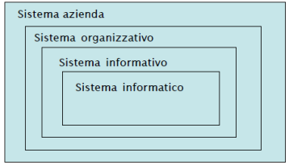
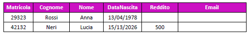
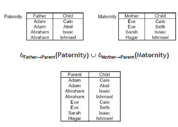
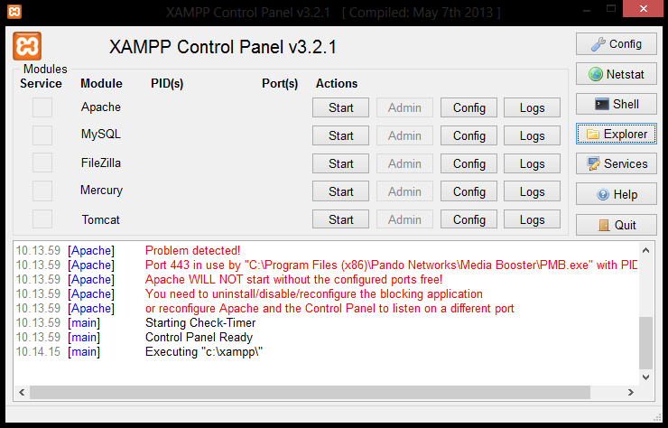

Appunti di

Basi di Dati

Rosario Terranova

[https://rosarioterranova\.github\.io/](https://rosarioterranova.github.io/)

Sommario

[Introduzione alle Basi di dati	3](#_Toc414803749)

[Importanza dei Dabase	3](#_Toc414803750)

[Sistema di gestione di basi di dati \(DataBase Management System \- DBMS\)	4](#_Toc414803751)

[Modello dei dati	5](#_Toc414803752)

[Linguaggi e personaggi	6](#_Toc414803753)

[Modello Relazionale	8](#_Toc414803754)

[Struttura del modello relazionale	9](#_Toc414803755)

[Vincoli di integrità dei dati	10](#_Toc414803756)

[Chiavi e superchiavi	11](#_Toc414803757)

[Algebra relazionale	12](#_Toc414803758)

[Join \(\)	15](#_Toc414803759)

[Altri operatori relazionali	18](#_Toc414803760)

[Viste nel modello relazionale	19](#_Toc414803761)

[Algoritmo di Ottimizzazione della Query	20](#_Toc414803762)

[SQL: DDL e DML	22](#_Toc414803763)

[Caratteristiche generali dell’SQL	22](#_Toc414803764)

[Data Definition Language \(DDL\) in SQL	22](#_Toc414803765)

[DML \- Operazioni sui dati	23](#_Toc414803766)

[Vincoli di integrità	24](#_Toc414803767)

[SQL: DQL	27](#_Toc414803768)

[Clausola SELECT	27](#_Toc414803769)

[Alias, referenziazione e concatenazione stringe	28](#_Toc414803770)

[Clausola DISTINCT	29](#_Toc414803771)

[Clausola WHERE	29](#_Toc414803772)

[Clausola ORDER BY	32](#_Toc414803773)

[JOIN	32](#_Toc414803774)

[SQL: Aggregazione di dati	37](#_Toc414803775)

[Operatori di aggregamento	37](#_Toc414803776)

[Operatori aggregati e valori nulli	38](#_Toc414803777)

[Clausola GROUP BY	39](#_Toc414803778)

[Clausola HAVING	40](#_Toc414803779)

[Subquery \(query annidate\)	40](#_Toc414803780)

[SQL: Viste, Transazioni e Trigger	43](#_Toc414803781)

[Aggiornamento delle viste	44](#_Toc414803782)

[Viste ricorsive	44](#_Toc414803783)

[Funzioni scalari	45](#_Toc414803784)

[Controllo dell’accesso	46](#_Toc414803785)

[Transazioni	47](#_Toc414803786)

[Trigger	49](#_Toc414803787)

[MySQL e PHP	53](#_Toc414803788)

[Engine	53](#_Toc414803789)

[Tipi di dati accettati	54](#_Toc414803790)

[Account e privilegi	55](#_Toc414803791)

[Comandi MySQL	55](#_Toc414803792)

[Funzioni e operatori	57](#_Toc414803793)

[Esempi di script in MySQL	60](#_Toc414803794)

[phpMyAdmin	63](#_Toc414803795)

[PHP	65](#_Toc414803796)

[Progettazione di una base di dati	66](#_Toc414803797)

[Modello Entità\-Relazione	67](#_Toc414803798)

[Progettazione concettuale	74](#_Toc414803799)

[Progettazione logica	77](#_Toc414803800)

[Progettazione fisica	84](#_Toc414803801)

[Stored Procedure	85](#_Toc414803802)

[Stored Procedure in MySQL	86](#_Toc414803803)

[Parametri	86](#_Toc414803804)

[Variabili	87](#_Toc414803805)

[Controlli condizionati \(IF…THEN…ELSE\)	88](#_Toc414803806)

[Loop	88](#_Toc414803807)

[Cursori	89](#_Toc414803808)

[Database Multidimensionali	91](#_Toc414803809)

[Decision Support System \(DSS\)	91](#_Toc414803810)

[Transaction Processing System \(TPS\)	91](#_Toc414803811)

[Data warehouse	92](#_Toc414803812)

[Rappresentazione multidimensionale dei dati	96](#_Toc414803813)

[FORMULARIO DI ALGEBRA RELAZIONALE	97](#_Toc414803814)

[ALGORITMI DI RISOLUZIONE DEGLI ESERCIZI	101](#_Toc414803815)

[FORMULARIO DEL MODELLO E/R	103](#_Toc414803816)

[NORMALIZZAZIONE IN SINTESI	105](#_Toc414803817)

# Introduzione alle Basi di dati

## Importanza dei Dabase

Un database \(base di dati\) è insieme organizzato di dati, che esistono e si evolvono nel tempo, disponibili in una certa struttura \(impresa, banca, ospedale, …\) per lo svolgimento della propria attività\.

Le basi di dati al giorno d’oggi sono essenziali in ogni tipologia di attività\.

*Es*\.	– usate per mantenere “record” interni ad una struttura;

– per offrire servizi attraverso il World\-Wide\-Web;

– per supportare diversi altri processi \(commerciali\)\.

– Alla base di ricerche scientifiche, utilizzate per memorizzare e rappresentare dati\.

Sistema organizzativo di un’azienda

La struttura di un’azienda comprende:

- *Insieme di risorse*: le risorse di una azienda: persone, denaro, materiali, beni, e __informazioni __\(gestite dal sistema informativo\);
- *Regole*: necessarie per lo svolgimento coordinato delle attività al fine del perseguimento degli scopi\.

Sistema informativo e Sistema informatico

Il __sistema informativo__ \(SI\) è parte del sistema organizzativo di un’azienda o ente \(eventualmente non esplicitato nella struttura\), che esegue/gestisce processi informativi \(cioè i processi che coinvolgono informazioni\)\.

Un SI gestisce informazioni, ma ciò non significa necessariamente fare ricorso a strumenti automatici propri della tecnologia dell’informazione \(IT\); esistono organizzazioni la cui ragion d’essere è la gestione di informazioni \(es\. servizi anagrafici e banche\) e che operano da secoli\.

La parte automatizzata di un SI viene più propriamente denominata __Sistema Informatico__\. La porzione __automatizzata__ del sistema informativo è la parte del sistema informativo che gestisce informazioni con tecnologia informatica\.

Valore dell’informazione

L’informazione è un bene a valore crescente, necessario per pianificare e controllare con efficacia le attività dell’organizzazione, e rappresenta la materia prima che viene trasformata dai sistemi informativi, così come i semilavorati vengono trasformati dai sistemi di produzione\.

Gestione delle informazioni

Gestire un’informazione significa acquisire, elaborare, conservare, produrre e distribuire dati\. Un aspetto fondamentale per la gestione delle informazioni è la razionalizzazione e standardizzazione dell’organizzazione delle informazioni e delle procedure\. Anche prima di essere informatizzati, molti sistemi informativi si sono evoluti in questa direzione* *\(es\. gli uffici anagrafe fino a pochi anni fa\)\.

In qualsiasi attività le informazioni vengono gestite \(registrate e scambiate\) in diversi modi: idee informali, linguaggio naturale \(scritto o parlato, formale o colloquiale, in una lingua o in un’altra\), disegni, grafici, schemi, numeri e codici; e su vari supporti: memoria umana, carta, dispositivi elettronici\.

Dati

Nei sistemi informatici \(e non solo\), le informazioni vengono rappresentate in modo essenziale e spartano attraverso i __dati\.__ Dal Vocabolario della lingua italiana \(1987\) distinguiamo:

- __Informazione__: notizia, dato o elemento che consente di avere conoscenza più o meno esatta di fatti, situazioni, modi di essere\.
- __Dato__: ciò che è immediatamente presente alla conoscenza, prima di ogni elaborazione; \(in informatica\) elementi di informazione costituiti da simboli che debbono essere elaborati\.

I dati hanno bisogno di essere interpretati\.

*Es*\.	“*Mario*”, “*Rossi*” e “*12345*” sono tre dati\. Se essi vengono forniti in risposta alla domanda “Qual è la

matricola dell’ultimo studente che ha fatto esami di Programmazione 2” allora i dati possono essere interpretati per fornire informazione e arricchire la conoscenza\. Dunque dai dati si arriverà all’informazione:

	“Lo studente Mario Rossi ha numero di matricola 12345”\.

Perché i dati

La rappresentazione precisa di forme più ricche di informazione e conoscenza è difficile\. I dati costituiscono spesso una risorsa strategica, perché più stabili nel tempo di altre componenti \(processi, tecnologie, ruoli umani\)\.

## Sistema di gestione di basi di dati \(DataBase Management System \- DBMS\)

Il modo più comune con cui un sistema informatico gestisce le informazioni è attraverso la rappresentazione codificata dei dati di interesse\. Intuitivamente, una __Base di Dati__ \(DB \- Data Base o Database\) può pensarsi come una collezione di dati che rappresentano le informazioni di interesse per un’organizzazione\.

La potenza delle basi di dati deriva da un bagaglio di conoscenze e tecnologie che sono state sviluppate in diverse decadi che hanno dato luogo a software specializzati chiamati: __*Sistema di gestione di basi di dati*__ \- __*DataBase Management System*, o DBMS\.__

Scopo di un DBMS

Un DBMS è uno strumento particolarmente potente per la creazione e la gestione efficiente ed efficace di grandi quantità di dati\. Esso è un Sistema \(__prodotto software__\) in grado di gestire __collezioni di dati __che sono caratterizzati da:

- __Grandezza, __dimensioni \(molto\) maggiori della memoria centrale dei sistemi di calcolo utilizzati;
- __Persistenza__, con un periodo di vita indipendente dalle singole esecuzioni dei programmi che le utilizzano e a prova di guasti;
- __Condivisione, __molteplici applicazioni diverse che utilizzano gli stessi dati;
- __Prestazionali, __in grado di garantire elevate prestazioni, cioè l’utilizzo efficiente delle risorse e ottimizzazione dei tempi di esecuzione delle operazioni;
- __Visione struttura dei dati,__ che dipende dal modello \(logico\) dei dati supportato\.

Un DBMS consente all’utente o ad un’applicazione di accedere e modificare i dati attraverso un potente linguaggio di interrogazione garantendo __affidabilità __\(resistenza a malfunzionamenti hardware e software\) e __privatezza __\(con una disciplina e un controllo degli accessi\)\. Come ogni prodotto informatico, un DBMS deve essere __efficiente __\(utilizzando al meglio le risorse di spazio e tempo del sistema\) ed __efficace __\(rendendo produttive le attività dei suoi utilizzatori\)\.

Esempi di prodotti software \(complessi\) disponibili sul mercato:

- DB2 \(sviluppato da IBM\)
- Oracle \(sviluppato da Oracle\)
- SQLServer \(sviluppato da Microsoft\)
- MySQL \(open\-source\)
- PostgreSQL \(open\-source\)
- Access \(sviluppato da Microsoft\)

Condivisione

Ogni organizzazione \(specie se grande\) è divisa in settori o comunque svolge diverse attività\. A ciascun settore o attività corrisponde un \(sotto\)sistema informativo, e possono esistere sovrapposizioni fra i dati di interesse dei vari settori\.  I problemi relativi alla condivisione sono: __ridondanza__, ovvero informazioni ripetute; e rischio di __incoerenza__, cioè le versioni possono non coincidere\.

Una base di dati è una risorsa __integrata__, condivisa fra le varie applicazioni; le conseguenze sono:

- Attività diverse su dati in parte condivisi: meccanismi di __autorizzazione__
- Attività multi\-utente su dati condivisi: controllo della __concorrenza__

## 

Modello dei dati

Un __modello dei dati __è un insieme di *concetti *utilizzati per *organizzare i dati *e *descriverne la struttura *in modo che essa risulti comprensibile a un elaboratore\. Ogni modello di dati fornisce *meccanismi di strutturazione\. *Questi meccanismi di astrazione* *costituiscono l’equivalente delle __strutture* *dati__ nella programmazione\.

Caratteristiche di un buon modello

- __Espressività: __permette di rappresentare in modo semplice e naturale i dati e le proprietà\.
- __Semplicità__: basato su un numero minimo di meccanismi semplici da utilizzare e capire\.
- __Realizzabilità: __deve essere realizzabile in modo efficiente su di un calcolatore

Composizione

Il modello di rappresentazione dei dati è composto dalla __notazione__ per descriverli, e da un insieme di __operatori__ per manipolarli\. Una componente fondamentale sono i __meccanismi di strutturazione __\(o __costruttori di tipo__\), che come nei linguaggi di programmazione sono meccanismi che permettono di definire nuovi tipi, così ogni modello dei dati prevede alcuni costruttori\.

Descrizioni e rappresentazioni dei dati a livelli diversi permettono l’__indipendenza dei dati __dalla rappresentazione fisica: i programmi fanno riferimento alla struttura a livello più alto, e le rappresentazioni sottostanti possono essere modificate senza necessità di modifica dei programmi\.

Tipi di modelli

- __Modello logico__: utilizzato nei DBMS esistenti per l’organizzazione dei dati\. Si chiama logico per sottolineare il fatto che le strutture utilizzate da questi modelli, pure essendo astratte, riflettono una particolare organizzazione; sono utilizzati dai programmi e indipendenti dalle strutture fisiche

*Es*\.	__Relazionale__, reticolare, gerarchico, a oggetti\.

- __Modello concettuale__: permette di rappresentare i dati in modo indipendente da ogni sistema; cercano di descrivere i concetti del mondo reale piuttosto che i dati utili a rappresentarli e sono utilizzati nelle fasi preliminari di progettazione\.

*Es*\.	__Entity\-Relationship\.__

Schemi e istanze

In ogni database esistono:

- __Schema__: sostanzialmente invariante nel tempo, ne descrive la struttura \(aspetto intensionale\)\.
- Raccolta di __definizioni__ che descrivono i dati, le restrizioni sui valori \(vincoli di integrità\), le relazioni fra essi ed eventualmente alcune operazioni disponibili\.
- __Istanza__: valori attuali che possono cambiare anche molto rapidamente \(aspetto estensionale\)
- __Record__: oggetto di una banca dati strutturata in dati compositi, che contengono un insieme di campi o elementi, ciascuno dei quali possiede nome e tipo propri\.

*Es*\. Nello schema a sinistra possiamo individuare la raccolta di definizioni che  

*       *sono le intestazioni della tabella, mentre le istanze sono il corpo di    

 ciascuna tabella\.

Architettura standard \(ANSI/SPARC\) a tre livelli per DBMS

- __Schema logico: __descrizione dell’intera base di dati nel modello logico “principale” del DBMS
- __Schema fisico: __rappresentazione dello schema logico per mezzo di strutture fisiche di memorizzazione
- __Schema esterno \(o delle viste\): __descrizione di parte dello schema logico secondo le esigenze dei diversi utenti tramite __viste\.__

Il livello logico è indipendente da quello fisico: una tabella è utilizzata nello stesso modo qualunque sia la sua realizzazione fisica \(che può anche cambiare nel tempo\)\.

Scopo delle viste

Oltre a fornire una visione “personalizzata” del DB, le viste possono svolgere un ruolo importante anche per diversi altri motivi:

- Una ristrutturazione dello schema logico integrato può, in alcuni casi, essere opportunamente “mascherata” facendo uso di viste;
- Mediante le viste è possibile regolare meglio il controllo degli accessi al DB, ad es\. mascherando dati riservati;
- Le viste possono essere usate per “calcolare” dinamicamente nuovi dati a partire da quelli memorizzati nel DB, senza per questo introdurre ridondanza\.

Indipendenza dei dati

L’indipendenza è una conseguenza della articolazione in livelli\. L’accesso avviene solo tramite il livello esterno \(che può coincidere con il livello logico\)\. Abbiamo due forme di indipendenza:

- __Indipendenza fisica__: il livello logico e quello esterno sono indipendenti da quello fisico\. Una relazione è utilizzata nello stesso modo qualunque sia la sua realizzazione fisica\. La realizzazione fisica può cambiare senza che debbano essere modificati i programmi\.
- __Indipendenza logica__: il livello esterno è indipendente da quello logico\. Aggiunte o modifiche alle viste non richiedono modifiche al livello logico\. Modifiche allo schema logico che lascino inalterato lo schema esterno sono trasparenti\.

## Linguaggi e personaggi

__Data\-Definition Language \(DDL\)__

Consente all’utente di creare nuovi database e di__* *__specificarne i loro __schemi __\(logici, esterni, fisici\) la__* *__loro strutturazione logica\.

__Data Manipulation Language \(DML\)__

Dà agli utenti la possibilità di inserire, gestire e__* *__modificare __istanze __di basi di dati\.

__Data Query Language \(DQL\)__

Consente di avviare interrogazioni, sia semplici che complesse, dei dati memorizzati\.

__Data Control Language \(DCL\)__

Consente allo sviluppatore di database di creare e gestire strumenti di controllo e accesso ai dati\.

SQL

SQL \(*Structured Query Language*\) è un linguaggio standardizzato per database basati sul modello relazionale progettato per incorporare tutte le funzioni DDL, DML, DQL e DCL\.

A differenza del nome, non si tratta dunque solo di un semplice query language \(linguaggio di interrogazione\), ma include anche gli altri linguaggi tipici per la progettazione e gestione/amministrazione del database

Query

Il termine query viene utilizzato per indicare l'__interrogazione__ di un database per compiere determinate operazioni sui dati \(selezione, inserimento, cancellazione dati, ecc\.\)\. Solitamente una query viene interpretata, dal linguaggio __SQL__ \(Structured Query Language\) per renderla più comprensibile al DBMS\. L'analisi del risultato della query è oggetto di studio dell'algebra relazionale\.

Una semplice ed esemplificativa query SQL di selezione può essere la seguente: SELECT \* FROM AULE

Una *query* di selezione inizia classicamente con il comando *select*, che apre una stringa di interrogazione sul database; *\** sta per *all*, ovvero tutti \(i campi della tabella\); *from* dichiara l'origine dei dati, ovvero, nell'esempio, UNIVERSITA’\.

Si possono aggiungere criteri restrittivi di selezione introdotti abitualmente dal comando *WHERE*\. Vediamo un esempio: SELECT \* FROM UNIVERSITA’ WHERE AULA=“Aula 4”

In questo caso la query restituirà, tra tutti i record, solo quelli che avranno nel campo AULA  il valore "Aula 4"\. Se al posto dell'operatore logico = si usa <> verranno selezionati i record diversi dal valore immesso\.

Si possono inoltre combinare più filtri di ricerca, uniti dall'operatore *and* e *or*, ottenendo una condizione per la quale una query deve essere valida, oppure combinare più query insieme \(tramite la funzione Join\)\.

Un’operazione DDL

CREATE TABLE orario \(insegnamento CHAR\(20\) , docente CHAR\(20\) , aula CHAR\(4\) , ora CHAR\(5\) \)

Personaggi e interpreti

Le funzioni del DBA \(DataBase Administrator, sistemista specializzato nell'amministrazione di database\) includono quelle di progettazione, anche se in progetti complessi ci possono essere distinzioni\.

- __Amministratori: __Persona o gruppo di persone responsabile del controllo centralizzato e della gestione del sistema, delle prestazioni, dell’affidabilità, delle autorizzazioni
- __Progettisti: __Realizzatori di __DBMS__
- __Utenti:__ Colui che usa il DB, si dividono in:
	- Utenti __finali __\(terminalisti\), eseguono applicazioni__ __predefinite \(transazioni\)
	- Utenti __casuali__, eseguono operazioni non previste a__ __priori, usando linguaggi interattivi

Transazioni \(per l’utente\)

Programmi che realizzano attività frequenti e predefinite, con poche eccezioni, previste a priori\.

*Es*\.	\- versamento presso uno presso sportello bancario

\- emissione di certificato anagrafico

\- dichiarazione presso l’ufficio di stato civile

\- prenotazione aerea

Le transazioni sono di solito realizzate in linguaggio ospite \(tradizionale o ad hoc\)\.

- Per l'utente: programma a disposizione, da eseguire per realizzare una funzione di interesse
- Per il sistema: sequenza indivisibile di operazioni \(cfr\. affidabilità\)\.

Vantaggi dei DBMS

Pro

Contro

- dati come risorsa comune, base di dati come modello della realtà
- gestione centralizzata con possibilità di standardizzazione ed “economia di scala”
- disponibilità di servizi integrati
- riduzione di ridondanze e inconsistenze
- indipendenza dei dati

- costo dei prodotti e della transizione
- non scorporabilità delle funzionalità \(con riduzione di efficienza\)

Perché non i file system?

Per gestire grandi quantità di dati in modo persistente e condiviso sarebbe anche possibile fare uso dei file system, ma ciò ha una serie di inconvenienti, tra cui:

- Non sono disponibili i servizi aggiuntivi offerti da un DBMS
- I meccanismi di condivisione sono limitati, in particolare il livello di granularità è quello del file \(due utenti non possono modificare contemporaneamente parti \(record\) diverse di uno stesso file\)
- L’accesso a file condivisi richiede una descrizione degli stessi nel codice  delle applicazioni, con rischi di descrizioni errate e quindi inconsistenti\.

# Modello Relazionale

Venne proposto da Edgar F\. __Codd__ nel 1970 per semplificare la scrittura di interrogazioni sui database e per favorire l’indipendenza dei dati; venne reso disponibile come modello logico in DBMS reali nel 1981\. Oggi è uno dei modelli logici più utilizzati, implementato su moltissimi DBMS sia commerciali che open source\. Si basa sulla teoria degli insiemi e sulla logica del primo ordine ed è strutturato intorno al concetto matematico di __relazione\. __Per il suo trattamento ci si avvale di strumenti quali il calcolo relazionale e l'algebra relazionale\.

__RDBMS__ = DBMS che supporta il modello relazionale dei dati

Concetto di relazione

Il termine “relazione” può essere usato con diverse accezioni, che non vanno confuse tra loro:

- Nel linguaggio comune = “legame” di qualche tipo
- Nella teoria degli insiemi = relazione matematica
- Nel modello relazionale = generalizzazione della relazione matematica
- Nel modello Entity\-Relationship indica una classe di legami tra due o più entità \(si parla anche di “associazione”\)
- Nei DBMS è usato come sinonimo di “__tabella__”

Relazione matematica

Si considerino n insiemi  non necessariamente distinti\. Il prodotto cartesiano  è l’insieme di tutte le n\-ple ordinate  tali che \. Una relazione matematica su  è un qualunque sottoinsieme del prodotto cartesiano \.

*Es*\.	  

 è una relazione su  e \.

Dove  sono i *domini* delle relazione, il valore di n è detto *grado* della relazione, il numero di n\-ple di una relazione è la sua *cardinalità*\.

Schemi relazionali

Uno schema di relazione  è una coppia formata dal nome di una relazione R e da un tipo di relazione dove i tipi di dati *“Interi; Reali; Booleani; Stringhe;”* sono tipi primitivi\.

Se   sono tipi primitivi e  sono etichette, dette attributi, allora  è un tipo di __n\-upla__ di grado n\. Se  è un tipo n\-upla allora  è un tipo relazione\.

Lo __schema relazionale__ è costituito da un insieme di schemi di relazione  e da un insieme di vincoli di integrità relativi a tali schemi\. Costituisce l’aspetto __intensionale__ del dato modello relazionale dei dati\.

L’aspetto __estensionale__ invece ci dice che una n\-upla  di tipo  è un insieme di coppie  con  di tipo \.

Una __relazione R__ di tipo  è un insieme finito di n\-uple di tipo \.

*Es*\. 

È una relazione di tipo  e ciascuna riga è una n\-upla della relazione\.

Le tabelle \(Nome, Matricola, Indirizzo, Telefono\), \(Corso,Matricola,Voto\), \(Corso, Professore\) costituiscono un istanza dello schema relazionale\.

 

 

 

 è l’insieme dei possibili valori dell’attributo \. Ad esempio nella tabella Studenti\(Corso,Matricola,Voto\), dom\(Voto\) = \{18,19,…,30,31\}\.

## Struttura del modello relazionale

L'assunto fondamentale del modello relazionale è che tutti i dati sono rappresentati come relazioni e manipolati con gli __operatori dell'algebra relazionale __o del calcolo relazionale, da cui appunto il nome\.

Il modello relazionale consente al progettista di database di creare una rappresentazione __consistente__ e logica dell'informazione\. La consistenza è ottenuta inserendo nel progetto del database appropriati vincoli, normalmente chiamati __schema logico__\.

Scomposizione di una relazione

Una *relazione* può essere informalmente definita come una *tabella* le cui colonne \(*attributi*\) rappresentano le proprietà di interesse, e le cui righe \(*tuple*\) rappresentano ciascuna uno specifico oggetto descritto nel DB\.

Quando si parla di “relazione” ci si riferisce a un oggetto composto di 2 parti:

- __Testata \(o schema\)__\. Insieme di attributi o campi dati, formato dal *nome della relazione* e dal *nome degli attributi*\.

- __Corpo \(o istanza\)__\. Insieme di n\-tuple o record di dati o valori, formato dai *dati* veri e propri:

Esaminando questi due componenti, in dettaglio abbiamo:

- __*Tabella \(o relazione\)*__\. Termine normalmente usato in sostituzione del termine teorico relazione per indicare l'insieme delle righe e delle colonne della matrice di dati\. La struttura di una tabella è specificata da una lista di colonne, ciascuna delle quali ha un nome univoco \(l'attributo o campo dato\), un tipo di dato e un dominio, cioè un insieme cioè di valori accettati\. Essa è la rappresentazione grafica normalmente accettata per rappresentare la relazione tra attributi e valori\.
- __*Attributo \(o campo dato\)*__\. Termine usato per indicare l'intestazione iniziale di una colonna; ad esso si associa un certo __tipo di dato__ con il suo __dominio__ di possibili valori\.
- Il __tipo di dato__ usato nei database relazionali può essere un insieme di numeri interi, un insieme di caratteri alfanumerici, l'insieme delle date, i valori booleani vero e falso ecc\.\.\. I corrispondenti "nomi di tipo", ad esempio, saranno dunque le stringhe "int", "char", "date", "boolean", etc\. 
- Il __dominio__ su quel tipo di dato è definito come l'insieme dei valori che può assumere un determinato attributo o campo dato; esso è un sotto insieme del prodotto cartesiano  degli insiemi di valori di tipo elementare\.
- __*Valore*\. __È il dato o valore di una cella identificata da una specifica coppia riga \- colonna, come ad esempio "Mario Rossi" o "2006"
	- __Tupla\.__ È praticamente la stessa cosa di una riga o record di dati o valori, cioè l'insieme non ordinato di valori assunti dagli attributi, indicato con \.

Il principio base del modello relazionale è che tutte le informazioni siano rappresentate da valori inseriti in __relazioni__ \(tabelle\); dunque un database relazionale è *un insieme di relazioni contenenti valori* e il risultato di qualunque interrogazione \(o manipolazione\) dei dati può essere rappresentato anch'esso da relazioni \(tabelle\)\.

Una __relazione__ è dunque la definizione di una tabella, cioè un insieme di colonne e righe, cioè attributi o campi dato insieme ai rispettivi dati o valori che vi compaiono\. La definizione della tabella è la testata iniziale e i dati che vi appaiono sono il corpo cioè un insieme di righe\.

## Vincoli di integrità dei dati

Una relazione non deve \(e non può\) essere vista come un contenitore__ __di dati a piacimento di tipo\. Se così fosse non riusciremmo più a interpretare correttamente i dati e molte operazioni non si potrebbero eseguire in maniera affidabile\. Si rende pertanto necessaria un’attività di analisi rivolta a evidenziare quali sono i vincoli che le nostre istanze devono soddisfare affinché si possano considerare valide \(o “legali”, “corrette” “ammissibili”, ecc\.\)\.

Un vincolo di integrità è una proprietà che deve essere soddisfatta dalle istanze; ogni vincolo può quindi essere descritto da una funzione booleana che associa a ogni istanza il valore VERO o FALSO\. Essi servono a migliorare la qualità delle informazioni contenute nella base di dati\.

*Es*\.	Il voto dev’essere compreso tra 18 e 30

La lode può apparire solo se voto = 30

Ogni studente deve avere un numero di matricola

Il numero di matricola di uno studente dev’essere univoco

Esami dati devono fare riferimento solo a corsi offerti

Prima forma normale \(1NF\)

Nel modello relazionale non è in generale possibile usare domini strutturati \(array, set, liste, alberi, …\)\. Vi sono delle eccezioni notevoli \(ad es\. le date e le stringhe\)\.

Concisamente, una relazione in cui ogni dominio è “__atomico__” \(non ulteriormente decomponibile\), e si dice che è in

__Prima Forma Normale__, o 1NF \(1st Normal Form\)\. In molti casi è pertanto richiesta un’attività di __normalizzazione__ dei dati che dia luogo a relazioni in 1NF preservando l’informazione originale\.

*

*

Il fatto che una rappresentazione normalizzata sia adeguata o meno dipende \(molto\) dal contesto\.

*Es*\. L’ordine delle righe nella ricevuta è rilevante o meno?

Lo stesso dicasi per eventuali ridondanze che si possono venire ad osservare\.

*Es*\. Il coperto ed il caffè hanno un prezzo che non varia da ricevuta a ricevuta?

 In generale è bene ricordare che ogni caso presenta una sua specificità, e quindi non va trattato automaticamente\.

Normalizzare in 1NF è, a tutti gli effetti, un’attività di progettazione \(logica\), e in quanto tale può essere solo oggetto di “regole guida” che però non hanno validità assoluta\.

Valori NULL

Le informazioni che si vogliono rappresentare mediante relazioni non sempre corrispondono pienamente allo schema prescelto, in particolare per alcune tuple e alcuni attributi potrebbe non essere possibile specificare, per diversi motivi, un valore del dominio\.

*Es*\.

Lucia Neri non ha un’email \(valore non applicabile\)\. Anna Rossi ha un reddito, ma non lo conosciamo \(applicabile ma ignoto\)\. Anna Rossi non si sa se ha un’email \(ignota l’applicabilità\)\.

In diversi casi, in mancanza di informazione, si tende a usare un “valore speciale” del dominio \(0, “”, “‐1”, ecc\.\) che non si utilizza per altri scopi\. Questa pratica è fortemente sconsigliata, in quanto, anche dove possibile:

- Valori inutilizzati potrebbero successivamente diventare significativi
- Le applicazioni dovrebbero sapere “cosa significa in realtà” il valore usato allo scopo
- Tali valori incidono nel caso di calcoli \(es\. media, ecc\.\)

Nel modello relazionale si opera in maniera pragmatica: si adotta il concetto di valore nullo \(NULL\), che denota assenza di un valore nel dominio \(e non è un valore del dominio\)\.

La presenza di un valore nullo non fornisce alcuna informazione sull’applicabilità o meno\. È importante ricordare che NULL non è un valore del dominio; in particolare, se due tuple hanno entrambe valore NULL per un attributo, non si può inferire che esse abbiano lo stesso valore per quell’attributo\.

D’altro canto, la presenza di valori nulli non può essere sempre tollerata, ovvero è necessario imporre delle restrizioni al loro uso\.

*Es*\.	Il valore nullo per Matricola non permette di sapere chi ha sostenuto l’esame; Il valore nullo per Voto non è ammissibile nel contesto considerato\. Istanze di questo tipo non sono accettabili\!

Vincoli di dominio

Un vincolo che si riferisce ai valori ammissibili per un singolo attributo viene detto vincolo di dominio \(o sui valori\)\. In pratica i domini che si possono usare dipendono dal DBMS e includono i tipi più comuni di dati \(interi, stringhe, date\)\.

*Es*\.	Il Voto deve essere compreso tra 18 e 30	\(Voto ≥ 18\) AND \(Voto ≤ 30\)

La Lode può solo assumere i valori \`SÌ’ o \`NO’	\(Lode = \`SÌ’\) OR \(Lode = \`NO’\)

I vincoli di dominio sono un caso particolare dei vincoli di tupla, ovvero vincoli che esprimono condizioni su ciascuna tupla, indipendentemente dalle altre\.

Vincoli di chiave

Un tipo importantissimo di vincoli sono i vincoli di chiave, che vietano la presenza di tuple distinte che hanno lo stesso valore su uno o più attributi\.

*Es*\.	Il valore di Matricola identifica univocamente uno studente, lo stesso vale per CodiceFiscale\.

## Chiavi e superchiavi

- Si definisce __chiave__ un insieme di uno o più attributi di una relazione che identificano univocamente le tuple della relazione stessa\.
- Si definisce __superchiave__ un insieme di attributi *K* di una relazione *r* che non contiene due tuple che hanno valori uguali su *K*\.
	- *K* è __superchiave minimale__ o __chiave__ di *r* se si toglie un attributo e non è più superchiave
- Si definisce __chiave primaria__ di una relazione  una chiave costituita da un attributo aggiunto appositamente per l’identificazione univoca delle tuple\. Non ammette valori nulli per i suoi attributi\.

*

Es*\.  \{Matricola\} è una chiave primaria poiché ha la funzione di identificare univocamente le tuple;

\{Cognome,Nome,Nascita\} è una chiave poiché l’insieme identifica univocamente una tupla;

\{Matricola,Corso\} è una superchiave poiché non hanno valori uguali su K;

\{Nome,Corso\} non è una superchiave poiché può contenere valori uguali\.

Chiave primaria

Per evitare problemi di chiavi nulle, è necessario scegliere una chiave, detta chiave primaria, su cui non si ammettono valori nulli\. Ogni riga della tabella è identificata in maniera univoca da una *chiave primaria*\. I dati di più tabelle possono essere messi in relazione logica tramite l’uso di chiavi secondarie\.

Chiave esterna \(foreign key\)

Un insieme di attributi \{A1, A2 , …, An\} di uno schema di relazione R è una __chiave esterna__ che riferisce una chiave primaria \{B1, B2 , …, Bn\} di un altro schema S se, in ogni istanza valida della base di dati, per ogni n\-upla  esiste una n\-upla  \(riferita da r\) tale che  

*Es*\.	\{Matricola\} per __Esami__ e’ chiave esterna che si riferisce a Matricola di __Studenti__, per la quale è chiave primaria\.

Importanza delle chiavi

L’esistenza delle chiavi garantisce l’accessibilità a ciascun dato del DB, in quanto ogni singolo valore è univocamente individuato da:

nome della relazione		individua una relazione del DB

valore della chiave		individua una tupla della relazione

nome dell’attributo		individua il valore desiderato

## Algebra relazionale

Un linguaggio di manipolazione, o __DML__, permette di interrogare e modificare istanze di Basi di Dati\. A parte i linguaggi utente, quali SQL, esistono altri linguaggi, formalmente definiti, che rivestono notevole importanza in quanto enfatizzano gli aspetti “essenziali” dell’interazione con un DB relazionale\.

In particolare:

- __Calcolo relazionale__: linguaggio dichiarativo basato sulla logica dei predicati del primo ordine che permette di descrivere le proprietà del risultato invece che il modo per ottenerlo\.
- __Algebra relazionale__: linguaggio procedurale di tipo algebrico, cioè una descrizione della procedura da attuare per ottenere il risultato, i cui operandi sono relazioni\.

L'__algebra relazionale__ e il collegato __calcolo relazionale__ fanno parte dell'insieme di linguaggi che permettono di esaminare le query \(interrogazioni\) da effettuare nell'ambito della gestione di un database\. Calcolo e algebra sono equivalenti in termini di potere espressivo \(“ciò che riescono a calcolare”\)\.

Le operazioni principali da eseguire su un database sono due:

- __Aggiornamento__: Una funzione che data un’istanza di una base di dati produce un’altra basi di dati sullo stesso schema\.
- __Interrogazione__: Una funzione che data una base di dati produce una relazione su un dato schema\.

Operatori dell’algebra relazionale

L'algebra relazionale prevede un set di __operatori__ che operano su una o più relazioni e danno sempre come risultato un'altra relazione\. Gli operatori possono essere combinati per formare espressioni complesse\.

L'algebra relazionale ha 6 __operatori di base__ e diversi __operatori derivati__, che possono cioè essere definiti come combinazione di operatori primitivi\.

Operatori fondamentali \(di base\)

Operatori derivati \(da quelli di base\)

\- operatori binari di Unione

\- operatori binari di Differenza

\- operatori binari di Prodotto cartesiano

\- operatori unari di Selezione

\- operatori unari di Proiezione

\- operatori unari di Ridenominazione

\- operatore insiemistico binario di Intersezione

\- operatore di Join in varie forme \(Theta\-Join, Natural\-Join, etc\.\)

\- operatore di Divisione

I simboli *R,S,…* denotano relazioni, *A,B,…* denotano attributo e *X,Y,…* insiemi di attributi\.

Unione, Differenza e Intersezione \(\)

Dato che le relazioni sono degli insiemi ha senso definire su di esse gli operatori insiemistici tradizionali come unione, differenza e intersezione\. L'unico vincolo è quello di avere delle tuple omogenee cioè definite sugli stessi attributi\.

- l'unione di due relazioni r1 e r2 definite sullo stesso insieme di attributi X è indicata con  ed è una relazione ancora su X contenente le tuple che appartengono a r1 oppure a r2,senza ripetizioni delle eventuali tuple ripetute\.
- l'intersezione di r1\(X\) e r2\(X\) è indicata con  ed è una relazione su X contenente le tuple che appartengono sia a r1 che r2\.
- la differenza di r1\(x\) e r2\(x\) è indicata come __ __ed è una relazione su X contenente le tuple che appartengono a r1 e non appartengono a r2\.

Esempio Unione

Esempio Intersezione

Esempio Differenza

Ridenominazione \(\)

L'operatore di ridenominazione modifica lo schema di una relazione, cambiando i nomi di uno o più attributi\. Quest'operazione è molto utile per ottenere delle tuple omogenee quando non lo sono anche se il campo semantico di applicazione della query lo è\. 

*Es*\.     “Father” e “Mother” sono attributi con nomi, diversi ma entrambi sono “Genitori”

Soluzione: *ridenominare* gli attributi\.

Sia r una relazione definita sull'insieme di attributi X e sia Y un \(altro\) insieme di attributi con ordinamento per gli attributi in X e un ordinamento per quelli in Y\. Allora la ridenominazione  contiene una tupla t' per ciascuna tupla t in r, definita come segue: t' è una tupla su Y e , per i = 1,\.\.\., n\. La definizione conferma che ciò che cambia sono i nomi degli attributi, mentre i valori rimangono inalterati e vengono associati ai nuovi attributi\.

Esempio di Ridenominazione

Prodotto cartesiano \(\)

È definito solo nel caso in cui le relazioni non abbiano attributi in comune, e al contrario dell'omonimo operatore sugli insiemi, il risultato non è un insieme di tuple, ma un'unica tupla composta dalle due tuple delle relazioni originarie\.

Siano  ed  con \. Allora si pone \.

Esempio di Prodotto Cartesiano

Selezione \(\)

Sia R una relazione, allora __,__ dove  è una formula proposizionale costituta a partire da  e utilizzando i connettivi proposizionali \. A e B sono attributi di R o costanti, mentre \.

La selezione da una tabella non è altro che l'insieme di righe che appartengono alla tabella e che soddisfano una serie di condizioni indicate nella selezione stessa\.

Esempio di Selezione

Proiezione \(\)

Sia R una relazione, e siano  alcuni suoi attributi, allora 

L'operatore di proiezione effettua una modifica al *grado* della relazione a cui si applica\. Il simbolo è  , a pedice del quale viene indicata la lista degli attributi che costituiscono la nuova relazione, tali attributi sono un sottoinsieme degli attributi della relazione originale\. La proiezione produce una relazione  il cui schema è l'insieme degli attributi  e la cui istanza è la restrizione delle tuple r di  sugli attributi \.

Esempio di Proiezione

Formalmente la proiezione elimina le tuple che dovessero risultare duplicate nella relazione finale, infatti istanze con presenza di tuple duplicate non sono ammesse dal modello relazionale\.

## Join \(\)

Join \(o giunzione\) è l’operatore più importante dell’algebra relazionale\. Il join è un'operazione binaria che si applica a due relazioni  ed \. La funzione del join è unire tuple logicamente collegate delle due relazioni in un'unica tupla\. La relazione risultante  ha come schema l'insieme degli attributi di R ed S, mentre l'estensione viene espressa come il prodotto cartesiano di R ed S seguito dalla selezione delle tuple che soddisfano la condizione di join\. Permette di combinare tuple da relazioni diverse basandosi sui valori degli attributi\. Fondamentalmente abbiamo due tipi \(più qualche variante\): Natural\-JOIN e Theta\-JOIN\.

Natural\-JOIN

Sia R con attributi XY ed S con attributi YZ\.  è una relazione di attributi XYZ costituita da tutte le n\-uple t tali che \. Cioè le n\-uple del risultato sono ottenute combinando le n\-uple di R e S che hanno gli stessi valori negli attributi con lo stesso nome\.

In presenza di due attributi uguali, viene rinominato l'attributo comune in una delle due relazioni e viene eliminata una delle colonne che risultano uguali\. Nel natural\-join, quindi, la condizione di join è implicita, e lo schema della relazione risultante è l'insieme degli attributi di R ed S meno uno degli attributi uguali\.

1

Esempio di Natural\-JOIN

Altro esempio di Natural\-JOIN

Theta\-JOIN

Nel caso che il criterio di selezione delle tuple sia determinato da un operatore di confronto \(<,>,=,ecc\.\) si può parlare di theta\-join\. È un’estensione del natural\-join dove viene specificato un predicato per la selezione delle n\-uple\. Esso è un operatore derivato:

Un caso particolare del theta\-join è l'__equi\-join__, in cui si applica l'operatore di uguaglianza, quindi nella formula *F *è una congiunzione di uguaglianza\.

Esempio di Equi\-JOIN

Casi di JOIN

- *JOIN incompleti*: sono dei join nel caso in cui alcuni valori tra gli attributi comuni non coincidono, quindi alcune n\-uple non partecipano al JOIN\.
- *JOIN vuoti*: sono dei join nel caso in cui nessuna n\-upla trova il corrispettivo

Esempio di JOIN incompleto

Esempio di JOIN vuoto

Giunzione esterna

Esiste una particolare giunzione chiamata __Outer JOIN__, definita una giunzione esterna, cioè una variante del JOIN per mantenere nel risultato le n\-uple che non partecipano al JOIN; in questo caso gli attributi delle *dangling *\(penzoloni\) n\-uple vengono riempiti con NULL\. Abbiamo tre varianti:

- Left: vengono presi tutti i valori del primo operando, e alcuni di essi posso diventare dangling;
- Right: vengono presi tutti i valori del secondo operando, e alcuni di essi posso diventare dangling;
- Full: vengono presi tutti i valori, e alcuni sia del primo che del secondo operando posso diventare dangling\.

Esempio di Natural Outer JOIN

La giunzione esterna è la giunzione naturale estesa con tutte le n\-uple che non appartengono alla giunzione naturale, completate con valori null per gli attributi mancanti\. Siano R\[XY\],S\[YZ\], \.

Nelle giunzioni esterne sinistre e destre si aggiungono solo le parti sinistre e destre\. Siano R\[XY\],S\[YZ\]

- Giunzione esterna sinistra: 
- Giunzione esterna destra: 

Perché Join è derivato

Siano  ed  con \. Allora si pone

   e   

L’equi\-JOIN è derivato perché \.

Siano R con attributi XY ed S con attributi YZ\.  è una relazione di attributi XYZ costituita da tutte le n\-uple t tali che: t\[XY\] in R, t\[YZ\] in S,  \.

Il Natural\-JOIN è derivato perché si rinominano gli attributi Y in S come Y’ e si ottiene S’\. Si opera l’equijoin rispetto ad Y e Y’\. Si proietta rispetto a XYZ\. \.

Proprietà del JOIN

Il JOIN è

\- Commutativo 

\- Associativo 

Quindi possiamo avere sequenze di JOIN senza rischio di ambiguità\.

Esempio di JOIN multipli

Prodotto cartesiano a partire dal JOIN

Il JOIN è definito anche se non ci sono attributi comuni fra le relazioni\. In questo caso, non essendoci vincoli sulle tuple da selezionare, vengono selezionate tutte le tuple dalle relazioni del JOIN e quindi otteniamo un prodotto cartesiano\.

Esempio di prodotto cartesiano generato dal JOIN

Dati due relazioni definite sulla stessa lista di attributi, allora il natural join coincide con l’intersezione delle due relazioni\.

Semi\-JOIN

Siano R con attributi XY ed S con attributi YZ;  è una relazione di attributi XY costituita da tutte le n\-uple di R che partecipano a \. La semi\-giunzione è derivata perché 

	

Esempio di Semi\-Giunzione

## Altri operatori relazionali

Unione esterna

Siano R\[XY\],S\[YZ\] due relazioni, allora l’unione esterna  si ottiene estendendo le due tabelle con le colonne dell’altro con valori nulli e si fa l’unione\.

Esempio di Unione esterna

Selezione con valori nulli

La condizione del SEL in questo caso è atomica, cioè non divisibile in condizioni più semplici\. La condizione atomica è vera solo per valori non nulli\.

Se facciamo	

Perché le selezioni vengono valutate separatamente\. Ma anche

Perché anche le condizioni atomiche vengono valutate separatamente\.

Facendo  la condizione atomica è vera solo per valori non nulli per riferirsi ai valori nulli esistono forme apposite di condizioni:

- 

IS NULL
- IS NOT NULL

Si potrebbe usare una "logica a tre valori" \(vero T, falso F, sconosciuto U\) di cui abbiamo la tabella di verità a sinistra\. Una selezione produce come risultato le ennuple per cui il predicato di selezione è vero; in molti casi la logica a tre valori produce un risultato sensato, in altri no\.

Quindi  

*Es*\. Dalla tabella “Impiegati” voglio prendere tutti quelli con Età>40 e anche        i NULL\. Faccio dunque:

Quoziente \(divisione\)

La divisione è un'operazione binaria che si applica a due relazioni r ed s, rispettivamente con schemi relazionali  ed , dove S è un sottoinsieme proprio di R \(e quindi  sempre\)\.

La relazione risultante  è detta quoziente della divisione r per s e ha come schema , cioè l’insieme degli attributi di R non compresi in S\. In essa saranno presenti tutte \(e solo\) le tuple che possano essere combinate con una qualsiasi tupla di s in modo tale che la tupla risultante appartenga ad r\.

Siano XY gli attributi di R, ed Y quelli di S, allora		\.

La divisione serve a rispondere a query del tipo: trova tutte le n\-uple di R associate a tutte le nuple di S\.

*Es*\.	 matricole di studenti che hanno superato DBI e Progr\.

## Viste nel modello relazionale

Le viste sono un elemento utilizzato dalla maggior parte dei DBMS\. Si tratta, come suggerisce il nome, di "modi di vedere i dati", ovvero rappresentazioni diverse per gli stessi dati\.

Altro non sono che espressioni a cui viene assegnato un nome \(come un assegnazione di un valore in JAVA\)\. È quindi possibile utilizzare le viste all’interno di altre espressioni, il che semplifica la scrittura di espressioni complesse\. La sintassi è __V:=E__, in cui V è il nome della vista\.

*Es*\.	

Rappresentazione di una vista

Una vista è rappresentata da una query \(SELECT\), il cui risultato può essere utilizzato come se fosse una tabella\. Da un punto di vista fisico esistono diversi modi di fare questo\. Generalmente i DBMS rielaborano le query sulle viste in modo che agiscano sulle tabelle che fanno parte della vista stessa\. Ad esempio possono farlo trattando la SELECT che compone la vista come se fosse una subquery delle query eseguite su di essa \(questo è il modo più semplice, ma essendo poco prestante i DBMS dovrebbero farlo solo in casi particolari\)\.

- *Relazioni derivate*: relazioni il cui contenuto è funzione del contenuto di altre relazioni \(definito per mezzo di interrogazioni\)
- *Relazioni di base*: contenuto autonomo; le relazioni derivate possono essere definite su altre derivate

Una vista può essere composta da una o più tabelle\.

*Es*\. Una vista potrebbe essere:

Viste materializzate

Relazioni derivate memorizzate nella base di dati\. Supportate da alcuni DBMS come Oracle, si tratta di viste che vengono scritte fisicamente su disco per consentirne una lettura più rapida\. I dati ivi contenuti vengono aggiornati automaticamente a intervalli regolari dal DBMS\. Queste viste vengono utilizzate di solito per applicazioni di datawarehousing \(archivi informatici contenenti i dati di un'organizzazione\)\.

__Pro__

__Contro__

\- Dati immediatamente disponibili per le interrogazioni

\- Ridondanti \(perdita di significato\)

\- Appesantiscono gli aggiornamenti

\- Raramente supportate dai DBMS

Viste virtuali

Sono le normali viste supportate da tutti i DBMS; una interrogazione su una vista viene eseguita "ricalcolando" la vista\. Le interrogazioni dono eseguite sostituendo alla vista la sua definizione:

						viene eseguita come

 

Scopo delle viste

Le viste generalmente vengono utilizzate per semplificare le query\. Se il database è realmente relazionale, leggere un insieme di dati avente un significato potrebbe essere complesso, perché potrebbe richiedere eccessive JOIN fra tabelle; con una vista è possibile semplificare molto la stesura di query che leggono le informazioni\.

Un altro scopo delle viste potrebbe essere semplificare o potenziare la gestione dei permessi\. Ad esempio si potrebbe creare una query che legge solo alcuni dati da una tabella, per poi assegnare il permesso in lettura ad un certo utente sulla vista, ma non sulla tabella di base\. In questo modo l'utente non vedrà i dati che non vengono estratti dalla vista\.

*Es*\.	Trovare gli impiegati che hanno lo stesso capo di Rossi\.

Query \(interrogazioni\)

L’algebra relazionale può quindi essere usata per interrogare una base di dati\. Una query è una funzione da una istanza di un database \(insieme di relazioni\) ad una relazione\.

## Algoritmo di Ottimizzazione della Query

Un algoritmo di ottimizzazione di una query cerca di determinare il modo più efficiente di eseguire una data query considerando la sua implementazione base\. Due espressioni sono equivalenti se producono lo stesso risultato qualunque sia l'istanza attuale della base di dati\. L'equivalenza è importante in pratica perché i DBMS cercano di eseguire espressioni equivalenti a quelle date, ma meno "costose"\.

La *Push selection* è un esempio di equivalenza importante, se A è attribuito di 

Essa riduce in modo significativo la dimensione del risultato intermedio \(e quindi il costo dell'operazione\)\.

*Es*\.	Supponiamo che vogliamo trovare tutti i professori che hanno dato a Mario Rossi più di 27\.

	

	La stessa query può essere espressa come

	

	Che risulta essere molto più efficiente\. Abbiamo applicato una query optimization\.

Regole per la query optimization

Anticipare l’applicazione delle proiezioni e delle restrizioni rispetto al prodotto \(e quindi alle giunzioni\), in modo da ridurre la dimensione delle tabelle a cui applicare il prodotto \(e le giunzioni\)\.

Le seguenti regole possono essere utilizzate per l’ottimizzazione di espressioni:

1. Raggruppamento di restrizioni:		
2. Atomizzazione delle selezioni:		

*Es*\.	

	 

	 

1. Commutatività di  e :	 se ;

 se 

1. Anticipazione di  rispetto a x:	 se 

, se 

  se 

1. Raggruppamento di proiezioni:		 se 
2. Eliminazione di proiezioni superflue:	, se 
3. Anticipazione della  rispetto a x:	, se \.

Algoritmo per anticipare la selezione

Si applicazioni le seguenti tre regole

1. Si anticipa  rispetto a  usando la 3		;
2. Si raggruppano le restrizioni usando la 1	
3. Si anticipa l’esecuzione di  su  usando la 4

Algoritmo per anticipare le proiezioni

1. Si eliminano le proiezioni superflue usando la 6		, se 
2. Si raggruppano le proiezioni mediante la regola 5	, se 
3. Si anticipa l’esecuzione delle proiezioni rispetto al prodotto usando ripetutamente la 3

 se 	 quando E è un prodotto, applicata da destra verso sinistra\] e la 6 \[Anticipazione della  rispetto a \]\.

Distributività

- NON VALE 

# SQL: DDL e DML

L’SQL \(Structured Query Language\) è un linguaggio standardizzato per database basati sul modello relazionale progettato per inglobare \(come nell’algebra relazionale\) i seguenti linguaggi: 

__Data\-Definition Language \(DDL\)__

Consente all’utente di creare nuovi database e di__* *__specificarne i loro __schemi __\(logici, esterni, fisici\) la__* *__loro strutturazione logica\.

__Data Manipulation Language \(DML\)__

Dà agli utenti la possibilità di inserire, gestire e__* *__modificare __istanze __di basi di dati\.

__Data Query Language \(DQL\)__

Consente di avviare interrogazioni, sia semplici che complesse, dei dati memorizzati\.

__Data Control Language \(DCL\)__

Consente allo sviluppatore di database di creare e gestire strumenti di controllo e accesso ai dati\.

## Caratteristiche generali dell’SQL

SQL è *relazionalmente completo*, nel senso che ogni espressione dell’algebra relazionale può essere tradotta in SQL; dunque, a differenza del nome, non si tratta dunque solo di un semplice query language, ma include anche gli altri linguaggi tipici per la progettazione e gestione/amministrazione del database\.

SQL è un linguaggio *dichiarativo* \(non‐procedurale\), ovvero non specifica la sequenza di operazioni da compiere per ottenere il risultato\.

Il modello dei dati di SQL è basato su __tabelle__ anziché relazioni: possono essere presenti righe \(tuple\) duplicate; in alcuni casi l’ordine delle colonne \(attributi\) ha rilevanza\. Il motivo è pragmatico \(ossia legato a considerazioni sull’efficienza\)\.

Storia

Esso è stato sviluppato alla IBM nel 1973 ed è lo standard per tutti i sistemi commerciali ed open source \(Oracle, Informix, Postgres, MySql, Sybase, DB2 etc\.\.\)\. Esistono sistemi commerciali che utilizzano interfacce tipo QBE:ACCESS\. Tuttavia hanno sistemi per la traduzione automatica in SQL\.

Esistono diversi standard come SQL\-86/89/, SQL\-2 del 1992 e SQL 3 del 99/2003\. SQL\-3 introduce i trigger, le viste ricorsive, e il supporto per il paradigma ad oggetti\. Faremo riferimento fondamentalmente a SQL\-92\.

## Data Definition Language \(DDL\) in SQL

Il DDL di SQL permette di:

1. Definire schemi di relazioni \(o “table”, tabelle\), modificarli ed eliminarli;
2. Permette di specificare vincoli, sia a livello di tupla \(o “riga”\) che a livello di tabella;
3. Permette di definire nuovi __domini__, oltre a quelli predefiniti \(per vincoli e domini si può anche fare uso del DML\)
4. Permette di definire viste \(“view”\), ovvero tabelle virtuali
5. Altro ancora \(ad es\. schemi = spazi di nomi\) si vedranno in laboratorio

Ad ogni utente tipicamente viene associata una base di dati, creata dall’amministratore del sistema\. L’utente diventa l’amministratore di quella base di dati, potendo stabilire gli accessi di eventuali altri utenti alla sua base di dati\.

La creazione consiste nel definire incrementalmente uno __schema__ con un certo nome, interattivamente o da programma, e tutti i suoi elementi vengono registrati in un catalogo\.

CREATE SCHEMA

__CREATE SCHEMA__ Nome

__AUTHORIZATION__ Utente

*Definizioni*

 Con questo comando si crea il database chiamato *Nome;*

*Utente* è l’amministratore;

*Definizoni* creano gli elementi dello schema \(Tabelle, Viste, Indici, ecc\.\)\.

CREATE TABLE

__CREATE TABLE__ Studenti \(

Matricola char\(5\),

Cognome varchar\(30\),

Nome varchar\(30\),

DataNascita date \)

Una __CREATE TABLE__ definisce uno schema di relazione e ne crea un’istanza vuota, specifica __attributi__, __domini__ e __vincoli__ di tali attributi\.

Domini

Un dominio è un insieme di valori accettati, ovvero un range di valori che possiamo immettere nel valore del dato\. I domini possono essere __elementari__, cioè quelli predefiniti dal DBMS, o __definiti dall’utente__\.

I domini elementari possono essere *caratteri*, ovvero singoli caratteri o stringhe, anche di lunghezza variabile; *numerici*, esatti e approssimati; *data, ora*; sistemi diversi che estendono il set di base con domini non standard \(vettori, periodi, ecc\.\)\.

Riepilogando, i tipi con i relativi domini sono:

- CHAR\(n\): stringhe di lunghezza fissa n		
- VARCHAR\(n\): stringhe di lunghezza variabile con al massimo n caratteri		
- INTEGER: interi a 4 byte
- SMALLINT: interi a 2 byte
- DECIMAL\(p,s\) o NUMERIC\(p,s\): numeri decimali, di cui p precisione \(numero totale di cifre\), 1 ≤ p ≤ 31 e s scala \(numero di cifre a destra del punto decimale\), 0 ≤ s ≤ p\.
- REAL: numeri reali a 32 bit, singola precisione floating\-point
- FLOAT\(p\) o DOUBLE\(p\): numeri a 64 bit, doppia precisione floating\-point \(es\. 0\.17E16\)
- DATE: 10 byte ‐ DD‐MM‐YYYY \(giorno, mese e anno\)
- TIME: 8 byte ‐ HH\.MM\.SS \(ore, minuti e secondi\)
- TIMESTAMP: 26 byte ‐ YYYY‐MM‐DD‐HH‐MM‐SS‐NNNNNN \(anno, mese, giorno, ora, minuti, sec\. e nanosec\.\)
- BOOLEAN: in DB2 il tipo boolean NON può essere usato per definire il dominio di un attributo

__CREATE DOMAIN__ Voto

AS SMALLINT DEFAULT NULL

CHECK \(value >= 18 AND value <= 30\)

Per definire un dominio si usa l’istruzione CREATE DOMAIN, il quale definisce un dominio \(semplice\), utilizzabile in definizioni di relazioni, anche con vincoli e valori di default\.

Drop \(cancellazione\) schema

Mediante l’istruzione __DROP TABLE__ è possibile eliminare lo schema di una tabella \(e conseguentemente la corrispondente istanza\)\.

__DROP SCHEMA__ Nome

__\[RESTRICT | CASCADE\]__

Cancella la base di dati *Nome*, se con il comando *Restrict*, il drop non viene eseguito se il database non è vuoto; se con *Cascade* vengono rimossi automaticamente tutti i dati presenti nel database\.

## DML \- Operazioni sui dati

La modifica delle tabelle avviene tramite i comandi __INSERT__, __DELETE__ e __UPDATE__\.

Insert

Il comando ha la funzione di inserire i dati nelle tabelle\. Le colonne \(o campi\) di destinazione dei valori possono essere o meno dichiarate nel comando\. Se non vengono dichiarate, è necessario passare al comando un valore per ogni colonna della tabella, rispettando rigorosamente l'ordine delle colonne stesse\. Se, invece, le colonne di destinazione vengono dichiarate, è possibile indicare le sole colonne per le quali vengono passati dei valori, purché vengano inseriti comunque i valori per tutte le colonne *not null* \(che non possono essere nulle\) della tabella\.

__INSERT INTO__ Esami

__VALUES __\(‘DB1’, 123456, 27\),

\(‘PRG1’,123457,30\)

Di per sé il comando insert opera inserendo in tabella una sola riga per volta\. È possibile, però, inserire più di una riga "in modo automatico" passando all'insert una serie di righe \(o tuple\) risultanti da un comando di select, purché tali righe siano compatibili con le colonne della tabella su cui si inseriscono i dati\. Se la lista non include tutti gli attributi, i restanti assumono valore NULL \(se ammesso\) o il valore di default \(se specificato\)

Update

Il comando *update* ha la tripla funzione di modificare i dati delle tabelle\. Il nome di ogni campo che deve essere modificato va dichiarato dopo la parola chiave __SET__ e deve essere seguito dal simbolo " = " \(uguale\) e dal nuovo valore che deve assumere\. È possibile modificare più campi della stessa riga in un unico comando update, separandoli l'uno dall'altro con il simbolo ", " \(virgola\)\.

Il comando generico aggiorna tutte le righe della tabella\. È possibile restringerne il numero applicando la parola chiave aggiuntiva __WHERE__, che permette di effettuare una selezione qualitativa delle righe imponendo delle condizioni sui dati presenti nelle righe prima dell'aggiornamento\.

__UPDATE__ Aule

__SET __Aula = 126

__WHERE__ Aula = 3

			

Nell’esempio aggiorniamo l’aula 3 in 126

Delete

__DELETE FROM __Esami

__WHERE__ Matricola = 123456

 Il comando __DELETE__ ha la funzione di cancellare i dati dalle tabelle\. Come il comando update anche delete può operare in modo generico cancellando tutte le righe della tabella oppure può identificare le righe da cancellare mediante la parola chiave aggiuntiva __WHERE__ e la condizione \(o le condizioni\) ad essa associata\.

## Vincoli di integrità

Un __vincolo di integrità__ dei dati è una proprietà che deve essere soddisfatta dalle istanze di una base di dati\. Ogni vincolo può essere visto come un predicato che può assumere il valore vero o falso: si dirà che l'istanza soddisfa il vincolo, se il predicato assume il valore vero, viceversa se assume valore falso\.

Essi vengono controllati durante le tre possibili operazioni di modifica SQL \(INSERT,DELETE e UPDATE\), devono essere sempre soddisfatti altrimenti la transazione fallisce, oppure l’utente può opzionalmente definire della azioni

\(correttive\) da intraprendere per ripristinare l’integrità\.

Scopo

- Migliorare la qualità dei dati
- Arricchire semanticamente la base di dati
- La loro definizione è parte del processo di progettazione del data base
- Usati internamente dal sistema per ottimizzare l’esecuzione

Vincoli intrarelazionali

I vincoli intrarelazionali sono vincoli che interessano una sola tabella \(che nel modello relazionale viene detta relazione, da cui il nome\)\. Essi sono:

- __NOT NULL__

Usato per dichiarare che un dato attributo non può assumere il valore nullo\. Solitamente questo attributo viene corredato da un valore di default, che viene assegnato automaticamente all'atto della creazione di una nuova tupla\. È implicito se l’attributo fa parte di una chiave primaria\.

*Es*\.	CF char\(16\) __NOT NULL__

- __DEFAULT__

Per ogni attributo è possibile specificare un valore di default, che verrà usato se all’atto dell’inserimento di una tupla non viene fornito un valore per quell’attributo\.

*Es*\.	Anno smallint __DEFAULT __1

- __CHECK\(condizione\)__

Specifica i valori ammissibili e i vincoli sul dominio, dove la condizione è un’espressione booleana per il controllo di attributi, costanti ed espressioni\. Deve essere valutata True per la corretta esecuzione della transazione\.

*Es\.	*Voto INTEGER__ NOT NULL CHECK __\(18<= Voto __AND__ Voto<=31\)

Chiavi

- __PRIMARY KEY__

Una chiave primaria \(*primary key*\) serve a identificare univocamente le righe della tabella ove essa è definita\. Può essere specificato una sola volta per tabella, dichiarando uno o più attributi o campi dato come chiave primaria\. Due righe distinte non possono avere lo stesso valore sui campi scelti come primary key, e gli attributi devono essere tutti dichiarati NOT NULL\.

*Es*\.	Create table con Primary Key

__CREATE TABLE__ Impiegato\(

Matricola CHAR\(6\) __PRIMARY KEY__,

Nome CHAR\(20\) NOT NULL,

Cognome CHAR\(20\) NOT NULL,

Dipart CHAR\(15\),

Stipendio NUMERIC\(9\) DEFAULT 0,

\)

In alternativa all’implementazione dell’esempio, possiamo indicare la primary key nella seguente maniera:

Matricola CHAR\(6\),

…,

PRIMARY KEY \(Matricola\)

Si noti che la specifica di una chiave primaria non è obbligatoria, e che si può specificare al massimo una chiave primaria per tabella\.

- __UNIQUE__

Una chiave univoca \(*unique key*\) implementa una caratteristica simile alla chiave primaria, con la particolarità che gli attributi coinvolti possono assumere il valore nullo\. Si può definire il vincolo su uno o più attributi della tabella\.

Es\.	Create table di prima con attributi unique

__CREATE TABLE__ Impiegato\(

Matricola CHAR\(6\) __PRIMARY KEY__,

Nome CHAR\(20\) NOT NULL,

Cognome CHAR\(20\) NOT NULL,

Dipart CHAR\(15\),

Stipendio NUMERIC\(9\) DEFAULT 0,

Dipartimento\(NomeDip\),

UNIQUE\(Cognome,Nome\)

\)

Nota:

Nome not null unique,

Cognome not null unique

è diverso da:

Nome not null,

Cognome not null,

UNIQUE \(Nome, Cognome\)

Vincoli interrelazionali

Sono vincoli che definiscono legami tra due o più tabelle\. Il vincolo interrelazionale più utilizzato è il vincolo di __integrità referenziale__: gli attributi di una data tabella \(slave\) possono assumere soltanto dei valori specificati in un'altra tabella \(master\)\. 

I vari linguaggi per basi dati solitamente implementano appositi costrutti per questo vincolo \(ad esempio la __FOREIGN KEY__ o chiave esterna in SQL, o __REFERENCES__\)\.

*Es*\.	

__CREATE TABLE__ Infrazioni\(

Codice CHAR\(6\) __NOT NULL__ __PRIMARY KEY__,

Data __DATE NOT NULL__,

Vigile __INTEGER NOT NULL__

   __REFERENCES__ Vigili\(Matricola\),

Provincia CHAR\(2\),

Numero Char\(6\),

__FOREIGN KEY__ \(Provincia,Numero\)

   __REFERENCES__ Auto\(Provincia,Numero\)

\)

Azioni per vincoli su chiavi esterne

- __ON DELETE NO ACTION__: rifiuta l’operazione \(la più diffusa nei DBMS\)\.
- __ON DELETE CASCADE__: cancella tutte le n\-uple con valori della chiave esterna corrispondenti alla chiave primaria delle nuple cancellate\.
- __ON DELETE SET NULL__: assegna il valore NULL agli attributi della chiave esterna\.

*Es*\.	Viene eliminata una tupla causando così una violazione; tre possibili azioni:

- 
	- Rifiuto dell'operazione con ON DELETE NO ACTION
	- Eliminazione in cascata con ON DELETE CASCADE: cancella tutte le tuple con valori della
	- Introduzione di valori nulli con ON DELETE SET NULL

# SQL: DQL

La sintassi del *database query language* è:

__SELECT__ \[ALL | DISTINCT | TOP\] A1, A2, …

__FROM__ T1, T2, …

\[ __WHERE__ <condizione>\]

\[ __GROUP BY __C1 \[__HAVING __<condizione>\] \]

\[ __ORDER BY__ C2 \] ;

Ovvero:

- Clausola SELECT \(cosa si vuole come risultato\)
- Clausola FROM \(da dove si prende\)
- Clausola WHERE \(che condizioni deve soddisfare\)
- Clausole GROUP BY E ORDER BY \(colonne di riferimento per

         i dati in uscita\)  

Le proprietà dei comandi SQL sono le seguenti:

- I comandi SQL non sono case sensitive\.
- Possono essere distribuiti in una o più righe\.
- Le parole chiave non possono essere abbreviate o spezzate in due linee\.
- Le clausole sono usualmente inserite in linee separate\.
- In ogni istruzione SQL si possono inserire commenti, con \-\- se su singola riga oppure /\* in questo modo se si tratta di commenti su più righe \*/\.

Il comando che ci permette di estrarre i dati, in modo mirato, dal database, e quindi di eseguire query è __SELECT__\.

## Clausola SELECT

La SELECT implementa gli operatori Ridenominazione Proiezione, Selezione e Join dell’algebra relazionale

__SELECT__ \[DISTINCT\] 

__FROM__ 

__WHERE__ C

Equivale a

   

Esempi di query di una tabella con il SELECT

__Studenti__

__Studente__

__Indirizzo__

__Telefono__

Teo Verdi

Via Enna 3

45678

__SELECT__ Indirizzo, Telefono

__FROM__ Studenti

__WHERE__ Studente=‘Teo Verdi’

Vorrei conoscere indirizzo e telefono dello studente Teo Verdi

  

Altro esempio:

__SELECT__ __DISTINCT__ cognome, nome, citta\_residenza

__FROM__ utenti

__WHERE__ anni >= 18

__ORDER BY__ cognome

Questa query estrae l'elenco di tutti gli utenti maggiorenni ordinando l'output in base al cognome\.

Altro esempio:

__SELECT__ __DISTINCT__ \*

__FROM__ utenti

L’asterisco permette di includere nella selezione tutte le colonne della tabella utenti

Espressioni Aritmetiche

Con SELECT è possibile eseguire dei calcoli creando espressioni attraverso l’uso degli operatori aritmetici \(\+,\-,\*,/\)\.

Questo produce dati estratti ma anche dati calcolati\. Ovviamente valgono le stesse regole delle espressioni aritmetiche come la precedenza degli operatori \* e / rispetto al \+ e \-, e le operazioni dentro le parentesi \(\) vanno svolte prima\.

Query su più tabelle

Quali esami ha superato Mario Rossi?

__SELECT__ Corso

__FROM__ Esami, Studenti

__WHERE__ Esami\.Matricola = Studenti\.Matricola

__AND__ Nome=‘Mario Rossi’

L’uso del punto “\.” Serve ad indicare l’attributo della tabella specificata prima\.

Tabella\.Attributo

Quali professori hanno dato più di 24 a Teo Verdi, ed in quali corsi? 

__SELECT __Professore, Corsi\.Corso

__FROM __Corsi,Esami,Studenti

__WHERE __Corsi\.Corso__ = __Esami\.Corso__ AND__

Esami\.Matricola__ __= Studenti\.Matricola__ AND__

Nome=‘Teo Verdi’__ AND __Voto > 24

## Alias, __referenziazione e concatenazione stringe__

L’utilizzo dell’alias ci permette di rinominare il nome dell’attributo di una colonna; esso è utile con dei calcoli\.

Sintatticamente deve seguire immediatamente il nome di una colonna, o può essere usata opzionalmente la parola chiave *AS* tra il nome della colonna e l’alias\. Richiede doppio apice se l’alias ha degli spazi\.

*Es*\. Rinominazione

__emp__

__ename__

__sal__

…

…

__SELECT __ename AS name, sal salary

__FROM __emp

__emp__

__name__

__salary__

…

…

*Es*\. Operazione \+ Rinominazione

__emp__

__ename__

__sal__

…

…

__SELECT __ename “Name”, sal\*12 “Annual Salary”

__FROM __emp

__emp__

__Name__

__Annual Salary__

…

…

Alias nelle tabelle

__SELECT __Professore

__FROM __Corsi p, Esami e

__WHERE __p\.Corso__ = __e\.Corso__ AND__

Matricola__ __= ‘12345’

Seleziona i professori con cui la matricola 12345 ha fatto esami

Referenziazione

Per referenziare una colonna in SQL si può anche fare uso della forma estesa __<nome tabella>\.<nomecolonna>__\.

Inoltre, per abbreviare la scrittura si può introdurre un alias per la tabella\.

*Es*\.	

__SELECT __E\.CodCorso

__FROM __Esami E

__WHERE__ Esami\.Matricola=’29323’

Come si nota, la tabella “Esami” è stata rinominata in “E”, la quale tramite “E\.CodCorso” è stata usata per referenziare la colonna CodCorso di Esami\.

Espressioni con stringhe

Per lavorare con la stringhe è utile l’operatore __CONCAT__\.

*Es*\.	Selezionare matricola e nome e cognome su uno stesso attributo

__SELECT __Matricola, Nome CONCAT ‘ ’ CONCAT Cognome AS NomeCognome

__FROM __Studenti

## Clausola DISTINCT

Di default il comando SELECT agisce con il metodo *ALL*, ma specificando *DISTINCT* è possibile eliminare dai risultati le righe duplicate\.

*Es*\.	Selezionare tutti gli impiegati del dipartimento 10

__SELECT DISTINCT __empno, ename, job, deptno

__FROM __Impiegati;

__WHERE__ deptno = 10

Mettendo il simbolo \* su qualunque attributo sto indicando di selezionare tutto

## Clausola WHERE

La clausola WHERE può servire quando vogliamo limitare le righe selezionate tramite una condizione\.

*Es*\.	Selezionare tutti i dipendenti che come lavoro fanno gli impiegati 

__SELECT __ename, job, deptno

__FROM__ emp

__WHERE__ job=‘CLERK’;

In questo modo FROM dice di prendere i dati dalla tabella “emp” mentre WHERE dice di prendere solo le tuple cui “job=‘CLERK’”  

Operatori logici

La clausola WHERE consiste, nel caso generale, di una espressione logica \(operatori AND, OR, NOT\) di predicate\. Una tupla soddisfa la clausola WHERE se e solo se l’espressione risulta __vera__ per tale tuple\.

__SELECT __\*

__FROM__ Esami

__WHERE__ CodCorso=913 __AND__ Voto>28;

*Es*\.	

*Es*\.	Selezionare tutti i dipendenti il cui salario è maggiore di 1100 o sono impiegati

__SELECT __empno, ename, job, sal

__FROM__ emp

__WHERE__ sal>=1100 __OR __job=‘CLERK’;

*Es*\.	Selezionare tutti i dipendenti che non sono impiegati, manager e analisti

__SELECT __ename, job

__FROM__ emp

__WHERE__ job NOT IN \(‘CLERK’, ‘MANAGER’, ‘ANALYST’\);

Operatori di confronto

Gli operatori di confronto che possiamo utilizzare sono:

*Es*\.	Selezionare tutti gli impiegati con un salario minore del comune

__SELECT __ename, sal, comm

__FROM__ emp

__WHERE__ sal<=comm;

Regole di precedenza

La modifica delle regole di precedenza è ottenuta con l’uso delle parentesi\.  

*Es*\.	Selezionare tutti i dipendenti che sono commessi o presidenti e hanno un salario maggiore di 1500\.

__SELECT __ename, job, sal

__FROM__ emp

__WHERE__ job=‘SALESMAN’

__OR __job=‘PRESIDENT’

__AND__ sal>1500;

*Es*\.	Lo stesso di prima, ma con l’uso delle parentesi, quindi forzando la priorità\.

__SELECT __ename, job, sal

__FROM__ emp

__WHERE__ \(job=‘SALESMAN’

__OR __job=‘PRESIDENT’\)

__AND__ sal>1500;

Operatori di confronto speciali

Esistono altri operatori di confronto speciali:

Operatore BETWEEN

L’operatore BETWEEN consente la selezione di righe con attributi in un particolare range \(estremi inclusi\)\.

*Es*\.	Selezionare tutti gli impiegati con un salario compreso tra 1000 e 1500

__SELECT __ename, sal

__FROM__ emp

__WHERE__ sal __BETWEEN__ 1000 __AND__ 1500;

L’espressione	__\[NOT\]__ attrib __BETWEEN__ espr1 __AND__ espr2

Equivale a	__\[NOT\] __espr1 attrib  espr2

Operatore IN

L’operatore IN è utilizzato per selezionare righe che hanno un attributo che assume valori contenuti in una lista\.

*Es*\.	Selezionare tutti gli impiegati aventi i seguenti numeri mgr: \(7902, 7566, 7788\)

__SELECT __empno, ename, sal, mgr

__FROM__ emp

__WHERE__ mgr IN \(7902, 7566, 7788\);

Operatore LIKE

L’operatore LIKE è usato per effettuare ricerche *wildcard* di una stringa di valori\. Le condizioni di ricerca possono contenere sia letterali, caratteri o numeri\.

Si definisce __WILD CARD__ \(dall' inglese "carta selvaggia", indica i Jolly nei giochi di carte\) un carattere che può sostituire altri caratteri in una chiave di ricerca\. Supponiamo di avere una lunga lista di nomi di persone \(non in ordine alfabetico\) e che dovete trovare coloro nel cui nome compaiono le lettere "*ste*"\.

- Il carattere "__\___" denota un carattere; è la WILD CARD che sostituisce un qualsiasi altro carattere: "*ste\_ \_ \_*" troverà "*stella*" e "*stelio*" ma non "*stefano*" che ha un carattere in più\.
- Il carattere "__%__" denota zero o più caratteri; può sostituire un numero qualsiasi di caratteri: "*ste%*" troverà sia "*stella*" che "*stefano*" che qualsiasi nome cominci per "*ste*", però non troverà "*estelle*" \(c'è una E prima del resto\), né troverà "*alceste*"\. Per trovare anche tali nomi useremo "*%ste%*" e così via\.

*Es*\.	Selezionare tutti gli impiegati il cui nome inizia per S\.

__SELECT __ename

__FROM__ emp

__WHERE__ ename LIKE ‘S%’;

Inoltre il pattern\-matching di caratteri può essere combinato\.

*Es*\.	Selezionare tutti gli impiegati il cui nome ha la lettera ‘A’ nel secondo carattere\.

__SELECT __ename

__FROM__ emp

__WHERE__ ename LIKE ‘\_A%’;

Operatore IS \[NOT\] NULL

L’operatore IS NULL controlla l’esistenza di valori null\.

*Es*\.	Selezionare tutti gli studenti che non hanno fornito il numero di telefono\.

__SELECT __Nome

__FROM__ Studenti

__WHERE__ Telefono IS NULL;

## Clausola ORDER BY

Per ordinare il risultato secondo i valori di una o più colonne si introduce la clausola ORDER BY, e per ogni colonna si specifica se l’ordinamento è:

- ASC: ordine crescente, di default, quindi funzionante anche senza specificarlo
- DESC: ordine decrescente

La clausola ORDER BY è inserita per ultima nei comandi SELECT\.

*Es*\.	Selezionare tutti gli impiegati ordinandoli per data di assunzione\.

__SELECT __ename, job, deptnom, hiredate

__FROM__ emp

__ORDER BY __hiredate;

*Es*\.	Selezionare tutti gli impiegati ordinandoli per data di assunzione decrescente\.

__SELECT __ename, job, deptnom, hiredate

__FROM__ emp

__ORDER BY __hiredate DESC;

Ordinamento tramite alias

*Es*\.	Selezionare tutti gli impiegati ordinandoli per salario annuale\.

__SELECT __empno, ename, sal\*12 annsal

__FROM__ emp

__ORDER BY __annsal;

Ordinamento su colonne multiple

Possiamo specificare due tipi di ordinamento quando sappiamo che ci sono ripetizioni\.

*Es*\.	Selezionare gli impiegati ordinandoli per numero di dipartimento crescente e per salario decrescente\.

__SELECT __ename, deptno, sal

__FROM__ emp

__ORDER BY __deptno, sal DESC;

L’ordinamento può essere fatto anche con colonne che non sono nella lista SELECT\.

## JOIN

Il JOIN è una clausola del linguaggio SQL che serve a combinare \(unire\) le righe di due o più tabelle di un database, in modo tale da

 effettuare query su più tabelle\. La condizione di join va scritta nella clausola WHERE o tramite la funzione JOIN messa nella clausola FROM\. Bisogna mettere come prefisso della colonna il nome della tabella se questa stessa colonna appare in più di una tabella\.

*Es*\.	Selezionare padre e madre di ogni persona \(Paternità JOIN Maternità\)

__SELECT __Paternità\.Figlio, Padre, Madre

__FROM__ Maternità, Paternità

__WHERE  __Maternità\.Figlio = Paternità\.Figlio

Lo standard ANSI definisce alcune specifiche per il linguaggio SQL sul tipo di JOIN da effettuare: *INNER, FULL, LEFT* e *RIGHT*\. In alcuni casi è possibile che una tabella possa essere combinata con se stessa, in questo caso si parlerà di *self\-join*\.

Inner JOIN \(join interno\)

Una inner join crea una nuova tabella combinando i valori delle due tabelle di partenza \(A and B\) basandosi su una certa regola di confronto\. La query compara ogni riga della tabella A con ciascuna riga della tabella B cercando di soddisfare la regola di confronto definita\. Quando la regola di join viene soddisfatta, i valori di tutte le colonne delle tabelle A e B vengono combinate in un'unica riga nella costruzione della tabella risultante\. La inner join è la forma di join usata più di frequente nelle applicazioni e rappresenta la modalità di default\.

*Es*\.	Unire le due tabelle “Impiegati” e “Dipartimenti” usando l’ID 

dipartimento che è presente in entrambe le tabelle\. Possiamo

fare ciò indicanto il JOIN sia in forma __implicita __che in forma __esplicita__:

Forma Implicita

__SELECT __\*__  __

__FROM __Impiegati, Dipartimenti__ __

__WHERE __Impiegati\.ID\_dipartimento = Dipartimenti\.ID\_dipartimento

Forma esplicita

__SELECT __\*

__FROM __Impiegati__  \[INNER\] JOIN __Dipartimenti__ ON__

Impiegati\.ID\_dipartimento = Dipartimenti\.ID\_dipartimento

Quando *ID\_dipartimento* corrisponde in entrambe le tabelle \(ovvero la regola è soddisfatta\), la query combinerà le colonne *Cognome*, *ID\_dipartimento* e *Nome\_dipartimento* in un'unica riga per la tabella risultante\.

Nota che l'impiegato "Grassi" e il dipartimento "Promozione" non sono presenti in quanto l'impiegato Grassi ha un null mentre Promozione non compare in nessun impiegato\. A volte come risultato finale si desidera avere anche i campi che non hanno corrispondenza: in tal caso è possibile usare la query di tipo __Outer join__\.

- *Equi\-JOIN: *La equi\-join, ha un particolare tipo di comparatore, detto *theta join*, che utilizza come metodo di verifica, solamente l'uguaglianza matematica come regola di confronto\. Usando altri operatori di confronto \(come ad esempio <\) squalifica la join come equi\-join\.

SQL fornisce una scorciatoia per definire le equi\-joins attraverso la keyword USING

__SELECT __\*

__FROM __Impiegati__  JOIN __Dipartimenti__ USING __\(ID\_dipartimento\)

- *Natural\-join*: Una natural join offre ulteriori specializzazioni di equi\-joins\. Solitamente la join confronta colonne di tabelle diverse che hanno lo stesso nome\. La natural join fa proprio questo\.

 ![](data:image/png;base64,iVBORw0KGgoAAAANSUhEUgAAAacAAADqCAIAAACJPB3JAAAAAXNSR0IArs4c6QAAAAlwSFlzAAAOwwAADsQBiC4+owAAWKlJREFUeF7tXQk8ldn7Py6VskSLayuFiRamosVIRJNBmn72kjQajdFoVJYWpmlIhUr5J5NoL/vUtCghS0YLMrQgKcJ1NSFLabv+533fe7m4l3uvaynnfPr8fua9533Oc77P8z7vc855z/cItLa2AlQQAggBhMCQQYA0ZHqKOooQQAggBDAEUNRDfoAQQAgMLQRQ1Bta9ka9RQggBFDUQz6AEEAIDC0EUNQbWvZGvUUIIAQEmNdwBQQEECIIAYQAQuALQODt27ewFzCmkUgkQUFB+L9tneoc9VppD7+ADqMuIAQQAkMZAQHS9CdPnkAEhISEhIWFRUVFR44cCWMfgQmKekPZN1DfEQJfJgIw6oWHh8MwB4OdlJTU5MmTyWTyiBEjiOEsinpfptVRrxACQxkBGPWMjY1hoicpKTl16tQFCxZMnz5dTEyMSPfQasZQ9g3Ud4TAF4vA3bt3s7Oz//3336dPn9bV1X348KFtDQNFvS/W6qhjCIGhjEA9XhoaGpqbm2HIo9FobWigqDeUHQP1HSHwxSLwiVFgvOvENoCi3hdrddQxhABCgCUCKOohx0AIIASGFgIo6g0te6PeIgQQAj1GvQ+Uu+ft5aYLkPQWbfnTc9F3hhHPsFlB2suck/sXkeD16bL2p24UN8FrH3OOK+NX8H/f2cdX84gv7eXdoK2ymJB1noH+i0ibIh7lBCq3SW77Y2f8i387XLdPomBNvskJXMNQo6s+TYUR3nThx47Zy7ERrnw85yOP6qPbEAKDCQHG48CjS9elbLGU3XKnYTB1qZe69BD1aMWX1syPAj4XGmmpyS5K/xW3YO3RalK8t2ueILkU3mn9mHph1mP7RXsjCpuENH4ooSXH2U0AdgeraNdOmknjyr0rjtgkILc1MP4hpX0VpRu13xWf2D0vQMj30Z1W2uENiu+LYF2hGW6F0QGKQMk/+gPtYSstvyrWChMBr5cQf1vFVea3nlwsg10dpeEWku0/Byi6Zb+HlR+2Vh5cTTQINd++aeqP1DVJNz999DV8dvcUpba2AQtvUPLbe25KYE7AvVTsXlQQAl8IAozHgcfuvKunNFIojc083j4Yb+s+6tGaKsoLgIza19Ki8NM+ucXhlanXHSaDklt7dwsGBK41myIKSOPnbljnq5bhdeIhm7fBiClWGxI3gv0WVrIG+yNSnmNpYXflTUXxCzDlq6/lRwEwTM7Mq4q232HKCMYdtIaUIFm5fQm1H4HMaAmRnjYON9zxlLP0TIBZp5i0hBDlwhGD3WBrkq+vvhSJJKVn/90SMGaMhPgY5QlKY0YxsBASGzOmN7aiUQpObllHTzYX7T+Z8/J9hyyYnn7CHDlsy0q82rrNWzzw9HO5fWBmcVN3L4feC6en5HIenm64kouC4vFUHb4TmoozA+2X4ypBTZJyKB96gwMn93LcnYsPUo7hIwm9RW7++OCjfZDBrqGuwmmMcYCsvf/mRXr4CCaJDnhTQSB2BbeO3NYDd1/SPj5kMcKQ84YveAA+UHIuedLrQyGXeMKqq5DXrIYpy+0j7qfQhy+cuwqT8EX7owvq6SgxjdKwsdTJAsp7RjcX+XoS1oc5ShL+nFKS7EkG5qdfgNO/4v45XQAmjC1E/eX2W3zx0d46z/hn9Ie66fmNQGKUBq1zPD7nJUd5DieOwtc63Uc9kvhcE187ivuc+QKL9kfEp+Om/UR9UJAoozL7KxG6JiTy14snUWIfPWE3JBSd9K3b7orK6DiTl16LTcSgqO5i3+i5a1atLt6rKa6/aEts/MUOGeJTD5uxi8MolLcSJr+3Vrrqi3erf2mg5jgHf0pjtcTik7SYvfqSuMJymlPHEreRpphdhyFVdarDtWswmjNkjZjisL+15AcNIZ6QbirYv9L9BLAqaihopd0pciGdmPPbIWAUheWPCwNunwlfMh7oet65t1Pt9KWSJYfwRDVzv389TD8/VHrKXdmu55pSyc5Z+CGcOmt1BmyUUlw9zb2RdjvbpMh8Q2IxDdAqU35dtP2KzC9Q80+VO2YW/J/myvM53YZgngBiuomL7pw5DcxLsJz9Zer+q+VrjlW9v3lG/tYSGLIr2YRmVsL353zScNsDhyOUpMbpRy63NgSb3Al0iS7D8BZVc7uZio0MaLlFPu82/e9s6puprlEw/R+v538i+5gh3XzYC76gMuf8yjmXgMvxRli/4bgLuMQ9VrQmFkIugh83wzEN4SFL6E0rnvJOA+vCuHEVQnh4tV1YY8OF8InZ/qexTakANObs/40+SqMVNBZagRPuKw/RnErwIVraef/yJcmV96pOT7iyxPXX+CqaDHxw2kZv+LAJPhfC090yoCGe3KCoHWnIb7y34K5FcHTxO0Crind1XXKF/H/0IWDxL3N+25/T2Fsn6YP7e5rXE/3K4XhY9l8HwucVrrX4WVNu/bYUKm/xmyQz3czNNwc+b2nhaxebTPkxic2zTRJV/f54dvSF2F/m3vk/8//BDDEkhZF0KPlHvkpylOEky4NgwRHufxEeMjDLa0sV+wDCDiJpDXeT96e9SPX/VUVcTYA0T8UiLBWkh94swx9NacUJ4yXIwmCi7ARZCWnQWF2PzxgAbSL9FJKZ6+KyiBKReYf6iZWi/BKOv50Uv9+w+itRMEpWURokFjygvim5fjUCLPfepj9FlESSmfXr9tVL0i5F333dZ5Bx2513uCbj9bbuPuejJSMkpf+L1WrKrYt3XnGDVTnxalbaaLNaVRSIjlecCBLTnlLhpfY8ZbbKj9cB5XV9M3GkjPBERRlZidFt5qNQnl6PuZQKMv0tlorBvEZ8qbl/JkhLuVlEWJPD8vouSyGFb7D76R7CaBpThnjsOHSVlqKbKamEieEjfDgg3O4r7O6GR9EH0kFamLnqPAGSmpjqr/7QV0OziwhQdNcnn3PUlxklo2/mYtcScfERBgvbMmfThm9VRQVFZWUngkdpD+poJbf/jBjm4W3fPgRc8nh/zKNBOCHYU9SDfSaN1/h+icOeo60NkQG6xbtPFjRKjJahFOU+YYz0adR/k57LWEz7qnNyhM/ofRcP8whYaJSH8YFeGhbRQHdteNKV4mOL5dg3DkPk92YWe2+mNN7z1Ev7+2RWm2eTxPVdqypd9aovGMJVDviG6VhoxfEdrovP21sZs1evPuI7uA5TiitSmf34FW+Bm0N3BmCaR9ItPGug/ytxUxvG0c0CIhBb8Lq+sZuVlN4LZxlSOdKvDyrx3B0ARMSkZVqq69+yt2ZX4dPZZPB1Kb7uSw4Qs8mMWePueyvjmFwP0/k2K59w04BzMlyWrkI04WQSJ4UDV1EeLcbqEZPxiHjN5JyshjUjJGTEALWhsY+fE0762Rd1uo96+OrPIiLVojVVUV8CICMjITvXYJPuY3e3cGw+CK63HjrqVaDju2a6eGcFPzXW1oKS1/WVMN5tlZezMr8y3jfpSuPNTQ76k9jaFptM0Vu0PQtf+nhTVVaLT8l1TtZoja+fgtraxs4PMOvrtDe1JS+e1r4nL/85eSvYvdjLK6UGDumaCi/ay60JzMHfrvwpcE4AgvPS3+ckPlnWVJwSjy98P+020mQSKn2k3NnjcwE4GBsqE/3Fls8E2oM7f4V36vAIZUNjB3DBZ+8diDyNcv/grlOJuqZWc2GOgxdshnR62zuMH2jx1p2Xqbu3rvTOonysSdkb7g8W/2QojzsxPuFL0qN/YwDYCce/QOhaaPXP814CtVkLpoxqKr599uL9bjs4foGlqR7lgo9fCjYn2PQ8JQJ+z8D0DuYIq9FzWQvpPmHk0FWEVRbp6yVeO5FaQ2t6ErHefS0xwhWfZrVxIcU/fBc2Ewence9EwAloRl4C0g4brAxLobyhpJz38f/gsG6+clt4wCMg9IoD9svZreeSlOf/5PDB3+c8Fi6IsJA4dZPlNEZY6OTM/PAgnmXAvRptBQphzlBaaffgaqaM3cajHtq4/K9W+x/Fp6sefqo8s5/ImWEctPNMhCN52sMP2Bpol6L4c3iIIZBZFhAbXfWxPf3p2BDT9fdwrRY2tNVDdzwufVlA4pVG7GJX0XMC/olgdZ01GIz13zuPj5nhS72waHscj8S06iwfXxFmfh9y8/enysgTdMQI0AKvHbOnI6NouNpiAryqZLfMElNg2mo7PajGJg8TXKV2hPHWbyV7TAPAMLwwt02Z3gtvN5OiW9Y/DJNh691woudoAN2s4/U89mRX5rW1i9/VOXXiGSKeujMnINZnNRzhbrJfjYPV5ni4tILXcOoDjF9y7PInhrG6YpVceLNtgV7JPyKLsVgPZ07qCg/SXU7XPqDdfISfQDMtxP6/zXz+Z8rv7aHXJ7w0+gTxaDAeBE6wyqvqLCQ43ONrokkmDyGa3hB3Hk4Bc+4qd4oSPQmggO4KD7pZreJeJGcfXwt9jigydm4xMBEhJu/aqhEPHR1G6BUMZHBnTn5wjPHQMT+A8OOHe60NVxL9l9EfLt21J+6lttmCeMQ6p5ncPFZcORvsGiSVgtRSCgoKNjY2cXFx1dXVBAEBLLwyTWEfr3gZ7M7EHtT9W9fL31h+bFrqVbMpHIyYGYCj/4cIfKLE+8pagLhKLzMZOuUh/3Dho3A4WbFVJXpB0cCaGC4pygWC2BOMj6L4BxU/JfURVny0ZtfeVsfbrzEHblX0b7/4CQchC049Ganesi7czfQ9Bv9baZOILTcLCAwfPlxaWlpLS8vS0lJbW3vs2LGQewrW4TFK0bCPV2DIg+XJqU0O86zK7dbNkuVRWB92fnCLhhMIa2XhRCeINpdTF6B/Ys0vlfkrvO5BWq2Hx6IBfKthH9zI/XoKvDhlYSBA2hlPGVSzk8xW6wus+GvNjj6GzSm1fZ7Si80F3Xku9uFHgYe1RfsnaPzyc17k8Jrr8dIWugchgBBACPQHAn2S6/WH4qgNhABCACHQBwigQWkfgIpEIgQQAoMYART1BrFxkGoIAYRAHyCAol4fgIpEIgQQAoMYART1BrFxkGoIAYRAHyDA76jXTo3HMxFFH/RygEQyCAd52/5BsMsEpTRwtS3ocyVT6x1WxNYRS8+UOg5MDb9N+47gVlEOfIhIFDlA7Eurwt+ohzE60KnxGsLsKOGm3mls6UO+NCRZ9AcSDhay3K/CUd9bm+tfU9r3wHN0Tzu3IIfVO1cbMDK13mEFQHNjNSTXqe+8L5sVDNJmJ6912Y3DI17ots8RAf5GvY+v//tPxm6pBcZmMXGBriJ7+pDPEStOdWaidVvnGfOYscu3GzK1rqRpMB8xaf+AGUtMuk8YP1cyNY6x+sBIBrvy68FNCzsF2j9g5jmJaypOOkUw93Ugwe1ASAd/5TCj5NRbUL3+R4C/UU9Sf09M1Z554tjG/mu7vK+DJWozyHzfaNX/KHHTIkbr5rKVYvK44fbjY+Tz/ldwUns2ZGpO7EjTYD5ypZ0jGtuu2A2lx2dLpsYFVuf/VbFnw69HkzHbgdNlT1gdm0zs1ixxY8etws6UHyrjg/SW3JIOvtxIy6v6S73AZf3K/QVNBCHdtjo7jIvl4adCnyUYPxgnGSU3PoPq9i8C/I16hO7wqI2o9QbbTgGz8KAlA7iHqX+RpLf2sSg7NG0STj0mpurgmUJnOmBDpkZnZOOQNI1dhz5XMjWesOKQX49L49Mqrh9NAh5rt5tNFgXDZOaabfeZnXog+e6LB9EHHi/xcVgDhy9w/6byLOsl4/qRrpHLXqDqnCHA96j3gZIStnK+743FXneyf3PAfWXolTFjxFhluD0zsnFAmsYOzc+VTI1nrDjh1+OL6wlLS4ykPyekyQ7XzjBIufkiHAkZAAT4G/Xg8WN/aCyOBh4HUw9bz5XhjElzAHrdh00KqWg66T46fTKXAkf5EXv1f4zHR7jsyNSIsRI70jT4E84wSqyMt6/ndqIq+1zJ1HjCih2/HsSKYBglTvVrm33jjNaNJG+4bjHwD9+DES9CCfG7vHP1NhrMnaBqaCd2Kjiezubd9Cx+y7ov7MCwPnwYBqtovkY9yu3d2EP+ksGfDmeFuf3wYrDixLleotOd/vQ2qdgrKzQPHsa2AiPOu+c+x2J9md65e5vn3vHFmOXFTQy8X5pEr1ggS7wYIGmaxInFi4bJ7a002ZUapI+zTAvKLFkd59G0VnW2gJDe8vtTDp1ePpf1OSEkUQ2zPxMXVNotEhRfvrZcEyNTg2eGDN9ftmJH9nHVuxjROaQLd/CiaMV4zKZT40AytYmJBnJzZO1emCQGHTQjLkst2e7m8e6QitB0QbmdeWo/nVlNO6oDmU5gF5wDb98JxP6GrCdbAu9LmAUFJZq8WCU3E6o37+L43ff+2KQhRsfpY1Vu7COZHjk2eMEK8usZTzzxo+zwRasqFiTedDWTwzGUmb89dvn7H5cKkmbK/i9f7aDH2jY+1I62o6+KDLdyLwVPPayGYStFkMGFJGfmmkpgCCXMvyntF3xuk5ookNT3CqB3EyOL/yEYfHfGoSuBLuf+gWoOPAKIc2VgbdCnpGnsuvbZkql9Hvx6A+tRqHUMAcS5Mmj9oC9J09h1+rMlU/t8+PUGrb8hxegIoFwPuQJCACHwpSGAcr0vzaKoPwgBhEBvEODrakZvFEH3IgQQAgiBfkEARb1+gRk1ghBACAwaBFDUGzSmQIogBBAC/YIAn6MejYId+C2L0/gILArCT8LmssCvE4jbu/sHaaySsAOYscK08V5ua2DS8yZsmRK/nX68MXE+NLzSR+c/cdnBvq3+uTJN9S0qSDpCgAkB/ka9dyUJ4eZXJpyBp0d/vJn8zSPzRce4pIeDn5suPtlhJ3k+fRN+2Tl4ijBxkvenyt1ad3z1fO81wJAHN8DNuQRcjtM3jdu7rj813CkD7kUHIPHG3/cbAa066Vwq3CCh5L8v3Ez6S7f+KA23kLaDrrnv7IAxTXGvKroDIcAjAvyNeiOmOOxvvemsz5+9aC3FEZsEvvvrhfhoGZnREiLtqpJkvjY3mUSJffTkfUWCf3RRh03jiqe8r9x9TRyWmr4/5lF9ye0/I57wCA9PtzGxJ8GEd//JnJfv4VmuXVJXWftTYVtW4iltV6YpbhvuM6YpxLrJrSlQ/UGPAH+jHtFdnKtWaJHB7uIlPt/rsd5E1SMwcNuTicqP10FJo6Cea1Wlq367HLhN8uKhA8/1nDRVXj1NSxxvt2SKOF3eCMWv1ZQoebmPmgH4aqWdAfAP/N9PRxNlZul9M77HJvlTAWNPcj8BrIoaClppd4pcSCfm/HYIGEX5zwFgYcDtM+FLxgNdzzv3dqqdvlSy5BCeyWbu969fk3TzQ6Wn3JXteq4pXFKx9iXTFHZUPCoIgS8Kgb6IejhXbcOFcDuJRO+LqdwRoLeBC7nSrhQdMwQdqUTwjZNwmyTkdNl4xGl6t4wuErPsltnJPEpNa1nis269knC/2I3WcDd5f9oLxk7keSoWYakgPfRm2QeseWnFCeMlyMJgouwEWQlpjKmtBddq8DNN9Qt4qBGEQL8g0BdRD1dc9KvVG77H0q4nxIPNQxHGxsvXzJgZ+rB5PThjuFWbcvra5aJmQFbSXfLydGJxA138u9J/C57KzJw9TQS7IDnDauNCOFH4k+HkPusny35N80i6RdBbMkgu1TjjnxmCTFM8OAa6BSHQKwT4Gg1ozyK+s7SPeIIv3DaV/Fv6RkZZUZqz553zXpCk9H1+j3OguC87GE8hG3lYqfiH74p/1kQnCCpd7WMydzRBbyeu4XaktdKLTsvBeRO81ySJzzXYpPvS3+ckvn7dVJwS77noO8OIp8REI5vCjmmKWH3WM4x41u2JQQPANMU7QuhOhMBAI8DXqEcav8DNFHgvF8Nm6OdNPS25+++flhNEQJwXjFeDoDMyaD/FCn6MosqgBlI+nkOTXb7zFwdw3nyC89nRtufumYLgH8QIiqGTQYdXvw+lkyPNwQ7Bwj6FMTA//eKpx+a18dWcK8JjTVG1TeeCT8x7ZK46D4KgsvhUtcmvm0DCSo97AESb6+y/+BaA07/qbEl+i/Vx45aLNWyYpmD7LU9y8ygyyz0tFLq1U18yTSFWJR79AN02eBFA7AMDa5tumaZg7mz8c5TVkQQH/o7Q+5xpamAxRa0jBBD7wKD1gZ6YpqhP0wq+6ynR47J3/cE0xaVKqDpCoH8RQLle/+KNWkMIIAT6HoHucz0U9fhkgSv/8EkQEvMFIWDyzRfUmc+pK2iE+zlZC+mKEEAI9DUCfF3D7WtlkXyEAEIAIdBrBFDU6zWESABCACHwWSGAot5nZS6kLEIAIdBrBPom6jXc8ZSDHyqvCcx5w52GbdR48Dtn+6QXrKhKBKy22hP0eez+2cfHB67p8CvB9McsvP1eeBZqt/smuOtA/9X+WHJd2dRRwDQwsIQ4Spyr0tqQ/5es/V8pb1q5uo2byu9y4gMFoIaO13N4Abgp5YSv7IlCxl5Dzlr+VBboCDFxVI4v44Us5k2hp72vZz73pJCcaYdqDRIE+iLqNeYcPeEPCe14KELTXaPclMCcgHv3Wk8unqDxQwktOc5ugoxHxOv30XR+vejdJ0uwi8DuYBXt4Yd7jPrYplf8OhDXIjjmFN2y3z9sZ/p7M9WtkCEEq0ww932uRUjZsPCAhRKP6rc2NzdTapvr3/Vd1BuhYeaS/YMKjwqC9/V1byh1byB5DhdFUMEt1CuAZxLFd2+qa99UN7/nokVU9TNEgP9Rj1Z8Y5vH4290Z8nwBIeQ7ARt0PzyNSVli6UAaVPEo8rSzBejxomO6kFaLawvuyXtFaQllRHDuQcYhSS10EyrIw8Cvr9Vbl9C7UeAMfcJ8KQp25todc9OngjC0hz4b1vcyZLX7+l5GX6F8U/2wI2wE7vx/wzafOKYLPbH7/bxD4tbuotETMKDPG+9YOTSHykltz23ueHS3BaduJ1T10xPtVgIr40/4CXrlwZAmvnqn/BbYML4mqgveyB6MyYHCsllaPK2OO+GvT2uuX1EYFYZpbtdwUyabIuLLmPkTbTXOclxi+h9D/JMfkb5SM/LBLad8zzwO114HhW7oS7X3tTTPOUlSDmCw9JTwtguHKp9p4ARtdgbwm1ReDTRI2iFG5VwkyCNknVGYPWRU+DlKT9PwkYwYWwhDGd/zDMcN+i2v+KxyrC0NlU+DCTUxqyWm1PHnFxiiaqA/bn4SpxqB5VBhgC/ox6t6oL/qURdh33eej3FKTZIiIhJy7zMu3vzyulHAORG/X2f8naCtuJYgucNZ5qCY1tsXy3T/ffc5xga+D+iUMYuPXmtas88Bt0eVoVGuR986OJTXf1FKnSyqaceNmMXh1EobyVMfm/twNzHD+O0PNsfEHYCLCyKOdp66VCRKenExpOHwNwoLOtRC9jnGT5rNFCzunNgtVrKnZLZzlXbdAF4uD+uac2ugA+nrOSyj+sdvc+WXw8Tfnhr3dzHMQcfb5A8H3cHT6lpTSU3V268DUzdGi+Ftca4uYDbmgH/AGNXNsLHmG30xX/SjTv1Zyu85ZKbm/JoDTOHOP3xlLy30519WmPWmxTHumRQaeBjZdZfet4PpZ18Gi8dqdo+uSA0eOWFkmIYI5giOP1vx4SUIqjJtepFGxtjfg8fX+yfUolj+ibnwknNZJJL6KHWS0cbQxeC5LCVf9OcwvbCFkHBTf+XGsmn/q9q8/gr3kd+zXpFk5x98hL+k/7PVZh6Ya1hhhoEoQSLggs/1WR35GDjEbOJ6TdO1eKVWBtCp+TUz6vB69QLd8sNNlZdCDgz9uESGMte0WS0VrViP41fvW0vjklYiZmCsPK3GRCo2orqiZaNlw5ma74w/zOnmAZor+7/uu34Fcll0MqfTq2aWfa3ZsDNnG5fV/zwLSSDPwjwN+p9qLwQ8UuETEDg/zTprCfcaykqpaIGErcd2E+ZpqcrXHD91m2KtJoCPY4RDPKMkWybcDgivp7sMa1zllcaqDl8uqDcqk1JauFHzDRE6Z1V8o98leSI8zPzOcuDKUBDcd7+gpepcUdULNcJmG5Q8buaCgpC86n4S3+M4ngJCcnhYPzYCWNFpAEcTBG5wPStu9b4qksISaq6mM6k3Hh05zXrbOpjRXFogfQmUw1V4VGq31qlbFiAJ9TNd2/dSQUP/f28xWAksvQ2j3sICv69WUHkPJwKJ9BU+l5vtfxIIDxacTxIfFBFpf13PSEXmH+3XUtaFAjJTFmwfZVy6sWCiq9tidDQ4V+Y/uiH/6ZKa23QlxMVlnP42TFcXw4PeuXRFwtAwVVzpw0CpuvEnI74Q4gSiouI+T61ZcnuRvqSI2TUtV3030fcLqNy5TWfXt5MKMDVHiUqr3V41w+rx8D7aWwM8RJPyUbrWTqcWzVNRlBC33Th6toHF9u4ylg2TfQICMvKjAH3nz94/a4k924E0Pa2mjVFWIAkqfyr1eIlBXeii9uG46L6a7xaT67sR7IfriAb6pX5G/Ve3bl4iwLS3efMHzYn8CmAKVgA12sFpJEY7yYsirp21tMoaff+AWPGiLF90TMMOEZ/T0zVnpnVGOl8PHwb4xLgvF5eVdJ6PUrG6cuQiqqtkMT1MX5mveoLhnAQXczDakD3fqPgsesAczgoMZvMGfOMgIiIiAxoqn/Tzfy/6JiRrKw2xjg5CmaXbWEIpm+diFQ5Ec7h8/DhecYpVrne5ZswqMiIiLF6m8iYb37NHCVZpG/DJSRHgbo3jd3yarFScbSS2AhWoHQ1hEJncugRo6THvK9ues91mxxChaoNPgT4G/VwFmWcSpOxyOBuJtNjwOqEiriCGjYdLWMxx0x/wRL8zSwhxiGR+afG2lpQ8prpsRkmo+94JnZxkYf3r/FVnTyb1vj6KaitbeRliZGNKQXEp8zcpFbvH3kDnwB6W5x/y3PbNsMb3a8TP9y9/YRXfv3Husd7IjPBt3MN6QeP4NNDpqERjOkhIfkpTmrlp5OfUGhvC29E6x+C7xhYROYumKdXm+kTfR+biWuhptyAM2htd7ETDm/Ewyvt9d2LEWzXc0njDI1mg7hre/Lr4WiXUnxr15kSve/nWBnas8r1zJxmf613P/vEg3paS2XEkbC1xAh31ESr79Uocdd2ZVU3YTNihRFw3vO3W/SXU8HfBgEJKXXvKPk3feI+OhhNVW7zSjwC0upKDhz4vX09F1tpdWy/XXD8IqOJiTfvpdZ9aKrIWr/9OD7CJbExRDXuA69TYyJWnnlE+VSfEnvNH8z+afY4RptEBIQ9vWmPrec2sjL0MOXZcx1Apk/sYzjFCdU7GJ2UqDbPagp9PplWecvQ9Pe1cKg++B54pBFEoC/24UIqEWdNjE4OFqs4SOrJXeAjyJceeCQd3atXH2H8w9oS++xCo7K1a+hzeRbLVuf+faqUvfkU1wY45Lt7EQrAwW+I26z6+HXO5qzPDMIraPA4CdmuBNM+XDiJfvrixTVwmIkVudU/mKwUe7b+0I2n8L+kNVYrlZ/KfKmkrzU7JSsGKKzWH30q5dMmc1F8kg5WttxuPA2Om/B7YdQLMogbFx661oFOUwhDxqPQ6Bh3LJpMZ9wFp6Jc94wvDYqI9S94jd03RitgnfYyDSWx+5Gyfv+xFt5SHR8ZiY2F4QtG3+KQgeqYkhiD40XwP5V+2HwGXNai/+1VaCZVmndr14FoPJpM93D93nXRZBm2r0u49MGorLbIgz61pxt3wlgh76Zb0LVUvGN4izO/Ux+WeCDQ/OUMejWo9kYTp5lk/GAA2NP7PofP4T3CMLSfN0NfbiT2C4x6P+/zV7Av+n0BnWe7hXrj6hX741kUOHRdPpc+taf/c8UayaSOhsCEjHpsv/pcOaOajL7VSasF3xKS4Vsq69pP2KQEHUNjsdJl2+Nxw1lkuYFVbrHE39mhS1Sq2wwxWs/cIvB7TQ1J4t38ofhGuN7jufd+mS1nivbhtj8i/fkXYh/oF7R5ZB+AS4fnZP1A3KmVZpL8zbthr/tUOF9QhavJgebAomrjbN5W/HlRAi4Qr44F29xOamHzf/wvtOqI3y+Dn+yxFxViH+A/vhxJRFGPI5h6W4mXqAe/4w3WxFMqrMD1Sn4+/H0qvLdoYffDL4qdfN3p5NYwXe2zMMSkLPy0W3Ujnq9hBS5h98XLhqk9FPX44Sk8yEBRjwfQuL+Fl6jHfSvojs8LART1BsheiGlqgIBHzSIEEAKDEoG+WM0YlB1FSiEEEAJDBgGU6w0ZU6OOIgQQAhwgwPd1Qw7aRFUQAggBhMAAItDKVAZQDdQ0QgAhgBDgIwICAgIjRoxQUFCwsbGJi4urrq7+8OEDEe06zOu9f/+eQqGkpKTExsbm5ubW1tbCenzUA4lCCCAEEAL9gwCMesOHD5eWltbS0rKwsNDW1h47dqyQEPYleeeoR6VSb968GR8fn5eXB6Pex4+8kDP2T69QKwgBhABCgB0CMOoNGzYMRr158+aZmZnB2DdmzBgWUQ9mdi9fvszKyrp27drDhw/r6+tR1ENehRBACHyOCBBRb/z48TNnzjQyMtLQ0JCQkBAUxGgBOuR6nz59amhoKCoqgoneixcvIN0ujUaDw+DPsc9IZ4QAQmAoIwCjHoxx4uLikydPnjVrlqKiIiQ0IpGw9dsOUQ8GODi1V1dXV1NT09TUREz+DWXgUN8RAgiBzxcBGOPg1B4MfFJSUqNHj4bDWxgKO0c9+N8wuYPBDsY+OLYl1js+3z4jzRECCIGhjACMcTDwwWAHYx8c7RIhj0XUg5faPmUZynihviMEEAJfAAL05A7+HyPksY56X0BXURcQAggBhAA7BNDeDOQbCAGEwNBCAEW9oWVv1FuEAEIART3kAwgBhMDQQgBFvaFlb9RbhABCAEU95AMIAYTA0EIARb2hZW/UW4QAQgBFPeQDCAGEwNBCAEW9oWVv1FuEAEIART3kAwgBhMDQQgBFvaFlb9RbhABCAEU95AMIAYTA0EKg88mQQ6v3qLcIAYTAF4pAS0sL0TOCeYUo9CvMXFLw54qKii8UBNQthABCYKggIC8vX1paSoQ8yC0Kjw2ClKLCwsIsuJRR1BsqToH6iRD4ohGAUe/PP/8ksryRI0eSyWTIpQzP0ICBD+OcQrneF2191DmEwFBEAEa9JUuWwJ5DSlF4SNDUqVN1dHRmzJgBeZVhuoeiHn98Qjz9Jn8EDXkpDQsXDXkMEAC9RQBGPcgaD6VAFmX4BzwqaNmyZfCwNElJSRgH0Rpub/FF9yMEEAKDEAF4sC08Agj+LzzrEZ4CBE/FgMdjEHqiqDcI7YVUQgggBHqLADzxER7+A/8XFuKsx7bZPBT1egsuuh8hgBAYhAh0c9IZinqD0F5IJYQAQqAPEehpNeNTfuhCY9+yThostrCgxsYWALA0MP2gjeII0Jjpp2cdQgXAwn07iN4Vy3SDlvMBb8ORERuc4EWtHVdP2IDTDsa+WbhELa+rJ9ZJP4k7FrAxJA0AVQsv7w12OooiLGNxc37oGsaNbfooWGy3ArsCYgFZyyv8hCPpdJu2Cl5/BwOXZYTuas5RZ7dpjwFt3dENTD9to0iiNWYG6FkHQ8VZlVVhubuMpLDD0nsszKsZH59d1dh+/hn9HokF3/8UYTVDWqDl/uX9uucedxQltWLjlp3g8pQDKUzX1VydzJ2/IUW5/+bdSTOyxRmr2lXBsPJMn10/rwepbQ1NXvlHjolkQcb17aGXbwEgrWP753LdRTIjWWrelxrOXTHp+fk7NWCqbZq7Lkg6wOjyVJ9dm1wkKyMT4pwuQc+RX7FypfviGcrC9MP62vQkVjM6+p2CRVhMkJEsvQ6tJj/umM/GEOhDZIsdQRtsdBTF8J8aSyJ3WrtFUoGus/83NfsK5sfgzonK0EMArmbATsNvVOBqBvxgZf78+ZaWltra2uPGjeNgNUNQ3Sn9qpcCUPC6Wga/YK4oyw1bBZ8pw21/hlkoAHAvLvFxM3hffetqHHw+YaV9v/4clHjVS4t+Q3l2lObDjT8kSfpEYfWzQn1OP1VyiinDRBIhLzdg/fposCq9qLw8d/f0Qh/L7XElzfRJx47GElF3OtEuGeqSG2YBa0yyDML+oGb5Hjj9cJJTZhG9TrrT7NlOmeW3w2xUASiIS3vcCCvD7vyF35WWkPigAdCqbv11g1C8DNepYzd5dBahyd9d36gPyCvSTp+iBFpNSP/TIfpBdavwrKWb0lZOxa+fbjh3uiHk1xVYCyTpOT/U7loxGcC4ENZw7njx9q+yQ0+GPKqHv8FY9pL+UzB2Lxg2Ya59MRQO8rzPpBfIGP17+g8fMlYtx0Tin+ijumkkp31HG84Gn59U9pPv2dNVb1n2oS81VHL6ZdsZHSnw+Mr2pKopS7cxugZDXolPcMgZoJ8bcao+5Af1F+eMj98qbmF94DI0VGbFXcxnLMJyKzKZQl51ZsBG42hBh/THFeW54dMfulrujCxpBLTqzL1Oem4Uq6js8vJ9ui/+iaW+qm/6yKMJ0W1fNAKcj3BhWrRXQ2NXSt1HQJYUH0ncSM0Ku57X8Dz1zDXW6RJJer6RjgI1u+DZG3p9GJvyGxiQvnuecja4dJmriyHM70hSc9Zu+FE1NiI6D3vguyswtdQw8kupAkBcSlyYUTPZ1ycqv2PEpD2/dSZS2T9sp2rI6Sul75hkJoddLmjAfi3s2FCnbnbORLh0BgER2QX7t8PAd3xH9qv2e98++m39b7/l1QIgQh41vKNMIWnVmYbkZxefvxYlSymKtuVCgmKiREbDKFhYKW1m/BetOv/AxSZXs++WwfxOQELju2XeE/71SXuGxfruSt9pWH/r3IVjdLtDDT6U5t3cVz1/y3INmN+RJKb8vPy76Rk3zjxt4gpS2vPUkOBaZ1dHI5jfkaRmrv3FXfVmQHRuyfUga5jaR+1z15YmkaS1LE11wVgJUSGuhKPKQwQBTqNeme/SGXAkSH0zevHeihxPbTHsRvJyi+UgOmCtR0CasJaWGgvImgtjImLLtJZ8ozQK+1VruYXWg7BTmRR6Mvdf0e0CsvkCdVwaLCSFaToKBVcKKj51A3+Zr/EMOJpuqBltFFSRgI1bsULWsliulRV1Kr2SKVF89/xuapqu3vwluqa6BZfuvmD8pLrc4jsQ4rvWMziNrKmlSW5rjWU3e+cKAiJk+WnMkY16Xnfd7qC6ZqqIxp/n/vhjesdYBt4WZyQfps50UJu7dsu+v/RkGBYapqzn0nDAeBZ9wD11hY7MrYRbyXUfcPU+1VSUJkuqLVYUpWsrIDljhkz13ecl3UFJ1O0bDadqrZj6/PCNRwxbNzx6/Fx6wfRZI+kvEpLURD0Y3J/9x00+9um/orw0sp6uugS9mySZaTqK1Cv/PsFgmKD+1XgCLpKizdmKUDS87Z3rfrF3cxr1FLwuP4hyIWNZXnv6IzxjqaW5VHZWNlXXyXXN1x1AgrFJQV5exTZO6uerh+3Viak6OaMN3k6Kkfv2nMim7wzmAVg4Cn0Q5UxmzvKgFGE5Q2dvL7lIr8ATD+roUhuzIwPu6ZpqThKcMNdULS0gLquRiHuSM8zNzckFWVktuu4b1kxqyxbhCJdFN3nQsbtb4Aj36FZXya5Z3mPv7Y7iK9dpZoj9vmuty2T8PcG2yJgst/CRznaLvJn/ns8KYmPw3ms4TtN9lYlyatzvicWsh9n81hrJQwhwiACnUQ++PsW0PXNyPLVeRtvKO0WWElFr3KylZlpA1WaVjlInSfQZspyYbebqUm2pDklU3dzVediFWGJEPE5lvho17lY+PRgBWtmjjDI1EzX5HlYQxLS35SRs06qNtNW2jSxhZHAS6rbrnMG12AvEoJXWmH8rjkpNc9ObKK+00O0yoKam5dfTcRn99VJHA0D+bpWeYkfFO3WTeVDMIaSdqrU2UysedQpMI6f9cfiPP6Y1nd6z+X+pjGSIPq93usHbeuVkiZ4NM1LRwWwh+OdWDBbkBaXkFQ3qCpJKGQPG1roHDyjScycp97wY00cakkQna28xHRaTkVONQSI+beqk6lsP77+lT+TRaspTqZO/nzyOs1Hou9JIJ3nbmIavZuoy25FGeZRRSjb5+qthsIkX+U9espwS5s1y6K4vFYGeH67OD3FT/XPQNk9MElF3jKlICjSawLGgMVoOG2zoY8oRk/RtXRT/Dgq+XtpMo9XcCz90rNDCwWqmBEdwt76pf172vP5N+3y42BwHX3vGeLU+Py0VOEc9xhZhYMmPcgZxf92ppj8Wo9WdTlbk7DKS7jStRm+5tUM3OVKHVaXW5qpbm3ZFv1j4w07NsZ0r0FpqqTWlTS28PqgksWmLAvWwtSpYSNLqG78XDYq/9jflLWitz7n2t8+Lr711J3caP3dRsk81FFvw3TI7SaLNYYozF22Wvr3nQk5JSyutvvjIhWsPdb5dpcQYkveA8cem+lcAGnuinrPLmJCgsIRSuIJRkxf+fwGFi9ytZisbuka5gGDrzQGZ0MK05pIYVw3L0Py2aU+eLYhu/AIR4O3LFSYgYE6Xvqxys6Uj8bVK5y9XiI8/Wpg+OoFXdszK8TVxLHa8esJJXQS6bi++XAEKHl7WUb7+xKcycL1vv1qOxxrHLGULtYLYy4RKYblBX+e4MjRk6I4pbla5ebZjLFuzYqvMUENOzM7rlytw+XXHFXLGtPYvV+C3LNv+nIOHyE/PDroxf7yifybE3rjuGuNrFazmEeVnLl4Hbxn9kbN0slBr/X3+f7nCrYbWE24FMb5WgQrbznlyXvdA5fpdm36dLEyrf8rTlyvMNnNSF+jxyxVYX9f5gPuP5jOlOH4bc2JlVOdzQaD7L1d6inqfSy8HWk/EPsAvCyD2AX4hOZTl9O57vaGMHOo7QgAh8CUigAYAX6JVUZ8QAggB9gigqIe8AyGAEBhaCKCoN7TsjXqLEEAIoKiHfAAhgBAYWgigqDe07I16ixBACKCoh3wAIYAQGFoIoKg3tOyNeosQQAigqId8ACGAEBhaCKCoN7TsjXqLEEAIcLAjrSuJPLaz1WhsZ255Os13l+rE9dFd+N/xLbpjH3ZmqMeFYydZsihdSeS7E8JGQ+40YdfNTtoxdqR1pYnHNs8uEyvruKMWAJ1fi3/WHNeBax6KJDbhinThmudBSBeyA0Ljznt7+amJNHfCWWvYoD2WpUv0pTX54xJsPJ9BfI+CTT8igPbh9gfYaB8uv1BG+3D5heRQloP24Q5l66O+IwQQAp0RQPN6yCcQAgiBoYUAinpDy96otwgBhACKesgHEAIIgaGFAIp6Q8veqLcIAYQAinrIBxACCIGhhQCKekPL3qi3CAGEAIp6yAcQAgiBoYUAinpDy96otwgBhADPUe9TTcIW+AE0U2k7frSxNCPMVYP4xdYvJq8GP/CVVpOfEMq4bLkXO8+UKM0lCX62eOXFrmH3iMqsCnOLsK3iBFdt/C7L0IRI146qyLv+/S9dPfvQ/Aa4VYioCot2aP4nqEqMnyX2XxqWfuGhrkZMR4l/Li7xtuRh7t93rv603u/gM+JEdry01qVH+YuvtMP+rT92uurtwPWnlxq2mbuzBTuZmrCqk6sTw8TargnF+aG4ebGyJaHmUxcQ4NZGooKRX2YtAFV0X8KcAztlN6bNIUPT4EnNzP5D9+qEkmbA3iHRObwD53actMxz1MOFk12iHpdXVJQ/jnIhg7ESotgx9rTSK94rooR8b5dXlBdd1bu/ceuxLOhY756nhDgmKxzKLa0oz47SzHe0DMlshBHuXemlQMe4SWHZpeW5O2QSXTdGl7CJe4JSRt5XvbQAPMi2LGadNDW/sgVobY7KPetkZBMEj/kuu+qlgP8I/w5a9rXRrtywVQAk+/pEPVRal8n4Nd1p0sOj7sbRgg7p8HzwrMPGQoUZBR2OEucEtgGu09r48LLxrgOrDp4/X8esSsv9K0eWpo85HHi04eyhywtr1wfcvN/1ke8P5XuvITQ3awuWVRQx3AA/3j03zAIAYcNNR+i+kRlkNEXdKQa/ruYc5WEkJdilxyLqTmezw+zJ5Nmz4DHkNBoQGgm0dlxNXDfjVUbA+vXRYFV6UXl57u7phT6W2+OeKa1Lx5wLno9cVFFRmhuled/R5WDma7YOydkZyv1hB9QGKwR4jnrQKfdU5Hhqi0EJ9flpqVRdvbmTRrAHeYSiTWhFzEZtqeEd67wqul0AdBZoSA8nSc02MpBNu5T9nG26x7i1uTDab2cwWBV1eH0XgV1UyAr1Od3+8v1UenWvb6WNg62hohgAw6XUteerKkySGCXwOfmHgNh0y+Jzp2t3rZjcVe3hsjPII4HA6CmK4weuT3zVsKMF2zvVmOmnYeSXUgWAuJS4hLSCEmh53UjN8IPjDNvI4qqye0B0jBg7nxwubfiz76I7XoFXcxOOeEXKeXlbq4t8eJ5yNrh0mauLoaIIiSQ1Z+2GH1VjI6Lz6pmQHC4138BAoeBKQUX7C4Urhxw4q6CWCQR4jnpMADY+Tour0TXVnIQLIymaenpJRjrOnyg/UcV4Z5bFhh+1xzBq40OJiZrWwYW67uZaWMQcqzJfDWQkp5Q0NJdcjQjLAml5Rf91m5+0ZEds+8UtY2bg7h97DnlAy8JCMSssJp3yjtChtan+OZBUlpOk95ykbHM286yNMj+AQE7VFwh0tiC9jTJf4xnWIdSGmtFGQRUJ27THjRSXJFOf5P19LY4KQFrSjdsvWoCSgrQwW51IsgtXWytG/rLsp2uKXhvt1MUBwN7BZPMF6phn4s6sME0HD3Af26TAAXBERFiZgd03k+g5JHcO2RcQIZncIdD7h53WmH8rjjrHdO4EQhatOv1UWKmWy/nc8sepgTbk2IsppfSIA4CsUVBmRVFSoIVkWkBcFjbCHaFo9cdlp48BetNUrK8DLdWe1adei71Q2HM1eg0lww0eXorXvPacfcA0/YX9WJPANBvYNinJsWBUsZ8QYGNBOJfxIMqZDLM8Iq6RRGQUVMG13b4nqZpaWuTHqcm5VIVJcmO7Dm/b9CaJqFt7exkAspWrLSeD0ixfYxX5ibOX7nygE7gVj5J44c4h+wk11Ew3CPQ+6nUe3rbWlGVR55hbzpUiiSnrG+iAgttFrzpoIKJq6WChQM0ueIbPtZOkZjoG5cAJmvRfVKl1QHemyrhuPBVOJtoEXo4P1Mlzs96TUP2+Z+uKfm3ragUuxF6AKQAAAqISk0BTbeM7IAVzhLbZQG9HTty+58ZQjT5AoKMF2xsQ096Wk7BNqzbSVhuuRwHR0cSQXuHb/y1TbcnKKgCTJER7mLkQkVaQAcKjxUYRDwI28qDG3crH3sdYoZU9yihTM1GTx2as8Xm98tzzLlp1sXEZT5sZEzHcOmQfIIREcoVAr6Nex+EtFlakFLTIJbfvPmsG72ueFFYCtfkqYwGtJNLWyDWysBnTrvHZo5IW8hQFqWFtutJq7oVtd/PNmuHlaazYvVLCytPU5tr47HQG1yIuPMIFdl8ExbRsfW3oWaTgpAWrbD7ExVzKq4ER833N7eTksp4EfF6/v696QH0LWl8Xl74cpIpzrWEHC3buVOub+udl2HrUWDlVBfijmslMPW3TOVi18aNFuXPwEZP0bV0U/w4Kvg6XbqFPhh86VmjhYDVToq1RkpSOe7CvTenOH3ZcrybiHtcOOUjNMnTU4oBLuVswaKWRdgtTTdMP2ii2TRu/r8k777d2eyzMrcgWXkEb7HQURQD8nCXykOtO7CL21nQ+4P2juboUCdRm+tlahxTAqlrO7q42JtrYIgPLAj8U2D7b8Qz+G6RQ3jErx9fE8SQV/n3lm+smzrHMN1mE3XUoszT2xQMaRua8f9a/HiaOWY5X053UBZtLMy9FBrmFZGG/qlp4bXYwM1DvvMzCnQ/0L6sorfreySkHUphUJEiYx2JfrkSHLb0I8QRAUvfwdls72ZHc9YQ/tXnXsI1VlImamNmCUcEgaJkvbjqmAse76U7jEl0tHTOWRaW6a72Mtlvo9hy7qM524ACnOGY7MtyGzgQORcKJu7hjARtD0nDf8Ibuq/D06EK6L2EfCaQ7qb5M2In7Xlvp6JCQJJzFwjF/kEVSOEEAfmAEqwkICAwfPlxaWnr+/PmWlpba2trjxo0TEhLqbdTjRIOhUKd/o96XjCjiUv6Srdtffes+6nE3AOgvnVE7CAGEAEKgrxBAUa+vkEVyEQIIgcGJAIp6g9MuSCuEAEKgrxBAUa+vkEVyEQIIgcGJAIp6g9MuSCuEAEKgrxBAUa+vkEVyEQIIgcGJAIp6g9MuSCuEAEKgrxDgOep1w6+H6crMpqfhl4lz6TWWJuwlWM00XE/iWyOwis2laaGui4nLln5x+fTrXTvcxonWRrBm64fRnHW63s6nxkSLRtCowcKOE40VaRtrara+sgR3clvr79+D5Ho4j95K/9/uUeh7VAYPvx6/NGwujCTcw9LvHORntD2debmN2NHe1dWIbjlIjQepLTqZ0TWhhoC1s5DIUhqT22jsxUnP6IWJX8/W79xhVw2nSGwj+fua/Dg/S5w2UsM1NKOUg01B3JkU1e43BHiOeriGrPj18JAHScp+8CqcHoRx2FXkbNOG+y0w3j3HGwpht8vLsw/JJC7dGF8KPY1Wesl7U5jQ5mxI01cUbnDf74dj9xh0o51AgJxoJ5iI1UqzwybFOQZeKhVikKnBz+vvVlTsafssXlDdKbP8dhi2F60gLu0xLpYdSV9pB3q+ijKcm2/wFlr1v38ceCDrfKj+3PHi7V9lHziy9yHs3+Dh14MkFHzQEDrS3jW2bpUmUbml5Yd1XiRnUJ83i7XTLJ4MCrqMW2pV2F+O6pDaojPNopEU7o1dhNQ3tUJ3iinPDrMhQ/qA1LT8erqxm/OOMvj1KsoPGDc/yaC+qm96W5N5eL1xPHCIKoL8euGzCl3Xbadvrxy8ToI0Y4cAz1GvG3692qxjfsGlVod81uq0by/79F9RXhrQNNCQIZGk5xvpKKSl3n3exsXCg4HeNb3u+Xba81tnIpX9w3aqhpy+0k79Qn//syLpozVm7tXQ2JVS9xGQJcVHDlLaPZKM7l/nPHZMZ/BlMeM3KPj1AD80rLrut6WNRZEkNdfSfA4HhAKdfKkbIe+ep16MVN0Z5q8QEpKIvYMxjttQ31I9BwcDyK8HeTHUDearQrrcURUpIWdKnZ1djJRFICfjTJsN7sqxARfzmDJEHjwY3TJQCPAc9ZgU7kRA8KkCEpKRtSjn9SZipPA4BzdMssapzNQF2ddTnjQ3F8ZExJYRXCwkZUtPR+FIR01YV2Wpb9a3vj/OZ7cRl94kJFZTgMOMqXpukVQtjWnkdgqDLiC+e343NU1Xb/4SXVPdgkt3X7QPY9hwopX5Lp1hHUylvhm9eC+DM3WgTNNju3Cv63HxlT9M2RV/S91g9bQeYOtRXB9U4IeGcqpf0bdI48S0Z23o5BR0N1BgbM3uVn2WQmgv7l4qgJ6xZL6eLv0d/LGp/hUQniA3ns59S1K0OVsRaiP+4naalLnuVAbEIxSmzWwnDeoD4JDIPkWg91GvM78eeNNY2wKoWUILILt89mahsE3el7D3KEnR7MBlOxCwWEXll1tgEhxYYIVWkXgqtgwjgn9alHrAgnzjTMqzHqiU6STx5Vh9SH1xMIvNiBhOJGZHBtzD6E4FJ8w1VWMw+uHtsuFEU/C6/ACy4Q/iLI/JG0jSc35oOHc0e52udH7yqUdsYehTB+pWeF9qSHcDnuciaI1ZcQFpapAXUnCSpqnuvYDIbCYEO05bt5MUDByWqGX+IdD7qNeFPl6ErKhKJpv/z0RZjCT9tYGOcNrtJ/9hGsOhgT1OpBe/TvUDlWCgaq0ty6rTNTfVkhohoqxt2F65xy6SRJQNLM3VqFcKnnWiXsZYrSDhWvFrjO6UmuYGc06lhW6XO0zfsOVEI4lpe+bkeELSDlt5Yhp7kJeRU3QM1pOfXXz2Xzvf7+BSuXcaVhY+YbvAxXE/WQjB/RZcdluoJD9Rzy2NitPqkUQlxmI09G8EsAMS6OyLWl6XLwfq1jCmhmGj78oe5ZWRNdUmDwifDce9RhXZINDrqNeFXw+QYGI1h3r/0TOMoewpPNOHLCXe7h1whSzstx98H2h5OZlCciqBMQpakoW37+N0ZrAy0J3/1TgOrUV701D7gcVED51wrTwvLRU4R2HrKVjJj3IGcX/d4ZATDSeah9PYgzOSfChJDZ5yJKO4pRVS4jdTKx69l19AZrCec81exyHcXFXji4ayhtv2uIAz1usPZ2KBr7Ek0k0DP8aMm8JGSD089gB6Rz7dOx5D77jx161XE/W+twE3YiJzsLP6aNW3EzIwsjLSJH3nVYohIcHYNwOQSC3yUECJhfv3MxmQc6MPqjvwCPSWaYoVvx5+2OPBHY4YQxlkzdvm/aOpupRQY2aAHpwyg13Wcg50tTHVhqR7WMG4G/227oyFpPB0OjNsIplFgZ8arDHuSKxGttgRtMF0dKJLp+sd7rYIyw36Ogcyr8G5xA6FmRONpSUgd+4JJ844lvuXaaq1mfLg2IVz3hkVuN5qrk7mzjpK0nDpZbDw6/GuYWemKfjRyfZf3DD3IGgZ1+hUHtKk0ywaWFjUxMbiZIJwwBujEDG3jS8PBwYzPbaMi325wizEQTLVcddF/DbIvRik8W8b0R6c4khY0nw1MsQN816cINLXwcwQMkHCL1cuHfPxC8miMrFGDvwDjDRgiQDi1+sPx+jfqNcfPRqoNhC/3kAh/yW1i/j1viRror4gBBACvUWg1/N6vVUA3Y8QQAggBPoVART1+hVu1BhCACEw4AigqDfgJkAKIAQQAv2KAIp6/Qo3agwhgBAYcARQ1BtwEyAFEAIIgX5FgOeox45pij0DVXNpBmQKIriALP1i8rHvQGHBzv+mM03Z+sXk0a+yBYHWXBKDS4G0VOGhrka2kXl5oQR/FVG6Z5rqQldluTehFO5EgixF2iw4i7j+JrbfjPe25GHu33cg2ZTfwWct7a0OHqYp0EsN2xzJPjS/gYk0jCUnmLaTq1Ob/VwTivPbXaLdH5hs0+YGBAUZw/q4uZmYpui7yLu0TlCcsWMtswzNRzRU/fYg8NIQz1EPb4wN0xSr65DNwn9FmIhvdmlFxaOrBkUbfzieBSkrMGIfp1DwU2pRWVHq8po9bv7XK9jvw31fk3lwjd6eSqvzueVZh3UbkmMLnteT1JxiKnLDLLAvTntkmupIV1WeHaWZ72gZktkobbTviJcC9q1rWaaD9LPCSvh9tcv53IxuDpHmBW4+3dPa+PCy8a4Dqw6eP1/HLHLwME31XkNI6rMLZ5FK9vWJeqi0LrPsKt1AFUVMhGMVuOmBsOGmI15ahP2CjKYwyMfUnKM8WB3IDd3gbHaYPZk8e5aSKKDRgNBIoLXjauK6Ga8gSdr6aLAqvai8PHf39EIfy+1xz5TWpWONw6/Wiyog01SU5n1Hl4OZr6XaOa9i1klT4TYkgO0oP8vhl+18cgYkhmsEeI567JimumGgYqUcrbm2VMrc0kBZRFBEcdZ81brI6wX4pl1WpSbZz/oMcAk67K4jRRoupWVqrqswSWJUN2xQ3TFNwRYIzitqdsGzt4z2YC550W9DWytcA9ovNwiITbcsPne6dteKyV3bGxRMU3zVMCvU5zSr9Kkx00/DyC+lCgBxKXEJaQUlbAstNcMPDgXgNuyqsntAdIzYCDYWGS5t+LPvojtegVdzE454Rcp5eVuri3x4nnI2uHSZq4sh3CBEkpqzdsOPqrER0Xn1TEKGS803MFCAvEIV7VvjmgtZsZb1iy+gRrhHgOeox9RU1624xI8dro9QtHT2Ej7pqKkoLz/N2LfEwtdOG25jFNPelpOwTXsMtssyOjQgrcd9uMJy6kpShNYkZZuzmWdtlNn3gT3TFC4ADq4jIOeV1pJvlOgbhVsenNhmvTFDZ8vuX7TprXCPKbqDrwhoWVgoZoXFpFM6MkFApqkZ1iHUhprRkEwUutC4keKSZOqTvL+vxcFtj2lJN26/aAFKCtLCbJUhyS5cba0Y+cuyn64pem20UxcH4FXR7QKy+QJ1xgZbksI0HTzAte/HhgPgiIiwMgO7byYJEqLZsJbxFQQkjJ8I9D7qdWGaoqvX6fr76sSosDJdl6js8qKkQIuRsWfScR5HevjJC/O2dosEFlt2mtL50/jQy26YpnB2tomz/7czY2bgbht1xs5f6oXYC9hWYVQGDwJKhhs8vBSvee05+4BpAhMbzD6IcibDLI+IayQRGQVVcG2370mqppYW+XFqci5VYZLcWHpoYtUfkoi6tbeXASBbudpyst06y9dYBTrN0p0PdAK34lESL2xYywYPgkiTTgj0Pup1YZqit9Dp+oeasmKqrqmlljRJ5Ct9Q02Qllf0Hz5EoFVnBmzEPGnHXwn7LZVZUw+0qd1Smf+0hxUPTpimsAkgOEGzWYt6My7padvkM9kiELIK6WRstN5xnc7OglxmwBEQ/drW1Qp0fSERAwWtWpxYrASIjh6Pq6rw7f+WqbZkZRVwQLwsIq0gA4RHi40iHoSxKvPVcMop+guZVvYoo0zNRE1eCPsVm9crzz3volUXG5fxFOPKxQtb1rIBBw4pwBqBXkc9joa3sO1hUgpTyIXZd+GCKe3lk/wXQHemyjhBjAxj0yrrYOAcFrrLcU4Pg0opg21Rq0Cw6/qADCzw4UfAsFhl5YRpCkNjuJT2+uCw70p93XYk0JdQhFWnqc208jnkAiIjLzxo+Cy9ZlAwTXWLHNcaCopp2fpi55+wKnRzv2kdK6eqACuomczU0zadg1UdP1qUOwcfMUnf1kXx76Dg6zj12b3wQ8cKLRysZkq0NUyS0nEP9rWBdLZt70Vh5Wlqc218djqDaxEXHqHl28H/1PQN0xR2ClCk3cJU0/SDNpBEjyhwQiTcb+3OWDiCxBmibHQUR9UkbO/EAE52jkrFTxdiU+BqQ9x2642YFDqNlQGId+SJaQonkppRl+CxxjESJzIiCqQn2q+WQ1xsoyrqyZL9y7kCmdlPTjmQwqSU1IqN2/6cA1la69Kjw5ZexMmXJHUPb7e1kx0Q5kveNWzjXIHfiyw09sXZwTA+qP2z/vUwccxyjAoGQcs6Eo5hNbyupjuNS4R8YhnLolLdISms3UK359hFdbZD3JqENoIpOuWUkSzhp3HHAjZiTFN06jOFp0cZmhANqb5M2GnieJJpLoSZtQz+vYvVwnFPPoR+5x8CiGmKf1iyl9S/Ua8/ejRQbSCmqYFC/ktqFzFNfUnWRH1BCCAEeosAd9MevW0N3Y8QQAggBAYaART1BtoCqH2EAEKgfxFAUa9/8UatIQQQAgONAIp6A20B1D5CACHQvwigqNe/eKPWEAIIgYFGAEW9gbYAah8hgBDoXwR4jnrsefQ6s5ExE5zBQ0UTQulsegS1GV5o+GWCe09jbyZjPxBLKLqQnWm7JlR14UR7X5OwBRfHETsblIBrwWD6s/wj1M8W8na07xTuX6tw0NrH6qdJP623E19pJ+4Tde5ZPX171CDi1+uthh0NrWG5F9+QgxUmksR2b+nEnMjwuk7u4ppQQweXpRDCGT8jN+DAU1CVLgjwHPVwSez49fBv5cvox8rvYXynDtnxDq833leo6g3JyyowngxItULfh2vsVagalA7ZyypyPDEuFvZFUN0pE5N8N8xCAds7UZG5X+NpF060iw0L/+CcnQ1XoyR6I8H0V14R5aBQO5hJCFqbnyU5eCcDy92Uc0ezdRp/D7x4uQ7Sggwifr3eayio7vgX5NfDPKm8KHWLXDRjJyKA7Hgx5dlhNmS48z81Lb8edxbsIguaRcxdynBPgFsmyiqIQ8EZ9bsI+bzcAMUzHhHgOer1wKOHc5rAQrDO4qXx3rEN+0qdd/o46ULyMoa+tMaskxuCa50P/eakoyjCSy/e9cCJxhE7mzBoppYWAkXVr2SgbiR5o8CkirM2/KN/4aVj3dxDe9NYIjnbdp6cCBiprPLV9Lr8KyWv6fUHBb8e4KuGJBFl811RMPBt8buOZeUAvHueejFSdWeYv0JISCKvKTkrIZ+VG/DZq4aMOJ6jHhNCnQgIBEZJTFKz8DqbXvQUZ52FjJDYNv5PzwquUFW1ao7rYcNY19CMUjwavn1WkE0ly9Wct8Ivh2VgfO5cle450ThkZxsDxNSt3BeV+i5VgZE68sp1BsE9V6r0V2Wcs/Ow5cKRAqCl4uyFa8lg0gJ5BvFRfynRbTt815AkMllFtY0rj/bi7qUCXVPdJfP1dNNS7z7vSL3HIQIshXxObsBhP1G1zgj0Pup14dfDyD4TgrCEbgTOOpt8+p/n8DSCN42vW0BhFjCMKnqa7SsStsL/Uil01neNtU2A+hws+L+i8tu+QlErvK+wfXUT3Llts4EcWZNDdjYoS0zZxi/h6qmwwOn33X5aa2xk3T6RxFFL/V+JVl98+Pjh9Rlgxbr/mckM638FemyxbzSE44O4gDQ107kTBCdpmureC4jM5vZVCYeybIR8fm7QoxVQhU4I9D7qsePX69wQTvqohpPFj5DWWKADCm4XvYLTMTKKCoD8raXJFBGSjIYBE+9eV1u9baiB3LkNzNySsFL3nGgAcMbOhk+UD5dS1zey2RYDT/bwmpEVfCWHYAAclIVW/8AnOHjrg0m7fTyP6MnzNDnQtx3jq4a05mdFhXTL4y4HLrstVJKfqOeWRmVmxGvvEp1msaTTMSyQDchW3imylMpeyOfkBn1rwi9Ueq+jXmd+vXelkU4arjElGOfi+5rbyck4KSNk+yFhr+WG+wXlzfD6E3gcD8GCO2LSXD1d6qOCZ0103j2ypDgcuLEtLZVlNc0A8k1lXs8YaWOoNg5K6IETjSN2tg/5odrytnszcS7R5prK2o+gB00G0CNam6syft6+dx9YeMZr9XoliQ5W5Jq9ri86wl8NCXoxeErUnm2GsvjJBMA5Kp++WvY4yhnc+OtWVedDptp49zr2r7Wp/jl4VV+Zx1LI+8/JDfrCcENCJv/59ZjoyTAiPa+gDXb0ZQpac+n1g55eIVlweVTX+YD7j+YzcRrRxtKEEE/H4Cz4p5bzAe8fzdXZsIs2l2am306L2NdFQvecaByxs6V884/+D4V2m6WSPUKgJgwGQPZEfx3do3+Zpl79fcRvVQbjGwxMk8mu293/mC42aPj1eNeQFb8e7CA8sg4/Jeq/NlI8zKxBGv8yceSxeGIVPLyso3z9cZY+VoWVEOi0vLrBkIgZn0MnEb9ef1ipf6Nef/RooNpA/HoDhfyX1C7i1/uSrIn6ghBACPQWgV7P6/VWAXQ/QgAhgBDoVwRQ1OtXuFFjCAGEwIAjgKLegJsAKYAQQAj0KwK9XcPtV2VRYwgBhABCgAME0GoGByChKggBhMCQQQCNcIeMqVFHEQIIARwBFPWQIyAEEAJDCwEU9YaWvVFvEQIIART1kA8gBBACQwsBFPWGlr1RbxECCAEU9ZAPIAQQAkMLAY6jHsboCQnhOx2gQ2vM3Kshr2Eb2YnFjN31oQUu6i1CACEwCBHgOOoNQt2RSggBhABCgHsE0N4M7jFDdyAEEAKDGwG0N2Nw2wdphxBACPQvAmiE2794o9YQAgiBgUYARb2BtgBqHyGAEOhfBFDU61+8UWsIAYTAQCOAot5AWwC1jxBACPQvAijq9S/eqDWEAEJgoBHgJOrBEx2zEhIuhLou1g7N73Isdm2mnxFcJ2b100B3jrv2qxJctWFHet0X/Attjb2ZjZ0PaO1OnU/YOay9bpq7DqPaCIGhiQAHUa8x66ClpaPjL76xhV0wojXnxwWFFHwR2MkaBWVWlF31Uuhlb1rfNtRRqXUNb1u5ECSo7pTe+6a5aBBVRQgMWQQ4iHpi2ttyKliHA1rppb2hWZpaWuQeAWzLpH4JjdxriaU1tn4JJc0AJpJpMIvEc6zFrqEJ+TVvaxK2MOVcnzr8Z3NpRqgr3BpHLz2kVI2lGWFMtY38MmuhovCc8hg/W7oES7+Y/JrusjJaTX6MH64wrnNMHr12h+vwJ0I47ObC2Y5nADjjOFsBv8UyNL8ZgPc1+XF+loTiGpZ+cfk17zHI2oVoWO66UNjSI4yoAkIAIdBbBDiIemybeF99/XhA2gyv334xEO5RD5hJpeeGrQLggq9bvmbUP3fDJsWdyaZUXd9huSlZanN6UXl57u7phfuM15+pXugW5awGdP0PT0+YK7/0mLgD9p8WYX85qZRd8l8RJnPocXlFxePUQJvugy2t9Ir3inipQ/kVFeVFqQcsiNrNeUfXr48Gq2CLUEi6g2C0sfvR/AY2HWjIP+puHC3okP4YE5K+CkSvX380rxng1/fUmqfC6xXl6YG6oKGmAQattm6uCsstgz9VVMQ4qY9szj+53jgeOEQVwQtFUQ4g3nj9yfzmeoaQR0WpW+QuHo2l9ggjqoAQQAj0FgHeox6tOjnQ65qi10a7ryW50ULXJWqfu/ZEWaNdOWf/R0q/GAmsXF0MFUVIJKk5azf8qJsVfzkPqOvqkdNO7zr0NxUUxJ0POR9Xozv/q3Fg2PgJk8nUYOupE+U1vJPEvj0U46wtxrYLpPETppMLQqzV5eWXbE8aZnjo8K/aEo1518OyyrJCHBeqTJSXn7rQMTgLJJ/+53mX+Uq8T40Fl8OSQVaw48Kp8vITVRY6hsB7T99+Wg+vP9B1d7JSFoO1SJM0TXXHS4mzi/31eZfjs0BaiKOeCkz1VPQcQ9JAVuI/RQ//OZ2s4LjaUllcRNl8VxQjLnODJqqLEEAIcIsAz1Hv03/30yKp1CzfpSoKxr5loMz3580JVRw0P0H9q/E9tUoSkVFQBQVZWWVQIPVC7AXqHNO5E0iAJKbtnp4eEwbLH6qFv621ttyTUI0PFVkWODZPT4/Cav+iWvh/jtbrdiRU4INZNecomAC2l0wndUH2qpOdo7CMrq3QawuPHz2K3hGSss3ZC9u0x3TXfbJLFJaitpUYp69hxCRPkhglwAFqqApCACHALwR6ij9s2xGUMtpDf4LxFQAFryP7jGS5VGvEJL3vbUB0UEgmnCyj1dwLP3QsTcts6UwJPHuCI9Kl/mE7daFQ8uQJ44cBANeLTRaG1M8yNDIycdjia0+mvnr9ht2iAb6WujC8YZaBkdHydVs225DrKK/fi800dNSqCQkKSyhthLlcaWakn6V2F6YsRj/E1JY6GlBDQoLpU5Cwti1GtyUyVddcPDYiKpOYnmsuSfCz1fDLhBIZpf5100dsBhHOK2ocadD5XosaHRR8vbSZBprxNuWdIsukv7GbkRZ3KavmXXNJ3HbrjR1HuMTiuFNk6TsuUUXVEQIIge4Q4CDq1SS4wnEZPaEzxqboXRNqGDKxLy44yfUwIQodpvnxT11I0oY7Y/YbUHbOnig/cbZTotTPVw/bq4vArE5mmo4i0NWbv0QXhj+y+QJ1xkiWGumoCcem8oqaXs2O5z1MFUd01z/qSUdNRVh7oua+j477fUwVSSIz1x0OPzArHx+0Tl1ofazGwNN5LrmV+HSEuZvyWxJqRNTXBVw9MP0+NjiFI1zrgBqdP2Ft0hjtXw+fNyjbMBsTLq9iHQFMD9moY8NdICi18Mcw50a3hUqwS2sfqv5xaMVCHYfDV7fNuu+FDatxKQZ/2s8lj1O324ELUVLR21P5/To481jma6zABC9yXoQAQoDvCCCmKb5DigQiBBACA4wATEWgBgICAsOHD5eWlp4/f76lpaW2tva4ceOEhIQ4yPUGWH/UPEIAIYAQ4CcCKOrxE00kCyGAEBj8CKCoN/hthDRECCAE+IpAK1Phq2AkDCGAEEAIDCQCcF5vxIgRCgoK1tbWsbGxFArlw4cPMOB1WM1oaWmprKy8ceNGXFzcv//+W1dX9+kT6693B7IrqG2EAEIAIcAZAixXMzpEvXfv3sGol5SU9Ndff+Xn59fX13/8+JEz4agWQgAhgBAYXAjAXG/YsGFwDXfevHnm5ubffPPN2LFj4Rpu56hXXV2dnp5+9erVx48fv379GuV6g8uMSBuEAEKAGwRg1JOSkpo9e7aJicmcOXMkJSU7Rz046K2trYVj29u3bz9//ry5uRlFPW4QRnURAgiBQYQAzPVgjJOQkJgyZYqWlpaqqqqYmJigoGCHXI9Go7158wame3CrGRzevn//Hs78DaJOIFUQAggBhAA3CJBIJGFhYfhx8oQJE+D/wsUNGAo7RD0oDSZ3cHbv7du3cEYPBkFu5KO6CAGEAEJg0CEAkzs4zh05ciRc2YBBEOrXOerBSzDYtX3NMuh6gBRCCCAEEAIcIwATOyzMCQjAeEf8Dcv/A+NVT2ra3bphAAAAAElFTkSuQmCC)

__SELECT __\*

__FROM __Impiegati__  NATURAL JOIN __Dipartimenti

- *Cross\-JOIN \(prodotto cartesiano\)*: Il risultato di una cross join è il prodotto cartesiano di tutte le righe delle tabelle che concorrono alla query di join\. È come dire che stiamo facendo una inner join senza impostare la regola di confronto o in cui la regola di confronto ritorna sempre vero\. Date le due tabelle di partenza A e B, la cross join si scrive A × B\.

Il prodotto cartesiano è ottenuto quando:

- Una condizione join è omessa
- Tutte le righe della prima tabella ammettono join con tutte le righe della seconda

Per evitare il prodotto cartesiano, è necessario includere sempre condizioni join valide nella clausola WHERE\.

*Es*\.	Cross\-JOIN implicito

__SELECT __\*

__FROM __Impiegati__, __Dipartimenti

*Es*\.	Cross\-JOIN esplicito

__SELECT __\*

__FROM __Impiegati__  CROSS JOIN __Dipartimenti

Outer JOIN \(join esterno\)

Una outer join non richiede che ci sia corrispondenza esatta tra le righe di due tabelle\. La tabella risultante da una outer join trattiene tutti quei record che non hanno alcuna corrispondenza tra le tabelle\.

Le outer joins si suddividono in *left outer joins, right outer joins, e full outer joins*, in base a quale sia la tabella di cui intendiamo trattenere i valori in caso di mancata corrispondenza della regola di confronto da \(sinistra, destra, o entrambi, in questo caso left \(sinistra\) e right \(destra\) si riferiscono ai due lati della keyword JOIN\)\.

- *Left Outer JOIN:* Il risultato di una query left outer join \(o semplicemente __left join__\) per le tabelle A e B contiene sempre tutti i record della tabella di sinistra \("left"\) A, mentre vengono estratti dalla tabella di destra \("right"\) B solamente le righe che trovano corrispondenza nella regola di confronto della join\. Questo significa che se la clausola ON trova 0 \(zero\) righe in B, la join mostrerà una riga risultante con valore NULL in tutte le colonne corrispondenti al risultato per le colonne di B\.

Esempio di una left outer join della tabella a sinistra:

__SELECT __\*

__FROM __Impiegati  __LEFT \[OUTER\] JOIN__ Dipartimenti  

          __ON__ Impiegati\.ID\_dipartimento = Dipartimenti\.ID\_dipartimento;

Risultato:

- *Right Outer JOIN:* Una right outer join \(o __right join__\) semplicemente ricalca il funzionamento della left outer join, ma invertendo l'ordine delle tabelle interessate\.

Il risultato di una query right outer join per le tabelle A e B contiene sempre tutti i record della tabella di destra \("right"\) B, mentre vengono estratti dalla tabella di sinistra \("left"\) A solamente le righe che trovano corrispondenza nella regola di confronto della join\. Questo significa che se la clausola ON trova 0 \(zero\) righe in A, la join mostrerà una riga risultante con valore NULL in tutte le colonne corrispondenti al risultato per le colonne di A\.

Esempio di una right outer join della tabella sopra:

__SELECT __\*

__FROM __Impiegati  __RIGHT \[OUTER\] JOIN__ Dipartimenti  

          __ON__ Impiegati\.ID\_dipartimento = Dipartimenti\.ID\_dipartimento;

Risultato:

In pratica sono utilizzate maggiormente le query di left outer join rispetto a quelle di right outer join, ma possono verificarsi rari casi in cui in query molto complesse ci sia la necessità di utilizzare contemporaneamente il criterio di left outer join e di right outer join\.

Lo stesso risultato della precedente right outer join si può ripetere usando il tipo left outer join invertendo l’ordine delle tabelle, cioè facendo diventare  e :

__SELECT __\*

__FROM __Dipartimenti  __LEFT \[OUTER\] JOIN__ Impiegati  

          __ON__ Impiegati\.ID\_dipartimento = Dipartimenti\.ID\_dipartimento;

- *Full Outer\-JOIN: *Una full outer join combina i risultati delle due tabelle A e B tenendo conto di tutte le righe delle tabelle, anche di quelle che non hanno corrispondenza tra di loro\.

Il risultato di una query *full outer join* per le tabelle A e B contiene sempre tutti i record della tabella di sinistra \("left"\) A, estraendo dalla tabella di destra \("right"\) B solamente le righe che trovano corrispondenza nella regola di confronto della join; inoltre verranno estratti tutti i record della tabella di sinistra \("left"\) A che non trovano corrispondenza nella tabella di destra \("right"\) B impostando a NULL i valori di tutte le colonne della tabella B e tutti i record della tabella di destra \("right"\) B che non trovano corrispondenza nella tabella di sinistra \("left"\) A impostando a NULL i valori di tutte le colonne della tabella A\.

Esempio di una full outer join:

__SELECT __\*  

__FROM __Impiegati__ FULL \[OUTER\] JOIN __Dipartimenti__ __

__          ON__ Impiegati\.ID\_dipartimento = Dipartimenti\.ID\_dipartimento

- *Union*: Alcuni database \(come ad esempio MySQL\) non supportano direttamente la funzionalità della full\-join, ma la si può emulare attraverso la combinazione di left e right outer joins per mezzo della keyword __union__\.

La creazione di una query di full outer join si realizzerà come segue:

__SELECT __\*

__FROM __Impiegati__ LEFT JOIN __Dipartimenti__ __

__          ON __Impiegati\.ID\_dipartimento = Dipartimenti\.ID\_dipartimento

__UNION__

__SELECT \*__

__FROM __Impiegati__ RIGHT JOIN __Dipartimenti

__          ON __Impiegati\.ID\_dipartimento = Dipartimenti\.ID\_dipartimento

__WHERE  __Impiegati\.ID\_dipartimento __IS NULL__

Con la UNION i duplicati vengono eliminati, per mantenerli bisogna specificarlo __UNION ALL__\. Analogamente funziona __INERSECT \[ALL\]__, ed __EXCEPT \[ALL\]__\.

Notazione scorretta:

__SELECT __padre, figlio

__FROM __paternita

__UNION__

__SELECT __figlio, madre

__FROM __maternita

Notazione corretta:

__SELECT __padre, figlio

__FROM __paternita

__UNION__

__SELECT __madre, figlio

__FROM __maternita

Self\-JOIN

La self\-join serve ad unire una tabella con se stessa\. L’uso di alias è forzato quando si deve eseguire un self‐join\.

*Es\.*

*![](data:image/png;base64,iVBORw0KGgoAAAANSUhEUgAAAS0AAACoCAIAAAA6iy9mAAAAAXNSR0IArs4c6QAAAAlwSFlzAAAOxAAADsQBlSsOGwAAKC1JREFUeF7tfQlYU1fa/0kAA0JYRAsEBIRQqhVtCVqr1uK40I5TS8WZ1gVwtH2klbYOLhTHTz+dWmul1Fb6FafqJ8Wt/UqG6jgW64IW/1UaFLVVgYgRZFNZE0C25H/uvUkIEJJ7k5vLTTjn4elj4Szv+b2/97xnfS9HpVIBlBACCIFBRYA7qK2jxhECCAEMAWSHiAcIgcFHANnh4OsASYAQQHaIOIAQGHwEkB0Ovg6QBAgBZIeIAwiBwUcA2eHg6wBJgBBAdog4gBAYfASQHQ6+DpAECAFjdtiiuHCwdGFEYQT2c2Xh1ooL0k6TUFPJL5ROi7iy6KBciZXvlF6o+DD9kZxSXfJHW6cVRiyqkOJV9E5YhVsXXsHlLIxYWHrwgqKldw5l7cMPYQb9xSnJMUQyG4eUNBAdF7YWRUT8flDaDYCqRfro4IeyC3JKF7l0a+jXrCGWwuZq1MSYdjM9ry8rSHfBshk5Bu61QeJ+tKoiR9YbL97w1QeES0MczJFLKa1Y8saD8vkBP24ayTenIqKssu3CR6VJOX0GCO6U1cE7lro6q82+5vAXD4/BvoQ8cfTQaKGx8cd8oay7BuOQmto/pfzgktJd5fy0H4Uz+BxTa+kpZ5ilyuqaNQsrf27X5rebnzZu04xh5rdLbw0G+NiRv6cyRwYC5/sePR8ukYgKToxZMYUL2lu/OtKE+zFlbVGleqRZWHqc8JMQ5UXQKf2WfrwmPfEqdE3TEu8V1kL/1eMPu3AjLAWg/di9mdNKsXFR+bjoiNrrTkuU5aldbrf04O+4Ey7DWoE5Kx/q84cqef79FGiEga6bj06AckoKnt6zwokHlJe+qi3EBl1YT8kbSQ+ve/MC6QXPZmszCilUtFZlUEE10hZssIbD6yI4GVlUdvysLBHOXCKuJn5VjykfaLxZSRNmhKUq0N6cNPPa1gsdOI0ajmy9jk9kriamP+xV1cKSdOxPRVsvyHU8qi7uhlnaXXam7ud2OCKHnJc8e3yzMw905+Y1U5uFMaLlge1Q3pyX2w1CRn280VvojI1bXK8RK1ePemH+E9sXu0Enpqx+8PGqGszDwCRr3hJ/53i1dr7YfmBL5YFL2P+2X3r03p56gz3vLPqf0jc/bZbhHW6/VLf2jdvpRVrnppIda8Ba8XcU4GL0S51X81ragePqj4NeEeJemusoWjn67RdcV2/3EREjrp3TstQn/3e1q1lOnBF9sKMRo5Aqq0/IVqlVBhVUGb+xtkf5pQ1b1tddwlyQ8tK+8j35mLENmFoa/mfV3U+PEepWXjpQ/kb8vSLcqnFeyQ9gf3IIEtjrr8EIS7urymDxYVOmODtD/o519gcc/yAePkViVxrIDlXyqw257YA31slLJwtX6PfZptEzMLp35H9d83P7sGV7oQsKP3/EawpoPXymRWOInMBo/xMF4ef3egZC07rVhg+K6sQVjj509IkQAHjzA85dDJleW7vjQAcIdE878axEMuHoZtdA0HHkGOFyscR7wfd4gUhyZLTQTh92hCZ4w/x7Ccpf+lnI0hkuOOJ2wkVBiZHEv1EigYBRSOX1X3/c0h7ouRebKE04sno4+LnuTBlc+xHJITptXIFkwt5lcPqnvFXe3qN8rsvSQyGrQziA55p2buKmGXbSf1UdgHMujC0iyfknN893ALLGY4WaUZjnvPk4ZMXTS/Xr3ihLh83Y9Iy6uLIt/2hDKW/44lnOLFyUDCQSx1ng6N+jMmJWSezWFGJTxMb28lsQ3o4Db8Jpw5UXF9VealeVnmgsU0POnTDDzYvLcQ52mcADoPxxVZ89E52aW6oelwNOSPQT0zFDchDO844O4bTnNlxVGyLHX+Ssa2J9eeTMC/LX8ZPEXo5aVDifMTgYk+DkUMxiDFJlbdst6O5kdW++CNcg1xftam0H7ScutaqVz3Oa8awjF9gHT3DkAVV5WfuAygeEv+JFvzECU7Ezf95ijxB86thM4O7vPNaQ7o2xVLsVpF7ugujtAfN8WGiGA7+34Ho5jeX1dWWkSQknEnqdF+kKyGfk8vzHwlVrR7muzyVfHOXsj4CZkA64gqAfa1IsbZEf/xBu44HotJANM5zYaIWG3j3xXSOj7EDpww8+rCyqVfFnhFwk5p/Qv2FzvWEY+wExLxWpf+DUkXIviSFNVZrzIB8zpE7piZqcUhUvyuNZshupDs9GwvX3410flB0peqzkj9x0Ec5wQlbDLSWUTETACKQE+4F6XkpoP/zIUj51xO0EQXCN055zFN/OaZGfONxQCuyiIl1dSUpumKWwEmXr8Y3SLcdYbYRQTAPQDZu+0jc6EMiO1bw5D9v51Mw/uVOWeoY6DxPNd4cLOXxeSswDr/7tuGZmQg5EYr8038srGS4kZI1JWCvX39jSLOMNf3sRthVELnH40/22R8N1RfOnb/4+mRDmxdJdl5S8KR7zQgdY35OreqjmMgYp323+IqgyYl5KLFVu6+zSkYBNvV/aLXxNsAxyLKd83mSotZItxzp5U0YuEpHfUDPMUlX1ifKPf8bG95ykmwQ3pm2leGpNojfmZzE0hHG9Rm3MfDLtv0aofSDgTlnms3Xv2C/ehrN5jvMz/l/u9Z4fSKzNHOavCfxg3nCSIyI3aOTb0HLUyeGZd0L2roHbM1jiTfFMzaR4Psl1mrFx7NE0n2UaH8ibMuK/tgaLvwgQGVpdmI+e7dZgBNJeKoMnRmu+DCS77uI6z3nbjdA1lpw93vlyzBq4PYMlSDD/zB2+Ifo3xvWjbYiloOXMYbh2tYJk6BzfCsRHIiIEbAIBkg7MJvqKOoEQYCsCyA7Zqhkk11BCANnhUNI26itbEUB2yFbNILmGEgLIDoeStlFf2YoAskO2agbJNZQQQHY4lLSN+spWBJAdslUzSK6hhACyw6GkbdRXtiLQ9z4Nh0NDqAK2dnbw5bK6r2shPtBIGgPa12OHEvefaWybmaoiGl9gv9hQSGu0Q/YDq+UYm2lgWPtoXsrMQIFaQQgYQgDZIeIHQmDwEUB2OPg6QBIgBJAdIg4gBAYfAabs0M0j4N60CWIPNu7GkpCNkxAyoSEiIAG97jebsiTQNrsNihWQEYlMHorN6manZIcchwTfgMvPiRqmixqmTbwcPOI10sGgxg13dDFDTDqL2ruKI/AuYD/hl30dBpSN4/BpWDhmfg72IY7IBHspIdz9CfGEiQSMFRP8N5J+Qj/4TCBPAACe9w2tw/2HhcWmYIechQEh2wJcGu/dDMwv9JDcveQwcrErWf/2S2Wx58XrCxpUwOmJy8+L7oW4utFpW5TrUjZV/PFioUf+lecqO3tkG6gaVeeaG1c8JPcyuig3ZJMF3Fx9s8b5jW2/v/yXQo+L17fVO/zJi09SoSxhAjUCAGCcJGZpmrwd2vMXj3RSPKz4S01bE2yyvfn92yV/hnYFQLiHL+Ek60RBm+G4iFla+K1xuOecNvGSrxPUkHpcGeUmfnr0k3bA1StEhvkZhwS/4FtTdcriLqhOJDwnCq8Le+J5rkNCYGjFNMxx3Qr1JO9+KWGiHfNg3O9Px6vHeNide0JXtRPUOkb4/zzXz596ug73pZYTiZL8jGfmLPLyFHTUfX6n7l/Yd2M6M+7fmVLWDFlhOhPsQbi712lROOZgpz6d6+3kxiATBiRASE8E+J48cFbYh7Q0KIC0HbrxPUQ8VU1rWxPu0PCpKb7es3fdGOzlUnsr8OL1z1r47wWNeh7zkZwnHME3RVdSHqhC/f03OeGScux9h7Uu+L2ipBs015YGSu4dcRGkBLhUSq97/HLrmNJdUxYGxnfurrjheePBTTdBio/daeiLfpVVugV84E0+jhdFbKBsw+2f9/Zf5tiYculKSm0nHC/fuNPcy/85OIY4cBL8A+NcH3/2a2Hg9VqlpyVFotgD5rLb8+e6OSjb264p8Xk7PjXFJjhmMCEDuG4U+oW2yGZdvPJWlSpijJozzDFBLwGkzb2+XYTncXPXT1rz8Cdthz3NtD147pfCP95VENGbcfvkCPzGyqZNWDPSnstzmogvGhXyhoNGImVxFo10c21v/L6+E3S3XVZ0cV08FjrilRK/BHgGO6foCeENk8aIhnG8h2OulZbEdRv9H+hmqW4d4RRsbni4ux00tcqLOzjCER74uDMkEzFdL8QGVpiGm84EgkWdv9Y2XFGpfmpqUXCdp3vg32SyGBNMJADBSb2kNYsCpO2w6XFbjXIgS1CV3L3uAReN2LqR7kVUt2J/IV5zfmFAKTb5oSWplwfEklWT2ju7Wnkjt08J3z6i/dj9hl8ofaCPFrGsopLutrvtKu2A21tkq2ECywhA2g5B28Od1W0uo0Z/B+fuOtgT9ing88MpuwVVARz5eO4LRzjAhdlzLvZKRcP3j3XVqrrW2q7kOk7kW2w62otEnMluzsOb8f2by8V/bdD3vdXutiuKLlePUe/ygNtwfugwlbR+6JmrqnPrvdqqYZ7vB/dasbeazgRsclHa6TDJyyOcw5nj5uyibMlv0P0yCTNMIEEAYJS0pg2l5O0QqL6/V/r38sf+QeNk00X/GeP8oK72VKsKtD14+3ZNlduYM9huigjbXDFskI8bvnn42AXfp5ncUL6t8nEoPJp7fuzsrtq/lzzo44J+qSr7O5FBc8ZgWi/JlVIV1Dc94OPzVbgXH+abQHxCoNfI0Pnh3bs5bS5rJolkYSMVVdK3q0z7PDI5idiaq6m5MvZmZaVLwH64UyAaLexozHnY1mQGExK669eXEiwK/9qr+9jtsjVtvTrPCBNIEACAKw+NkNYkpaH3FlrY4LHSMyEvtlf86bcHN90Dro/zrJHdgKcaJsGqtxB6b0EflvprMu+9hWUJgN5bkNR+lzzrfgPhD2VPe7Y+uvdxDY1GSFIIlG3wEBhMAiB/yJzekT+0NNbm+UPLSof8oWXxRbUjBMxHgMI+jfmNoRoQAggBvQggO0TEQAgMPgIoThSjOrDG+DSMAmTTjVGLE2V1XIG6g2HF2C+2VQjZxxCsS2Y2S2tYNjQvtekRGHXOShBAdmglikJi2jQCyA5tWr2oc1aCALJDK1EUEtOmEaDVDqvF8ZwEcbWVBI9oPpss4AiSzzbbtIIHp3NWwQQ2EYBWOxwcnZvWqrJZcjo7NHJM1mlJM/GiGSUcgZISIBZjP998A9avf8tmUWEXASxoh12FqUJhaiHmHRWFqTPxf3ZUF3wZL4BbuDBBz9kIf0/8D2fmBnEJk56pXpJ7PWbD5hVh53Ml9RjZMHHD4pMTMYEEK/bfhsJgYgvi16yZCSUOi9//m4LIpZY4Kll8G/7G1tL334OYGOwnPh527Ws6uqePCUBZffGz+DAcS2G8+CbjTOhHgIHULViSvCYKI0V85m0YhKKHAYKZyeISdVgKc2GyoB3qEa05f1d0hn26rBse9qkyFvi4i9aew/6penhm8qn1x0oZm9EqKy8cyp4Q9dzk6a/7ZuVe1wwAv/1UM+kreZ0kqXbF9tPVeAeqf2p8+qubcsny8hXpp6q77EVrpZjA3U1nRFnr/13MmMTmKpp0+T/+sSfrBx+QLkY146O8Xe/vtN9yH6OCNHPBOIaZMAAB+qobZ8D1mqc/lcsvJ5Wnbj9VCTQMUDUdnJy1+1hxK9We683PqB0qa2RF4JUls0drWlUqSsTJmLcZNeuTQlr6Q66Sx9LcoydjZke4DhdOfymsZ2oamfRezFMuIybOjAy+WFaF21hw0jtxT7m7TJwxL7i4rOoxUNwWJ8PR0c5t1nbCUG0ntbVhc9H//m+QmYl1KjsbjBhhqd4pH8mKeLFLZviqqcAwEwYiQD91YwyIfy9uvIvLuJnzRl4se9AFmkvEG7BJk9usT+hjALN2KK+/o6tYZcl3764vmJcjV8klOyMtpfL+9Spl+d/mV38yyw3aU+iKU9Wn1FNT4xI8LvluU0zBSxJ5d6dkZ7Dx/NaTo6gIvPcecHEBOTkgLg5s2wZeftmC0itb6u/ohBFjmAmmEwAoS75/N+b6PEmDilYGWNAOufwRwXfyzl2rV5Sc+u5EMVSqfUh4DDh+6HSFzsaIe1CQ13CF7NqNRxbUeu+qldL/9+2p6fuK2/ApcVvxviCdqalxKXyCAryHK6TXbtEzIzHeoIVz1NfD/Rhw+DDYsQMsWKBubMMG4EREu6Qh9WcCsA+AVMg6dKGyhwrMMcFMAgCfwCBvR4X0txv0MYB2O9wTI3DA1t6CDXmj5iSndK6L8OSvPAv8PTF9uk5fnZPQlRhoR+zT1Pq/nPxKWUygHT86q7x/MBgaGKCvisfS/B9PzX1pupCI0eiomZriwf+MJEfhy28tK0v0s3P7Q1bZGGO5reDvcF80ORksXgw++YTuWahBJoCRkas/X9e12Q+jgjA+x55BJgxEAFLb5lxhVPKy0hg/J/4f/lk+Bo/tSEfS896C/Rem+3eczRd8tdKyS0h4PgHdIHSAf/6zAdfHLpmNMZ7N0hqWDdmhMd3S93e2sATux+zbB8rLsQWhn5/h/rFFZnJaYLO0hmWjfV5KDjCUa7AQOHUKLFoEnn0Wm4gaM8LBknEItov8IXNKH+TR+v598MUXwN8frFhBfg9mkGWmqBw2S4vmpRSVabHsg8YSOBH9v/8DP/8M1q0DTz5JqX+DJjMlKTWZ2SwtmpeapFKbKaQ9GPz6a6pGaDMYsL8jKD4NozpidC8aHgx+/DFwdwcJCSafScBRnFGAbLoxFJ+GFepldNYEDwZPngSrVoFnnjGn84zKbI6geFk2S4vmpWar17oqgAeD0dGYyHBXxjwjtK5+W7W0aL+UOfVZfLSG+zGffQYaG8kcDJLstsVlJikHuWxslhb5Q3I6tPZcxMHgiy+ig0Fr1CQ6x7dGrfWWGR4MvvUW9o7+yBEwbRoN/YF+FdYGfy5exCe4KFkcATQvtTjE2gbonzWZcTA4YLfh2vKHH9R/nTRpyq+/XlJZzffJ6UeYPnZYel7aVS1OgM8rZqYW9ASJUBTAgBLwycVZY6FfdCIm0NdjkjWxKUwQSZF7ZYMHg3AiCl8M0nswCO+7adM//3mZgmRmMQGPNzEztZDBSCNsIgBd89LqvLScArXVKZsLcjJA6NTq+sYWI29JsCAD0rUiewrapikru8IEUesU8WLwP/8B+/f3vBikVsUAueFcdOdO8Oqr2J/h5RtTtltNZAIeb+LcWpELLf0gUQm7CECTHS5OWq8NuKSsOH2oMCb2NSEORv/ASthvBK/FL4ExghK+FW8T4qEWGY+/ZLVxouDB4PLl2ItB+FSXxrgVcIqbno4Z4ebN2Dpz0iRgWnAaU5kgrrgEw4rFiyuYYoJNxomyfyYKBlzCn1crpWf2nBRFTRUQY5L+wErVUvuYf3erMmIC1M9/GY6/ZJVxorQHg9BOTPFUAzuJixexKS68egqnuPARBnyJD5/nSyTgo48ox000lQkLfBwMEYaEg6OUxVbjRDmPXZgQe/JorrRRmn+mIyl6spvG0+oNrBQc/878gF6+mNH4S9YWJwo6q48+Anv3Yi4LvtylL2IFgHutcIp7/jzmA+fOxagM/S3cqgkJAVFRoKCAetxEq2CCDceJcp0QFVv5rThjz8bO2PkTNNN8koGVSGajNOQNnNn0MEHMykn0wEIHg9C2ocklJoI338SmuFrbnjwZVFWpsYMBo0xIZjGhjYlIXKYTwAriRI2IiHrxRkpKWpg29ItahyQDK5HMZgIx+hQxM0wQY3Jizoreg0EtEMReK0wwOlufl1CPHgGBek1hasg2tjPBTAKwPE4U1zVidqzP+OUrZwl7ZpwkAyuRzGa+DcIarCFOFBFKdMsWbNMSuiwaJ6JwrxVOceHyT+9eK1wowvilcPYLg5fu3m1qu+YwwcnykbhQnCha7EhfJWw+wNXKS1ZI6KygMcA5oTaKIV24EV+tgJXr3eaB5nftGnY7nDB7OBY4OZGVmS4JzauHzdKi9/jm6Za+0sZZQseLQf3yEgeDL7ygPzobNDl4XAFDZkDf2zsZl5k+fMyvic3SIjs0X7/01GCEJYadlckiENHZoKODlqY3MBQ0fhjCFEbv1ud+2czs/pCwWVpL32szmSCooAYBxg4G+0MOt4LgrYBly+ifAyP1UkEA3fOmgpZ5eXtGRMh+wjVpXwzCyys0Xo6BNRPR2WBQjL/9bcDtFrgrA/8K/fDAARTZ7GFsyR8C/BsPPck8pqHSRhDAgM7PV02apGptVeXmql59FftfehOsOTsbq7m42FDFMM+bb6rq6gw3jjRKIwIGoEb+kEacjVSF+ZbWVuyp7q+/Ylnh580MxrQ3RTK41/rllwMt9tQVEivG5mZDrlLTNvKHpmhBXxm0T0MXkubWg2kC2h7+nV0sFRfTGcgQbrdkZGBBMQxPcaERwnD6Eyf23xrV2z1kh+ZqndyIRtN7C7qEtel61sPeaY0QPmiAF9boSsRnm+CnfA1/tgkuGuE1Grgr0+98gi5BUD2mIYDmpabhZkqp1zicf8F5KY2XY6AUhg8GdcUkrgdAQ6US0hv5Q1M0jealdKFmiXpo5jSVzzbBSDPYOT68MUPx2zI0y2wJWHXqZLO0aH1oYeWTrp5OlhB29c476sdKhmXoc2GNtMAwI50yU2nXtLxsltZi5/iKkp9S4wWwephmbhCXNAOgKEydKUwt7KKOIuOBavBgKvHiauqiDnIJ4sXg1as9LwYNCAR9JswME3zgS+98WLdRPUzA4zCYRAWTC1LWS7U4Ho8FQbmgJQr0Pz8kdZrVLcteLopcn10s71apmopPpcUtz64iVdIimSAyFOvtrMpeCeIYlZm6kL37BA8GMzONHwxqC8GzQXhCCM8JzUjGZWYTE4xLqwtFVXYcWJld1WkGPBSKGpZNzzk+ibq7m86k+PiknGmCRqib5JKdkTi5u+XF2esjfbCBwycu7XIVzNcp2RnsEx23eDzAOl9XnJ0SqR1X4rLL4V8JUOS3stfjD8PB+Li0fKwkiURNAViFfe0QEy94pwRTCtYL/J/tVZfT4/BOYDKX/wJFxJOPZgAiIVnvOxLUCujmvnqVmlFVVNByScAYsAMxAVf3AAolywQ4vmtI4hOXfrmq3Sh6xqTtXUFvO9RHAFV3VX5aHGQsTMFx2b9j9CZSZEp2cZNReXQzGJbNtHOLjhqZFMTOjnAdoLhCkrHyo5rYU3JV+/10/s7o3XlEKDdNWJoFIG9bYvO799u772cvD045sztazXbQWJixNrFm8S15d/f9LfY739+V90hrrUz/ozl/V3SGfboMHwoyFoyeslaKA9t0cHLW7mPFrQzJQ0Rngy8Gd+wgewsUrh7hpW24LKQlrLChfhpjwkAKNc4EpaJw38rE2thbTapuWbp9RvSufLjyYTY9ytv1/k77LfcxBkgzF4wTrT2HM+Dhmcmn1h8rpXFGa5odatEgQlbiSWetpaz67afiufELx7mAYb6zF8QCqaymAx9T+oWlgb9s1QmvqKy59lNDbPy8p1y4XN8ZS2J5RbJHRkIvWkwzyhpZEXhlyezRGoyaS8QbZsKeus36hLFlJXEwCKOzGT4Y1AUBFjlwAPz4I9WtUfOA1M8EMJBCjTIBdFRd+6U4dsnCp1wBd/TsJa+AIlkNw1RQPpIV8WKXzPBVM0CpKBEnw8C8nFGzPik0D66+pU2zw2HegUJQcK1UwfVZkKGe4+nUrJTX3zEsJt8vLFQc48ez89vc9WHiXB9NAFOlov5OO709NLm2Pr1Qlnz/bsz1eZIGYspl8UQ8wlAoKHy2iYh9ePs2VoTeW+MD9tYIE4BRhQ7EBNAlr39ocZANN6Bs6cVGZcl3764vmJcjx1cu9Mpmmh1yXSdHJ4Ev1/4jp0ShZ4yyDwmPAccPna5Qgubb3x/KCn1+omCYrtyYwxz2YTHm7m9kLh/fEzvWPhCWxOMvKhW3T2RmecyZ6G2aiFRh4vJHBN/JO3etXlFy6rsTxbC4Ti80lfkEBnk7KqS/3bDonJQwJyI6G3yVT3Kfk7iwBpNu0CeqKFDOb4QJwJhCB2QCGB4S/jzIEp+u7ACKm99nngqdM15gSSr0JwCwD9CwUYuLe1CQ13CF7NoNmpdLpvbMZXLS4W/fHfVDJN+Ow3EQJLbtXDqer5XWdfrqnISuxEA7jtvYLK/0PStELr0b4o8WdWwMhUVhEqzYf1s78x8ZufrzdV2b/ezs+GMPe6enJojcKXODfIFvYohzF0HyWYUwKjmlc12EJ3/lWeDvidXR0wuYJSHHeVbystIYPyf+H/5ZPqbXsEK+QeM5iehs8MoLnIiSP3MfxAtrhpkAjCl0QCZwXSPfzVknT/Tjcfhzs7w37EmIsECs7z0xAgecARvyRs3pS4Ae4WEOYXyO/cvJr5TFBNrxo7PK1XF3jSuUZI4+ez6wFKVdIJMy6+5VPjyzXqTepzSpLqIQI2KbIR8ZIeEO57p1qt27sSdRlBLcSjX6yolShXTt8RpvlGYmsJkGhmUz7dzCOMCGc+hsB8NzDVJb0oYrZLMCtJIPKCTVg0FdLODzRWiE0IYtkywNLL1MsLS05mBsWDZ0z5vkvIGGbPpvNpF5MThQ42ZcWCPZHzbfFOvfBTZLa7F7bSQ1ibL1QYC4mAaTCQeD2qqYubCGdMcUAsgfMoW09s40NEJ4RXvbNnD3Lli1ypQvxhiMsEZvf9jsYWzJH6L4NPTy1khtWEwauBNG/BiLDaN/NULThTWSSx1G0bH1xgxgjvwhc8qfwuFcgs/wieA0MEGXCM/6KCUSEdYo1Wc0M/KHRiEimQG9PyQJlMWzJXM4O+B3I7y8wKhR6saoPI3HAhyePIndMmXorgwmI7JDumiB7JAuJM2tx3ROU4mwZq6UvcubLjO9cpCrjc3Sov1Scjpkba7BubDGWjhsUzBT77XZJhrs69UgXlhjHxg2LBGyQxYrFx7xwwCH8KKpxZ8RshiEoSEaXXaoeZvHCYvf/5sC9IQnGSjcCHNhSHopskIcL+Rw/pRa2Kj5NXxv+hl8VQiveht9ZsqozNpPglLayxl81mof6XEE8Zm34XMcDLWZqYWKAdHTZGBEduKdpGBmagFkqTopClLhq0LBhrPEa3UDyXKi0nPPGwsxMG8nfJsnv7EvLkk35odOuAGSR1amZIPQkStWnh2HvR30WX9GE9UAXjSPjIwUMRCrhrSQKuy2NwwtQ/XCNzkIKOWiILO6Xojw+Midl+Wqplv7Vi3PLtc2xwATSEiL3yzHGKCN6oKF9giOjJxq4Vg1hmWjyx9qxhCX8cszP13gY48NHDrBsLpL9kepxxtl89kNgqj9NwvUGfCcRIpKFt/uGaUsNTy6L17/fljWaQk++CkrLxzKDo9dPJForZ8wWAQ6wZL4JfB9VLy4QtMpC8psOxfWXJ9anr5vwWhiagTBIxDuz4SSDnUGC6Lah0uLk9aHnc+V1GO/VlacPlQYE/uaUD8BcPEFr8UvCYNv38QVl4i+0C4qTXboMztln1daxOvJ+8/qfRlsJ5z6urrn9ZLc82GvTxXaqbGxFxFhX+CwJMpa/+9iGoN+DGDJ9pPmvh52Cn+m/Fiae/RkzNypng5EXr3CVJ/jx/zarspcoAmioz8bDeMGvLAG3/JOmWLNce9956as9U+LfgWjgp6Zvh4maDjIHBPsn4l63Rd/bg6U0jN7ToqipgoMEKAnrpKPIZ6YQwCa7BDAwW/f/ap/jCveEfrke2L4hrpP4gZOhz3Pvd6MxfwIfH16YE/Ditvi5CgOx85t1naGwr5wn16YPPfknjPSLln+t51JfxG5aaXVJ0xw0l/n+/Z++GsJmW3kk6Bcl6fiM+8Xpo4r/kfotBXie32XXKxggvPYhQmxJ4/mShul+Wc6kqInu2n4qFez/aPp0E0AuuwQIzLXZ3L8jr3Zcy79cLm239jgKJz+EpwNXpb8/C2YNV3oqMnwuOS7TTEFL0nk3cyEfcHb5bpGzI69cVy8K30jeGX+s+4UhbGAzMxFWDNn1CZdlusjit92OHva/h8K+1FhICa0McoE1wlRsZXfijP2bOyMnT9B89KfpGbpF5UWO4RLvk1wbQdnpMrq25Jynre7U3+NcbGp6YG5z20GcFLau1mfoADv4QrptVsWDfvSSyRMDRUp68TYDNkkYeiUeXAirJE2KkoZm88mR+HB3ZW1tyR3fbzdnfsVZwcTRkREvXgjJSUt7CUdr4DJSlKzJLORBI8WO4TBghavBHtC+XZ2gqTK+Z+sjhypp3lsQjIdAPgfnUkpcBS+/NayskQ/O7c/ZJWNISk1DdmgGub6+CxYGRWkAwFJYUhmIyHlIERYIyGVOVlcI1asBLtD3Th2fksr5+esnu6qZ0jWywQnZpmAz4l8xi9fOUtnICapWfpFRe8tzCEdtbJ9bxhS/CQotcZoys3mG5v9u8hmadH9UpooSVc18B0wvCiDLqzRhadN1IP8IXNqxEbEujrg6QngK0SBgOonQZkTVKclNnsY5A8HhRI20Sj8TAVMxFPg0aNtokuoEzQgQMs+DQ1yDIUqnoOd/OYbdU+rqrBHvSghBHAEkB0yR4RXYVPwkxW5uaCiAhQUkP14E3MCopYGDQE968NBk2UINEyEHreiBNeHViQty0U1oH20T8Oc7qxrz4PAxbpkZrO06NyCOUtDLSEETEMArQ9Nww2VQgjQiQCyQzrRRHUhBExDANmhabihUggBOhGg0Q6J0C/qJEwttPyDXhOAsJ74NCZ0ji1F2MwElsanodEOIQvc4zTxSKRrRZpv3rOFHTpynEj77ormrXh9wXfHQKSouqaxxZik2INxdnfMWA8Y+zvLmVCdl5ZToI4KpWwuyMkAoVOr6xtbjMWJwhhwbq2I/g8T02uHvdWMBfEIi09OhNHQNB/f1hkpo/aXwF6r3zXDHGHxn12sNoYDHTxid3waOnrIujr0MIHwS0T6y/6Sx4wywWbj06g13/hNjD+OLBYnD//dbz/VTPpKXidJql2x/XQ1GL0gU6rqlmUvF0XOGS/gNhZmrE2sWXxL3t19f4v9zvd35T1igEPsjU/DQOcZasIoE+x9FmSoVO33s1f5RD4/UdDKKBNsNz4NoV7tbETruyOT3ot5ymXExJmRwRfLqrAlo1JxVby7bElqQoSLsubaTw2x8fOecuFyfWcsieUVyR4x4RHZGZ+GIQthphkyTICzoaIjuyuTUv8qGv6AWSbYdHwaUhpWSDLWXpgHoXfhAmVL/Z12UqVozsS++DQ0d9AqqoOzoe0n5qUkiNwHgQm2GJ+GvNZ1oIeF7APCYwAevk6puH0iM8tjzkRvSy5YdeRkVXwa8vjZTk4YRv1/156YgU2LBocJNhifRssO7aqAo//couvOuYycvHXP8eESEssxMnL15+u6NvvZ2fHHHvZOT8WGRoYSO+LTMNRZ5psxxgTQWnzuWF5eUgTfDt9NcGScCSg+jQVYweYLvtruWoWQfZRjXTKzWVp0z9sCdo+qRAjQigBDyzFaZUaVIQRsDQFkh7amUdQfa0QA2aE1ag3JbGsIIDu0NY2i/lgjAig+DaNaQ/FpGIWbZY1RiE/DMsmROAiBIYEAmpcOCTWjTrIcAWSHLFcQEm9IIIDscEioGXWS5QggO2S5gpB4QwIBZIdDQs2okyxHANkhyxWExBsSCCA7HBJqRp1kOQLIDlmuICTekEAA2eGQUDPqJMsRQHbIcgUh8YYEAsgOh4SaUSdZjgCyQ5YrCIk3JBBAdjgk1Iw6yXIEkB2yXEFIvCGBwP8HCumn8pFic+0AAAAASUVORK5CYII=)*Trovare i nonni di Anna

__SELECT __G1\.Genitore AS Nonno

__FROM __Genitori G1, Genitori G2

__WHERE __G1\.Figlio = G2\.Genitore

__AND__ G2\.Figlio = ‘Anna’

Esempio di JOIN in SQL e in algebra relazionale

Es\.	I padri di persone che guadagnano più di 20

__SELECT DISTINCT__ padre

__FROM__ persone, paternita

__WHERE  __figlio = nome __AND__ reddito >20

*Es*\.	Le persone che guadagnano più dei rispettivi padri; mostrare nome, reddito e reddito del padre

__SELECT __f\.nome, f\.reddito, p\.reddito

__FROM__ persone p, paternita, persone f

__WHERE  __p\.nome = padre__ AND__

figlio = f\.nome__ AND__

__f\.__reddito > p\.reddito

__SELECT __x\.figlio, f\.reddito__ AS __reddito,

p\.reddito__ AS __redditoPadre

__FROM __persone p, paternita__ __x, persone f

__WHERE __p\.nome = x\.padre__ AND __x\.figlio = f\.nome

__AND __f\.reddito > p\.reddito

__SELECT __f\.nome, f\.reddito, p\.reddito

__FROM __persone p__ JOIN __paternita__ ON __p\.nome = padre

__JOIN __persone f__ ON __figlio = f\.nome

__WHERE __f\.reddito > p\.reddito

# SQL: Aggregazione di dati

Gli operatori aggregati \(o funzioni di aggregazione\), sono di fondamentale importanza per effettuare __subquery__ __complesse__\. Questi operatori si caratterizzano per il fatto di restituire un valore in corrispondenza di un gruppo di valori o dei valori che formano una colonna di una tabella contenuta in un database\.

## Operatori di aggregamento

Lo standard SQL mette a disposizione una serie di funzioni aggregate \(o di colonna\) tramite gli operatori di aggregamento\.

Nelle espressioni della target list possiamo avere anche espressioni che calcolano valori a partire da insiemi di ennuple\. SQL\-2 prevede 5 possibili operatori di aggregamento:

- Conteggio con __COUNT\(\)__, per contare i record;
- Minimo con __MIN\(\)__, per ottenere il valore minimo dell’attributo numerico scelto
- Massimo con __MAX\(\)__, per ottenere il valore massimo dell'attributo numerico prescelto;
- Media con __AVG\(\),__ per calcolare la media aritmetica dell'attributo numerico prescelto;
- Somma con __SUM\(\),__ per sommare i valori della colonna prescelta\.

Gli operatori di aggregamento NON sono rappresentabili in Algebra Relazionale

*Es\.*

__SELECT __SUM\(Stipendio\) AS TotStip

__FROM __Imp

__WHERE __Sede = ‘S01’

Utilizzo

Tali operatori operano su insiemi di righe per dare un risultato per gruppo\. L’argomento di una funzione aggregata è una qualunque espressione che può figurare nella SELECT list, e producono un unico valore che sintetizza il contenuto di tale tabella\.

AVG e SUM

Gli operatori AVG e SUM possono essere usati solo su dati numerici\.

*Es*\.	Media e somma dei guadagni dei salariati

__SELECT AVG__ \(sal\), __SUM__ \(sal\)

__FROM __emp

__WHERE __job LIKE ‘SALES%’__;__

*Es*\.	Media dei redditi di coloro che hanno meno di 30 anni

__SELECT AVG__ \(reddito\)

__FROM __Persone

__WHERE __eta < 30__;__

Per alcune funzioni aggregate \(AVG e altre qui non descritte\), al fine di ottenere il risultato desiderato è necessario operare un casting dell’argomento\.

*Es*\.	Uso del JOIN: media dei redditi dei figli di Franco

__SELECT AVG__ \(reddito\) AS MediaReddito

__FROM __persone __JOIN__ paternita __ON__ nome=figlio

__WHERE __padre = ‘Franco’__;__

MIN e MAX

Gli operatori MIN e MAX possono essere usati su qualsiasi tipo di dati\.

*Es*\.	Selezionare il primo e l’ultimo impiegato assunto salariato

__SELECT MIN__ \(Hired date\), __MAX__ \(Hired date\)

__FROM __emp

__WHERE __job __LIKE__ ‘SALES%’__;__

*Es*\.	Seleziona il reddito medio, minimo e massimo delle persone con età minore di 30 anni

__SELECT AVG__ \(reddito\), __MIN __\(reddito\), __MAX__ \(reddito\)

__FROM __persone

__WHERE __eta < 30__;__

Attenzione\! Se si usano funzioni aggregate, la SELECT list non può includere altri elementi che non siano a loro volta funzioni aggregate\. Ad esempio, __SELECT__ Nome, __MIN__ \(Stipendio\) non va bene; il motivo è che una funzione aggregata restituisce un singolo valore, mentre il riferimento a una colonna è in generale un insieme di valori \(eventualmente ripetuti\)\.

COUNT

L’operatore COUNT\(\*\) ritorna il numero di righe di una tabella\.

*Es*\.

__SELECT COUNT\(\*\)__

__FROM __emp

__WHERE __deptno = 30__;__

L’operatore COUNT\(attributo\) invece ritorna il numero di valori di un particolare attributo non null\.

*Es*\.	Seleziona il numero di figli di Franco

__SELECT COUNT__\(Figlio\) __AS__ NumFigliDiFranco

__FROM __Paternita

__WHERE __Padre = ‘Franco’__;__

## Operatori aggregati e valori nulli

COUNT e valori nulli

La forma COUNT\(\*\) conta le tuple del risultato; viceversa, specificando una colonna, si omettono quelle con valore nullo in tale colonna\.

*Es*\.	Numero di tuple della tabella Persone

__SELECT COUNT__\(\*\)

__FROM__ Persone__;__

 Risultato = 4

*Es*\.	Numero di volte che il campo ‘reddito’ non è NULL

__SELECT COUNT__\(reddito\)

__FROM__ Persone__;__

Risultato = 3

*Es*\.	Numero di valori distinti del campo ‘reddito’ senza i NULL

__SELECT COUNT__\(__DISTINCT__ reddito\)

__FROM__ Persone__;__

L’opzione DISTINCT considera solo i valori distinti

NULL negli altri operatori aggregati

Se una colonna A contiene solo valori nulli, MAX, MIN, AVG, SUM restituiscono NULL, mentre Count vale zero\.

AVG e SUM ignorano i valori nulli

*Es*\.	Selezionare il reddito medio di tutte le persone

__SELECT avg __\(reddito\) __AS __redditomedio

__FROM__ Persone__;__

## Clausola GROUP BY

Gli operatori di aggregazione si riferiscono a tutte le tuple che soddisfano la clausola WHERE, ma i valori restituiti non sono raggruppati secondo una certa regola ma sparsi nei risultati\.

La clausola GROUP BY serve a definire tali gruppi, specificando una o più colonne \(di raggruppamento\) sulla base della/e quale/i le tuple sono raggruppate per valori uguali\. In poche parola, essa divide le righe di una tabella in gruppi più piccoli\.

Raggruppa i risultati di una SELECT in base al campo specificato dopo il BY, che può essere numerico, testuale, ecc\.

*Es*\.	Selezionare quanti sono i programmatori e raggrupparli per sede\.

__SELECT __Sede, __COUNT \(\*\) AS__ NumProg

__FROM__ Imp

__WHERE__ Ruolo = ‘Programmatore’

__GROUP BY __Sede

Prima si selezionano le tuple che soddisfano la clausola WHERE

Si raggruppano per valori uguali delle colonne presenti nella clausola GROUP BY

E infine a ciascun gruppo si applica la funzione aggregata

GROUP BY su colonne multiple

*Es\.*	Sommare i salari in ‘Impiegati’ per ogni lavoro e raggrupparli per dipartimento

__SELECT __deptno, job, sum\(sal\)

__FROM__ emp

__GROUP BY __deptno, job;

Operatori aggregati e raggruppamenti

Le funzioni possono essere applicate a partizioni delle relazioni\. Utilizzando la clausola GROUP BY, la sintassi è: GROUP BY listaAttributi\.

*Es*\.	Selezionare il numero di figli di ciascun padre

__SELECT __padre, __COUNT\(__\*__\) AS__ NumFigli

__FROM__ paternita

__GROUP BY __padre;

![](data:image/png;base64,iVBORw0KGgoAAAANSUhEUgAAAKIAAACFCAIAAABXObTCAAAAAXNSR0IArs4c6QAAAAlwSFlzAAAOxAAADsMB2mqY3AAAGdtJREFUeF7tXQlUVEe6vk2jLLZsytKAoKziFgUUTZyAEDSaxW3UiU9F9Jg4o06Sp4hOnJw5eWYSRBMT9T2dHECWMaMEURM1gCAYommVjoKKjYCCQIMoAjZLy9Kv6m70St9ubje34dbhHJFbVff//6/qr7q3vvv/HJlMhrBlqFvAbKgryOoHLcDCPCzGAUfJab+xKH1Y6D08lLx0YQWmKDubhwXgLMwszMPCAsNCSXY2szAPCwsMCyUHtNOWtZy7djWtQ9FQFm5r/Dz/4Ghrz9HVgLLKqiu7ytsn+by6y9PWUtfWhq2Py6Z6k8ip4RucLJqfFP+jpBbhB/5jkvMYbZL0SBsSC4U5iNv2udNCLJBnurTV1rfidQPutKW1aSVXj1W3tOkmEVvbkBagYzbjoxKKKZOKHou+e1BbbeH16Wz/KeY6iW4Cs5kWT6M0m3WykW6VDTWbORY+zs7+QBaptK0HE6lH3PTwcOHFlbnwZ8e9h4JWaTchbEf70/P38uClwuLzTW0SBSWkgnugSUH6k6fpQtj2q7q2LjCQetru1Ik+R3v7QCjKe96mtGjoZgiaagPHuy334rZ7Dc/wDvu0/ry8tryz5dxVqMu5VjUHCCptkY72Z1erinfQqCPNO22ZtLyhQQRUtRrtOBLO7sYn9w78fv+KFNe+Wnz/QHFZkRRq2y1tOCG8kSxGr0lrk3//ZW95u4rZ29NLbqQ/B3+24FtZmMs6r5cJPiutvI3We/688qhQkFzHCKTlJFfQ+nZV8dGKqrJeqgOqo70mWXj9YHltdZ+OV76pGtgiqJtbVS9q7YHCWsUrFgt8+B5gCyZrL6mtqUYcomYGL7LhAmeVfEOYJW1qAMhadN9/fDdLitjbe2+Z7DvNAnneWvXv4lJyQJAd2ttPjHllgo9ZT2cvV9JckVkn9eBP/dDffRwXjHpgkZK8ypq5TrouEFSNrlTvXvnVdeV9f3NWu+fCtUZeGT/rz15jHBBpceWtI8RA13JjWds1UUmeFCF0lDU9f/B/wgph+f18e2hDnfe12P1ons0IgM1rc2DIaidLOIA4o8JnLDwVPj1A+vT6k5qTdwHG0I239fTIZNInL+B/gt09J1sA4Tn2Nu5hLhaqVvB3cfLkgutcS66ssbW+EkGqxSXb86HTjroGLQI8QcmLbuYcp3Z1PL/VBPQYO4fv4AA1s5jq6ROmRjM1iJNtF413A+MYNHaw91rsCRo33XguoThU1PRLB8xgC7bwVAT+cyzQP9x+lBV+q57HdcU78vJ2FQsPlJSchb4XFO4oLhiV3RK4qFrwRnAJGbjWI6BmSo4B+mr8Ty8b21S9OrgmlXT1UHaKes5jrBnYgqUQmgKVD6l7fOrp7mqFmtk4jcTnHodrPoqaofG2VmPHW5HzFjfLs7ZO/R9eqN1dT9N0tYvTS8Ea47A4IHD3zPAT4a+uIfBHEHMe/F0q7iB3ZD3tXfi2Te5+2JggxsdIOCmUbA3MvcnJQnWA6Cn0gJtxzUfYQM1an7zEXYysp7uN2jDE23Y8fdRBuifcLGNGWY7SWzaDwtwpbXsCx7W1zxinGTYjW5sbSshtMcd6ovNYewQR1deWwh2Z7HlrTX59/27J3HOMmxeC3HtcJWjvkSFg3SqDW+5C0R1y7663IehrOMLKfroD6O7pNXFTE9RMWlJVnk/N4ZJtLzyqfQzHPNCx8mwVaOww055HzfGr08SgMFtZ2/kC0aQ1Bwp/Xpn782ZhU5c9+D+6NiMcpzEes8DO63nFXvTqBzfU7L+URObZuC/kW4DF+Mi17FWww4rbiEW4l7s3HTtJ2oDmWE91c/dAkNuPrm/Ou7gyLy+l0wragUrhjArxnhjYt//AdEQCfSaG6b3/Avc1KMzmFk7Lpk1bDOYsujXbOnPGZvexzoj09rMW8IhsbuG8OnBmFIANzni3qBl/2ONj3b8pONxRr/uHfBrg9QpWD7YKiXIltwJUDGmEOhxHp0nbZ0x8HWpm8brPzO3+nn6UDT3KZsKHc2Z95OMGBgpmt82Br3/oaau/xwa9KLwFY6kjtIwB4lW/h2tg7ERnRw7S1vrw0I37QuIlNi03odSJod6CUbr5UK/E4U1ycwAurLpOuAU47dyL0RBjxMPV2Qu+MhqMQtmXDIZwpnpPro/H9NipmNPGCnjWmLXdD87swSmKRxc9uwdHCvauBrIA9wusY3Y2G8jAzOqWhZlZeBhIGhZmAxmWWd2yMDMLDwNJoy/MvZKiTEHUuC855uhPRH7i5SZFVgCNAveKM7PgXaJFYhp77a+rl0UHTuCqYQriP0ejMuGxhMkVvWDufZH36fngFZdTSKsX/LYx8sQ7B8QGQ9rkDMssgfV5oOp9ULww4EI24rjuu3ePRDvyIOoXIr58iCATE0rf3uDLqBfM+pkbzOYfgmOrvePW39/uYsL6DOSBqre1owJaz2rqNFsefCgbHRYVMB/+pVlUA+haaJE05SXlz1Pj0nEP7BN3P2vPSegMFxajDBpp2aUb6CpweN7uO0WPa/b7gd9P7C96iSCqTlsmeVD9w4GfXI2xZKgOFK0qQCfvGi04XSTBzx/FoigoatYPRXWncbETog7WiPuOJ3vERaL90QnY6uAafSPngdyZFjBmBrlEnoxNqiqT6Eaj0Mdpm9lYeUPdq2N2Xk3MrAa3NPOdltW9S9a9Pm4eeqDc23L648yITb/lYyaCLj1zS1KjvEuv+OTMm9ABIPzpti5mPbWZBWFv5qKrgCQ//qd3/nbrd41UPplEdGdL+IkVsXfwRWOQlgzNKkClxamXly+5eqZO/gj99xUhKctxsRtTdpxZn/wMBVomKRKuDsmMSW3EDCZOzZ0fXnAaaytpTNyWGbGKXCIf7tv0vf/im0W6IK0XzL7+33w3jY/ht+KEv10cZ9xP+zMqisSYSrLWgltbkxr5a98qbY6Vdce+uPvWOn5jyqf3risQG73jBR/JuneWfeJm09uc9a8yMcIL2/Wnupe7ZC+3pHm2ndC03eptOvVRARgQRP8xdTlzw8DgiC08WtSpOvUG8peK2OMj5LdgyntAVRWwv+zqqV66ARhI/LQStwkmBS8sZqkI2OTlnzOiHQGA2VeeNsBZ0XRqjyBfTv3cXRMQsXDroZpWpLss/deNAH7+tIS7H8OeH/9pdygPKRDsOFZPfSekD8zgdG1i9IIiwR8TYibgRhTfiVmVHjwrK1EEXE3XA2EtwEicej4AjADzuNGTz8NpKn6YJQ9DpP+7M8CnFWY8nnlvRe3JHCCz+9oodz6QyGx0+M7ZO+E4UlOIyhP3/i1gIg+8JOby5wX9PcYFQSqO5jcblV8gpwJiNmbDxa2ylwvn1Vadzry9e21OIhymLxtb5Wez+9oN3n5AZrPRcxa59+nW8LQAqu+7bYsHrv7eVQDRui88bXpbCk/VgPEx/7OQ9f7wHbkZ33PXnql8MKyPVYsoa6sfzOB2XH6Qz4YvgDSxL0pXZ3w3Owz6muI9x+tbkc6qO2qfOjrrm4mVG/fVuKb4Ys+3H+9McH2sLRz7+EQKYOOVvfivTCD3RlzbsfDsp+JOC+71BjKF5dqCLVgXXIyInyR/+bGHLjdkben9pAuuIw8HL8tcvuLivgJspo10tJFnL1nZ8bAGZo4edujCB0t3XfOvmgTu7WqqAF05RE4bTdyKY21jCc/lK5urGqlRj/R6p92Rt/u43NaJw/P1WBb96v44eAwuzqh/0D3CzgV+AaVso+7NyUshSQor1mMtSA4BvtiLnz9qIMZ+u7RRw9qMV64U335IDuaelqdgp4Z4T7EFrtBoRV6F3geiDzcVi5EJO79bckawtadzfTygM1Er5q52r8GaHc3Ejq2vndkIB2+wzW3KKX5BQCprb+2EzEcvO09HqrOUaj05gS2D50+AgzrnxuffYntFsCcSfXuwGvzGX+7ia45XqDgoTIE+vEd8uRBuuccV5Kn76AC0MvN2WxUJlKlJTUY7BE9o+37bp2FtJirf3/PP0vtwGwL6L/qf+HqA8uYwu0F6+JFJap6XQP3tQxb4Lg6yavil/DygGlMszmND5dVHUMeAPYMgtnNXAvcuyf5UcBwaEzx1VH25twTuYz7w8KesrR4wc2xCpx+GOwiwV0xzHQkeAIjVlz9t73oXG4RjM3PS3rWOwIdvnPw1xzzeNbIwHzxkfzZplo2G81YzuwXv+8H15sv/wA5HHllTNWq1hrUZMXNYuTckrG/tx/rnhcXN3Rw0WN9Rcnj+Lgvhnku43CMeVbkcCbVTWZs1wI5rRKhv/nUA6hh27wRfIZj7rQiJB3su3Jhfcsf95wuwIoSG7P/ABT7NUit6wAxmn+2yY6tunl64E9weL47r4hbn5kVsQLcJCM9xw6GludiCDcf4lPifl8IXKRpl4rotDc3/OWIdhBZ0tSr/UNAMDWszIDbxgoJ/LF2dHjcFHwmhsxNyVv+4nU9dbWrG0aGWmavP3jNv4wYJnX1csCxtK9if1qdmP6HwdhRoFHhCsDQezA3MYGvnZQje2jsPXY95/B1nV+eenIcaBxSwLrwnOhscBLefVIs+b8Go9k29Xnf9/knHYyoRfvTSG8f83czAc+TNd0Jy85EZGY8jl8HdJ1v0sgDxFowZMCOdRQd+DI5F363JFQJ1vTRkGwELDORlpwEMaBn08cKb6aRfwl1T/td+buxMpsPcCrO5pmrrt4dv0tEt2wcjLLAv/jdcDhDljyyi0vcZIR0rBE0WIJFVmM1NjR/lF8DH34EUiaTrzl16X0YNRJxh3ZaczQzZgg1rMAyoPMO2YAbUlO0aWIDdyA6LYUATzOD9Rh/ZQ3fDEeSK03J0Cs29tJ6OPsoxH2T2Xa+4/mwfowMlPaIMC0Js49MU+zM7TTDrjqwptwBHNSXRs44v6WN0EAyLxb/mKfAImKIlM2Dm+yfDM90F1N5r2ixL2ixTPNY0qjkl9Uf/gtFXIrJLIaND1h1TJ0BfaBcURmy4Sz04lNHENg7Mqh4MI0ITjlfZaQNG30Oc/xaRn1zUdB1lTfscqEdPmAfXaQPWjiAGnBHx56R9ExyJRyEAJIspX6RGQmJQjjChQO1Ref9KQZJkDkliNE+IOiAiSFc0DAbjwKyboL11ZR+Gn8T5bwW/rV+Sf+QWE0L5YVp01ZQ1g3+8P/J/XfFc1czV47/WAK5SfYawRZW9o0UplCQ5nyQxgkPe2Mx3Pi2vpUoP0WJhBsLcXZ5VColUoXNzH8dAf5jiVP09c963dDXXA2Kh3Wte1iqH+iPc/eyAvdVxlbQo1VtRdSypEQmNuAlJkjE16YHw8LqguX7IwkyS3NYEhPEBkYpk9OnmEphVW5tSGAO6J21cTU7Z6aRf1qwQQu5MR2dLu258bE1aD9Zs1kQLBCwYjOTGmz7emhAOZ/QxAzmM6db8a2W7imcm/LkqJU2rUoCMHZ3AHXd8yYrM5SS/3crS1loH7kA/9hksmDWLhJPcJLcetRMeC2f0MQRm3DMfLD6nQLVHeuuq/50GKGkuywNtlf25FqUIMjagwaSvuPk4pkswj+R90qK1cWDmjLKzhBSXS1XXoGkASa/4UCrcyKgpZgTJLa00Hz6Dkow+WvQdeCckOUu4fO0vyfjnM+DTmDs4Nzt08sqZKpQ0LUrhboDvxV+w2DvIuf1K5iNlisXABKcX5uqYkK8UvxfFHpk0MeLUym7usyAAPpmAZ9BxKH1u3ROP94xJzNVmUZ7L5v8Nhcws8BQQcpgLP8uIdw35CXKzwbYxLVAdS6t/pUb6z3KFe66kTHeU8RhxpScM/N/k1mYlRlxCzpt/X9TH2Vayq5mr3zd5qzD+G3wFkRf51+ka+X/aMDHEdTBqpyaXvi9HwwPPBcDfrhadfS0cbhvVOan+lOK6LX71x0SMIQk+wHn75smF296wU/5OZQCqMPAgEv/oFOQHyRBELHPlIhLx/sUZMQXm69JXyxP6B6C18ZsOklIMo/zJ252kdSqCQaJufIxouOMgKcXg82Zl0jLqxxbl5oXCmW2qZZCVYqDTNlUkmSg3g2czE81l6jLR+0Bl6tYYsvKzMA9ZaOUVY2FmYR4WFhgWStI0m4ca5a//KH9KZBglNsvgklvUj1qaYB4WU8KElaTpuRn/QNkjXvDHHUGDFemfRhh0ivIHpu+J5akIE9/FGve5eShR/sBg6p+Drei0cTbjhcTL5UQQv5OxKWKCkE5UTnpI8P3QIIcKLGBp2eVSoi24WpwnHwCQ2thmotNmNuWPml2VaxVvjPyBCOL3cN+GjNVfy4exbU7ZdJLg+8Egh8FrhEQQPxBuJjcs8izRFly9EBFwbr+Oge4YCDODKH/aovxRh5wMYLhVsB+ETJHkHyxTiHlI8huvzUdPsu+eugEjFhJxqEAU3I0vACH85RYYABCpiNlZYvBgjtSV06emNnacPn0Ofhsygh9v1oapayGFoFb4gAyGZ7du6zT0oJrLnxkQ1ccC7i4vrMwGwkfO/CQKDdBDxj8seHBZ1BdLT6t+gzWbTYPy13+UP63G7asgH6pNTQBDm6keJK9Int/Y+6IJBnrzfsPJiwQKb95aUq1DgNLBglmziZhO+dMB3L6q8jEJ1QQwlA/iJ89vNBvtAEMhVlx6UkkStvHm8iNDu0jGgXkoUf6021RdjZrUxAr4vWSv5HpiSSogYfPdAn1HEDUl2Wl3zsD9c4/4RmlyHz3U3GeuFwxUDgIqJqNhqsn4h6G+8/zJ5tpFohfm4UH5025V1Rpgh5wJI1KPPByyA4QBd9zw7fQw+W9zCq4tD0AjIs7Jhh/hRc/5ayikv5n5+v0zDnB5G1M2JYwG3ELABoRByL3j903VKfwbvTBrNMDQovzpgfOMdMGa41hcajTm4TdLbeVMb7fu5LqbOOUPDXLYFynLMmj7u6KcxUQAQJRIU/ruDh3DViq8BeuQxDwGkboHuXTdTcxaFl+HOE4+lD5nvrMZ0taY8JesfdfNl3z7dhwMYWpS5cnD2NCcM8ikQwWvzXdS/YRCkr3rp21nEQOp5jfxGG4sNmCUSY0a3YQlwTWS09ZNOrY23Rag6eiCbrGY1l/ZgyamiURFHtJpszBTMZfJ1jHuCZXJmmmoCM6uzUMFyX71YGFmYVZjgaGWClUzyN1lSWfwj3g1J2OhPEZwuxHBkCi3o6kiO5s1GBI/D0WvikviMppoCvZCE246dqMnzP3nmNJRBiZWx3PX8YP/dXQGYAFkn6otN2Wc9YRZ0xTA8mlrzuZKdypUkCd2wDwpdbrg5/n8Nb6rVk6ELICcysIK+ZAyBIcro45MV+4aLbzex+GSC/YGEmheamqRvw1GEPMrPJ2NZugyP5P4AHQOmlQl7kaz4MK0t0qcLzIjrooNKUwTemHGb2ikVKgwLRcNPCk1VsI9tsva+U42Nk4LIJ2jJvWcQsZatFVzyqoUMl25ODU7hIjkqEBnAwk03zweEVutfKPKwuWLQAYtmKQMZE1Em3y/MR5mwUXT3l6ICM9Fc26CIp8RF11G1KST7Q9tPWHWRpIyQipU2nhSquYhPPaEBfAgCEuSp8LewpqFzsmAYTvxgG1IjvhOA3DuHfmHrilEsMMYXsoFpEiLAgyvntI5s2060SYE56v741KQUxfPuQmOmbGMuP2nkzUAzFr8hBFSoSK08aRUdOn8/ZwIMLD4a8YHwyNhjk3QeJS9pZixFjbjzV8zZQkM28l1m+0ZSXbU2/7oFiABqDK8lG7lvvZdyPAy44207m4RZoBgU8S5Mp5YDhGnPboJMi5SSidrAJgHPxUqIFLQxJNSNk9rw6mDMFyTOP57Wyx5s8P3aMJK1RRx5i52I3B/6Gg71YvoCQ/2ZgmuEn9SF8FOPsNtY0uJ2pyS4s7mNhDoj0o6WQPA3P9sNkYqVEBypIknpaiLrLXoESTxqCviNNElxZBv6utRpLPJB/EbZekCvTr4bOW/+/IIE8GnB5JOFpNQz7VZi9Puu2ywVKi9tPGkFHXpvJn9EFK1Yt5rkc/c3PQeTBsuLjuW1az9wUo12BvO8NJsNnyjV/3VYRFMYws4X3vgltt1d1Ur2IEPJJ2sUWA2XCpU2nhSCrZvfZIFGXd2kbPsFeKW4TBQfIBWCfaGMrz6LZaz1geBbRqewh7jfBEZdAeUTtYoMCMGTIWK0MOTkrM+6bFdQqeQScSx62TWaqUHaA1uWy7YG0r+Wp+LpjHXXMB8mHIk770EjC+Gx73DM+gOzIawN/a8mfL6Y4oV2fNmU0RNb5kNvQXTWzC2IZ0WYGGm05qM7YuFmbHQ0CkYCzOd1mRsXyzMjIWGTsFYmOm0JmP7YmFmLDR0CqYrzMOH8qfVyv1yArXksDU2A1BXmLUqP2wqmBQnUE+YhzzlT+toNS1OoJ4wa7ACHhfN9Cl/WlHWyglU6qFfBiCsayDuIi4GvTDjnZo85U8rylQ5gXhH2hiABuMuEoroCfPQpvxpR7mi9mQOSOFMgRMI+9LCAKQrxls/YusJsxZDmDblTyvK1DmBaFdaGICG4y72KaInzEOZ8qcVZR04gRjMWA5bTQxAg3EX5RTRE+b+TWHKlD+tIOvOCdTCADQQd1FBEYPALHeHgdHVnMeGwtBBNanJNWhkYpTHChi1C4vLDEX50wqz7pxALQxAA3EXjQqzqVH+tKKsDydQCwOQrhhvRt+Cya8Krj57z7y9MxSN5xU6+7hgWdpWwGpTpbarFVI55x5/7bwMwVt7541GvRDtlD+tIOvJCZTPYauOAWhwRVjKn1ZoTbkCS/kzZfR0lt3QWzCdBWIbGMICLMyGsCrj+lRcmxknHisQPRZgZzM9dmR4LyzMDAeIHvFYmOmxI8N7YWFmOED0iPf/slouFAJWNWsAAAAASUVORK5CYII=)  

Query illegali con le funzioni di raggruppamento

La clausola WHERE non può essere usata per restringere i gruppi\.

Deve essere usata la HAVING, la quale va usato solamente per specificare un criterio di raggruppamento o di aggregazione\.

## Clausola HAVING

La clausola HAVING viene usata per restringere i gruppi quando le righe sono raggruppate e la funzione di raggruppamento è applicata, selezionando dei gruppi sula base di loro proprietà complessive\.

*Es*\.	Selezionare il salario massimo per dipartimento maggiore di $2900

__SELECT__ deptno, __MAX__ \(sal\)

__FROM__ emp

__GROUP BY__ deptno

__HAVING__ __MAX__\(sal\)>2900;

*Es*\. Selezionare la somma dei valori dei lavori con salari >5000 ordinati in modo crescente

__SELECT__ job, __SUM__ \(sal\) PAYROLL

__FROM__ emp

__WHERE__ job __NOT LIKE__ ‘SALES%’

__GROUP BY__ job

__HAVING__ __SUM__\(sal\)>5000

__ORDER BY SUM__\(sal\);

Esempio completo

Per ogni sede di Bologna in cui il numero di impiegati è almeno 3, si vuole conoscere il valor medio degli stipendi, ordinando il risultato per valori decrescenti di stipendio medio e quindi per sede\.

__SELECT __Sede,__ AVG__\(Stipendio\)

__FROM __Imp, Sedi

__WHERE __Imp\.Sede = Sedi\.Sede __AND__ Imp\.Citta= ‘Bologna’

__GROUP BY __Imp\.Sede

__HAVING COUNT\(\*\) __>= 3

__ORDER BY AVG__\(Stipendio\) __DESC__, Sede

## Subquery \(query annidate\)

Le query annidate rappresentano uno strumento sintattico molto importante per effettuare interrogazioni complesse sui database\. Un'__interrogazione nidificata__ \(o *subquery*\), è una query che sta all'interno di un'altra interrogazione\. La query interna, cioè la subquery, passa i risultati alla query esterna che li verifica nella condizione che segue la clausola WHERE\.

*Es*\.	Trovare nome e reddito del padre di Franco

Query normale					Query Annidate

__SELECT __Nome, Reddito

__FROM__ Persone, Paternità

__WHERE __Nome = Padre __AND__ Figlio = ‘Franco’

__SELECT __Nome, Reddito

__FROM__ Persone

__WHERE __Nome = \(__SELECT __Padre __FROM __Paternità __WHERE __Figlio = ‘Franco’\)

Esistono vari tipi di subquery, ma principalmente possiamo suddividerle in subquery che restituiscono un solo valore, e subquery che restituiscono un insieme di valori\.

Subquery che restituisce un solo valore

__SELECT __\*

__FROM__ Dipendenti

__WHERE __età > \(__SELECT AVG__\(età\)

__FROM __Dipendenti\)

La query restituisce tutti i *Dipendenti* la cui età supera l'età media di tutti i dipendenti\. Il compito di andare a calcolare questa media è svolto dalla query interna \(subquery\), però si suppone di avere un database con all'interno la tabella *Dipendenti* con i relativi attributi o campi\.

Subquery che restituisce un insieme di valori

__SELECT __\*

__FROM__ Studenti

__WHERE __Matricola __NOT IN__ \(__SELECT DISTINCT __rif\_matricola

__FROM __Esami\)

La query restituisce tutti gli *Studenti* che non hanno mai sostenuto un esame, la subquery invece ricerca tutte le matricole degli Studenti che hanno sostenuto almeno un esame\. La clausola Distinct permette di eliminare la ripetizione delle matricole degli Studenti che hanno sostenuto più di un esame\.

Condizioni di confronto

Gli operatori di confronto =, <,… si possono usare solo se la subquery restituisce non più di una tupla \(__subquery scalare__\)\.

Se la subquery può restituire più di un valore si possono usare le forme

- __<op> ANY __\(subquery\): il predicato è vero se la relazione <op> vale per almeno uno dei valori della subquery
- __<op> ALL __\(subquery\): il predicato è vero se la relazione <op> vale per tutti i valori della subquery
- __\[NOT\] EXIST __\(subquery\): il predicato è vero se la subquery restituisce almeno una tupla
- __\[NOT\] IN __\(subquery\): il predicato è vero se la relazione <op> è uguale per almeno uno dei valori della subquery

*Es*\.	Trovare nome e reddito del padre il cui figlio ha più di 20 anni

Query normale					Query Annidate

__SELECT __P\.Nome, P\.Reddito

__FROM__ Persone P, Paternità, Persone F

__WHERE __P\.Nome = Padre __AND__ Figlio = F\.Nome

__AND__ F\.Reddito >20

__SELECT __Nome, Reddito

__FROM__ Persone

__WHERE __Nome *IN*__ __\(__SELECT __Padre __FROM __Paternità __WHERE __Figlio = *ANY*

\(__SELECT __Nome __FROM__ Persone __WHERE __Reddito > 20\) \)

*Es*\.	Trovare quei dipartimenti dove non c’è nessuno che si chiama ‘Brown’

__SELECT __DeptName

__FROM__ Department

__WHERE __DeptName <> *all* \(__SELECT__ Dept

__FROM__ Employee __WHERE__ Surname = ‘Brown’\)

__SELECT __DeptName

__FROM__ Department *except*

__SELECT __Dept__ FROM__ Employee

__WHERE__ Surname = ‘Brown’

IN è sinonimo di = ANY				NOT IN è sinonimo di <>ALL

__SELECT __FirstName, Surname

__FROM__ Employee

__WHERE __Dept *in* \(__SELECT__ DeptName

__FROM__ Department __WHERE__ City = ‘London’\)

__SELECT __DeptName

__FROM__ Department

__WHERE __DeptName *not in* \(__SELECT__ Dept

__FROM__ Employee __WHERE__ Surname = ‘Brown’\)

Min e Max con le query nidificate

*Es*\.	Trovare i dipartimenti dove lavora colui con lo stipendio più alto di tutta l’azienda

__SELECT __Dept

__FROM__ Employee

__WHERE __Salary *in* \(__SELECT__ MAX \(Salary\)

__FROM__ Employee\)

__SELECT __Dept

__FROM__ Employee

__WHERE __Salary >=*all* \(__SELECT__ Salary

__FROM__ Employee\)

Quantificazione esistenziale

Un ulteriore tipo di condizione è la clausola __EXISTS__ \(subquery\), la quale valuta l’interrogazione esterna per ogni riga di quella interna\. In poche parole, con EXISTS\(…\)è possibile verificare se il risultato di una subquery restituisce almeno una tupla\.

Viceversa, facendo uso di NOT EXISTS il predicato è vero se la subquery non restituisce alcuna tupla

*Es*\. Trovare le persone che hanno almeno un figlio      *Es*\. Trovare i padri i cui figli guadagnano tutti più di venti milioni

__SELECT __\*

__FROM__ Persone

__WHERE __*EXISTS* \(__SELECT__ \*

__FROM__ Paternità __WHERE__ Padre = Nome\)

__OR __*Exists *\(__SELECT__ \* __FROM__ Maternità

__WHERE __Madre = Nome\)

__SELECT DISTINCT__ Padre

__FROM__ Paternità Z

__WHERE__ *NOT EXISTS* \(__FROM __Paternità W, Persone

__WHERE__ W\.Padre = Z\.Padre __AND __W\.Figlio = Nome

__AND __Reddito <= 20\)

		

Regole di visibilità

- Non è possibile fare riferimenti a variabili definite in blocchi più interni
- Se la subquery fa riferimento a variabili definite in un blocco esterno, allora si dice che è __correlata__
- Se un nome di variabile è omesso, si assume riferimento alla variabile più “vicina”

*Es*\.	Visibilità scorretta

__SELECT __\*

__FROM__ Impiegato

__WHERE __*Dipart in* \(__SELECT__ Nome __FROM__ Dipartimento D1

__WHERE __Nome = ‘Produzione’\) __OR __*Dipart in* \(__SELECT __Nome

__FROM __Dipartimento D2 __WHERE __D2\.Città = D1\.Città\)

D1 non è visibile nella seconda query nidificata in quanto le due subquery sono allo stesso livello

In un blocco si può fare riferimento a variabili definite in blocchi più esterni\. L’interrogazione interna viene eseguita una volta per ciascuna ennupla dell’interrogazione esterna\.

*Es*\. Trovare tutti gli studenti che hanno un omonimo	*Es*\. Trovare tutti gli studenti che non hanno un omonimo

__SELECT __\*

__FROM__ Student S

__WHERE __*EXISTS* \(__SELECT__ \*

__FROM__ Student S2 __WHERE__ S2\.Nome = S\.Nome

__AND__ S2\.Cognome = S\.Cognome __AND__

S2\.Matricola <> S\.Matricola\)

__SELECT __\*

__FROM__ Student S

__WHERE __* NOT EXISTS* \(__SELECT__ \*

__FROM__ Student S2 __WHERE__ S2\.Nome = S\.Nome

__AND__ S2\.Cognome = S\.Cognome __AND__

S2\.Matricola <> S\.Matricola\)

Divisione con subquery

Con le subquery è possibile eseguire la divisione relazionale\. Ad esempio:

Sedi in cui sono presenti tutti i ruoli		equivale a 	Sedi in cui non esiste un ruolo non presente

__SELECT __Sede

__FROM__ Sedi S

__WHERE __*NOT EXISTS* \(__SELECT__ \* __FROM__ Imp I1

__WHERE__ NOT EXISTS \( __SELECT__ \* __FROM__ Imp I2

__WHERE__ S\.Sede = I2\.Sede

__AND__ I1\.Ruolo = I2\.Ruolo\)\)

Il blocco più interno viene valutato per ogni combinazione di S e I1

Il blocco intermedio funge da “divisore” \(interessa I1\.Ruolo\)

Data una sede S, se in S manca un ruolo:

\- la subquery più interna non restituisce nulla

\- quindi la subquery intermedia restituisce almeno una tupla

\- quindi la clausola WHERE non è soddisfatta per S

Aggiornamento dei dati con subquery

Le subquery si possono efficacemente usare per aggiornare i dati di una tabella sulla base di criteri che dipendono dal contenuto di altre tabelle\.

__DELETE FROM__ Imp *\-\- elimina gli impiegati di Bologna*

__WHERE__ Sede __IN__ \(__SELECT__ Sede

__FROM__ Sedi

__WHERE__ Citta = ‘Bologna’\)

__UPDATE__ Imp

__SET__ Stipendio = 1\.1\*Stipendio

__WHERE__ Sede __IN__ \(__SELECT__ S\.Sede __FROM__ Sede S, Prog P

__WHERE__ S\.Citta = P\.Citta __AND__ P\.CodProg = ‘P02’\)

Considerazioni

- La forma nidificata è meno dichiarativa, ma talvolta più leggibile \(richiede meno variabili\)\.
- La forma piana e quella nidificata possono essere combinate\.
- È spesso possibile ricondursi a una forma “piana, ma la cosa non è sempre così ovvia\.
- Le sottointerrogazioni non possono contenere operatori insiemistici \(“l’unione si fa solo al livello esterno”\)\.
- Query nidificate complesse possono essere di difficile comprensione, soprattutto quando si usano molte variabili comuni tra blocchi diversi\.

# SQL: Viste, Transazioni e Trigger

Oltre alle tabelle di base che fanno parte dello schema si possono creare delle tabelle ausiliarie __virtuali__\. Sono virtuali in quanto sembrano tabelle a tutti gli effetti ma sono delle relazioni “create al volo”, e utilizzate per vari scopi:

- Semplificazione e visione personalizzata del DB
- Protezione dati
- Scomposizione query complesse
- Riorganizzazione dati secondo nuovi schemi
- Controllo degli accessi, fornendo ad ogni classe di utenti gli opportuni privilegi
- Etc\.

Sintassi creazione VIEW			Esempio

__CREATE VIEW__ NomeVista

\[“\(“ Attributo \{,Attributo\} “\)”\]

__AS__ Query\-Select

__CREATE VIEW__ MediaVoti \(Matricola,Media\)

__AS SELECT __Matricola, AVG\(Voto\)

__FROM__ Esami __GROUP BY __Matricola

	

	

Le VIEW possono essere usate come tabelle da cui prendere i dati, o anche per semplificare query complesse\.

__SELECT__ Nome, Media

__FROM__ Studenti, MediaVoti

__WHERE __Studenti\.Matricola = MediaVoti\.Matricola

*Es*\.	

Drop \(cancellazione\) delle viste

Le viste possono essere distrutte al pari delle tabelle con DROP \(TABLE | VIEW\) Nome \[RESTRICT|CASCADE\]

- Con RESTRICT non viene cancellata se è utilizzata in altre viste
- Con CASCADE verranno rimosse tutte le viste che usano la View o la Tabella rimossa
- La distruzione di una VIEW non altera le tabelle su cui la VIEW si basa

Che succede se una tabella usata in una VIEW viene alterata o cancellata \(senza specificare RESTRICT o

CASCADE\)? Dipende dal DBMS: la VIEW viene marcata ‘*inoperative’*, oppure la modifica/cancellazione viene negata\.

Uso delle viste

- Viste come semplificazioni di query complesse:

__SELECT__ AVG\(Count\(\*\)\)

__FROM__ Agenti __GROUP BY__ Zone

*Es*\.	Non possiamo scrivere come a destra, poiché AVG deve agire sui valori di un attributo\. Dobbiamo invece creare una vista prima:

__CREATE VIEW__ AgPerZona\(Zona,NumAg\) __AS__

__SELECT__ Zona, COUNT\(\*\)

__FROM__ Agenti __GROUP BY__ Zona

__SELECT__ AVG\(NumAg\)

__FROM__ AgPerZona

- Viste usate per la sicurezza:

*Es\.	*Immaginiamo la seguente tabella: Agenti\(CodiceAgente,Nome,Zona,Commissione,Supervisore\)

	Per riorganizzazione aziendale si decide di assegnare un Supervisore ad una zona intera invece del singolo 

agente\.

__CREATE TABLE__ Zone \(Zona CHAR\(8\), Supervisore CHAR\(3\)\)

__AS SELECT DISTINCT__ Zona,Supervisore

__FROM__ Agenti

__CREATE TABLE__ NuoviAgenti

__AS SELECT__ CodiceAgente,Nome,Zona,Commissione

__FROM__ Agenti

__DROP__ Agenti

__CREATE VIEW__ Agenti

__AS SELECT__ \*

__FROM__ NuoviAgenti __NATURAL JOIN__ Zone

## Aggiornamento delle viste

Le operazioni INSERT/UPDATE/DELETE sulle VIEW non erano permesse nelle prime edizioni di SQL\. I nuovi DBMS permettono di farlo con certe limitazioni dovute alla definizione della VIEW stessa\. Che senso ha aggiornare una VIEW? Dopotutto si potrebbe aggiornare la tabella di base direttamente… Ma è utile nel caso di accesso dati controllato\.

*Es*\.	Impiegato\( Nome, Cognome, Dipart, Ufficio, Stipendio\)

Il personale della segreteria non può accedere ai dati sullo stipendio ma può modificare gli altri campi della tabella, aggiungere e/o cancellare tuple\. Si può controllare l’accesso tramite la definizione della VIEW:

__CREATE VIEW__ Impiegato2 AS

__SELECT__ Nome, Cognome, Dipart, Ufficio

__FROM__ Impiegato

Con il comando INSERT INTO Impiegato2 VALUES \(…\) stipendio verrà inizializzato a Null; se Null non è permesso per Stipendio l’operazione fallisce\.

Le più comuni restrizioni riguardano la non aggiornabilità di viste in cui il blocco più esterno della query di definizione contiene:

- GROUP BY
- Funzioni aggregate
- DISTINCT
- JOIN \(espliciti o impliciti\)

Opzione WITH CHECK OPTION

Immaginiamo la seguente view:

__CREATE VIEW__ ImpiegatoRossi AS

__SELECT__ \*

__FROM__ Impiegato __WHERE__ Cognome = ‘Rossi’

La seguente operazione ha senso: INSERT INTO ImpiegatoRossi \(…’Rossi’,…\)

Ma che succede nel caso di: INSERT INTO ImpiegatoRossi \(…’Bianchi’,…\) In genere è permesso, finisce nella tabella base ma non è visibile dalla VIEW\. Si può controllare tramite l’opzione WITH CHECK OPTION:

__CREATE VIEW__ ImpiegatoRossi AS

__SELECT__ \*

__FROM__ Impiegato __WHERE__ Cognome = ‘Rossi’

__WITH CHECK OPTION__

Adesso l’insert con ‘Bianchi’ fallisce, quella con ‘Rossi’ viene invece eseguita\.

In genere una VIEW definita su una singola tabella è modificabile se gli attributi della VIEW contengono la chiave primaria \(e altre chiavi\)\. In genere VIEW definite su più tabelle non sono aggiornabili\. Alcuni DBMS, come discusso prima, lo permettono nel caso certe condizioni, molto restrittive, siano rispettate\. VIEW che usano funzioni di aggregazione non sono aggiornabili\.

Principio base per l’aggiornamento delle viste

Il __principio di base__ per l’aggiornamento delle VIEW è che ogni riga ed ogni colonna della VIEW deve corrispondere ad una ed una sola riga ed una ed una sola colonna della tabella base\.

## Viste ricorsive

Introdotte in SQL\-3, una vista ricorsiva è una vista V definita usando V stessa oppure usando un'altra vista V' che usa, direttamente o indirettamente, la vista V\.

Prendiamo per esempio lo schema di relazione che segue:

Genitori \(Figlio, Genitore\)

Supponiamo di voler trovare tutti gli antenati \(genitori, nonni, bisnonni, …\) di Anna\. La query è ricorsiva e pertanto non è esprimibile in algebra relazionale, in quanto richiede un numero di \(self‐\)join non noto a priori

Vediamo una soluzione che prima definisce una vista ricorsiva temporanea Antenati\(Persona, Avo\) facendo l’unione di una “subquery base” non ricorsiva \(che inizializza Antenati con le tuple di Genitori\) e una “subquery ricorsiva” che ad ogni iterazione aggiunge ad Antenati le tuple che risultano dal join tra Genitori e Antenati\.

__WITH RECURSIVE __Antenati\(Persona,Avo\)

__AS __\(\(__SELECT __Figlio, Genitore *\-\- subquery base*

__FROM __Genitori\)

__UNION ALL__

\(__SELECT __G\.Figlio, A\.Avo__ __*\-\- subquery ricorsiva*

__FROM __Genitori G, Antenati A

__WHERE __G\.Genitore = A\.Persona\)\)

__SELECT __Avo

__FROM __Antenati

__WHERE __Persona = ‘Anna’

Per capire meglio come funziona la valutazione di una query ricorsiva, e come “ci si ferma”, si tenga presente che ad ogni iterazione il DBMS aggiunge ad Antenati le tuple che risultano dal join tra Genitori e le sole tuple aggiunte ad Antenati al passo precedente\.

Il caso precedentemente visto corrisponde a un DB “aciclico” in cui prima o poi l’esecuzione è garantita terminare\.

Inoltre non viene calcolata nessuna informazione aggiuntiva per i “__percorsi__” trovati \(Percorso: intuitivamente è la sequenza di tuple di cui si fa il join e che generano una tupla nel risultato finale; nell’esempio visto corrisponde a una “linea genealogica” specifica\)\.

## Funzioni scalari

Le funzioni scalari sono funzioni a livello di ennupla che restituiscono singoli valori\. Possono essere:

- Temporali: current\_date, extract\(year from …\)
- Manipolazione di stringhe: char\_length, lower
- Conversione: cast
- Condizionali

Funzioni condizionali

Costrutti definiti in SQL\-2 che estendono la sintassi delle espressioni nella target list\. Vengono valutate per ogni riga estratta dalla query e non aumentano il potere espressivo, ma semplificano la scrittura delle query \(altrimenti bisognerebbe fare un’unione di diverse query\)\.

- __coalesce\(list\)__: restituisce il primo valore non nullo nella lista\.

__SELECT__ Nome, coalesce\(DataNasc,’Non disponibile’\)

__FROM__ Persona

- __nullif\(input,value\)__: restituisce il valore nullo se l’espressione input ha come valore value, altrimenti restituisce input\.

__SELECT__ Nome, nullif\(DataNasc,’Ignota’\)

__FROM__ Persona

- __case__ 	__WHEN__ Condizione __THEN__Espr 	:	  restituisce l’espressione associata alla prima condizione 

         	\{ __WHEN__ Condizione __THEN__ Espr \}	   soddisfatta

__ELSE__ Espr __END__

Altre funzioni scalari

- *Funzioni matematiche*: abs\(\), degrees\(\), exp\(\), ln\(\), log\(\), radians\(\), round\(\), sqrt\(\), trunc\(\), float\(\), integer\(\), acos\(\), asin\(\), atan\(\), cos\(\), cot\(\), sin\(\), tan\(\)\.
- *Funzioni su stringhe*: char\_length\(\), lower\(\), upper\(\), substring\(\), trim\(\)\.

## Controllo dell’accesso

In SQL ogni operazione deve essere autorizzata, è dunque possibile specificare chi \(utente\) e come \(lettura, scrittura, …\) può utilizzare la base di dati \(o parte di essa\)\. Oggetto dei __privilegi__ \(diritti di accesso\) sono di solito le tabelle, ma anche altri tipi di __risorse__, quali singoli attributi, viste o domini\.

Un utente predefinito __\_system__ \(amministratore della base di dati\) ha tutti i privilegi, mentre il creatore di una risorsa ha tutti i privilegi su di essa\.

Un principio fondamentale è che un utente che ha ricevuto un certo privilegio può a sua volta accordarlo ad altri utenti solo se è stato esplicitamente autorizzato a farlo\.

Privilegi

Un privilegio è caratterizzato da:

- La risorsa cui si riferisce
- L'utente che concede il privilegio
- L'utente che riceve il privilegio
- L'azione che viene permessa
- La trasmissibilità del privilegio

I tipi di privilegi offerti da SQL sono:

- __insert__: permette di inserire nuovi oggetti \(ennuple\)
- __update__: permette di modificare il contenuto
- __delete__: permette di eliminare oggetti
- __select__: permette di leggere la risorsa
- __references__: permette la definizione di vincoli di integrità referenziale verso la risorsa \(può limitare la possibilità di modificare la risorsa\)
- __usage__: permette l'utilizzo in una definizione \(per esempio, di un dominio\)

Concessione e revoca delle autorità

Mediante GRANT e REVOKE si controllano le autorità, ovvero il diritto ad eseguire azioni amministrative di un certo tipo\. Ad esempio, se si ha l’autorità __SYSADM__ \(che include anche quella di __DBADM__\) è possibile passare ad altri utenti l’autorità __DBADM__ \(Database Administrator Authority\):

__GRANT DBADM ON DATABASE TO__ Pippo __WITH GRANT OPTION;__

In cui la clausola WITH GRANT OPTION autorizza l’utente Pippo a passare l’autorità ad altri utenti

GRANT: privilegi per SCHEMI

Il formato dell’istruzione GRANT per assegnare privilegi su schemi è:

__GRANT__ __< __lista dei privilegi__ >__

__ON__ __SCHEMA __<schema madre>

__TO__ \{<lista di utenti e gruppi> | __PUBLIC__\} __\[ WITH GRANT OPTION \]__

*Es*\.

__GRANT  CREATEIN, ALTERIN__

__ON SCHEMA __Magazzino

__TO USER__ Azienda, Magazziniere

I privilegi possibili sono:

- __CREATEIN__: per creare oggetti \(tables,views\) nello schema
- __ALTERIN__: per modificare la struttura di tables dello schema
- __DROPIN__: per eliminare oggetti dallo schema

GRANT: privilegi per TABLES e VIEWS

Il formato per assegnare privilegi su tables e views è:

__GRANT__ \{ __ALL__ | < lista di privilegi > \}

__ON__ \[ __TABLE__ \] <table name>

__TO__ \{ <lista di utenti e gruppi> | __PUBLIC__ \} __\[ WITH GRANT OPTION \]__

I privilegi possibili includono quello “master” di __CONTROL__ \(posseduto automaticamente da chi ha creato l’oggetto\) e quelli di __ALTER, DELETE, INSERT, SELECT, INDEX, REFERENCES e UPDATE__\.

Per REFERENCES e UPDATE si può anche specificare una lista di attributi; ALL conferisce tutti i privilegi che chi conferisce il privilegio può passare ad altri, ma in ogni caso non CONTROL; PUBLIC concede i privilegi specificati a tutti gli utenti, inclusi quelli futuri\.

Dettagli sui privilegi

- __CONTROL__: comprende tutti i privilegi \(su una view sono solo SELECT, INSERT, DELETE e UPDATE\)\. Inoltre permette di conferire tali privilegi ad altri utenti; può essere conferito solo da qualcuno che ha autorità SYSADM o DBADM
- __ALTER__: attribuisce il diritto di modificare la definizione di una tabella
- __DELETE__: attribuisce il diritto di cancellare righe di una tabella
- __INDEX__: attribuisce il diritto di creare un indice sulla tabella
- __INSERT__: attribuisce il diritto di inserire righe nella tabella
- __REFERENCES__: attribuisce il diritto di definire foreign keys in altre tabelle che referenziano la tabella
- __SELECT__: attribuisce il diritto di eseguire query sulla tabella/vista e di definire VIEW
- __UPDATE__: attribuisce il diritto di modificare righe della tabella/vista

Per eseguire una query, è necessario avere il privilegio di SELECT o di CONTROL su tutte le table e le view referenziate dalla query\.

Comando 

Il comando REVOKE invece viene usato per revocare privilegi ad un utente, la sintassi è:

__REVOKE __\{ __ALL __| < lista di privilegi > \}

__ON \[ TABLE \] <__table name__>__

__FROM \{ <__lista di utenti e gruppi__> | PUBLIC \}__

__\[ restrict | cascade \]__

A differenza del GRANT, per eseguire REVOKE bisogna avere l’autorità SYSADM o DBADM, oppure il privilegio di CONTROL sulla relazione\.

Il REVOKE non agisce a livello di singoli attributi; pertanto non si possono revocare privilegi di UPDATE solo su un attributo e non su altri \(per far ciò è quindi necessario revocarli tutti e poi riassegnare solo quelli che si vogliono mantenere\)\.

Autorizzazioni e commenti

La gestione delle autorizzazioni deve “nascondere” gli elementi cui un utente non può accedere, senza sospetti\.

*Es*\.	Impiegati e ImpiegatiSegreti esistono, ma l’ultima tabella l’utente non è autorizzato a visualizzarla\.

Come autorizzare un utente a vedere solo alcune ennuple di una relazione? Attraverso una vista: Definiamo la vista con una condizione di selezione e attribuiamo le autorizzazioni sulla vista, anziché sulla relazione di base\.

## Transazioni

Una transazione è un’unità logica di elaborazione che corrisponde a una serie di operazioni fisiche elementari \(letture/scritture\) sul DB\.

*Es*\.	Trasferimento di una somma da un conto corrente ad un altro

__UPDATE __CC

__SET __Saldo = Saldo \- 50

__WHERE__ Conto = 123

__UPDATE __CC

__SET __Saldo = Saldo \+ 50

__WHERE__ Conto = 253

Tutte le operazioni elementari devono essere eseguite\.  

Proprietà ACID di una transazione

L’acronimo __ACID__ indica le 4 proprietà che il DBMS deve garantire che valgano per ogni transazione:

- __Atomicity__: una transazione è un’unità di elaborazione; il DBMS garantisce che la transazione venga eseguita come un tutt’uno \(per intero o per niente\)\.

*Es*\.	Trasferimento di fondi da un conto A ad un conto B: o si fanno il prelevamento da A e il versamento su B o 

nessuno dei due\.

- __Consistency__: una transazione lascia il DB in uno stato consistente; il DBMS garantisce che nessuno dei vincoli di integrità del DB venga violato\.

*Es*\.	"Durante" l'esecuzione ci possono essere errori come la violazione del limite di denaro trasferibile, ma se 

questi errori restano alla fine allora la transazione deve essere annullata per intero \("abortita"\)\.

- __Isolation__: una transazione esegue indipendentemente dalle altre; se più transazioni eseguono in concorrenza, il DBMS garantisce che l’effetto netto è equivalente a quello di una qualche esecuzione sequenziale delle stesse\.

*Es*\.	Se due assegni emessi sullo stesso conto corrente vengono incassati contemporaneamente si deve evitare di

trascurarne uno\.

- __Durability__: gli effetti di una transazione che ha terminato correttamente la sua esecuzione devono essere persistenti nel tempo; il DBMS deve proteggere il DB a fronte di guasti\.

Moduli di un DBMS

__\- Transaction Manager__ : coordina l’esecuzione delle transazioni,     

__   __ricevendo i comandi SQL ad esse relativi

__\- Logging & Recovery Manager__: si fa carico di Atomicity e  

__   __Durability

__\- Concurrency Manager__: garantisce l’Isolation

__\- DDL Compiler__: genera parte dei controlli per la Consistency

Inizio e fine di una transazione

Una transazione inizia al primo comando SQL dopo la "connessione" alla base di dati oppure alla conclusione di una precedente transazione \(lo standard indica anche un comando __start transaction__, non obbligatorio, e quindi non previsto in molti sistemi\)\.

Essa può essere vista come una sequenza di operazioni elementari di lettura \(R, reading\) e scrittura \(W, writing\) di oggetti \(tuple\) del DB che, a partire da uno stato iniziale consistente del DB, porta il DB in un nuovo stato finale consistente\.

La transizione può avere solo due esiti:

1. Terminare correttamente: Questo avviene solo quando l’applicazione, dopo aver eseguito tutte le proprie operazioni, esegue una particolare istruzione SQL, detta __COMMIT __\(o COMMIT WORK\), che comunica “ufficialmente” al Transaction Manager il termine delle operazioni\.

1. Terminare non correttamente \(anticipatamente\); sono possibili 2 casi:

- È la transazione che, per qualche motivo, decide che non ha senso continuare e quindi “abortisce” eseguendo l’istruzione SQL __ROLLBACK__ \(o ROLLBACK WORK\)
- È il sistema che non è in grado \(ad es\. per un guasto o per la violazione di un vincolo\) di garantire la corretta prosecuzione della transazione, che viene quindi abortita

Se per qualche motivo la transazione non può terminare correttamente la sua esecuzione il DBMS deve “disfare” \(__UNDO__\) le eventuali modifiche da essa apportate al DB\.

Transazioni con savepoint

Il modello di transazioni usato dai DBMS è in realtà più articolato; in particolare è possibile definire dei cosiddetti “__savepoint__”, che vengono utilizzati da una transazione per disfare solo parzialmente il lavoro svolto\.

Per definire un savepoint in DB2 si usa la sintassi SAVEPOINT <nome savepoint> ON ROLLBACK RETAIN CURSORS

e per eseguire un rollback parziale ROLLBACK WORK TO SAVEPOINT <nome savepoint>\.

*Es*\.	Di default è abilitato l'__AUTOCOMMIT__, cioè ogni istruzione SQL è una transazione a sé; è pertanto necessario invocare il CLP con DB2 \+c\.

__CONNECT TO __Sample

__SELECT \* FROM __Department

__INSERT INTO __Department\(DeptNo,DeptName,AdmrDept\)__ VALUES __\('X00',‘nuovo dept 1','A00'\)

__SAVEPOINT __pippo__ ON ROLLBACK RETAIN CURSORS__

__SELECT \* FROM __Department__ __*\-\- per vedere che succede*

__INSERT INTO __Department\(DeptNo,DeptName,AdmrDept\) __VALUES __\('Y00','nuovo dept 2','A00'\)

__SELECT \* FROM __Department

__ROLLBACK WORK TO SAVEPOINT __pippo

__SELECT \* FROM __Department

__COMMIT WORK__

## Trigger

Un DBMS si dice __attivo__ quando dispone di un sottosistema integrato per definire e gestire __regole__\. I trigger sono un caso specifico di regole di tipo __ECA__ \(Evento, Condizione, Azione\): un trigger si attiva a fronte di un dato *evento* e, se sussiste una data *condizione*, allora esegue una data *azione*\.

Composizione di un trigger

__CREATE TRIGGER__ EmpSalaryTooHigh

__AFTER UPDATE OF __Salary__ ON __Employee__    __*\-\- evento*

__REFERENCING NEW AS __N__ OLD AS __O

__FOR EACH ROW__

__WHEN \(N\.Salary > \(SELECT Salary FROM Employee    __*\-\- condizione*

__WHERE __EmpCode = N\.EmpManager__\)\)__

__UPDATE __Employee__      __*\-\- azione*

__SET __Salary = O\.Salary

__WHERE __EmpCode = N\.EmpCode

\- Un trigger fa sempre riferimento a una singola tabella \(__target__\); nell’esempio *Employee*

\- Un __evento__ è un istruzione SQL di manipolazione dei dati \(INSERT, DELETE, UPDATE\); nell’esempio è UPDATE

\- Una __condizione__ è un predicato booleano; nell’esempio N\.Saraly > \(SELECT …\)

\- Un’__azione__ è una sequenza di una o più istruzioni SQL; nell’esempio le ultime tre righe

Se sono presenti più azioni vengono eseguite in maniera atomica con: BEGIN ATOMIC <istr1>; <istr2>; END\.

Scopo dei trigger

I trigger vengono tipicamente usati per gestire vincoli di integrità, calcolare dati derivati, gestire eccezioni, ecc\. Mediante i trigger è il sistema che si fa cario di garantire la consistenza del DB, sollevando quindi le applicazioni da tale onere e, allo stesso tempo, prevenendo rischi di inconsistenze dovuti ad applicazioni mal progettate\.

Attivazione e granularità

Un trigger può attivarsi prima \(BEFORE\) o dopo \(AFTER\) l’evento corrispondente:

- I __before trigger__ vengono usati per condizionare l’esito dell’operazione oppure per bloccarla segnalando errore\.
- Gli __after trigger__ servono invece a reagire alla modifica del DB mediante opportune azioni\.

Nel caso di eventi che coinvolgano più tuple della tabella target, un trigger può essere attivato come:

- __Row trigger__: per ognuna di queste tiple \(FOR EACH ROW\), ad es\. per controllare che tutti gli update siano legali
- __Statement trigger__: solo una volta per data istruzione \(FOR EACH STATEMENT\), di fatto lavorando in modo aggregato,  ad es\. per contare quanti inserimenti sono stati eseguiti\.

Variabili e tabelle di transizione

Un trigger ha spesso necessità di fare riferimento allo stato del DB prima e/o dopo l’evento \(ad es\. per verificare che il nuovo stipendio non sia maggiore di più del 20% di quello vecchio\)\. A tale scopo si possono usare 2 variabili e 2 tabelle di transizione:

- __OLD:__ valore della tupla prima della modifica
- __NEW:__ valore della tupla dopo la modifica
- __OLD\_TABLE:__ una ipotetica table che contiene tutte le tuple modificate, con i valori prima della modifica
- __NEW\_TABLE:__ idem, ma dopo la modifica

Non tutti i riferimenti hanno senso per tutti i tipi di eventi:

- OLD e OLD\_TABLE hanno senso in caso di __INSERT__
- NEW e NEW\_TABLE non hanno senso in caso di __DELETE__

Per usarli bisogna dichiararli con la clausola __REFERENCING__

__REFERENCING NEW AS __NewEmplyee

      __NEW\_TABLE AS__ NewEmpTable

*Es*\. di statement trigger

__CREATE TRIGGER __CheckSalariesUpdates

__AFTER UPDATE OF __Salary__ ON __Employee

__REFERENCING NEW\_TABLE AS __NewEmpTable

__FOR EACH STATEMENT__

__WHEN \(\(SELECT AVG\(__Salary__\) FROM __Employee__\) > 1000\)__

__UPDATE __Employee

__SET __Salary = 0\.9\*Salary

__WHERE __EmpCode__ IN \(SELECT __EmpCode__ FROM __NewEmpTable__\)__

Si vuole evitare che lo stipendio medio superi il valore di 1000\.

Serve anche un trigger analogo per gli inserimenti\.

Before trigger

I trigger di questo tipo sono tipicamente usati per far rispettare dei vincoli di integrità\. Un before trigger è necessariamente un *row tigger*, e può usare solo le variabili NEW e OLD\. Inoltre non può includere azioni che modifichino il DB \(quindi non può nemmeno attivare gli altri trigger: NO CASCADE\), ad eccezione della tupla in esame

__CREATE TRIGGER __CheckEmpSalary

__NO CASCADE BEFORE INSERT ON __Employee

__REFERENCING NEW AS __NewEmp

__FOR EACH ROW__

__WHEN \(__NewEmp\.Salary__ > \(SELECT __Salary __FROM __Employee

__WHERE __EmpCode = NewEmp\.EmpManager__\)\)__

__SIGNAL SQLSTATE __‘70000’__ \(__‘Stipendio troppo elevato\!’__\)__

L’istruzione SIGNAL annulla gli effetti dell’evento che ha attivato il trigger\.

Le azioni di un before trigger possono essere: SELECT, SIGNAL, SET \(il quale serve a modificare uno o più campi di una nuova tupla NEW\)\. Ad esempio: 

__CREATE TRIGGER __EmpMinSalary

__NO CASCADE BEFORE INSERT ON __Employee

__REFERENCING NEW AS __NewEmp

__FOR EACH ROW__

__SET __NewEmp\.Salary__ = \(SELECT MIN\(__Salary__\) FROM __Employee

__WHERE __Dept = NewEmp\.Dept__\),__

NewEmp\.EmpManager__ = \(SELECT __MgrCode__ FROM __Department

__WHERE __DeptCode = NewEmp\.Dept__\)__

Si ha una business rule che impone di assegnare ad ogni nuovo impiegato lo stipendio minimo del suo dipartimento \(e automaticamente anche il manager di quel dipartimento\)\.

I before trigger possono essere efficacemente usati per far rispettare vincoli persi nella traduzione da schema concettuale a schema relazionale\. Ad esempio per i vincoli di *mutua esclusione*:

__CREATE TRIGGER __DisjointFromErasmus

__NO CASCADE BEFORE INSERT ON __StudIscritti

__REFERENCING NEW AS __NewStud

__FOR EACH ROW__

__WHEN \(EXISTS\(SELECT \* FROM __StudErasmus E

__WHERE __E\.Matr = NewStud\.Matr__\)\)__

__SIGNAL SQLSTATE ‘__70000’__ \(‘__Matricola già presente\!__’\)__

Le matricole degli studenti iscritti devono essere distinte da quelle degli studenti Erasmus\.

Analogo trigger per inserimenti in StudErasmus\.

After trigger

Un after trigger può includere le seguenti azioni: SELECT, INSERT, DELETE, UPDATE, SIGNAL\.

Un tipico esempio d’uso riguarda il *calcolo di dati derivati*:

__CREATE TRIGGER__ UpdateQtaResidua

__AFTER INSERT ON__ Vendite

__REFERENCING NEW AS__ NuovaVendita

__FOR EACH ROW__

__UPDATE__ Giacenze

__SET__ QtaResidua = Qtaresidua – NuovaVendita\.Quantita

__WHERE__ CodProd = NuovaVendita\.CodProd

FATTURE\(NumFattura, Data, Importo\)

VENDITE\(NumFattura,CodProd,Quantita\)

GIACENZE\(CodProd,Qtaresidua,ScortaMinima\)

Aggiorna la quantità residua di tutti i prodotti venduti inseriti in una nuova fattura

Attivazioni di trigger in cascata

In generale ragionare con i trigger è complesso, in quanti si possono anche avere attivazioni in cascata:

__CREATE TRIGGER __InsertQtaDaOrdinare

__AFTER UPDATE ON __Giacenze

__REFERENCING NEW AS __NG

__FOR EACH ROW__

__WHEN \(__NG\.QtaResidua < NG\.ScortaMinima__\)__

__INSERT INTO __CARENZE

__VALUES \(__NG\.CodProd,NG\.SCortaMinima\-NG\.QtaResidua__\)__

GIACENZE\(CodProd,Qtaresidua,ScortaMinima\)

CARENZE\(CodProd,QtaDaOrdinare\)

Se la giacenza di un prodotto è minore del minimo provvede a inserire una tupla in CARENZE

Cicli di trigger

Quando si ha attivazione in cascata è possibile avere anche cicli infiniti

__CREATE TRIGGER __T1

__AFTER INSERT INTO__ R

__REFERENCING NEW AS__ N

__FOR EACH ROW__

__DELETE FROM__ R

__WHERE__ id=N\.id

__CREATE TRIGGER __T2

__AFTER DELETE FROM __R

__REFERENCING OLD AS__ O

__FOR EACH ROW__

__INSERT INTO __R

__VALUES__ \(O\.id,…\)

__CREATE TRIGGER__ CheckSalariesWrong

__AFTER UPDATE OF__ Salary __ON__ Employee

__FOR EACH ROW__

__WHEN \(\(SELECT AVG__\(Salary\) __FROM__ Employee\) > 1000\)

__UPDATE__ Employee

__SET__ Salary = 1\.1\*Salary

I cicli si possono presentare anche con un solo trigger \(ricorsivo, in quanti ri\-attiva se stesso\)

Costrutto IF…THEN…\[ELSE…\] END IF

Un’azione può essere eseguita solo se sussiste una data condizione, ad esempio:

__CREATE TRIGGER __DisjointFromErasmus

__NO CASCADE BEFORE INSERT ON __StudIscritti

__REFERENCING NEW AS __NewStud

__FOR EACH ROW__

__IF \(EXISTS\(SELECT \* FROM __StudErasmus E

__      WHERE __E\.Matr = NewStud\.Matr__\)\)__

__THEN SIGNAL SQLSTATE ‘__70000’__ \(‘__Matricola già presente\!__’\);__

__END IF__

La condizione può ovviamente anche inserirsi nella clausola WHEN\.

Con l’IF si può spezzare una condizione composta in due parti:

- Parte semplice da valutare per il DBMS nel 

WHEN

- Parte complessa nell’IF

Inoltre si può diversificare l’azione se si usa ELSE

Esempio di azioni alternative

__CREATE TRIGGER __DUEAZIONI

__NO CASCADE BEFORE INSERT ON __Employee

__REFERENCING NEW AS N__

__FOR EACH ROW__

__IF \(__N\.CodImp > 100__\) THEN__

__      SIGNAL SQLSTATE ‘__80000’__ \(‘__Codice invalido’__\);__

__ELSE SET __N\.Salary = __\(SELECT MIN\(__Salary__\) FROM __Employee

__                                     WHERE __Dept = N\.Dept__\);__

__END IF__

Questo trigger o segnala errore oppure provvede a completare la tupla dell’impiegato inserito\.

Notare i punti e virgola\.

Attivazione di più trigger in DB2

In DB”, se un evento attiva più trigger, questi vengono eseguiti rispettando l’ordine con cui sono stati definiti\. Se un trigger T1 attiva un trigger T2, DB2 sospende l’esecuzione di T1 e inizia a eseguire T2, il quale vede già gli eventuali effetti prodotti da T1\.

Nel caso di attivazioni ricorsive, DB2 pone un limite massimo di 16 livelli di ricorsione\.

# MySQL e PHP

MySQL è un Relational database management system \(__RDBMS__, ovvero un DBMS basato sul modello relazionale\), composto da un client con interfaccia a riga di comando e un server, entrambi disponibili sia per sistemi Unix o Unix\-like come GNU/Linux che per Windows, anche se prevale un suo utilizzo in ambito Unix\.

Storia

Creato dalla società MySQLAB sin dal 1979 soltanto dal 1996 supporta anche SQL\. Sun Microsystem nel 2008 rileva la società per 1 miliardo di dollari\. Nel 2010 Oracle acquista Sun per 7,5 miliardi di dollari possedendo così anche MySQL\. Dal 1996 supporta la maggior parte della sintassi SQL e si prevede in futuro il pieno rispetto dello standard ANSI\. Possiede delle interfacce per diversi linguaggi, compreso un driver ODBC, due driver Java, un driver per Mono e \.NET ed una libreria per python\. Oggi l’ultima versione disponibile è la 5\.6

Amministrazione

Esistono diversi tipi di __MySQL Manager__, ovvero di strumenti per l'amministrazione di MySQL\. Uno dei programmi più popolari per amministrare i database MySQL è *phpMyAdmin* che si può utilizzare facilmente tramite un qualsiasi browser, poi abbiamo altri di terze parti come *HeidiSQL*, *SQLYog* o *Toad* *for MySQL*\. In alternativa a gestori grafici è possibile utilizzare direttamente la riga di comando, preferita da utenti/amministratori esperti\.

## Engine

MySQL mette a disposizione diversi tipi di tabelle, ovvero degli __Storage Engine__ per la memorizzazione dei dati dove ognuna presenta proprietà e caratteristiche differenti\. Gli Storage Engine sono librerie per MySQL e i suoi fork che implementano la gestione fisica dei dati\. Alcuni dei compiti affidati agli Storage Engine sono: scrittura dei record, lettura dei record, indicizzazione, cache, transazioni\.

Esiste una __API__ che si può utilizzare per creare nuovi tipi di tabella che si possono installare senza necessità di riavviare il server\.

Due sono i sistemi principali:

- __Transazionali__: sono più sicuri, permettono di recuperare i dati anche in caso di crash, e consentono di effettuare modifiche tutte insieme;
- __Non transazionali__: sono più veloci, occupano meno spazio su disco e minor richiesta di memoria\.

Engine: MyISAM

MyISAM era lo storage engine di default dal MySQL 3\.23 fino al MySQL 5\.4\. MyISAM utilizza la struttura ISAM e deriva da un tipo più vecchio, oggi non più utilizzato, che si chiamava appunto ISAM\.  È un motore di immagazzinamento dei dati estremamente veloce e richiede poche risorse, sia in termini di memoria RAM, sia in termini di spazio su disco\. Il suo limite principale rispetto ad alcuni altri SE consiste nel mancato supporto delle transazioni e alle foreign key\. Ogni tabella MyISAM è memorizzata all’interno del disco con tre file:

- un file *\.frm* che contiene la definizione della tabella,
- un file *\.MYD* per i dati
- un file *\.MYI* per gli indici \(149% dei dati indicizzati\)

Engine: InnoDB

InnoDB è un motore per il salvataggio di dati per MySQL, fornito in tutte le sue distribuzioni \(Default dalla versione 5\.5\)\. La sua caratteristica principale è quella di supportare le transazioni di tipo ACID \(Atomicity, Consistency, Isolation, e Durability\)\. InnoDB mette a disposizione le seguenti funzionalità:

- transazioni SQL con savepoint e transazioni XA; 
- lock a livello di record; 
- foreign key; 
- integrità referenziale; 
- colonne AUTOINCREMENT; 
- tablespace\. 

InnoDB offre delle ottime performance in termini di prestazioni e utilizzo della CPU specialmente quando si ha a che fare con una grande quantità di dati\. InnoDB può interagire tranquillamente con tutti gli altri tipi di tabelle in MySQL\.

Le tabelle InnoDB sono soggette alle seguenti limitazioni:

- Non è possibile creare più di __1000__ colonne per tabella;
- Su alcuni sistemi operativi le dimensioni del __tablespace__ non possono superare i __2 Gb__;
- La grandezza di tutti i __file di log__ di InnoDB deve essere inferiore ai __4 Gb__;
- La grandezza minima di un __tablespace__ è di __10 MB__;
- Non possono essere creati indici di tipo __FULLTEXT__ con MySQL 5\.5 o precedente;
- Le __SELECT COUNT\(\*\)__ su tabelle di grandi dimensioni possono essere molto lente\.

MyISAM vs InnoDB

Le differenze tra InnoDB e MyISAM sono:

- 

Minore tempo necessario per riparare le tabelle in caso di crash\. \(InnoDB: tempo costante; MyISAM: dipendente dalle dimensioni della tabella\);
- InnoDB ha un sistema interno per la gestione della cache, mentre MyISAM si affida all’OS;
- MyISAM generalmente immagazzina i record di una tabella nell'ordine in cui sono state create, mentre InnoDB le immagazzina nell'ordine seguito dalla chiave primaria\. Quando viene utilizzata la chiave per la lettura di una riga, l'operazione avviene più rapidamente;
- InnoDB comprime i record molto meno rispetto a MyISAM nonostante ciò InnoDB richiede il 20% di spazio in meno;
- In InnoDB, le ricerche fulltext sono supportate sollo dalla versione 5\.6 di MySQL\.

Engine: Altri

## Tipi di dati accettati

   ![](data:image/png;base64,iVBORw0KGgoAAAANSUhEUgAAAnsAAAGLCAIAAAAwLMNEAAAAAXNSR0IArs4c6QAAAAlwSFlzAAAOxAAADsQBlSsOGwAAiyZJREFUeF7tnQk4VVv7wHcnTYZShkMThUI3Ek2ScJslug1Kg+ZBaf53myTVvQ1fGq7SfMutyNVAoslFkiYyVKiQqTiGMjfp9F97n3l0HJxzOO9+ep7vu84a3vf3rr3eNbxr7VY/f/7E4AECQAAIAAEgAASamACpicuH4oEAEAACQAAIAAGcAHhcaAdAAAgAASAABCRBADyuJChDHUAACAABIAAEwONCGwACQAAIAAEgIAkC4HElQRnqAAJAAAgAASDQStxY5R8lUUe2+6c1gKCa9brtM4wUiRLYS2P/ewOKF5hVknUhISj39+4KzPyK/l9b23XeLkatuQVrDHlKog5s9s+qm5Zib1v7QdrK5P6DDNXb1J1caikag4mIwrc0dCKq3VySNW4/01y0biI5JfhaNZEGzb9YmOM2fxvWQ4OarKigQP9zf212W7U38FluVT2yyntSQCfvLQD0BwINJwAet+EMm2UJtZkR53ZtPRCYXEKVpPxVuVGnti1e7LZ45YEoiiQrbsS6pIGuJXBrRBNAUUCgmRIQe1VZiL5irF2IkUVs4JKsSxqrynouOzfZqvPFU5Ob8CT97ZOwmMwaxu8KXQbNW7NoiLqEhl7MNfZ2vV08NtiSBVhRgjZiX1WWXXQichP7pWiOGSXYSJojHj4yAzHpG1JGPK70QTSZBHXu4zZGzSK6DXpV30vSIq773UgsrSX+IEmnK3ueo3mgkz1ujdFsG1YG+I+G8YPc0iAgoamNNFSDOgURaKNuNH7hhnnmagpEitqPz/z/uV8g0dXl5mocQNdcLQdyAwFZIAAeVxasIAUZSOpD5q+brk/zuVhNxr+BD4q+S0GOZlgloGuGRgORgYBMEGjGq8rUkrSHL96k37nNWB3VNJv0q6G+yXAjSW1KEhbkEQM/gTPEbCBDDBlcVWa2vO/FUcd2+b+iLy6bL92zzEJJWLOsyo1//q7y0xsWc1pq2qEjtV5DzHoqCh3DUbPDPPaFFaEKhe/jSvDdqN+qsnjopMaNp3FimJq5/VhjLb2B5j2VG52yZKsTf1W50eXEC0xJfBIUlUW8Swp6tpNHWQ216NmBGzH1c27i49h716MyaQm7mI8bbWE2mE/KOowjI71fozehFl+grHjcH2n+6w9GfcN5GznvWT1Snf3YKturRY9tQaGb/qf8n33kYx/UiKcvmTtSSNcvtK56WVwUMYrrOo+LNYI8YroNNLl9dXnn0Rjahq5CP2evFSM1+Z7Trcp9Evbv+QhahyL40TRzWTzbVpejo/mRdnn1wRj8QLLQhzNqqS4mNen+O/+KKmWU2AD/3bToJM2Nhbgm+/4/pwMTigRAr/s1qctgnL9LuDq8crE8boPlZLZMxvH67yWvbpw/epvn1eAhTC1JDTpzIoLmazkeBT2n9avG6/AfrTZm71fXa1U/m0NqMQg0x1VlNDM7c4C/u0UEaj8m+B/461ZOTVPvS1am++/bK30xxDA6WxZFA8vhXen/Xfs68sl7PtSoRQmn9uw9U6e7RcUUJfofOh4lH1vCdaKTHjdqyZOzO/cJdrf012TvTr+EkkbYSpBwdWK3+CaQ83tJ/MXDh3ndLY3wv6cuPqOfvkON4cyho/zcLZ40M3jfzqB0kbosGen9xDaCvGdsdh73Z03atSPEQihaunFet+fo6dO+6N/JPatcbHvTdyXxFux97H5xE/pc1O7P+kYVMpoPWtB2XbXHF5fk9Omje9bNnGTeBX+Rbp6+GCfb/qdtd9MBGgyXW/zqHc+yQWX6ZZ+zzxhTJQU965nzmZoS+h7atNTF3lyTgUJ+toSFo5MaN+RXzh04n8AMRDef6LzUw5v2mpw+6e2xbJqtHv1FKY07e+CaaB29wI5SwtWJ3WE3hZzUoth/zsZ9xNDrv3TTkZOM12GSGSsmMfD68zIM+158398Pf4k4Uy4axeyysNLoi8Fpn+tQT0Z6P7GNABmb3df6qGl3LkZ/RBuHo1Zu3+gykrllS1I3tHVZt2sRI/4Wq30TGoy39SZ50Jt24V/69iem0Md+6+bFDlbMexNJ6kYjHJZs9XAxU8M+Prsd867OFdUmEVLEQknd+w/WZAxVct7mVHGMU6i50QGMgQVa+/rde+MMO0vOGyKVe1rY2i/b/PukPvRSuObKrY1mHKV196d9T6yzbkeTC60D76b/kfaToDPEIqohjWRC0EmNW03mrTP+DHeLFvl/37rMcSRrm5DUoae5rcv67Ust0YgQf0Tq6AXDlXB1Ylu5KeT8kRfjF5yB0V5/C8Y2FnodHBZvX2lNd7qVidcf5Fa9+e/O61o1y4V7dnCkHOLM1mXVfnzwMJXz7eNWVzZ6P7GNABkRgeY2x32XlFiEdRnkMm+aKW98FEl9kIurDb0rwYi23iTT3Mo3EZEZ9N0YRf3ps8fr8gahoK7NdiErGFiGGxtJVasHY+O1llL4kX2b6Vt+clIxTXaFQa4rBW01oZ+VdexnT+lDuyW7lt9cWYYJiC2aQHTS4va9+EnoHfr1Jor6LisXcu2p0zVto24xe7VLP2KEVPsx6lpkLhFBUe9HwtXVWz5GhiaRk/oqMuJNR+tVy+x5X39FI0dmR1T0OPxiSFx5X+d1s815LjPn6LJqs97mfRGmpEz0fmJbATLiBJqbx8W7frPJLoMEhCOTOhiNnWyuQrdtUdSdppjmVr1+8IC+nqzQx2nOSG1BEEmaw6dO6CnzDU1Ro1tnhpDVldUcHhfTHuk8Ey3XK2hMGGOmLLS1kDT7WejQy8kvKPnRpHorGrrsZZsiHxV8fVXTiiEA3TfpcKsh5lK0AZLQlolhbTSGjLakz8M+PE3+IM7QVMLViW3JppGztrS0uo/dr30ZvQ2HeKQOfYcMoy8dFaUk5HWe4DSCf0wiqUMPPR366lBVfmFlHVpKvfcT2wqQkSDQ7DxunV2/qtkEW8bGZOWrNwWN3fNTq9Ofv6B7JZX+tmYawhCyb/XJbItrrajMPBP0rbKafbqDlsisR9q5bDh+3MtBt6620rqzllZbmpZfCymfGhu8LPIThE4q3KjVqQ/j6Nu3dbZMdKSLGTRXW/z4RX69Xa6EqxPb/E0np1DIpA7KKswDFwZ2w3oIfH0U1bt2obncH5VVn4XaQeq9n9hWgIx0AnX1ojIHqutg067ChSZ10e7O2Jf89iqDX/RtQ7SqSI9PZ0wDu/fR5TvCZZVP6qZvRN+5bEilEsv7rbxSpnedJQai/hVJHV39WiaaBqtpk+kvStHbdx/rO0KScHX1Nwg9R9PJWffrTxdB06BXF56vdDIVYvnm2vLKzz+FKSr13k9sK0DG5upxlZQVBbddmlLKPfroMLzcx4JikWLuRW4Q1LLCPEZEofAXiVZkqw4qnRj+X+RKpJewbSeVRhkgVFfV1LcHl57SjVNzo6BrADf2ltlOi9y5rtcEI7VXYu4TFBUU13OkJeHqxLZR08kpEmRCbhVl4RfDiKyctHs/kQWFhIIINLs5riimVCEz79Oprar6InTUKEp57GlqSj4wY4tEeZE4FpfqW5lk0n8tKWDek9BWRYm+MMyvbnRjTsL9qKj7oSeIL+5x/3On32GCsnLtB0tGEcnXIiI6iXD7+bmynLH48jXqr2V8DMRlMjZ7ibCDyEVXwtWJbVsZkLNtTy1moITYeoicsSl7P5GFgIRy5XHZla3/4F14Y/nC6tZaSqv6Vl3B3LtVUlHiOyNH9xSGnt60Yv2uE4H+/oE3Evjd9tVSeNRDjzrRSZDbp8L8ek5T2RStcweRB4qEq6uHUTiTNhc5xVZQWMbG7v2aREj5KrRFznHly4QN1ZZ92U2BrEUP4mArFV2Md2LP3pPMr/s1tMKWk184uubErc4dxMY1moSrE1v45iKn2ApCRkkTAI8raeKyVh81/8VT/NMC+KNgOtCQ6whQTWbYX4c47gtEV+G7cF07xbjgYo9Lb1lTrynlEYZOutzQJdX0S6YYpqnrPw+7GNW58SuQpYSrE9umzUVOsRWEjDJPoMV7XE1tjUYJBZJ5S4opINtdDZhC527qnF87+Zb7n38Y/UYF4l7NNXuO7l1mb8t17ZSYdTfzbELQSYNbe8mG6Em4OrHbSnORU2wFhWWE3q9JsDak0BbpcSspuVV0KArKyu1bNQQQd97OWt2ZHlyUex5+fCxowPZaY0rOtyzqhxePPzBY9bUb0o2jQVSl3AnPZeTTsl61Ylo/YV9CpNZU1XWAv8kVklwFQtBJhRvrWCeGVVY1boQ+H6oSrk5suzYXOcVWkDtjU/Z+jSak/BbU7DyuCMcn2J1cF22NRgrMp7eR1toGvzDO4Ipyz8Pn6krZPSaDLlgPvsNaUray4LwW50feG8bl0ZiCuaODkfDDx9TPRQWf5OVVEoZOOtzYr5xs9ENxvGaVcHVit6vmIqdICkq79xNJSEgkjECz87h130hHfZ+RxgjabNtPn3PW1vDWwH4nYv6bbOGTOvYLqhpedSOXwPk9hn5TfjPl/Bz9j0+FhYwg5nY9+/YQ+rF6JBv7VQONLKqsFScUnbS4dTS0MGR8TILrfmz+/Ki5oZ6Lt54OjbwflZBb70mxhKsTuwk0FzlFUVDqvZ8oQkKaFuVxa4sfPnkjrHdg311T6ddHW/x4EP7c2C9urHwRn1EtBC/6gsz1xDo+4i6l9ol/vOzgv2zfY3AWcO+riPJRP6fduZ5Q16JyM7sPRICjakx0jciNpGQ4sD/d5ebeCU8R1jJxzcoSw6OK0SeNbwQE3smoEdHOrGQSrq7e8jEyNBc5RVFQ6r2fKEJCmhblcev4vhi16OEV5tajpu3YgaqNbn9SzxGTGB9LqE0ICU0T5GaqcsKCmGu2jS5GAwr8XpJ26yzrE6qCbr1v3UXPgHFD9dfc13lCenBqyTN/P/QVxboe1n0gX/ML6n2vIFvpNen+m9juc1h5IIpSV92N8rso6KTHTbnviBFaND2Ftkz0O/qU+nXGCElBY/iQPmJsvki4OrEN2FzkFEVBoV9XlEDvJ4qMkEYIgWa3qox3Jh+jTh0LTC7hufObc96mYjZ5RM8m0Y/9YwmFMX5XEkq+8yCuygk97n3jTa1C9969aN+wk/5DLUl7EHX38t4N2w9eS6RfeY8CkJ3WrxjJ93sMJPXeRvTPy6Ae/Prl+CJ+16yjC5WiCP/dwWzS6LpOB7EuxPmWkvK23iuZUmNYL3TS46Zi6DSD8WXWwpiDe09HZfP7yPn3klc3zuOfUiceNZuZv4r3oki4OrGt31zkFEVBqfd+oggJaQQSaBKP1JS8e1nZoi+f12RFHN253z8qPpfeodTkJkT6H/Q4w/gWN5q3OTg1wQSXphqpp+0C5gfYS+POenhfjkpjjADQNCg27MSefcjdYvjXcyfocp64aUo6eNmZ/tv5XcGIZoQrNx8M8A+KYZ72wRS6mLtsWCX4q7eKfX4d25dxB1VRwsk/DvpHpbOGF/jlhVH++3/f5Y/8Nw58CGNKLFDH9jpmZoxvoUf4/hX0jBlV3tRYRCm/sdBJkRv7l1nRirH/H7/vZXtNMJrJvHcevp1F/6pfP+d1vxmKMcGl8ZRwdaIYkW+a5iJnHQrKRO8nthEgIyLQ6ufPRr12GIf6oyTqyHb/NNr42Xrd9hlGdU/yfqT5r6ffymvkvGf1SHX27Vf2AtGvC8h3vf+Kon+hlq8V8XmbYEcitC6RWwW1KOHMkbPPmDcS82ZU6DJo3ppF/Usu7/wrqhT93NZ2nTe/ewYaQZ6SqAOb/bNElh1PqKBnPc/FcUjPOoYDdatJK4wA3u715dUHY/CwtXa9XTz4f7OWWnDfe2/gG777hizT18UErSrTqRJKC66uTiZNhE5K3Ah1iSnsUYZPFUJAoY/978v5fFC9TmgcCSRcHbPu+vYzjSMnq2W2s111xMVQYJwI5f7eXYGZ+Msg6MVnaCI8ZWP2fnW9VvUzPKQWg0Czm+MiHVUMXX7f5DKIPlXiVrqueZsYkPhmIWmaL1q7yslcgBiKvUctW7NoiLDjq40lSf3K0TSbNNN5qYf38U0z6nS3qGRCzZWj9AR//4gNOCswSvA2LUl75IpV9np1D8Lqp5YkUtcHnTS5tVHvN3nF5oXWwiDjVtvkvb7B7hZxl3B1Ylu6ucgpXEHZ6P3ENoLcZ2yKOW6jQ+Ua5dFnwGhr7WFK4pOgKPr6GIY6xFEDTQeZMz8c1OiC8CtQRsRoal1xNV+8Sb9zm7kBjM+Sp1ka6A8UCzi64v/Zi/iIsAT2RQLe5Y2mVqvJy5cqN7TB8exVQfYz1juCVp3M7ccaa+mJZzXhuCRcndi2ay5y0hSU6d5PbBvIbcZm7HHl1magOBAAAnJDgL/HlRv1W5qizXFVuaXZAPQBAkAACAABeSAAHlcerAw6AgEgAASAgPQJgMeVvg1AAiAABIAAEJAHAuBx5cHKoCMQAAJAAAhInwB4XOnbACQAAkAACAABeSAAHlcerAw6AgEgAASAgPQJNIvTQdLHBBIAASAABIAAEGggAZjjNhAgZAcCQAAIAAEgIBIB8LgiYYJEQAAIAAEgAAQaSAA8bgMBQnYgAASAABAAAiIRAI8rEiZIBASAABAAAkCggQTA4zYQIGQHAkAACAABICASAfC4ImGCREAACAABIAAEGkgAPG4DAUJ2IAAEgAAQAAIiEQCPKxImSAQEgAAQAAJAoIEEwOM2ECBkBwJAAAgAASAgEgHwuCJhgkRAAAgAASAABBpIADxuAwFCdiAABIAAEAACIhEAjysSJkgEBIAAEAACQKCBBMDjNhAgZAcCQAAIAAEgIBKBur8d9HK8lkglQSIg0BwI/HKrUH6atFwp2xxaH8goFwTQeydIT5jjykULACWBABAAAkBA6gTA40rdBCAAEAACQAAIyAUB8LhyYWZQEggAASAABKROADyu1E0AAgABIAAEgIBcEACPKxdmBiWBABAAAkBA6gTA40rdBCAAEAACQAAIyAUB8LhyYWZQEggAASAABKROADyu1E0AAgABIAAEgIBcEACPKxdmBiWBABAAAkBA6gTA40rdBCAAEAACQAAIyAUB8LhyYWZQEggAASAABKROADyu1E0AAgABIAAEgIBcEACPKxdmBiWBABAAAkBA6gTA40rdBCAAEAACQAAIyAUB8LhyYWZQEggAASAABKROADyu1E0AAgABIAAEgIBcEACPKxdmBiWBABAAAkBA6gTA40rdBCAAEAACQAAIyAUB8LhyYWZQEggAASAABKROoNXPnz+FC/FyvJbUpWwWArT6Lcx4sXkrIbIWBWe4LvuivbLb3o2dld4U7JpXmpzfLFRrSUL+cqtQ3CZt0mnftR4myrw0fhYllERfLT33d62MkWqAsjKmiUyLo95+zS39sT14ZKT+yHrwMf6ODDYMmcbZ/IVD750gJWCO24jmpdZm3c3bZIE69Jebgr8SBf9MOfgK/ef4idl3Xv8g/tJq2HhVzbaYkmEX2yGNWDcU1fQEUsp/n5Ed94E2RKVbdoFHcVZFK01zjek7eq2ZLmy81fTyQQ1SIlDy5bBtunfEVypRPxpYo1d+0sL8pCJS75F4w/BYqSAlyaBaWSMAHrexLKLerltJyT63cv7T1viqw79/eP1NoQ3289GtsqJvWHX6x6gnjVU3lCMpAvFVN55+Y6+s4DRl39UavKtt2+5X144dRBdEWeG3a73XTBE9A6SUYQJVtRHXK0rY1ji+h5VtP1ZWiVpG23ZDp3XqyWdpRIbVAdGaigB43MYiW/LFZ35pbpXg4h6X/7mq6juGFRx979rz5dRRsKTcWOilXE5ufDV7VyuSNMoKo070Wji4tUiJIVHzJPD9Y+1nYtpLUlTo3L556gBSNzIB8LiNDBSKkzsCPS2U1NGqIfVHamz1Z1G0t1BeE2awflQ7ePlEodV807TpotCBsHFlRnVqSfPVAyRvRALw0jcizLqLQtFV/W4Von31X25l9PzNBM9gesKA/pfCfgdOdEZ9cRgtwZveWza3b8NeZvf2v/3V7dgb4lcigcdfnUy7110rpGg6AtqLyb9PUSShGJkbeYd98FXFDht7htIMRPzzO4FmNyy7+53o8JuXzti+xOxWod3YY0SyZ2RTdUJGC+X5Ab2vfCD+mGuw7wTYt+lM17Qlt7FX3blCVYWEUT98OuWNL24xnlamG8n7kuj9QFhSzzUb6a85e8vxC1RjtQSerkB7gZrHAyNmG+NsbHg97AnYq2hanaH0ugmAx62bUSOm+HnN+fXpZ7QQKvqTvCxj0z/V1fjqUytdo7bJnm/ttV7hf1FWHLFa79QJhtO1UPa4obd4uqryy3w8OEs/3ftp66HTe/x5o9soi0aUEIoSkUArk3V4p/n3Lo3e7b+m3PmYnlVbQuwpfN6ft+14OdqqRw/1dYHHhi8ozOrarvyUsp9FEdmbNny+Zv9q/IriIuSda7/eWYHH2Y0fRElGcyBk4lM604e3Tv4zHbdvDPaLUw+P4520YQtQRJvIRjJNJ33UMG6c7T5AqxVW8unA1PcR8SzJtFdrTlKvPmyFAirx1/yzZsexK3usIGLuPu/P/W1pQWYFnli9r2LVxXdTuzK6gqVdZ9vSC9He3NNnt7Yl+cu/S1/h7YSI2Kp+WYC6BXQUAne36DTEDu2hShXeE/GYzcdUlbFreu3eDNFbstA+wONK2ApVtZnvuc6Q/Ex+UkN43J+ZYUVR+Mv5M3lnfthbFBPbSstKzao37oxt13e37Ipe4LLzG8rw4CwUqbG94HEJRuraeZkndMoStiJuI3oUun76/vAfemM1JqzTO3NRmfCOP5O98s8/xK1MIitZ/ELIVvSj/G3JkU1VBQJ3+ukmpr776He+Frfv/qKXVZiSufaimRACLXn7il8jHquMWkUw8VKrd15xhOP1LDhC2bWR1gx+Jl/8mFmDh1aZ2bWj1ff9YXVGOf5/Sh4XB4WhHoCRpn0Hw0FEM1Bv7/xbRyUSVhRZcC7kJ6ud/KLl4kIk6K28aFlnzbY/s+8U4Z4+vurA5cpaUmuTWWRbvCeBR7oEwONKl7+g2qu+P08jZkmqiqZm6C1SsuqPD1Frc6oeZzHyZFW/ysFPqij1UjbUlE015ECqqtqoDbn+CWjdopWmXXeGd/wZdao4C803VFUc5uGrFG1+7aiS8vG5kOPX6u1M9XETk/pqn8wgVpXvEmd/SQr97ZQ4NhfkAGqzV5HVKjAlU03nCdxjJrTqu+YEed8/3fkd7xaqfUcFFSIgvkMndPCBeNQUlInpq3Jn4n/MlPRV0f+06j2/L221+dq6jvgPXVSsfoWhm9RbFnhcqZsABGjuBJjrFiQFfXP6ZAWL+njlEZrmttKy0XSwbjN7FHb3LNtenmCVaxPyfkPrzGz/ps9k3wVs7rDkRv6q2tALHwvRsLltu9HrNQcy4i3Qxj8Kxfh7t6ZB559PdmXeyasnkKzqsFh8GVnFXGO2YysMBb0v7KKLQgXKKv8LYW9gjDUYZkPqmr7rdB23HdVTFEguBgHwuGJAk0AW5TYDjdri9ZTVJCdiWFZ17At8lVJBR3koc2mot1I/HXzQWvmiPJY58ZWAbFAFN4FWXTrRzvn8LMyi3XyC/3/mNNdxu3afgo912Kjka3IGj4lRMUM7zV8NU9xm2ea+h5eGJuNBG6QeXZznEBNQtOS7WqN3R6zyft4a56Jr98XQ6+fzDe8OnPuUhSlNP9nvVobh+lFtSxKKT6/Pu/aYKC2xOqMM/U+rXmYcSyPaK9V+sxajOsjSuATA4zYuT1ppFsqTBhP+EmulN6YLRzixsoJeN+Lda9uunzVXLEMrPXtNWzwMqpXp9u72Bq3QgZOUS5Qo3Jv+jPLOx287Uledd0AVLxCNbXdqD1XnjYRsCn2gTAYBlmUxLRMlYte2laln93nDcVNSc0oC/dmmEYxprqa+wpuQLxwz3I+1Vci9KrQ1Hd2+DTLlfjXr3j+jjhSkoL4S7fydIxPNAEPxrluWKjy/KtLkGIwkTQLIiJM74ofEkAEHq9GDGatqrx0swjcX0Dbq/J5rFrPed5Jya3VlFLSsbdUNz4KWiEd5qaF49TbDlfQ7cRSibd9JTxH/C6O9YW1GKpn+0q7iXDpjIeSVqz3lGr7pSzxZVWcuVaAtZJWRPQ6foAUWtDLd1nW+RnVojDQJQd00jwD3Kjd2S+C9fTeveNN4IhgVPyXCfvcyWvlJ/X3/T2wK2e+IhqbCz1fBH/J7qI82x09qUgsrrv/14Qz7Vb3odNBGtV/HdUZjZPypqIm7XXpjv4BbrhpbrZZSXgOuGhZ4rzJ+GDfrftEV71Ii8I31tJlOPnVAQ+lh9izuleFWppu1l8zvgkxJLSw/vzWfCJMhTget17QfqYhCY7BvX1PCi/x3N8S+DVC2pdhbEnrw3qtcVXH6t9xrKfgrbxvQd6Mt4WtRaPrqt4FdyNv+D5/m4u9vcOkrVTWXiYpKtV/j9r/bVaBG9AMMkVG/cRhbt4/1F/xi9m0YcYczfpV3IlqR/lGbfI671aH8aJ940XxNSwN86QX1JPf8i47t5xzzSYKL3NYh5F5l8Liy0CoYHpfugGVBpBYrg2SdkHKb+dd0Op3JPPyvVLbQJKtsi20zsqQYcVvZWp7rU6rffgo7R5G9b2nIEjrJyQJfMpAca6gJCLAR0GzXKbs4MFwq7hYM0RIJVNW+ivwYkUD/agJTQyWDztO395zPOLPbEjVvGTrBPm7LsCNoIYsEWg1cr674rELwGVxZFBpkkmUCaJ/izx3aw5UrDqDbLRhxyJMW5j14+wNjntmVZQXkXTbwuPLeAkD/JiKAR1S5G1ReDIAJbhMRlsdije06arVF8ZLVsWwRA9/Dyv/cXpRV86PqkzwyaVY6g8eVvrlamQ4hImVQOOJQuEdX+vZoqAS2asey0UZOv70L2yef+Sjsc1INrQnyyx2B1MgKdMZXxVbnTBjZnXEhMzq5YOvcEYvNPwPDO1lvEeBxpW0h0xP6e+cqER63laZl973XGZfaS1swqF88Am3022ugo2EVNQ+O5x2TTsCUeIJDrmZA4Pu/lCXL88JvVWL90cWi+jfwW6X6oc8e/JJVsGaukDtEm4Fq8iEixCrLh51BSwYBuQrflStloY0DARkhALHKMmIIEAMIAAEgAATklwCsKsuv7UFzIAAEgAAQkCQB8LiSpA11AQEgAASAgPwSAI8rv7YHzYEAEAACQECSBMDjSpI21AUEgAAQAALySwA8rvzaHjQHAkAACAABSRIAjytJ2lAXEAACQAAIyC8B8Ljya3vQHAgAASAABCRJADyuJGlDXUAACAABICC/BMDjyq/tQXMgAASAABCQJAHwuJKkDXUBASAABICA/BIAjyu/tgfNgQAQAAJAQJIE6v6SgSSlgbqAABAAAkAACLRUAjDHbamWBb2AABAAAkBAtgiAx5Ute4A0QAAIAAEg0FIJgMdtqZYFvYAAEAACQEC2CNS9j1uWlCBbIoM0QKABBFQHmMtPk5YrZRvQKCArEGhMAui9E1QczHEbEzSUBQSAABAAAkAAPC60ASAABIAAEAAC0iQAc1xp0oe6gQAQAAJAQH4IgMeVH1uDpkAACAABICBNAuBxpUkf6gYCQAAIAAH5IQAeV35sDZoCASAABICANAmAx5UmfagbCMgAgZokv6WdzSw6m+0JLfnBT54flMg9RAKn5ZEUngTfKc8u7IosoMqAJjImQlnMkTmdx+wLLfougmCUUA8nQVagljz58+h9QMyDkVr57JiR2Qz35tP8wOOK8C5AEiDQkgkoDnD1ifccJVjF1mS7zaXBHnb8UlBzwleFd1tko03vSqglSZEXlo9B7tmi82KfgNQSLk9MLXkVcOS0ANdOqwA5qoVTgrMZGb9TUiN9PGYQ3mjljtBXFJ4Sk0JP7OAzFGCKS/TLbiGZImSklqSF+nka4XWNczgSnlTCdJaCxRCucvGj8JcfRWg+ZIdd//K3AjXbf2ds/+mWdMTs1Y3x9HmcW81VOkogFhD+pqnJjaYDmbHc71FmjYCRVdWzHWM2Xcz5RpeFS8jINKbV2AhbGHlcCGW1EHbCqK5IFnzBpRHVZVyMSisWAbEsJBHb4xLDN7xdcv5DLSDiIVsz5dKRNug7FlPFNNu3zOBNfMphFTtnxzOKwDQcRckCT5ABCHASwLs/Hwe8Pc9YfjGZ21vICq3Wyh07CZeFpKSiySfFt3eJj97oamvQO5LKpAu7bdc/6frHrdKEWyGmr91m7T6WWsneC69wcXU7XyK4Lmp1avj/wgauHtWTKBL9Z9CiWfvvktemJzxKP2WasH39oguvGD6G6KM9V9puv8079WZVUZN2/tRz5/kj9Vi9nYCMNa+ObV47N7b7yXuPSu95DX75l+3moCTcxwgRQ4jKqtarfULm6ZJV2olmZ/5WoOYlX3+n2UOtDb2QjzkvsREH7j7Nv75jBha2fbnvdaafw8QFQrg0PqahFoRfS+82zTMNWXOh+uXD7hNPJzDMya5TZdLVS4H2Uxx12hJ/ZWOS+Cj9j+53169d5PsEb/xshD8l3DpJfjJ31o4/nhVTOQjHl95b2zV2v+3m8zH4iEdwaRhJZdDyp6fm66qrKIqGWOqpxPa4qDH5Rq2xwrBRPsFxnxLjiX9P809P7PwqwHb02h2R2dwjL6RrVWZymY5V8ePItAo2zcmrva/k00p4cHy1BqY173gu7T8fXvlnng6GtdNz2pXqPU0LM1p9KoJRF0rwKHWLgdgKSB09CCAHBL69S3j1Y9iyUPRqXJ+N/fM7m7doGdrXVpZ/yj681pk2Ja1KD74Uiw0b7WKuQSJpWDmMtsNifYOeEcuhNUk37ubp9jEW7n2olMigW23d7K2UaW92RcK9W7HYAGcHMzKpDdl8tPMwLPbSzUhinbY29c7ZQrKpvvCxwveCxzd920yaY67KJC4gI7XyVbRvPGZnP9pKvQ1J3czFfgAWf+PsY+QpBIshTGXkqctyMw3tjDo2xNjU6oqs/CO27ow5urr5bDtdJYykpGu3dBa62yj9YeYnWvniAhFsmo8lyiNsDBRJGEnDep4r6pwLz0dE82w9UIuenb3UfquTqQpNDnYmWBvyoGn/N08j9uz1e3lf2Akzynx88FzcOyo7YYykPmjNEget+KtHYt9TBZZGm0/XFr2vcLQ0oFfdENASydsQh6WkZ2ygxSElSUln0OzV+556kgPXb9rEvbZOrUzLVXed4zysODDuLWugpDp0jg1qQPweRV17J2tiZN1aWUWZJ0UbbZsxjDdTIrSgEiBQPwJtew0aaa6OZieofxyzwW1A7JOMwha14dneYNBINO4mHvSCPw1Eq3tqKjR3SVLr2h/10cFP4j+i7WHFAU4uDjrCfQ+1Oj3q1MOhjAku6rvfRoalYVinTkqtiRJVe/bVwBjrtArGE7fY9arDm9W8uRLwhnOCiwnIWJEY97gQa6/ZsQMhvoJmtx5atBVLgWKUCFW5+m1YXPWSqQ3soxR0By6wUOfT7qjlednlmMawCb90of0qLhDBplHvb02ftmJYB2U1/qOlypRbNyJYE1wM+1JJ4VjkbdtRFU1B0cigtKayopBdE1qZj1JTP1aXl7BPnkkdlDq2x0oiE7KKBZaGxhnU6uzo8JoJy9mGU/V7QSWeuiEeV5CwSgaTFu13wi7uvRbLWj1GiSsSXysN7tlr2JgBhWFPE+k/tdWzGca22sNdJklnjNsgVYljgQqBQIsnUJ352J/YcEUblv+9rqhlKEytzoncsXgcsRF7LDSHz1oVGxqSkrFLaOLtq066JOxLZmoK6k919bXVaCnofXR2dtFXkWhyT3Cx2tz0ENR3d+/eozPhcTFa353/OO8jU1yhJfOZ4ApM/6MgOQJ5d7KxFm2+ROv0MSzpfW6WIDHy04WprGTg4LL0F3V+nWx1ZuQxYq8BwY8UuDlKk1Wxn/vp2598Hdn6SWSjZxd99p1SnRvlv85Bk7HgXDfl+gDhLI2a/yY6H8OGGRt3odmC/nBPcNGfuxhNcNLHHt3zTyCWi7MjT16iXc6voPHLkNkaJZFh92Lx5eLqt6FXfFGZ+KNmYTtMC0sKDE0kFp8zLweEZdN+EVgabiM0kHV3MSU3hR+rG6Y4KZpGUhLZZsIILa7V46rMl5369CK17WU2zI57YVkc0alFjwLiy8TJCXmAgOQJ1LwND3s/e+rgXk3zztVTIbQxGbJm+Q3MLTA/Mfyyk0Jk2EN6CTVpfsFfZh0J//TQbycWOndfBHfAUT1rEjk5zwRX5JwCE/Kb4Da81AaXgODfvlAx7jLaa7g0Fzu/f+Pd3PosfKDQ8X3dnZa7n4+NDXvyICWjHsEB4gMpiw2+EolZ7VxpxzlB4png4n5Q236Fh+887OCS8WqLj10v7GCsj+boKmg/m6Q5Ytvhnauxq46jHRyORLzv2MMYpdfo2Kl9W22bhQE77bGzKwzNV+64+6GTfnf0ixbaoBVcWoMNIYUCmujtJylpdjfG0thWj/El5c4mXVF9pB6mk7kWlkVVPO3IklHMMCu1sb6vf4qaE9IBAakRQGEp0dd3rN6bOnLDNmZMr9SkoVVcHBnwb+ywmRsm6eE7gjojl88cSZdIsZ/b6gn41p1irxFWOlheRaVk3jKeCW6DCYk/n2tw1cILQAsDU3Y4EeT7mo3pXpJV/rk+HhcPHUdRLOkXfscjp9Z77Y4W8dyQ2EC+F0SeXHr++wxP9wXGHBumfCa4hOok9X4zVx/FY25Ou8/Wb5X6qATTGErsZ7chG0/YgabsibdDV080wgoikVu1H2yG9iFI6gMc3EPxCJ6jO5z6YBkZGGbkTGzQCi6tiQ3VBMU3kcfllRTtkVxzc7LE/aX5VPdHJWwLy6KrxRE5VXrHrW8r0fNCSiAgBQLUnJAp5uNs1/5xJL44vzT7dZ7wRVpJSfjjY3ZSPnPDlafW6sxn90ODL5+MFRYCzJOrnXYPXfTHL2VVn2m/fa4qRcvJGiamPfHVWaEPMcHNH+8xhhaiTH/QVupQ9H+/VlTQXdK3irIa1BE7Gmsr1FUihs/nit2452SCs7XuojsAzatqSqtpITnUz9UVX5A/GGVo2FWQGL17iq1yTW5M5H8X/a7cFW3FnUfuNuRfHDe4oTNdIp+NqS8QepV4nPaS9Yk2nn8cwEcJ7A+a4IZnz5ozmbnXy4fut8zYu5cxdatZNub0aDhGImrevSv3MczKbbQhV9wTNefx+Zv5mMV4p35c2/SCS6uzPchGgibyuNTqovxUTN1YR4Nuoaqc96b7S+khzURMMsYVsVxvHiTNYTMtVOudDTIAAQkSIOk4XqWF8QdvNH953HHxUdHuQ2hiEVtrm44ywp6kveaItCAqrXnls3jZ4co+9k4zllqR6yNHaw09Y3Rmt/D1hyJiykYt/fCimDGDEV4QPsG9rzvT1gTNrdmfLr2HD1PHivNyS4l9WxT6+7qYMVsSXiI+n/u7+4Sp3J25kFydjc0N0ez/xfsyQnwUBJtXSJtmCRSjs1gqIx/m7+AUUP6L9WzXqWNEPDrER3D6aSJ86bVuO4kBBBWKrjc5O2NWnLn3Xh53i+ET3CsaS8b34R/3iouEsvut8YrQmrjy4DQjjmTU4hjfA+6PVPnMm0ue/LH7eKSGo89WxwEc7UFwaXWrLyspmsjjVmemvi3EBkw2w5eR8SDG9IoeFmzb28oGdvbYkXP3JbVFJCu4QQ55JYBWbu22b1tuVxx1Pu59fZYQmwhYR/PR462Kzy3ddzUBj2H5UVVRjmHl5dU/qMUZ0fHFHyq+YrRQ2K8lL0POo5sNkP95jH0pYkw2+YpF0rHzQCcGaSEz1OLY0Huo39zqyFqIpJYWvMGndJTsIjRVZT60Ce7IhUN5ImBIPSevnGtFD6j5Tkm4F4j6aLdxrNkSTUjsS35eCcfqATGfWzBtEONiDh55+WRsqzdmzk4LjBbXQy1J9A9L0proPAtNswSLUafK/EDVFr5JiS3+VP75Jw3Il7LUS0fDM6lfC/KyaVYQbPXimOC7xIUHKHjq/vEAnjmiuED4mab6bfBem6354y/s2I6fR+J6iAnu1Il2AuK2iJsudtssOZkxcceNzcQ+Bf2hHRp2dzxbMoNr3kw/FrziYM5wn1PrZrPVKbi0JnpBmqrYpvC4aAQX6nE43WoNY7WBSnlQ0NGUY0mho5nlUK1Hjx7lMe4oEU9Bam54dL2CDsSrBnIBgcYioNG/m2pTvHX1lA9tJU47c2m/G3Z11Ohhnc0sLbwiMCzC3ck7rMPQLeuHpHpNVRt3Irv/cKviS3+86Gr0xltj1pFsdFrDa6q5X5rgOGGVAa5/xB+3/LB1vJr5+KUUy+un2frNksgVYzdexM+NxG6ftcEnleF0qbnXj97iM8HFVUJyzrgc7DmGcsjQfJjh1vwxx/ezTbYooZ7L5wajDb+S2MOuVizBvmXeveArbIIrICOKCj5y6rpV/tLRw9RGH/pg5XmT7iqEiCFUZf5WadvLauYfE7PdnSz7+eRa2A8tPB8Ub0x+4eliexjF9CIruLPgcJeg2rdPh5eX1nY2G9zdaWOg1qx/Lm1bwRrSiAuEr2lKnhz0CiksDts6Z5wa60oi+k2f1JzIXZcETnBrUy+Yj157qmzA/lPX4ndNZHO36ErRlYazrpWaLwkJPnucfZn6R5qP4zjbgLLhm07GB29ld7eCS6tnq5eB5K1+/qwjLqIsiRbYzftUJvl52B4unO196IgdYyiJNifuhvzPKwybt/HwYhs9fFyDlgLOu8UNOL96EPtiPdrfmuZ0/Nsa78uu/ZijJ2pR5OrZGy/qe8QfZQ+FR1WjrfuDdutfOp/y2cE6LISGYKcud5vvAceHZKAlNRcRVAeYC27SjawEtSgh8Al18K/m6EVAV+gFXjru9tIy6sgMzrWyRq6UvThJKtuEakDRQKBZEUDvnSB5xfa46L5Gd8fz6Pga16M/Y808h0EW44xpp9DQJY7bieGzup3niSD80B560DWnxwcvOUc/Cq0xP+TacmtlEuGDd6HQNfxh/JH4D2YhvFqgG692zha2b9+sDAXCNj0ByTohtPT35O8zR7bfRPMw9GosWWo/YgB+IYaEHskqKyGloBogIOMEmsLjyrjKIB4Q4E9ArpyQXCkLLR4IyAgBIR5XBnaUZAQSiAEEgAAQAAJAoCkJgMdtSrpQNhAAAkAACAABBgHwuNAWgAAQAAJAAAhIggB4XElQhjqAABAAAkAACIDHhTYABIAAEAACQEASBMDjSoIy1AEEgAAQAAJAADwutAEgAASAABAAApIgAB5XEpShDiAABIAAEAAC4HGhDQABIAAEgAAQkAQB8LiSoAx1AAEgAASAABAAjwttAAgAASAABICAJAiAx5UEZagDCAABIAAEgAB4XGgDQAAIAAEgAAQkQQA8riQoQx1AAAgAASAABMDjQhsAAkAACAABICAJAuBxJUEZ6gACQAAIAAEgAB4X2gAQAAJAAAgAAUkQAI8rCcpQBxAAAkAACAAB8LjQBoAAEAACQAAISIIAeFxJUIY6gAAQAAJAAAiAx4U2AASAABAAAkBAEgTA40qCMtQBBIAAEAACQAA8LrQBIAAEgAAQAAKSIAAeVxKUoQ4gAASAABAAAuBxoQ0AASAABIAAEJAEAfC4kqAMdQABIAAEgAAQAI8LbQAIAAEgAASAgCQIgMeVBGWoAwgAASAABIAAeFxoA0AACAABIAAEJEEAPK4kKEMdQAAIAAEgAARa/fz5EygAASAABIAAEAACTU2gbo/7paiwqYWA8oGAxAi019SSnyYtV8pKrAlBRUBAOAH03glKAKvK0HiAABAAAkAACEiCAHhcSVCGOoAAEAACQAAIgMeFNgAEgAAQAAJAQBIEwONKgjLUAQSAABAAAkAAPC60ASAABIAAEAACkiAAHlcSlKEOIAAEgAAQAALgcaENAAEgAASAABCQBAHwuJKgDHUAARkmUP3cd0oHsnYH8sYQSi0/OWsLwzYSCYYuCvvAk+BbYayvZ1g+VYY1BNEaRKAydpuJdu+14R/qtrHwptIgKVpGZvC4LcOOoAUQEJuA0kA3/5RDDoLzK2jZ76+OOziKXwpq5tXlV3WXju9O70qolOdhvotMkHvW7jB598VkClcvTaUkXtzlLcC10yr4GL1rkoN/BiPjt8Lk8EPutoTLn7ktMLGQp8Tngf/bxmcowBSXWhG7p7dzwFsRMlIpySG+q3rjdQ0Yu+vKc8o3RimCxahL5cYrARNHPC6rCZZWcOF4EQX+0c+K+Q7I2CsQ1lTEbqAtKaPYHhe9FWOJd4Dzn8mqQ6H/sTVTLlZELpM90ZXMtv/1rf8SPuWwih27LfaDwDS0oqgZfs4DhBWCkpW/YUszAH+fWblQFR95jUrNDHCgiUF/VwWLyqFRS2oeoEuDCVRnRfLvwRtccmMW0Fqlk6rw8kjKnch8UnzNfBL1xqCbJr0jqXh+YsPwBQ+6+SZWFyTeGvRq8ZgNR5Ir6PmIvn7J6AmLj1IE10WtSr6yJ2jYeofeRJHoP8+7jtlyW9vrXUHOu6sWz1bNdz2RWEXPT3jB1TOGr7oq7GK86uSz3o9c3McasHo7ARmrE48sc51xT+fvlJzqlL+GPt89fNn559WosxIihlCVWXo2vAQME0c8LtKCpRVYOIapWO1+GLRet3MnRZH8hYCm0pjttfmWJRJBfup1sfEIeuiJRr0OJ+KyP1MKiH/vi69P75J0ZriJ67awDMZbwZa7Mj3xo541JToiuYztr13X//2gmFZCRtB6Mqa9MohC+8+sB5dX6mFYewOXo5l/z9fGTNZffcWoCyXIydxvTFeg66zLcW9oMlCurmJL+b447ux6IwWMpO8aGEMIbOj6980QF30S/pckYuSe4u1zh3v8i+FdSQRGtvYMLw6cSbyr7eoWo/k2BJC8SQh8jD641V/VLQW1zII7f2jGTKX34E1SmTQKra0sK83ycp1Mm5JWplw7EYHZTJptqUUiaVk7TxqFRficjyVWI6ufXw7J0/+lXwehYlI//Hf+attN06xVaG92WfyNqzHYYBfnIVqktlqWji42WMyJoP8K8alnbXLwqXxtM6MuQkv89iE6yKftTFdLVjIBGakVibd94rBR0xytyW1J5CGzpw3G4gJORSPxBYshTGV2uRpegljicaERKK2QwomBT1Heq4kjBtKNIo2G1lLqFNvjIgDK+ibG2hwgSMp6Vq4ep5IPafsvWLyBe2uHWpH8TmOFm4sNxT8qlTHuxbAuNq7j9ZX5AlXSd3AZS4ysFZQ7qfAkadt1nCPxZpLUxk5x0ONNgHIgkX51/a0rkZcmsMEwQw2G2tSqgiLy9PHa0VFx775ylF+ZcDOz6ywy1lZVRZH1g3AxWkqjAD0ai0BlasRNk9kOffDmTSJbuEx3yYx/Ufi9sYqXgXI69Bk+1pouB3rBH/ij6atmJ1rPTNLsYUpmrkYqDXRZ4qjXSajM1KoX4b7/2TAmuMiFp0YEpWCYqqpya6LELjq/kDFKZGhCCd4pmE7fbt+no3AK1a8Cz7zknOAKylj2PCq6AGtPpk/l2pB79tLG0v1upxQJFIMiVGU2yRpeAiaGeDgltkeIgUoE6o7yV6f738G2LhlcB2oZaI6yL0JDPK4g7VT6zFh3yAXz23whhrV6jBKXPX+lPKS3gaXj4IKgB8/pP7UzGGfDttrDXSZJz9HdSvgYFr2HvSeOo61B8X3aGTjPshE4OlO3WTDThfzU/04q26ScGBxMHC7wOmrZNyxIKCMEPt+9HMMWcdKhl45mG9kQrfLt/VPEhivasAxLL2du0VGrMsO3TSa2aSbvCcmsFCotSdl0yR1KUihaNMI+Z6TEF2BYb6Nu6rQ8HVTU8BltZlYh53BWUIncE1ysNivlOnLhuro91BSITO06qqHRS86jnLp3FIn0fCa4AtWpzUu8ibx7t37dacMCkqJKJ1z8p9m5bwSJkZMumsqCFRFaQnXiIWQIk3V+GZWYOOIhShXPfed0INsu8k+vEmKg/DeCdP+A2oWS4Wy3mRbktjzo6tVUZKPVS1uKpvC4qK12tZ0yRptr9bgy/YVqPz1SO70htqO4F5bFwUAtjL4Yx2f/tT5lfafkfvjRcYjrpsExJ27HM8cH1Kwbcep2/XsZGGGvMgv5LI+z1dEYYtRHZEjbjAiomPy2rLvfgjlLfKPfVn8tTM4ie89nrJdKVw20rRiwcnoAtimqmPL8qkubiKBIukDVyef8a+ZefP45K/xPLHDGlps8Gy5NJDnPBLfh9fCb4Da8VChB2k2lGVugaTwuWsvV1u2HpbCtHuOzxs4WPfAl4F6DpnItLIsKMMV7Sj9mhJSS6Z70uqPV6yq6dVcdTWWuQQD13atPloO6CmTTBGLUJSb83jwJdBy47MCDnf0jvWaa9B63o9xuhZVWE71y9eRT+N+Zv2Nslvw+w1AZ33kZs3LRGHoJSmbuHlP7KJEwpT4jR+th2Z84FqrqWU09kvNMcOuRl3/S+kxwG1xZkxSgZLb2etLnlIOu+ny3zESps+NAtwufKVFnXJChG/uRVlNpbD0kWZ7EXn+0CfHPYktd3F9qj1gWTWFbWBZdX47IqerkzYYNFb/6fSY+Syb1GrHI5RsjfupjzJ2q4WaqtE2jgpd53OcbOAO4GkMM0QlAyuZHgKQz7tDfvn9Ox/DJLr64JwNPbXHW0xzmhiuPQJVvY++E+J/xvfe+PrK266qD4hyxz6WVNbRsnytLP2MY2cKst/BwKZSUmOBmT/Fy5NgeUtDSHYaXU17xmTa4/lpRiviZTDbpQVtlFvbgE9xC9y32QjatOLIraPQerINhVaWVtDVwak1lORJfe6KJYXdBYvTpKZrKghURtQRMHPG4KAk2UB8dQbrr1wFavKZSl+1a7u8NdVkCyKCIpOxXGLmfnhZ9YFWZmT/obDU9pJmISca4IpbrzZikZTObLf6w3vlpGdR6dkPDedoyOC1+Cq1+qw0ZgP4o2tM4YohWF6RqZgTQlsOBy3kDRjnaT17rcyP5kFnk2oNXM0Xb1GxSVRV6mE00we4np/NOYPG9w6ne5f0cXBa5je5WHykUNA3N0GEA5iAVBbgmUzDtaSLEuOIT3Du9Fk3gfu80+oywQaFS73KKiHAz6seclxSMbDPKVLUuwfAJ7hndqc79RQ/3UTMeZoJhlOTcj4R7R1tO7wowExdb444CxVAXVeWGl4CJIR4XJSEG0hSouxDQ4jeVuqzXcn8X1a/Uk0BVRkpqATZ46hB8GRm9KBUvynoOZ1umVTEeNQ3jdyannvU0MDl6gTNo3R+po+kIF3Kol39MfPjLniN7EmIrddPTwdKy3+MH8uABAvUlQK2IO7fiq7mtFi3khBZRmHPlSZ4MtCdVi0lTrCl/LdjiF49f8vCjsrwMxTaWVf2gFqZHxlHel3/BqJ/y3n7EPhe9uOzjl/m1tjD7EfaFUl4jRHiSnr0XOoAXfeNiXCGVWhgTeCOCPNNzpinT6VFL3r9G00asIKuQPg0myNAmuGOX2PDs5JB6T9niZo099Q98Ukj9VhgX4h/dedamyRbMQEiakNiXvBwKx+IBMcFdNM9K4N4Qn4ztDByX/2mJRQSFxFC+USlPLgY91Z6+cC6+3CVQjDpVpjca8Upgj5xCpxPrLx7GETmFCZZWcOGCW31Dmkp936UWk74pPC4Kyri82euFtefyKXrtiBfqQ0ye6gCOaGHVgbY2fM7k1JcrNevm7Szx+6/qwqzOXck0BiqDXDc5FAT5eFF+YXSRIkvTQDFErgcSNisC+CQpi31XgqTYqQvxRkj/QTHG8/zunnXH/hlhotOBrGuyNhTDQpdZeoQqjvTcaf1q7QilAfuzzH+1ppz0SujZ75WHyphdWRglYu2I/r7Jgm8eQruGvin/2r53M1PSNltQYBt23Yu1B0kJX2K60A+//SJiy5j5h5Kr6RioWVf/vMpngov/jORcdDXu8LgCz17aOr3ccsb9e/Ywa0vyQ8jqqTP809HENMZrwhCWYF/fhhz3ETbBFZAR7ZtevBY2OmeBiY6Sief70Yfv7CW2tIWJIVRllqGFKCJiCWgKIIZ4XE1NcF0CCxfYWEm97BrQVKT/DkhFglY/f/4UXvGXIkHXuaC48xXDvfJd/77ga8+44606KzrEf8/aK9jKP4+uG2eAN1Z07arP4qghlzys2Nd30I1Ojpb7vnmeu+pmxtzSpxaGu41Z6Gd0MCWAdukE8/n2IWyH1YIEl6sBu1mHhSrf+Htf6rnKi+P4EC1leL9DV/BrLjh04xYYr2512oy/3G2IwHdCpHC7u8fW0gfltPTYn6y/iC6GVKwJldZNoL2mluAmXXf2eqUg2vP/alfs3714kBbpW2HipW17v7v9vWigyHsW9aqON7EklW2gqJAdCLQYAui9E6SL2B4X3dc4c/xRdHyN6zGc5bnKabjlBFPa1BHdjOhODJ/Jo1guEF1zum/AlL/Q0T38Ia+69fB3dF6WcHjrIjj/SPwXsxBeLdCNVz6utJk0T0p0d1US082jOx1nTkURW7QqRx26eAD7awAuGHqYhXyMPvmg22JHwtlzKEgUNYhC16VOMVpMy2mBikjWCaEDi3FX/Y8tOxqNWp31ym17lkwayOdcY1NxlqyyTaUFlAsEmheBpvC4zYsASAsE6ATkygnJlbLQxIGAjBAQ4nGbYh9XRrQGMYAAEAACQAAIyBAB8LgyZAwQBQgAASAABFowAfC4Ldi4oBoQAAJAAAjIEAHwuDJkDBAFCAABIAAEWjAB8Lgt2LigGhAAAkAACMgQAfC4MmQMEAUIAAEgAARaMAHwuC3YuKAaEAACQAAIyBAB8LgyZAwQBQgAASAABFowAfC4Ldi4oBoQEE4A3cDq6xmWL/7N5ABYxglUxm4z0e69NvwD2Fg2LAUeVzbsAFIAAYkToGZeXX5Vd+l4xqXoVMrzMN9FJtr4R6xNVh26n8X9KV+UIPB/28I+CJYUXeC6p7dzwFvO/p1KSby4yzuEwvkFhOqsSN9VvVFdZNtFvtFvBX2hC/cZS9DHi+iVcgkZllzIqItKSQ6hF6jd2903JJn5Yetvhcnhh9xtcb3wusKf459LIh7BpfHoWPn2/ikanN7upyIzK/mXwAuNVdCHEPehhAy0f0MX0UkKFo9bCDFLKPCPflYs+PMTEm948lwheFx5tj7oLs8EvmY+iXpj0E2T2QcUZ77AxhxOeV/88MgsLGjL9L1sn/IlvMLqGcNXXRX0YRMcZXXyWe9HLu5jWZ8hIVzaktETFh+lXWnOeKj5Ny++6O56OKsg8dZqrUteM8cejKvgY42K5xdO+k+bO5l+d3rF8xMbhi940M03sZqS885X5/YCV9e9MbjTrU48ssx1xj2dv1NyPhck/q39YMaYNV6x6Bf0KbPzrmO23Nb2eldQUJ3i1e3eluHLfKJxpyu4NG5Jvn24ff1Jt5lnUnLeXd1g8K+n/eSj0bRPCwuDJkrrEiKeKNnxUYNgBdEn0ax2Pwxar9u5kyJ09SLybNpkYIam5QulAwFZJVBbWVaa5eU62T+DPkskW7ra6yujL9Pp27sts8SwlAfppTTha5ODT+Vrmxl1EaoL/hF4n7YzXS2ZyaqfXw7J0/+lXweefMUU5VHj8A/hkbRs3FesJ2MFR29EcU2CkTMpjD11ooOnyyD6Z8cqU66diMBsJs221CJhbbWs5m9eSY45cvHOu88Vibd94rBR0xyt0Yci6GVG7/eJyqSWxd+4GoMNdnEegvKQyFbr1ztrx13w/i+XKrA0xnyaJfXHDGVrF30VjF6pCUYJuRhDjD0EQxPN7oLFEy0/+qqxQAWJEqhFea8mjhjI8bFUUYuGdI1OADxuoyOFAoFAsyDQoc/wsdZ8JaV9rZ1s52CuTvtdwXT6dvs+7F/b5JMP/wj8S44JLqY00GWJo14nPonJ5jbMT351UFHjdcl4noqkawF3WRNcDKupKOSYKrfrqIY+9YlGBsU15Z/o3yKjVUYrMzoxtbiqvKicTQCSokqnDuhDv4/eFAksjT7OYMulZW2ly+graZXyPDzQ+KRpv+jh+4LPFNq/x2fsu2LYF4Hi8TVNfUuoTve/g21dMrgO2zWLBtsihASP2yLMCEoAgXoTQN9IX3KHkhTK8Rlp9HnBWL8/Nvt2WfHw3g5HLfy70aI9vBNc0fKhSVhOamQ2htmYGWsosOfhnuCi3zRMHFwMsegbF+OI5eKMMN8TcbQhgaa5jSuZEhEUEoMvF1e++dfPB5WJPxqDxtlpY0/9A58Qi8/pl84EZdF/EVSaUMmpBS/uZ2KYyQhDNUY6vtDQ17Xn4NvG/unc2+EcxasLFA9fLj41Ft82/veNoE1uvCghJaCP2BvOdptpIcEPRIpqdXlNBx5XXi0PegMBbgK1hWGbNCynLTsaERMUcz8+jRmUVDcqPhPcujMRKT7G+J+PwEb9ucWetfuL/51ngov+RurusOng6ZXY/ilmSpP/vPpesZ8RGcM6aXVqT9IateOCz3rswniTwWN33czv1KsfSk9G+5ftuo5ffeWvqdgR517aM7eF5Kka9UK/aGt2VBRcmmDRqRVxQV7RmLXn8in0OXp9oH05M7wbipkaMHZXQDQ99qqtQPH4CtHwEkQ0CyRrGgJif5G+acSBUoFAExOQq0/GiqXst8LES9tct1yiGLr+fcHXnhHJjFU/95073Ov9rL+vEcuh7M+3D2E7rP7pfydgJqfXJNLUJh8aPm5L9pzLKX86kjlmsRhGZFzwyO7Q8cMuhuxrtdTCcLcxwcOu+7gyF595GwYlfJHJwkvkVbce/m7DsU+JvOCWXgsuaK8MSvKw4lxQReG+v834t9P6qwG7rTi3pQWWxqqYkGrh3ZFHbu+dim9Csx5B0HiFZqTE5l++y7uKIFg83rrEL6GJ3zG5Lx6+jyv3TQAAAAFRCbTVMnP5fZMDhqX73U4pEiUXPsEtdOeepNaZEw+ync/P3RIT3CvvljHnkXyL+vr2v+BLGNl62TgLrrAgavadf+5i2Cj3SSZc+5fUzPtn/s3BLKf8ZqbKWajg0pjpUDj08i383C1KITo0lNJx9jQUe3Vuy7U0riM7gsVjF7bhJdRpGkjQVARgVbmpyEK5QKDZEmit0gl3SPjSa9064Du4Z3SnOvevV3QOunzj0JQxUYP+Ps01u0UV4ju4flpuv/XjF6FEEwhlP7pybaj29C0+rqYcyaiF0Xs9lkV3nnVo62JTDpGolBivDfsiyDNP/G/mQK4ZqqDSGOqjvJ6zl98e+Ocd7tktE1C9oKFc5N6qHEIIFk+QDRpeQt3WhRSNSwA8buPyhNKAQDMlUBjtH0JcDYHigO4ePcMzR6TF4mJf8nIoHKFAxAR30TyrrgL6EmrJ+9efEZOCrMIaBprKN/6bLN1yJt4+vBM/j8T1EBNc12m/CojbIm662GA55cDb6Vyru7RDwzPHHymcxbVMTT8W7Lw/0+7ENS9X/JwP/RFcGitJVca/S0Z7vh/n47d1ggGHlxQCjTNyqjor+jbtso7Kt2En9xxNwcgTFtn1pDPjLx5n5JQ4JTTTptiSxQaP25KtC7oBAZEJdDHsp/jilGsHcjcNy4X+3ZdcvntgNWuO+CFk9dQZ/ukYhuaJE4b4JjOWQ7++DTnuI2SCSwlfYrrQDz/SE7FlzPxDydW4PJQH+9cGFFCCNo4boMRzBxM1M8zzhMAJbm2yb38TV9/SIYeuPkzxmc62mYq2mWf2GnOhdNj/3Yq7cYZ9VxhtJA8bMPzMxxF7rqY8OsDubgWXxo6t8L8jBy9R0i9tn9RLm3ljlHYH9/BCTDg0tkKUelubUSP+mNmB3MdkQSC28uCt65vpoeCCxeOwXcNLELkpQMKmIwCRU03HFkqWRQJiBRPJoiKiyCRXyooCBNIAAQkQgMgpCUCGKoAAEAACQAAICCMAq8rQPoAAEAACQAAISIIAeFxJUIY6gAAQAAJAAAiAx4U2AASAABAAAkBAEgTA40qCMtQBBIAAEAACQAA8LrQBIAAEgAAQAAKSIAAeVxKUoQ4gAASAABAAAuBxoQ0AASAABIAAEJAEAfC4kqAMdQABIAAEgAAQqPvOKWAEBIAAEAACQAAINJxA3R63LCmh4dVACUBARgioDjCXnyYtV8rKSAMDMYAAeu8EQYBVZWgeQAAIAAEgAAQkQQA8riQoQx1AAAgAASAABMDjQhsAAkAACAABICAJAuBxJUEZ6gACQAAIAAEgAB4X2gAQAAJAAAgAAUkQAI8rCcpQBxAAAkAACAAB8LjQBoAAEAACQAAISIIAeFxJUIY6gIAME6hJ8lva2cyis9me0JIf/OT8QYncQyRwWh5J4UnwnfLswq7IAqoMaygl0cpijszpPGZfaNF3EQSghHo4CbICteTJn0fvA2IejNTKZ8eMzGa4N5/mBx5XhHcBkgCBlkxAcYCrT7znKMEqtibbbS4N9rDjl4KaE74qvNsiG216V0ItSYq8sHwMcs8WnRf7BKSWcHliasmrgCOnBbh2WgXIUS2cEpzNyPidkhrp4zGD8EYrd4S+ovCUmBR6YgefoQBTXKJfdgvJrDsje10zlvtFJpXQnCWtZyeUYv2bs+NZGfGjUJWLH4W//ChC8yE77PqXvxWo2f47Y/tPt6QjZq9ujKfP49xqrtJRArGA8DdNTW60nyehOwLyKLNGwMiq6tmOMZsu5nxjySIoo0BcXPCZdQmFj9eXcTEqrVgExLKQRFyPS82+6DaOs/1xNscxx2Iqs9jSjCNeoW+ZwZtouYyOPKvkBcAqlmY8VnruulD5VTTbU6tzHtFfSPwNfxt98S56tag5IVO43xAOCTkEwJsLX5EaQ2D0VkSmMbsJNsE4GyhSpSYrNPIten9YaVhqssNiSkWjil75tDvcXRsxvhaCWhZan1zJUJMZEJzMp83LBITWyh07CReEpKSiySfFt3eJj97oamvQO5LKpAu7bdc/6frHrdKEWyGmr91m7T6WylCa6GpXuLi6nS8RXBe1OjX8f2EDV4/qSRSJ/jNo0az9d8lr0xMepZ8yTdi+ftGFVwwfQ/TRnittt9/mnXqzdf1p5089d54/Uo/V2/HNyF5XfOm9tV1j99tuPh+DO90vmakphVxCawy1M+qIYUJUVrVe7RMyT5es0k40I/O3AjUv+fo7zR5qbeiFfMx5iY04cPdp/vUdM7Cw7ct9r7P8nLhABJmGWhB+Lb3bNM80ZM2F6pcPu088ncCvDVcmXb0UaD/FUactXUiBGYXgKnv9ps2Ezf6fHgb6TMQuH/baeDeX6OKFwCepDFr+9NR8XXUVRdEQSz2VuB4XCU52+if4/qfE+E+JT3NPzdfCjFafiqD9Z37w/tX6rbFWurN9g6LWWGGY/mzvc0FOuiSsrZ7T3k8JV3yGqReevxrCPiCiOU/Uth6VYBbroh7+ORs3Hkq/K9V7GlvhqHz071HqFgOa6NSi6E37nusuOov//fSCwYV3veM+E7+07jpvf/zDp0T6iJB5RpjG/JAHtP+8H+8935jFnlqZ9rZ0iHlh2NNEuhdn/tZwgZ/mnx6HRXnZeN58yxoeIiChpYl7CR0ZD95GMwyH6ilhGEnH8WpiHD7gLQ49EkFrdmwP9cOju0kYZrXzUtBVnCpGUu9rhT098ayYLSV62y98eui300Jd6o0MBMCoxTF/H9rJ0+CbP5nayvJP2YfXOtOmpFXpwZdisWGjXcw1SCQNK4fRdlisb9AzYjm0JunG3TzdPsbCvQ+VEhl0q62bvZUy7f2uSLh3KxYb4OxgRia1IZuPdh6GxV66GUms09am3jlbSDbVFz5W+F7w+KZvm0lzzFWZtAVkZK8LvVOD1ixx0Iq/eiT2PZVa9PJJDpextOwHmyEhhamMuqey3ExDwjGL/1CrK7Lyj9i6M+bo6uaz7XSVMJKSrt3SWeg2wfSHmZ9opYsLRLBpPpYoj7AxUCRhJA3rea6rNbDC8xHRPFsP1KJnZy+13+pkqsLUUlBGYbg0rJ1G6KG6FPVmzLTXxUoiE7LwmasQ+ITSRe8rHC0NWFWLT1oSOcX2uKQuIyfY6yDvwPuQlHSs5ownEz8o6RkbaGG6Q/TUWDXVFL9TGzJVI+l64gdOX1IWG53ff6I+1kZJpT0zeWtlFWWeOtpo24wh3slv7+LuRvQdbEOXREnPbtb/WXYg0quNd7LC7cfnUdKzsZ/Kkqgi8bX6qoUT7IofR6ZV8EleP4HbkPUM2dw5ojFsxaKZxjcDL71iFs4JBK8SDf2ufKQ1bvpT8z5facZ41ci7ye84MFErEx5n9LXQwtp3VmL2XiQl4xGWr8PCuHaM2it1ZoyMJdGaoA7+BKrfhoUGfRAysWu+4NobDBqJxtTEg0auTwNRH6mmQnOXJLWu/VEfHfwk/iPaHlYc4OTioCPc91Cr06NOPRzKmOAiF/42MiwNwzp1UmpNlKjas68GxlinVTCeuMWuVx3erObNlYA3nBNcTEDGr+Ul7PM3Ugelju1p/X7N1y4LLpTig3X6v9I7PtuHo15euMrI7nHVS6YyRg9iWllBd+ACvuNmanledjmmMWzCL11oRYsLRLBp1PtbM2cFHZTV+I+WKlNu3Yhgn+AiUfhnFI6Lyed7ceGHL2ieZmukgf4mED7e5Kqzo8NrJixnG06JSVlS2cT1uKSeE2xoyz58n7Z6DpOt6aNU3gQktcGTZtlrRIbFpbDvClRlvuwy1Ea93i6i8GVSIn27BdWlaj17DFo+IukMm8A+g+SSgqQ7c7Y5fViE6u3UR6+n6eRhxYFxb/mtmTSKwMUv3pcJii6h5kTuKRvKWpOhSas6aNGkEVqPosLT2YVC4wNVhyHaPFhVBjj1Szr9AMIrJPXuiFgPCiy6+0Rv1DRyvRu2iBWIm6w687E/seE6zuHIf68rahnloG2ayB2LiT2jxcdCc7h3CTmrQ0M9l9DE28RaC331T1dfW42WiN5HZ2cXfRVJSO4JLlabmx6CXHj37j06Ex4Xa9tRFS0f5j/O+8gUV2jJfCa4gtN3sbAdpoUlBYYm4ntANZmXA8KyaamV+06wYCyc4/9dmXI3v5sh8vXCVVYycHBZ+os6v36yOjPymAO+6YPgRwrcHKXVrtjP/fTtT76ObKviyEbPLvrsO6U6N8p/nYOm6E2rXkA4UFHz30TnY9gwY+MuNFvQHz4TXE7EbBm/0xbnhbWQmtyY4BNLAhS3Xzp6xI7YuRYIH/2GJvpj3F1MyeL6MZGaZaMmkoKk1NKCjB9qVk5T7eJvBbOmfd8yo173GGLYQ6cblpH/XtD+PKE8tehRQHwZ7Q3sZTlmds5JR5fdfCIIRCKFhl25nU26kkhdh40ZwG9hGWugwCgeITD4XqSG7TzLbvxxUwvCzqc4sK/J4EqW5ebUqg6y3zos3fcey+VScx7HdjU11e5ujL3PKKrhUFHZYKTyjZMJNDLwyAQBatHT4OqhLsYNWldsAk3QnmXImuU3MLfA/MTwy04KkWEP6bXUpPkFf5l1JBzfksBC5+6L4A44agJpaK819wS34RXxm+AKLhWtnC0M2GmPnV1haL5yx90PnfS7o8Ra3HuECF3orlJdfElZzAeVcPtCxbjLaAPu0lzs/H7GhqWIxaHQ8X3dnZa7n4+NDXvyICWDO5RMSDH1A8JeUFls8JVItJO10o7N8aME/Ca4HAIIyshPypLI5cN/c/Tyi41/GPMsJYU1j2Imbjh8ESE3VTKxG01DBGqr301VoQfnnJL64Wl5XxuBg7W0I0tGMYOn1Mb6vv5JF4CkOWLbwd+JCILfLDz8o+sYkvOKjaaMSoN74HvGvcyGCVhYbpDAaqN3xahOCjm9UtBQlJr39PzDLj3VFLiEa62jrdmaaxzw7V3KZ6vBgoZ0it102geGP4dpbkNaZ2PmrUnzj+symxnH25hFN7Cs4siAf2OHzdwwCcUNoI2PkctnjqSXqNjPbfUEfHdDsdcIKx0sr6KS8a41sMo6svNMcBtcXf3ncyT1AQ7uofjS8dEdTn2wjAwMM3Lm2iPE5Yzr36CNQ7QwMGWHE0G+r9mY7iVZ5Z/rc7YKDx1HsSzpF4h+b73X7mgR3/j6A6Hb4HtB5Mml57/P8HRfYMyxYVrXBFdgRv7GVbc7nohi1s7+gUdObZx5jGfFrhHgN7hZNawAyXtcanXRh1IkNKnbr1NtMXr8FNqbfPZpYB8VTEGzWw+t4rzcUq5FI2ZYFr6PUnrHrW8rpt5tyL9MO+Z/4Z819tjNg5Odft/FEUBUFx60UfTPFgtzPIxZzWlXJJbGs7DccIEvH3cdY81/zxuJh0d7Rup378a15VxTnIEvQhOTeIwRP1X1Iry8j7kyidgh412mxulhwXf/y2OL0a8LAPzeVASoBaH/83L3mtMdXzwc5Xg+rfD88p4yEj3+42N2Uj5zw5WHQHXms/uhwZdPxgoLAebJ1U67hy7645eyKlrsIva5qhQtJ2uYmPZsXxdkYoKbP95jDMdeFWrQQ1HOrxUVdJf0raIMresYORprc49PeSvA53PFbtxzsroEYfyOFpPO38zHLMY79WNfn/heEP3PxodGjGCoBqiMlk8j/7vod+WuaCvuPHKjfs9xgxs60yXy2RgxgeAh3EvWJ9p4/nEAHyWwP2iCG549a85k/vt3vBlFwkVSN122aCY6isaIAGDWyAVfVFPKVDrJe1ykfid9TbQZ00Z7sJ0zPX4KTTQ7jTUUNdyMpDlspoUqO0eSupGDq2c8ipG2yDi49W/uACKByKmV6Z8GX3zECIjAg64xPhHLDRVYmMmJwGOtvl01uU1BUtPRwOOWNQdOQ3veePwUvgCuPsKAb7gaUQVJSZPfarNMtTh5EQaFwu2bG4wmSTL5tNY2HWWEPUl7zR2cj/YvX/ksXna4so+904ylVrT4RxGf1hp6xnhH+fpDETFlo5Z+eFGM0WN6hZeBz13u6860NeEad3bpPXyYOsYcgqOtltfFGP1YjvAS8fnc390nTBW5V2EvDt048cfu45Eajj5bHQewi1SVdHJvEEaLUsYf8VRGrsjfwSmg/Bfr2a5Tx4h4dIiPuvTTRDzr3nzJiAcERSGcnTErztx7L4+7Rbt7z85e0Vgyvg+/HolvRlFx0Y+iaXTs1J41tcK44YvYLGUrmeQ9LgrmptAvtlE2sEO+xDcs5mVcbNf+vXBZGuIz0OKY3fY/Ns7GXiaIurZckVyhPYK1lE1SMRrszJxQ0i3VdAILdcT4bjctQUczy6Faj65ceJp4M76LDb4AjoIpNPT1sdScYn5hLcJCtGSr9bVkaVQGuB5mhrbSzqdpzTueSwS7pq0eJOrosqkQdTQfPd6q+NzSfVcT8N2yH1UV5RhWXl79g1qcER1f/KHiK0YLhf1a8jLkPDocj16Dx9iXIsZkk69cJB07D3Qa8NE9/4RiKrU4NhSFLzhudWQtRKKQiDf4lI6SzRGCQJvgjlw4lGe7hNRz8sq5VvRopu+UhHuBj1RnuI1Dyzx0AWhCYl/y80o43gViPrdg2iDGxRw88grKSD+ZuuJgznCfU+tmo2M4rAc/dXqkmGOduU6V+YGqLXyTElv8qfzzTxqQL2Wpl46GZ1K/FuRl06wg2OzFMcF3iXs5UPDU/eMB99EpQbfRbMMKcYHwM0312+C9Nlvzx1/YsR0/j8T1EBPcqRPt+GwFCswoGNcPyrNw+n0pNdmhl65dxtStZtmwDI1Oc/DAb6qXoynLlbzHRYde2jP2LFXx+Knie96+RYL3JgVoT80Nj0YHVb9lRj9ij+wgqfceos92yFUoO2pRWl7HHhx9H20QwHEgp5EErp8V0VJ2SeduqrRDFirmKH6qOPBsUKGFqcAehFW+Rn96xvpVCanliQDaSpx25tJ+N+zqqNHDOptZWnhFYFiEu5N3WIehW9YPSfWaqjbuRHb/4VbFl/540dXojbfGrCPZ6KiM11RzvzTBccJonPFH/HHLD1vHq5mPX0qxvH6azWmVRK4Yu/EifsQydvusDT6pjLg/au71o7f4THCJxq9kPONysOcYyiFD82GGW/PHHN/PNtmihHouJxYSSmIPu1qxBPuWefeCr7AJroCMP9J8HMfZBpQN33QyPngrp7tF99JE7jocyzPDFqoy/ybVtpfVzD8mZrs7WfbzybWwH1p4PijemPzC08X2cAJhBXcWHO4SVPv26fDy0trOZoO7O20M1Jr1z6VtK1hDGnGB8DVNyZODXiGFxWFb54xTY90mRL/pE6dxScAEV1hGQbhaa/Tq1elNgCOqaPjUuWFqO70PnZnTj+nmBcBvfq9sq58/64iLKEtCjUD4g7bHD9qtjzL2PEFcc8H+VCb5edgeLpztfYge6o02t3YdSZqwfusgItoeXTK1ck3gkD8uu9LgovWWyzNm/YOt8Wb8hVb4S+dTPjsGqTKKRmOoU5e7zfcYpJgZvHNNjuWuWaMHoGNFaHwaFrDreb+jHrS4csaDV7p2brCuT/BO1qUT6FIC3yORQzawFYvSo+uctlt4fdl5aZc7rR2LKXCUPksFDiLoPqlpTo8msyQharw7LP4oe/Q/0vqvlalWvm5DiGE/kSbMJOrIDPoaF1r6W71+OzaX9RdC1spnxwdvxU5eW04/moXjXfZH311PpT+pqqsRSep31QHmIjTpRpcGXQHmvhRbJWFDSEnZRqcHBQKB5kQAvXeCxG34HBc5Aw/j9UGFxPi3H/vdjfiVjdNs0agQ7e2vnz8tOLsW3bxo7jA3OOLgkjnoP/G9HlJPx/muLja0vUncYVjMOhhLjFi74xccfmEUzhGr3Nls5GAvSi98MxgdWrU/vPCXitgT+OE285UnP1rs/z/O2FDc68wnBsJo8LiQcRUq+uMcx7O3jyzZy3YXKH6hKzHYR2NwW3QNZJn4AuMqWPC9yZLbFESMNPuBKJybg/H6gEh0SmEl7aKZtug85x+TLOm7XOhOSifX7fElWPxB2+GudI3wYtHKXx7bJlNzaqMgKxAAAkCgxRNolDlui6fUmAryzHFp0+gz5fN+57j0UZw60YjhUPLoDfTZOT6GgTkuN0e5mvbJlbLivDGQBwg0AYEmneM2gbzyViSJbDfN4GE0/g2DhjzUoufBVSPFC85sSL2QFwgAASAABEQh0PBVZVFqgTRcBLKfZJaynXlH4SEO67qk3xfpO5qCYKKb53JtF49g38CmfqS8E+XTnGAfIAAEgAAQaHoC4HGbnjGfGtDGtoOaGfvX+pQM7K07PnnM9n2hegmGIs4exPW1t2dF6uNf61MbveIg2u6FBwgAASAABGSAAOzjyoARmCKga2heYeaDegq+44K/tNSihKDcntM4LluXJb1kSRa52tqUK2VlqZWBLHJNAPZxm4n5FXta19/dIt1ImubO4G6biZFBTCAABOSWAKwqy63pQXEgAASAABCQKAHwuBLFDZUBASAABICA3BIAjyu3pgfFgQAQAAJAQKIEwONKFDdUBgSAABAAAnJLADyu3JoeFAcCQAAIAAGJEgCPK1HcUBkQAAJAAAjILQHwuHJrelAcCAABIAAEJEoAPK5EcUNlQAAIAAEgILcEwOPKrelBcSAABIAAEJAoAfC4EsUNlQEBIAAEgIDcEgCPK7emB8WBABAAAkBAogTA40oUN1QGBIAAEAACcksAPK7cmh4UBwJAAAgAAYkSAI8rUdxQGRAAAkAACMgtAfC4cmt6UBwIAAEgAAQkSgA8rkRxQ2VAAAgAASAgtwTA48qt6UFxIAAEgAAQkCgB8LgSxQ2VAQEgAASAgNwSAI8rt6YHxYEAEAACQECiBMDjShQ3VAYEgAAQAAJySwA8rtyaHhQHAkAACAABiRIAjytR3FAZEAACQAAIyC0B8Lhya3pQHAgAASAABCRKADyuRHFDZUAACAABICC3BMDjyq3pQXEgAASAABCQKIFWP3/+lGiFUBkQAAJAAAgAAbkkULfH/VJUKJdkQOmWSaC9ppb8NGm5UrZltlfQqhkSQO+dIKlhVbkZ2hNEBgJAAAgAgWZIADxuMzQaiAwEgAAQAALNkAB43GZoNBAZCAABIAAEmiEB8LjN0GggMhAAAkAACDRDAuBxm6HRQGQgAASAABBohgTA4zZDo4HIQAAIAAEg0AwJgMdthkYDkYEAEAACQKAZEgCP2wyNBiIDgcYkUP3cd0oHsnYH8sYQSq0oBVMpMTv/vPOBKkraFpOGWhG7pzfZdllYfv31/lYY6+spTsbmQu9j9K6xHUy2hBR+ay4SS0tO8LjSIg/1AgEZIaA00M0/5ZCDqNJQMy6su2e6wLarsM6DWpUZfcjdlnDktot8o99W0/0UlZIc4ruqN/537d7upyIzK1n1VmdFCvqJQ7jawrCNRMmMf+7htGt6OAv3DUmmCPSOlPBF7CUwRxtUyvMw30UmRMkmqw6FJRdyFJHudzulSFRS9HTUzKvLr+ouHd+dAazy7f1TrCruZ1XRE34rTA7nCw1pJognjywfQtyHssEZuijsA5GGq/Dw5xRB3lFcvJTI0ISSerKRu+Tielxqhp/zAI5Gz9F8UWPdE13+hi3NAAf/DCr29a3/Elqu3rtiK3hps4pd4pf5FWNLz10XKr+y/mNNubMvKCxtAqgHD9w9luZ4Tj7j7L6lLRur/tYqnVRFlIb67tmVDO0e6m2FpKcW3t7gcqPL6hufKe+LHy7HTswcezCOeN9ri95mYWP/yKK8ST40E/vX037Lzbe095iaH7Lt//xV3VIoBZ+zojyxAPvJR+v3jlcnHlnmOuOezt8pOZ8LEv/WfjBjzBqv2Hohr3h+YsPwBQ+6+SZWU3Le+ercXuDqujeGKILU0er3pKuremt2VBSRFD3Z18wnUW8MumnS+9pvH8L2OF1R3fjo/WcEYZOCz/Tle2M/Emk/pr9qM3Hvf0j9E9OxS15r1oVk0dkI5CmiKNSq5POuY7bc1vZ6V1BQneLV7d6W4ct8ogU6XX7FCsPbxcYj4NZKA61O7UUUSG6TietxEbCusy7HvfmMXg/Ke8rVVdqYyfqrr2j/WRx3dr2RAkbSdw2Meeg5CsMMXf++GeKiT8LaGbic+lzw4IQNueDoP9dxn8rx4C9zNAWz9HqYdcJVrx2Gpz+a+fd8tsJR+ehfTuZ+4waILrfmBsUlTOBrVlwS1WbjHZrjObbY9UQiY0IjYUkarTpq1aes7F3DZwXQPSWfgr9mRgb76Q6y7K2CHJWyvuPvmxwKXuYR800FLavJjnro7yp9pru662JYdGJqMb6UTX334Iy/2oghvZTRfygZzlmzZBTlXU7Rd5HlplYk3vaJw0ZNc7Qmt8VIWjbuK9aTo/f7RGWKPjKvTLl2IgKzmTTbUouEtdWymr95JTnmyMU772g91XdK7qfJtsYdRZaJSFhbWVaa5eU6GZ9yID1z7/0T2XvYQH0l1IGp9Jnh5mlTnpz7kZBRy8ZltAH6u5LhrEXTemOUiEdviPm0EJ4iilIWf+NqDDbYxXkIUoxEtlq/3lk77oL3f7kis6kLL/VjTrrJKFNVEQWS22Riuy2S2tgpDvibw/uQlPV+df2tK/GDsr6JsTZmMMxQg1VTdWGWprUz+emVJ3mc9v4YcyfbdLoh1lZFpQMzuYJyJ95a2nYd52itIrbwcmtuUFzCBNr1thprgRwA3fEMjrmfXiByJydhWUWsTkF/2CJLct2Jo0/tO02b01e/zyy0Hmmozfm+Ukvev/6MabvYDNJQYJQW6nXYPx6feFGrCrJfWVr012ojoCKNP+9mEINv4p/PBC2MWlP+qYA9dQcVtQ4sj85bTgfP25XMEij7HckKWE1FIYU9YbuOamgAkPIgvRQXKeP2zeppKy271K07R4oOfYaPteb4y5eIvX8dSyRGINWFb9MM7PoxJsD0ZN+K8vM/o4nKOBNNZsa6eLJqaL/o4XsGGcrjM/aoK/5SXlTOJgJJUaVTB5ZH51Wovngr3wRFVm2YC31ynW1DXKdF6j1xXG/BmdsZOM+yEegRSepWM+ZOI0cERSYxdndwQSvTX6iNtNMUtlpVpz6QAAgAAdEIMHcTB4zdFZZezoyZQluG4dsmE3tGk/eEsO+z0spVMlt7Pelz4EwDge9/O70htqOw9EvbJ/WastvP/0piHy+/ZWb45JX+VL6NDdi+PEB9a3ic9wTafjCp16CpaOnr3y0jTFy3+QecTTG8cmLeQHwiiFZET6Fl+d7u/75h7y64lVTQNLdxJVMigkJicJ9d+eZfP59sRqLqxENII5N1fhls28Z8HI2Jg4shFn3jYhwaKiAXG+Z7Io6RCp+sr108CM0ReR7hxEjKpkvuUJJC8UU+pGcPS8fBGCVo47ix43f943ch1fDCgdWmbNPm6qxo//3zzyjuvHvZ15629SuEZ8Vz3zn4hoV/utC1E/VB4+y0saf+gU/wMVB1+qUzQVl0NRoDL5qsOy9ZYUYW152I1mBbRCopIKIW5b/5oWntMm9U3NVriWUMjF/fhr/sObJ/Dz0dLC37vbBXC6MWRl+Mo+18wAMEmgmB6tSbQTmuc0foSeGd4+ckkgNWTg/ANkUVU55fdWmDhr/0RNXJ5/xr5l58/jkr/E8scAZzn7U+mEl6U07f9VmPpsJxx5at9dxy+faTd0xXh0J7RptMWecdF+Ef++jJC0ZwE0l/zl/nTq+0QdNS77Ubtnj9ey0+V7AXKd4yRp8YE+z2i6VHHpG0Ru244LMeuzDeZPDYXTfzO/Xqh2Qmd+6kyJ/4Z69xKvj++sxt/rH0wC5Sd4dNB0+vxPZPMVOa/OfV94r9jNBsvlMd25P1I9bOYMauh3+tsMYoMUd/X+ble+FGQiazu0PxXL2Hj197LCbuv+iHCUmMfVahPHkM8+XM8G5ILzSQCoimD5jadh2/+spfU7Ejzr20Z24LyVM16oWyaQvck24EvPVpL3KUVipvf7s+Pbso4ENain9UKj1+ipr3pOwXWy1BE9wU7yn9mMFTSqZ70pv50pwcNTFQFQVP3b60bfamV+N272AFrEqXS+F/Z/6OsVny+wxDZbTirTdm5aIxdIGUzNw9pvbBdxP7jByth2V/EhahWJt8aAhbzDBZu59vMposo5jhoDN3W6//N/nqQcLv/jVjQ8Bzul/p6ujz+HNB0oOd07B/d82YcySUdqQEUQq+ENh6acrDoBM0v7vA63Qy6h5oc8SCLJ/puFT4o6Blvx8tJlen3Njf/b9lUxZuoB+8aatlOnU3mn9Tku54TDPG8iKQU5k2YiBabKPNy1MOuuoztqjIE86gJWVcDA3/tdPGbrtNO+xEIpvN9gjAV6qvb3M1JL1CYSVkmzq2J+tFjIgZ9r3WYXNc1K1DNL+7ZaVfMn1sQUiF64VHTi2cujeCJpVgnh0Hul34TIk644LsSHsIvCjs6/bqHkHrxqNVChpeEnmg8zaE8TMlYLdLPywtFcNMXPA96cbAK9223Kxql7zHRTs0uXgIOann6LkTMHr8FLUi7sGnob90xNqQe/bS5hMxwQzLwvcnqpM3G0pe8GZlVxBWRghQMwMctAcMd93gHUfJK8pIZ031pCpgbXHW0xxMs5OAnR+06nsnxP+M7733Ykn5MebUtkOac9db9eljNXP3xcsnUHBG3J37GZ9ZpZHIFotXedqQMfqREtQD/D39mMZ6d2sDfStXj1Moklkbizjz8J2QA8Iksrmr8xhtLN1v540krnTU7Dv/3MWwUe6TTIQFOiExXKa7kLEC/7OBL6o5lf369r/gSxjZetk4i7pDRkQmVvn0qOtlLff5NnqGNi5brj48MotMifF79IZNfhJ50AoUOIYhqaKf4WFlIvDktlNbLTPH2dNMMMq5LdfSuNlk3j/zbw5mOeU3M1Uh9m0EvGK1npadSSqOq4uBthKGte1qPcGFHj9V9vxVl3H9RY0BRHGIs+sdv9Cy7QjaySgBkt7MUHoA/5+Dnu9jzTmkK69CD7OJJtj95HTeCSy+5TnVu7yfg8sit9Hd6hBTwXTtE2aQDv5/XrmZKqCw1Zfl/fS06LMupT6Tcb+o1kWZGSFFlEpSVNVEh0loa7YoDPhdgZFuN/osVqWPw28uZHJvVfp/1yGGbmcOn4i2nfZ6LIvuPOvQ1sXsW6TCSuESD91ZcXTl2lDt6Vt8XE3ZdqD5FVEfYtSivGSKDtEB4giU9UfhfpFLfvyHTnhwGm1JXESe/LXjZohuL/HasC+CPPPE/2YS2+QiPI2AV4Ra5COJaMQbkwV6tT78oBWoYjwKxU/tDYpOjIzpbk7sb5GUtXX7YTlvC7jGm40pAZQFBCROAK3cTth54PdRlPAzkaIfyWg6MVUtJk2xpvy1YIsfERv8o7K8DMPKyqp+UAvTI+Mo78u/YNRPeW8/Yp+LXlz2IQ7Hi/yQNPuPNGALx31zPfAu5uI0ulc7jBLnF5hIBDBXvg3z82XNtNpo97OwZoXjVr4JveaPTVhk1xM5HM7IKTSbjCZub0DxSrf3ewcWoJhe1u44cc/D6pnjjxTOOnT8MHOtlSNyCmWMu0m7HKM6I+TwMW8KCpkmxCMe4hqNDZZTDrydfuT2XmKBXehTL2IkLUM7y6eskOyMiItB3wj5awtjr1xkSnXqAmt6LYQnxhk5haKubtOu7EB4T+45moKRaQzpiqHLPZaMdt6faXfimhdjgb0x8IrcNCCh5D1u9fvs9jqatKD/Lnj8FCVk394Ca2uhN9jwGoqadfM2/Xg4WBEINB8CZNOeXST/1vHwQbt38/zunnXH/hlhotOBrGuyNhTDQpdZeoQqjvTcaf1q7QilAfuzzH+1ppz0StBjeiPROHccuOzAw62aN8cNUEKhSb293g7bdWf3OPwN19Dr3yn16BQUCN3HZMHdHp5nH9IDkmnyrNC6vbiXNtoYHuGeOejv65sd+QR2qBhYGmHR+8eSu2lYLvTGpp64evYAPaYXXVc5s9eYC6XD/u9W3A22rU0uqdHox8ICe7AdRS/3HjHjKLb+UBBdPHR4Ntm3v4mrb+mQQ1cfprB2joXpTeplVw9iSmarT5zbqXmXwN5N4//ejPClya+gaWCg+ur0eJzYiBlBGn/+7ccI8BbMk0supd7WZtSIP2YSeAOxlQdvMRmiHfdhA4af+Thiz9WURwdY+9ncmjUcr2htRF5Ttfr586dw3b8U0S5QE/KgW1R2WC0I73foCnHNBfuDhmArhnvlu/59gR7pjm6WWb/z+ZSdnlZEmD26ZGrmbP+Rx6+60Q4PoAHXmSljfDHPc4y/0ApPcLkasNuKeRKu8o2/96Weq7xYf6lLRvgdCBAE2mtqidCkGwcWtTDO/z51yERLdK0BlZLof2r/4ue2Dy8uEnU1r8FSSFLZBgsLBQCBFkIAvXeCNGm4x0UXN7oTA2T80V4ZlORhRd+Pxb3p1GUo2A9/yKMOXbk+5Nlky3UogJD2n4R7RveDB9zQnjobv2EK/f99A6b8RT/GTl516+GabqGrmYVz6uBwIs6HuJcKHiBQDwKSdUJoATPm9GGvLf+mo5vXZnn+n9uUUQPxCzEk9EhWWQkpBdUAARkn0KQeV8Z1B/GAAAcBuXJCcqUsNHQgICMEhHhcGdhRkhFIIAYQAAJAAAgAgaYkAB63KelC2UAACAABIAAEGATA40JbAAJAAAgAASAgCQLgcSVBGeoAAkAACAABIAAeF9oAEAACQAAIAAFJEACPKwnKUAcQAAJAAAgAAfC40AaAABAAAkAACEiCAHhcSVCGOoAAEAACQAAIgMeFNgAEgAAQAAJAQBIEwONKgjLUAQSAABAAAkAAPC60ASAABIAAEAACkiAAHlcSlKEOIAAEgAAQAALgcaENAAEgAASAABCQBAHwuJKgDHUAASAABIAAEACPC20ACAABIAAEgIAkCIDHlQRlqAMIAAEgAASAAHhcaANAAAgAASAABCRBADyuJChDHUAACAABIAAEwONCGwACQAAIAAEgIAkC4HElQRnqAAJAAAgAASAAHhfaABAAAkAACAABSRAAjysJylAHEAACQAAIAAHwuNAGgAAQAAJAAAhIggB4XElQhjqAABAAAkAACIDHhTYABIAAEAACQEASBMDjSoIy1AEEgAAQAAJAADwutAEgAASAABAAApIgAB5XEpShDiAABIAAEAAC4HGhDQABIAAEgAAQkAQB8LiSoAx1AAEgAASAABAAjwttAAgAASAABICAJAi0+vnzpyTqgTqAABAAAkAACMg3gbo9bllSgnwjAu1bFAHVAeby06TlStkW1UxBmeZMAL13gsSHVeXmbFiQHQgAASAABJoPAfC4zcdWICkQAAJAAAg0ZwLgcZuz9UB2IAAEgAAQaD4EwOM2H1uBpEAACAABINCcCYDHbc7WA9mBABAAAkCg+RAAj9t8bAWSAgEgAASAQHMmAB63OVsPZAcCQAARqMkOvXg/k8qXBbUy/qbv49zqOkD9oETu6Wxm0dnhQtIP3qSMX832hJaw/1ydGXnZ91kx/5ob0TQ/0nwcLIy8IguE1UQJ9XDCVfCIpHBULVNCNiKUZlkUeNxmaTYQGgjIAgFqTsgU1MXT/42bEpyNPALjj3McPHYtXzyO8SszmYXRkWeV7NJTsy+6jeP6I2fJtLwzlvtFJpV851KcWvJk14aAcisLPfbOjFoQevw24YNJKgOH/BLvuyE4U6jTbU22Wx/vOUoAVfTr77mn5mtx/kzNidh4pcNYcw2OmkuSfb3+jqli+EZqSVKojwMN0WKfgNQSxg/VmY/9l49Bfx/ncCScSy8qVyGtjdyDL7i9THtbI8Tlkh12nQ+ZZ8TNh1tI5ICPEfIgno8yOQr8TnkZ5H6U0zq04lg8OYqnFt3/MxQ3Ov6IJKQsNFtpygAeV5r0oW4g0KwJkHQcryY+SvWehrsii7keY3qiDoWkM36/p+vOS76huzyOn7wQsnAo+lFr3vHcxPhPiU/zr+8Y1Zqz185Lvv6opDAsMrqI5U1RyUF39s/WQClH+QTHfUq8/9SzX/Thjbabg5LYnUTNq2Ob9ySNmemiq8RW6PeC6H82vvhK/wtJw3reFLLv1k3Cp4hYa+WOnQSbg9RBqWN7jp9/FGemZg3po8PsRJFzjbywwmXh1oefGQkrky7stt2eOeZS1KfER+lL2vvP2n0sFY03vhdEHp24/Knx4ahPCeeWlP3D0otPIYTLy38TrdG9m6LwHrttR1VFThW4hKRWpz9P7T0vFAlz6tf8w15rgtJoAxFqSVqo326bOfsi+EzxOXkyK6AWhB0/k8CWXjQhm3WTb6jw4nrcqmc78NEZ/R9jfEqtfHbMiPbHMcdiqr5kBm/iHeEyfuUarNHyztnxrIxLJ1FHu8RImaiOPtZmK6f6beSDFPSistLwqQhvdswxu1sIPkBGrT8mjcIhKZeOTb6e1FALQ35ZIFCTeZF93iMLIjWaDG20bebud9LH4v/xILpvatGzCNWpK4xV8BpInbp1V2ariqSka+VszO65ymKji2zmDcWKo87HvWd/nUiKKmqsnEoGo8Y5Iwccfyv4VQXLnwWd3p4zbJ5lN45ZZtGDP/cGFbIrqGw6x0334t5/wticeoMBtFLW0ul+eLM7fRH3W2bYzZfqXcns5ValB1+KxTQMTHuiAUEbstEAc41Y33vpldT3/12JKhxmO8FQBSORbSaM0KLrxa8QvGMqCAstnff7KI55vEgKcAlZmUnVt8dHJ23I5qOdh2Gxl6IT0HScmh14OVOrhzrfIqm8PPF0hBsOLmZlEV9IkTRpGYnE9bjKg3bcvkWMXtXtPK+8Wj2I9nqpDFp803Oc1cJj6bdXWCu313PaRYx/jVafiviEj3Bp/x6lbjHgqbgiMbXKxqI4MO4tx4oTPmSmj3YZw+RH6ZfmkmP327ocDOV5f7Sc9qcm3L7qpMtWPmoZt+N7DzRBw0OS7mzf26XBHnZY2pFzvBs/394lPorE1K3W+OX7OuKNm6Q+wAK75/+MzekiHVekJUZFrbFqGS0AtGhiAsTioZOzO2ve08QVilB8beoFM3xsuuvi4+vEwuaM5ReT6Y28Jjfaz5MYN6/cEZldTewgooGs2d+RTy6iv49z8HvFvTxL0rZfvmS2Rkns4dN/P3t44t/aSdbaAnoWNLcLz9PrS3QX+EMtSo7tMnq502g7rCTSNyyWuRgrUItu+pqMaRzNn+kbGqu3Ye/3b99900mHy3koaHbrocXj1HEB0PqtxwykoJFH4OM8hmbUkgRcWRzCLoHbtCQlY5fQxODjdjQn21bPYd7s3h05BFc2sLM3worfJuP7yN8paUkJxVhh2NOE1EQ0rdfq21UTx0RS0uxujKURXR+/QvAk2g4rFzjosM/jcdHrL2QnE2NO0+gT82aS7syVyPvzMxq1gB9PZLin11MxfXZt+QopQmuUqyTiely8EWhYu239x0k1MiwOnz7SX6DS1zXjT7kNIdMLbq2swj7CpSVCg+IxVsqcVVdlvuzitM5+AGqOiTxvHedotw3ZeML2bcvt+Lw/7Y1NezOqpgtUnXr1zzJzZ9aiE7W6qFRzoo3Wo0eP8r5xGLvqRXgOeYYG1raTUgfmD4p9Jw/MPRXNFbLQTqUT5wqTXLUaUFZUAmhF5PzEsxRje3xlVXYeBeNZMfiu5KuHGb133CYWGL1/d7uBNuTKYk57eWPT49HI+OFytYBd/3uu7R5yxWeYevajzK/j1t70dtJlfzsYKpE0R2zZhMbWsdu3xvaYbsnrbwvPL++JO7BhxutT2JYhv7178r7/kG4KPQbPQ7Pk4seRacz5Kyct5F2CbwYWY1pOY37t0Zb4jVqZ9hT/C91v0dKj4fWd7AHDDNlcMPF3korRYGeNksi7ye/Y59FoWnZsjw82++nDp69W93ufkUEvOSHiTt+Vr/CBtcLBrf+KMA4QZFtVq1mbfOfVbp9l23nxiXvvv+Dp9LuqVH1IbWhroFY2TEgqvpiP2Y0x7SXMCQjgibj9WzjErg/NEvCITqABHhdvxsTYNoe+moQ395in2KjBgsa3gsVCL09uZ5NeembD7IS8dWz5SWpd+2uUpOYU1xGCSM29fqJs2ih8e4nt6Wzt7OiskRQY/ZYtOy6D+q8WHItCxLuqZPzryNRrjboeJbqBIGWzJkCsiJxeMUGHd9wpXb1ou5KmE8b9Qia1IQ+a9n/zNHBvVPQ84Hxy7GHX7sg7DnfdHp8cklpQS+rQSa29rpWVpbqqnt0yH44FJKYWbch6hsb4fyl3UuTcpyWSMBeoUr1NWD/XvL3zsa+NZhv6yir/lacIdyfLzubjRnmHFWrMP7nehtG91Ba9zyvE1I11NJhTP2pR3JkPg1yNBW/HZuS/Z9sGpuY9PR/cxnmSlYEiiaT+yxRbU0JYZLUZWwaheCiVXwaZ6xZXlH8R/wNrJPV+M1cfxdf2Tq9w7EZCLh0NEbT4EKpve2iYkMhlng9InbhyL7H1LugRwBN3w3l2Y8yUGuY+6qtxi0jfUGTE2NY2A60mpVaidYYb2OBx6P0R+lCLHgXEl3EmqUh8rTS4R1tSD9PJw/gsLPOWRy398KLYym002gYR8qCWcTXUbhznfBq9qJQfKgPmuA2g72HQCqDm3ozvYmPUQ18f43HkHc2GYNsDkriWu1tEAwAlgAAiQETc5FV8LHz/GDPfeSmGuQeU6Gqk0JiE2mjbuczUYUxSX0X7HF5KzH0H91xyDt95fRQVns71nhGRUw8DfSaiSXDo/84zt3hq3ue85xANn3iVOPxmxLn2yil9cV5uaS3zT9TqiixMUU2Jd6pGrc5JCI0I8glKJqaljfJUJMY9LsRQr2WsjS8jcz0cQwfR6hNXSGpxjO8fG2tn39g8AQ01BPtb/jwZblho1yuaAnKYqqEel1giRnEThdsP+f5xFxOwf5N2ZMkoZgiV2ljf11xDRrSk3KkPvrhB6jpsDP+FZTbboHb26NiZR/291yygRWcIevDwhFSjbqrcSrYm91RT6sU5n6bmvflkYardim9Z+EZLb85YSjlsK6ByyyXwraKsBuvRsYtWt6FYTvSboqYMCPyWGXodPzxDpUTH691MYIZ30GIjiMAiXtCKei7uxFbx2UO7ubd4aKnRKuu1jWf32A4f3Nl8qvujEuzRLgtzi860EEgBD0mpY28++qLN5v9ZLH7caegU92mmjbR79J3yLOh/54ut1ixGvRYxtVAvfP2BAI32ufJTMY3+vD2VsAYnrpC4u/VaShlXh7sVyPPEsYtnDnrjqyBqTrsi0e6711Q1PsGqLfddaZhmDfe4yE3SYu1e/ujbT8B6MkfkVOkdt74cjg0t5z722Y7Mhoa6lhZeEYK2cxhbQYO7Ox1J7TtzuQ3HgQBeDsRGhQYrzoKeAg2Ny9H/JeFbR98Z8VMoYLLasl9HjKTas68G401gFYkvYmPcsZQNIw+5gYDUCbxPSEHBQjRn8H321MG91I0moMgMrwM7UcwU8gQ5kbv8Eiqpn8tLv3wpq2IeeeEn9/fioiI8LIIeJcRIQi1NTc7G/6OskgjPoFZn3z1wj9RN8fPbG2c2Pv9Y+YXpD5X0jA3QKaPC836HiWAlak1lKZ7zy6dq/JwPSdNqjRs6L5txce8ZfyQdpthNpxubJLSQRsJ/J+Abz9gwj3jkzmkhkMxHo0dPNdaknegEVCN9z514iY7J/qiqKMe+VlR8/kbJyyrEqsprKt69yf6ClSdc8gst+f65ugL9//JqPqdnmMUzZOYkhAej7bZZchVb6HVmTj98Ck7q9utUWy3ahB6NPMIfYE7zl5qr0rLxL4Qb+nd+Qn7GR06lNNT8HhQz77nuf9icaK+JPLPbH1WVVSLwXOa+7gJtCYQIQcUjZ0sTuYJVpd6wZVeAxvC49dSOpDlspgW9bRFZK5ILB0ayhroRIfMw3ohllI6xFXQ/3nsECvRY5PuE89wOlxxE4DHnC0ZPodqVCM8jBgq0+Ck8bssMD2YW9Chq8FttrqfmkBwIyBiB2hdnLMyGGS5JNt/psQ3tkKJw0//bf32NWuD6qd3NJswI/uJgrxntuQZNGdF419ovjbUgy6EIChA7ZbPkZCz+x9jts9zoZ/zQYbyV8+cG4+FIhcEbjdGM02xw98k7Ltd+Tr2+a7BXSGH8QdsNocQcFJVwfDBtYRl7fHDJHEePbY5jN17Ez56gAqcRd2u01RszZ6eFOlYc4j552Y5nVXj4MSZCMAchKrEPhaKWOI+00vSdhfnMGadGH+6fc5wZVDHCebVO1Nyxyw5+1LLRiAgs69418QCx7o02lb05r51iA1H1bOdsQubic44baXoRBw6HL/EuG+B96WLISmZIKVpdX3nz+ODUNbadzeefUp0bsGIEfbrCrxB+raa9gQ2XkD8zvBc6nk/DJ/eeXNdO0Qr4lnn3tPvNtNizKwxxW9D+bbqYg0ZKuAXt1uNHqgrPe8wjbjKBpykItPr5s46ggLKkhLoqpr0tj51P+ewYpMqZWMhPjIRVL0LTeziwfDAtS97W4J2z6fs9GIaO//62PND++FP6MSS0onLQbn3iKO9DR+wY82r89V5zfczhIHpkx7fM4O0Wvj1Cri23Zo+LRsn2vBy2eSI+8qUXe+hi77wPQ6Y54DvQgnOtXOaOLY8/ShsyC0hWFyn4XeoEVAeYi9CkG1dMqbUWIcqiA0KDZuXvvLfRQb0Rwngal5eopRHv7xF9D8ZbKSQfrVcJNfY8wegfRK0E0gGB+hJA752gLFKY4xIDv9zw6FxiGPW9IL6gsyH7ITZaHH/S9cQPgsdZtM1jjLG+VB8gNcXvOpGJY3AorBKdix9VGHb+z2IiYLKuh/McQl2p4XcgAASalICyodMsKywjPZXn6keeaonAZg1brrsymlQ6KBwI8BJoFI9L2wAofvG+jMdHcu0N0ASofnvjaoJSR1Q3teT5mX+zuHMRS7jsx3zpGxv0rSCiDNrBJCzE/Y/zoTl8jwi1JWKjOEITcV9fU1mUmpRIf0VpaVRshvZhhGB9rSz/wr0XhbLVFGdkaDhbGkB8HrxFQEBmCKgMmLZ4p86jU7fe1HFKsCr5gm/27E1z7UUYWMuMdiBICyTQcI9bFnNkgTG+AYAHrfXjuKMcLaZ5ED9xxCp3Nhs52IvSS1MR7XBMG73i4KMzzD0PHDBaKRpHhBqiPZ7hrmhDCE9G7OjgW0Hj0OWRdAdNj6SIPzfXaRexFcH90M4aZRTVMH5A8mxSQ0U9Ouk42oOWhaQzcvX6Cfhda/iDdHGzPYx2o9DWkS371er4JhA21M6I80KZFtgeQKVGJ4Aa1UIiHvCc44gtfBtqo1cpQoFUUeKARChH2kkU+63Ys3lw7Dl0OlGgKCg69/xVitsfe5k7UNKWGuqXWwKNso8rG/S493GRVGi79681FVMC+J/ZF11sPKxgXuqIf1yJOEP8kdrOnOhCQ0q+BKSxjys1UwhSltjEPZKNyzXln2a9lUtDi77Wdy3H2GUkv2uH0df6wv3bD138i3rDpxdSMyRU3KwIyN4+roTwtdEeOs4q4THrEkrx6kXh+3e/zxvfR9jJevFKhlxAQBoEFIznJNIvOd/cjCOnmOgUdR1m83W3KAVJxWLiUnC30mhmUCcvgRY27PuSmpzFcWRI0WjBwi5xT4UeI6qjXaDvW8UlDZvKsQNELX+fz352DZoWEAACQAAIAIE6CLQwj0s79sf+tT70dTDbKcovwvAj82I9Na+vP++5hHmZK35w7ZiR+XjHs4/FKg4yAQEgAASAgJwSaEH7uMIsWJ357A3Wz1Svju858xRBpcTc+tB3vBnn94jktK20DLVhH7dl2BG0AAIyS0Bu93GZFlHSG2RWb3eL7wGRre3B3cpswwbBgAAQAALNiUBLW1VuTuxBViAABIAAEJAnAuBx5cnaoCsQAAJAAAhIjwB4XOmxh5qBABAAAkBAngiAx5Una4OuQAAIAAEgID0C4HGlxx5qBgJAAAgAAXkiAB5XnqwNugIBIAAEgID0CIDHlR57qBkIAAEgAATkiQB4XHmyNugKBIAAEAAC0iMAHld67KFmIAAEgAAQkCcC4HHlydqgKxAAAkAACEiPAHhc6bGHmoEAEAACQECeCIDHlSdrg65AAAgAASAgPQLgcaXHHmoGAkAACAABeSIAHleerA26AgEgAASAgPQIgMeVHnuoGQgAASAABOSJAHhcebI26AoEgAAQAALSIwAeV3rsoWYgAASAABCQJwLgceXJ2qArEAACQAAISI8AeFzpsYeagQAQAAJAQJ4IgMeVJ2uDrkAACAABICA9AuBxpcceagYCQAAIAAF5IgAeV56sDboCASAABICA9AiAx5Uee6gZCAABIAAE5IkAeFx5sjboCgSAABAAAtIjAB5XeuyhZiAABIAAEJAnAq1+/vwpT/qCrkAACAABIAAEpEMA5rjS4Q61AgEgAASAgLwRAI8rbxYHfYEAEAACQEA6BMDjSoc71AoEgAAQAALyRgA8rrxZHPQFAkAACAAB6RAAjysd7lArEAACQAAIyBsB8LjyZnHQFwgAASAABKRDADyudLhDrUAACAABICBvBMDjypvFQV8gAASAABCQDgHwuNLhDrUCASAABICAvBEAjytvFgd9gQAQAAJAQDoE/h9jOU+05mHRKwAAAABJRU5ErkJggg==)

## Account e privilegi

- Creazione di un utente:		__CREATE USER__ ‘name’@‘host’ __IDENTIFIED__ __BY__ ‘PASSWORD’;
- Assegnare privilegi ad un utente:     __GRANT__ privilege,… __ON__ \*| ‘db’\. \*| ‘db’\. ‘table’ TO ‘username’@’host’, …;
	- ‘__privilege__’ può essere uno dei seguenti valori:
		- ALL
		- USAGE
		- SELECT, INSERT, UPDATE, DELETE
		- CREATE, ALTER, INDEX, DROP, CREATE VIEW, TRIGGER
- Rimuovere un utente:	__DROP USER__ ‘name’@’host’,…;
- Rimuovere i privilegi di un utente: __REVOKE__ privilege,… __ON__ \*| ‘db’\. \*| ‘db’\. ‘table’ __FROM__ ‘username’@’host’
	- ‘__privilege__’ può essere uno dei seguenti valori:
		- ALL PRIVILEGES
		- USAGE
		- SELECT, INSERT, UPDATE, DELETE
		- CREATE, ALTER, INDEX, DROP, CREATE VIEW, TRIGGER

## Comandi MySQL

Gestione database

- Creazione di un database:	__CREATE DATABASE \[IF NOT EXISTS\]__ nome;
- Cancellazione di un database:	__DROP DATABASE \[IF EXISTS\]__ nome;
- Accesso ad un database:	__USE__ nome;

Gestione tabelle

__CREATE TABLE \[IF NOT EXISTS\]__ nome \(

   campo1 TIPO1 ALTRI PARAMETRI,

   campo2 TIPO2 ALTRI PARAMETRI,

   …

   campoN TIPON ALTRI PARAMETRI,

   PRIMARY KEY\(campo1, campo2\)

\) __ENGINE__=InnoDB;

Parametri:

__IF NOT EXISTS:__ crea la tabella se non esiste

__NOT NULL__: non permette valori NULL nella colonna;

__AUTO\_INCREMENT__: una colonna il cui valore è calcolato automaticamente in base ad un contatore interno;

__DEFAULT__ valore: specifica un valore di default per un campo;

__NULL__: specifica che un campo può contenere valori NULL\.

Inserimento

__INSERT INTO__ table \(field1, …, fieldN\) __VALUES__ \(value1, …, valueN\)

\[ __ON DUPLICATE KEY UPDATE__

field1=value1,

… 

fieldN=valueN \]

__INSERT INTO__ table \(field1, …, fieldN\)

__SELECT__ … __\[ ON DUPLICATE KEY UPDATE__

field1=value1,

…

fieldN=valueN \]

__DESCRIBE__ nome: mostra informazioni sui campi contenuti in una tabella\.

SELECT

- __SELECT__ seguita da una o più espressioni che saranno le colonne della tabella risultato;
- __FROM__ seguita da i nomi di una o più tabelle dalle quali devono essere estratti i dati, per ogni tabella si può specificare un alias;
- __WHERE__ che specifica le condizioni in base alle quali ogni riga sarà estratta oppure no dalle tabelle;
- __GROUP BY__ che specifica le colonne sui cui valori devono essere raggruppate le righe nel risultato: tutte le righe con valori uguali saranno ridotte a una;
- __HAVING__ che specifica ulteriori condizioni da applicare alle righe dopo il raggruppamento effettuato dalla GROUPBY;
- __ORDER BY__ che specifica in quale ordine figureranno le righe del risultato;
- __LIMIT__ che stabilisce il massimo numero di righe da estrarre\.

Valori NULL

Il valore __NULL__ per un campo assume il significato di «mancante, sconosciuto»\. Esso è trattato diversamente dagli altri valori\. Per testare il valore di NULL non si possono usare i consueti operatori di confronto =,<, o <>\. Esistono due operatori di confronto appositi per valori NULL:

- __IS NULL__
- __IS NOT NULL__

Quando si usa __ORDER BY__ i valori __NULL__ sono inseriti all’inizio con __ASC__ ed alla fine con __DESC__\.

UPDATE

- __SET__: specifichiamo quali colonne modificare e quali valori assegnare;
- __WHERE__: le condizioni che determinano quali righe saranno modificate;
- __ORDER BY__: per decidere in che ordine effettuare gli aggiornamenti;
- __LIMIT__: per indicare il numero massimo di righe da modificare\.

DELETE

- __ORDER BY e LIMIT__: funzionano come in __UPDATE__;
- __WHERE__: stabilisce le condizioni in base alle quali le righe verranno eliminate\.

## Funzioni e operatori

Operatori

Per controllare se un numero è all’interno di un range di valori si può usare una delle seguenti espressioni:

- expr __BETWEEN__ min __AND__ max
- expr __NOT BETWEEN__ min __AND__ max

Per confrontare rispetto ad una lista fissata di valori:

expr __IN__ \(value, …\)

expr __NOT IN__ \(value, …\)

__COALESCE__\(val, …\)

restituisce il primo elemento non\-NULL di una lista;

__INTERVAL__\(N,N1,N2,N3,\.\.\.\)

Ritorna:

- 0 se N < N1;
- 1 se N < N2;
- ecc\.\.\.
- \-1 se N è NULL\.

Funzioni per il controllo di flusso

Sono utili quando vogliamo eseguire dei test sui valori contenuti in una tabella e decidere cosa estrarre in base al risultato\. 

Le prime due \(__CASE__\) sono quasi uguali: nel primo caso viene specificato un valore che sarà confrontato con quelli espressi dopo la WHEN; il primo che risulta uguale determinerà il risultato corrispondente \(quello espresso con THEN\)\.

Nel secondo caso non c’è un valore di riferimento, ma vengono valutate le varie condizioni come espressioni booleane: la prima che risulta vera determina il risultato corrispondente\. In entrambi i casi, se è presente il valore ELSE finale viene usato nel caso in cui nessuna delle condizioni precedenti sia soddisfatta \(in mancanza di ELSE verrebbe restituito NULL\)\.

Con la __IF__ viene valutata la prima espressione: se vera viene restituita la seconda, altrimenti la terza\. __IFNULL__ restituisce la prima espressione se diversa da NULL, altrimenti la seconda\. __NULLIF__ restituisce NULL se le due espressioni sono uguali; in caso contrario restituisce la prima\.

Funzioni su stringhe

Funzione conversioni che consentono di trasformare una stringa in tutta minuscola o tutta maiuscola:

- __LOWER__\(str\) , __LCASE__\(str\)
- __UPPER__\(str\) , __UCASE__\(str\)
- __LEFT__ e __RIGHT__ estraggono n caratteri a sinistra o a destra della stringa\.
- __SUBSTRING__ restituisce una parte della stringa, a partire dal carattere specificato fino alla fine della stringa o, se indicato, per un certo numero di caratteri\.
- __LPAD__ e __RPAD__ aggiungono, a sinistra \(LPAD\) o a destra, i caratteri necessari a portare la stringa alla lunghezza specificata \(eventualmente accorciandola se più lunga\)\.
- __LTRIM__ e __RTRIM__ eliminano gli spazi a sinistra \(LTRIM\) o a destra\.

Funzioni manipolazione stringhe:

- __ASCII__\(str\): ritorna il valore numerico del carattere più a sinistra di str;
- __BIN__\(N\): Ritorna una stringa che rappresenta il valore binario di N;
- __CONCAT\_WS__\(separator,str1,str2,…\): il primo argomento è il separatore il resto gli argomenti;
- __CONV__\(N,from\_base,to\_base\): converte i numeri tra differenti basi;
- __BIT\_LENGHT__\(str\): Ritorna la lunghezza della stringa str in bit;
- __CHAR__\(N,\.\.\.\): interpreta ogni argomento N come intero e ritorna una stringa consistente dei caratteri dati dal codice numerico degli interi;
- __CHAR\_LENGTH__\(str\): ritorna la lunghezza della stringa misurata in caratteri;
- __CONCAT__\(str1,str2,\.\.\.\): ritorna la stringa che si ottiene concatenando gli argomenti\. Ritorna NULL se un argomento è NULL\.

Funzioni manipolazione stringhe:

- __ELT__\(N,str1,str2,str3,…\): Ritorna str1 se N=1, str2 se N=2 ect…;
- __FIELD__\(str,str1,str2,str3,…\): Ritorna la posizione di str in str1,str2,ect…;
- __FIND\_IN\_SET__\(str,strlist\): Ritorna un valore nel range tra 1 a N se la stringa str è nella lista delle stringhe strlist \(ovvero N sottostringhe, separate da “,”\);
- __HEX__\(N\_o\_S\): ritorna il valore esadecimale della stringa;
- __LEFT__\(str,len\): Ritorna i len caratteri più a sinistra di str;
- __INSTR__\(str, substr\): Ritorna la posizione della prima occorrenza della substr in str;
- __LENGTH__\(str\): Ritorna la lunghezza della stringa str in bytes;
- __LOCATE__\(substr,str\) / LOCATE\(substr,str,pos\): La prima sintassi ritorna la posizione delle prima occorrenza di substr in str, la seconda inizia la ricerca dalla posizione pos;
- __LTRIM__\(str\): Ritorna str con gli spazi iniziali rimossi\.
- __REPEAT__\(str,count\): Ritorna una stringa formata da str ripetura count volte;
- __REPLACE__\(str,from,to\): Rimpiazza tutte le occorrenze di from in to da str;
- __REVERSE__\(str\): Ritorna la stringa invertita;
- __RIGHT__\(str,len\): Ritorna i len caratteri più a destra di str;
- __RTRIM__\(str\): Ritorna la stringa str con gli spazi finali rimossi;
- __STRCMP__\(expr1,expr2\): Ritorna 0 \(zero\) se le due stringhe sono uguali, \-1 se il primo argomento è più piccolo del secondo, 1 altrimenti\.

*Es*\.	

__SELECT CONCAT\_WS__\(‘;’,'Primo’,'Secondo’,'Terzo’\);

\-> Primo;Secondo;Terzo

__SELECT LOWER__\(‘Primo’\);

\-> primo

__SELECT RIGHT__\(‘Primo’,2\);

\-> mo

__SELECT LENGTH__\(‘Primo’\);

\-> 5

__SELECT LPAD__\(‘Primo’,7,’\_'\);

\-> \_\_Primo

__SELECT LTRIM__\(‘ Primo’\);

\-> Primo

__SELECT SUBSTRING__\(‘Primo’,2\);

\-> rimo

__SELECT SUBSTRING__\(‘Primo’,2,3\);

\-> rim

__SELECT \* FROM__ tabella __WHERE FIND\_IN\_SET__\(‘Primo’,col1\) > 0

\-> \(restituisce le righe in cui il valore ‘Primo’ è attivo nella colonna col1, ipotizzando che si tratti di una colonna di tipo SET\)

Riceca Full\-Text

__MATCH__ \(col1,col2,…\) __AGAINST__ \(expr

\[__IN BOOLEAN MODE | WITH QUERY EXPANSION__\]\):

MATCH \.\.\. AGAINST è utilizzata per ricerche full text; ritorna la rilevanza tra il testo che si trova nelle colonne \(col1,col2,\.\.\.\) e la query expr\.

La similarità è un valore positivo in virgola mobile\.

La funzione __match__ esegue una ricerca in linguaggio naturale per una stringa contro un testo che è rappresentato da una o più colonne incluse in un indice FULL TEXT\. La ricerca di default è case\-insensitive\.

È possibile eseguire una ricerca full\-text in boolean mode, i segni \+ e – indicano le parole che devono essere presenti o assenti, rispettivamente per un match che occorre\. A volte la stringa di ricerca è troppo corta e potrebbe tralasciare dei risultati significativi, è possibile utilizzare query expansion per ovviare a questo problema\.

## Esempi di script in MySQL

__Example 1 MySQL__

*\-\- 1\. Mostra il nome dell'utente corrente*

__SELECT__ __user__\(\);

*\-\- 2\. Mostra la versione, la data, e l'ora corrente*

__SELECT__ __version__\(\), __current\_date__, __current\_time__, __current\_timestamp__;

*\-\- 3\. Mostra l'elenco dei database*

__SHOW__ __DATABASES__;

*\-\- 4\. Crea un database*

__CREATE__ __DATABASE__ __IF__ __NOT__ __EXISTS__ prova;

*\-\- 5\. Seleziona il database di prova*

__USE__ prova;

*\-\- 6\. Crea una tabella di esempio*

__CREATE__ __TABLE__ country \(

country\_id __SMALLINT__ __UNSIGNED__ __NOT__ __NULL__ __AUTO\_INCREMENT__,

country __VARCHAR__\(50\) __NOT__ __NULL__,

last\_update __TIMESTAMP__ __NOT__ __NULL__ __DEFAULT__ __CURRENT\_TIMESTAMP__ __ON__ __UPDATE__ __CURRENT\_TIMESTAMP__,

__PRIMARY__ __KEY__  \(country\_id\)

\)__ENGINE__=__InnoDB__ __DEFAULT__ __CHARSET__=__utf8__;

__CREATE__ __TABLE__ city \(

city\_id __SMALLINT__ __UNSIGNED__ __NOT__ __NULL__ __AUTO\_INCREMENT__,

city __VARCHAR__\(50\) __NOT__ __NULL__,

country\_id __SMALLINT__ __UNSIGNED__ __NOT__ __NULL__,

last\_update __TIMESTAMP__ __NOT__ __NULL__ __DEFAULT__ __CURRENT\_TIMESTAMP__ __ON__ __UPDATE__ __CURRENT\_TIMESTAMP__,

__PRIMARY__ __KEY__  \(city\_id\),

__KEY__ idx\_fk\_country\_id \(country\_id\),

__CONSTRAINT__ \`fk\_city\_country\` __FOREIGN__ __KEY__ \(country\_id\) __REFERENCES__ country \(country\_id\) __ON__ __DELETE__ __RESTRICT__ __ON__ __UPDATE__ __CASCADE__

\)__ENGINE__=__InnoDB__ __DEFAULT__ __CHARSET__=__utf8__;

*\-\- 7\. Uso del comando DESCRIBE*

__DESCRIBE__ city;

*\-\- 8\. Esempio Insert*

*\-\- USE prova;*

__INSERT__ __INTO__ country \(country\_id, country\) __VALUES__ \(1,'Afghanistan'\),\(__NULL__, 'Algeria'\);

__INSERT__ __INTO__ city \(city\_id, city, country\_id\) __VALUES__ \(1,'Kabul',1\);

*\-\- Cancella la tabella di esempio*

__DROP__ __TABLE__ city;

*\-\- Cancella un database*

__DROP__ __DATABASE__ __IF__ __EXISTS__ prova;

__Example 2 MySQL__

\-\- 1\. Seleziona gli identificativi, i nomi e le email dei primi 10 clienti ordinati per cognome e nome

SELECT customer\_id, last\_name, first\_name, email

FROM customer

ORDER BY last\_name ASC, first\_name ASC

LIMIT 0,10;

\-\- 2\. Seleziona gli utenti che sono stati aggiunti dopo le 22:04:37 del 14 aprile 2006

SELECT \* FROM customer

WHERE create\_date >= '2006\-02\-14 22:04:37'

ORDER BY last\_name ASC;

\-\- 3\. Cerca i film il cui nome inizia per "W"

SELECT \* FROM film

WHERE title LIKE 'W%'

ORDER BY title ASC;

\-\- 4\. Altro modo

SELECT \* FROM film

WHERE title REGEXP '^W'

ORDER BY title ASC;

\-\- 5\. Cerca i film che contengono "W\*R"

SELECT \* FROM film

WHERE title LIKE '% W\_R %'

ORDER BY title ASC;

\-\- 6\. Cerca i film che non sono ancora stati restituiti;

SELECT F\.film\_id, F\.title, F\.description, I\.store\_id, R\.return\_date

FROM film AS F, inventory AS I, rental AS R

WHERE

I\.film\_id = F\.film\_id AND

R\.inventory\_id = I\.inventory\_id AND

R\.return\_date = NULL

ORDER BY F\.title ASC;

\-\- Perchè 6 non funziona?

SELECT 1=NULL, 1<>NULL, 1<NULL, 1>NULL;

\-\- 7\. Cerca i film che non sono ancora stati restituiti;

SELECT F\.film\_id, F\.title, F\.description, I\.store\_id, R\.return\_date

	FROM film AS F, inventory AS I, rental AS R

	WHERE

I\.film\_id = F\.film\_id AND

R\.inventory\_id = I\.inventory\_id AND

R\.return\_date IS NULL

	ORDER BY F\.title ASC;

\-\- 8\. Quante volte un film è stato noleggiato e restituito?

SELECT F\.film\_id, F\.title, COUNT\(R\.rental\_id\) AS Conteggio

	FROM film AS F, inventory AS I, rental AS R

	WHERE

I\.film\_id = F\.film\_id AND

R\.inventory\_id = I\.inventory\_id

GROUP BY F\.film\_id

ORDER BY Conteggio DESC;

\-\- 9\. Perchè non compaiogno quelli con 0 nolegi e restituzioni? Bisogna costruire una query più complessa

SELECT F\.film\_id, F\.title, IFNULL\(C\.Conteggio, 0\) AS ConteggioCorretto

	FROM film AS F

	LEFT JOIN \(

		SELECT I\.film\_id, COUNT\(R\.rental\_id\) AS Conteggio

			FROM inventory AS I

			LEFT JOIN rental AS R ON R\.inventory\_id = I\.inventory\_id

			GROUP BY I\.film\_id

	\) AS C ON F\.film\_id = C\.film\_id

ORDER BY Conteggio DESC;

__Example 3 MySQL__

\-\- 1\. Alcune operazioni matematiche

SELECT 3\*5, 3\-5, 3\*5, 3/5, 3%5, ABS\(\-3\), FLOOR\(3/5\), CEIL\(3/5\);

\-\- 2\. Alcune operazioni matematiche \- Continua

SELECT SIN\(90\), COS\(90\), LN\(2\), LOG\(2\), LOG\(10, 100\);

\-\- 3\. Operatori logici

SELECT NOT 0, NOT NULL, 1 && 1, 1 && 0, 1 && NULL, 0 && NULL;

\-\- 4\. Operatori logici \- Continua

SELECT 1 || 1, 0 || 1, 0 || NULL, 1 || NULL, 1 XOR 1, 1 XOR 0, 1 XOR NULL, 0 XOR NULL;

\-\- 5\. Operatori di confronto

SELECT 1=0, 1=1, 1<>1, 1=NULL, 1<=>NULL, NULL<=>NULL;

\-\- 6\. Operatore between

SELECT 1 BETWEEN 2 AND 3, 2 BETWEEN 2 AND 3, 1 NOT BETWEEN 2 AND 3;

\-\- 7\. Operatore IN

SELECT 0 IN \(1,2,5,7\), 3 NOT IN \(1,2,5,7\);

\-\- 8\. Lavorare con i NULL

SELECT ISNULL\(0\), ISNULL\(NULL\), COALESCE\(NULL, NULL, 1\), IFNULL\(NULL, 10\);

\-\- 9\.  Operatore INTERVAL

SELECT INTERVAL\(23,1,15,17,30,44,200\);

\-\- 10\. Controllo del flusso

SELECT film\_id, title,

	CASE rating

WHEN 'G' THEN 'General Audiences'

WHEN 'PG' THEN 'Parental Guidance Suggested'

WHEN 'PG\-13' THEN 'Parents Strongly Cautioned'

WHEN 'R' THEN 'Restricted'

WHEN 'NC\-17' THEN 'No one 17 and under admitted'

ELSE 'There is nothing else'

END AS ExplainedRating,

IF\(STRCMP\(rating, 'NC\-17'\)=0, 'YES', 'no'\) AS RequireID FROM film;

\-\- 11\. Operatori su stringhe

SELECT ASCII\('d'\), ASCII\('dx'\), BIN\(12\), BIT\_LENGTH\('text'\), CHAR\(77,121,83,81,76\);

\-\- 12\. Operatori su stringhe \- Continua

SELECT C\.customer\_id,

	CONCAT\(C\.first\_name, ' ', C\.last\_name\) AS name,

	CONCAT\_WS\(', ', A\.address, IF\(STRCMP\(A\.address2,''\)=0, NULL, A\.address2\)\) AS address,

	A\.postal\_code, A\.phone, CI\.city, CO\.country

	FROM

		customer AS C

JOIN address AS A ON A\.address\_id = C\.address\_id

JOIN city AS CI ON  CI\.city\_id = A\.city\_id

JOIN country AS CO ON CO\.country\_id = CI\.country\_id

WHERE active <> 0;

\-\- 13\. Full\-Text Search

SET @WORD = 'circus';

SELECT film\_id, title,

		MATCH\(title, description\) AGAINST \(@WORD\) AS score

	FROM film\_text

	WHERE

		MATCH\(title, description\) AGAINST \(@WORD\);

\-\- 14\. Full\-Text Search \- Continua

SET @WORD = 'circus';

SELECT film\_id, title,

MATCH\(title, description\) AGAINST \(@WORD WITH QUERY EXPANSION\) AS score,

MATCH\(title, description\) AGAINST \(@WORD\) AS score2

	FROM film\_text

	WHERE

		MATCH\(title, description\) AGAINST \(@WORD WITH QUERY EXPANSION\);

__Example 4 MySQL__

SET @STAFF = 1, @CUSTOMER = 3, @STORE = 2, @FILM = 2, @INVENTORY = NULL;

\-\- 1\. Nolegio di un FILM

\-\- 1\.1 Il film è disponibile?

SELECT

		@INVENTORY := inventory\_id

	FROM inventory

	WHERE

film\_id = @FILM AND store\_id = @STORE AND

inventory\_in\_stock\(inventory\_id\)

	LIMIT 0, 1;

SELECT @INVENTORY AS ID, inventory\_in\_stock\(@INVENTORY\) AS Available;

\-\- 1\.2 Se si aggiungo il nuovo record per il nolegio

INSERT INTO rental\(rental\_date, inventory\_id, customer\_id, staff\_id\)

	VALUES \(NOW\(\), @INVENTORY, @CUSTOMER, @STAFF\);

SELECT @RENTAL\_ID := LAST\_INSERT\_ID\(\);

\-\- 1\.3 Calcolo il costo del nolegio:

\-\- 1\.3\.1 Calcolo il costo del nolegio corrente e di tutti i precedenti

SELECT

		@RENT\_FEES := IFNULL\(SUM\(film\.rental\_rate\),0\)

	FROM

		film, inventory, rental

	WHERE

film\.film\_id = inventory\.film\_id AND inventory\.inventory\_id = rental\.inventory\_id AND

rental\.rental\_date <= NOW\(\) AND rental\.customer\_id = @CUSTOMER;

\-\- 1\.3\.2 Calcolo gli eventuali costi di ritardo per nolegi passati

SELECT

	@OVER\_FEES :=

		IFNULL\(

			SUM\(

			IF\(\(TO\_DAYS\(rental\.return\_date\) \- TO\_DAYS\(rental\.rental\_date\)\) > film\.rental\_duration, \(\(TO\_DAYS\(rental\.return\_date\) \- TO\_DAYS\(rental\.rental\_date\)\) \- film\.rental\_duration\),0\)

\),0\)

	FROM rental, inventory, film

	WHERE

film\.film\_id = inventory\.film\_id AND inventory\.inventory\_id = rental\.inventory\_id AND

rental\.rental\_date <= NOW\(\) AND rental\.customer\_id = @CUSTOMER;

\-\- 1\.3\.3 Calcolo quanto l'utente ha pagato fino ad ora

SELECT

	@PAID := IFNULL\(SUM\(payment\.amount\),0\)

		FROM payment

		WHERE payment\.payment\_date <= NOW\(\)

		AND payment\.customer\_id = @CUSTOMER;

\-\- 1\.3 Ecco l'ammontare da pagare

SELECT @TOPAY := @RENT\_FEES \+ @OVER\_FEES \- @PAID;

\-\- 1\.4 L'utente paga tutto adesso quindi aggiungo il pagamento

INSERT INTO payment \(customer\_id, staff\_id, rental\_id, amount,  payment\_date\)

	VALUES\(@CUSTOMER, @STAFF, @RENTAL\_ID, @TOPAY, NOW\(\)\);

\-\- \-\-\-\-\-\-\-\-\-\-\-\-\-\-\-\-\-\-\-\-\-\-\-\-\-\-\-\-\-\-\-\-\-\-\-\-\-\-\-\-\-\-\-\-\-\-\-\-\-\-\-\-\-\-\-\-\-\-\-\-\-\-\-\-\-\-\-\-\-\-\-\-\-\-\-\-\-\-\-\-\-\-\-\-\-\-\-\-\-\-\-\-\-\-\-\-\-\-\-\-\-\-\-\-\-\-\-\-\-\-

\-\- 2\. L'utente restituisce un Film

\-\- 2\.1 Recupero l'identificativo del nolegio

SELECT @RENTAL\_ID := rental\_id

	FROM rental

		WHERE

inventory\_id = @INVENTORY AND

customer\_id = @CUSTOMER AND

return\_date IS NULL;

SELECT \* FROM rental WHERE rental\_id = @RENTAL\_ID;

\-\- 2\.2 Aggiorno la data di restituzione

UPDATE rental

	SET return\_date = NOW\(\)

	WHERE rental\_id = @RENTAL\_ID;

SELECT \* FROM rental WHERE rental\_id = @RENTAL\_ID;

\-\- 2\.3 C'è altro da pagare?

SELECT get\_customer\_balance\(@CUSTOMER, NOW\(\)\);

\-\- \-\-\-\-\-\-\-\-\-\-\-\-\-\-\-\-\-\-\-\-\-\-\-\-\-\-\-\-\-\-\-\-\-\-\-\-\-\-\-\-\-\-\-\-\-\-\-\-\-\-\-\-\-\-\-\-\-\-\-\-\-\-\-\-\-\-\-\-\-\-\-\-\-\-\-\-\-\-\-\-\-\-\-\-\-\-\-\-\-\-\-\-\-\-\-\-\-\-\-\-\-\-\-\-\-\-\-\-\-\-

\-\- 3\. Trovare tutti i film scaduti che non sono stati restituiti

SELECT

	CONCAT\(C\.last\_name, ' ', C\.first\_name\) AS customer,

	A\.phone, F\.title,

	\(TO\_DAYS\(CURRENT\_DATE\(\)\) \- TO\_DAYS\(R\.rental\_date\)\) AS overdue

FROM rental AS R

INNER JOIN customer AS C ON R\.customer\_id = C\.customer\_id

INNER JOIN address AS A ON C\.address\_id = A\.address\_id

INNER JOIN inventory AS I ON R\.inventory\_id = I\.inventory\_id

INNER JOIN film AS F ON I\.film\_id = F\.film\_id

WHERE

R\.return\_date IS NULL AND

\(R\.rental\_date \+ INTERVAL F\.rental\_duration DAY\) < CURRENT\_DATE\(\)

ORDER BY customer ASC;

Installazione

Da questa pagina [http://dev\.mysql\.com/downloads/mysql/](http://dev.mysql.com/downloads/mysql/) è possibile scaricare tutte le versioni di MySQL disponibili\. A noi interessa la versione solo Server, per poi andare ad installare __phpMyAdmin__ per gestire il server\. Installaremo comunque tutto in seguito tramite il pachetto XAMPP\.

Connessione al server

Dopo aver installato MySQL server, al primo avvio configuriamo *nome utente* e *password* del database e dopo avviamo la finestra a linea di comando\.

Per uscire digitare “quit” o “exit”, mentre per ricevere la lista di tutti i comandi disponibili digitare “help”\.

Con “status” si visualizzano alcune informazioni relative al server e alla connessione\.

![http://upload.wikimedia.org/wikipedia/commons/8/85/PhpMyAdmin-main-it.png](data:image/png;base64,iVBORw0KGgoAAAANSUhEUgAAAhcAAAGUCAIAAAF+cKdiAAAAAXNSR0IArs4c6QAAAARnQU1BAACxjwv8YQUAAAAJcEhZcwAAIdUAACHVAQSctJ0AAPB5SURBVHhe7P0HdBxZlt8NtvxZuZW+Xe3R7tn59nyqGY2RRuM0Go1mND3TXd3V3dXlPVn03hP0JEADRwAEQHjvvTeZSKRDIhPeeyAdMpHem3AJ72pvZARBEARBAISv+B0weN+Ll5Hx4r7/u+9luJ943gZBEDa7Q6XR/bC32UBNxsfHQ/cwdE2cTkSlNs0X/+Fi6j+D5GLKT+bT/oV7IN/R4E/VRL2sJk+CQ67d9rt3/eLl08eonL3AS590d49Sxnzhf6IMiqWazMzMONeBWq2mrZ1lva0LajI7O4t7+bNLyb9/p+of0lqpJPCUrYCl06B04LjBYDAajZBEUbvDrPWux7u7uymDBsNgy/B/Tof9Px99CsZfHfH3riCp6nQOtDRQtpv6D8d/53d+571DgRiG0unX2FhN9OtAqVTS1pqYzWba2iJe1kQul8PyQsGv7C7ygI2Oko3tFufKkuIXFxfn5+fntgfYMvQ/m94+fHC9PoGaIAjCE9SLRUKul9aWFlhWVFXDksNhT6N6LpcnENS1tDQL+TzV+IS31HphsVjT09MLixaeUGzqKE5OzbNoh+l166CqqoqsycjISJz/bV03C0VUl67coCqwxFLrcrvd8H3s7aGiomJqaqqyspJdw6WzNkJZWdkGdAI1obO2B6gJbW0Ksia9vb3Xwovdw5kn8oYy0lOrtaROGozY06TM0cqnK2ry+PFjcZ8qICIjzueYGyNaawrzz3wM+anZJbVlBZkpSYTHY3Ji7dwS9uXfOLTtRpsT1q6H5TW5csO/NPY2GGoXkZuV/uCbkw1DJnVb9hjiUdYXYvbRxPQCWJuWluYtTrIZn4D012BiYkIikVAlN8QKn1SVsWjrDeTW9dGWF7Im0DoHlfrvAyraOl9ZR7Gk+KWaUP33xePHKWMFGIaJRCKq5IbYgtYFAZJKrMqu6CSmUBQWGOFxSz2oJi/8wffHTh0+fubUsSOHv/uGLvEadOtCUAxDVt/RJZ9AL0xnbQ8va4I7g9PF9TKzQ9Hsc/yLX/7mM50TZT2/6cc1+KdwDaSKV4GsCbWL51JWb9xLPllYWIAv2z4gwNFfuSk2oHiocGPb0NS0p0HIFzb11fFJ5okRWIqbuqZmp7wZfB5fOOlBegcV04uLNou+rq5ucnbKolcptVaqwKpATIDK0F+5KciaDA8P34urPB1Tpm5tonKXs1wn0DdANN0OSktLt6Ama7Okk51U/CYgawJD7nO+6UpBGJW1guU+gSSnXYVSK97ABf+syHMnctISYc9O+EfVFJbhk2CuQkJCAv0ZL5DT1NTUuCngg1vvEzpAroPExET6M15gBFlUVATNbBMUFBRsQPFUTXI4X1H5y4FB9XJkMhmESHrdugGfGOfmWTV8oVAkJBGN6C2jNmwRkXmTawFD2w3XZFVgir8cHx+fzdWEtjbF1tSEgvbI/Hxf3yqjnreyQzVZj05g7Ehx7949OmsjrLMm7jc4eyt98o4sr8nDO0Ew7iKcgx7C6rZ2O1CYK3jSrx4nUANVoCTyJmUssRmfwNjGres9nd3mwaxGhMDc5kMhRVLvl2WOuKgym+B1n4zIVLS1DvaoTzbBBmqy3WNhiCe0tSk2UBOIZdAvUb/KbDmwZdg+fBdM1DYBfHADOqF+Et8+oCYVFRUQ4zYBhPk9VBPSLbgMRvhGq7OiqnrOrebVVqOKAcgxTc96x/5vpLq6em/VhP7KTbEBndBfuG28rAlBPDn7NWU+TKimDMxJ/tgLRPkHUwaALOtO92RNNsWPryY7qhMCs2ikZlVffKMpIiLP5jRjiFPjfMvgei/WBLHpFSo9Za+fPemTTbGndXIhReQyv+YcfPVfTPdiTXCnqaSk1IM5KnOKHwanHy4eovLXZk/7ZEP8+HSyw73w0FD/lYKBa8+KmivLskMTQ8TKP7jOtRlGM9VvnCP9+HyyAzpZWFigv3JT7KGaAOQvk5tlb9XkXfjx1WQHFP+ObMAn76jIbcVoXHYFzptwuxGDyUxXfA+zgZrQ17btSeianD2bQv0tpvxjSOJjkh9SfkIoWBNDWahVTYwULtXE398/IDjkql/Q+ftBp49/T21lL7CKT+ZZP6OtFyz5hLpIb1tRKBS0tUFWqcnrLNUEx/GZmRncrSev6XiVXsPs+2eD//RcNJUUS1pu3g2jbAo+n/+xbxKdeEFwVY/3fwzHMPjP7sS0Wu2wfhzsRp3Tu4omIiIClo43XjmIb6wm9FV624lcLqetDfKyJkqlEpZ59c9gqbeT5w9mZ2fJFctqAiM8+kfcbQC6eIBObBz47AZ8UlVV1VAvFPL5LS0tErGoqRn+b5E0NjU1N3O53OqKIupCPr6wvrFBXM2qoZLrxOFwlJSUCJoHwM4sqphdmKXy10Ntba3b7f4JyAV2t70qcYCTfvXqVWrvl7NUk7KyMjabLRZwvNfrbSUsFstmsxUWFtJpNlsg2MA1hPBxl8u1AZ/Q6e0BakJbm4KsiclkAmtQnFUuM+gkmSCRyzHVEk6JDcHPVhvSE58vr0lSUhIs2zmFyqZqHD6lcxlkHVZFd0pyUllBTn5mCnmxAIGOWrE6ruDQiUtOm/HMoxIn4rG+4VKmJZZq0t7enswflBXfwd0jJ2N7RQY8udXCTiF/CyY8mMyEfB/dQdqopbrPsPRj3iZ9Qk8I3sDExARdbiO8ySdd5rcdAy9kTagLnjGXtaW1g+yzXuP1mlBd+ImjRynj+KuXEfb29tLlNsIWtC6DgT4v/CZ2Xic44Xnue+XS/dgjR45YEQcvze/k0SMEbi5uktZlPKULvcrK1uVGVnHlztQEemHa8nhKfM84UAK3D9vUrbG3T6AY7n/h0HeffRSQ23DqIXlx7euQNVn6RaO9oZEyVrBUExiqTG0bS4F4c2xM8dXV1dNzs0Yn2tPVbzIZFcP94pZ+t1kzMkyeHHQNtMHSsThvRQgweqQaraxTLOArEEwM0XRNeDye3W6nv+8N3L9xl7ZWg6wJ/ANLanAE+6y8foJiqSYQgyHM55eWey/320oqKyu3QPG0+WZ2XvGbgKwJDKTBwrE3Xv+wvCa88GNUJgXuUtPWC6DFW53GjsoMg7QN7IYhLeJZ/dpB6KwJ4mW3DzUZGhqiLgXcBLCpLfYJHR3XgY+Pz4qa5ObmUpcCbhRo9pOTkxuryWzBr6jM5UDvtwI/Pz963bqBmsA+cTlcFEWFQsH01CSKIgIBb9ztEtBXCL4R6DO2Rif0JYPLgONNr1s3e0jxMEOgHNLX10f1hxtiD9UEdmXp0sGtrwmx9jXKe7IXbmtry26QBp0/h6gLFfKhaF7XvWvnBljkbEIxLIYu4pML5H1AytYsb3GaDdckjWuBZeLt4NghR09bnQd3P4yqIJwqArV6MIvNewHh5lhn6+pXkzvwOnvRJ5tjD9Vk+Vh4E2ysJtAv0b/JbAMLCwvT09P0tYAbBwYNG6jJdlNQUADDbe/FgBsDxqAwV91DNYEY3yGugYA96MAEfP4i0Tu+MOcd9deNajGvsTowKdhY69pu6O/bFPu4JrDrGMz3X8D4ZHugv29T7MWaIAiSGp+K4jjMXgxGa3tD7VBL01vvytmjPvmHlC7aWjdM69oe6O9bH828KtryshdrAqN68kt1Hb+ttaiHGo765lD5a8O0ru2B/r5NsUdrorYaFAbnr9J6I/2ijz0q9njwlCFXUFShxWX+tlRKF3oVxifbw7tMG1EU3UM1AejfJzfF3qrJu8DUZO+xgZrQ6b2H2Uzu3ttr8lZg+A21tdkdUGHqEtaFhQX6CjKGDbKmSwh8tunqlKp6Qs2lczyeCV0DbS3DZVKscMm49yGF3z2q4dT3ghEVFpoZGy7OjoiLCB2sYNc09dV2KSbdZu8+MLzCKy5hs7sgTmo0llu3cs+eTfkh5SfwNz0QN24ZWMz8tx7LMJRZTPlHkLkIf7n/H8icq/1ojv3z+aq/wcxSyiXU5dGUSxg2wZoqWTevd1zveLXDCqiLtrYKaC60tQ50Oh1t7RRb7xJKJeAShxc4muR/VmOr2hbLG0wsFiTz+6Mlg/WiJpNBDWuK2sglRV6d7FGJEYwKXpPD4TpcKgvI4UFSo9HAUiKRXMnxDBoGxE2dkCxj1zvs9uHBIbCXSE1NTU5OBgO2EpXLiyrkD/T16zRqi15lt+gdDjusgrG/t6zDaDT29PRQNrmC/M8akcuDL43I46fmk1+tUqlg2Sx1dSgQMEZHRprHzP16Z3BJc2C+KHfEElDaHZBXT372VQLyRQ6rIadcSKfXzSouIQi8KfZTyp6cnJTJZJRd1mqkDKlUuiSCiK4AWL6uEoZ3YVs6LsgsLCwsKysr31fADhcXF0PPNjc3l5eXV1JSspNVgO+CgzYxMbEtLnF7H63a2DYkUSA9Q4bOBpFO3SMA+NyFmXH4PzuvQCgQFJVWzRMjZDa5TiBp7oIlZpXC0mNS5+bmerP5YDS2DYJVXFqtHp80Ktu8+VsPn8+vqamx2WzT09OlpaULi5b+Fi7kT3nUsJxeRGE5Mbtg0ZF7uOXweDw4aPRvKg0NDdQlsf1S8v6A5aDE2y/TfT2WbPfzfrYVcMnUuz1P6F2gXTIwMLC5R7VSMC7ZQtb1y+Nb2S2XUCfqCIy+OCSspEeueadLXij2hEusViuMo8BQjI31D4yA0dvbNzAke+vJSYpVYwm97gUweJucmPjky2/aBqonJicfXzya+PjaR59/EX7r7Keff5HWYob1h7/6kiz2GhiG/eVf/mV9fT29rW3mdZdQE6MxB+50Oq12V1hghK4t1uOWQsUxQwNboXGhZPeeM2ByutyorTf/2WOzXOJwoy4ENZjsfXbcZrHlRfu44IhLSwPq9GfupUXevVvkc2SoNtOJ4afPnPF+D8nWq+RNLrG8M9SdVzvAqiqxqTqqAi+CAZUdHlzlvE2k7yPagjK4mTIe3r5SGkPOE9YP7RLYCQgnYJx5nBN47PvCq1/1cFKdGBGc2SiqqXiSWhP67ccejxvHHSG1ZLEVrMcl+4iDGUtgLgmZyP4E5iWb+EEoJT2Dtt4N2iXQJ/T394Phd+++z8OgcymSYJ+b2X6XvGXezusuwXEc5lnb92zrbQJ2GKYjELpmZmbounkhn2BLYEqz6/GjeEjqe8kn1NkRzDbW7cCIm3Et7IdnrW6kV++9qdWofxya3lySEHD5ov85sq8jcQ8F3AoMCgkB89aNByUPLzwT6m4fv/HwwdPHVf0PQ1MfnzhFFdwulUDHVV1dDVNFsRzpHjJMuzWdvGqYiDW2tk/MTYkEfCGfDxMznvdR6j3NIjAAcVMXLD2OMerGKArHwhy7kgvFRUIBl0cW7JFq+E0GnbLLPNgy0t9SzqpVIJjHoamrgWJ8Ho/j/dxmgMkam81+Q8eFpwoHv/v8y2elA/dCXrlcfGt5qRIQLJW1CZhYsoXQLpmfn3+XX6HXcInDhR55JqDszQFb2yZgt+nveJWDFt5XuOTvztKTiU8++YRwy7pMaLUGi61svhFYCZk5vt+WRMIQPRxHDBhmwTBXnxF5UqqI5Y+w2rQp7IGo/EbyBuitpre3Ny4ubg2XQCyZm5ubnp4G3+wk8I0wstiuWEKvWzf00XoN9FW8NzFsDfQXvwalkuLiYqmEuzDtWpibqiXhe5fbCIfDgfEFRJDtdYm0LluQcA6M20GF5yIKUMOAjcASWrSnSsh3pd1/Vkhg5vMRhd6ynpAO581U3rWjF1n9uqd5LIHWxRlFPR5M3FYGm4Omvbm3EGyUJZfACAUOE/A8/Bmnpjo8Mhrs6OcRsAwNDctKjgMjr6SquqK4pJJFlns3ampqKioqtnHERa9bN3TTfQEtileBfLr0dnLAYwnwi1/8ApbQ2gtO/QbVie2Itbx52PeiL29Q12rGr5ZJz10i79VHxwTpg7awEvIKGIvFouqAsT/pgLvetSARAHYX7O3mdZdADiz7tM64yAi/2w9TUlKfPbgUHxniJjxWEO2L8xcRdarQx6Fg+Fz2eXr6NOfptcbMwDEHnhv+gCqwHnbCJZuAiiKvA19El9hODr5KIHDR1j5hEy5xY1vWVvaoSnaX111C/jhPoBhOdJjsUbVtwQGRiM0YEJGh6c70uMgfohAMd6Ao99bnYGP2AZXb8/ziGaNWJTZiPlmtkNkud8WxyQvh3srWu2TT4X3vcNA6LsolMN+Brh8csx+hrlCh67bjbP28hOq4DgDgFdAKfV5zp4Bv3PrZ+8FwycLCQmlp6eIPCx7bWF5chEAgiIuLH3RgoqYeIXWFj6BuesI2YR9GFQMZMZHJMTGQY5qZtUxO0es3Do/Hg8npdoX3/c78/Hx+fn5ZWRl9ImVHqKysLCkpYVyyOuASum47znaF9/3OCpegKAqD4CET6p833Fn80IOZBVbP45jirEAf3/iqkud3PM5OKKYUhBp6qjCnHHWR10/jhEetHB2WayIfB7bn3/O4FTiBu3GP3WHRWFz3U6qf3b8rrlj5zEdGJauzikoIYsyBnbn2RJQVERYYgZm4hGv4yZOHhEuj7eWFBfnHSwyXC4YOHzntLewwjPBUTvIn0hNfkK+nPfrRZ6zkZ8bWZy0acnoQweoq7SLfCVTcuPJiF0Ylq7OJjkvR001b7wajktU5ULHkQLvE7R9R2Fi6rodvbBrGJauzwiVwmDwExk1I+cW97E9vxgw7sMRuy8mneaLCQuvYMOq2Y96fqD+4k/TTwKpf+hWEPE8LfxT364cFbofZ4LJ4cOeYC6+U2gLqxnDHWKeDMPXy3TaTyWnIzS/5uMZ4IvXlTblMLFkdpuPacxwolxxIlZBXVBGYv1B1OJTzTTy7qKA88XZwB5elRdH7NUM3mmy4dZVLpTcHo5LVWUUlBO7ByRtZlp+rqsyl35VMYUQIrvrVKxQJLLxRQ9vrg3HJ6jCxZM+xsHtvzWNiyeosLi7OzMxs6DkSWwJ84/T0NKOSPQejkj0Ho5I9x7a4ZBfD4/7ldqJkBv9+a1yCYpjD6TJbrBq9wetmhndiW1xCP+6LYYNERUUxLtlzrOWSH1LIVdSSYslenrmY8pM3ueRSbGdjaxsYsjF98+CoTm/kx4YO8LM76splraXPqUIMr/LSJSUlLdTruq9ezYTl6Khxtv7kpIoNRx/+FlL/OZQhUO+PPBW/gJz5kj+mVi39ve4SmXzU19c3NCTk9LHvr58/eezEyWu+QReOnbhyy/fqPf+gEKoUwyu8dAnljydPSh8/Likvb0NRbNyhWsj8t4uZ/5Y64osp/wSKTcpLFzP+7ZQ0F/7GTT1TtV/MVf/dTOPlxZR/zHRcW8JLl/T1rXxj4hJzeb/jwdZ6fsnrHZdzZ9n02+P3IC9d8i687hJ6xfqYnJykrc2i15MX4BwMtssl1E1TcKyHh4fB+B/nI6mcVRkfH6eMRtXM8cReMP7ufOgfnYgsjUuj8inqxa2U8cG1SL7cDkaf0U3l6HQ6WKIoWl5eDkZ/k+RvI9sQFPWufIkNeZmTMjDLlhJgvPc9uW9WFwZLO0IuX6eq0+mZJO8F+IcbcVQOBScsnLZe8Du/8zsdHR1g/N73gS4Mc1G5G2G7XEI9X7W1tXVoiHxobEAOz6g3tI2aFGNjA3prcv1IfUN9QA4/tph8ZiscSm9xR36TraZxEIxn5a0xxfz2+uYRC7WGRNLQ6v7+52AEFYphg2XcOlhGs7shh3p0rFqtrqqqAkM5PAxLYNSJRFR3B+ZBST4Ujm9/+QBcuVyu1WrBCKgalEtHQnN4AcUtyX1Gp9Ous9v/+FAYVYyirK1BYcDAgI0E5fL+65V4l9PmtFscFm1IHp8q8zqSMWuc96G6G2K7XAI9yfqx2Wy0tVng+NLW/mcVl3Slfk8ZGo1m6YTBgH6iYYSM8NSdzkol+VROF+rM7EwmM19zCcO7sNIld+7cgWYLBnQ7+Z3hVKZvdndUOXmBZV9fX15eHvU8NT/+rY9jyZcqv+6ShYWF+e18Reb2AbvtfbHLIhg7XAXqG+Grt77jgo3u/HOPt4TS0tL8/HzqASqFhYWQpFfsCHDE4LhtzV1YK1wCroatW3XDwnpJnbiBy+U2NzdyuTzSaGlpbu4BQyIStLS01JF5XHF9XUuzGMzaWjLJ4XJZHC6s5fKETY0SLpcPmXX1kobGJnL1dsLhcKAZQY1grFhZWdki4lnmpyBfXEfuQ7fSzGFXeQtuCzU1NdAI4Ku3xSWwaauOfEy2F/JesinciY3PZqanCQSN9W1DpdVNnVId5IvlNqG4bRYdnnFbvIV58G+gSeh9lHazoK7V3MbNzSsiS5blib0ltg84LhUVFQRBTExMVFdXV7VqrfNT2MQ0uY7Pk6md3lLbRW1tLTQI+gHnS8/6v37+/PXrd69du9XOSiUItwvHwnhvv2hshUso1cN4lE3Dof/f84AbiouLKZfA0YEkZE6PI9RagFVVTlvbAByxoqIi2iXw3dTBvXHxFmW8gJDI6OerrsHrLqFX7E8ol9CJHYd2yTvCuGQLoV2yiWewLodxyRZCu4Sa+gEP7j9tvP9zMHCYdpy7MtpZ5ULUMY3m8z//qDKOfCp0Wm2Ph3A/yhPnlNac/uxcryAbJ9ZyybNnz8j/MEt3a0PfmDXa16+E3y3plmWmJHL4PFgTcP1WhbCT8/BMZhEbkjhixVxaHLPBDtgQ3InjGG5LS0mpry7ll+VCgZC792Gpd+FVwoGnxw+NtpZ9fT4KcgCVBRZb8HiZFS55//33YVlbWRyakOpTMZbx5F5aauLSc9p8g1PhEynVfberNXGstuQgvxsZTdZhIYGNpaelegicG+PLT7h98WHerchq3NZfnfzY1p/Ymhuma33ePrbK5cK0S96RXVEJgdBBrteKUsa9tJc3zrwLP4pYIpFIvDPiTQJ72dvbC0eK3tw2swmXdGu37DE+tEvwFw9MHNWZ3QapA8UJAncj631M7XpcMkFYevXosb//e8zYBLOhK7mKkmaFzDVe26erfHL6fkXP5OT4/V9/AKte59//+3/v4+OzWy757rvvYHnkt6eb1LZ7AtP9c1dunbtX6XuuuSIWSuIEbkdwLhwzDOvXOyOareeDqsls72e/+fwW2E6LQdOW8f23n0EOfOT73xwXpYcqhc88rkEP7oqs6Tp0JdhbnIR2ievFA/o0CvJNGYTbAhuS2df71L71uIQ6GUBx/PjxbvPKkxnn7q8897AESGQXXbLD0C55R97qErfbTb3w4l2gt7X9rOqStRrEilWYbin4A5HZL9/duh5ol4jFYiq9Od7qkv3FCpfY7XZY9iUeeXr3EnRcvjEVQ/W50HEhdi2CE4+vnQWHxJU2jtotOIFBJoHqoDeDzh8+dez4vfiKZu9m1gvtkrGxMSo9WBGL6qs9uBV3G2s6DBm9tl9/G8pKvOvsjXDjFnpk8xorXDK/e7cwbQl7ouNaS5Xr4IC5BFjukuzsbFi6CSLo9KdHv/w4ODjg1598dehCIGReOnVcacdaDYhRLcZQZ9uYa8CChXIGdW7iclZVV01KV17AB7/+2LuZ9UK75B1Z4RIYtsIwCUVR8v0s+w3M+/IS2H+6busFT05Mos13g3YJHEQqvUT8sQ34doVLAAgnO/8M/S0B/AEq37hLtgzaJXK5nEqns7v+528j7t4NApckBJykMt/KCpcsLCzk5+eXl5eTj2LbV1RUVBQVFYFjlruE+kHlySNfzoD+do0+O+COfqAOM7ciDhuGKGxu9EKFFrcPlsgdDxJYKT7nLx29HvnwoX9YAnzq62ddA0rj/WoNGesJxOzChbn0ufNjkeKHMcUuu/nOpfsFIZdNgxVU/rZ0XEunsNw2vc2k4fMFCp0F+lerols+0F0r6uPyRejUfF1dXT2XxxfU4RNTsx6DSd5BvWpHobcNGixgyHvbHOpmo0aBWvWQ7B1SuKfnBtslDouulsWuZbMVBguHK5j1jHo/5VBYXdMz4+M4Uk++2XUz1NbWLp3Couu242yvS+iK8gUCUYtjbnZ+EtzD5/ME/OZhAzE7g+sgxaqqH9I6vWcVzeRaWF3XuOQSbw5f1t1MvqWprm1+Eu1qa6Iy+TyeqGVAbkS9CS58ClzSMeBwaIbaxZv0yRou0SC4sCi7KuY+p9dQGniFzt0GaJfoX1zAqdNbfvOokd2hho6LFXZ+pG5dDzpa4RIIJMs7rsrKCsrY+1Ad16ouCYh6+a6ivBYDbW0DtEuWYsnmeN0l9Ir9yQHsuBiXvAu0S14fBG+INVzyju8mg4kCbHA7gD6K/o7XAJfsoUFwfXYIah5pT335utn1sIZLwlPJy6I8hBV1Wr0Zr7DGbwYu76834BIYkh79/Eh6kWC4WSC1jyvM7rpeLWSGNVg1jeU+d8KT4+ISE+LIOcX6gMlgb2/v2i6BSVVLS0vjjmPzvv1/Gzsum17Z0DxIWoQ1jiMAB3z77fHTZy6cOX3Wu558jVzQ9SsWWeu1oORrfkGXL/sc+vbQ7VPfwCp2mwqW4BL6B/qtYz0ugUEjzBlpH+4g8KUwq9vTsQRcQp5W3FIiIiJ8fHzWdsns7GxBQUFJSQmM5neM4uLi3NxcOHp7wiVwFOg2/CrQotFlQHKrgG+kv/s1YBXEEvAZh8OBmQqFgEsb2webzQbHwFdvo0tkmdcd7MuUvTZOpxP6ijWAgyiTyXZmIAQugS9isVhyJy6pb5meW/SMT9Vy+AZVn1AgGJX2j7tdi4hcIBRi6i6BUISiiNRgFb4b1AWoMJmjw/s7soZKdEX0SOFvTkfmPEv2ePBzEfRT1kPDUy1auUvVkit3g0sg5+cf3L3qF9vSIG7UksF9wIwl9oxpXYRIxAOXwH5DP+b96PZCuQRUEp9dFBoaClpJSMkqZ5GiAaLiU6orS6gXKbJKUmHpfcdirHflOwGNALrKbXfJOgGXjK9JfX09BADou+gPbCeUS+jEjrNXXAJHwdvD01CR43UgutAf2E4Yl6wEjjsdQJbR19cHS7rENvPjcAlhFSbdqPQ95/Fg6VnZxQMOfmUBd8Rx/dCFVN+72VnZAylXoZQNwUt6rZQUHt86W9KiuOZDnk8FPv30U8rYAVa45OpVct8+Php98/y1rqJEdWtF+MlvleI8D+H2EOR1VYNuD6Kohs+BrWwruxBfHxwUgutrcpPDi2u6w7I2dYXKO7LlKoHdWsG9e/dgSZfYZt6kkifhGbTlpaGukba2FPjqPecSALyyKvTqbYaJJXuOFS6hTvQ+4Ol4vbLLhQqtyX753JNK37P1hSEWN87OiiJQK/RZI3qDByGfQ3PvxMXnj/zPf3a0vTAKtZFvHG3rJ1/l0+nwmPpbdd3kDQJrsO0u4fHIOxb2FxtVCYGaaGsr2F6X1HS+uKoYNV+4m1z8PPlseIHOjV9Ma3x2PRi6IYzAwsWK+49Sv76Z6TDpUnyfnX6W/+GjKtdYZ9iI83YNeYHyzrMhl9h1o7T1Bobl9GWL62TbVbIfWeGS3/zmN7C0uBGltA+akUwqk7UWXz53/9a9mLyL3/RXJeOoxkPYsy99DR+EkvAvOGdQbnMHpXIOfXjmcVQ+ZEqG3n7LJwXjklXYaMe1tWyLS3ZsTrdNMC7Zixw0lyx6rwlGEIR6V/f+AkXRmZmZ6elpum47i9VqnZqa2nqXAPv9SUOwHPc+S4/+HXRHoObCsA/b4pL9DjQpEApofYeBL92Wc+8HAOi7SktLq6qqWDtFdXV1RUVFYWHhtlyhcgCADh2OUWxsVEe/osNMzOIml7SlX27hSlqnEJ15kFsnqBUIBFFR8f1KnWN20YBP1wkEcdHR3kcGbZLa5U8aekcOmEuo4Qm4xGA0t/cp+I0am11fUFjF5/PrJK18Hoe6pls/2GRz4X1KXZN+UWV0C6ncd4DjfRoY45JVoFxSUlJSWVlJXb69M5SXlxcUFDAuWQXKJXTddhzGJavAuGTPsapLqJ8U30RbVhhlaHu4a5UDYEOwKe/WYCZC5S2HcckqrHBJeno6LB04ERRXHHziCD/yHhzOc/eKnt84D4bf/eDUI79tywxxGEYa4++BS1ANewz1HHucnNsgvc41Pr3hE3TmdE3QNWljIQo+wB1VSkd2Tk59xxiKYtRXLIdxySowHdeeY1WXdFixG36Pb1Zrs2o6L1wIrfQ9K8i6a3bjDx6FQGeUXNVb7HPoQQLrzvULZXdPDNV5r+jETKfvPY7Irzt3//GtxNqYOzefPHkC2W43eWbvea/LQ6xy8SbjklVgVLLnYFyy51jhEn9/f1iaUSwns1gvba3JKlANdpswT2K38asazY3ICsxl7jahqoHGUbspTW42uVYJ2uuHcckqMCrZc6zqEpwg0lILgu4+N2u39yVPjEtWYVWX/PmxoFotFvIgmptdSGdtD4xLVoHpuPYcK1zy/ffka4+sOGE3qm066bOEnODn5PXaJ2K5X0UJTydU/N21OA9iTBwc++9XYgY7Ww+VDD+sGrBqyOsCPwoowj2e+1EF9xOKv0is/eA570R8/Sdnk07G130SWHTsQUKbFfsqtor8mhcwLlmFDamkt7GOtt4M9UvWwy763ZRr/wjGuGQVmI5rz7HCJdSV8zDiupAqDrgZXpOeZ0SJX4bWXw0tyfZ/jiAoimzZo7QBxiWrwKhkz8G4ZM+xwiVffvklLNU2x5VkIRihefwvIslb4hLL+UaESBp0/s2xFLLcFsG4ZBUYlew5VnWJCydgLOuyG6nkDb9MyngJscqvjaucyH0bjEtWYVWXdCp1bsuY06KTjJI37/zsbExnH3kH4qBcGXgvCDH02wjMv06RMWQ8XC4zDHUNa4zgj17teu/0WYJxySowHdeeg3HJXoRxyZ5jt275EQqF23XLz35nfpfeBAASYW75eSMQUXYF+GrGJXsOxiV7DsYlew7GJXsOxiV7DsYle45tcQm9gmHdEB5c0nEDDMYlewWrzWI2kz8bb41L3h2CIMCvbjcCrrXZHeBdg8kMDlZrdJSPGRh2kT0tEtUykYyPj4cyMOwsVNvbN5FkuUiysrIaGhpEoobW1k4qJzyM+v8V0mOf5cY/oxMMDBuHantrieTSJfJ+7xVMjWT9kPKT+ZL/CjYY8DeO2hcK34PkLPfjma4AMBby/r8LZX+xkPmvyQ+ABqo+niv4v6Ak2GBQf7MF71mkIsiZLfx9EMlCwXvzBf9puuXOeiLJRzeLv7hXViPqkTS0UzlRYaGxz0JFzdxcsEJDP/7r/1pXlcCPDW2JDhbZR3nsvPKG+hOf/gwl5O0FmdRHGBjeCtX2Vork1q1cWEZGsvr7VWfPpqAoDsv09LrOTmVPz2hUFHcx7V9MjAloeeBur0hsi14BwNLtsMyn/nNqLfxBJrWcbLg2Xf7XM5ILs7UfedzGyZz/5OxKmc78j46hSigwNZQ6X/B/IW4E7PVEEgaGnYFqeytFApKAfn0F586lUgYUmPBgEBsmPDgMkkibusCPwCdtw6QeCDKfzPFm0slXjFWWBE6+1AdDkHECZeYkDHsHqu2tFMmuADJ565xkdnaWLr0NvOOVKCbTFryWYenl7lsLdC60tdXodDraOrhQbW+/isTlckkkkuFh8mUt784KkZT22eYXFrXI9HOJhc5ak+Uigbq0t3ds4o0tK0SCIIhcLn/3hrgzIuH3odkNznieObRcS2cdCKi2t6dFsny4BSKhnwfvBT6i1WoFAgGdtmtzOg1PAsNMOvX5yMLSAeMf3K3WqhTnwnIlY9a/imq85hPAqRF+ezXQbJB/9ChLMzrw66DC9w49pz6N4zhlUJxNaBKrphvHZtJ4A1RO36D0f58LzsnJdLndHxwPLI5LtVIrvEBzoS23W6VS8fgS34rRmYeHqZwxtfrb288cbhtfYc8p5vzqfKDdpO0zun73UFxlaRlskEKj0dCW281ms1tbW6EL4HK5AwPkPvQ2iN+/lciWWv/2iL9N2SWw4O8dDnrvUAKOY793KOD7h1F67cinj7NNZt0Hvhlah+uDokFqUzCOpQyKhzW6y9k6hUIxNjZG5bx3+Nm5JH5Xs9iO439y2H9YXJOen+d22T7maP/qiP+jsKgzYdkRg8bYfvOfHgr67IQ/9SlgaQtAtwo/kn7Sj/v0dtG9fmU/5PQ1SUrbhk0O5/+6mlDRq/+jS4k1IUG/vhqCOdTPurVfVGhrw8PdGHovruS9Y1HURl7n8ePHGRkZdAJ29VDAl0FFLrs6bcj253cyfnPo5c5sE1Tb20+RxLxtOJ1O2toUIAzaegeUSiVtbSk2m4223o3p6WmnzUonvGxoh6cmJ2hrX0G1vf0kEvW2AeMl2toUUqmUtt6BkZER2tpSYBRHW1vNNu3wnoJqe28RSVfGCZlMKskPSr7wUzoLMru6INSKGvglJSV0lsdjdWK3Mvta5fY7WR10lsfT3dttNBpZLBbYMGygMoGkvufZnWl3a69RyfWIZDn01f4M2w99xF+DXn1woevp5S0iORr/bXBw8P379z8J+zWd5fFgGJZTkHkj6nT9yCvT0x6Z4YtHLLnGSqe9zMzMzHtZLhJAbVbfyLhO2W+dk8BOLywszM3NwdampqZgns2wA8ChhlEWxHBw3woXHHgvLNV9a9619O68VSSwo6DMwsLCsrKyjhZJdXU1RCeY3b4jg/2ttPUqtfwG2iKp6R8c6upYveTatPf1k8vmeiq5X/C+/Yl+/VNxcTGCIBMTE6ANgHIB9HeUC4aGBujPeOHVNQwNDQq5HLAlzW193Z1UfndbI2XsfaiKV1ZWQjWLioqg1W3N26/enbcOt6AnA1eVlpZCBay6kca2ofwqToPGXljGFvciAoFQVZNXyyo2yjoWJl18Ho+YnW0a0tfy+OzKUj6/gXyTEa+Wx+NlpXMFAgGkNK5pDo8/T4xIerQFxazySjJ/9gcPl8cdt5slzV3k+6hIhAoxuQq+vbtZNONUwmenZ+cFguaawsJqDg9WTYxUwTfOYNbGtsHsUjaPz2NzuFVllfUCgXp8EgoYlW3klvYVUE0ulwuNBnQCU39wELQV6F8pFywsWghCZ/O4rfNTPG7tcIu4aVAPNR/FoDdbEAoE1okfqO30I+QRsOikVHLvQ7YUHq+2thaqCTpxuVwvnz0ABwKqNzg4SCVXRTfYQv6HW9Z+QuQmeGskgSjvdrthClRVVWXVDUvaBsGF9TIEll2Dei6XJ+Q3jHvQsurawhI21KqisEjY2Dk+Md5Rz+bWVk9MjNdWVYKPayt4PC532kNAD9FexwWRcGsqzC5Mr+iBTc2i5E+uMy6zqKETDIq8/PLpmVmHRV9VXVNUXEWMT6ilPVxeE2yHK2iGRRmrzjM+0d/eJGkh94rLrXXi4yMdDfVcrmp8AtIGRas3f5/B4XCgW4WGQokEhh9wYKl3goFIoBlBGRAJLFll7PpaFlTcYHPPzM6UFZXV1lSOjJnmf/ghu6AMCizMz0MUwhQN5Hb3PFC1mpoaaGnQI7wiEr1eL5fLe3p6qCQQkM1Pe3z+/NE7BI7d+/4UQeADnPQvzkR4MDWi4WI4XiGVYwQRwntlprE53hpJKJHATkPHBhKnIiPUhGGbgMMLCqHeW7dcJEsugLUH1QVQL6ggVHNlJNld1hlJ6NIMO8tykdBZPxr2gUhWRBK6NMPOwoiEFonD4VCpVCMj5MsDKKLyhQmRz3xD0r5//6/kRtf5cxc9mD01+GFgOTevYfDK/UinXnr60h1p8dPrfgklvbbCZ/faNI5nqRmhGTXUFiIeXBP0anLCH1QPm/MjHo5akJSg2z16JKBSUNWnuf4k2SLvuHCDfIfR5kQSFBR0+/bt06dP02mG7WEDIsGdpTxxm8JAJ72epS2KFw+FPRnbSxkrSG61+NWtfCDpjYwm2gII7OUWCVxmRgRxfsr6fKWL+D664+LDvLQQ34G6NLrAq7TmRtAWgJEPP30rr4iks7MTRAKjMSq5w7xJJGsPt2BmCZPIpROauKWdPH6Eh23AIy6dD4jIiPb1Y8UH+l76su75XQ9uQ+1KKBZY3cOXux49II8XS2GNuHnzyJEzTx4/yT/zMefhmQFh4aN7V2GVqz8BljnhfgRiQKx9sOEegwaW2X3qx0/8Yzk90U8fadzYo7u33IjWPUoet7QBqwsjnlW03nz4JCQ2C3JK+7UJfnfD/UPAZl/+8LafT0rQvbaK2O8vJkOOfpDLywoG4+aHH5559PK0bBxnVKpHWqXrurZyB1i/SAjM7ffggdriKkwKLxF0Z3TZIJPfpSJQ+wNfOJJjcAArJEOQ+YDEPyHsic6J1WZHs6WOsOcxNc0yzrAju8eeGxLZWZtX0TCY9CygqtNQkhjm8IorNJEPjZsgXNEJWXqUzMmND6tuHtH31oP/n1ZI43PqMsslmFMHX4Tomh8FPccR88PASCj5yPfBkLDMpukjCMzP94ENI/wCYslNrMlBG26ZzWZ65rWryGQyeocOCsxwixaJUqkcHh6Wy+VUcofZEpFIJJLZZczMzlpU3VoC/l8v7EEjbc3OtnE4tLUOMAzr9eLj4wO7AdWh9+lA8FaRPH36FBoTaeEuHYKfu5caEhySLxw++igp66lfVEp1WGCEOC/y8b2Hlb5n4sP97Zr+8GdhGBwl3BkOAWTMHRIe0ae1caUO2MajkAiVHQkJCWO1Ks8HJR/69pGtJ8swUPcs5KlZLs5MTeF1q6DYad80M0If537v26u6wr8TtvR5cHd5Rbw324PIy2D5vNN55eOTF249fhQcG3jrgWWkuMjnUFzYo/Iwn6KaVhQnYjnd6TGxxbJVXo78ikisVqtare7v76eSwJWI0pywOzZ5M4FjY+2xBO76h5/9ZoR1D1bJrLpNvFxgDbZKJLAdAjXDolvjatCiPhfuSWvu45gFJVcQtVrs10+7Y/i9LjeSM+T6NqI7rVPjQtBqhfvr4wH/+zdP75V1kxswdsHy3q8+8H5oXSwXSX19PeTQ+3QgYCLJnh5ubegnYBDJ9B5ALBYzIjkwHDSRMGwTbxXJ+++/397eTtmP600Z4uFGpdH/btClfLnvsRN2JwLDrcvnHiOq/Erfs4RzUFwUZjZpLW7cg2pg+v2kihzoxAoHM4PvR/o+Gm0kB0sjMvLa2U5WBMRpvV1D4GbUSs744zvpn84wC/lLbDh/iBfzgMrZDl4RCYqi0BC12pX3Xj49fYK21kSQG0ZbAIFvtCN9k0iY8yR7gW2MJLhzj8fcV0TidDphTtLZ2UklgcuBEX5x5amP/TBrc+HVb4+fvi5rKCcQK4J7xP2m2kRSvldOnrx0K7GhKCYkMjLz3nVEnk/em43bcNwJk5YkMfmWrvXw1khCXeBIl2bYWXZluOWAdvYaaiuqNO9oX7kPhltLkWRhYQGcxOFwqhl2Fh6PR10qD9OtyTc8U+aDDz4YGxsjLdxtw4m4qyfbcp5hNmlHR8eAztEy5vZ/mhIk0H//y8OQQ4UOm7oFDKUT932aztNh539zyCdVXJCQ9vRh1O3vjw+YXG1jrk4LduPio3wleUKkmN9wP4rnxzVcKZMn37v9KKqoixvvNI5euuj/MIJ8Utw28YpIYDCj0+kwbJW3ZO4Ab40kS3f8UK6C/WbYAah7j2a9N13BwX+TSA4wr4jE4XDAhGRoiJwbUVwOzEBRzIXiPz1edCIgVGtHgn1uxh/7GLHblGzyWpIt5K2RBEQCrsrNzc3Ly8vPzy9k2H4KCgrgUAOUTtYnEuLCySONMnpuHSKiX1pMOKV2/Vqn4B7y9HXPX5l/1zaRd23k3joCy1NH7nvzPPr+mpMXrsP2zp066SY8V1JeXoEeLtB73LLMwHtHjhy5G5gCyw41eYestKnkTgj5yuSa5w9hmdJE7xu3YeV1Me3sJNpaxsrhltX6ym23O8lbRQI9GYqixcXFFRUVFu1QTU0NDL3WC6+dR1sr0cibaetVeIJ62nqBq7+pqXeATnA4JmlPW6+8S/ymDb8R1VALbb1Km1ROW3sDOMJsNpu6pwLmq+Pj42sMt5bOQROoLbegKFkwGBabVi1oPX07Hic8g5z0qvxY/UAdWQK35RQW9wiyeZW5qFsBI660spqzfqVHfWIGiwL75OrswpJhG2Jx4w8SyOcipPhcGJPLrx677pTXtpuw9KjY1Eg/t649NzentGXs40vRxcXlFQ3kz1z+t+9FPfYBI+BWoIdAvKc2SRIDHsQ99QXDIePn5+eMuYlbfNPTE2cfxhQXRgeWVrB87oU9jCpPigwPu32uOSe4tKSI+iDFPpiTLJ+4w4CwrKyMxWJZdSNN7UN8Pl8kd/MEgu4BvUAgFIuEAoHAph/xuE1guLFpVknpwvxsUx2kGslbzgSCefK2OfK+OcAkbyFziJH2MSefL+AKGiF/Fh2AzGm3ddmdiXUttVwBn+8aaBs0Wug8gWDC7ejvbKzh8x2Lc5BsU1hgD4EGkQCZnLfqFLBLC96cRVzTI9PwBQKuxAAlVUPNsMRnyH2RD5D7MDE/yePxFQgmEIjauDwBnzdv6lJYXfCRtj6HQCDxbmbepmyFwjsGdYMeSGXpzsQdnrjvEV4RCfV4CLvdTiVXcC5FAsuCpBQYblE5BkVPQnohZb87b40k1E/AVCRJy8qrLM2D3q48Lx2WpQWZHE5tg5CdlJLm7QNZiYlJ7BoOq7IsMTGxrJqMOUmJiWwOJxmW7DIwIB8orq5JTM6FtdkZqbkFJWSxVHKzSWlZrIpCMCgqivPSMvNS88sKc+CLaHKKyykjLTGJMgpyMpO9O5CRlpKakQ1GDbuS3IHK6pICMskuyYBldnpKZn55XkZqdkFZfnFFCrUriWl56amwtrK0ICWNLJafRW6qLJ9clhflJyYle+uxcyyPJBsQCYE6cOJ+QXNu2KPn9+8jVhXu8QgGDXf9k+qSyW5+3/GKSGBCAkGzq6uLSgLtA8o7ofnFg4a//G0EiORhci01Jzn94eGix8ekwlTNaydVNs06RUKXZthZmEiyp4dbjEj2AoxI9secZG+KBMdx435jE+dkGZHQIoEmODY2tvzOxKM3w2WNxbzKbJeiTFJXWxZ4aUhJ/6K35WwukjzMblU7FgZM83R6x4EGBzu2AsSip611YLHYaGs7WbpIGWY/MKmDo01XYH0sieTHdp7E6XSCi6HWtEj6+vq4XK5araaSO8wmRHLneeulSpnP82XPQCKsqMejH6gj3CPQCjqGyN8cS0cdFjfxvLShu731YgAHCjU0NEC+TJQPS7dlrLm+YJidQmBWp7IMPtU0qoS5Zp4MaW9tiWO116tcN8/dOfGsMvPGUSjfpnBrbISgl37RAhxB2HPg/JP0qz6hmu7yC9//LPzsicoov6fXzv/0s/Bb5QOXbsZee5TZmncdiqlUKliGiIzPe51Z/jc++Oji9dvPrn9z4tz5C4UtCoEKuZ834t3eFgMi+df/+l+fP38+Li5u0yKZ9j7OEJaQAyEUtokeXKB2UEeoNSgE2t4BHm4RcoWCNtcBYtVqDCvumCUUilHa9AKty4WQNwtRUN3M3mcpksTHx29aJDPex9WCI8AAqUBgOdhAHaGm0C8s7PHHnO7xiTuIBMao+4uWlpbNiQQaDVBQUFBaWlpeXl5VVUVf3XXggKpBVwLVLCwspCq+j0Wil+Q72vIGSwLp9DsDX0F93ZYAvdFGm+PeZPmcBJoONKOFBQdX1CEcIB/6OqUV1rUOOYwaj1PP59cpLBPo5IwIVniZW1jUW1EwXJPzGjPWKhaO6CyzM5N8HqeOPGNZ38xiUataYJXeCqvI7F2FxyMvpIBqlpWVQZOAWu9XkWhYIe6WXHnB/ZCUUCoHBpG3AgssRm0Sb7CzviW2sjW9QgTbjigQuLx3uPAqS2H5XVa7Qqn7+Ea8xmoiMDOsiC6uI2BCg5ETNaq/XJVWI3lpxtosDWx8fHygUrBL3l3b3yyJZML7BEeyr61sm0GGoT1NejBYatBJoYAvEjeBSHD9oEDU1FnP8bY3PuSzapv4PO6kSwfJtsb6YZ2FWqX3TBOqDj6fO+GkV4FIqFW7y3KR/MjOk+Bu7zNo1gJEAs0a+MVXX3YZnPczBfcD4/0uXPv4Z38nkhqatUhopfzDn/8MxfABI1Ijd8V3qHEcHbNjDWPuX//s7+CDy0UCxxdy6E3vZ5aLJD8/v6SkBFpPZWUlDEsOJFA1GE9CNWFsyZwnWQkckc6to729/eCJhM760fAjiyTvABUiqD1ZJ7u4t1sOI5J9H0lu375NW4TVjaOxt08Ln91rTI98FBQd7k9eIx3u/8DoxFILi+qltvBH9wZ19ja1Kz86QGrDoqq4WdxuVY8gvkAIJZ+c+rxNYfO7f89DoMUpsWqr87TPA1m7EETicDhgyjHaXJoT/SDtScCxc0H+oak2p3qSmot4oQZaANhwcL37dBDYEpGUxUXT1rpBDC9v+cgsFdDWaghGVr8w991hIsl6AZGYzWZSKrqhq/efhl+9fO7cOZemDUftD+NqIJ+ClkhvL9g/KpFcunQJOhEwCMTsc/Pm59/c9bn8uLM65eKXZwbyrmQF3MZRd/S1S4RNHHPjOszihkVFOGKr7tcT5ENDsPsRxWA4EMwlq8Rxwq7ppB73Gx0QbB5pQDAskN1/9VpwW3lC0pUT+qYozlMfD6LUdHLg03IzEpDBTQkib6jaDg5IJNkBoNFLJBLeRmCGWwcDJpIwrIv1i8SuJh9+Wfr4Ap32ehaWcukbLn0grGkCRXP+ixt3cbt/QKDURQT5B/qHxA2zXrmf9vkjf/XAy5dMAahteOk81Gcn7sbxycsjWOnPOsmo5ulLPB8cTD6P/OGpr8j0pjgIIqFuD6ITDNvDW0WCLXt+yHDacZzwBN84FZFbd09gCrt16kF8TVhghKK15Oz95Erfcx63FHOZPvnkEwTKEVaUIHDyaf/Ex4fDcZf6448+MaJEjN+Vc0E5IJKPPvoItomY+j/75jSIJP3qccTY9+mXhzsKoz2YCcdcn5+NTaomb4L6+tOP6mSWS9dikvyPfvjRl+KAr0vDbp+88RT2XN6SSWl1E+z74VZlq/Nx8rI3V6BG8NWtB0mJt4PvPXjeqLAmlInABRxRe1mnWiWXlndqxKy6vB7yBQAeAsMJXFDfotWOwcHl8ppSOd2425pY2+uwGKMqms9eftqjs0cW1+OIPbpUZHa74FOxpSIYB3NF7XoX3mF863mXAwIz3GKGWyR+ARm0xfAabxXJw4cP6WDivX0X/v/u808UfeJDR05y4n3jqjr879w4c+Npe9ajkw9yAiIyBuuyfZ7m5V38+tjx8/1V5KtacFSDEwR3RId4PHmXv+be+pxw9NlVHbAKsw+c/OaLnDCfUSc27CSuf3ky8MqxXMGw/4XD5z4545PV+jiKvKAbgGgxoMEt1KtMtghGJAzrYu9EksHamOXDpkufnqEtL0arO7qiV9S9lbd7MCJhWBfMcGt/zEnmvY8Uoksz7CyMSPaHSBa8zwIeGhoaZdhZuru7oXuChjIzMwMuoB32owHqvm8ulV9cXIRgQt0+CjsNPmPYAeBQgzBAHjDcheMPhtVq1Wq1KpWK1tDBBerocDigZUKT2x+RZAWgGYadgT7iXiAJamFu390d3hpJGHYdUAgEk9zc3IKCgqKiopKSktIDClStuLgYqgmVhVgK/cK+jCQMOw81LYTWU1lZyWKxOBxObW1ta58clivot6MOzTAYHp2MS2W9YAZX9jUJ6ERtLaroo60latjV5IZ3E6gam82GaoJgXnmk0O7CRJK9D4gEmgu0m+rq6kV8gMfj2aaIjn4F+XjtRg0sDMo2WC4u2AYdGL+mGptARQ2tQoGA06dtG9JwBYJR4gecIGamZ4V8Qbf3AeeoYqBfqQOjybAIS5XRLRDU1QkEpplZSI5qMVjuPHw+H6QCHUF5efl+Ok/CsLtQYy0QCfXM8kVX5+tvv9CNSGjrVYakKk55BZ3YD0DVQCFQTRh37aefgBl2lyWR0A770cBEEob1wohk92FEssdhRLL7MCLZ46wtkk8//XSMevuu9yrgtJrW5MrWOzHC0sdns5+c40feUqqGy8RtjyMK/HKaJXyB3/1g2fDwF4cf+MZXhfveD7/vk3L4Fx3loW2ZIbANTWfuQE9rScANwjGk7eFiTjnhcfe01qIeD45YnBhRIJGGpFY9jOF8fDo86Nqt5qbuyMeBhY8upPudqAm63CvKM41I+rokbhw1eS8Ivnb+nA0lH1sTE5VSKKMfqn/r+lPKWBtmTsKwXphIsvswkWSPs2mRgGdhiaJr3aCm7eXRlseT2mmDJYLRLxZdDoGTcaGqQ0MlYdO08Roxd27SFgWBjyiUBc0yMJ2a7ue95DM68opYVy7c9a5eC0YkDOtl/SIpSiJvTBdU5AvbpewRp7Ayv6ZpuI5fb9X0FdW09nFKPKiRwNxJSckYTmBWWWpGHu62ppW05RaWNPWNscSSjlF7eZe+pnHAoOjKyC2DrZXdPZWeVWCUdhEYUlxabUFwD+4EifSLq4pYDer+xlJ+a5ewvITTwm4ZGWwWqXr4RhRPTU5yYLgFlIWjSUlJThRv6NPB1sRaNLu0JROykrLIPV4TZrjFsF6Y4dbuw0SSPc7aIvnuu+/0ej1pQWzAibF2zkhHy/OcarfdmMRqzIzPwZ1a1WBXenVdAqupQY9cTuBcyev7mydV52J4n/tmagz6hEIWYlE9T84ZamlyWHXJlUI3Ys4TdSoQLLSiUazxPv5kN2AiCcN6YSLJ7sNEkj0OI5LdhxHJHmdtkbz//vttbW1ekyg3ulqK8k4kix89yw+4ESJ3oLWZ9NNM9iPMcIthvTCRZPdhIskeZ4dFUiXubmzvaxtQUUmRwkoZfZ0DlEFBELgLQ5afLjG43/5CGPiU2/twMAq+eq0HjDCRhGG9rC2SL774wul0khaBmVCME58cFZ+Pu/Q2nQwaowr1POLosuRWvZl8QcL3oTVDLY1HfJIHarPuBuUgxpFWUY3eYidfaoyaoUCmFlU6sFCR/HYs6yu/Ysg5VDJ8LqkuOjEn/FHcx2cSoTBsVsyrJnDM4LKQssDJr/9F3miLEb2SKr7E0UfcDv0grudP7lefiBc/eZSkdmN/cyzwz04GCzhVBIaYnAbYQpfL80my/OMa49HigdzsCtjM6zCRhGG9MMOt3YeJJHuctUUC7qMtDxH8LOWzyJeXmQA16XnkfwRRqUS+Lx3y5pH0N3XSlhfOMBlG9hpMJGFYL+sXyaXIsnspNbHpZdcSuUF3n3ucI6MtdSXtChgU/bbW8mFw6blYTllxRXBKTrb/87wK7uU4Np/FfpDOPVz8Uj97B0YkDOuFGW7tPsxwa4+ztkgCAgLo63wJzILh3xQOJHF6dKPS6+miZpGosEefKlHJh7pq0ou8xYnziUVQ0oYS2e1qjsr108dFiG3sfkG7d+3egokkDOuFiSS7DyOSPQ4jkt2HEckeZ22RvP/++11d5DvZqKuAPZgVMY/YEcRmUMCM3uhGg0XkjRxfFg7/4lzs2YiqrOzSSD/yjdWFablup102rI4PfpYdGi9tE45ZLW4CyxuyXCnvTxlySa3I3yUM/+8HFRcfJbbX8XWKHgR1qu0mlRuvt7gxj+fbUin5vdsGMydhWC9MJNl9GJHscRiR7D7McGvvQz3mlHbYjwYmkjBsAOqB2bTDfjTsp5f4MOw6MOKanZ2FbhVFUWg6TqfTcXCB2kEMQRBkfHx8ZmaGiSQM6wV0AvFk7gWgmYMKXUPv+72g1kwkYWB4C4xIGBjeAjPcYmB4C0wkYWB4C4xIGBjeAiMSBoa3sG/mJAsLC3RpBoZtQyofHpYOajWlhMsHklTbY0TCwPASl8uJerHaLJCk2t6+GW5RZ3wZGLYbqkFSNtX29oRIcJxAUNTldtsdTovNbjRbdAaTWquvrmZRe8nAsFswCmFgWIt9o5CYmJhQBoYdBCbA0PD2jULovWZg2CkwDIOGxyiEgWF19qtCsrOzMzIyZDIZm8OPjY2FnOSiCmrVcqIS0yKiE+gEA8PG2aRCFjP+zQ8p9KfAWLKXM1H0ZyvyZ1ruzFX+LzqxDMyqgJIbUkh//8CFqNarib3FZeVBQUGQkyqdjEgs1KkGwyLijEZ9CqddI+2ILhNEpuVqDObQ0DCDQR8WGm40GjKEg8pBMbUdBoa1eYtCXC704UPyGfcrWFLFxJgAjMXMfzcxWjVX9TceglgofI8sgdqWygCISTpb8PuLqf9sYihzqvjP5wr+L+rPU/kLWItXf+KuOTxbd3ih4L25kj+12+1vVUhDQ+MX98o+u1OWnpF77949yAGFtGu6QiMSs4vJYDJg0f/FoWRKISEhoREBZCSJ8w/4wz/9RXhIaAi5DQaGt7O6Qs6eTYG/x4+LGxtHKBukQhlXr2aCDEhVZP0/JiwDYMxX/tVMw6VZwTezvC8IzEWpYi7tXxFjkoWUfzqu4iBjbZA5Li9bSPknmMMA9oSseJFcFi2m/GMoTOboWxay/v1UZ+Ac7zPQ23rmISJRvZ+f36NHj/z9/SF588Thp0GPjpw8H/I06LtDhx/dvHj1yplHd64HPLwbGhISEBxy+PD3IUFPDsEyNOTQsQvURhgY1mYVhWAYfuNGNkEQoIfo6BqVynz7dq7D4YYkrCWXOEIKg/X3c5wPYbi1mPbPJ3WShaz/Y3KM50HtoA0oBgWov+mc/98U61eztR9RmW9cuoywhFHWfPl/n229zczUGfYIqyhkaEhz716Bv38pyOP69SzIAVWAYM6fT01OFvj4ZE9LsxZT/tF0Txi06XHvaMqDWBZT/wkMon5I+cfW6qOQ4xyuprYG9nTHE1guZv8HsiSOkstVdELGJVAILAmXgVEIwx5hFYUUFjb19IyCJMBeWqrV5sxMEZWc8GAeAv4I0vBQS7KQh8ChfY9bhsEgcygoG5b0H1mMXnrzyW16bRzDQCGwNbvdwSiEYY+wikKGhzWUEpYDCrFavW+7ewML+f8n/M20PaDTG2c9v2VRD3HZJjo7O2nrwNHS0kJbex6FQkFbe4P5+XloeK8oZLdYj0Jel+4WMjg4SFsbZ25ujrbeAeqq0u2gt7eXtraU7dhhq5V+fe5G2RIXvM4+u+qEUcjmYBSyafaxQsDu7+9vaGhAEITOejdWKGRxcXF8ZqHfONk15qKz3swK9xgMBolEAsM2Or0+VjQ4l8sFu4Si6Lv3CzujkPwmV1qdLZKltzi8b7HaFIxC3sh6FALTJvwFMEaE1jM+Pt7d3U3l/M0x//9yJFBsQKhkc16ek7JwPDIg7uUn3wA0R9ryonPPtmtnHJ75XrWNTCPGv76ecK98+IOzof/rRIDUirznU+0tSALuoS0vGo2GJxDn5ubSadT+x6ej/sf9ur886k/n4PjvHXppU0CDoy0vUqmUw+G0traC3qic9w4FvXc40PXWmnhxutClgqAQ2sJxu93+tKiuQ2G6zTL39fVBTvbT6N/4RD7kjYLtdKPIi4PsgC241DVqF5WkwTDniw2v2OGqTif1pzXTH3nvUMDPb8RR9utgGPKHAc104gWgENry8jsvoJLynraPH6b8r7BGq/co8LiNVD6wwgVbxT5TCHSr7hfAodRqtT09PTANpXJAIW6388Pg2icJJX/wvX9zfp4Twx4mlLx3yD/cPxbB3SdzBy5FFb93nf/zc+E3cxr/86GAk/4xCiu9zYGBAcoAbA6nWDUtUU1rnNN0lhuJL+R8lSr+iztZLqf918VD792opte43dBWaMuLQqFMrupcjLvUbemkcnJYor+4kfmXx/xRt/3i86JfhLeDQvQdrH4n/t/v51JlpqeXvosEwmNbWxuPx3v27BmV896hwK+Di1320ax+2+8dClMPN/fXF8hdmFnW/tunhb/7fexfnwy/W9B2/Gbk+Ti27/WQpYMFCqEttxv05i/Q1PWqOzo6qEOX9TT6gzvJvXrn75+NxuyKRo3jj3zyfxHIuXzG32VTspT2P70Y9weHAv/4iD9q6KtQah93WKhNrdhh8Yi7Tj4ULgq+nHqFynnvWERN23BKUubRsOJmkcCNob97t96PJ/3pYf9jp/xxDP+jwCbZQP+pgNQRB/UJ0q209YLHjx/Tlts90tX6/q3EiiHTz47689k1LoflaquJWrXCBVvFPpupQ/9HPZYYMJvN4GyFQlFRUUHlPM/jhZY0uJyOCDDyeQ6rIaCo5VkeLyCHx+dIMsvrnE5HUEF9QNlAQokwu0VpMuj8cwXWF5sEhdCWwxGR31jeZkuts7DbDXSW3RqUyxsxOnUq5aHrT212O2w2IEdErZyZmaEMioaGxthK2bzfiTN9R8i03Raax29QO7mCBtGIIbSsJY4vr6oRtY1anuXzdE6X90OOqakpyqCoqqpK8yIQCKicgAIJ+Z9V36axasfUoWXNDoczLI9vsDuiigSlnZqYIn5hx1hOpSiW21dVLlw6WKAQ2nI4ZDLZ8PCwXq8HhTQ2NkJOE09s9a4KLhE7rNoho03Y0GJyOIoLeXarvltnrRE0xdR02YxjxaI6vtrIUli8xVfusNE5gRDT8KfQmKkc7yHiCcVtISVNjUJ+DVdisjvyqusFUmNOAQ8KROTzh0dGcoRdKmoPoHLWF9ZqjCnkRq8Rm8dz2MzPqztK5PR3gVwpY2vZZwoxmUwgjG0CZjW0tXGgrdDWOzA5OUlbWw1EWtp6B6wufGpqgk54mZh4Jbk2dhdKW2sCCqGtDbIlLngdGLxBw9s3CtHpdND5bRMwKKetjQONm7beAZhT0dZWAwqhrS1lO3YYFEJbG2RLXPA6+0whKpVKvW2AQmhr40BvSlvvAEFeu7AtgEJoa0vZjh0GhdDWBtkSF7wOTG+g4b1FIf2lAYPF16yaITrtBWbJMM2HTdBpL1YX0TTiapG5bC7vpShe2tralUolgiAajYbO8pI/nBHa+siJ0qfq16MQBoZdYS2FSPnxktjPoH1XBn2lU4zQuR4PiqIwSy4VptNpLzIDXtGq7VE5ajoNdJbHY7FYpFIpDBNXnLhI6ImMk0SeyT9GJTekkEWGnYI+4q9Brz7Q0FV9awwBMaSmpqalpdFpLxANy3pio+pudoxK6CyPh92uP/28/mhIbTb/pZYg2lDRanp6ms7yEt0V+mXyR2aHmUquRyGw0xC45r3AAJFhu6EONQCHnWoxy10A0OUOIlQFqYqvpZBr5eeP3T0SGRn5bdjn6dxUOtd7mjYtP+FI1s9XnOe+Flf/OLOJTnuBIRb1ZQCd5cWJOINK/enEOhQCOwpboJQGEQlmZgw7ABzqmZkZaDHQViht/EhcABWEakLdocr7YKZOySMnJyc/P7+4uLi0tLSsrKycYduAwwsHuaSkpLCwsKCgAFoMCANcAMf/wLuAqjvUEWrqdDpBJ/tDIdCNwR6DzwSS5mrI9cJ+Rzj1NbS1ksG+Ztpis0WNrUODAzzOm8quhUTIlbR00In9AxxbOMiVlZXQXKBjwnEc+lQQSVZWFjSdKha/o54LZcTNXSIO/RGK3r6B7o42r8npGxiUCMjV4ub9dASouldUVEBjMxqN4+Pj+0Mh4B7oz0DibQoth8NpbhQ1t7RwudyWlmZYNra0NDQ1CwU8sMUNjQ2SejCEIjG1dnZC29IsEYrqqWSdpKHFS21tTW0tl8sTUPlcXp1AKGpsEINZUcUic7jc1gFVfGIWGLFJGbCsl8DWyQLNzQ2NTc3k93G5koYmsaiOzGwUwWZ5AiG59K7qaRXVsKq95j6jFo5OTQ2IJC8vD0GQiYkJGHJkZ2eDZjg8CTo+A2VQo7aRx21pIo+2uKF5xDjJ5nDZ5UWQnLTLYRmdxm8W8TtVerD3EdDAQCfQ2HQ6Hcwd9odCwD1FRUWgbFAI1GFmwsrjcWcMLdzaamOvxLa4yKrl9cpddY3dqdnlBWlZbWKBQdnP53P5fP4MoYBlUVEZn8edcwyAzefXaTsqBMImgUAw5+jj8WpnJ3GBoLW8pLxC1AGZ80g/LAEN8QMspSYngrjrWoYy8ivZZdnN9cLJHya5sAPjhGTAXlrFKaiQQLG5aYzH40HnA1/gnB2HnN52cd+YntzQvgL2HyoCIoHeFBTidrtBITDegHgCLqjlS9il5XV8UW1VLRzBwckF+Agq7ysvKQJP2XUjAkHdkIhLbcrc39GlNlD2vgDqDg0MegeoqUajgfi5nxQCXVqbklTItJVsx4bhXliicjEoBIxulbGurY+sJdiNgrLigvwqcb1AMONRQg5hURcVF8/PasDGTTKykFchThV4VLAwPQEKITPryS0sKaR7wEIZTny2rleZ64XF4U56yO3MT3okulkqs5YvmLW2Q6YFmyosKrIvTIO9TxUCrKEQrqABIiRM3vmCOjiCfG5FZ/tADZuWRHm5SCLkOXRD3pRIUi/YpwqBxvZSIVKpFOoPAcVgeHkq43VqZeTNEkUNUiq5haytkIWFBVDI8lHWtKUdqmEY7oYlIqsHhdjcRLekhlvL1lgRp0lZw+VanSiOusDoVpgIu7JxQI27zHMzmlE7gqAYhrl4vEb4eDlHMj7uKcor4vJaIcmt64HFPNJH2gCH1avQT4MSeNXcWpZUZx0ncBiCTHrGYCUohMupMMB3ow4Yr83ayL1i8RrGCUw7Mw02jLJ61TpyO/uN5aOsJYUsjbK4HDiugABGWcD4PDno4tW1Tk1Pm9VDcCjyi6rGJ6cIZRPYMMoC9814D8i+YGmUBQqBhkIqRCwWK5VKiUTS0dFBNVkP7vS548vTuq5fv66yI/duXK/pUD8R6a9HVJ9NEOVEPPQNSWsrCY+I9qPLvxvrUQg1U4c+jJqp0xMrL9bFRdpi2CLgIFdVVVEz9SWFUDN1cAGsWnKB3eliVVZS9goySqpoa/+wfKb+UiEQWUZGRqDbaGqiz2ago+U4jnFlwwhOoDgxZIEGjPpklLsxAhRyJ6KgOsnv6CfnTS3BVPl3ZD0KAd+ArJd8Az0cwzaxvKGsGGUdeBdQdYc6vhJD4BBAb5GZmQmjLqrJejwEYlOYXl5gtQrG4Za8mx/TiXdjPQpZtm8MO0dfX9+SQl4OMX4cvFTIrsMoZM/CKIRRCMNaMAphFMKwFoxCSIWYTCaYiBuNxq16uM5GYRSyZ2EUQipEIpGMjY21tbW9fMoTZiRQU3ygr9OiPHPxWnN5Yg6vOyvgXgi34+7lC1WpgXqE8L12bsTs/ocPv+moLSBQ+6kLNzyo5tmje3RDxh2nzlwkEPOps5ejPv/p+WuPcbfhwvVHFmXb1bPncp/7mlHizpWzahd5dfAmFBIeHv7w4cPLly/TaYbtYUMKybh7WlhbSScAYuVPPeBoWBqH6qnkCvork8e62HRiCVS1/JFhZsfLTjzxOPlagcIu8wefHUftMoIwobhbpHQGlfdRBVaQ02unLY8nIDSZtt7MS4UIBAKZTMbj8Zqbm6l1HkxLoDpokgkDTqUFCSluKI/xDT59ErP3w+4q3J77KX1+4Ql/+9unl56VdhVENBb4ETiqschhbfWotw4E+jzgRlqgD5jRX/zMY28OvX48KytTP8iHMnrUE1sh83+e+NMvY6DAJhSSnp4eExMTHPzy5+bAO/cddguGo0kpmaBwHLfhHjwpMRHFUb/IZHENx2kcKahuGhJW5eYWQHmCwNNzSgeseGZqCkGgFjfePubKTku2oKRHZK3c6uYhfmn2mBMraWqvbZfX1rCKqkWYU5NVzLUoutPzWdJGVkFtH6tpSN3XUNs01JSflpVTSqDW1Cz6zUTp2SXdJge53wR++sjd1uywTiV5t2aDFmlRmNU60/WA7NEevgs1Lm9KGtu4wU5+yCxrp3J2kbcqBLrX999/n7IRmzoq6F747XNpqbHaPi4cR06vplXrfhyXev67E+czu6hilELunLqO23sF2YFg2xRt8QEXvQphgV9U/bmQyZJqo+KSiBcKuRFWE9dhu5HZ0llXdfvKNchJPkEqpKjL/KhwuEE5DAqBwxhw7XtvcU/I06dyg7PRjF/77Fhmuwpyvj59BZbXwxNvHjuyMYVAAFEqlT09PXb7S5HtJJtQCJ/PZ3lPfNJpj+dmEHnPo6o+FJb9Rh2pENzl/+RJTa+GM2yP9nt4/LAfbhZxw255kFEoY+sMh2XPENff37+w30Ip5MmTJ+cfk9vMblPAsstG3Dxy8UqFMvne7YCQhIH63K8/+NTf/4l1tOue/3NZY7lvNOtuMjcosaqHn5p08guPoy3y7hkoAE519UbBFrpNZkohcqM+k9vT7yBKOvtx7301F30T09pNBObU2XVLCtFZ0eImTWhZP53ebTYUQwQFKQFhCQRi8vV7YlZ2QCXzo0l31GTHpJZKkiRqcxd5bK3q3gcPHuiMiuDoHAJzPPB9pKjPr6pIGW3mGGVtcKzMCP7o0RPMoXnwEI4k4ReWD5+StZXAMoU/VJIUmZefAbaHcD546A/fkivWSqvCCMLmHCO7+Jhw8nU3IU/8+jWOksSwYQvWxcnO5HcLFa7wxMoOdkZkSrmkImXtkxkAM1PfHUIvvjIyTLx2iOojKcCOLO95VkR3t7sOMw85IAohCILrveBs1zkwSqZgFHJAFAI1Wdw9oAFRgL1bvwduE1ugENw7E3sDw21cyhhk51HGtoAalgfqdfJSIS6XSyqVDg4OQppat8NsiUJmlzMzDYuS4nIqtS4mNLRBMoNNztDmOuj10tbWBvaPTSHgl9jYWMrOufmdB9Mru7nPQoJ1fbWZqSlh4ZFOzIITaMizZxo7EpqQmV83HBIQFJrbAuUzIgP9793oYSeHPHksjroLOepeTmRk5FhLaVhQwDA/JyM1zo0TCTXdIcFPM2v7v/NLHOYlQDFDZzWbR/8glv6U/CAMI1JzS9wYUZoclTzo9uZ4gpLZIw2FBI5YHIqEmOcaux4yM4fsUcmZ5Y0jZ/2ehxz5DjfwPbgzKyWE+shyXiqEes2ASqV6+Wsv4ZYNDVh1ShdO2BFco5DrRkdGdTaNfEg2JLsd+PbfATbEliiEugf/1K8OlZ//TdTVownF3G8Pnbldq7qa1gj5mFXxxeefT0xgX331XWtZzLcnr0143F98dUic/TQku+GrL76ddDZQW+jhpNxI69e4xqnkeuDxeD/5yU9AIWD/2BQCaw8fPkzZBGI7+/XZNP8HBIHpvL9l4ahlyGrCHEoXhmd261o1bv+QtKJ+o9Nmg/IhyZXVCfdvHb8OjZhSCOqy9xbfCb18jcCxYT75i9bl9DqU8IiUVqfDca3WiDnNkIm4nQ6jFIF2Q3jSgu/AGBsjCBTDwgvrT50589WZO1AGRt6BSSxlSwWOWEEhDhTLaVVCsfQhe78BCYwpDBdok85+a+lOjQm88t2Xn9CqWsZLhdTV1SmVSqFQ2NraSq3zIEpojx024pO7Dd/+5mJUZXth+LXchjGRjbj1zfG9qRA4TMCVX39Seu7XMdfPEwj5QsYKHfb11Rww2Il3HNo+Z18MBExOcoCxT2htDwa7IOime6zRalSgNrF3A8SRo74Ejqrs9AbXAwSQ7u5uUAjYzCjrwPBSIT09PQ6HY2xsDMIItc6Dk2fybJina8RCOLpAxN3trRqLW9HfefPrE8PyV562+O5siUKgwKpg1vbjx48/Tcw9ffEmnfUGckJ9oST9CpKNsDTKAptRyIHhoM3UwYV7AUYhB4YDpRAY3litVsseAI4pvU8Hgg0p5Lvb5Ek9fr+RSoJXvEvvRQprAg3A+591VR/fT2SHPCWvvVjCrur+5kgAfODO3bvIW7e+WQ6UQhi2ibcqZPlVJ4b+AnNDaMz9m2b9CHXVSV2PgsAsqI18tkFsy1iDwhEQmlkypH/yxReQc/thglJSEnvqG0ROnjVv1BnBxzkK9NGp8wEpLMgpV6NXPz9OKeTq5SC7jJy7Uxw5FoCqSEEWdVmonC3npUKgA4bKd3Xt2nlcRiF7lvXEEJfrxftQCfxITIPLMHDk2Enqt6zvjxx1oWacwE8dO2J1Y9RvWUmBN++GkGc/Hvg9vPooJv7c9xBnjh47gcHHT12NvXcpTzwsLoy+E5EbcedCaccYpZB+YdZVv4Sx6sfwQddY6wcf/NaN48eOnaTCz3bwUiGNjY1QfzgQK0WCrR71Xqdq7OUbUPVaLW2tG0Yhe5ZtnYd09L58CPoe5KVCRCKRSqWqr69va2uj1nkQJYym/cv7YdYZ1jgmktof+jy8z9L86n8e6o8/oxGniHNDcNRRXFxklpORrkplhZIx9cO3bkYE3bwTeuhTwsyntrQe1lbIovd5WYxCdoVtVcge56VCBAKBQqHo7u5uaSHPdJIgSt9LJ1GMvAg7pUMXEhrYorQndtguH3usKIMZkud2QqPbovR7EgslfG4+EGnJklV9YxHPMlPCIzPv+XgcG7hym1HInmVXFGJVkxdWrwBxWgnMezvRTvHKTJ0877X85favJDzU1dpLYOgW/37wVoXMet/eTZdm2EFAIYj3ub1rKKS2tpYywo+S8+96uemjz742ycVHfaKq/S8fP34+88bXFwMqLxz+fMyOcRqGocyF9CKpoufwxUDcbfz461M98VcOX4wMi6+EdlcZcKz20VncrvjqxE0CRz788MPRuuwj155qumtRW/+pLz+GdvDFp5/CnOejDz/sKwz57iw5M9kOXlHI7vJWhczNzUGUq2bYcdRqNfRN1Ps0VlWIyWT64IMPKDvn/GewhOl4bqfl7NEbUL7y4XmPWyaXlBCorbGtvW+UfqjnRbbh/umrmLVTmBNMoHa7k7xNSmMfdTm07YX+oJCkJ/dxp0IhIX/kLQx/3FiVQCkEinUMCiAzV+pubxIaHOR9ftvEflLI/Pw8DLTGx8dhj6FLY9gZUBSFTn1ychIOPrDdo6weUWVmRvqgba8MFl4qBI4C9bZyasXOs7ZClkQCYy3q7UcQ9Bl2ADjUEDqot5bBwd+xecge4aVCGhsbqSa4+ikRt4ycdRAIQbi2Sd3rVwj0ZCAShp0B5AEHnFGIp76+fmxsrKGhob2d/gEKVZVb3SiOIi7jCOaWXbwXRV4RQCqEwHAihf3Ky6PfnbcqZGFhoaKiIsf7oraCgoJChm0GDjIc6ry8PGgSIBKqb3qrQszD3JPnyWcsAEZp09LPOb73o2qG3vgIBLu2F0p2a5ddfo7bvZ2yO1yoR7VcA/3DEHHhxJFWtaW+OM4/ttCuJeckFKrOGlj65bUf8VJ6l1xSq86dOEp1601K56CAfIIHCe5Y+uwS1cvO6VG8VAiHwxkaGhJ7odYhytr7d28OifMTY5+jbplhWKKwmEAhGIEHRkQ/L97iZ3CsZ6aem5tbVFRUWloKUqmsrKxi2E7gCJeXl5eUlGRnZ8P0jwomqyqku7t76aqTtvJE/9D4wtD7Tl2PfkBItUKh1Hz+dtQdDnn3kl90gd1uMzmQz+9yT9xNd5qMYx2VNnU7lGxVu574R7VWJSR//0sPpiM/S7i6a56djxRp7RoUszhw9MlDX7XV3WvGPJjJqO6EMk4VOeqRN5EPlzmf2AADHpfHk3n2tyEh5GM6PAR+59ETk/e6MKHU0VOdbBgS4ASuc+gw+7DJhZqHy1G3RantcCLOaqVRa0fjuL3kB728MlMHaxd/Tn2rQqAPg14N5NEq17DZbJD0+pmdIF85shp8+v/X0Iw00JYXXrsNll2tQio56PbU1YmmZ8ep5PqRm5209RotkjfuzK5QU1PDYrGgM4KOCebr1ITkTTFErydbP5D+PCb1+SOlpLC0tMSh6avgkU9sicsqu3iHVkhUUFCFoDm6sPqDQwm3sptqMyKrsyPdZkU5r+d5cl5eXGhxUXHK0d8uKcRNQKskdAjx9adnCMSSW1CUJpEHBjwNfnjXpu4sKi6WNZBXr6BWdV5BYfOohVJI9hX6ji4PZs0qKBaMkVdbPwmODPAPNQyRuh216gjcmZ5f7LaNFhVmujFbDbe2Wu1KyS1ulr98hc4rCtld3qoQ6MCW3tJWW1s7i2oGpaqREaVUoWmp49sWF8ekfVOEg88XTCBWBz4j4PMnpsc7e4d5PO7cjKm2pkZtt/cMygea6ms4vLq6uvn5Cb6gic/nG5DxgUGFqqeBz2+12yzu8WnInEf6YQnUt/Sphvv0OhzssZEWKnMYGYelbAzl84VmbFzW3agwuft6+xyqblG7crC7Q6+QCkRNljEpMU1ubdytHxhRdTbUqawIJOubu3o7O2YIC59XC3vSPYrwebyh7gZxW79GNrg4i0EZp9MsVeobBPzG3lHZQC+BmiFzJ6FeNFPtfQcV8rbzIduOW96peXHp1w6yzxRSXFxMvaWNx+NNWVoEAoFhoFsg4CPyBuotbU2yMUnXCIhEwOf1t4rG0FmXRQv51FvahvQumMwszpA5MoO7tIZPvaVNP0K+lm1hZlIgaOXx+DwR+ea3pbe0aXHyZWvcLjcsx6TklwKgEINemxoXIxDUCcnvEyx63zW+uDBXkZ0/Pz8jEQrkKPnTAlAnENjU5MvMcFm71GKHwsL6ZnJPvPssELeyU1PJbfY0GMfJ72LXkW91k/WJ4SP2XvHMPLkdKE8W3kGW3tIGsxHmqpPdZ22FUFcuLo8h09YO6OeMwz2wROTkW9rqBHzXxHRtjUDR1dA6pKut4TaKBDy+qJbHn5ixQLEp1MoX1P0wq2noVJQVl5L9pDeGeGY8YHnsEDRaycz6XlgsxZDGjmEIR+NzC2CviCFehOI68j/XFBkrWrr723q6wZj2mHm81kZYJSBXO9TkBwlpS4eGDAXto5OwnCK3KTANS8AGIIa09anI75pd5PH5yn6IaXx7j3AEmQQR1je2UcV2jOUxZP0KaY4563GTF4w0NQv9/EN++fnFqidnbUoBeQM7OWzaZ7xUSGtrKzREYHBwkFr3CtSvvbjD+1sWTUZSnGbrfvtdj0KoeUhBVgbMQ5IzCsF/GfklsEzPq7AuLmamJpVWsCCZl5WekVMARlZGWnJqBhgl+dmJKdkVJfkpaVmJSVl5mWmJJEk1rJIaGHCzKpOSkqEYp7qYTFaSy8TUfDLHS3JiYlVBOhi5BWVUTl56CmVwatiVbChOGlAsv7i8qqwINl3JIjMz09NS07NII7cUlimwZFfDWigMy/zMNA67gtyRxETYRkFpJZRJTU4q9342v7gClukFdGZWLlmjnWT5PGT9Cin2+dbjIn/nbDGQT5r8+GFz+p2zVlUT4cEVK38o2ge8VEh9fb1Op2tqanr5a+9oKTRXu35M18vG3bK4x7eWfu21upH8hjGYRp1/3kAVfnfWo5A1fst6HhJCWwxbxPLfstavEByxYavFCpP0xRWx+4qXCoGQOjQ0BD2HRCKh1iFjTcq2ImFOoKqzAnXLuooCMNTi/bUXkxkskcXth65F6fVbdg5+PQphrlzcFZir30mFEN73RK/9quhthVHInoVRyL6ZqTMK2RUYhTAKYVgLRiGMQjaP0+k07jc2ehh/5AqBw0UqpKura3FxERqiUqmk1u0wm1PI9eSGI88EyezdeRkNTN74fD7s3v4CRTf2syujEFIhYrEYEk1NTUuHwCYXt3QO+gQmn39YEpBZPTxmCsoXUqu2g80pBJlYlFoWDA46ucNQCpl7DWJqlrbeyuwUbWwnsy8eTV9aWgrJTSsEXLB0MuBHgl6vBy+TCuHxeMPDwxwOp7GxkVrnwQwo4YnhDqrlcqsLCy5qTBCO0au2gU0opCX1dsr1X+UKZXTa43lwLxKWSvO6WsDtszdpayOgmAd7sRdw7MjrXwBcMYEMxyXnJcXF4eOTXWbPgBWPT8yY8pjjkzNhfUpiElnMS1tRhLw5JS6/Mz4uYQqTT00g47g9rYAna+XnVIjoQlvK5OTkkkIguWmFgNLGx8fb2tqgJ4V2cuCBaEFdkEYqBBofl8utrFz2FtOdZaMKQVEsc3TuAQ8zmV/edUAp5A5Hfz6jK/Xhg8cRBd2ssNAvP8JN9ajdKGZlwlrU0D+iMYPhV6KARt7Z3hqexQ2vkoWePv2sTpV450pAcHx/XbrLqGquy84P9SXc6tG2tKbm5na1E8HwJL7qOUuKeVUCCoGDBkvCNYI7BuD/s+cvsAf1bXq0sEd2/twJzC4hCLtDyYJVdRbCbdY53Fhz/rORhlTIOX/hgtY2TKAGy0jNxSO/SL97UV6TQm5tq4HjBp79yU9+AgqB5LsoBAADNgLzVwA2dVCB2kE1oUeAhrcvZ+qw95/cFP/dGQGOvrztxu/oJ5988sUjvuFuxUhusH8HKzEiMRIZq4vISFC3loeGBtHlSFAoeqNac+nSNYnKYcY9PmkDFw59fuVpcej1U5EP7mYHXg++cFrZUBDoH4jYNJ98+jUBgzoUv5PWeitJjOG4oTEd9gEUAnu1xwFnL8UQSIL76WOwPpYUAiO0ee+dhjAhAagAdVCh6gitDqq8LxWyHqxGjW5ZhHkbhFyuWPHQI6Nm1GR/5aJrFMNBHpQNCoFRFoxh9jjQuJcUAsl3Vwj44sArBIBqQmUPskK2G1AIzNQX9zzQsn1eAMlNKwSaC8TMvLy8wsLC4uLikpISkNyBBKoGdYSaQviFhscoZJOAQlpbW8f2FSqV6l0UkpWVBdooKyujrhwlH6d14KCu2oQ6Qk1NJhNUnFHIS+ArNgS0tjUgJ7N7DxA2Xdv1saQQcEF2djY0naHxBTabrbZh9dxarqCxkl27hHNhhrb2MzU1NSAVqKlOp4PDtY8VomeFqkof0YmtAPoM+LqtwuHYpTM1W8qSQmDukZOTU1FRwWbx+dxa3NBjVnZ0DtvJn7znFtzElJDPdy7MIqaxSZeOvAmLzxe2KrVKGaqRCeqbplHL/PwUZKKozWoyLC6QNyQ7JqYF9c3TiJlehcAqPfnJ3QOqA4NJ6AKgplqtFlrdvlQIgWOeJ7ddlRfChR/Kix/Sue8G9BZGoxFmZu/C6OiozAvYNu/rXvc7KxQCIxA2u6a/RdTdwjejjqk5j1AoQcmnMyKO0TZQiEAobFWbhF4qi2pRt0MkFGpwcv6DuPE6oVAtayZXNTtgOdgl0S5bpZKSq3YX6g5kCCNQ05fn1HedjSoEdVjM/JiePN+j6RnDOfS5PxRzWzA8sVToxgl2Y5fcYCzp0o71dmVIqLOK+DDiwSwDNjeqUspiKluyRlyHiodVMmlph9ok7wSFQFQlf+RbjaRrp2lrTYaGhqgfjsA+kAohYwibPT/l5tTy2vsViKWHz681yslbl5vrBc4fFoUCvmucDAhkTkc7LKcIXUO7sl7A5wtEkNSNNMKSx6tVqq1sLr+x4+UqrXfV7rI8huz7KxdVJY/6Ui/RCRLUalWfjygMaDeJdOi19Oa8xPTqgtKTfuSZRKOsjypEYO6UXiPm8XzCtYBC/uFW8tln5IPGQCEwlwVjoD6DwJwOR7vHNeBBNRhi48Qejr9ysrfg2fFTgcqyc8HffZHx8EpDQfj1zw9f/9n7sRePnfYJunXsOHwWFPLdd9+BQsA+eAqBeUhpaSnMZcPDQjgcTnVpXmoJeedzSW5G2LPwSjYnKvRZdERYcXk1ZALlBVmhoaHUPclx0c+jYpPASMkq9q7kwCrKIFfFvbJqdwF5QB2hpvteIRsiIqGUtt4AKIR6znl/XcpPf/UVbu/AXTIc0VtGm//up79MuX1xpDJe1lx4N7k+/OT3JaF3W8vi7x4+Hfj5b7PunGssirjgnwWfXYohYB88hWRmZh74h/pBvaB2UEeo6Y9LIW8FFAJHZPzduHHjBnXmAeyDpxDm/pBdY48oBFpA59Zx8H7LYhSya+wFhQDwFXBEVsV7hmO9UB8BydHb3c8wCmEU8nZcLhfsxvqB+czBkAfAKIRRyNtxOp3U6Y41gEMJjQmAqcjo6CijkAPAQVDI4OBgfX09ZT+4G2HRK0dcmNmN5eemDsoHU1mduFP1JCKrj50XEhyCOvW37z3sKU3B3cYH/pGYazT2WRBs9PGDe2RzJhyXfHylLVUZVS2skAf+QVHPrx4u4PWZMVIh0D6AW+G5WVKksCjbrKkLDwq8csafygfgUFK/YsE0XaFQMAp5Bdy5icORX91NW5hxjY+rWji0tdUcBIXk5eUFBdE3fpB3UBE4T+/WO7HWMXdQVElV6NVvf/llTk52Q2qwB9XhiCMq+K446m5R9CMCMWCOQTju7QP8nJwc0Sh5lXtdv+lJdEmfMCXl2CceR0dTaiC1ZVAIZVy+HVw6YE/3J18i4xhtuXX5rhunfQeHsru7GybooBCpVPrjUQisvXfvHmWj9rG4C997UG1RadmwHU1NTVFbkadhUc2jhszMjD6D69nzuBLxSPHT21D45Lkw6lP1Uaco43F0GSwtPankscPtiMdzp0rjcQ/j6Fh6RprUZoHsBLE0KDEvubLjhH/K8yNf4OYmKKrd2NWY64UZZa0XUAh8OxB456rGiZw7d65l1JGQLSwIvY1SK5bdqAQKGRkZ+fEoBOp+/fp1yr77+Ue3bt3Q2jUGFxrBH3KgBKt7TDBicrgscDieN6o71Dab3ZHWZSt4ehXDcZ1W3yfMB8NlUHkI4lFUCWzkCz8qJiA23HP8SbWuJ8eDjhldaKxEjRBETL20Tul6/DD6Vqky/9KX5p58D+HepsdmMwpZL6AQaCJrA4EIulIKuVz+ox5lodq1Ko+v97Y2i3ldJ5RcNittbTWMQtaLy+XibYTW1lZmHnIAYBSyXqC5w7dvCPqT+x9GIYxCGNZiQwr51od8q6Bw0EwlPYTXZYT3TZurcfObD2D159/S9y/kRQcEPY106ToDAwJlBldouZzKJyFfzvHiV5EXXCySUoZ1pCE4ONi7Fjvz/TFvnufG/SfNcjtm10T2bPINb4xCGN7OWxVSV1e39C5c42CJXhgUfc9HMdKh7eNCk2U3dhOYBbWNwNro5rEGhSMgNDOnbcT38y8gx9cvrqiy8Mjhh4fvlvolc2TtnOMX7n/1AdnEr9+LX1KI0o5Tr6/BcKRrWP44oSKp0Xj72M0lhbit+r6GUup3xfI4+oe1EaUipqzraXb7j1ohRqORthi2h/XEkJeuIfDjSa2oTfHJZ1/rvAr5+JNPEcyME8R3X3ziQPFWjds/JC0t8Oq1gGwoDgrBMBwUghlFNowIvXXutE8wjjo+/fgjO4p/8Ovffn3sKhS7fea7JpWBfMETQficPpQvHsjott87du3O8a/lteRPxqPdrM++PUUQLgdO/PpXv2SNIVI7+snHHymsCOxbRPcmL5Db9woxm81isVgkEtFphm1gZ+YhLe09tLWX2N8KKWuy5tZbEYR8VTbFsSi+B3eiBK5xobdyRDq1sqBZKWbV5faooTOLLRVBD8cRtZd1kbdJ1dW1i9mihJru5PJ6GCizhW3QQeVV15tQIrWszoIi/oX1fFGTUGpOLhOFFwlLuzRK6Uhll6a+pj6R1Sbrpu/HOvAwM/V9qRCLHYtnmWIqdXTay/FwDoHZMVIhuECD/N2VuNNh+c+uBXkwq0tDXr8QNOzSu/FTOeTjmYOC0sOuP3WrGmFu58RdoLOfJg6r3MSZeGFAQpHUhQ9ZsadJxb+6kWzRyl0YcSK362p2a3ujIORmmMcpE+aT57Z+DGyxQgjEO59+idLyDufDCRfx2ga3EGam/gJ8697qe+B4q0IIgoiKiqLsokufwVJWl/Pdef/ffPCBAsE/++wLHNUH3bzgxjGYXbgwI8wlvvn8U/B4yBPfVqUtscUMH/k2oC7zwcXAO/4gIWj1vWOOa4GZxZwuWHUxtSiG3f7Nyfu8hDs4jhqclo8++QK1qU5e83MjYwRmWPKd3DTeq9lKTzIKYXg7b1WI0+n89NNPKbvo4qfk7TEuW+TDOwk+5xF5hkwmszt10M2nD7tkgx1jDgNqItt90pBLakaDE8sphXzzhA9lAm4/RhEHKKRr9OVp8itlsmCf+/qmfAK1ioK+g6Fyc1UCNzMYdxuXKwSEdy2tM449pDVv8per12EUwvB29tA8hMALh1/+KkVgtqXLRgGw8upkSaz+LbyYgVEIw9thZuqMQhjWglHIPlDI4uIio5DdglEIoxCGtWAUsj8UMjs7yyhkVwCFUK/z+3EqBFrd/lDI3NxcbW3tKMOOA6qAVjLlfXHZj00h++bZ76CQ+fl5GGiNj4+jKApBn2FngOgBTWRychJiONDa2ko77MeBwWCA5T5QCLCwsABhBEQCnRn1bj6GHQAONYQO0Ab0UHD8IUev16vVajq+HGhgiPXybdG7zlsVAkAkAZ14n01Feothu6EONQCHnTr4IBXQjNdfJDCLPahA7aCaIA/olPeNQpYAbzHsDPQR9wJJUAuIBKIK4H1f7IGFqiPIA6q8/xTCsCtQCoFGQ8kDgsnBhlEIw8aAUVZFRcWP6m3Rbrd7X46yGHYF6E0zMzNBG+Xl5ZWVldS7lVkHDqhUVVUV1HE/vS2aYdeBIRbM3am3RUMbYrPpV0Rj+hbKWI7ejMKyqWdscdFC5VDwxP12ZJJOQLJFR1vLKCosoq3dY/+9LZph1wGFwBwdFAIDLW5dJzszvrJZIRQI5qaQ2JjnhqGOIa05Kz66TTcuEAgUg62q3sZxtxkUUlbVIRIIBseckD81O1dV3SIRCtoHtc+j40zYFGTO4KbY2IQJXP88OnWguc4+54FMQt8dnZDT10C+mXaH4fP5XC4XREK96RPfF2cMGXYdSiHU26J5dZ08HlcgEDYKeLi+DVqVZ7QbFAJGnaRZKOArBjvGPJOVFVxQCGQ6tSNOnVwgrPthAnpkAjGPDrvnIF/UTX7EOtoCS0WzGJZjvSJKIR3NICuBun0XFALw9t3bohl2nRUxBMOQ8Zk5Ho8PCoFOl1SIxkwgjumZKR4fFNJew6qCfFAILPsUxgo2r7FXz+XCSv6gfpLNYrmsJqnKBUnraDMsFc31sBzrJWMIGB1NdbBUtZE9+g4D8th/b4tm2HUohWRlZZWWltbwO9hsFvSy9MuVvQyMmWjrVWqFLZMeO53YJ+y/t0Uz7DqUQpi3Re8ajEL2OJRCmPtDdg1GIXscRiG7DKOQPQ6jkF2GUcgeh1HILsMoZI/DKGSXYRSyx1mnQjDETRm4U3MxgHyx7Vpg5LMYl1Pcu/LFhQ+4+kuFw3TiTeDWNZ5ggKGIG6EfDYy4vbtHENDSvBlvgVEIw3pZQyEWi+WLL8jX5QBFlz4ruPJVFydhoDpJY7bXtvU2Sk3+KezHR7/LeniyU1JIeJCe9joER4YHO8xOLYFZxe2tOgQtaewrahgp8iokjtulsTobNKifXxylEKGw/kFAEqw6/8VZLf/pMCe5hZdvloulUqm4q9+FWXHczWvv6RizPcsThKTwr/hnnPRJv+PzFD6CWmQnrgSQO4eZq7Lo91N7CLsZo801YBTCsF7WjiGFhYWU4VXIdx7XgK6pmECtajta2CKvlTmf3fdTN0V7PC63vh5FLHKnvUHlhBiCOWRGh6PV5DK78dDCekohdgRPaZBW9Rgv3acVEpInenTFB1ahztGbKRJeUiCGuc1yCYQgFHX2WSwYYh5zoOU9mvpR1+PHsYHF7eqR4bZW8p0kPV3DtYnXLcMtdTWF/rfPuZwWArfXDWgID254m0gYhTCsF2YessswCtnjMArZZRiF7HE2qRDCO44h3vI49nu1esroKo2DJXkB8GuTeADFCRy14y82hrzpDbu4fcXEXdEsZkdfpuzDx86R/7nlHU1cy9seUcgohGG9rFMhvfk37x+/FHbz5JPH96l34d69cxfDLKh5ANYGi1TNapd/SPqFB4+//5B85UhiyMMWmQUUYh7g+1490lUa6yEQh0sBCkHG+E+ePHnWQs5MWlXOkIeh4WKTX5PjyekrkPP0/uMRfhAU6O4ogmRTse+TJ4/GzHJo8wK1CZYnb/ud+fZbWAWA4uQNiWC0s1IVLVlUZlG0P2WsAaMQhvWyToUQOCIzuwjUlpySbtcOg0KSkpJx7yu+MlOTIQiM2lCesKWdX1bGJd+VV5CZ1q9xlGenarp4DeLKsZ6GjPQMHDXBZBo+m52eonOTgaKgolJhcovkTlFZbmluKeQIOXwCx5KTklwYkZGaDN+blJSEomYoPWLFklOzhprYhZX1IlY1FG5hFRXVNBp7hWCbRuF7EdSpgPIq78bXgFEIw3ph5iG7DKOQPQ6jkF2GUcgeZ8cUEtHz8j1suw6jEIb1soZCbDbbiRMnKDvZ7xks77KHriRxH9cqj4SU5vQYWFrsdCj7p2E13ydwrz3N0wz3JZbycZemWNQuV4zkifojKxruCzR53Nbv0ppvtdi/Cak8n9X5zYOshwnlvJLS0MR8auM7D6MQhvWydgwJDw+nDFCIzWZN79RlDVo+e8I+W6s0OtG8YccXT9knGx2fXMqU8ivYFSzyob8uDUyTG412hPCE91n/4jrr6rNi2AIo5KpI++3d3PNpEhGPf/5uGoYi1MZ3HkYhDOuFmYfsMoxC9jiMQnYZRiF7HEYhuwyjkD3OOhXyt1dL+0rTMI+nUOkicATzXiFiIE8Y7ksYhTCslzUUIhaL33//fcoeEOR/lNTH7h8gcBeGI59diIHMQvm6blfagzAKYVgv64whOOIctqLfXQn1eBUCMSS0SVPMKOTdYRSyx2HmIbsMo5A9DqOQXYZRyB5nJxWCIzalzc0f0dITfByhL8ElvK/fXIaocVAiM9EJj2ekm7zG/q0IJYO0RT56wrHG9b2MQhjWyxoKQVH0yhXyng2AuuqkdMh+8XEiV+X4dV7TE8HI+75FiNPy9z6J5M1PqOVGRK4Fw//+apQFwb+7G388rCY8JjOqhbyJ6lJ8bUej8KcnAn57M+Lj+4kwjfnoVozdbSI82N9fiyUIFHK+fxDfoScnNj5PEn9zMv5EbhfYdx7EfuVfkB4Y+zOfxM464cmgTBy3+VQP3YrKLM3LxzHEgBC+pXyc8Fx7nPCrE3HfJdZcLWz92a10p1lFIIbLIRmu1YTCKIRhvayhEGhDp06douxk3zAMx0EhdSb867v5nwqsp+/njDbxOawqvcV7eyBqQTyeczWjcqOtaMjc6yC+CalJklr1Zjt8/Gp8bbOwWhQbjow1e3AnYteSG8XMmHVEZbJJoYng2KDBZnSQ16FUmohfnUygFHLzQYrbpk4NjPO4NaAQD4Ga3FZdN9ek7SMwZ3HEc8j/68vPL+QNsMzE+8fijxb2RSUVmRWDlEJAHVX6VR7rwCiEYb1s2SgLfeXWV60Du1QwRCfegQdB2bTl8XTW1dEWBYHnqTd5ZRejEIb1wszUdxlGIXscRiG7DKOQPc7aCll6mAmOuv7wSKDO9cqYnjqn7nbaqBE/DUEY3csGXMTb7hnfDRiFMKyXNRSy/KqTn55JgSVqHnZjWLnOqUfwoAYVKOSaX4bNoASF2DE8pUcDZWLVaK8ZKxuxoC6DFcHJpzd4t7CnYBTCsF7WGUMs6qE7SZWDZuft5EorSl51clegPBlRfje0gFJIYCZL5cYCCkWUQu6nVivdmE9Sld3FKGRNGIXscZh5yC7DKGSPwyhkl2EUssdhFLLLMArZ46ytkMjISMpI9ntmGu2gHrJ4K7oIJ4gLkcU2ZT+sqtAhJoT88Sonu6hoDEuPL8Hsqr6G5uz4tICK4XsxhZY3PYd392AUwrBe1lCIxWI5cuQIZSf7hgmqywjc7jbJIeka4TwrEPRZsJz2fg+Ba7w3G/7qSdHfn495cCkE1XeLSyoGWxpxxO7AiSsVpJD2FIxCGNYLM8raZRiF7HEYhewyjEL2OIxCdhlGIXucdSpEUsWDZZyQfnttXL+TMpYYcnqn4wS2/ArfFYRdJ9/Q2SdpppJvorZK5PG+RGH7YBTCsF7WUEh7e/vSVSfUHVRnslqORdSqdfbfcsxaqVpUWQGZxtEet10/aNZqHG6uyU1duRXXolHbUQRFRmxoWP3oLwOr7/qnhV71HxtoFhWV280WjbQHR/Rquz2tQ3eNb/wiu+/7ewWf3y/IyysNeRjnwbb3TDyjEIb1ss4YkuQbOqTSg0JYnaqvA2v+x7OOW/5ZZfkFsMpuGFXrx4bsDrFcP+xAKIXcLevpUo2pDKY6vVusR30yW7ITMkAhEl5VfVF5LZvV39OKInqQQb/b832W8mdPBXWNfefSGwS1vOyweDdiZBTCKGRPwMxDdhlGIXscRiG7DKOQPQ6jkF2GUcgeh1HILsMoZI/zo1UIjuOMQhjeDqOQXYZRyB7nx6kQrVbLKIRhXYBC5ubmGhsbaYf9CEAQxGq1gsEohGFdzM/PT09PEwThdrudXhwHF6gdVBMCyNTUFKMQhnVBDbSgxUxMTIyPj9OeO7hANaGyUGVGIQzrZWFhASIJDLcAaDoHGKqOUFmoMqMQhg0AkeRHBVSZUQgDw1owCmFgWAtGIQwMa8EohIFhLRiFMDCsBaMQBoa1YBTCwLAWjEIYGNaCUQgDw1owCmFgWAtGIQwMa8EohIFhLfaNQuiiDAzbybB0EP7G3Sc9hGlhYQEaHqMQBoaX3E5suJ0gGUdOjRP9jEIYGFaCohiKogiCgM0ohIFhJeYXgL3PFELf/cXAsJ1MTU1Rt6eDvYfuoNoLEAQBQkUxDLTqdiMgV4fTBYq12R0gWrPFCro1mMwgXY3eAOpVaXTLBczAwMDw44SJIjQbjSLqN0cRGMHCBiFcMzAwMBwwoKucn5+nOzsvTBSh2aooMj4+HsrAwMBwoIFwQnd5TBRZYqt+0WKiCAMDw4EHwzC6y2OiyBI7MxcJCwsTi8V9/QOdnV3t7R0JCQn0CgYGBob9w05HkQl9y4RWAn/jDjWdBRD4hK6Byve4DHTm2mBOujzqoHNex6klv8jQTiffCo6Oe7eJI47tiyJK5WhDh0zSIRO3S8VtIyqtsbS0ormlMzw8nC4RGpoqnYwKo+21iS4T8GNDI9NyW2PpnDcTpxQVhdA2AwMDw9awBVEkOVkQEcGiE2syYR1YTP2nP6T8BP7man9L52LuhYx/RWXC34RlgM5/M+Na8VL5Wf7ndO5rzFX/FApM9cfT6bdh5FxcTPlnM5n/YVt/0ero6Dzsz72S0HMtuf9G2lCNqPubxC+ecSIfPXpEl3gRRfqMQz4XfM4eudnRJyrkN/p9/FlQ4JOztwN8Dn/n6x94+HqRuCLpRRTJ6wr87In/A5FlOCapItvf957v7Yjk0qLY6AGLIj7y6eXzN54+DWnLz3gaAtDfwsDAwPDubCCKaLVWkWiA+uvqUqIoDpkyme7s2ZSHD4vq6wcaGoZRFINMFEUlkiGqJGTa7W7vBjyzwkPQrS/k/r8XU//JQvZ/GEedHsy1UPAeZC5m/ltYzlf9DUxMpjufkMVK/hv5GQJb8K4i+lO82/BMjOSSa/P/T9wqX/QGElTXSa9SVi6k/nPIWf6HyaphFVVy1b/5nP9IfXwu/d9Acqr9MXnhQfEfLi8Df3OcX29JFMnOzs7Pz8/IyMzNzYuNjU1ITKqpFQwPK27evEmXeBFFTh691i7Tjg3wr52/fM/ncqpo2GjQ1yQ+u5ZQOzI0UFneK6xKeGUuEhJab1dFBt4KyqjVG/TF0X53n8Z2K7R6raro0dGg4Ie17SN6RfNz+ksYGBgYtoANRJHoaM6FC2k9PaM9Pcrbt3MheAwNjZWUtIBRXt4G+bdu5YBtt7uEwj4w8vIa+vvVmZkisBOThBAPFjPIbnp6MJnqo6eUlfNlfw7GTKf/Yta/I1eNZMAXUZnT3SHkt6KOxZR/DEmXvh9Skx1BYM+l/cvJVt+J5nsLKeTMxl7xBaya6HhKrir6Q/JTXiA5m/5vwBjviiBXsd8nc91GiCiwTTANw/WLKf8INgI2YR6CMvA3bldOGLugwGLavyBsSpiLzDTfgPz58r/YqvMiMB0ICAiAyYefnx+dxcDAwLA/WW8UMRhs58+n+foWgg1D9Zs3yYAxNmZ6/LjExyfL7cZsNifknDuXCtORgIBSsNVqExQuKmoCu5LVO+FUQ5dNdtOm7tn6E1SXDX+z4lMTdphVeFdZRybMPVQPPmEd9ODuCTUf8j35fwKbmq75Ldgzmf/P8YI/mSn7y/mKv5rL/11qI5ixd6r6F2DMVsJshmS6/H9CckJ0BuyZsv8B9lTTLbAnZYVgo+I7ZKGmu2B78v4YTLzhNtiLmf93mB7Nis+APcf+BQKVcZohEwLPlKp6a8+uMzAwMBwA1htFJJIhCAbnz6devJh2+XJGaGiV242q1CZIJibyoUBfnxrsnBwJxJjLl9PPnUuB5MWL6Xfu5EExKDAnOkr+kJXzHz2Yc3K0ejH1n0JyTvA1RKV59s/Anq/4H96v8kCMWUz/l4tp/2zpJMqEsWMy5z+R5Ws/pMossZD576DYbOMVsOc4Hy6m/9+8W6b+/sm4vmXCOryY9s8XU/8ZGOMuPWSS+ZYhKA+THrCnO4MIAl/I/n+BPdMZQOYX/i5Zpj8RoggxJgZ7If1f2m0QQZgowsDAwPAK640iz5+zISoYjXY6/Wbq6wch3vD5PXR6g8zV/nYx4197//4VFUXmS/6bhyBPt+wYW3Wl78LCAhxfBgYGhgMM9Yw5irecF/nxsFVRZHZ2FjZFb3RfMTk5OTg4SCd2lrm5OZOJnLzuOuA+vV5PJ/YDMPft7e2lE/sBOMI6nY5O7GGsVitt7RSgAtraDzBRZBU2GkXedI0WE0U2ARNFNg0TRbYJJoqsDRNFVoGJImtHETuCj1owmRmTmlCFBR21YkYn+Vw2evW7sb+iCIIgLpeLTuw2TBTZJpgosjZMFFmFjUaRNX7Roh57+Tput1ur1cLRX/QCjaazs5Ne925EBMT/LLV19W9dNxMTExBF6MRrpDTpZ+YX5Y55jWvBiC2MTy+wu9GKHjO9+t2AQ2E0GunEq0ilUggwbe09jU2d7e295eXl9Irtgerj6MSrWCwW2JP+/v7W1tbu7u7q6mqz2SwWi+nV2w2O+14P/aBweIWXoelCFKETr+J0OqErhJ00GAzQ8FQqlVwuHx4ehlrQJdbApfiz7wNaDAidpMDcl84EfFSjx12qvz4SUKN20/mrghg/OxHwpNNOJ1+wxhGWGiZyhlNS+2NjusJCWvwfS+4TkzMG66v7sFPAoaOtd8et+fmxgMwRJxzBgrTUey2rbxlUQFv7ASaKrAIcl62KIjBWRVfDbrfDyBE0DKPdgYGBhoaG9vZ2eh2FU/c3x/zzeiyo23Ht7tPPI+pHB3s/Di689izlzy/E9OmMl29HvHci+nQUm9/U8nlI0fng5D+/FDdmc0f6x/3h2Yjf3o7+r2diqkYt/o8TL8WX/+WR4NPVo3ZV+1+fjDgfV/7V02qTyx7+NPbPrqb85tzTb3MHXa/uJhwE2Cs68RoX0js6tDMi1UyDerZpbMaCLaTwpfQ6CrviTw/738hraB21uBGkrDj/j33S7BiBIc6/ORZwnKssi09770a1nS79CnDQ4JjQiVfRaDTQ/XF59ZVVHB6/Pjk5mV6xhNPw+XH/j6O4tX0a8FpFVuEfHPL/IjC/qH348pP0KzGFf3kiLLDJkJec894h/0MhBTVD8hO3I/7hTsrfng27VT5Eb+QFMzMz0OHSiVeBLrivr6++vh6W0A+yWCywOzo6RkZG6BIo2t8kee9UrBl1JQcEvnc8z2hX/c0R//95M/l0GvdhQPR/v5z08zNPfxPV6nIavroR/tPbaZ/4lcgdticB0X91I/WD8yFHSxR2ReNfHo+8HFf2RSjXaJB/cC78eGzl0YBMrRvxvRbyy6KhFW0LhiwQRejEq0DYe945pa99xnl+rmlYD/vf0tIyOjoKYxe6BIpmh0S/d0dotRqOXPU/mtjc3SL+3SOBP3+QeaWm878d9m/SOm8HRF8q6DJKu//geEyvzX75tP9HHB3iUP3VEX+2ytkhEvzV+eff+qf+9Z1sk9udGhb/+4fDfnEz5j8fCqxQ6j497v+o00Z/0wvgCINP6cSr9GkITreT3e1okCKVnbbGEbfORqgNDnq1l4HmhvcOP4Xjcy2uTG1z3QtK+M2T/IthmeF8dUu94HePBH0bXvYHR54GtxvYeQV/dib6o5tR/+t+scphPXbS/79dif3+cfyvTgW+dzrxTDSvrJR9KLzk8IPYn/oVOOnNvwSiCG2txpMnTyK9hIWFlZWV0bkvkHW3vXc8wowjWWHP3juWo7WN/eyof/qQXVDD/rM7Gajb/uEh/6ttZrr0C0AFtLUfYKLIKmxhFHE4HDAMfB0YFcLRl8lkCoWira0NuiGJREKvo7BqIIqci6/xjcn5L9+HRbfoOSUp/+VUYoVA8l++9y/q1XVWFP7u2dTchsHUjMT/fjWjiCWAnlGosoT7x/7+pZTYMv7fHQ/053T850NB92u6r98IfO9qrV41mFfXk1te/QeHwnmqsS/PBhxKq8+qabydLDba6a+lwDAMogideJUBhS6oqK9qcJovn5aop1u1s/1apFj0amGz7EZ8VWyl5NidqA+i+CO9HX/8/dOrGbywtOLfOxTEVZpK4lLfO536vLQupqxRbqM/REH13XTiVZRKpUwur+HURVUN3mKNz0dcQC7/5qL0hNQipUvYdA8iSyJKxQHxmX9wMtbisPzVcf+HxU3tTdzfOxQaXtvx3cWA90NbrMax3zvkH17dMizr/etjT/1KGi48jPowso7eyAump6fVajWdeBXYw6amJuiIwXdCoRB8B8vGxkZ6tZceST1EEQuOYxhKpq2jf3vEv0hqdZhUH50OPJ1ZHxKd9LsXC/Xqnj89EvyouCGlslVtIFedzBRnsCW3kiWm0d6C+t7skrL/fOi5ZHQ0vbazmCv+L4eCslR23+shHxT1r2hbMMGFKEInXmVsbKxHbeJpFssHPVKVDnJgEAMVhOELVQDIegpRROCCHUbdkOxoEv/RxRiyXVhkf3LYXzJmczpMhy4G/8mJp5G9FqfDevmM/8ecMYdFCVGkWmHNz8n7y5uZqbWt4Xm1bSbrqQuBv3pWE5KQCR4vl2s+O+H/qMPk/Z6XTE1NvekItynQ8q7W30b/4mqu72PefZ+yy8fSD330/Nei7pdu6m0Qv3ckLBxaUWldp85axGsvl3QfuRf5bZyoqU7w3rFQ/xLJF6f9Py6QPg6I/llAWUpB+R+diKnTGo+d8j8pMTqdDnFy9O9dKihskt0Ifv5BQHlKTul7x573W+ntLwFRhLbeTFRUFG29ynBHizeKQDPAXJC2qiGKpA5a2usEf3AuOrdG+IcQRVoNVOElQAW0tR9Y/ooRJorQbGEUgTEgNMFVgTEsdD08Hq+6ulogEBiNRnrFHgD6o/7+fjrxKtmstrjSzqzagXKxlNc2ymnTRBS0tvbK6NVr4nQ5K+q71cY3HhOA6rvpxGvA8DkrK+t2BO+rUFfPhRt13xz/h/KTPWND9OotZXJyEr6OTrwGBBJwWVpaWmJiIowJYEBAr9g9YMgCUYRO7DKWtoK0LwOyf3Ex4lB6q4nOXMkaRziDNxpZIQspHg7I7/fP66X+xnRv2tJKJHzeH19NMNOp/QeogLb2A0wUWYUtjCJ6vd6wD7Hb7RBF6MTOAuNTmHPQiV1lYmICZop0Yj8AQ5aenh46sR+A+ZBcLqcTexjoKGlrp4D4Slv7gbm5ObrLY6LIEhuNImtcozU2NqbZh0B/1NfXRyd2FtAP9Cx0YleBliCVSunEfgD0DFGETuwH9ssRhihCWzsFjGBoaz+wlVEEOt+uXN/OzGsOvYLOegNOp3NkZKS7u3toiPwtgs59AwjukZvG+7UepYlA8TdeTgr9tcn0csILNgxpYZfo1RthC6OIWq2GHdt3mM3m3t5eOrGzgH5kMhmd2FWgJUArpRP7ASqK0In9AAhtXxxh6E9oa6cAFdDWfgA6OrrLe5coAq1hiPWsK+1Iw/NftxT4Nqec5oR8olf00atfBRo6zGRnZmbm5+epiVtFRQW97lVQjGhRYMUthppuswOfTq9Tc7pMgt5VbiboG+i32+2wTQRBhEIh7A98BSwHBlZ/W0lsz7O8kZTk3qj4rvDYzmdhgkB6hZeNRpE3/aLFwMDA8KNi81FE0ZAljP7KbDTA/BSADj070Cf80N8b1Uq6xDLa29vdbvewoq9juD6bFxnAPhyVHQwdN716GSY7MqxDLyW3nItv6lLazzwXXYipL21a9pLEF8C0BkKiVquVy+VlZWUww4KIAiHqTVEkrvtZcONDsUyUJklSm1V07gs2GkXeNBehoO4IWWKBgeHAQTfuF9BNfxn0imXQn2TYt9COXAY4evNRZMDYe7vsWkVbmZ+fX15enlKpvCO4+owXNKwlH527gubmZggzmXVPCzoiMptDgmsvncr7hXCIQ69eBvTmoh5NXZ8xsrz39LPaLMFwQF5Ht2yVV+riOM7j8UpLS6nrtWGGRfGmKKK360/nH3kivv+44f7F8tNn4k7SK7xsyVyEOqzU4YZZFwQ2gN4tBoYDB9XCoalTbZ5q/5QQqJwlFQD0Zxj2OZQ3wbOU38HXO3p2HXpqBEEsTlObsoHOejcgeFhew+F481vZvYwaVpktvXsUoZQDR5nD4eTm5mZnZ8MSgBCbn59fwMCw/4GWDECTpto25HR3d09NTc3MzFD9izd2kMFjcHAQSq5QAUBth2F/AY5bcjoYNTU1ExMT09PTlNN3NIrsZd4xilAhBA4ozJDgQMNBLyoqKikpgalSeXl5RUVFpZcqBoZ9C9WGoTFDk4aGDc0bGjnECQzDxsfHl8cSWGZmZi5XQVlZGaOC/QjlshVOh7hiNpuh25ycnASnM1GEZqNRZMV5EYgiMP4C8cD0CA5xcXExHHE49K1yjUU7xGazIXrDHGVb4HfMTuh4dGKdCM1jbbS5PnjCBvNoE51YopY/pLFPodaR/u72rj75qHZq3FHPpVduK6rxia4WIRjNfYND3SIqk2FbgTYMQGNmsVjQv0DzhkYOYyank3yACAQSqk8BYJSalZW1pAJ2rXhhcW4OUdR6twBN1oBMzf0wJXlDUxG3Dc/OjEsHu1s7umWjOmVHI5nLFcoNLo/LONjXNShTTi/ODbaLvcU57aN6i2aIshm2nNedDrFEr9cjCAI9J4wemChC8+5zEYgioB84shCrKfFUV1e3KbRW3UhtbW1j29Asop7wuEY15rmFucEBGeq2avSW2WmiScjn8wW2xUWdg7BoZAY7Mo3bxALI5PeNOWcm8JEhuWdq3iTtJMs19EzOzegVQwNSFYo4eTwuXzI4N2uR1NUJuLVcfr2RIPQq+YhSNzm70Nsggo+A/CReGtsG5hemGng8vqBpnhghv4Av0Lk844hNMaqfnplWdNR7M1tnCa0bRcfUWs/MnFHaBlnipq55pN+79iWj1ilzH4tOvMqA2jZFuGXDw9jElHus25vXNDlhtboxvWYMn5pFtF3eTIEJn/I4TVK5emJmWtnbCFkNrYPzuHZynNBo9M31/D61wWU3Dg+NOD1ThEXq/RRfNT7Z0yYGo3dMb1CSe8iw3fCgtXG50JihZ4FuBZo3NPK8vDy73Q7NHhRE/coBQDjJyclZUkEtX7KwaKnud2kH22Ajgxq7vEdgnZ9q4vO5NeXzCxMib2uHxu2eGhdVVHYOOcZtMpGojsr2IjC5Z2SdbDpFUmMZn1L0NIPVpTZYdFR7ZthiwF/ACqfDzFKr1brdbhzHwddMFKHZqigCRxaGYHCUYRoI0btNSUYRcENT+9CUtRW8IhAIRHK3caCbB5aA3z2gR+QNAoEQokh9nZDMEwiaZGM2/Yika8TjNnk/AQW5bmy6v1XEKqvUoTPTUxM2vaqxzrtK0DjjUVIWMDBmnZ4mf1gAFqc19BYFghGd0zLaUcLikgkhGUXg//Yxp2Gkj/oKrqBxYWbSW751FhskY41AwBP1TrutYEiayShCrnwJX478oGkXeU1+WuSz0NBwIzo70CRsHtIszM1NwijFy/ziYkcjFGue9KjpzQpb5ibHwei1z87RpaYmJ6cXJh1QrrFtcMblDZleJB1D+MS098eS2YWFqUbvLqrHJ3vbxWD0jemNyjYyi2GbWd6nwPiU6lDy8/NtNhs0++VRBIzlUYQraIAowueyDQ58eGTMKe/n8IVkFCG3ySsraZp1K8CrZtdETyMHvA6ZrMrS9OSE8Ih4NT49bYe1PAPxg7K9nt4VL5qJKUVHCxjeKCKlMhm2HMrvlNOhT4Oerby8XKPRuFwuiCLg65dRBBqBxWIZGhrq7u4eGRmBZkGv+HGw0Siy4hct6owiFUXeNBeZtnaAPwCxHDEO91B295ABkcMMgJyLTNpVMPoSiJocnqkeIauWI3TPzkg7JFCspX9sblLPreE2tLQ2eEduXJ5wfG4KOmU+TzAxbaaGbYKWkUnE4p3b1GmQ6R9mNZAtaZdO4abK0lIoS/NiLsJiNYxP411NMGURwOxh3DHsLdM6iw6T/wP1vTNuM/y/6lykuoaPzc3qpL1UUihuwSbm+5sENSyBY2pa3tNC5Td19Hp3r2nSQ+4PSV3r/KQHdr2qTDQ9hXd450x8gbCtjZxVwFxk1kYfK2i/ZmR6oIWcJLUNqH9YnKamS8xcZOeBrmTVucjyKAKjgdejCDUXgU/WVJQUFBZUVHOgsVBzEQp2n31iak7W3lBLpgTd0tH2Rm+T4PMHta559yDMsitqJJ7ZqdGBdrKEUKS1YxO6VnYN+QlmLrJ9eIcNq8xFVo8ijY2N4+PjMNyD3hCSZrO5q6uLWrVRBjjp/mILncDUZxNEm7mbfGd59ygy571hBeS0/LxIXkZKUlo2HP2K4uy4lHzwBFCWlZySW0TZxbmpSVllHE6tdXGxQcBKTYyNjU8qLq+m1nLYrKy05Jjo2JSMXLb3xEp1RUlaSmJMdHRcYkppFdtbiFOUmxEbHR0dnwHpsqKcuJjo+KQ0Fqs0JjYNcrJTE2HlC2ILq2AYWRQTl0l9uIZVkZ4C3xqXmUfvEqeqMDYhi1rLriiMTUyDb64uz49JyPHmrYBdkpcVB18fE5eallnJoncJ8guy0mBPYuMTcvJLyH1nlcTFp7G862qqy2PiEugzRTVVmanJsIH4pJTC0grIqCzNiU2mjxXAri5PTYyLiY3PLy5LjY0t835DRkJcQVkVGIXZaek5xWQWw/bz+k/kubm5q0aR7OzsJRVUlOZHRSVUsVjekyLUhqqSouNKqNbA4Yh7dLi6uYpFr2VVlmWmpcRCK4+OzcgpXGpSZKPKyYiPjcmubFxcGG+uo88GFmanU42bIi4TBMWwZax6XoSKIhiGvRJFRKL/f3vv+d5Eli/q7r/kfLzPvc/9cu+Hs88958xOs2dPz3Qemm5CN9BkDBjjnHMO2DjnnJMclGVblmw5yNmyLAfJVs5SJRG6aZq5P6nKxoBgGgS0wet9unHVqqpVpVrhXWtVGrXb7RqNBhaLxeLV1VVoGDLL9sBUrTld4zDRkh3CVS59f/za0tLSgqwzkrMV8u1J3vTiklwQGl+0wqk5dissqdv3HLvPIu5tVlyp92F1QWNq27Ly5Fe3YNq1UpLD9/9sx/vndS3y3IjWQYu8wT1aLFZ/Xlpaa08fM49AHD7oPAyZ+bl7tPxa5Dfeo8Vi9aWlpWXllfT2o3u3DiN0kj2X6NBQ9m8REA7kA4VCQX/NBiwyNjbGLNuHorpyb/3Hn78JDY8U6YndJe7Xf/rD//7jlyNqG25X3jr96f/8w3/e6ZJ4+yJjZodu8d8/DXe61d6+CEUJ61L+9Q//Glvu3cvubMe//n//kt5wp0j0+3zo+0XeokWgl8dEikB87EA70q9FZmdnmTUQHyP+LUIDNSB9uwUz/zzU5uq8bGpmWx/IR4kph14JolpUaoi39OHuwHldi7xiRAtZBHF0QBY5mrzKIkcW1BdBIN4AZJGjCbKIH5BFEIg3AFnkaOLfIr5q1DucBRnilYNaHyevaxE0ooVAAMgiRxP/FpmYmHhy4PXOOI4vLCwwy/Yh7IPji8/qhdpqv8SaXrW7CSbgtcC1idUciHBnXiLddjKBbwDlvvvNH23Ym5vvvVkkIyMjMTExKirq1q1bly5d+uGHH5gFCMQHyMdqkTV+W9u8Vbssyp/Ye2jhDSC06d1z7789Pt9X3av4By+lDRD/FhkbG3M6nbBMp9NJpVKFQjEzM8Ms24fQhuR3Ubju9oUQA0ZO9+f27WDS2P/csmCEfiQsv93ptpckhskMpqQTx7adBGFf/jS0xe52BH9/WqQ0LvYWZvRu4i6HwY65Teuf3ujCcc3Ngl44y3PtBcVS8yK3NJO3jjt0xz69brZvnLlVZMPJ5ux4ifGpojBVQ1Qt3+12OV3YUFlCjWSDwF0mu6Pwq/81rbaaFhoLWNOt6aG987tO/WLozXTDKv/zhCEMd3z36XfyHetEZUztyA5ms5icuFkl+SyMQ39K8XUt8sYjWiUlJQUFBVlZWUlJSdHR0bdv32YWHICw73TUFKdn5vSNPitywphWUE+StrvxCc/tY2modV7r9pBOTmfXb+8KlcREr1gPrE7hbZe/tLhJTuLlmR0XE/iuIS3twueaJr+VmtSEeZN9qGeA+Q0UKa/NKBeoIDbSpshPK1K7n4kYMy6X5Wdl5OSLF7dh7e15wZ3s9NLaLidkAspe2Tn5208dgiZwi0B5CQsLi42NdRx4GzeFW5NPHhuZXXUT3jTZGGnOLWvqaSor6ZDplrgnw0rGR0XXv7+tc5GWuZbCdol2gZeSW8Xqbkq4y6XcyhNBWcKR0TVRTQN7no7QqBi7ULJIT893Fdyta68vSusYUxnXJLGpxUPDQ5w1h3K4jTU0lJ8YO7lpX2ZVVU1ZduaGvo8uZg92X41pcOGWjOTM3v6utIwSi2MnKyaJzWb3sOeNC0Pnk6pE0iVfI5bi1WcJd3Hcvnvihzwc2wlrkFEejNvTOdjXmpJVidNHQJEVP36hMnvfQyUsTeiYM2+NddzObw9K6cTtqh/uzlKU6XpiK9R6mFGRFHIlIrZkv4VMGCdySurZwwMzq7u787y4rMretqqEGilJWBLis3oHh4Zlq7KWgqZZdXNh2vD0Ju7YCY/LHxzqj89q3FXJbt5OEIqnXAFndP8W4XK59LPrGxsbIpFocXFRLBYzy/bZs0hcbBYcxqq4sXzFSVvEQ5iTY+Jq6qpiEu9YMWvm5QuwAljkfNsa/PyEq8Gbbo9uvCG2emltvDm1poPd3/K/P890kc7wkLimHtFEq9ci5g1ZUHh6Q+3d24U83L15s3gQtmWVpg1ue083jVs1UF3bWFeSUs+d25lhRcXnNDU18pVmpi9in0xqFW+K25KyipubmjoHxwyrgitDRojn0t+uGnDPNiurpF812VeaW9/Fai37t+PF79ki3d3dbb43ZtfW1lZWVpaWljIL9sB3+dF3u5kZj8ek5Nyqn8Qc2htBqXqn4YBFSO3yMk4SQ1nnZ7asI4XRXKUD6s67CYkEbsm8+KPGgc92xnfNbPNyQ6t5q65dWVxaIx0nphuLqB1z23eDf/hxSbeRkpCtc7ignHJ3nActYtVsGRxu5WhzXAMjM9I6G1rQaXPjOpNlrDm/SqQ0qSQXQyow69I34c2Qp9Jvx2/ZtBHXonZchKQjd1RvL7p8WmFwamSNVbyFypSokXWzw2J2OdTXfgi1ugmtxkAS2ugqHmFXxiUUmBy21vzoGbOz7MxncwaXbampVrTMKUtqk25Yt2WxiVXMYZikkZU8l10b/uP5eZM5PzWbOeMUOXzzs6n+DO7cRmZuzd20mCWLPi82ASfxgeRzOoycaMzNzC1s6mBt6u2s8vgBOl9RWMHx/9qx6i4ndb/YoSZIanab5MxbeIuWIblJbaTlSm2ONKif5sqjS+AWgW2DgoJCQ0Oh/mGCvCnpXlxYc2KEUckPKuB25Mazl7QkgRkNRt0SL0Zo8pZaTH07uzoqtx2nPOMdd5ukmyRJGHZ3wSIh3QpYATOrNXobHSFY5PzdOaj1gLKwoIlNy+58b2rZgHy48i5fQRC4zoqFfnt+y4ot96ZVsOb2LDKcMGKGo0k6+eOORppQ2gMN5crMBLnBtmOwuc0bxz676ca01wv5hK8a8ULay2OCikMvOSGE8FqE0I8ml/TgmL0kLoSpyShqpvACa2rT7bQUxIRP6nCwSFLnhtus+v5c1KmiPYtQRPfdtIF5La8mrW+J+d4r4dBanJh2pi2ptF/aVVQt2XIaFGfOpLr1o3G1fBdOmG0OsEjxgCA5tXDXSVo32Sm9cpwkLTqtGzenptwNYMjmKf4tQoNhmNFoPGwj+1NDZRdoLl3RORmdv13em0V+A1RvSVJ+PWtKJqmrLLMZVs5GVc1NC28mNDrxp30Rwm2IvhSmVG3UR37LXtxdbc+s6Bnf1e+CRUgK60q6yp1eaEy+Orlp5uVGCDZcHmw7Ka6A3gHp2g7O711Xzl89cXbFbC1JSxRNz89Mjivt2EGLdBSlD8vXxrvvXkvuozf0EIaQ8KzJuQXpompN0Jxc3jc+1BhWNAIWCe7fgsxZFRO5YNhNyy6H6ZWxluZ1uyD/Rs/YzOLclHxTPyEWzi0u1hWkzmp1fcPi5cXZy+eT7G6vRSjCkhOfOD4ty42L0mHuygvfuKBcOqbz+qdWh8pz6wcXF+fE0r3OMb4bmtuhVC4Ef3/mRYtsmNyadYUNI6szYpYdlFu38M3XZzuhFePxtNU0jMpmR3rKYkt6McNSRHCkaELWU5kUUT9LkqaLYSXyeWDRfKAHozW7awXbV0slN0vGY2snxxZ1vmBKxavcQhb5eEe0EK/mVRY5shwmi3gPBrEPc1LeDHz39nfHW+VmZtYf3pQnX7Ub6I6sbpvl63q7E3njeZBFjibIIn6AMnAYLALbSqXSx48fM/EeeSQSCY6/k94n4q2ALHI0QRbxw+ta5B3d6QupMj4+DhY5asAP3znAxsZGaGgohMPZOIL3nX9AvCOLOLSLJ29U0+neEndNvP7CyzIo6D/u5QqK2NHsvlkWmegvY+8+00wRF0Xz1n/TDU5QZTBTL+PgQXo8BvngudD8+vr6Prnvuo4Xor++9Nq5y8tPb1Cl5vJP5pdWwWpKvfcinNuwevvsqarVpy9ZN8wMFqSGpFYOM/P7YFtRdaJ/eB5WOfXFUj+9c5dmOujUiS7Vb+pw+7fI9PT0wTt9LRaLUqlklgUOoY9Mrwp0oOddAol9eCwC8filLPzmrPX+zw8cqVev7Fodbrc+MvhmUNBVjsLErPFWcEtjWcvM9EF++mlBIPB96uPtAz988QCQG8EiEC4Wi5FFDjOBWwS6m3/y8dxNoeb1wfC+re3BxI7JzcLo4Hb+uFTMjo5M1y7xbnVvQ4YoiQpt6ecubehIwpKbXoBb125cS4MN8d2eOxMaVvwV6ZaDcirScupH29JLhsVSyWj418csbm/xxNXsnAYuTAibUodV2+e/uSgFRtoTe+fGDlhkfbIto7pTOr2IEVTM+Yss0bh0jBWbWa0QNGVwd8FesoKzq2ZXxe1rS3p3ZUpYM08sFXOjgmNNG+OXWjefy7Vus25lQ70k6T0WVEPQd/X4qMuKPmgRs2JWs7szUBxRy11aEzXX8tbmeRVgEefO7NjYmMrkXRXb6M2o8lpEKekolDspEgv+8oLFsXkju5/weBa6isqFy+kRcbCCRdnVoLB3hn4/r3VRjsXM0i7GIqQz+8wpnKRIg6CEMz/fX9I7sS1oygnIInB8kBX0PiYnJ9fW1vzc6YttHfvs7IJmJ/Hi11lN4yv8yhvdakzHjmarKMoVdCPLpBWHxFfgmHNdqTFvjn0e1+80zv3lD1+orLqPzCLvaESLtggzAxCmi385DX97rv51XusuvB0kMxAeTB0aFAOBpNt06l//7T/+7Q/jqqc3t3Brolk7hFO7/NesBfdaRTZLZjJu3IooHK5Oa15za+eGf6xV2ufzi8RKk0F5Ka6pLSN80HeZ2GW3GtQrf/gin7CLY3qZ+yMB0rJw7lyCd4oiYv7yicbxTpKRtohQKPznf/7nfYtAOGRLZJHDzLsc0aK2O4KDWxYg7Sm3tjA26Ph3p+92iPWrI2ljZggsigv65ptv0xtGCNJaXFAG+XJ3iX3uxPHg9DY3QbEzwma1bo97I6+ohcJt7QWR33xzPDKnHdurvsc7im4GR2bk5wu0uF07d+PciW9PXxxRGiYqU0c2GIsoRipPfHPszPVEC8To1KSHXjx+4kw9V74+2lU27e0eURQR/cNJoULvnXbrSxNvHv/uVH6T0LI1GSvydjh2htK6J1W+yDzKid7vvz12+mLoggmqeueViCYXReXHnjvm5fsRnZubeU2Lkx3pt48fOxacUmXYuyF3aaS+ce1pX8Q6U+Hb5FhETiPpMuaHXYmISb116qbVsZ1UURtx8fuEigHYwdp466WgkJLW6jalvT8+aNWIeVxrBdV9mHEl5Nx3t7OHrevcC1du3m2trhL63r/u8Yx23GVtBmARPp8PC+g7fdls9tzcHLQRmGX7YFu3Cr2Pd7TkRcsdHvum7KtoCZxIVdvVr//ji0UDhlvW51V6u3rihx+TTSrhN+kcl2np039FFvmt0BaBGPYgVKMVn/3l00/+/LXC4FKP13/92V/zGjtDr8XAMqdp/cqpY5//7cSAXEPQq5OkfXfx5qm/ffnNd18Vr5KEqzrp5heffXqnV8qpSm1adRoWRScL5nDMfifi4ueffVojWmzPCB/YcBEuXda17z777NNPL1dhuPHct+dVVpyJkcBnBsuOff7XcyncqE8+2bbthb9VaIvsQ1sEwkdHR5FFDjPousjRxL9FIBPodLrV1VXwx/LystX6W9/aSzqWo25ekmteun7sqQuqd9OAfYscKovcO3o0NjaCNp4DwlFf5JCDLHI08W+RI87hscjKysr6+voWwgd0SpBFDjOHwiKUe0Y2+3tmEdIpWdikKPf01O/wvpPfBWQRPxwSiwBwJJA2CBo4mUghh5nALQJJXFFR0dnZ+cwt3aSz9Mq3VoL0kLYrIUU69UJGdEhQcCR/Sa9b4l7Kq02KiR6uTL969UpoWpPDd3WdpMhlYdP1a5dvxxVZ3AQr/kpGXkFE6O0hudZt1ZQmh1+5drNRvM08GoTvRkdGFWQkJ2SWmdyO0vPHyrJScnnrzfnxV69dL+kSa2c5x78+FhqdsmM33Y0LuXztepNohaSIkfaS69euxBe3ua07+TG3Ll0L7pzconBdbMUwRZqzs4rhMBZ49bBOWGKJDSONUy3jK7u+n+SFsCjPnPPeAkA55oOrJ6CmqE+NGNv58J5DQhbxw+taBL3TF4EAArcIVEaffPLJf/3XfxkMBibIB+m2fP3prdATZ7ZsxN3YmHmjE/aCYbh2iRct8L7TiCIJt10XffWWwmry3qNlW795NRk2xLZbS6d2WPFXp3bdHvd6anbtWGc+W+OAzenj9MaO74ZHl4C11kfbUwZVZVd+gFBss71Y6P36an1m3ITOVBCfCCV5e6K8ccOrt8SLQUqVIK1myLu5xyMfutOjxqHJF3zsR719d98iuFVx62YGrGBfby6fe+YXAU8t4ly+USGF+KtTIiTaj8Uiy8vLcH6hKnzy5Ankg83NTViPWeYXwtGc432b1ttihtcqMbz4HiPITfam0vJ3XTEjiyAQb8CHel0E302+04Q6uW+Mf4uIxWII1Wg0W1tbEolEqVT6yQfY1g9nbrZ1dGSmZSmt5pRvP62oqkoLOTtncHbcOp5c3NhSmVvWI13h1JyKKSwvygrOra2prQq+GKw0uYtiIuQmwqmevBhcCp3BOyWlJQWp2d1ykrTlJ8aUVFSGXz43oLZmHftjRXV16q2LJWVV5UVpyTVskrRkhEeRpCPr2H82tneVp16XbpqZ43l7vK5FXhzRevz4MbII4qiBrq4fTfxbRCAQ6HQ6kMfGxgaXy11YWJiYmGCW7YNtnb6YZnRhvPLkcslW1qXzUF8SZkGGWNNx65tWyYbLsBgambPIqUsVWyjM/MW/XHKTHkXNteEZPayXGh2eEBLh9nYSy3LGNCRm+vq7ZJNWHF/YQVB4c/pVsEjeD8cgTvdqSdP0JuwvIizfvWeRvB++8VbPtrG04WX6cN4iAfZFoAOHLII4giCLHE38WwTqvsnJyY6Ojp6entraWpWKeVLmGfaeF3mRjlsnJ3aePhfzIm67KT8hesN1SDuRb8siGIYhiyCODmARu90O2R6m36ZFSGf+2W9ATTDZHX95bMMx3ZzXOv+qxw82xrszR4zMzCuAov6y+zVwTVidxLeMclk0TXdSL1+8nFXcoLN7D4SbdGX6t310Z3eem8Az4Lbl4L7nH19/HkKfVNj6IdYX/i1yxHldizw3okVb5NGjR6CQ+fmnD34jEB83ExMTTqcTx/F79+49ePAAFALAxG+3CDRe6TegzM3NMUHASyxCutSR12JcBOnSigrEalbiFf6qibDOp+U20xahCEfwlz8YnLjbMJXTNko4LQYz8yC6TTN56u4sSVGZQdeXjW67eiSpoE3SVdC5aiGc+nNfXHO41LRF+iur1q26goTU+YWJ4B8uEnZF05KRtkhTVtyY2u4yLoaE5GhmGotkeojQjRO4y4mTpEHemV47vW+RH/JHMYIoCI9a2ZIl5NRD9TLenTOwabj02WmVyYW5cQpHFvmICNwi+xfYoTkGJQp0Ag00ONFQxhwOB7TXEIiPBsjSkLEhe9Odb8jwdC8E8j/wWhYBoEoym5+72EkZFfy4hJSU1JTsGraTpAxzA7fDE9o483J2bXpGRkZW7tSunZV4Tbbj9rhVqVnV9q3pG8Gxxc3SLXELLM/IyuEvbJnneks7mJF5m0Z2g+29uWtb2pmSnJKUmDKyrLNqFlLjE1JTU8o5ayTljo+IySzu2ZjqKe+d1KnmhaOSpcmR+Q3Dfl9EtyRISUxKTk7pmVBjDm1OYnxaenqzdFNYn5dVVFZfkhhbxH+uL1IVEzlvdPRW5qSkpaXmVNhd1sLMdPgJ8fkdDgIrTolJL2yy+Luv6DCDLOKH17XIcyNawL5IoEdCuwTOL5QuOnIE4iMDMjZkb8jkkNUhw0O2B+iG1OtaBPHB4d8iELq5uQkTjx8/hraGTCY7+BnkfwDp3jTYvdkKoIjdbTXUyfoNJRPyIQClIpC+CA0tEjiBUJbo4gTQfXwE4uODzuF0bodsTwMuQRb56PFvkfHxcdDGxsaGQqEQi8VKpVIulzPL9iEdKZf/9r//8MeKoWWzUvrtX//t3z/7QemgoEd5tXqcdKlvBUVu2i05kdEk5So79yXpoVZbkv/4L//rxO27ZvxQOyVwi4BCDlqE9gc006BEIRAfJfujWPsWgQlkkaOAf4sIhUKj0ahSqba2tvh8/uLi4uTkJLNsH4rcXlscbspJLB2cHa7IbeNOjHL+x+cFuFt1Nin/RliO3k16SGtmaDhjEYrMuvzjgEgirA+/0/XCe+YPE69rkRfv0QKgFEE8zc3Nra2tbW1tHR0dXV1d3d3dPT09vXv0IRAfIHTuhZwMQJaGjA3ZGzJ5e3s7fV3d1y3xjmvBv69rEYh5ZGSEmfFBYaaQ42csLhxz2mwujMKMjYWpMckFCpNbUBjyt8uRScV8wtcuJWxbRalxd+tr42KLzFvyCtnT6yuKse6YyPDCdoF9dyUzITIyIUfjpjz4bnFHb3F2ulAkSI6JSMiu1LuJiYqILy5GJBX1h33/1Y2IWN7MlnpekBAdWdwioCh8MD2qraKwiD1Z1T+xN+Liqrp5MvZ6AlSJrWEXvz0erJzpHpzw3tc6J+wQq3dun75scxNup9XuxserEypYsy43tj07cD2uyqaRf5fHvG7LsTU1r/K+VR7YmOiKHfQ96O1WXKuQ+N7S7UwNT3PAX8LdFHzaOwGV1P4NZrgxNTzWguHyoZzWvde5dycGiXwfR1kYrMoT6Szbs/kD/LyM5DbJFkWYa3tGYOPdpdHE6IiUomaIV1CfFx4VL17zHsOCsD02Lq2iqmhwB3eb19LjIpLzm+jPsbyIf4uAQqanp2dmZubn5yFFR0dHYSVm2REgcIvQF0XgtNL+gJIGZWN0Ur4knxyEVX0MHw7YXMnmupzNzP0meKLJTeXMKzYRyBRr02MwIZtblsu8EweZXVVu+1ApFROjfCb0kCFfXZONC5kZxAtABoacDAwMDPT390P2BpdAm4l+Roq+QOIb6Hq9e7Q0Gs0nn3zyl7/8hR5Rfw7jGudqATcv8vrdBmiZtXYNj+hWROFD2r2q1JMbFbvhhBpyMSK6SL8yEsVhKmVss6uoj7muvi5j5ZTXtzRWf3K6HHdvhjdKYfPJvpqi6samipwrCT02zczV3h0IHE68MqV24dqRazdioCBDc1C8Zas+87m3MiV0ceVDzH4pV3VokNW0fjIoaErrvHXutg6j+grT+obaU2vEzCoUZVgdunp3tC72Ol/h/QIQblHcvBplOWCRg2hmB281KGCCsspuN9Mvl3SnRaR7a2EKa7x5yuC7rwE0wu5vbWjo0lm3oJ43O7F5bkX+lI2OUJB1g71ogomJrqLSKYtBIYoQeD9zknX+yrZVl1jchekkcZkNvnU9usnC7m1v9AW3bswvDeXWsmFa2p0/oNJ8/8X3Ld6mcOuQ3PtBsBfxb5Ejzuta5GV3+mIYRisEmm9Q2KY3tVbdGofDEY5I5dPjo5LJufl5mWSMx+OJpVNzc3MT46MwzePxwd4jQuHUrHxOPjMmEvgCAf6EbHp+fm56UsJnQngj4gk5xDInl02Mw6x8TvHogXEB5C+fhHVGx6UQByydlIzQ64snIYZ95sQCHpcLEfN48C8gEMmmZ+e863uPyhcinpNPjIyNQzwzU1J6v1zYgO/b8FlGxFL5/DysJpi1uVZk3iDvBs+vt+b2bCxMwQSb1T2lIl07M76fPCcSiKZhN9MS31oCqWwazsnUJD3rRSyVzcGvgQNiThSPLxiZnpmFHygZE9EhYxLZ9KR4TArndk4m8a4mGJvUuXDT7hr84CnpCGwDpxHOmXx2ekRA/yCBd/4ps95QeokP0ZjEmxTe9ZkQ6dSMVDwimYRUk0vFzK6B0XFIDki0qf01P2K4XC5kZjabDUZhsVggEqhnHQ7H239e5AMEMy6m5TW87LZd6F2VZ6QozM98nffDBVnED2/FItCXh3ZZZ2cn9PqhjEFJm94Ciyih+EmnFT/dM7cP8oRCwfiO/SedrKuPLeANiRfdpiWJUCiyPXmyOdw6zBPwh3sWVA7Thnx0YuHX+86a5n6hQNBZ30g++mVmXCRd1Zs0CoEQELAH+rx/hdKfPVu+CQjjdnf3i0SiEZGwtVHw2LkqYhbAHsYM2MNtWS8XNhZNPKaUECZZ1D2yLnb0DAsFvD4W95eHlG/VqUdPyL7ufoFQ0D86e99hgaDxybnH2LJv6VO2Lfc1k518oZDHZa0SP7lWpiFw1WjZWZfRK+yzht3bWpkXi8cXlDu//PpQ1s8SCkccT35VdNdyeALY0Zh86yfjYisciVA42N8LRh4TCad27ymmJ30RCKAFDH8WNIRjponN956ApoGln2zb3kDVrkun7BjkgyA65km77zDWLXa1gt5WyB0eYHEEIuhi84dUVvf6HJxwBrFs8defqfLqHjiITYxYW/CmxY7t4aaslycQ8tgDEudju8L7czatrt1ZcS/smzMo3HigmxmFNX969Li3uwcOhzfcM73m1q9I6Wg/SgQCAZ/vayNwuSAS6JRAjwQsgp5dP4Igi/gh8BGtf2wR6yxdGsc3McOa9+uwwILCgG+IaYvIJVAx+QLVRp16XjS99JB00SEAce/RPFRxAj6rt7O6orSqnffrowew5UGLjM2sUcathrbOfhZrkDf9+NEubZH5TSOpV7T1DPnmnlpkbMPm0qwzYeLpX3+67/PT1CN8zRcGayz97H6JRQQ8pf2RYq9CnlDff7VF1uVS75gemw09A1/YiOPXX8ag/+VjFM6DZrXlABxYTcDr7WyrKL3bzl/4xWMfFQrmrL9qhF3MGkBbN9T1YBGHZm+PEwZqfQr+HrTIst6j6q/r7OmF07LlItdXfCuLxCbyZ5WozbsjH3sW4avxX/d/l3jZfV8lhTXAIlsrTKh8xWFfgEPnPfzl16HOVuZgWlq6e/fO8MfIe7aI0zAXO7R94PPkHg9pr8vPh8Y+4TQcP3dHpTYSNmVK6JVLN+PmNE63YTEqpYNZE/GO8W8Ru92+vr6u1WoNBsPm5ubS0tIzr/v/2AmwL7L/yCEUJ78jWuPTqz9ZZqAEAmMqsMg8PT23qsdUYzweHywiGOZb3J57lFsmYPUNcXnc4Y6O3i2j8+GDBzatoru9kw3rjcmMNuz+wwckZpdweiCExx2cXtM9ePDgnmObO9AvmlU9ePiQdBr6u3m//LwLhX7bjj16cH/vmhw+O8Lj86VgEe/uOQNd/Xy9HX9w36NRTLVDpQzwvRbxTgAjCz+7zPB3VCJ/jC3RYfsM9PeMyLfuPXzoMm0MTjMjWisGy45ykl5hn/0RrQMIwCKjQmaGxxnq6OhT7Jg99x96SPfanBSqKsHEgt1N3n9wH7Pp+AO98GPZg31dLIHFgT148JBwGidGhFweb359165m9siXGijf3vv7eQYn9eDBff36BKu3V20j4RRpVyWLFrdyaZInkHr+/uQesfesF2UW8HgbbkIxJ/Zu29sllK0SnvsUZhcPdLGGORC4YXVtLnmXAjPLDvs8HDq3q611bF6FUffu3/MY1Aoe27vmR4zfEa13YhHSWXLhOwxyrWs5vnMKAjrupMsM5sLYOLAIZlV/mTgJE5ZVTlRUTGxYWK9sG9aRtUfLnb7NEe8Y/xaRSCSQGwDQydraGhjFz52+FD7BH2jv6FrYMLotu4O9nZ19bAu+d6cvYR8Rim2Ye1o8Tu3d6WtanejqaB8albtJamNZvry5uyho+vx6MxPhoeEtWuTg1XVorIFLoNUGpc7bEn8pHOuTJ2Ihh5lDIA4fkIG919ZfuLr+TizioXYmKwbVbg/lTE25w+Zxoq9elhldnTlRnSy20cRYZKIpJ6+8saUqP7+RT7kNeeHxEIh4D/i3iEgkslgs0AtRq9XQe4W+iEwmY5btQ7nbiuJPnz7XKVbp18QhVy+ePfP9f/fd6fv5V59mt4xi0P989k7fmY7cSxfO/XDsz947fSlyXdp9NarsEKb061rkuRGtgxaBMgblDdpr0GqD5hufzxcImDETBOKDBnLy/rgW3Snp7Ox8NxZBHGr8WwT6H8vLy/T9yCaTCRrURuPzL8ikSML7WijYGNaCaRdUtpjTBf1O0o0TsCHmhi4H/Ov9UDbudnmrZtz7LikMg+Ukgbtha18Er3r77++C91DfkkXgHDKRIhAfO+jN8EcTdHXdD69rkVeMaCGLII4OyCJHE2QRPyCLIBBvALLI0QRZxA/IIu8ZOOGIdw1zrt8lyCJHE9oiUNc9YxGYhwUymUwkEk1PT1ut1veTCw8J8GORRd4b0IQZGRlhzh3i3QAZksPhwKlmTvq7AVnkaOLfIlKp1OFwPHjw4NGjR6CQ7e3tZz49RoNrbuV1vcItkvKERvmrvmp5aHmfFklumSbu/2KnnpjwJzr3r5uGQ3evwTsFTjWGYQKBAE4aInAeP34MqjgIFN76+npY1N/fj+P4O20O+rXI676NEfHBodVq6boO0vqpRaBtCLkB8t/Ozs7o6OjKysrUlPdhn2fYs0hz1uWg+LT0tKRvPz2OW+ZiYqJTciu2za6jY5E3vker7fafUr//74Ud4/2TGuLBk10rVTKwxCx7AevOSvsrvzX9IUJbhM/nQ3uF4YGlaXDip3um9k42E7JH4bWLC7YH8uG2KdN9Juh1UM/wuBuEZUvK1z+7uWcrLPrOowfuhoIyJuSDBXIdmGPxAD09PeXl5bDod7EIHA/8OzExodPpmJUQHxHQ2RgcHLTb7fRj6ZDWTy0ikUhMJhP97LpCoRgfH19YWGCWPYXitZWn5jdZMTu3rTwlJa2RNYFpRrNSUzIKqtQWN2ZcvZuV2sp5abV4aHk/FoFdiGuTsckKeUdm3fBLzhJljYu5Q782gH5HKeVWno0vrq8pT8pvsRPu7vLsrLzCnPTonm1HzvEvLG6KNI0V9ki0M/y83JyU5FSewubb+nmcW5Kr0czznpRDWVZYkBYf3iVec6q4l64nVFeUhEbkUSTRUZydk194J+Fy5/h2aWa6mfSYFOPBtQrcunS3ID8l9jZnXoOZ1opzM/PvFMVHhZgxe0thRkZWemRSmcnNVFhGu2dplxQu2+e23RYH8xIE8zyrlTNPW4TH493bB1sPSqn3uFZDwnK825O4wWrnpHwxsW3Lv3p+1kgOFCd0qzC7Ua9dFvzpcofHKbnZIttdYQdltVEuVdi18A3NVt7N0zrvl1vv6WTDnZ2dm0Y3TMva83PF5nVpbfGSE2J2G3VW49aFy6k21/rtqLx7pDH05Pl7FGmwOoQ5J7lL+vqYa4PL2p47UeVTFm9cHwJwwl60SFlZGSx6/xaBjggtNnpcCwLhAGAp4PJ9PRrxQQOJCEkJ5RdqOchgdKMBXV1ngOz+rke0SJtuojHr3NAvJzuefN3w5G75oIWXzSw7CFgkusAbC0nqlhmLhHQroCaoT4qdXpclZdbgJCFujuvZdtae+9zgJKzLrTldkuacOJ7SYlWKrib0MFE9AyVoShtSe5OfJPGLJ4M3LU5Ff1azYJ1VmT2uJwjr+oXLRXp+hGDTijsNwZdjNdvCjJI+AiSRdmPTZjh9LETvdC+2RXLkO7kJiVsOQjs3eC2mabE3ZsbkfWbI4cTo6srmJDon9DeqpibWLGHVkwPTWjfuHZ0n3Q6bw1vd0BbxHYkP19q1lDrCrYu9cpUrGh3riCzsFY3X/chR6JqiLnROa/qL4lvEonMX4qXjnD+fuIPbxOF9yyRpuxFe7MZMaTeudA/23zh72clE95SJttzsUcPuIvtEYjOHO3Xm+CWuZOr6lehd+/bta+Fam+72ifMbQ9F5XYLxxqAu2WZtdJBA7VYNV8W2rjFRHHp8g1hei7BYrBs3btAWKS0thUW/l0WgLAAwAbNQ0Tx48AAWAT7rIT5gIBEhNQFIWajuIJUfP36MLMLwHizylqA2lCu4y5B/+4rp7e+HsijGXQQ5WBA0KN9hwvxAra5vYPadjOhIHSOOZ4CgHaOjmqNoFq0X9cy7MeJgPbZvEZhABA4tEl8nhIG2CCx6/xbZr1lo6EJBA/UO4iOATk26rQBJDFUfsgiDrzR+EBb54IFT/fx1EUQAQK570SK/13URqGVgv1AWoLk6MTHBvIEL8REhEomg/NI6oUWCLMKALPLeoC0iEAiYc4d4Z/yO10UaGxtbW1vb29s7Ozu79z4a3dfXB4eE+LDwfjC5rw9SENIRUhPStK2tDRL9Hrou8hzIIu8TOEVOp9OCeJdYrVb6jn7mpL8bnrMIXa3Av01NTbQ/+vpZEzIZZ5B5s7VoXDo7JWEzcKdmZ4Telzq+CEc2O8NjphG/G3T/g36dM4vFonXS1dWl1+uhgQIZANIaWYThdS0S4NsYKQIj3U6SYL65f9ggCGJ8fHzgUAKdmHfdvkb8dl60CHRHHjx40NzcvPeVHdbQpP1n3RSXw+FyBQ7KtrnlUEyI+Hz+2NTyzw8czHuvhULRyIhIJPK+MdiLyPnrzzAj8oXuBT6DbwtAJPS9ZtiHwLu+N4SZh3WEQiZu2AcsYRbAItHI3mov2cq3byboCAMJRH+XDHQCBRB6J9Ct9P+8yBHn/ViEInA9u/Cnzj/+Mv3vTzb/y8bOdEw2T5ZfZhYfDuBUQEfBZDI9+V2Bw3gOg8EA4VBPQbX1rpvYiN+IX4vABFgEGq1Q40Abdpg9/PjXXyUi/viycXNhmi1cICxaoXBkG3+8xh4UCITUw1/YfV2sgcH+ng75BqZdHIelzr8/2eE29w8Msnrat02kevmZD2jKLb/KeWzo3UATuYfl/ZqyYhfXz/b0Qp9nYKBFsEPpViBQqbNg6uX2HohmEGpD15Mn8nHv9zXF8u2HxpVBnmBNi+tmeumtmgW7lNb7QU+l3ureXmrv9m51xD/q4P0SgE/StEigU0L3SPw/u37EgTLwrke0cKfFJm0gooPcQ3cVzaFGbkFIU2pVXex2TzKzho/BoZGwsj76v/TOGSb0dTBotnp26Ec0KIFIHFnel9E9bcaxzmHvh30cZl3uvIMizKe71vy25+FUgEWgyvZeun1NRpoqVK6HzExgQH9IoVAw14t9hIaGQvi9e/eQRQ4Pv8Ui0IjlrN93q2bdHkrC5Qr53NVdfG1R8RPh5Hgraf6DX34Z7mpr3aO7d9BrkV8f7X/FfkFnU6/LmRka3nBLc2tnV/fkquG+QwP9CBX26yq3k4kCaPd+Dx8solXuRyPgDPT99DMxPiohHlJiDhtCYKuVF7fSW3fXPuZP6P92kEVeg9e1yJv1RRy6jW1Jx0z5BTvvrqk1Qld1abcjfqImmFn8FDwyo8OO26OTq5U2fFUyVKGwNueV54nVG7Ojf04f0tqs8ak1UCbVK5tOguytre1XMI+4U5gtJnPvLTW4JSi/K719lCVXY4QzNq+D8Hgs2o2veBbaIoRz90rRsM7pbmzq5ZqIdUGdGmMsAj1W723hPrZmur4LCgsLDe6Y1t/HFecvXgm9cfl6WER4yPWECgFh24mNirn0wyW1jagI/uFSaGTQrTiFDRfUZYSHh4dEF2Ce+9UhZ4LDwi8HXYuMirwWHLPtsiWe+jI6KuzHmyFRkREXw4ushLspPzH8dnBSOZveKW2RU6dO/dM//dN/+2//TSQSgUXocGSRw8PLLNLU1ER/7hMqHah6hgf67j96Yp2X0J8U5k4s/v3vT3al3v4B0NrUvaoxez9tRFEuu3FCAGFC568/88YWMYK8d59ak/H6Bp/5GvGkSk9RHoIkCZdNymezeTxWb/f4vAonoSBDp9+5LB2D1RRai3ZNQm/ihcvtleif/P3v0xIRHeDdamGD8BZ/71ZLvq3WvBY5sNXR5uBnkgcGBuhLI7RFoDAiizwFsu/7vC4yWnFV2hxtN73smQyvRRwUVl1a3zOvnltdnzG6m/OqRnU4bli5XTfp8ZCtFXVQ8568XjmvNpQXlpbLtL4NKe4wd8zKSIQwr1cLFqZW14PTa4c0ztz85uktvW73qUUowhF6p5u/opHOKtacpJJXvb1nEY1GAz+EZnmkLmVM57Bo/vNYhsM+HVbNI13roQmFJKaL/PHqXNu15gWjnnNjYHG3LPiCZBdb6ylMbeBc/jHS5nRIS09N6p2Zp75ZMmLtqSEDKtdkZ2HhtDrk2PckiSf85T80dqLm1lnRLDsqo87h8j7hTO/Ub18EwmEFZJHDw8ss0tjY2NHR0dXVRX83GlwCFRB9gZ2+YIv4IID0AiDh9q+I0HdqIYv44XUtckjv0aLgJwS6d78WyZqxMzPvC2SRD4KXWaShocE7PvTsnb4AtGQBqI8QHwR0ekHCQQrS/qDv9EUW8cNHYpG3AW0RnU4H1cEhBI4QWeTw8DKLoHf6ftwgi/jhdS0S4IjWIQcyB4gEaodDCBwYutP38IAscjRBFvHD61oEPXV4EDh7kJ8mJyel74yZmRnYBbM/xKEBWeRogiziB2SRQICfDF0EDMPgPAQI5MvnADlBuFqthlwLycTsEnE4QBY5miCL+OF1LfIOR7QoW86tH4GbkWlSldVDEXNdtXbszePcELPXjK/3kLxhJL+OJTHZXMz8C8x1lXOVdmZmzyKQq+hHPQIB8iVzMX0P+jGR7e1tZJFDCLLI0QRZxA+/i0UiIiL+9Kc/nTx5kpmnOfCVqiXunbIle/vFT/VOghV/sVO6aVzoCoortTmt1TE3XIQz9fQplcllVgwX9U5IatKL2QrcqgwPydNMVebz1wjM6cIJcVE0T+kQNua0TGns2oWLl7MJx+rpFBZGkvmRcQrdSnLqXasbk/WX9WwxslmpvjWybCKtSwkpxTa3a7gmaVTnrPzhr6smt3Ojr3xYPlGT3rNkg2PdnBszE4xFoDaBLEWzxK6KaZQuDuWXLrh8AcTVHyO1pqWkiPCY9CJBcyZ/G/OFPw/kS7lcfuLEiX/6p3/66quvZmZmwCIQvrGxgSxyCHmHFqGI/oi/fR3R7v6N5Ym03Q258bL8sTbe1DU/U1xVV1OaG1fKZT5ogBsbiosbGmpiQiMte3sxznHL8qITinph2qpd895Y1t3+6bcJVpzehhqsyZ8y4FvTvVEDu94A91pQ2RiJ7yQVtf7D3LkzO5zANzAze5COjZyM8sDanu8bZBE/vK5F3taIFv1Gs2egrNFBId09nTVlBYl59SRF7Fnk6tSuG9eJM4q6PR5iIOeWgyLnWtKqWrr6+nqkCo2kJrNrxeHBdfHX4w3LA509/R1VaZylXdoimpmh5JyK1rqSzJZpsMit3nXI8TXx0XMGW0txdkt3b093z5qdKQW0RTykvTontbWrMys53YRj1ee+skGXyDGb2y3ZFtalFjZNLWukHUXbGGMRs9kMEzSs0sjuZYNmjv1lxvR01c26URWcWMK7xN2cnyidE5/Pl3Djvza6fWEH8NsXgXClUokscggJ3CLj4+PQlgKgxcAEeaE2+Nkl8zb7Ym1mzwyFa2OTy6GoaGQDMd0blu1FDnu4M+8Cf0mbHxWxYvOVONJ258YVWIc08UtlO3GXLzb3Dw0PtEamlWPG5cikNm+kFNZ1J2Zg7sBzWhS5Lu2JzutgZn1gm4PJd70WASjCmX36K51z75ocrk1OKYT9gUUi+jXeENcqbZHIlGrY++ZYR3LvctalS7CE1LPLxeucrNt8pZ1yqZKTShiLUGTRmW92HCRpnsht5MGavaWxKy/t+R9GkEX88HtZ5OMAfjJYxGKxwGkMEMiaY88CFoHw9fV1ZJFDyDvqi1i35aFFUjq1p+tSR+aWktMz8qKDE4racIqYbs8JT0jt7UgdXdVRLm1JStjFa6HiLVNTZipsQdmnG+RayrVblBR28cqNVqG8rzzN++Fn5eB5hngDhhVlldkcW5FMyGWJlVypi5jeNNuXWumghIIWiGylP12+17qime2v6Vy0gF7kA2WXzp+Pymrwtq5wXVFFZXbUzaSSLhCOcZUXEh5b19/aOr0trsqS7bg92E7J3SbCvpsacuVGKgvTT0VHRpe11lf3S1w7E9mlA0zsHwjIIn6AMnBYrot8gNAWcTgcUIO8IzY3N5FFDiHv6boIRbrc/j6rifidQBbxw+taBPVFDgJnD/ITiMT+zqCzLLM/xKEBXV0/miCL+AFZBIF4Aw6FRSiXeGT8UPRUKLdEIKIofGaw++PuOSGL+OF1LYJGtBAIIHCL4DgeHR2dlZUFfVkmCCCd1TdOmHDSQ5qvhJXurE9mJsRERscPTmt0S9wLWdV5mRk9d1MjIiIT8zuchCU3vYCkiNmh6sjI8KjYHKMLZ8VfziosSY2P7pNtu4wbRSlxEZHRFexVgh4UpazxMSl5BZW4U5N28/aZ7xO0vCT2ugV2nBcVt7ozHxGXrzPZSMo7lpb57V81du9dMM51VlRxn2KoMqdvwxvJHsZlQUpcdGRM0syOoTAplaRcdbd+JClKvzCcGBsVFZM0tWGe7SgKz6/KTk0o6ltYbIz/8mJE6t2B3Zmu4UkVHYlVKTmX1DMjX/ReZTlAX2mM3MFMA0sVQc2s0QXFJuY9OHyk/S5L0HBn4X1fmkcW8cP7twishmGwtxfu0UIgPhwCtwhseOzYse+++85uf/oEEkBh1uN/Dbr53bltO1mWELtgwmBNqLZ0S7wYoQlU4L3nDzdHX7mpsJrAIoR9I+RqItTdDmVDxcwufU+jx72eml073n1nWOO9qEYQe+/OAYsklNrVo9+cjbDZts58nwjH0RN2uiXxysiqCSoDKJmw5vZ03/XapYpzf1UYHBBonK2Pqx5eG6rM7lXBUiYqjyfp0jWlFdYnScKybxGCwm8dv6p3grZgATnbcbd+3u4hTDHnQnCb8krzqk9RUOUw1YV3JTCh237mi2sWHCoHiNB7cnpLomft3n2RuO8MwM+G37gxlFza23nnwpdff/3lZ3/5y5cnzQE8UvYGIIv4wZfS73VEa2JiQiKRzM/P19bWMkEIxIfGx3NdhKJ04jvtk5svG4miSPdgW4vK5GbmjzbIIn54nxYZkNmKO+QymayxsbGhoYHD4TALaAh7FW/ZGwWJtXeLCIqsiMzcdZFT3JEVy0s6LqSzfGzd/169i1TMIhLr7Rn5TYrzC0WNdrN3nS+PgHSUiTdfEf/S+OTI7iH91DzizUBX148myCJ+eA8WgY5ox5iFJXNWcc21fEsV+/lHWBlw47kigfduJNIZEVeJ71mkq7BKtIuRbuPN3G61Axvq7e/VYXm3Ujlqh4ewXmqaxp26K9k9WqeruqZJbMFyb6VyNU5YdLF5Zs8i7oyMOoIicm6l9a5blwRd35ZLjFZ9UP4ARrrCQovm7aRJORkhNdzJrBxYtyxPisI7Fwf6+qpXLG6nw0lS1fF5CiscGqnUmNxOc2R+u9UbNaVTzn1fNeXCLOdb5nCn9lJun87pLKtsllrdmSEZEgNmUYzljW+L2roblB/Us1WIfwSyyNEEWcQP78EiNheR2LxTxTFnd77sE4c0VF5Jc4V0ncsXfVs8AR1p2iKTLc0V4g29zZZc2MZZ2ZleXFuy43khGTo3SVuEJB2ROS3C1c347Ho1RuTdztS7Kb8Wyb2dZcQot1paIN4EuyUW9TtJV+it3PKpbVZ7c+2Gg13feEek6GrvyRGpl5aXplTavt7uASMpKi3tm1cbdpfCmqUq9daPkRVrVtPxm3fn1fo1tQHHzGAROIzQ7LaR1Y2Y7EYNhmeH59pwyuNURbKVyCIfH+/KIhTecfnPZ86ePXfuXHz/HBMIkI7y0CD/BexFKPfckvJlI1SAZXtNYWBGqEh896uvvzt79mx0focNt6VHpXp7zRTWevM7F0XxIv526oezP14M4s2/uvD+Zoid0MYpinLLlzZePEKK8kAtQr7i0H9vkEX88B4scqghXQlp9R/gcSN+ZwK3yMjICP0GlOnpaSYI8FrkT1//7W/Hjh2rGFOUxN4anN+BkkXtWQTXdJZJt2Cn7Rlxkzva5OgMOALFeFPXhuXiJ8dXdA4S+v6EMa2gnrAsRkYVkBS1OVneqHK3Xj++qHWSlpmcmqHlgaoKmZneIVjky08/P/bVV9dSmhy4LenkJ959H/vbp18yFvn62DdffnVyeE5Ded9PxwzMEvaVs3cnCYpMvnFj0YSpRxpzu1Umhfh6qRy3zN1sXcE0g9F32m0YAccubM7h7rgIp+7Ep5fdmM8ihCG5qO1guYNftLpLVvDVOvu9zgmteNXqxg9juUQW8cPrWgTd6YtAAG+lL+L0fVaAmaEBi1z5JDQ8PCIiIqN7prc2NzIyKi6jzIAT0qakiJgEjdvVUJQRHRWZnFOtd+oz0+5Aw1011VW3YsxLjImMik4s6nViBrAIFOuxjpLIqMi41LtOgmq9fmLdjHtcy5kVfc9Z5GTa3lVDyv5CX+TY4g5zv61lmZ1RwaenwSLBfSrYdWZorBrz6CfaMptXYbNNSeXn5+7iJIVt8eKj4HCieyXrtp2FxIjw1Ky8c1++1CJgO/aMLrF5rpq7drVQ1CRQWhyH8Xo+sogfkEUQiDcAXRd5EeOWvKVP8LLhKIp09zf1gGCYeX+43Piu0WGxw1llQg4byCJ+eF2LfGwjWgjEG4EscjRBFvFD4H2Rx48fI4sgjhrIIkcTZBE/BNgXefLkCbII4giCLHI0QRbxw9uyCIZhyCKIowNYxG63Q7anLQIKQRY5CtAWgboOWeQpb8Ui9GfDt7e3mUgRiI+dmZkZp9OJ4/i9e/cePHgADSmwCEwgi3zcIIv44XUt8tx1EbDI/gV26NRDiQKdQDef/nYTNNag149AfDRAloaMDdkbMjlkdcjw9FgWNKQAmEYW+bjR6XT0MCa0GJBFGAK0CEB3R0AkUIro5hgUrb2YEYiPDcjYkL3pLgjtD8j8+/l/cnJSpWLeeY74mDCbzW1tbXQHFGahxYAswvC6FnluRIuG7pHQ92vRxQmA3gkC8VFC53DI6pDh6ZwP0EO7IJL79+9DyYKeCuYDmq4uxAcOJCIkJfgDKky6AwrZAFmEIfC+yEFAJwdhihcC8RHBZO49DuZ8WLrfKYGKBjorYBQA6h3EBw0kIqQm3fsEf9ANCGQRhrdrEQTiKAMWgcoFoF3i67d4gaqH9grig4NOOyYhfd3Q/T4osgjDWxnRQiCOOHRfBCoXKFD9/f3ViI+O1tZWq9VKe4V2CbIIA7IIAhE4tEKgcmloaIDqpr29vbOzs7u7u6enp7e3t6+vD9SC+LCAVAMgBSEdITUhTdva2kAk99B1kedAI1oIRICAQugrItBKbWxspP0BFRCLxRoYGBgcHBz2wfYxtaQmDLP09KtZsxMQt2JKRM9yhdLH3r05uPS8fziuez8/JnUCDjN/EOGsgVQvMzOvgCNw/XJP5C+GIwUk2dDQECQfpCOtk66uLr1ej+7Reh7UF0EgAoS2CHREoGZpamqiFQL+4IlXn5CbGrOTIO+RLtPU+Aifz59e2qTMS7tWJ3HvIenQj48IIHBda7fpN8wunPTccxq3RBDE5686cJVcYiUcEiHMiXYwD58tffLEAhus26id1RnfWvyxqaWfPE56esV6XzUukm4areoVOkQgHFnX2h7cpwjMMb9ixjeXvaupzS6jymB3eR787DRsjozJrC7swcOHZvWqd1eCMezx/XHvcfHtPz1aW12zOd0PHtw3bi35wo4KPB6Py/UqG3QCqQm9E+hWarVat+9tTw/Q8yL7IIsgEAGybxGoWZqbm6HRCq1XaMPyR+RPHm1wOTyokrgDQ45HuEQknF3exCxygdALe1xLbi/BhEJrVm/M+MKE/GHuk1+MIqFw1UFsrs4Ojq/gVs3ChtGyODQqmQKLwCIBt1/reLg6PSYcncR/xgf72LDhyNTmY88al8sXcAe37D9tzo0LhaI1+y/LrD465qFlO765AhPLWzqjetobJBCIjU90I2y+b0atc2sWxBCT/RfPiDdEaPr5kXh0xHe0fNUOuT0z5gs+EggEXmnSIoFOCd0jQc+u+wGNaCEQAXLQItAXAYtAu5WxyJOfRgVei4gmFb9QO1yeACxC6n01OCDd9WzPw1+wCGXbpcMmlgxPbFKowmiLCAW8qYUtl26DIxDsWwTgsAbsDwgH/rNC4JPEqPTXJ0+Kc9JTfKQVdj54hE+I+LIVN65m/LTl9OxbxLotowMnDE82J8EcXtRG987i6HMWmZ2EEC/bWkIzQ+/84wfOP7LIbwVZBIEIBFAIQF9apy3S3d3d29sLlQ5XJH/inG1pamxoaGhsau4bGObxeKyetua2bpgAhntaG1p6uDze6q55Z4nf3Ohds6m5dZjjXdrR1tzey/KtyMAe7IHlHC5s4WVl17q9IvHNcHtbGhqbu5kFXrjdbY2t7d1cznBrc7PvAJq6Wpsa27y76+1sbevsoVfraWpo6R3yTfM625o6ewZ4nKGmhkYWxzue09LY2DfkPWygq62xo2eQnj4KwM/ncLxXh0AhAwMD9KUR9E5fP6ARLQQiEJ6zSGNjY0dHR1dXF4ikv481ymcNDHovsENN5LvE7h82j8fnMBfhfwtDQ9yxsZHejnbWq2JFvDmQXgAk3P4VEfpOLWQRPyCLIBCB8JxFwB98vvcqg0gkGh0dHdtD7GMc8YFApxeddpCOkJr0MBeyiB+QRRCIQHjOIuidvh83yCJ+QBZBIAIBWeRIgSziB2QRBCIQkEWOFMgifnhdi6B7tBCIgyCLHCmQRfyALIJABAKyyJECWcQPaEQLgQiEt2wRCu+88TcH6f2c4j76ye7kpmVm5lmgOmOmfguUt6Q/E/WzkAROPLvrF9Eu8OJ4esK5caNj7R+s6heKgDpnb5ryfveJmXkdKFw5NanaVLWnnpOaMCbQ47EsDZ46eb5DtRfiWmkfGp0Z7b10u8j+JrvxA7KIH5BFEIhAeGOLTE1N/cmHXC5ngoA9i7QHn1wxYJRzKaOsWzfRldq6Rto1Z07EeAusZSytb1ZwJ3pIYfcQ5pzIWNLjUUvuDOnhr+tqbBfuIcZ6a1OTk65evLqNeQjMmnDlmtLk8hC6+LIBTCNILuyCXSkkjeVLtuoznxldBGWfye0UTzdkdy7a6AOxa+cSE2OTcir1dqw7LUyyi1MORUJC6bMWwTktZSnJST+eD9N6X1HorVDWu8KkWkfK1ZBNG1ESf+V2fFJyUuzFa9GmDfGN/l2ozCVtxdFR0bUDMoK03klOx22qiz+mwKakWZjBUbAzbo1sOCiXKjm5dKIz/mpMUnJy0pnPv961P+NLOA1ul2NhOLt2iTngwYpcscoqasl7ahGAwoqTYkZWdcxswCCL+AFZBIEIhDe2iH8oYr6vASOpuf4WvZPw4DqhdMG+tcCXG2Chy6Rsqq1qH5JCta8UsxVGzEM6R9lcqJqtW+NKF6yC97DnCQobG+js8r5ca9hg1VZVVdV5abG4bBzpMqy8szpZX1vDlqzA7mTtdU6c9GA7I3Mq9bRoXuv2HYfHuj1ZW1VV39pvcRGkY6evsx2iY3Oltt01zpqdxEx9cwaKcnN72rr7ucMcrnWvkqdIoq++VqG3e6dx++hgR3VNnUCmcJo2WGsO2Lt4uLOqqnpYskKQLjFPAOqz6xWNtVUdw5MYQa0KWSoL7sFNPJ6EIjG5qA+Ov4czhUO03VwHrA3Ar+5rg0j6RXKSonYl3YpdxiXrs6NzRvCmtp61TDpWa2BjL+1Gt7U8544r4B4JsogfkEUQiEB4yxZBHG6QRfyALIJABMLvaRHSkpd5h26dvwFQ8vEXroLM9ZTWyJl2PenavNWhoAhdXPnQP2zEq0Y7CsQmmIAaRdUdLVB4O08B8Q+vmsCecMwN1RaGQz3GBAIURWDupz8N4sG8q+HEG5+qpyCL+OF1LYLu0UIgDvJ2LUI69TdOh5AUpeUk98+qV1jF+Q3DE+zGjCqRbol7/HqRal2ZdO32xNzyhHTeTVhy0wtI0tmUFCyYnquOOrtidLLiL97tHl0QNBS2iPVLwrCs5vkp0Y+hjZivniUME5lFTStLc/IltXK07VbT1Pq2Ucnpm1lYqEgKEymscz3FVxMr5iY5124XgkVutu9ZhLSXpCSMTMvrcuLX9waGeqPPFXeLVyRd+fVc1Uh7vthkUPITJhywKOVSsNrpq7UJU8KZs4J5pUq1eDG6YnFRdjOqwo5Z0uMSR2fmZbNzxnXJzZS6xbnxi2F1bvfWj+dj5KtrRemZKtNu2s3rinWVw66+FFE8Nz8VEVtixonSlCTN3oUPCndG3bp+7kq0yuQdzvNCOppy0+YkDYWLeyE0lOtuTARz8SYAkEX8gCyCQATC27UI4DKtnk6uC62fhsb00N3ELtkmQbg0ao1uiRcjNEH9varSErgj6cbtNasJLEK49WlBN7QOTNYYNrxuZsVfndp1e9zrqdm1y8LGnH45SRKaNQV98xVh39kxOsxK/u34SsPK6PX6VagAQr69oLHj080J5aw5sEhEMcdl2Yr4MRg/YBHCuZmalKNzYA6LzuB+apFa/oplQxyfVaf0WcSqnr5Yu0wS1svfnd+3SE5COmygV3CimqQESWo31p221diUYoMTM5kM69KOtC74saRGuYa7t6JrBLAyuzpfoLFWRASDsBy74vAakZsg9VsbToJcnZfvXR3BZ2VLdqdjsiO5WrhiV68oNZYFcU9jU1NxVtj1gmYXgUumVWDZ+tzkboniDe8HexZkET+gES0EIhDeukU+IHqjL8p1B26IOgIgi/gB9UUQiEA4yhY5giCL+AH1RRCIQEAWOVIgi/gBWQSBCIS3bBGKqIzL7pYsNg6PnU5tW7a8zqPpvxHSHlY89IrblTCXy+B6C7czfZQgi/gBWQSBCIQ3tsjExAT97Pozm1BEVUKe1Xcl3K2dudQ5n1fSNmEjSbfxdHTz1uxwzd5tRo1lzUNagnRqL+UMq1fnT3FNUJY/u1atxSgFp7di0lTX0BzaMV7JGv3brTLCtftV7zZEmpvfOmmy0RbB3Y5+wWR5v/j/Cec7SY/TuHWjeFjtIhWyiQiZfW1yoMn7MLzndkzlktl0qWIUhCbk8hpVuv+4XFw5IKnsHT7P2Qr8evWHBbKIH9B1EQQiEN7YIv6hCFZ5/YmU+pOZnS1yHdTihMuSV9F+7s7gio2gKILLGjqV2nB3WkvYtfGl3RndoxktE/qt9axFF5TlmDtsK+HRTIt7F60U4WxuZ51IbUxlLYGEEiaNUOO3t/MXbYSAyzud3beu197Ma09qFF8snlDLRafSG89mNkf0yLeXl0qXnRSBt7f2nsho423aPIQtb2gBDkY+PT2kJ+ymnZDcxtNZHWO73pt6jxTIIn5AfREEIhDeskUQhxtkET8giyAQgYAscqRAFvEDGtFCIALhfViExFjcKZIkhnsE5N6rPpakU9OGgB/FRrwmyCJ+QBZBIALhjS3idDrPnDkTFBRksViYIIDE0qMKbCQVGttyPrVP48ZCsjt1uCspr40gsYzoQsxlSStuF27buQ1tHRvM+3cR7w1kET+gES0EIhDe2CLApUuXwsLC3O5nZGAzqP6tQlC2asZ0cxEZZVl8tYfcs0hUAau2plKuIygKWeR3AVnED8giCEQgBGIRxAcHsogf0IgWAhEIyCJHCmQRP6C+CAIRCMgiRwpkET8giyAQgRCgRaAAMlM0B55d55VX9yi83539naAWO0onDG7SvBzGWqEoQq7Yeea9KBQm3bY/c/QUnp9U+op3tkAkp65WGDBMtmV59mcz1KWXyoz+IqBs/+NC+ojaCVOl5bUnS8RM+D6k62xUdqXczMzCeiR+/GKZyd/L4HHMKd7de7v9a4Is4gc0ooVABMIbW0QgENBvQJHJZEwQQBGVUan/17mM//vHzP/j+1SwSFFZm8hEki798eg2m071b227UP2djahWOEnVGC9VoOMOsVp23BjmunUlz4T56kbcci6fg3s869OTQUITlHAo3VvCJva6NSajecFBYUbld9nsKTG7Su39UGBcWPEG/ckOzHijjAt/Z6WiBi0+WpK/5SCwncmc0Q0P6YwsGcIc2m8TurxrAoT5dPcaBUdMeOOvrOvYxb0WwUnib5fLNA4cc2hCWqfoylrMH2jRE1Cz/8f5MoPLcr5ljhESRJtQ44Y923f/3L5dk148uuOmnFu3aiXyEdEtgRGiL4/LNbmtn5QuRGV2tbX11ktmzpeJDesrf6tX2Q1r3/EMcAzRiRWjejwlv2HCSgrZrHbYF+H+w9lSk9NwrHIGvJRf0iQ0k8b1lW8at5xm9ZdsI4UZvq3zHkZDYz/Pr7r8gSziB2QRBCIQ3tgiAJQ+gJmheaEvYtndCEqr+TKpuU9pA4t8LbLBskuxzRrcsz0hSOLo3DZTenHL5zGVVyrH3b4NwSIXc9puZdefujOsd2P15Y3n7/bdqa3oVJgNG8s/JNRcr+g7m8fGnNacsjbY8GL5qJ3wbUhRvd2sc3nd4eUdfi0CHpibHD8eX3kso9vuNoFFSMwSkV1/vXQwKK9xHfP1RSjKuLl8Ka3ui/i6+pkdb7Qej8tqCM1uCint+88XLBIdXxp/p+nLxBaVg2D6Iu7d4BoxWOS7au638ZWx7A2StIFFYO8OjMB0S2AROFbFtOD/jRYQJDXWUN04b8CgEnOabqS1Gcz629lNt0v7/njOa5Gzncvw24oqO+ddHvPm6ldVG/sWOdu1AotamvoH9MgiAfC6FkEjWgjEQQKxyLuCdAsW1T4tPA9m0bZwJtvECvNb+O7f24DCx2XeWv5F9Gq1VP/Sxyr1WnWbRPn+fwOyiB+QRRCIQDiMFkG8M5BF/IAsgkAEwiGxCEngGgdJUcSunb428iwUBSWZGe96EYr0vxXiBZBF/IAsgkAEQiAWuXz5clRUFI4fGLchsYzY/FWrG0ol1FZugpQIBf8eXBTbvwKL7iSXZhU2fxLbsmlzXQjN+efgkhzeSkp+U2xOfTBv9XuRlcIM3zeKTkfdvdkxR+C22OIBiHJXKavZxTvzK1csxMbsxH8FF/w5td9EerSbK1/cvvOvMW02l/ka63cYHfoQQRbxA7IIAhEIb2wRh8Nx/PjxCxcuHHyPFkW4bgbnm+lr3R4Ppp0LaZ2BCRFvuHrLkRFdSFCUx6mMFm6x61o7VC4P4YjKbie9703Z+pxrAYt8WSknPJ6JPlbBpCYs13s/1da8oESDN6UWLpoJl808OrUQWtAxo935Jr7btxPv3VbfdymQRX4LyCJ+eF2LoHu0EIiDvLFFEB8iyCJ+QBZBIAIBWeRIgSziBzSihUAEArLIkQJZxA/IIghEILxli1BEd1HVF7FV32b2KC2Yh3T3SpXMA3qvhiIlLIEVf7qudXP5xN3hFx+4WJ9blOqwjcX5OwtOJgjxm0EW8QOyCAIRCG9skcnJSfoNKM9sQhGVMRmx9cOh2XVNyyYPaQ+uEuEu47X0th0n4bDbcPPK5Z4VF46l5LVPG00hdwYw0l2YX2MkyIrIzF3X/iPhugvZ/Tuqpc/zpR4KjwjKNmEUYV6JZyvE3f2Vq85VmTR80k4R7ivX76xZsdUJTtboJr0t4hUgi/gBWQSBCIQ3toh/nr4BhbwU17BoMoNFSBKrress5sy0CWZIwnGpcKhFJG9kz2gxyrKx8N8vV7RpcOiLPLUIhYdnNo7rHGa7c3KMFyQ0THc21o4stbS1hQ4zFtGvLX13d4Q9r2U3NN0Zns6828xRWX1HgHgVyCJ+QBZBIALhLVsEcbhBFvHD61oE3aOFQBwEWeRIgSziB2QRBCIQkEWOFMgifkAjWghEIARikYaGhs7OTqiSmHngwJvhPaR7eGEHCujUlLysf5y9bFwc4f3PAlH92KZuU1UzMN4kXrPvvRoLVpOMT9Xw5q9E1yuc1O72Zu2gZHB+F8Jlo1P7d25RuIszOlU+KFuxEoq5+fL+8d45LUlRixOzgumlOu7cttHUxpkYXjbAkeTezmSLZ6o4cwYXub2ikBtxl8XUwpZUsWeNOOUhHP2LW+3sCdG6cWFhsYY7bya81cni7HwZSzqjdVKka2hqdWh0pku26bQYvg/Or2HLtC5H36r5w31OHlnED6gvgkAEwhtbxGQyffXVV998841Go2GCgIMWIayXG2UkRfA5ghOJtWncDZth8zO2CZbJRMILWU2n40qC21d8m3lUk31D3i+PeG7G1i0op/4lpOxsZvMP6U3VSvudhLv7mgpJbVa4vKtRpLu9pedsRtOJ8OwRvbspp0KsxzHDcmiDDPTVVF5v81lE6yI8lOvU3XFhZ1+1wqVZX7mS0/xDat3/eZuHY/rve9chroyijmW3x6CY+6Fxa2m8+08pTbDr0ylNK0bD1ToJCEzI5TeondmJvs8gEqaTPd6tPlCQRfyALIJABMIbWwTxIYIs4gc0ooVABAKyyJECWcQPyCIIRCAgixwpkEX8gEa0EIhAQBY5UiCL+AH1RRCIQEAWOVIgi/gBWQSBCBCwyK+//ooschSgLUKSJLLIU9CIFgIRIPsWefjwIbLIxw2yiB+QRRCIAKEt8ssvv4BFZma8H7hFfJRgGKbT6eBfqDah34kswoBGtBCIwAGLPH78+Oeff4YCJRaL+/v7+/r6ehEfERwOx2w2g0LojshPP/2ELMKALIJABA7dHaGvsUP9ArXMXuEiiT1wxAcInXaQjpCawL1796AXAs0F6HoiizD4Mjoa0UIgAmVfJFC/gEugogGd0DxEfMgwqfjTT5CmACQupDKkNbIIw+taBPVFEIhXAC6hgVrmOaDqQXxwMIl3ACaBnzxBFmFAFkEgEIg3AFmEAY1oIRAIxBuALMKALIJAIBBvALIIAxrRQiAQiDcAWYQBWQSBQCDeAGQRBmQRBAKBeAOQRRiQRRAIBOINQBZhQBZBIBCINwBZhOF1LYLu0UIgEAgAWYQBWQSBQCDeAGQRBjSihUAgEG8AsggDsggCgUC8AcgiDG/LIo8ePVIiEAjER83PP//MVHnIIvu8LYv8+uuvTIwIBALxIXP//r1alpz+b3v7wqP7Jb/cu/WA6oBFUNExVR6yyD7IIggEAnEQHMfu3QeV+P73OB562A77FL0IWcQPr2uRl92jhSyCQCA+DhxOh9OLwwFTPswWE70IWcQPyCIIBAJxkFm5bHp24uB/s/PT9CJkET+8rREtBAKBOEL8/e//PzpBMk1LxPRJAAAAAElFTkSuQmCC)

## phpMyAdmin

phpMyAdmin è un'applicazione web scritta in __PHP__, rilasciata con __licenza GPL__, che consente di amministrare un database MySQL tramite un qualsiasi browser\. L'applicazione è indirizzata sia agli amministratori del database, sia agli utenti\. Gestisce i permessi prelevandoli dal database MySQL\.

phpMyAdmin permette di creare un database da zero, creare le tabelle ed eseguire operazioni di ottimizzazione sulle stesse\. Presenta un feedback sulla creazione delle tabelle per evitare eventuali errori\. Sono previste delle funzionalità per l'inserimento dei dati \(popolazione del database\), per le query, per il backup dei dati, ecc\.

L'amministratore ha anche a disposizione un'interfaccia grafica per la gestione degli utenti: l'interfaccia permette l'inserimento di un nuovo utente, la modifica della relativa password e la gestione dei permessi che l'utente ha sul database\.

Licenza GPL

![File:GPLv3 Logo.svg](data:image/png;base64,iVBORw0KGgoAAAANSUhEUgAAAdoAAADrCAYAAAG5smeFAAAAAXNSR0IArs4c6QAAAARnQU1BAACxjwv8YQUAAAAJcEhZcwAAIdUAACHVAQSctJ0AAJZhSURBVHhe7Z0H2P1EmfbjFtf9LOiiguCKgmJBQREVRUSpCthAxI4V194biF0BO4qIgqI0BVZ6V/90RJpIUYpIb4r0Xtzvdw/PhMlkkpPk1Pd9c1/nvk4yT5mSyWSSTGay+YxfZ9kHf5tlR7H5gPtCBgDl/5urPDLLnmHZcFCYbVYjdjLDPE//HMrHW9JL+E2W/c020/h8lv1b5HSmSHW9O9i/3JJdCenZZhreme1Woq2O9+vDwv2mJLMn+G3ntAEG6prDPwbbBTolEG+30dE+59qqYVgdU/YeVNn/VRj/P7CgHLFuEqGSjyCkwnH+Or8tpHSEKh0LSvpPcP1w30xLtpzH/2YiB2rDbbZZjzqncKMwXNtk/o5AnocLfpvIf1Ulr+FKibCPJMIczaWD9gn4F9utBgm7PTQOHSa4XJWOhZ+Gv8VTOgoT4nDPOlmKzpmBU+VQhRH3xhZUjdABhr/3+yk6AxCHE9HaPtwpgFjHgpOZqgqvonOUQJ0sh5R+lGX/7rernDZxFuqEvmLbODzcryMF+1PnoALSsc1qhEqhc5Fz1TUCRPRPr6eGItYLKZ1Ds+xhqXCPMGxRlq0X6lXRGQLSckgc5kENfadtpoGRayRst5RhC3bhZP4PfruOVToK99A+Cf+C327AI+Mw7O92zgwKs81qeGNtH5hlj/P7YbgQb1fRVJI6JnLw+7FOC97hHBkUZpv1kKIvqcBZTqcE4u0qmkqtL+K73TZrfVXRTHPg7/pTrQ0aiJSDGFTlD4d6YeQxTaUEyTi/dtY2CfynCwSx/QAWjqqgcNtshsjh2Hl4lv23Re2Q0olJgd9r6gVIZpvN4B1S4ouJfj9F6Z+YZf8Vhx2dZU8Nw5pQdh5k5tUpHXGXLHuQqZUguW02h3ccbut6zK2i6575MPEwu/dk+3Ltq9ThaxQWAtkmUL0tdzunmwULz305xY4gzmvwfZPttoOPXP97Z9m/6l9H2gkNPpG04P9P+8ifRSae4cN1FLguP9HvOyOD9o/Ismdul2X/4eWxThsMY+sQJmKStOgbQzYYDb4pqANODgsTMWlaMipBTXqj9KghD7ag4RAnYBpUO6BTSelhe/VAdotLZI8ezUAr+wtffSxopBjk18fdNf7WdrFBGHm4LcT7gg/jvLspvFU0ce7fh4cyCnsV7PIuomQ6l/227b8u3Ne24Pd1jQ/3nRBgd4X2iWMjk/3eCbyi6Pf9P86eE+5zr7qa3xdCmf8nopdp2yOlo39B255+X//Euzg8AF8He3mcltQ/6XOtObwRHovNT7XPgXgQvu6UTq4soHA9gpW1HYYL8b7gw0JZ5G9z/N0C38T2GQqr0hVS/oRBek3/VSLPJiH5o8xcAKgKO2s/NDJe7RSA9mUf6zghCMPt/xz4Nm0Lka76AjvarpN5OQX243Dftm8I5Ddpm7Rs6uWp/3mLY7LsMWTyKPgRC6pG6knHXCFH+CTLhgP7+b12Eikno+Yo4qEKf91vu4RXoFbuHYyTw8QT2mp7EMK2qQQ5odR2sN0kmkYW6ngbHxbuN2FoM7B6GtC9xzbT8I4F79zTgvPwcDukUwI+UYTdG8vD/Tri4y7+r/X7HIgrZe/hw223gKpwh9jQ76fCbbOk42UkMn8mnJLHYSlW2eL7E6nwEKmwAszQHXodFe/I0ymBeDskt3IP9OFOAYRy/L4wDksxpVNlp/AQqbASQqXQWYqmlkyQUKWjVysKqxs6EdvUUV1D6QvsL+PDLagaoZI3qqJ06G19KhUu+G2O5ItD+YlZ9p9OAYThnlXhKTonFdgvyx5um2WQqB+GDqocKgzdD9huEnRH10BvH217P57Y5g/9YlkqrIrOQVeETjhi7wod+3Ah3q6iqZR0jsiyl5tIsnt8uO0XdFMkbcdK92zaBh+m/RCpsAKkQEK29tsxnRKIt6toKrW+BL/Pf+HylKLXT4V76Bw+PMueYrtphEaxMy/jfx+/LYTymKZSmzgK9622WeurjmaeIxVWQqgUOkuF23ZeBVMM9WNKJvhtOgpHxzpN6JwESIWVUGUcI9TxNilyefkPUytBcvsvPKJpQzMroCq8hNjZuOnjdJEDtmtriaepF+AbKtsdDK+sy0LoPEVaw6d6G0/sNoS/DcPqSAOyoXyESOmJVPH7niUlgEyN2qdttxnk1DYdSPi5Ftk/cOiqm+07Pf5dl1IvxJB/y8tE9j/kt5E/Unr4+2KoIyp8GHTygdE1MrRS0v8/+F9Gb+hsfweop3fOOUf2Sdo+Lsse4RwAMnOElwvsH4iNe8Pvw7kkPNLvh7ptIVvSkD8Pa4UwAZMkBXKBJaERvJ3tdkOYgEnTklCLNroDEUY+RW5iyclPCXH/LHuoBffoUYWgGo3mnIhQ53fYuFvbhQba5nKxBM36e9gu3PH7bT/QROBS8vSUjhMCzr2t8HUx/240qsny73tCXQG9k1K+uAQ+OtwnjVeG+9jtFe77bRHZfQNUMXq3D/RKfiiAtpG/Sv8keB+MnsP+pfxfL7kQ2oX/HmE4du4tg67dTgi0bzJ1YM7Utg9H73nhPjqvtP8X8p+/5mz873c8/L46DTj9iwsEsZ6gMHX2KYCz0HWPS/3wI6cA/Hb8L8iW/fyZbspOoPY8njhKesTpXk3Cq9n+YShL/vsdj3Bf23X7lPwTtE/BrArX8vJjs+xRppL7i/+FcFuIZZ7hvrbJmHtny/9v40Hl2qZgjocvPzrLVuffPV/2sh4zDipV3i4Oopl0h2pHyvFcI/n4Wyp8mtTZCcN3E9+1Ym8E2dCqXGW77RFEPKc57bxw/XpIdCBV4VZ0hdwR+LtAfmy3HYj822Fi5irJx9OUn5RsHNRBVHz8h9/fOvq3gaOA/NFBKXz42BhhoizIQT0jPZGvo+8MeFT50lcgKfuQqBW+pU/5oXnyo95KNBUVtvu2cRwk/g1Ia9Uby1stCSOD/BLnUrbbDqrtPnH+AaKHD6+jqeYIZG+3IIcgvJKm6sD+kxVG+g6yIIdQP6apDPxqry19s5qSiRT+zS7iAFSwl6Z0RfxVPlH2UKsgXdvthjBSC3IgAaXX0zHRudHUHdjPP2W2oByhXYoUUD4QUPDhtuugd/2hTUgKY09Tc0jptOQi8+O+pamiiwyQ95ek5Akmv4Ty8E28xjNYUDfoAyEfKYlzL3U9fHgX4ut8c+OQ0olpqjkURkYLI71im5Ac+Py+VKCybJvSG0Qzb5Rm8vmbVHgVzXUJ9mCgVqc1qiKmUIca6GlucqR0QhLfXabqwH6ySYrtQobP1jxSelU0k1Y2TanLhLkfCCrMz2Rju93hI8fhJRbk4MO70tw4+GamjqaaIxUe6qd4ROI7KsLzceZVNNWh8xxTFdRct4bZuwkqOsGfHaIF5fDhnhz8K1V4IU3VgSbwFV7XgrriAYGfZM+5iqRxCVMtIKUrmlhp11DSpE4XmtvO4LicMbQfnxgKpTCw14fXkQS82NQdQpkFOaB3UShrQ3PhgJ98zogqko/9Tb0AmsQlQ71BYxK7kAriblV0t5GSh3QRV0At6CCdgcCB++wk5ciH19FUHcIeLAX5RAt2CG3akEwubS4cUjopmnoJsXxUk5KFrV8TWvRJmE7hROuEqggp1NNDWYpkqDCsIpRZkAN6XwhlbWguHNhPzeiUpJkUoHDuaTawXYfYbpzUJcuiTQKdW6Rnu8OBA3iWj9iCcvjwOppqDh/OwdzKghxCmzakMNzUIR4pnSr6F7geCrPNHLHNOEhZfNSiqwTHwY0RbNOTHog4IeS+2fSZEbA9P/RjwQ6nclsSytrQXLRCyr7KV6g7KnKgah9MhPA2tjs60Dx9J0jQnSF9eFfi40r4p5QsJDquUvA/cDR6Fyqf+o8vHyFim7bEN/W3ObD5rNkOfOzYGT5xYmpfoNC3Zv/1tpvr2K7kX/ZhIhl1DyD8PvLPW/gbnQHQvm26a7FtOkh2ALcxhG+vA64wtvOpa5B/ILRn+xLky9puHq8nssbPZLkEuIkHq0h6PmeqraEetPfjpwoaG8i0Buy4yGjnnx4eJGQXHW5T8UgXmYZ2OFaFeUrmt2kZtuB/XT0t4v9qL1eBh3p+W/8HZ9ky+PwzhbEKaXATQSncA5lahM8h18gvJ/PpEL3PmM54wiCN+aRVugWz4PEjzDi8tW6fg3EddF/mB9RkUFVdf432FvMw+eDf9QSNeRwm05mhS4L/+CCXE3YtOnpt58MK6TO5m72gipbtsYO48rSx26n/MhT86LaFRsv+yIDD/Ama0c1zO1VECVpwPCLLnmdF0Ri0DG8JfdBaFL5w7zFD4HpYmhE2JgdQ8x++z0x69JgS9PQjVUNppp5gKjMNn17bbYUwvyFNPHbQrLvOJ3cD4+k1+wzFr+gWAiZ9MGOMPX4fAdze099QB7I8EdS25bWtWgf9U5V8lIPfR3YM16Z8iIlkIZAdH+h+Q/60rXtZyb0M6sHF1ofZrHUhvI3tltLriX3pQUMg+x3/ed4l41782SYrfJHktwnXs/edQtlxwcgU5FvWpE3X7HzsGdtuYB36V2lfdqGc8vCzh7zAh8GT0cm/TWf7Cuyu9/vSDxPrxvKGoDA1uZqLzIIK46lCovMZyVMyWHqmir67P6YQN7eg3NZ2dfDdJ2FxeIhYNmg/RBNZ2Jr5sJgmTsrJ51dCmVM0hGHk9fBYhzD3xTc8XfuxHN9uAIEf+8y2X4njvqd7tlOI1KNK5sPtAJ1DIvLVmrzMqCkNJf+ziXOEesiVSPcsGZ8Xeznbqsny4fScYQDkbmiO7eY+9e5Y+/QlHltj684q4v6kBeVAORzpkcOHidjrMz2XNhPncny6coHXmKhgC8MHMa7XTSX/aCDPn70Tz0WS+xf86Be+iBNtt7TfY46Bg/18uDcH8SgO9EFHR+vA9Zgj4ODlk7LWkYNdmLKzNVJO5yjdVGlzhRzgLewQlEB/4OXS8U13J8QRzlVSUB9LhU+LpEe9ZjfYTeQg/TM1rroK9KLdtDq22w51n2XMJarQKMR8voQpc91wn7Tl0xe0hextsx0wXBQmYq6SwnsOvebCVJqTJPFvA3eNwhsPt6mC/NhmO0QJmbNUXjRXaUo2TnJbo5lLdovDqWSVqz+1gXzZZjvECZqrVF7CD6fGTW5JNPXNynE4Z23h+6ZhgD/3RMp22yFMlAV1AhnKay3bnb+FEQI/+XJ/gg9P0VTGXlFJU77YRkJW+NpiWJhPN+d2K2DklycpHVQ1JYNoqjm8L2RPtyCH2C5FU3UgXe65NWdE4d2p9x8TveNNZZwH1g/OKwzp8XSRjxD4dKM/bbcd6hIWyqpoqg50zfNvXS0oR2hTRVN1SIUJoX5I/8hRSMmHpVZi1NQPKZloUZdAupZrqhuCivo/TXWTqIqQDsEeoSxFIq/8cNqCHPzLhzpSKd5s6g4+3HYdDgkWRIxpKg4peVdydrrrJXndPyUXXaQR0K8c320qlSBOPyHwLhbUHkGE11qQQxBeSZrPwovlUGZBDmF4FU01RyqcDFd+BWgqDhTqSAawE99b5C8l8ySu1h+hmWoSvlUg7ussqD12Cx5MkMDSMmSDaKo5AtnPLMghCK+kqTqw49/EXGFBDqF+TFNxOKLFTGtVlJ9BI0Aps7+6CAHb+dwedTT1JDiYi5teadnjVqiLMJRV0VQdwsIMv2UVQpsqmqoDGXTvdm03R2wT0lRypHSaUGe77GmN1k7JQ0oP/cI04XVEl6ylwaXIrYrBf7dZsUOEkVqQA7FXTpXThOYmR0onJBl2a917+HDbzRHaxDSVHCmdBnR9BvoXP0nICtSKF6nwOrqEJUD+3bSE/PMbAaoiZd+/6e9Ec+NASo9L6YTkbC8MuPPhtuuAn9qH+6aWI6VTRw7mB2XHGXN2Sj4sXaIS4CT6KnK37Ocg3cbwjig0Ws/7EUbSliS08GBC+ym9kKaaw8ILz1hD/RRNLQdh+8U6VfQVi+18ibRR0iWoIaRPmXV+YaAzwM3UnIrYh3ch921rmRuHlE5MU3WwGqxrzRssyCG2iWlqOarGcsX044soj8I3SqMgeWm1KIOA3Ymytd32CBNgQTlCWVuaixwpnZim6sB+8tloqJ+iqRWQ0gup58rS4wDsmZIPQyrK6i4RLUFa3MI0ttseYSIsyIH9HUOZGPdyY4S6FtQZKT/sl57exDTVAlJ6nhS8u/9sMmNMW7rIO2JoH94BNST/KFnw4SG5BlXOFyWEuhbUCVWXB/YHNpOmWgDN+etTuuR5M1NJ5rcr8dtqQusU5Mdf81sD47f5xODkRRbs4MPraKo5AlnrBxMpUkD5ChBCSiemqZYQ61F5TjFR5/SlaC5zELZmrEO+CpOExkA+XDOMg3xmMwvK4cPraKoOFFQ+7a7viHiENm0Yv+lJ6cQ01RJCHfKd99hJt1vSa1iqLM2lfA56WFE7F5R0aGXeabvtEUZmQQ46e0NZBQuJIyGXeZkF5QhsWtHMHZr2bk29BAr+Gymd0LYrdelo8oLD06JOoonOQFRFRkKbPO/8pqk7hDILcuCAdx5HZS4c2P9ILE/R1EvgwLo3JbQC+VxMsW0XUla1UyrEjFuhEPjaTjq22w00lw8JIjzTgh2C8Eqaag4fTgE2nrN4EM2FQ0qeYqpTJ5ic5N0HnMdTEoydeplg0ZegTy9N7z0W1A04yGfjtqAcPryOpprDh3OGFqamC21aciNz4ZCQV7EwLZFAmk6TzHYdODvGMidVFS3aSkiHWtd9QLhHVaTq+ISyKpq6Awn6YCpcCG3a0MxzpHSqaCY5FKblb23XIbYZFymbb1iUlTC9ocaG5QgjtyAH384Poqk7VIUf3Xzu/RLNhQPXpVZDSc3Mgf3keKFQf1y0qGrRRrcR2iagDlW+2O98K2EuGqPKNuWLsPVD/VGzyVQF6DxCupypIxuiqqYzXzdW5CzNF6xvA+yWCP1AWvL7Eckac1GHtxqkpbQqCfn8VbjvwTV3Va87Ym5rUdSCdLlLF+m43IJGgygx844cZPfgXdsU4tou0xFimyH5fXM7EKTNvdzgoH7ZgkaHMFFENNIZUynIk+Cgd69aMHZsK2Upfp9Pl+EEkOVzPXRl29lhvB2b45m6z0egA6l9CmIxkSZwDS9rS3ztJV/8v0T/hCVHX3CfuTl8NHr/ML2Szijom1vFUYXYpiFbP+Anv25SE9GCRg8K9B0+EruA59PMI6Mjex+0b5v5NZl/N9GI4G08FYbczZBCRjSFrus4OWXAtuZVLs3tywHI56UI//H1T2pKYWEHX2kEtnNfqiSSJ1gY3ZjCYbaEWw01z0ZpgpamwNat3cD/7yxoPFCB+ERbkAM7rnlAfrCXqXD9dvhv97qFG3x08zcxvsenbfzlL8zDfw7o25CpArgw9pfSP35uI+AB/J8A3WcnCvf/hOUjF/Ufb4fE/9ckmwbUKvl0nJhl/2XB40OY8bp9bVMw+dzBFOjyUF+VleYSJnxXDsx6oW34nwrz/347hIU/Wdvcw+bzQ/l/vx2k5c0+PCSXlnzS7EmCNLnnx/yPb/bxGGHG6/a1zcFyixOyf4sOnB6g87+GheV20K3YRUaeprcwHGg36ZXp7aR/wu5G/qdDbRofhR1uK3uY3L3oR+e5PoxttxaPf7Ojbf0H8u30j22ys4acKCYHyiZ/uENZPcSCxw8yurSPWAXNf/61mBVOvB8/YND1Il/vJyS+1TRfY/+hLPQRfp12K3H4NyM+vBA/vv4WpOtetsOe9D2SB/slytayPlaE5cr2tyx4ciDSfDmXhULL+riQvyGiEo3uCVJbhBleKKTAuy+OXwF8bhbEcYsFTw9BYhYUORCFBaK6QP0LfOWXGXwO/4ptVPCJWojkMtR61hatPIKdu70KuImJZwPq4UYJXLDkYP2S/5WsaBw4Ax9HGb2H/1QPu7CUW48ZAwe00fth9I7WQxYz69GjR48ePSqRuo6IJp5pcL175zDpDfPric8PmXjs8HHa7mgRZiqkiWcaepmttHIwBr6Ci3FE8UHCxPNND9sNgeH/ZgsaLSadoVmBzzeVwq2oMWn4+Kmc+fKpIwOZcu88uUdLDhAzWWkmNb/vic6TTCSf+QdYniYqIXVfaCLJbk6Fh4hlfv+oaKofExfQRKaPnvW/yE2e5p4whV9IlOzj/OibHRNVjsk2sUMsw/7xJgrz9vhQJ/ZbUOZg/C//hXVofFOBzL/ldx9aadv4ezLsRvqJkh1u94KWwU+Hshhehu7f+X9tqEtFcUNAiVNjrT4F8zkQQ4Q2gt+PaeICAnmebyJ5aCTL7U8tTqX3BX8QSZsbQeFlhJ8KtSBDbmvr6rp99LUukR6C5HIhkGtcmFYKScpNxy3EHLBY1oEgJ07d95n8u9dm/OevtyhwdwAI+zR8PhH8wdtJ7reRPQfdTUJZiEDPfbxlz1rdgdQ+4fnsatpPAR23rAk2bikU9ksVqcpH1ddvJs7tSNcTLSjO2wZ+XzLS4Dpx/P8PslX5P8X23aPKUFdg2y+U5E4WfLpPVtHfwykAk1fmpXY/FoZIyXxYTBMn5WQ0XyLcw8tsVxlz71I5419lQQVfdHRKX2+r0EIfXnffLFvc9lfwYU4hgA+Hb7OgHOEklxbkENjkJN1uHsOUTJTMN+d+X8DOPWOmxVtN+7FcCMPQdyuVwXw2tlAu5Pu+1mGUnI8vNhRSYR4U9KtMfqEFJRFepyyo0i8+8wUQLChHHJ7Ydx+W4ePlFpQj1g2Bvptziv8vWZCDhSWnuavzR/luHMsH7RPPXtrH1rWW/LsWjAruKgLHbiOzOU37wL37dfom0M7zTZjjOBtwJlqQgw8TifzP/FetGKWRgefguzCdgMDFPpx70K2S5Wkq7mwk8edi7ztQhck5hdhm0H6IhrLC+F4fDvVVgfKdj9QPZMq7VrvKy8UP9zEm8xuGkWe3ClhKbrs60O4yGawtuIv2iftnJeUQhLsF9GkqNrCgHN4upIlUk/w6ayVZiFAedkokI9FuDXfPVOUgA28y2d3aJ1435pl9N1xV8Pa2W4DpJofGVNmh/wEvS+nEslAehu1PBy2Wxz3bOG2x/qD9Hj16jBDqZnBSvpSG5yh/srUhtpfB5c1djx49RgUNoOEky5cTriInoD6A2ZeT+ENsP0tdTHPhoX7vC9Q94r/wyRj6hTVMJgoif3uYmJ7TJcdDI7Pzd2M9h+YdlOlXdD9pVX5YFKa3ST3JGTvCBPScPjlhl4BbpGQLmZSJe0HBPfTO/Cc/lJYO8sIUSOOCj1ONrAVNBkT4/DDTPadLKp17PMr/a1LyBcTz6OKuRDl8kjpaN5PeNcdk2X+7yjxhEPeRPh0WNBn4SHvOBu2wqDF1X7YuFHJyvk75ZvvAWBaT7mhh2cRpIUyTBY0f8aCOntMlJ2q+zAQV88EpnXnCe3UVVT7Js9bbTn2oE7MwW+e0oUFSQdqOteDxY1Bh0fp9Xe+wUB3PZEcGPbEjLZo4I3/5maKpTwx6h7nIRhimaGpJID8v1h9EjUkyc2Hic/mOmR9XpjQkhnrVaJIy9P7XlcQMwqeROju5J8j2SLxUUHBfU5kaEmlS4dQuvDBuUIG2jNJTufjSLln2oFC3Kc08R0pnrlCVWZPNKB/0Gp6Z0qngPXqX6gpgBkE9COeHmey0F0RemliGRNQ+BYv1u/LILHutuSwBeXISNj+sKAXy0mg52EHUQEZzWUKsa8FJIN8n1h9Eyv6lZp6Dq/zPU7qzSo7DWZZ0lUGrWYmxdaOXu0A9FLgkfCZ+NJZzhXGc+Pi+NEjvyKdNqUXVlYCEVE6Ap0qVsmnLBg2DG1sYsXLW4KaLwgwiDck55jKJUJdyctOHViHUbUp1xc08hyYCTOnOGCm6+3BMlq2ckNeSsvybmQ8EvcP/Rv/XKT8pott6VpMUovvX/zsgy5Yw0eRAxG6NzJgmTgL5SBZt5aR1HyalEH2ck/PgLFvGVEqgxuSP3YdhXRzI3TIjnuGXWjGoKJ8KdZvSzEtI6U6b5DFfn47juTiseyWTJDYDu5bofTy2a0Pqhh/N3wl6noOP/DkLaT7XRJMFtSP5gIMEceuRBglfKmXTheYyCeSpFaBrW8uEfhfWzoQa6lJhG+u2YOVi/hyXnyb0J07yfWM4ooh99xlMR37A3BRAXvOlhEbA2p5THXSbRFryuUF1zHXemHjyIAHfCzKW08RJkIGTUjZtKT/mMokKm9LnTR7k5X0pm7YkjheayxKI43OhLvdKlYtR0rjlX3i2ZLISC7T2bum/aZH859OCsK3FYTovT4F9oQHWcwrKPv8ceVTk6vMyi6IVsHs26cnfqLB9u+6XTTw9hJnzpLLVXvZTNl1IPKtUcVGW7ZCysSQkERbwMDR3SSDPh8spPgtOomt69Dm4uUhClT1lNy6Sj5vClR904qb02hCfrjvM/+PwN5IHhzHx3en1C3aHRH5qLy4TBQl6Q5g4z7onbWRgmt2zd1kySiBdyyb0W5MKVHflXCXUJc4DTFQCfkqzuzRl2O1MgePzxJTdqBnnj323fvmwxI8as7E2PImvc2qBzbqWrpIvwu+CzzLV6aIigclpEzxSNpOiJSGJUbXW5i4J4hg4PZIH8s4LQjZ5PZGyGxVpnNyCIR6E5dNVzDr1JsSSPTQ4DktyzP8a+p/qrLuHV7TWJHIdUykB2dDdoq4k7p9ZMpJI2XSgW62mCqEujVthVfQQw953nhh0RavQcoBCI+KzsNI6YSN5QzBucizu9gM3xgXqX94zsKDJQxkNMy4qYSZOApuR3DN2oR63WzJKIN0jqVx1Bx55vnK+aMFJkJ79Q922rBs4EiJl24XxwxXCCleXWSXlvLUleeyg7h8QxDv597Lq74eZDxJTWQhcmddJ2cSka/VUM+kE7C+OfZKufGRNCrF+FxJv7Tu8WN+Ck4h129JPLDkIKuuUfVMemmUPM1cOhCUXI5wlcvJoOOTEn+ASbz4X5biv6kkQ8S0+ASFNnATycA28Spp6J9CYlKavFamc+fS90wCNRmG9vpOiyh4C3Q+Hul1IBXHzUjYB8VWt01vHwjI4utJOsxfVgDec2rD3MQ5QNs/yaaEuLrLgySIojJCnm7gEjQ5K6HeiuUyCCqgpnGObyS35arAZeLeK0pHT1JJI6bclleRx5m4gVJlTPlKkfH9kZjkIL4zumhWS1ltpTB5pyRwIG+K5AmfUapTfizm5VhnFQyndloXpsuDJgsK4MkxEk8QgPznW70IKs/X7Xwp/fROXQF4KX9pMiJWr6ZHWVRP6rUm+PmcuGwGbr8Q+It5gqjnUxZvFqyt5T37QTvjS8GvoJKeVqaO5aA0ajYdHfqYzCipMRMDSBMUeVeN/u9BcJsEB+VhbGyqdmwN+krSok0jpdyH5Ks0tPAhVJyDl6hZRCEHjMlP3rqQx/0hAjQnp+zD5CZcU70x847I9iP8tgY+J9/ZykJATwgx5xk8PQ5DgH6Rs2pK4K1+RCCkb+AkTl0CaR3JVa0N9GmfRl0A55d9VjoLmtjGsS5/bk54/magAjkNhtM+UuS/p2RAWJkQfFS3LrUF6LvM+aED2seDpIMyQJwc3ua6CR8qmC+sahmOybM2UjYmTQD7xd4ipz+U8KMdGD+qasu0TUiqallVytkdn2UssuADS+LswjvnKuu+g63BElq0b+lFDbKLpgIP6wzBBnhzgyuFZJNot9zAsibvLGN3dTFxC15kghqFaX4u+BA1KSNkMQ+Jr9DAqvH2pK2eOZb7e2nwkef+VZbU1VJ8on/BeeW8TTRepE6PuIAuxflfqawlzWQJX4OTIrLp3YchTH8aPlZqOx6IvgXIcyZjckHTLKj/P89BUoYF+5UM+KuRzQ9/zhaq/Td9pV4GyuTHwd1tdvZsoSMzmYWaDRH7RVErgZCoMjh+G5jIJCq3wDlQkrPL1kxDrT4IWdRIp/VHQ3CdBGeUfJHAcD7TgJNCd6FdB46TywmVwMctaZ+CncDtTd+szFZDA5DePJk6ClnsjKsPGw/KwLFvZXJYQrlgWkgajciYIfB6RshknKYvKwR2atSLOc1viP7l6QNXXPsiW8zrY105wh87I3rFPi9TfxlPQ1CFcDFWk7Gp7mlMDFaLyKesoWqyuIF3PSKWJ8Nol81M246ZFPVak4hVNnIMGLXx3eKgFV4IKP+dWJiDNur8srY7cFfhaKfQPbzTRbILWJH+qOIgUlj4908D4kZI0XM9/Ms6Y6Orxf5WfsbwaqKOlPZmeUZJ4knM822HM4cPRv8iCBiL0N4skL/+Eu1pyRwZ8F+aapn4TzYyDFC4eJrrn3GPYNeR4nqIwVXILagT0Z2JeKU/ypLHvlVPqDAP8rqDy8XFpW58xmnj2QaKTs9qbOAm6X8lB+5PgoorH9hzkH6X0B/CecIoUfD+PA3g3/CDcNKE/s1T6z8+y//D7pP+NLlMtgN0LvP0kSVpvhp+2ZIwNxBF/HdZ5IrepQY+uo0w40up8UnK2k5OAc4LcA6+kEP4Oj2H7zEhH8l9LxnbdU8nj0PsNbPTk0iUaoH9+GH62fUfLve6xYbhRc95qBe88DtKltVyvdM6AtuHf4jD0bjZZPhbbh7EdPlm82vTCuaF0G3Eg/3rVU5gxA71bzcct/B/M/9WhHJvrCd+f/DQeqG/pcvP7sj3ULPZ2T6wueTKuriQ/l5PGLfA/spkjBoF4S4tEUz6NP7aYOVCAx8UZEjk73KBn5HpAsUlEVbrVnQPA9nP9E14KY22F6X0l4b8kzK3FIkhutvlgb/Z3Yf8HtpvrVNHUHPbOsn/F9uWE/z7WIx1upkQ9okfnJ+x/1BkBttUt0v3hZ7Rvgx6+wP5V8O2mo9XnFJZ3MeUXX3+wXe1/UWHYP0/7VMhF2le6tI/tK9H/OeFv076u6JKL2vegrFZC98Vm66aQOTrLnsP+vtiuqv1js+xR3rYJifd3shsl9IUMfl9GWj9KHDvCvUmfpq/dnfCvE/4B/tchP1NZQjIEafqqyiEk6XPHds4jzpjIgeB3H9g4NiQH5USYt+KhHYWyoQUngd2d6HzEdpMI/dURP+rCHoHPfKA7+27+W9K5lvaRFUb3+OlZCHdXXP/Ojf38Ksqua6zYzr8l1r6AnhunS6V8iu1rJNgK2ibOfCAH29siKw1tQ7aR5MjO0z7pLSxL6ZRqEOoOIr7nRwVtAcpdDUlcFl818fwAGfpFlEFHKrP7kJgDf1NKTqVzn4T5k8RTYQKFl09sxj2i5otaBt0NtY9sKemw/Sevg0wnl94TVr4rROc7sqNbtWQsO9C+p0THTfXBpj/xwi7nWxSmq4D20b1b+1zZwu8gL1GY0hiEFcZDk3fNzHGL7Tqwf4X08Jm/hkLPNQz6t6D8pPONhbczvXucEvBhRr2GUPkNXH81JP62NHfzFurRUC5nx3nn+OW9u3mHOLNiWPFSctHEKXmhMnvgM3wFc68elpgoB5UsX6Soiujk3egQNAwafBAOv9QnUqVvGrEPZ+Lw65zmM94jz7948Se3SCVYT2HovtCHOSUQ+SxdLX9kDaAqmOTou/V8UgNGkOXLZnjQYDyWeGuX8qxg5TpGcxkc6w0op9S3si8ylfkLKkKpz99zfpFjPLVBMaOCjU4qTXtL3q4Me0ALAnEh9JyfnJmB7Q3BiajhnqWPVri63jloRYV5DQol/9q+5/wnFT55WzFtaEJv0qZXcak0X4d8WVPtQaG0nj+n59wnJwK36pMHN/r/whV07SMrhqnqykraOEenNLfSrIPCyx+m9FzQvJcT5f16em5VYyhw4i3OSamHRMn3/p7o3QZ3WnD3oz16dAUnzja6ssUn06jJCfxH4vnIXLun7tFjTkBXPU6wl3KV/Dz/B/B/corITuD/x/DDi7JsPewmNhSxR48ePXr06NFjxKBrs2sLbmZmPUYAyjOcR/p8Cx47omNaS7q8XzazeQPydWpQ7hpSu6mJZh8ckJeFiR/ErvPB9iiDsi/NIWyisYJj2OqrICr48mY6L6D79DiPJpob4IAUnhZSkT50ZJY9KcXDs+yJZtZjRKC83bfGHIebLGjs4FgWVqMn7gPjYx3SzOYNyHPhc02OwYdNNPugS/DsMPGiiQaCA724Jy3XwxWmge8UgJvOhP/kerBUgmcgi+dpOrLJO0Fs1yC+uJH5meI1ldbA32L43Sf0Gfi+B3lyWRHlG7s/JuwubLrSmnx46ntUC3ZQeYTy8PWI9onnA/x/mv9lLLgR7PvgQppNNBBhekQL1kmwe50vW27kQq9jPI88uu+D60A8y3Mc8nmFRfaPb9LjU17R/Xlom6Kpl2Bjmz8b65Om79fVOY3mistJx4/tbUI/nDevcwYGwl4Ryjk/9zDR/SBD8TIUlXMYh1CCI7vSZ3Om6kA8+hi9IK+imeQg7BOxTgXdp3NNQHrcDA5NSEGfamYO2A4aMfZ7U60FfgsLfyUOYOhT6dgsDou4ppnWAr1CQ0PD0yi9QmhHhXoftoU8+BlCBNJb+B64jmaSgzJutPg4cbhPKEPE6xENInnY1kxzEJ5ceznF1LvmSCf5iWtI8lH7btzcZtkBWfaElEIVzcyB/UtiOQV9LwdyA1PJEencEbdQhF0V6oStb5gZCvd2C84R2okWXAniendsQ9jHTOwQyy3YAd38O1+R/dJarU0R+cm/lxXI97Kh3HT0DW7+iVksh282USWoYKV7uTqamQPxfzulQ3ipa0l43rAp3fEM/oQd7eWms6KJJMu/2pFtfEUlrHChsWAH9gtzc1OOpZUDQ7lowQ7olxpGfYZpYgfiL0yMj811JnIg7Puh3Jgvbcr2LpFMPvILQziDiaeJnHHcXbmBBLn5jmLSzXi6mTlEdircQsX3ILzR3E4B32WmKsC234nWXmlIy5djGxPlIM5vhnIaiotN5KBGKZR76sDp4Y6pDQT6hXtK/G5uIgfkt4Vy0q6xtwWEcvHABquc4ydecPsOwpLHHBbWeI3slOfkigSEN57qViSe3c20dEIMInF91kxTdXI7E+VA/8eRzk9MJFmpoaSClMY7Ex53l+NJD0JZaSkY4il8mE8aPmQiB/SfEsrRv8AJ1OcOBaITNABO4mUOrzFRASSmdtlG5DqhT+bEeL+Z5EC2cqwfUS25prd5k5kMRGSv7uiSJsoR61hwCch0L1nQNdauHugR2qgcLNiB/SVCOeVdmuoUncJVD52TTFSL0Ea04IEgvriHUugZhIj0ClReON6aemeruMelRifWT/A00lKo5IKuhrGuiXKknhiHacBv4SJGWumMFpG4LVTDnl9o2I9v5b5vohyRvJTOWK77aicggYXuCQncyQkaILQTLbgEGobS1C95AgaAgnhSbGuiTiB/pfsrrm5uwjWB+EqrwVNGt5q4Etw/lWajNFEl0Lkm1CeeT5nIgbQUZl5EXlrRPZSLaoRNVAn8fCm0oUz+YqKBQL/QY9LxMVEJoZ5ID+RhJqqFptmJbTnRGj3Qoyf46thWS62YWGl6QyynPAozgbBfmMFTNJED8tKC5YR9zcQOsdyCcxBW+GCCOlhYVG7X6CEh/u+b/ZPWIpz3yNEJGgAn+VNCkf3apRGoGKUnb1U0kxzYanrVpG5I0tBolnz0atd+1QOFcJ/4v2GmqhRPD2VVbPIhdqhPHIWrKJfLh4Vy0UQ5yMcWoZx9NxHcIIQ2Io4bfeqG7utDuzjNMSir54X6dTSTHPj+QkovRTNxUF5SOgHV6BTuNSm30vpQxN9o5Xj0Sg0e4YWGAf/cnhYRykULzhHL88aYnffg8OCApZa8CugeFNo2PfC6uaZ1Xp+4VXAHypb9bXWPOOjdLwW0GPqaqnVH2Zm97k/XDFvTJtCVHn962LAvPrQ6vZsLSmB7E/n33Dd4pUGL/0jsNpWNZJaGH5GHDY5rcJXzwG4n718k/+81kQNxfDOUo1963RTKjUuYqBLorBzakO78PnIQSJM+Esht2W800MIawRfB73gfbH+XuDeBT009dfVQfcHmpeh/n39XX+DXsVsfVl7l9dAKG9Xv/bHbPnwWQ9ge5sfRgpPAdll0Psb/nsS3D9vvZ7s236FvMe7+42eLUM6xd7OChgjliteCe/ToMW6o0aEBeRonnlaN/AYNiWbgyEmYLl7r0qg82kx69OgxSXByPhV+jitkaZK5JsR2y6a91h49enSAnkRztdwUXpY6CbvymCx7rkXRo0ePUYArooYZFp7+p8jJfBLcnivvy1KvFtUtRvY+dM5I2E7vayMivyhOUM+e85GcgFptY5dFWbbx3g3GU4fQVRv7E0N/bR+wjgyctGOfa6hnKxZGe/UcjpxoR+tKatV9aOAzX2sIvzdY8OQQv/PsOX2mlhrpWSQXmrOhuraFYaYBL6eLXBpfPypwsl7r44rHPI8dRP6+IKM9p0yOhxvdlZItdFI2Gh34af7PimWeyH7cZGz3sKCxCBcqT34SOjYQeWEqj57TJZXODaBJyRYotSLhmtTTnWDlbRzlVhoXP06EI7uIe+RrCNeCgih8Z9lzuuR4uMW2UrKFRE6ED+urG7ZLC41HrF0neZzwaeCYNRqeOzIEme85A7TDsiCPCyfqTZwAz4HLw9r3quj+IB5+OGkE6TnZgsYPMv6SIOKeUybHIx9nm5LPY56jMeNcWVeiDG5IyEPe0GYM+bigtPo0HZllX7fg8YMIW61K3nO8pMK+3A6Nblv+ntKZZzzoiCx7sAY1kPd/JOQFovdSK56pg/Rs79Oli58Fjx9EmD+27jl9ckjyMa203oVZE+YTaZB+q89O9V1uw8bpRula0cwEOFHz6XImOhY5KJSeM0A7LA5Uit+kdOYyydMf/IRybFe+tgnJSV34JHIWQO8gnLMtORvMWHDigClmKKy79dJ4Ejf7anWJ84dxGkKSnp+a+kTAGfQvx5B/4k1+bE2l+19TTSJlU0f8cUjuh/Kb0puLJG+30bV1M1vQg/g2eRs4Ak86qheuMGYMpO0vQTrXtuDxgwi/4yMOaYU1lady6mak0iRysJ9qahMHZfLVRHpKH0Z7oP/2WH8QqdhbmrkDYe+JdeYaVZd0VVJ+aADbTJdaOa/VtHFsli3v06n8WfBkQKU7NyiknE3nhhoXKIg9U+ky8dQQp6duPiXyoEHpBf1BjBsl9ldJ6c0FqjLTCG2tfOgCwPZfU3oponu0K4AZBXnLZ98kra+24MkgLKiAfzJxEurijILmLgnSUJowmgpcmkc5RCqOttT0J+YuiThNFpwEB7btlLJJfym9WSd5zwcacNw0bVFSL0VOgneb6UyCNOYze5LPmy14MlDr5yMPSaGtYyolcH/7gpRNF5rLJFL6sHC/F8Luh1M2bVk5ez8n9cNDXcrpUhMlEeo2pZkWkNKbVaqhopxWUbrVCHLCFmaqHEQur893me4A4l4MLkuc69EdfxH/S5loZOCYF6bLpZvceO7skUAtWpgAz72iyZpDYNPoad8g4qd2icgKm3eYuAQO0NtSNm3JQa/8oBnZ5pH+x01UQnxwmxD/V5l5AYTPiU8mSecJlmTlv/GyMp6Lgilym0AfBBDnxsRVO2vnqG71ErN/ftNEkwMRa9KqQgZFEyeR0u9CCvo15rIEm6GvZGPiJJAfGut3oblLgjQXXr8clmUrmKgEWnrNZFjwPYj4pyNTBrJ4ZYmZIpX3LhpNN+Oiem/st/74hPJqtK6RThz8vxI2bsjq6lobEOfFgc8rLHiyIOLSwlQ6ACYuYZTf3NJ1Kk3p4UEFeG2sr4Nk4iSQt75/TLCwckCMWN+CkyA9rR9CYZPP2xyC8ANS+rNAjhUXyPvAfmki+CbEwRvNRSUog8Wpr79K2Q8itkOPoMJPPn84/u7m4FdOJztW+ESEpGAqx0+S2MVSNl1oLpMgntLaMoQV1uiJEet3IXlvc49a+zqC9Lbu0mrqEzMvAF8fSelPk8ofJ+walkRdAAqrITQldqX1e0LYAIZLY7s2bLqMaRXw8ZXQHz3B5Uw0WRD5mmFCPH03JwVk26Zs2pIDVVvhUzZUkl1NXALpGslrEeKoXGoFefwAjp5gNSLdRtQgFjMvgIr76JT+tEg5XWZJ893VTnOLUQ/ONDcl0BN7PPIrU3ZtiI/aNyGDgI/CGlA0rK800eRBAnYLE+NJYf2bqZSQ0u/I0iJHIRL6SlflxFnIRzKXEpUvX6EgBge/sIAW+/mg/hicZJ1mATHzJFL6U+K3LEk6sR6bkDciZa3bsNJYXS2rQdkOdWUNyVWx89Nd0vG5yF++cNdUQKHFK7s7mjiJlH4XcrCfaS5L0EFL2Zg4CfKSPyAYhuYuCQ5gYUlHTswHm6iErpXOzJPAZ2Ed12mQcn6WJUdl/paUTlOmZi/EZ3JATVdSZj8w162BbWE1etL2QRNND2GCPEloYVWyEHSDWi1uXMe6AQykIV6PVemqXQ0v1u9C4iisWRoj1rfgJJB3mrXezJOg0kxzOqBbwtcmdBF/ktBpwx3NlQN5ey8c6Wst/N1k7lsD+9NCX+o5mWh6IEOlxXiN65tKCRyo1RL6nWguk0jpk94zTFwCDUBp1bou5KQ9y1yWoBfooS7puW/R4AqEum1o5kkQ5zYpm3GTcuGieD9IR3LYa1Nin78FwPfS7I/le+HDa8YaVIEDoDHvhY/vSeOrTDxdkJjk8oR64GEqJVC4I5nInEK4RA+OqpiyIe7NLBklIH9zrN+RG5nLEpAV4iA9nzFRCeShtE5vE1IutYtbxw3HhFiYd4k01g5iaELK57Xma4+UfBTk+LzQJbgF4g8Z8KFx06WlNacGEqWVvQsZFU2cREp/UrQkJEEPIF7lvhPNXRIcwN+GujRu+XKMMaiUnQZ5UEH+Zi4qkbIbF4/KslUtWj1w0jo4Q78Hx4eb+4ntTrcPTUj5v8eS3RikaavYT5cr9VgRJ1Ck0txp4iRSNpMgBVo7qIJ0F1Y878jaQRVKQ6hvwUlQaTp198jHheaiEuhNZIaRE4IeF3lfnLDSIJwuxNdIF7+Kif/vWLIbg3L/c8qXiGw2vjTSOpypBMJtTCWFQat2j40ciOR4XI+UTVsSx9/NXRKR7t0WnATyrg9U/mguKoHvIxJ2IyMNzt2qHxad8r3cEPmZNHexZDeGrsp6qMbJ+Qfsk40/shtNfXrgIFQ9qs9XWI9Bxr6X0J8ISe9ulowSkKmrlbRrQw7Mj81lCRzYVUNd9mtX+w5125A0VD6596BbnhwQMyJeq3HDFpWuQM+dKycs6fyuJXto6GEU5fzqyP9JJp4OSETynovEVo6l5ACOpHvUhXUvx5EXhpd1Zd3yEZykhVFgHMDkUEOBxu2DoW4bUsbHm5tapGyHJXkqPA2nzFedKycs5eZWYhg1uI9/UBiPTmYTTR5VB8PESUzzAFoSkuCADT3MTTR3SSC/MdTVd7smKgH5n0LdNqSMjzE3taARqVpoqhPjxoKwFebKCUtZuCfR4wJxaG1bH9/2Fjx5BInIyYE7zsRJpGwmQSrPbZaEJFI2HVj7qiXWt+AkKMfOo5aogMeam1qgtyhl34Wkt/ApIFeXJ86VE5aWZilL9tigHlgQ52kWPFlwwNcIEpGTg1f5AhmbtVI2kyAVqHJtFD2ST9l04OXmsgTKJf6QvXbweaTblo1OWg0BTdi2JmV7iLl00LKac+GE5ZjUPukfNXy8lE3tgJqxgQz/ICwAz8Oy7DGmUgI2Ixu83YGvt2SUoK5RQr81yV/lwH8O1MaR/hdNVAJ+Vox0WxH7xiuupexbkqzdD7oPc2JtYsqo9in/qKH30z5u6ts5FjxZkOlbwkLwNHESHN2Bq+nJr6l3RsqviZJAflis34XmLgnypXVQc132n2aiEpAdFOp24OnmaiDQvSaybUyOZ+FJKAXwAMJm+gqr9FG++ddFk8KhwVdMpIHe8hQQFkSQmKHvG2mFGnXtqoB9aW5fHSgTTw1xmiw4CeRaP7Wg34ZtWnIq8I9TPgaRMj3XXOQgbCTDU8dF8nqrPlax5E4Ui7LsU0E6RjJlTSsQ8XI+ASE5aMkpTgQ9KU3ZxMTHW8ykE/BRmrEPn9ebeCo4onzvOO4RY5eYq4HQ+9SEfS2pdFeaeQ7Cxjb+dxQkfZ0/rRsFwrRY0GRBAXw4TIQnrUnlDHgqtJRNTCr4g+t4YjDKJgXiST11rRxUMW6Q5tTDnn1NXEJ479OVlMEN5q4R0G/87hzd0qeNhL0qpTsLpMG+KRzoMQ0cF3zXTXpqR+WNDRyk5DtETRdiKiXoapeyaUvi/p65TCJlQ9xuJfRJQZWEk/V5pDV5v0j460y1BORDz+GE/1ZPRbH5Y+wjRcqxNOxyhE/ex8HdLZkDoWOmj+kpO43eejF8IVzWxEOBi1n+/TL+K6fuHSuCQinQxEmoIqVs2pL7tXwCsBhcpR6fsjFxEqRr4mu26mpq0ZdARRnJB+rmrhGOzbKnpXyEJF3/1EwgZpKD8hvbVzZdqbSSrsoHfQJ6usX7OLqDjv+9HK+Hm1lrhOPzSdN01hNSFzXIUE4yXzsKJ2XThXVXcwol9dR15r44sqiTIA8jmQrG3DWGKnrKjyfpKq0xQ/jPYr1pk3ReWdUocsVbD3mXCfJ/aC5ag/jO834o48pnPmMF3aHk/QtXwDebSgnINkjZdKG5TAJ56XMzCq1yIugDs+yRsf64SXrGOagip7lrDGwuj314UtlKS4KSj4FX50mTNHFhK0J1j/Tny0h2IX47dWnV3fY+SEPlHOBjBwlIvkOkdaucMBx553G0ISm82oHwqasFYZXTVCIPx4NOitta9CXoPjih34nmsjGIOzkFEOWXT3EaAtnUPvyoYD67ISfqM9j/dSTvRNUpc9saoR/q7vSmmgkTEtLESSBPDsRoSzJeuwJaysZESXBwj0zZjJlPtuhLIH+/TOh3IpWt9UOURKOXvAcjnVtHelMl6XYzO7L9HtI20ntsLkadFngmHfsHfq624MmDMyD5ATuFdp2pJJGy6UIKYmlzWQL3K++N9Qe1krH+JGhRJ0F6RzYbA+XReiJsyrdwe0GjVhpIr1duoc60SZktS7rH8o4Yv7UrFlQBWz3kcj5UB+uew4wdJCD5oTjhlVNzjGqGQ9FcJkEBnx/rk67KmSGqGqAxs9XUqsOQ8viSuW0MyuukwP7bFlwA4b8L45kmSe8FqfAR8ReW5dYI/VBeb7Xg6YBEJGffpwtROWMd90o7pGzakgNUezVHfnvCrnLaENL89IT+WEkaC1/DhBj1FYyr5H7muhHQf6q3JZ3JHsooG+BZJvnv/LQY+3yWSfz8xYKnh4oTo/ZLfFqaocbReuJnB3OZRMqGE7NysST8fT5lM2ZWfmlEepKjzIZgqy9JiD9/1VS1Bis6M3OVHSMr34IMArYnez+cK7Xzf00MPkExTZwEB3okgyq4YleuORpeJUKaOAnSNfS8u205YMTYCSmbIdj4RT66+3o7yuVDFlyATmSvMx9J+esh3DKW3dbAftfQF72SypUvJgZlyCcqJAeZC1o1UjZdOOBqHj6py2niJFL646ZFnQR5GPkrFHNdC5QK379acAk0jO8P9eYTKftr9q6Z+mcQ1NCF/rjAPMFE0wWtx9vDhHkSvrmplIDslSmbLjSXSVBopfmdCKucsJtWZhqDKv5s0SeRshmW5roWpOuvXl+DTSy4BF09Qt/ziF+1LHYC5feayN+6Jpo+SExy2f9f1Sz/gbyw+FBXUmFaD6qAlYVHQa+T0B8rSWPl1JyLRri2UcjDs+wFFkUS6OSrrVMmleu7ztprnlGQ43E3jXfnMcUCV9R1w7pHGW5hotlAmOGQJk6CTBRmH+xK/CTvszxSNnWfY9HVOzZlM05SQerWxN0l1h8FKbcvWxRJUOHyJUpPrXj4JKD3rNDvXCf5GXoMMHVovfCEhZ1fEY0FmqgrSFxOEt14Nv1hSOVbwlyWkBpUIZo4iZT+uGlRJ0E5jmWJC8qtcikKZPk8VMRfuzC3/IR+5yrJx72j+LaW8to88l1YDXAmQGZXjxLpSHjtaxgyt/EoaO6SIB2lLjg2lSOh9AQ31h83SU/t+qZhXrsyFa8qqUVRAjb5J2ns1k6eHfqciySv/+TKuIFlZyjgb8fQN35bvQ+fGEhc8iMBCuO9pjI1VKSr8uU43dQnpmzGSdLD33hB5UlerU1cQPjhOmkbOHF26G+ukYbrYMvG0MBf4SMEyjw5amwmECY0YuVnbxOAZv5LTiR2PN150ykBeXI93XGSg1s5qGJUOKJiED+N1GNNJQcVWYtEefnAic5Cf3OIqpsjWX5DvTOOYeHTRcrwTSaePdBUDxqjew0HvvJVwaihBybE+fooDQUOGMQwcBrXUdOiHiv0pDgVNyws5ix4GWVRuSp+iMDXXODV1JHK9ZTawmaeKExMcGiHhaYnCk7Ip4QJHkRaIL0zVas0UlLB2ixEnPRhTOmPm6l0jJSUz1X8p+I+zg6lA8dnCy87Jsv+24Jrgc3fAn+zymu0ArsleSRI1P176NFUvuKcGVAZtokS3nOO0Q6lA8fTvebhv/HH3eiuHfucFdJtvXgca/HQUBVGgFEG11eNyZ45kPhZm6GgZ0v6+9bwVodKuJU7wA2g1yShv1kg6T+m7tnFMMB/YQlXGobpLJjVFWHiA97DyXxnDad6ousqQho0gdfv+b8hlrchvu7Cx5lsXy2/QficGdZHWjfVsSQf7/NhdUMWU6Difjn0OQ2SD31l1rixaQs9Vbc4wjinMxlbV3CQ45XeHBcNHqGUf6I0SepE4p7j6ZaMHFxpHpLSH0Ty+RNz4YD/myiT0zWsj+0299hTJWnlz6U//5LIZaglsOu87s8wpMyP4sZ8JHMQV4FGqTT5IPG+xMRzBxzkTeOMiIS7yb91Mmg7Jpmdyly4pMd9P6unxypw+FztC7SirR6oiWaqUVcb4Nvd11lQVQ9kZmlpdp9JUi78OkGv2S4O/Y6LxHMqfKnFO1YQzxFR/Nf6ujTnEL+b8jRxXgliUiOugVdCfbN6IIy7y5oLdl8Kq27BpquJfz/+z4nCq+gGVBwcfULICXexwqNFfT0vtDgKH0OQLq2GcJDsDs2y5ZQXwrRquouD7WcpDNur9B/aWr7zMHTvNvv46e5phO8P1fUOw0Mff+X/cGwL3XLC1JM5jO3bfPggRtPFvkL56ArsPxP4GgktXyqP1S2asYO4libeuMc0W2OI2yLKjKNOZBNXXm1S4zvtoGjhpsILb8IKXXD0rqcrVJjJXicc4bXvV0nXU6XL9vqR7A7i+DzMBx+wfSktaWFQgR5qIHONy2FZtoIF56DbXfgIXx85kybX48DGN26lsqHRWE/72Ltpd7ApjSKjFdQVLK88FpxDPRqFk8edLSgH4Y3W1sX/94Ptx5n5UMDPRyjLTh+FWH734X/j+FhMAsT9nSg9Guq4vonnJvSCOsxUQDfvklXyTSK60UbOAaCiPnjfLFucAjlGB8mCdaJ+mP1f+ZOb7c/KDt7hFAAFuBHhBxxjHxRj82rTSRL5Hs7QgK1m6ftcQvdaU1G3943o7ap0ah/915nOF3z3yNL6RfhNP2iDsC3ZP0JxaB99N7wtrHzaJw9utT75t/0dtW9PY1VpdvI2bC+SDr7zQf7oP8l01WPJrwBsf5+48wnE2VYvIM5nJc1spCDd+gDhbfx/jXL9Odv7sa0pYTVWV8f39eyvPO3XJpTnAxPlpQEZc+N1Th3sIIQZcyTDzzeVErD5OXLU7gPbYbfOXZX4P8SHwb8qjP/lbN99A4vOZrYvuqtXk4H+xJ9cLBh/+YR0ekKoMLZ/6MOoZBwzd0V7uA/TvhDmwYJk6/bhG2xfJ1Fh4jnJOVndQzFkx5i+a9w4Gd1gff7vJj1ugAM6bhZ88vAy7SNbxWziuPM5pNFZS2HYtJo8zzlagCDvhaurSLl/2sRzH2Qmvjl3NLGTU2mODYlcFcrdL/FfWOfFGVWAk8XNjGi7Sfyu4kl2iqTtYipy4YNkC3eLXscNALonK5w8PMn0/Hq24RDOCxVAWh8UhLlP2rB/XzwnEGHX2H+ebvxeRwOxWmr+IGSuccC/exWD3SXeju1TnFIF0HFX6aY0swUDrq56YFq4/6dM76BRnf3RTW0QZtCTjOdd3JRc9JWO7XwWRgrIrV+jrh7bqyd4EL7dup3qPiXk+jRwW+8vpuwE9ApPrXUimMin9zzbzmdsMLrxufx/XPvYuS9f8PemQMctdk3Y130Yeu4KzcnuVvJDlq/UtleWPUr/6LlyQHa+Exh0n84JnK8R433abn4Si/hfRWH4WBGmysansRFdBAsElGPq4rONiecParqix0lORam86jkHIAp3iyiHfilMPYjQk95lVEGhmyP2jGhVPhoBLWK0DHGeEoaHlJ3Adn51EvF5rsL9TIL4OMv08pMWnXxhJPZd15OTyZ+Eh3s96GbqIyx/4s124XtV5cM2HdBZzutqIgGFcQLu7MPQd6sA8O++h8XfjdoXvI7oG0LStZcPQ/dS/pfhavEEH9aULoJ5DvL5Flh4a0GZ3dN2UMmcwQl0G8LMBpl+v+RUsvCeM+Q/nINit7JQuam078J+K2qOe6hDRVxPOoSHJ8+a6HzDD1PTvWHoLya6+dNQrVSGr2f4ii6g46526OX3ncS7Ofuf9Q8g2M4nrmPXPeEmLB8do32BsOVh/u2qBavb/Fjt+5NTYD+/8luQwt4M99HJZkHyuad0SNPntE/63+PtRMovn2yA/W8id/fSAjatp14103kJe7VXWj0RbmQq8xNUkuS3mVwp3ZNO5Eel5FS+L0hOpSpNt0nleqNkIQh/V6iD35+ZKAd2q+E37yqmiPzusyumwERWeD9KHKXlMggvfGNrwQrPw/QU3IIVnnf9LUhl4t5ZaxCH9jmJCw+SSMdnnGIAf+Ii31s6+FjR9k/3dp6qjJKFwGenuZK5py59YzsfQHmcm8jvebotM5X5CzJaNcG4Xj3cSuFUnUS6skgnOfaYSql3pn/DXk9PkzrI7pZcRLftAsvq3mqonVi3Up9LB//X8h/nVfvKY+HBBfvqwl8Pb9J2IHNl4veR6eqcLCPicunj/zrJod493+rzyb7irCxfwm/i/xr+8wnZuhD7t9uhnheg/H6dKjP/pmBBIM58z3nH/H34XAb52D51snISz70xw8OALlvhQVDP+Ukqe97dn2vgpCy9l7aTt3Ju6XkNCiSeMb3nPCTHufAKatah5ymcmOHAHEc7WWdvCtNJ4siWQ+J6zl1y4ubvlWcVB2fZI0hn4VWeqJOVcG5be/T3swuMMzqFil4ZvihOq6iTFR5gej1scHqpoHrOb87Kiatx2KQnOYECJ+pdcG7NIjEJxN+i9lw4DAd7TBJ6Z8wtWT5KLCYn6lWLbIRajwS4Rzg+VXA9FwY5/of9n41UGyeIZ0VOVE0+UJWOezlZD18QgyKGRaoAey5InslJ5SYVGAXwtxIn4VacjLWDZdA5A77YzHo0Qaogey5schJdBj/ICbcOXVn35VIKXBU1N5i+wX4F/9vB0hPfFGkcNO3Oq81Njx49mkIfWnASae6u5Mk1KnKC3kEjsKdOcIu6R48ew4B72gdwQn2ZE0uT2yVPvDbEjz7Y+CE+JzZhW48eCxqccJqN8n/oxu7ICXgC2yeniOwA/r+Gnj49fLKZ9+jRo0ePHj169OjRo0ePHj169OjRY85Ccxn9Ost2bUoz6zECaLzvb21anN9k2b2HZdnKJhorOI5a9SF5fFM0s3mDvROrKJpoboCDks8s2IC3mFmPEUAnali+HAs3xeu4QVylmfarSJoarxg/V0CeXhnmkePg5sOeMyDBjSdPO9J9I99jVEiU8URWbKPSpmYtrOINZjZvQJ0vTPRAeXzVRHMDYeIHkTM2n2+3x/CgshRWApzU53G6eobx1pEKXljYbD4gzqOfGnhOgAOydJSBezgxn1RFM+sxImgqFV/2HIt1LHjsCI63Y+pYex41lyp0A2gdpTj/JpoboMX9bZh4Kk5/zzrPwTH/QHjMddU10YLAoizbIMr/ZSaaGyDRhQWBOWnfbaJa7JVl/0lm9QTS0YJ1w7uq93ViYqJoa+V28jrGe/BRuXymh2bYJ30HRbZ36GpgKq2hqwg+X4MPTQIe+nUkXaciX8LUc+jjbGTvRSd+kKT5iz5oarVALy8/Mb6ixXILVtwPJL1rEPZFrdpAOf+niRoBu8KqBPjax0S1sDyX0oMPrbPkyoE8vNCCcyhfyPz6wyFfbyqVUF7JY2G6VMVF/I2+uVV60B20Wr5bbzkF4loa/jnUx58mrHfrEldB5eOpclOYVn1kP6xnl4dr4qp+Iz8jkP8fPbElTXw/QgXRggcC57+K7chcYW4fpxgA+XGhPCY+LzbVAnD0L8hqH5wg5685VJCk53exnwq+wMwcqAivSujkxO/+plqL2C5cA0iI5G7ZTCrw2VG4p1vRrwkoq8L9LPfRzzRRLdAtLOFiYfnq8j4sBGXx7VCeoqmWgO3BKX3PqvoiIHtpyiZF3aKYWQ6dLCndkDR2bsG4GFyYCus6K4y8nBWGeepYmDy5DI9IXX2IdBzUioVC76AJ0M1bL9mRgd1DX9AtbelBouqW6MiJH7e2rYddmeNlO5JEt9H6NMSxVMq+ipS6W4xLYH/dWB7TVGuhtNbZxZWG8vs8LDy0CskxyBcvG4TYVpPTm6gW6J4Z2lGObwv3YeHWijQVrho1dGv8eqi8yWu+8Fkd0XudmeUg3lbrG5lZDuw3TOmliO6eZpaDNBUuXuhcEO7HpBwrp90RsXfLsDrg/HuRUC3w9imi+z4zcyAst0NWOiGPzrKXm6quDvliVSLxaI2eHeDn2C4sjgV/b2YOZCg+eJfD72D3Vezjrv2XzawS6rKHNqLl+0T+P4qPd8YyM3Vgv3DioP8H+CmR/d34P91Ua4GfT4R+YCHf+IkbwYE001rg9+UJ26pj/j0zcyAstCmtw8Sx2tlUlb8DQhn7N+NvD7gF24VeE/uFMkbnylAO/4HOToR/nm0d/1xGnMeamQM6+4dyEdurCP8S/1+FbrX9gNeaqQP78brFsr8Je10Jf8i2lmctyDeJ5rFK6WB/J+Hf4L+0sJqITHM478H/TxPy+18DohCfMJUM71XUD0/p4O9U33/3ICFvDXWUeRM5sF9Y55b9fMVzZTKSFVpV5IXlNjmA25ooCbXgob6Ij5tM7EAchfsn5IX5dUOZaMGtQTznh37Yf5OJHAgrVE5R5Wti2X8tlpuoFoNa9ZDEsaWZOaR04KXxlZq6UliWlHQfYqIckTw/aWng1wpl8DsmciBNTwvl2J5gItk+L5QZ32ZiB+zjLndhZYJIJrrV/z20oFesQxoK97exHBZ6IAm5ejv5ivSksdCVJl/3r/KowgqFdTQTByJYM5arMExcAHEUrkzsP0dke01sPhnKTO66Ajr5w3B0tdKes4Vr6wQN5SIF+kQXaQXQ+WZkc4+JchBPYTU6CmwDEzmEMuPlcUPVBLGfeHW3WA4LlYd0FlZ/V7pNVAv08tX9BtFMHPbLsocndApp8iBcKxbmesFxezHxv5v/uE4cY6aFfHOMtXpibX2BHzBT1bV4lcPSA6ZQLtLAPN5Est80lhOc3xp5xDqk67kmUoQPiuVaSN3EDrEc+0+ZyIF0FG4rON9eZKKk8ZUVLKz5wv6PI9vCaugeRL58pFdL9G83U6Xt9bG8jtgWrpgpJOxKD29infjJrNIY64iUSeGqVAcu3aVV9E3koCtXLOfAF9beJR1uEeqAp5moFpFN3TG/0kwcSFOpW02iSxU6lfZBNFPlafGUvIro5/fxpHflWJ5KX6xjwQ7sx6vG726iAkIdkXQsbyLlofBmBB+XmsghvlKjX3qOhE3hGU7+BBlBadFnJ2gAbAuZI+KtTFQA4UeEegN4TdgiEUeh+ziA58StWQybuT63SRUWfbhnhDqiiXJQKZ8g21jPeKap1YIrSLzKe2G8cdyLQH6riXKEcpE0bWyiSuCnVLFNNBCk6erQjv3CvaQHPRO9BivEUUXSc+ehWfYwM1X69kjpVfBqNRBmKttfh3L2Cw9CBVshPtehzG42kQoidetUeq2jV52xHlfrh5tYx6XwfId0FF4XUm6F7j9xkI0iQrloweWTAuOdTDQQoZ1Ioh9kogKI48JYNyRxauHo3bipKM0nlNKPqHu+HTnolVN6hiCefSP70gBx0ntYqMN+fn8dQldf5JeGup6UxcDXJ/iN71neayIH5IUZEUn7K02UI5SLFlwL/P4gsjvHRAMR2RW6lSGQDXqApoeH+1FTVzOTHJFeiaov5GF3Kn5pPmbC44ehpUWzCTst1MFf/owAn6U3CiYqgPCf1enhs9CgW3AO0ll4zch+/sBWIKxw64n8/gdlOC/cVzR9QY+TQmutRJqoBHQLTwHDVnUQQjvRgjsj9qfCM5ED+Sh1zQjL75dSwMerEzYXmbgSsQ0nQOEFuso0lLO/mIkctO5OJG/0uic+HlTUTUxUi9TVxUQlEMfhke66JhqIyK7yYpBCbEuZbGiiHHG5kv98qRFdOEKZaKIc1N/S8EdY+NAgkpUW7o7kpThI466hnPL8sIkGG1cBp/ETXYLSQB5fMRovnhTaicTzDhN1QuyPtOQPblQ58F96QMPVYOBVEz+FkVT4Od5ESaSePprIIX4AF8sFwr4Y6TRaZzay+b9fBU8s60CaXxDakeerTFQCssIrC/bzh0yDQNndEdqyn7ynTCG0E+M04qv0WtJEDshLzxnoAeV1jjqitXFLU8qGDyHZ/0goi+tC3Pjh724T5cCm8BrzID/ajwSURos4QQOgWyhYWDkSh5as9ITXqG7zOSKJ1BCxe/hf2swcCPsFLNiho+Fres/mbLWtMG6uBnaR0ftb6EvEXg+V/ur30Sl0eaN7bL2HlY1OUp/+0sTeyGtXV8fPm0J99gtPYKkoHwzlsNRaE0d8JS50r1MgnvjDkDYN9cWRLXU1DeJZJ9J1JFxl646biM+7yOumZuZAI1l4PSgqr/Ai2Yhsnwv1VLkwjBHZDd7GE53bibdq8vXSw9OEjqh3xIq/JMN3YW1f9gt1TF1uEzng51mhHP3jTJQjlIsW7JzHw/c4oZshslOX9z9MlAQ6pZfwKXLAnmcmDupKp/RSpDAeZ2aV4MQuDC1L8OOwcLU1UwfKrNACpojOyaZeCXROCW1I+2dM5BDLqdgfM1GOUC5acC3Q+0xkd4mJBiKy07Gq/XywSVmJ6BVedaiRTOmliG1hGRH2v57S80QeD6e80UxzEKb5mkOdOhaGtgrEUajrFpyDsANDOfqFcf6c5E+N5HeaKNmlKw2IT4Fu0lNCO9FEldDjavxXDr/zJE2lp5/YDTrRPBtNjE0cpyZs8wdBcbgzAuQh/3yuiqS1UAGrENvFJwBhhQNP3/IxJsoRyok3+botBhXij6EdfJeJaqFuYWQ38JjbwPeBqxOQ9h3MJAeXnoFlLWJbul0iLPlwELpnE2EY6Ut+2YOs8GQ/JuV4Nn3ewhhxj1AvdVxCuRi/3ydNXw3l+Pi2iVzmDg7ZdHAACdbCSrkdkWxvooE4mlYE/c9AreGiUSm7wQ9QKVYZ9IBK95bofgG7vSzen8LN4bN0n2BqjYAvjdbZET/7w3fqftZEpXKxYAfyviont4bR7S0Z/7+En1YaTGUgKOcH1sUhDJKT/tUinUb3fZHNwYclGoMUdA8e2in/JhoIyvbx2LwP/ly2lOE+2H+cMns+x7z2lgbbp2DzSaihjzrmqjcf4l+DLQoP5kJQPs8mjp1lw/9rVeYmKpQBeh+14BLUUJFWvZr5vunvgP6aYV2Jgc7TvG8jVbMAjacO5aVjS3xaOiWXqwxM1KNHjx49esw9qIOpiz4dqE/yr2WI9O3HhfBvMH7e2ob6PPw6fJzPBXs/tjfmlqI0OKtHjx49evSY8+Ai90IufBoNfJ4uoPzrA7mqQahjJfHfC6+BX7Pk9ejRo0ePHrMPDRTg4rkZF7BToL6rbDQwoA3xeyfU+6RLEryU+AdNQlWgXeyvhetbNhYWdNAWZdnXKdT/7dmzZ5o0FHpnlpT17Dku2qPYM+B1cOCAnRrq7lI+zuX/ePY1lc07+H+B3kvb5aAz9Kj41PtmDl2ZOI6GybtohcObydczzHRhgIvssymcRpPG9ey5EEnDcBHcOCXr2XOWSD3VxfjIo7PsZRpZqYFONPNTeV+qgXtcUA+N0yjqgsv/3FpKaBhwkW0z2UHPnguKarjg2pwnH0rJe/ZsS11kROrUrWJKp4pmp9mUdHP03VHcjY4bGr1MWqvmc9nN1OYvOGCFyTR79uxZJOeIm7CY7fjDzJ49K6kLIv93UH80onc79t/I/mFsN36fahdk3aFeuijLNmv6WdqsgrwU5pSxPGpGhsZz88xJcPD2ijPes2fP+0ijyO8+0CAU5sHp2VO0i+Ft8GIqi1Y/WAGuz/YfQr2G1Gcyfz8yy3bW5N9W9eYNuLN9rMorzjdlNe8W785BpvVxdWF9oJ49e95HNQg0eGvZ6aI72rfEOj0XFlUn4HXUi9+z/wrNvsK/Vu3Q1GONFjgMiZ3ubq/An2YLXRDfnZLf0qqvlOkFJp5/0EfLcYZ79ux5H2kECzMQ0RgWFr7vOb9pF9Wb4ElwM1tYQ+u+bwFvjvWb0HxqbYkfD5odbL5C5Zkol9JCJvMCNgx7mJlAevact+TcKCybJtAYaM3BpH7PeUF9N/on/r+qAUY2gGclwrbjf5jvVO/RHTD1Z22rSgsWu963rGDpzp+yKS3iOy9A5dEcpoXM9uzZ8z5y4n/BTpUcmkia8OT6rD3nHmkDNdr3WI7ppvoERmR/JfZ3gXeHum2J79vg/vjJ127t4Z6iakBYoawoI42ifqupzB+ot0YPK54lv2fPnlAnvgZt2OmSY/8seyiy5FpEPWefHDutBrPfYVm2uiZXsKVzVqCR1zI4o5hH4Fbi2JW6U1i5s8d9sHmWS4+NKf8rU+fbnAcX2fXUmMQZ7tmzpzvxv2SnSgE0Bg9KNRQ9Z5Z3cgelyRLW5cLqPouhsV+MY/h2qAVDUzatiJ+7qS+/4n9ZV0l6VILy0upPpTI8YsiVl2cWVAytYlvKcEvqOft5VLAjuHDvzPY38bsl+x+ddZJWLcS5FeneljTvALVE01nwTsJTeW1MfGgib62MkYx7rpG8fAxuSd62YX97trXU2h8ou66PUK+O42hK4q1aHXeUvEZTktqpUoAeLZLv/RI2PWeA1BHdPJxOPXn3GVn2YDtsau80JaCWGRxm+sKYZ1IfFvw716bgGHwuLkM7Xt81lfkFMrZJmNkmVIFQUKrA72C7cl3E+QKt70heNc9o6wEQNMTvNDcLAuRXa65qztSBnRTVI/gRM22FY7PsUcQ11HuzJiR9uxJd5WcW6BQWve05XVLv/sEx+77qoR0i1yFC9gZkp/Pf+pObKhKPvm/9OO1DfhHvMRiU3SfishQ5Pn/gWD3E1OYPtCAwmTs8lekUqVi3o7+F7MzFggJlsAwnVuNh/JTXVXN95pau0Ht/yqBq5XjPazixOi3sTD08KOFv5CSeV1uUSXCMX5my6zkZUv66CzptUZZtqnesdliyE7Ls0YR/AY5jXoBjwwt5j+bgfPqeHbNCmRJGf2Wegpw9gUw2fumP/vPMdMGCiqKZXpLlk+DbzGxBgsbotYkyycnJdYCptgJ+n4Ht2Ef7Ko6qx8YeB2fZkinbnuOjNdS/pB6sYofBgcq0BOfnj+EoHwmH/MpCvckYFnoCRfmdGZWnI8dxkb5JNtX5BzKZfBmdIpX7G2bWCtyxPBzbQ6j8R80KSc/mlrxW0N0p9lo4OVlGIYnjIhrpTiPnqHjbxWmeInfvOkk5ZXBqqmw8qRtPNNVWIE1691/qFY+BX7Eoa4FeP2J/zOSY38Ax34q6+N9W7A7IliN8T/7HstoY8d7K+fiG8G65RzvQDq5IOf4jLludw3AbU5uf4O70mXHGa6jFeZcx01Ygnq0jX1MnB31pS14rYPv62FcVqUC7mFkrYPeslL8pckdLWissyrLVEr5y0njtY6qtQRmNZIRoHYnj7mOy7DEWZS2oT+9P+eg5HKkjN1GPPnpwlj3CitpBHVjk+8ChByvW8AbaLk1sP5FpEMnTw4hzXfhF6tNB1L9T+b8UphZTv4fwKymfE+B7zMVMgrTuSFpL78UJuwU+19TmL8jkj+PMV5GDfgg9Oq1h2ArEsQT2I1/pfxiSph0sea2gu1nK4YCUzxTR7fRhOun7dsrflHgvDcCjLGmtQD40e07Kp6gVTF5mqq1AuW6e8DdyEs8ZJ2bZf1q0taCxWwp9fZOZ9NWzOakXWoh8c1gYZKmnKsh+Bse6Tjb+bySul+i7Wot6pOB8Wo44Pk/+TiC+a/gf+skMPq4/JHqMPm2Qx3WUrlR64TlHZdkjTXX+Qo9zyewlUeYrScXb0ExbgcLWZyBJn9OgTiL+V7DktQKVZnHY6L0g8RTmxG0KdWbowY/9bq0puYB0upsVKKurUj6Nl1IHW48ulM0AvyMj8ezWtLHlzufBHHNNIp/01bOelLUurpupHK1IcxD+aXT0RC1pOypy/O6kfm04ykfE+FyZ83kP8nARHPcI+ddbtFOFOp3k+5RE+hyRLZyvMMhsm8UDTjOzVtCSTthqRYuUz2nx2O0GDG6pAmXW6H02enqn06l3ie27Uz6nQRqGm8jHqpa0ViAftR0s5P9jqq2A7StI17gGuhRI3rV6SmOQpx1SfnqmSXnpse9HUhfXo+8bRHcFx3oS7+F1rLfkItv6iV0I2ePrA6T5AvI26Tnjr6Ucn25JmQo0Vz7p2LfmmO03H5f5q4Ted1ARGj3OVaHZe4rWwP4FkzpRWnATS14rHNpiMXzK9hRVOjNtDI26o7wmchFpQnriZ3QZYUk+HlnX0JDHi0y1NWgQ9V4u6XfUpN63GmFPntdJ+el5P6092DE1uI7yfjRleBwc2Xeug6j49G7UktAKuvMlP9vg4xp8TfX1GOfFuyxZE4fKgTRo8prkHTvlc4Uel5v6wgEFkvxYOEUa27OHeEd3fsrnFHmOJa01KLPGkxKg+3YzawXK660pf1Nkp04Jdm8nL5WNJbJPmmorYLsMnFgjTL1v/eQDuwtjPz3dOXHCXhUj11UfoCbzT9qOg6Tn+sOy7PmWhMbAVgOV/lFXvyfMe2ij323Jmyh0geUCvy1lWXWB1WCnl5j6woLuUCiYxnOzottp6DUHYL2Uv2mSg/4aS14r6D0d9loqK+k3JOV1sZm1BraHpHxOiWdaslqDcv5Nwp/njV0fceH34IS/sZC4fmfRtgJ2s9ZZmhqpz7p7fS3FUnrPTTnpc4+/mU7Sflwkzp2avntH/wVQI39n5cJa4NFTuJD9KMv+XWVYVSbI7oKbjWsw2ZwAvZ81UoWTok6C47PsoWbaGCpgbHdN+ZwWqRR/5Q6l0zet2L4u5TNFdDu96Ndjs5S/aVDHXSeKJa0VKOMVUz4DHmSqrXAUF2fSdF3C31jIcfyaRd0K2C0NxzET0ZyhBv9Uve9EvlWsP0lyA7C+JSUJ0q3Bdj9N2c4SqWMa1Nnpc8uu0Kst4q3sRFNud1F+bzL1hQ0Ko/GITT0WMLNW0CM34qka1j0Vkp7tLXmtYL23Ru9N0buMC+YTzLQVqMDHpXxOg6TlysOy7PGWtFbAvnLiBsrnn5odxlRbgca7zeC9oUkZdHr6sUmW/Sv2B8b+5jtV9ymzp1kxFGBjD2onLhk3Sdt11OknW5JC6KZgeeTJGYtmjaTzXrilpX0iIL4VKaPKSXqQ3US71+lTvXkJCuzVqYJKEV3N4tHpMxhsvxX7myZJz71UhsUtea1AZ6N2CsGIu5lZKxDHKtjOzKMpymonS1orHH7f4LfKz5+Q7W2qrcExHDRn8shIOv9JXjrNWCVgvyDmPiafeje3T2rgn745p16vhc5Uvy3WsYQnWbIcSO+/c2FYbZJ1algqH6T3T/r8z7IxVuyVZf9JfPoOvrJdIk2XcZ6sZCY9DA+g4jcesUkhH93loOrxbMrffCfldS+VrjA1XFNQYbdJ+ZwGScvdsNNqTJSBFsuu8nsX8trJ+auA3URnXSK+GzVnrkXfCZxr83JKRo6jLlz65vWNltUCjsqyBy26bzKGWfna4Myzs+yBunBwTN7M/kQHXY2C1Ed9ZreWFfFYQTxrcOzqFk3RjFQaGT7U+TFvwQXwYRRO4+nKOFnWM9NWwFbruiZ9znP+zIqgNTguM9Oz5kT7kSWrFXQHg33dpALXNp1lKYTqLXVxohN4UAaX79vxCYjHMVm2Lsd1JgfQdKQ+XzmNRvhxlsUC9EkXspl5ZK4LPeW/F9uaMnXsk12MiZo97VtWxGMDcSxBee2pMkukoUT0/4ruxjo3zUUPDwqo8UlAQXYacSlwABqPaJ4vpLxuPSLLXmRF0ArYfyT2Ny0qH9yVdxrFyHH/YsqnJ77faqqtgK3mfp30x/9/Ij9DrbGM/eLk+ayE77nGO6nbmrI0OYJUj9jpmPQLKoyQ1B2NCdld40OsmEeO/bPsocShyTVS8yg3Jvaai/qVVYPfFhQojMaT1NM46GX7y820FbBbPeVzAfCcLndr+2XZwymzsc7b2oak5fwuJ7fW/aSO/T3lU0R2rqm2Brb7pnyOk5TD6WqILAmdQdq/kvI/F0gZaFTrmy0rJejdHDp/je16difleSd15qd61G3FPDXQudJXEPq06QOka3/+z+e/7gnNLVxwF/YSqhRQ5buzmBzov3A72/r5+/9l2b8QT+O5k+cTyXenIe3YvoHyHvf8p42pnqklrRW4o6nMB+F6p7eVqbbCYVm2QsrnuMnx/B0NTWlawLbQe0H86YKVjGcWybHSN6PrWBZKQOcFyPsL7AhJed5KuX93LtwV6gJMencn3aWnTGoD1BaY6sIDBXBZXCg17DRBBQdgXeKZlQEQEyOV7s9WBK2B/aGxv2mRfJxuyWoN7BfF/jx18vHfZfS6PruYyjs/4j2myxOKFOi8vGMunBek8STqwIqW7BK4g30uev2sVyMkZa5BZR+0Ip5TOC7LHkHdPjeVL8I7je+Z0+Dkabx6Drq3qhdupq1AT2bnlM/5TDWg5LvT5PiUdeO5kydAPRLqtKYldnq8lPLpua+ptgJ2T4ZXB34mRo7ryC603KUsybGetalIHVV/+T+q7ptpXXzRSzaoPbuR8ryAevFiK+I5C/LwWNq/i+P8UWd+PQuPvycGu81vPNKYQhtmgooFtxYnef67BoNYMbQCx2WWJqi4kbwsa0lrDJtUvW7w2x3xgt1Ngd+PJvxNhJwHx47qQivg87NxHNMkZasRuYdzbCpnFqJe/zc6lUud9exEjTeY6GxO44RNTVt6Kke9OY9rQqeJaeYkyLCWXGv0iQEn3/U0MJ2WdsP++7G/hUDKt9OasypnbGdmEBTp2dmS1gqWj8p3kMh+ZaqtoE+FsK2ciWbc5Fw4XrMZWXKGho1faPP6Ziy0C+xBB2XZ0pa0EtRp1nFL2fdsT8rcPR7m7m9eLg9HXTkszjNhf+46A9ycBAdYK/gXCqGK6J6kBs5MGwPbZbAdaoh4SA7S8fzr3dxUSPyaESuZtpDkWRM7dPrWkji+jO1MvLfTseuypJ9APrZO+QyoCeVbA78fTviaJE+mYWy9KH0dyNOr4dSWUuM4H81FtHKub7s72Ta269mJmtRBI3Xn9dJw+mqCPJ4e5NuRunbCqM+fmQV3G2vFBVBHKkbX7yffi+1IPszH1wWHZdljzPXEQRqWaZGXXcysNYjjFPJ60SyQtHT6IJ5O2QOxrXxdgO+bpGPqjYHdYouy7IyUzwnyj6P+GN++W5z4fLq0A/rGtbbBp8w1ZWTjV0w90+R8+Ct8lRXrvIeeaMHUlKvfMZX5DXoT/8YBb/ypDbrHmWlrYP/72F9Xko4fm9up4IjEY5AUaZhup4ItvJF190MjgndLlY0nx/J1ptsKXGRXw37SE1QUSN40WOXhlqSRgTKZ2MLw5OFi8vBMizoJdB5Hmhot/9gzTcrwBPhizZ9sxbpgQL5LC0UQdtews6rNGZDZl5LpRj1UTjQ95ujUKI664SDdrQfkjApcOJ9Bfpp+83hJl7u1+QDKSNO1qXGpfPSNzp+6vIYQsNcj/KTfCfJqLlKPtCSNFJSNvkFMxTkS4v92+HI9CrYok+D4bQNn5hvuOcbTKOPVrSgXJMj/9+JyUZsAOy2vOSdBZhuvBYvuVftn2VJm2hga4MHFaWRz0JKOmzl4pwxD/OxoyWsN7D+lihKnq4KbmNmCwG5Z9jDu9rdWXWlYRl8101bgGKyc8DVxko7bxvUKgwu41tWtnEVrGJLuLw3qAKKzBNRctTMxRmCukDI7S09b9LTQinLBgrqzISwtHUrYbzWYztTmNzSsmgw37qlysez0SQ8V7yVwZIOghiVp0dSR77DktQZlVvoerIJ/NJPWoKzX4ER91SyS/G9G+X0I/oQ86nXAhYTdDFs3yNTB5Lqkg0DcMzPalTLpNAK/CXTOpeLsSo7RESc1eKdM+W4NRzKeYiGQsroVvm5Uj4X1ORz+ngbfzUX7Jxy3k+C58DKoztctyO5gWwMt1YZrW+MgLif8dPhOczU1kJaNSFOpTSDsL5wz83JkdRJk+IC4EKqog0jhdOqhcYezQ8rntEglvKFuVGUdqPTvTfmMqQpGI/lhM2sF4nh2qoLON5LHPS3LraBJE7C/PPY3Rb7LkjYW4H/oifip89fAytmcPPStN3pzZu3VaZL6ezdl9XX+Oy0qgZ0Wkf8857veX17NfuX6zF2Ib91QTOWCS5v/MvJTupOFF5Kmyk/G5h24CLR5z6hK9U0zbYXzs+w/sJ/qgJWY5PvblrxW0GhQyq3p3eyt6D7JTFuB9M3MBBXjohqVE7PsvyzLrYD9zKxiZPyhJW0s4OK3DuXV6YkQdrrbaTSTF/Xuw3BqnxXNFVKmf+FC8nQrtoHAZk14GGWr77115zmxTjRxfd+SMTHQ7n05lRbyf+kovzmfEyDTWzY94OhqAeQXmGkrYDtTd7Pk+WY9lrHktQI9z/XIT6NOA7o/N7NWwHYl2Oj73LlMjsMBHIfWT0g2uW8t21lbkLvz3M9NQb3TeqmpuCuJzWFNn0Khv9skLwBzkZTPd+vea+spGXqakOdadO+adnlaWzXR73NV5yryfZ7WITa1hQMKpPFsOvRQzjazVsBW35pObdaeCm5vyWsNymGfhL8SdZJ1HWlMeX1+2ifohPh6y3IrYDdrd7M63v/keI/9o3vqRtN5kHVX2qhjzIX4sfi9KLLvaeTYXg+fZcWVg7Blke9N2Wm5upk7X0nXKZbUiWCXLHsQ5XBBKi3cdPzU1BYWyHzj+VRViTgZVzXTVsB2s1mqhDopYKfJNvTuKuUzRfK8m5m1BrY3p3zOJ5LH6yy7rXB8lj0U27r5kqdG0vV8S+bYQDzrU38rn6iQBn0ycbYaPTOpxbFZtjx2/YCniCpHXag02b0+fTo1yxZj/1uEz/wnTqTzXtL5XjvEEwE3IO9JpUXlyP+nTW1hQQtvk/nGA0k4cEebaWtQ0KWPlKfMCy1prUGvrOnAsXvI94Zm1gqU9ecS/uYVdfLRcXuNZbkVjsiyZ1JGM/kOkXS925I5VlB+yXpI+N2Uz6tNbSDQfyFpnrVH8FMl5aGL1J78v4T/s1M6s0qlnf8jfzTByTC0CAhxXhOmI+A1XICfaqoLD1wwNqUQmjZW91BYbzPTVsD2FZGvqZITR6OAO92Zq8Jg3+gROBX+H5jUTgCQAhefRxJH8tHLPOM5h3acshDbIyNfs8ROiy20AfXwQ8RTOnepc9zsNwf6b4199JybpM3QXfaBnFMT+yZVd/nUxTfYxT1Oj+5iO89RMG9A4fwuLpwqonsTvZYlzbQxNACDA3FOyucU2XnqSCpP4/eClNnLzKwVZGcnTdLvfCH57DRf8uGD17KdKsnXceNq7PT+F/+pCdn1ecnnTK0R6GivhU0/V/Hc5y0c/63ssE4MGtBEvMkbAsKv4//JprpwwUm2QVw4A/gVM20FCvz5cGbWnCUteufyPkteK2iEMj6aPmrvPPqUNP424W9eUceBDljrT57Ug+b4jXU6wmFJvv7e9U69DmrY8F+ai5yyvI0O7QtNrRH0bWPsp+ec43ldx8wMA3UiOQf30DmcSJOefO7c9WuOeQXNWEKBtPnwXY9AOwHbmVpzlgpyLxVhKUteK+gCnfJZwc+YWSscnWWrJ3zNO3KSdhp9yAXi0dhOfY3WQVRH1pI8EuBzXfKdGhx3ogbqmFoj2OLs/UQUc5DqVPG/I+fBg+1wThTE/WnSUPW0TZ3AebNA/dCgEViNE63RAuIUqu4AtzPTVtC6g9inZgSZGrnIdpo6UqNcsW0zKKL1N2uaB5qy/nXC17yi1b1OJyR196OxvxnlQZbkYaE7+NQ6u5rp5yem0xh6lYPteZGvnjNMtaEc6+PohD/HDuPEQdv3BtKSHDCni/+oO5bzAhTMLqkCq6AGXLzITFsBu1m7m+18Z34Yd5pUtqbTou1kZq2A/6eSxln71njkpP4dQc+t9TtMLTSP7Uinphsnj82yR1nSO4P6sCUsDTQhrNOUnpTfV2NfPWeTHOMzD+/41cKoQBq00tq1cdpE6pJuwrY01R4hKKBlVEBxoVWRgvyTmbbCoTP48Tv57nQBFLDfO/aXInHc3HVqMWy/kPI536jesWW5FahPGmmb9DmjfLMlvTU0yQn5Lc0ARdgt3D2sYWqtYJ/zXRH77DkzVIdKr/Re32WmtFGCc3Q92qOrgrQViOyH007jTINCanTBECnMfx6dZc8w01agMdiURmGmPoAnTWtZ8lqBu9kVUv5SpMw0OX7rT3r0zgXbmVnVaFwkjxdbllthryz7T+yPjf3NMqn/nabeFLDfKeHvTs7HzpNhUPafjn32nC7VRsKjOTYvtsM0VZCmjeDVYRoj7r3g5ihuC3opT+KgXpkovCRVAcy0NbD9Q8rntEh6/mxJaw3sfxn7qyInzCvNrBWwnfd3s5TNMBNUaD3WOfXJE+m9uO1SabqTxbZU3/B1FWX3RFNrDb2b5RzoJ6WYEdIW70MHfmU7PFOF6ih1YwvSVbmwDPVvT41TMZMedaCwWg0kkb6ZLlhY56TyEUpIyuuyLsPa982yxYnjzJTP+UTK51yNGrZsz0kcl2WP4Fi1eVLTarF/6tvXYh+U2+2Ed3qy5IH9qrHfnpMjdUaP7D+rEd92SKYO6pWmk/wRrPuWehfpmUmPQVCvhQLTR8SpwkySA/A9M1+Q0LswyuGGuFxquK6ZtgIXnzUp65mcTnDEnPgyXeMAx+rgRN6S5Jy7TN/+mmkt0E091dDasZ0WxA+BHz0SjH33HBM5ZhopfBAdnLVm7ZtSdbqoa2fAqrE6Wr7vI5OcYWregIO+ZaJAB1IHZNje9FzCiVn2n+RZ34o1uosNeHrTCdxjcGyOT/ibd5yl3vwwIC+vj/NWR86f9cy0EjRqa1APUncW65vKUCAN6yd89xwttZD5+2f0qY0+E3sf7Vrd5EFXU0820GeGZtOjDSjcxSnAYadB1Ev7P/P/C/7fofcLR3W8sMwAVOmWplxeCj/D9sHwAraHeQf4BfPdCsT7koSv+ch5M+cpx+xp5KdqAvUS0f+xmSbBRXY5dAoXWfb1hKPT6OwUDqK+h/57joT/oM3Yiv+JrvPaBvbOv3J9YYVT145fSDdTY4N61BTqQng02bPnzJHG7Ho7FUv4UZb9Pxq6oxM2e436keOiLPt5HE/P5uQ43Qq308C8pq8DpgVugtamDv0llQ9RHTnk34H9+9dRgcKctSXqevZcUOQcTN7VEr45LNxt0Aj+WaOETWVkwKcmga9sfHveTx0TeDZ841x55XFolj2MtOvzzcp1iuls3UL9epWZ9BgVKNhXpgq8Z8+ek6NdTAurmRC2PI1eYQQz+zdyx/Q8Uxk5uNjqM6nGE9YsJFL2P6F8njLXvhPleG4Ka8eUID/kgCxbwkx6jBKabJxCXhQXehWPzLJfHHzfzFGP60Iq6mEpvwuEe3OSagHtJfh/OHzI/ln2UH0OolmyKJ+3w7YDrIYm6TkLrq4BGjb39OKkbUlkKxBemPMW2cWEfR7231uOmJSt7pC2sVNT0DiBn8V6HCeqzXihOkDcM/Wd+4R5h9o6yuE5ugu0YplT0PnMMTyRvFS+EkR+I3fj63C+9zM4jRNUJs2d23iJOg5epzmNBeyXgQtmRRA1nJTtlzTYwIqgEezj8Mafh3QlcVyqC75FWwLybysPHPOttcapBesE3lrhKZ89hyPn401WzLrY6RvGwoAq9u8Mj8W4QXyrw1af/M01kr+/w88fn2VLcVGd05+rqK0hLzo/b687Rxdl2QEnzdEOxJwEB6Px4gEcQG6+isD+YjuoA4n9nfwvlAb6nvi9zSFZtjz5P9fK4W7jXVAnemEGGMLUyI7tjkJp4CJbGBFOnCcRfo+otEmP/6tMnAP5zKwdPE/pVvXhovulWEbZt1q4fVSgrmhe8rPi9Mwl2nm2tc7L+XYHd1iWbUT+rk/lO6DmwF7NTHpMChT8k6MDUUkq6L1U0KeYqQMHTVNyJfVTxMf59Bjz1UqoGI/bL7oYoaMVcK5Gll+Qbfsc7qSS76UIXxc7DaOvvYib/HLSvWlqtCbxLoWfowb5GUTZE0dhUnfCvpnS9UR+88FZ9ghTV8P2EMJOSujp8aLSdxplmVwSi3w8Q3LTy23Jmy6irza1SpD2tdD/hO1WAv976tG37TpgVxhkgY46E5uZ2IH0/STUEUnX8Zqr2FTkZyXC8jsp5UX7pO2NplKC7NGpWmxacXzZVB3YX+dH2f3TH6rjQdgOob22odZ4/WycV2HX++af/inykc3ZjT+VmUaEFjo07F9PXX+2RT016DtyjqFmC9KkBUOdK6Og0iCSHn1eqFG/P2F/asvFTQqcC88j/8lVczwph7uo1wPP5R5jBAeizVJ4x4YNIRfd/+Jk012quwOqInb5+wH2Cw1dCvYtn18H95LUMmL6WHrvLPtX281BI6R3EqU1dFXZCH+rqeXQ8HtbXaI0DB/9/439NKVOespmVXOVQ+9iOTm2wPef0bmZ/8br8Mon+ldy0pTmslU+qj4lwOYw2coH2zc3eYxNGg+IO1UxSMeL8XmH8mRBDsR1RpTmd5soB2FfD3XgviZyQP406C5cyG7Xhd9EBVieS/lWhwWbwrrA+Ltz0JzC8oeueydq6fqmiQpQ3UuVN8d82zDOYUh6/xGHkZ4LZnUQjt5jcv69lTT+lrTfyP9tUPW7dQcEO9VXtRt68qM2RqNgr4PHwW8Rvv5cf8TbBbo5IN/6nlpzFSTLTqTM9DTqwFTHsMeEQWO0JAfk4vggVZGD+yEzbQXs3m/2t8YXRxrrxyNzk2RITnp2he7kZH8LU3NQL5qw0reEhH3NVBy0khDh+Yf9sqGBzRsn3cEQ9mMv9yTeQ2g887vcw7LsMbFOW+LzLU2/c0T3+aTrFOySDROyb5mqA/p6tHx4QrdwcWBfJ2bBJxeEv5jYgQbyCYTpri30ozgLK8sQpin6CgMrsC28syfsFwpXnPD9FlwAac9XiFG5Uw/yx3jYrENa3ApFbN/JBb/QsUD/I8gK+UHvtnAFKdL0YMI1CCTXwe6LJs5BmAafubiIcxF+jjPdv5Cm8LH6A3SxR14YAMb+VfGaudgeEeqMkqSh80o/PeYsNCBuRY79uak6EVCve05Bd2mz6zEL4KB8MHGwqnhHeDcraF+96wHUN3knyAcV4Etm6sD+6lEcIQvz3arhpCHU2oeapSlmYekobJcjzD1yJI6TLTgHflaJ7B3RfQni/C5FnYIgPUNRFzG4IxeD1WnAl6zrjWuKRjX63pa0uQFVJnYg7IWh/5Donh/2ZHWnQVh+YTJ/q5vYgTA9+ox93UtnbFlTceBkPybWw9enTOzA/ucVB3n4uAWVgNx9Fwq/a0EO2Lwt9u+JX93VaNL18/g/DH4Zvoq6UZrKTqPikeWPXdm+lnJ/uondnQFxH+jlIdG9F9nypuqgiz1hpToj4veRpuZAHnZO+R0FSVunzm6PuQU9deK8XZHjPWgREXV6z+G8HNunXj2GgL3Luj06aJWk8fiwmTpgu3JKr4o0SNfRID3TzF3jT1j+iDEkvu+R3FRbg4b3dfJDmm8bpgLi4wVhuhryWuJd5EleNJipcAcYkjLQxeYQ8vtYi9aBsLW9Dj6u4O768SZS2T2KsLpHR/vY43AHymAtxRPIjzORAxf/JwWynNj81FQcSEOeppDkcz9TccBuU8I/bbt6aqGl1+K78Y1j/+i8A+ZlpTSzfwHHs/UxxD6+2JGM+ztR+FZHperzpA+YWmtYXtssMNGKlEXhXXeP+QO1yRzjV1B/aqftRK6OoAZUvsxMe8wqOFCfSB3EFDmgl4YfMevdFPbJi2QV8VFo3Gn8VyOsamaSwvs6XVgSOo6kQ487LwlJmH8feSEXgaXMjXsUjOwiyWLKBl7Gduin9Ch1EImz8BibsDXxU7tQOzY6cTY3Ewf286cNyM+yYAfurlZCXjW68Abk8eCy/DMhxUXZF+IibLvA3uvdQhz5YBLd3VOWv4/1TPcaU/PIL2i68KDza3z93YJK0N0lOt8NfYrYFC54eu9KGl5LfLsjU0fDjWCHVM/7wf6yCV+FhdAJc4+3Y6KngSPxHeofU7pQTwm0+HVYZwaN+hyKpOWdlqwe8wCqaxzXz1BvBo3iv0f1EBYGWPaYYdBoPoQDlmw0U6Rh03uhwt0AbHw3LNL4P9fMHQjbL9bxJL4zTS0H4TsRp7uA6h+qQft+uBKOvXvdI/BzJfl8kokdCP84tvmFj20NGjiICl/4LpFwzZRVeSdaw8Pi99CkY2X8/QZqIoo72FcDrbsevZv+TvyOT3fh6OSLK7N9QXiHbyM+98NffpcqfcK2DQf7kCeNoI2/xb2D8CVNRflcDJbe/RB2hh7Xm5o6KZq44lLCNSClVC7xxUmwC2j+vjY1eEjAZ+kiC3FZBD6ujHSuIOxjJs5B2JdDPfyTlfvB/vKhPCblWBjExr6+M/9boHMvYbr4rmQqDiojwnXhLfgbMefFEoILFWob1FHmHNfI+NrFSXTOoPMb/mdi4fceLcHBez4HsjCYpI40HquYqQMH/tspvSqiT926H+yvmNKLuG04MKkOasBJox6Plu4mCF8UXjAGAf2lsGs8S1ZM0qDHnd8eNLo1BdL5BGxTE8fL53ZNy0MnM3brY/P32Bf8iqk54PuNCR2x8DjYQxdU/JYmHCGs0JFSGmhMDgh1VLYmdqDz8B/En3xPCq8IB7A1BfFqlrNDvR/830W8G5jYgfBfenmK2OjTmmeZ+kBQJvoMK/WOe+SknM8nvrm6GtaChJ6kcS68j2MXdxRLpB5dD3eNn0r1mIPgQBY+e6gjjdRpXABWC4l9m1lidPfz2cj+kEgnSfR0gfkZXAcurYbXGufFkK/A/xsJPyq2i4mOeobHkJdNsF/u+Cx7qKad1L/21RCjo+86RzaloNLO/8n41Qn2XJ1sSrviFQlbAp3n8P8/UN/tDlx6Dx19orQH1KjcpTTYTL44Kf9LvihbrSNZ90j/lvA4cPKvRljpExJR6SGen0uHhv3xpP2xhOuu9jX8p2wKxxi90sUMn28PdQirPXbo3wy/QhqercfGKj/sHqxGiPzrO9+vItcd9tdDv+znUxYiv4r9l3sZdvqov9EUl9jpjvn9cEXFr7JWmbO/NGlaQ2ljO7zTnQRvJO5+4MsMwzq6L6Ju7B8duxKpQ24cAvyk6re56DHXwYHtFw/o2XMOk3N4Tzude8wI6MRpEYbvc8Ec2FlHz72u4r8wbqDHPIFGotKjr3w32rNnz7lBGvTaReJ7jBeUvxb134b/pgv7X8iF9RNwcXPRY77iqCxbkopRmjWpZ8+ec4ucxxpxvbGd2j3GCI2N0N0n3J5yb/SqAL2b4A+4sVmlahBgj3kKDnw+Irdnz55zm5zPomZP6xvyEeKILHsw5apv8Q/k4tro6wr01fHZle01NSDPXPVYaKBnpWkJk5WkZ8+ec5M07vrU7Yh+JHJ3cGF9NhfKH1COGpTU6GsMdO+mTd2Z/xf2F9YeOagc34krS8+ePecHuUDcRsNf+qa4x/3Qd910SFbVRRWeqYtlqiwreAP6X+F/JXz0C6T3KEPDxqlYf40qTs+ePecZOc+1RNz3wqX/FiK4KGoils3gAZTHpbDxvAHoatWxo+Br9FmeuezRox5Ung/Elalnz57zl1xg9H3mX7nLfafu5KwpmHc4lQsqeXwzed4XXkie81W7mpKy+gv/78HPk/q71R6dQMV5OBWp8ZqnPXv2nH+kDdCMQ789eg4uhq42jDy8mYvo/vB8tjVhSuM7VE91PhZl2R/x8c5jsuwJ/QQRPUYGemluLdiePXv2DKi1S//ORedP/Gv8xnLWZEwUxL0YF1KtCvVZeCzUwgzXwbtguOJUK5Kva+G3j8iyZ+pCPZ/v6nvMADR1HL23x/Ts2XPhkA62pvbsNKWoXeB0Ib4d3gQ1jeWfCNMiGI2IzcXYXAN196kFMm4lbORP1vB/Pn4/QZ6fwAX1If0FtUePHj16TBSaLMHWnn4VF6TkEpGzTNKsBR5OYvs93J0+Wqt19RfTHj169OgxJ6CLMBewjbgIa/L7fFnGCVF3zFoA47vciaoTsHg/g1KPHj169OjRo0ePHj169OjRo0ePHj169OjRo0ePHj169OjRo0ePHj169OjRo0eP8UKfsPw2y16wKMs++uss++aRWbYt+68/Kssebyo9eswL6POmI7LsfdTxnatIvX+dqfcYNWhkdrCh8yMnvje1aHr0mBlsd9+CGcel6qwnF96fmvq8APl9dSqfoyBltatF02NGoYUOOE7Xp46fSP24kYvtM0y9xyhxeJY9kQK+KVXww5KDei5c3KLq0WNmQJ3/darOhqTunmrqcx7WsRiY5y7E7x2U1Ustqh4zCo7THqnjF3DRQl+9aWyg8D/GSdJ5btA64vt7Fk2PHjMF6ubWqTrrifyeI7LsraY+58HdzJPJ1y1xPkdByuoSzbxkUfWYQXCMnps6diG5m13D1HuMGlxktdRTsuCHpeYRtWh69Jg1aHajXeI6K3JO3ETD9CbTmxcgX3vH+RwVaaBfa9H0mEHYTF4/i49bSOr8IabeY9SggGvXm6Wx0SOhZ5l6jx7zDmdn2QOp66+gnr+X+v7yo7LskSaaN1iUZc+Oz+2Y5P19pt5jnuG4LHsE9bvy3Syy247IstVMvccocXiW/RcFfFWq4D3pqfKbLjRSjnQuD1+puwwajY33zrKHmLgxaEAfhP3TsN+AvL0ef2+BG7O/Bv9je49MvA+xhm4j4nmj8gA1R+vzd82yB5vaTIBy/ddjsuy/Sd/qpPcVvpz0T9hr+F8XuR5BLYfuA82sMw7koqYTnDg2VBzwzWxvSlwv5/85B2XZ0v08tsPBzp9dKdvkOS4i/zv1dOoLlx+cZUuSlpeSpjfw/xbqRusnYtSXfzksyx6P/dpwU/nRPw3ZegpHZSz1SecDcTyVuDbUyF3Fq3OG/7XJx6NNbSzQsSPuJymPbOs81Xnk8k3b8zzS8cvweMdE/gfOxf9n7rrgAcS9FFwDboJPLaivdYDVzj1rWuv3Kk+UxyqkYWOlR/9qi1u0XQ/QU1nysQ72ap/ewPbL1C6ZfDB0EODdGCcLXzKcLmHqIwEVrvK9GHFRJvdBB42w3UjDzbEesv2aNL7o6iLxW/w2XvIL/bvQP5jtFcxNK6jzgv2nsD8NX23ee+vd2Y6yN1djha3Kogu+FsS+JkpLK2J/L3ndzFxXAt0V0NsV/Stblo3i+Bv/y5iroYCf5eA93ndM0nYddaxy5CVpeUdd+pHlnTbVU07szbH5NdSybyl91bmTifPNZjZSHJtlj8L/lam4PZVGUx8JyMsq+E2WMfm9SR066Z1IPWR/K9J3RVymKhca6Ic5hzWg0VgV+z3Q/3toP4ik8Y/YvNLctIJdVF8Lj8THbSn/KaKrNvU3cGVz1RrEuRT2W8Oz8FlZj9sQX68x941AGl6BzUHwupS/KqKvBSh21uhnc9UY2CbPH3ivOmjSoS5oof9vojuwTeNY/JN87BhedDehXhKmC/KpKZuQsiees+CKZp4GCkenHATc11RHBnyeGcURciN6D48hXacnZI7KnPVKk6CQ1kNHI52HGtxlhfibpndT6GqR/BtiP12Ir+/5hmiU0GAVfH+LOEaSzoBX1PXwaMT1SLbzIBxs74WdG6YY1JFzU/F4Ehf9kGogPz9lJyLjnHc6uhhf1rYeov8XbJv3lhuA8v9SKi5P4rwYPs7URwLKeOdUXCL5+5HqIts7sX1vLA9Y+d6XBvWJpPm3sPJGoSmV/5MaXNAF9F9AmrW+btJXG+LnrKYda11A0P8Zab095WsYcqx+b9HUgrS+BP0zScNQbasn+TkTn/9t7mtBGrdM+TD+mvJ5vPwlZE14iZ6sYb9Xl/qEzc3w+ZbUIlBYNzYIqcKEI/3+Fb8rxfF4Etf1cENY2ztE/l1zVwAHYn0KSnc9SbuuxO8+FkUS6HycNI10UWryoTvEDS2KoYHPZfB5Cj5HcoLExPeXLKoCqPyPJE4tZ5a0a0g1xB83l0OD9LyU9NbdBdxRdxdFfdAjsZSdI76/B69NyZqSNH7QohsaunPAZ+1dDxfin5v6SKDHdeQheU5YHdQj1dpXVshPTnVyaZifiPxP5idp24XEd+v+WfZQi6YEyuh5xFmb5rZUHoj3RxZFEroQo3cC+nUdks7Ety4sr7DoktAFlnp/dWw7Cir+o7NsHYsqCZUB8Vd2MHTsUuEtOVT5ko+dLLn349Qs+3cSfnbKYFiS6a9ZNCVQWX+VsqmhMq/HO9vj91Ok+VupdzbI5LeuoHanwVmBhr/w+YG9u3oO8sqGEd9/QGcxM8lBY7wcsktSNsZbye8W2C4bLzZNOv4N248lbHIi38HUhwK+fgEHPl4ivr2o0CvFZUT4+8hDXaN2ddXdN7KdIt0C8X0wtpXv2uVXZT/Ku3vqkMojmR5jsiMnUDYPQX5apF9J0q5G7Fji/DL/W7F/SCivIuWyhUU5NIjzq6k4hiVpPD+u1x7I3xbrDyLpvIpy0h2bymkb/L/K3OUg7MPIKju1yNSpW5P/0vmK7RLwlNjGExtd9J5r6jlsoFzdaG2tjbunzp3Ue0jkL0JeefNAnH8w1RKUX3TujG0S3J727clqV8w0B3FvntDPSRwX6EJm6iUg13rDtRch4rieY7d+nH/S80jktSOdjedI18xKIA3vhAMvhKTjJviW44MOkx4pIzsn1q0i9jpHl/N1W509wtYm/trjgPxnLsIQCF6EYBS9gALxeW3Vx866QKJT9Yw95qF1Be+BzpIc4LrHgPukKp+HKgZp/gmsPIjIDot71oTXfo/IgfkoNslGSDiRio3fE1O2nuTrDabeCeTtUfi5MPYbk3S8v+5Chvz4lJ0n8k+ZagnIao838r+qLEx97NAgL+Kt7HSQnluop88z9RI4ri9EZ2DDh87+nOCPMLMCOK7PSNl4Yqtvd9c09aGAnwfjT+/xknF1JT7vJR9LWTQF6Py3xippGxI/l8CnYTbw9QzxVT6KJr7LUh3wEOi9C94R2oXEh57gFQZEWvldmtIXke0/6Nth9L4D6+rcHqaaQ08EyO+RKf2Q2L6vqrMj0PY9BJ1BF4j3m3oBukBxo1D7ikXEfuC7XfS+GduFxIfKp3JMDPLaNsj4laq2nnx8PaFfIMf+Yl1PzKQAXSeQ66lC0tb4dlO/HwTuFikNTVVUCqRyjkxkA3slVK7b1BCZyUDg76iUH0/SdDM6N3ra/h1wYO9IJC3XcxEq9I6PzrInIat80Y7ve3x8noTfwv+dKqNYv4JHaZCIRdkaxLO84kv4DXlaXU9WQOcFdWlW+eDjKaZeAmnYK2UX047LUSpbMx0LiKPyjsZIlqpBOn+bsMmJ/HbiKN0VhUD+7pStJz4uVofA1IcC/jRKMhnPMCSNe1oUJXA3sRTyys9IPCmHxhOB4O+LKR+e+LoNhue57mwUNvBJjoju3XG7o6d+hFd2GJDpwhy3L4pXjzgbtS/Y3Jo6f/BRW8+4cPyFi8JjTb0S6L4ntg1JPBeYagmkrXYGMeR/0ydDpl4Lyra2HpKOf9KpeaapF4C89hUn6bgTVl7s1RFBXjsWifivpzwfbiYl6KkbPioHE2KvQXjFjgIO9Y6jtiJguLlGKrYhNovX3Rkhr31UTUbOavOIkHx8OuVnVCS9PyU9pSHgyCp71sOSCnkb8Q71XtxGcdb2vpCfQfnVfspBBf03dK+IbUNyzGrf7emOgDwN6gkWSNrUYTs+9RhuGOBbT3Eq72iQ3btvzSdeNG7rpexCkva3mHoSdtLXDkTDR/ldTweo7hJX7XgH5L+Kz+MmpO5U3sWR/uQEIAFvrGpUU6DcV0v4GCXPpxxKX1ZQb/Up3kjfA3ua3x+m2jvSUjtbmbHRFxH4+l3C1tHSUL4LA4R/ItStYG1dD0FZ7pewD3kFHY5S51JtEHmoHS1PPr5g6kkcct9noXXv1q+mPtc+PSX9H0/YhTy29ASTwEMjpQJJ1HV1jyO6gJOlthcP9Z4jPWorAQpGI/C6jjBLkvg17H53GoFHpwZhCBqZiG6j3mpTEq8awy/sV9OjagN8vQ2flQ2Eji/l93RTrwS6b4d1j7zubHoxRHcJKuvvU36qqDxQb0qP1boCn7UdJOKrXDxAj0PJQ+3TE0i7WQ909D1yytaROO7h2LT+PjwF/OlRaTIeT45J8vFvV+Bzpbq6J5LHylcNKaD/7ZSfYYjPU7gb05iNys4m+RjpwCeoc2k/4qz8YoI4F4cXRHYFIv+mqdeCeN5UdywogyvRKd0Vc04/DFlt20q9uRzVpl9jvCzlI2Lyc03SvyH2dU/mTjbVSuCj9mkI7f3WppqEOt+kYdCT2FVN/T7g9OlEXPut2dFZ9hJTHwn0roqEVr7nMH7f1BuBPCyrg53w46g8wu/SUH/dUwUO36hC+T2Fp5PMepSNKoyArSa6SMYpks8rwzgJ03JrnybejZGtSJwPUbx172+HhfIepinB05QOU09CaUWv9rEbOj829Vawi9b38NHosR66u5tpZ+gROX4qTxZkd1ImLzb1EjSQjnKtW3TjBnzUfpKjhgS92vdu+KgcSNgGqtfU1UWpODzJT6tzrgnw+dNUXJ7k73RTbQxs9E170h/x6fvjX4bnHMfxK4Tru+WXsP1YbhoeqPKo6jynwMXmsan4PPF9VxinSJxq0PX95fNhp/YFu+fA2o4Kca1l6pVAT58g1Z5fnBNfNfUCkGmQZ+2TLNLY6GKPnyXQr/2eFV+368mXmRSAvHIQGr51Pr/NVJPQtWdQeXKsH2XqSaAz6O6ee6QIRFp7dUd+glWOkYFC1CwldQf9GlNtDHxqpo66i/etgwqwCzh51k7EVWDVIJhJgPiXidMTk3JLjqL2oIH+/KDKiY871ekwk87Aj2bNqf00Cp2/odq4sUqBOH6T8u2pMjHVJJDvnrLzpCz2G3Te6F1cytaTNP4dPyNZngx/K8T+QxLXdXCk06rqfR2+Kz8BoQzvIX+tJ6zHTqNekz7Jg14zvNNURwZ86gKRjNPzGC5mpj4yEO/rUnFF/KKpJ0GZvFTlkrDLSTx3VtVXbGtvYkQu9n9BtfacxMcWKduQpEMT1yxrJgVoroSUjSd2+na1djY/9LaP7UKSj8+ZahIqI/ROju08yePtpKHYQeci8SACBzVqyRFowwCfJ6XiCtiodxRCI/3I5MBHkcR9FFydfC9G/h+inpNG9IVUmB6XaJottrfWvkWTBL5qB3og1yPoH+NzRflNxenjVbrgczjgW4ZD0ruCeJfAX+1JJqJzEeXxdKVB5cL+soQfGtoO8HOD3tVZtAVYL/Ij+jYO349lezHlLS5/beNnfeS1H+CTp1aPGmNg/1ziKM0u5mn5rJxxClnlt9+eXERrvwMUSEflJBci6RjZhO7Up0GjRTkcowX500QoqbgcSdMZXV6PYPvZ2FeCl1N+m6nuxfUspL6TRU93m+9Ep3J0uUB+ake6qt6go0E26+Lv4Yr31EScSovaAag7xc9DjbJOApnaqoHnLzydvC4r36LaLsJ2b2irtFeOA7AnTrVfRIjoaLDZJ1Xmyrfyr4sjYZVPIDyt7E7XLEwWbQnoHRvbhcRH7bfm+F8a/jVlK2Kvkeq102Kio6lAk/Yi16BzdIxN/T4g0DDzpIFIou4cZqRrCvh9bRxPgiuZeivooKpHkfA3FDkhKk8EgUb1VegN/MSjDTmgfyEvI3lfxnEctN5kLUnLTVwkn4Gfi1JyERnFUIZOeuxbDX6qIn40qrN1JywGad0u5T9g7YQkHJd9EjY58U9x1QMfg145aIKSkczMRFzrp+LwVLny32l60SpQGTTAMhmfJ3l8t6m3AuejPsGrHRDThZTT/1gUSejiiF7tnV0Xco68zKIoQXGS18pZ8ZpQdYn/C+04p+R3qI5YlEno4oHuUNOypmhp+gedrtpODvVpUOe4crS0B/n8n5StJz4qx2QI6gSgN2gGPdQCcAAfS8SVV3eRCjDSJcHU6OL3vDiekBzwX5h6J+hxFT6OrapUXUg5Dbw7IU59wnDRqOLFn3rkyUcobWEf2O8bxzGIxK9Oi3tvx4mmD82TesbkuxHCt4n0WlNlqmNa6il2gAav4a/uKY4G4VXOwIXscaSl7nHoXTQKAzuK6A6aJGNnUx0apHnPhP+QQ7/zjkE51A5YIk0DG8ZBwMdX8NXovX4T0tgPfB9uU5ZqENzI4oW138frDpE46ybCqeI95GkHG9le2dmmPv+dO+CB8wzrzhb9H+Jr6JsKjp3epf9G7Yq5rwX6ld/dIlMH/DOmmsR2dM4oi7p5Dv7JtaO2s4nOpinbgOWBWDQGg0Y7njWKhi0EfvX9U+XnFBzwm3VRMPWhoMqFz43gieTlb7DpQBvdSajndAXpORvuA1u9J8P+oyo//jWFZNMLr9KnATSXwj/AH9AZGuk7ZT2uxa9OOM16VRoIpLRCTQh+JHl+qpk5EP7GWD9kqowOuW8SeXWsGk+EQvqULvUaz1EZ0Dkb6drF5KN2JjLivMRUkyA9gz61OE6PzUw9CdKwGOVVOX8qMtW/kbzv0zlMfHVPefQ99+qmPhLY4hR1Tz90jo1sKld1bPB7ED4vw3ejiwC6qusa3X8NNnqErwUeWk2ij73efR6DnXw0al8UL7oqc92Rq47vz/EujlCtwFFZ9nRsNKBN3+EnffN/LT6PxucqZuZAeOVMSNidYGqNgd1y2Knzrjv8yjK3/Gq+gKv4Px6+U08kzE0j2GvBys/S8H03rL0pQa/2dQP2tXezAjoHpmxF8qXjH83DnWX/H2CUmYKGNC0fAAAAAElFTkSuQmCC)La GNU General Public License, comunemente indicata con l'acronimo GNU GPL o semplicemente GPL, è una licenza per software libero, originariamente stesa nel 1989 da Richard Stallman per distribuire i programmi creati nell'ambito del Progetto GNU della Free Software Foundation \(FSF\)\. La versione 2\.0 di tale licenza è attualmente la licenza di software libero per antonomasia\. 

Contrapponendosi alle licenze per software proprietario, la GNU GPL assicura all'utente __libertà di utilizzo, copia, modifica e distribuzione__\. La GPL ha incontrato un gran successo fra gli autori di software sin dalla sua creazione, ed è oggi la più diffusa licenza per il software libero, arrivata ormai alla versione 3\.

Installazione

Innanzitutto bisogna aver installato e configurato MySQL e Apache, e bisogna che siano attivi\. phpMyAdmin va salvato in una cartella web \(per esempio www, wwwroot, etc\)\. Se non si è esperti nell'installazione di Apache, PHP o MySQL, si possono utilizzare pacchetti già preconfezionati che installano tutti i software in un singolo passaggio, come XAMPP\.

Apache

Apache HTTP Server, o più comunemente Apache, è il nome dato alla piattaforma server Web modulare più diffusa, in grado di operare da sistemi operativi UNIX/Linux e Microsoft\.

Apache è un software che realizza le funzioni di __trasporto__ delle informazioni, di internetwork e di __collegamento__, ha il vantaggio di offrire anche funzioni di controllo per la __sicurezza__ come quelli che compie il proxy\.

XAMPP

XAMPP è una piattaforma software gratuita costituita da Apache HTTP Server, il database MySQL e tutti gli strumenti necessari per utilizzare i linguaggi di programmazione PHP e Perl\. Il nome è un acronimo dei programmi sopra citati: la __X__ sta per cross\-platform, la __A__ sta per Apache HTTP Server, la __M__ sta per MySQL, la __P__ sta per PHP e l'ultima __P__ sta per Perl\.

Su queste piattaforme si appoggiano spesso siti web e altre piattaforme di sviluppo web dinamico \(CMS\) come Wordpress, Drupal e Joomla\!\.

Download: [http://www\.apachefriends\.org/it/xampp\.html](http://www.apachefriends.org/it/xampp.html)

Configurazione di phpMyAdmin

Dopo aver installato il pacchetto XAMPP, avviare __XAMPP Control Center__\.

Cliccare su *Start* per quanto riguarda i moduli Apache e MySQL; cliccare su *Admin* del modulo MySQL e si aprirà il browser predefinito con phpMyAdmin\.

Indirizzo: [localhost/phpmyadmin/](http://localhost/phpmyadmin/)

## PHP

PHP \(acronimo ricorsivo di "*PHP: Hypertext Preprocessor*", preprocessore di ipertesti\) è un linguaggio di programmazione __interpretato__, originariamente concepito per la programmazione Web ovvero per la realizzazione di pagine web dinamiche\.

Scopo

Attualmente è utilizzato principalmente per sviluppare applicazioni web lato server, ma può essere usato anche per scrivere script a riga di comando o __applicazioni stand\-alone con interfaccia__ grafica\. Un esempio di software scritto in PHP è MediaWiki, su cui si basano progetti wiki come Wikipedia e Wikizionario\.

Caratteristiche

PHP riprende per molti versi la sintassi del C, come peraltro fanno molti linguaggi moderni, e del Perl\. È un linguaggio a tipizzazione debole e dalla versione 5 migliora il supporto al paradigma di programmazione ad oggetti\. Certi costrutti derivati dal C, come gli operatori fra bit e la gestione di stringhe come array, permettono in alcuni casi di agire a basso livello; tuttavia è fondamentalmente un linguaggio di alto livello, caratteristica questa rafforzata dall'esistenza delle sue moltissime API, oltre 3\.000 funzioni del nucleo base\.

Interfacciarsi con un database

PHP è in grado di interfacciarsi a innumerevoli database tra cui MySQL, PostgreSQL, MariaDB, Oracle, Firebird, IBM DB2, Microsoft SQL Server, solo per citarne alcuni, e supporta numerose tecnologie, come XML, SOAP, IMAP, FTP, CORBA\. Si integra anche con altri linguaggi/piattaforme quali Java e \.NET e si può dire che esista un wrapper per ogni libreria esistente, come CURL, GD, Gettext, GMP, Ming, OpenSSL ed altro\.

Fornisce un'API specifica per interagire con Apache, nonostante funzioni naturalmente con numerosi altri server web\. È anche ottimamente integrato con il database MySQL, per il quale possiede più di una API\. Per questo motivo esiste un'enorme quantità di script e librerie in PHP, disponibili liberamente su Internet\. La versione 5, comunque, integra al suo interno un piccolo database embedded, SQLite\.

Associazione con phpMyAdmin

Usando phpMyAdmin possiamo creare lo schema e la struttura di un database, e possiamo anche eseguire query e inserimenti di elementi nel DB\. Ma cosa bisogna fare per creare una pagina web dinamica che associ ad un bottone una funzione SELECT o INSERT? Dobbiamo utilizzare gli schemi creati con phpMyAdmin associati con il linguaggio PHP\.

Esso è, come già detto, un linguaggio di programmazione “lato server” che permette la creazione di pagine dinamiche\. PHP produce codice HTML \(condizionato\) tramite i tag:

<?php //tag apertura

?> //tag chisura

Ovviamente per provare questo file non possiamo farlo partire direttamente cliccandoci, poiché deve essere interpretato dal server\. Faremo dunque uso del Localhost

Localhost

Nelle reti TCP/IP l'indirizzo IP di localhost è 127\.0\.0\.1 in IPv4, o ::1 in IPv6, che può essere usato dalle applicazioni per comunicare con lo stesso sistema su cui sono in esecuzione\. Essere in grado di comunicare con la propria macchina locale come se fosse una __macchina remota__ è utile a scopo di __test__, nonché per contattare servizi che si trovano sulla propria macchina, ma che il client si aspetta siano remoti\.

L'RFC "Special\-Use IPv4 Addresses" \(RFC 3330\) descrive 127\.0\.0\.0/8 \(quindi 127\.0\.0\.0 con subnet mask 255\.0\.0\.0\) come un insieme di indirizzi IPv4 riservati al loopback\.

Ulteriori lezioni sulla sintassi e l’utilizzo del linguaggio PHP possono essere trovate qui: [http://www\.youtube\.com/watch?v=m63mcQ55\_WA&list=PL1B0EA7FB4A308CA9](http://www.youtube.com/watch?v=m63mcQ55_WA&list=PL1B0EA7FB4A308CA9)

# Progettazione di una base di dati

__

__Come in ogni ciclo di vita di un sistema informatico, il progetto di una basi di dati ha anche essa un’attività __ciclica__ \(iterativa\), ovvero un insieme o sequenza di attività svolte da analisti, progettisti, utenti, nello sviluppo e nell’uso dei sistemi informativi, che consiste dei seguenti passi:

- Studio di fattibilità
- Raccolta ed analisi dei requisiti \(Individuare proprietà e funzionalità del sistema\)
- Progettazione \(individua l’organizzazione e la struttura della base di dati e schematizza le operazioni sui dati\)
- Implementazione
- Validazione e collaudo
- Funzionamento e manutenzione

Questa procedura, ripresa dall’ingegneria del software, separa in maniera netta le decisioni relative a cosa rappresentare in una base di dati \(prima fase\), da quelle relative a come farlo \(seconda fase\)\.

Progettazione guidata dai dati

La progettazione di un sistema informativo riguarda 2 aspetti:

- Progettazione dei dati
- Progettazione delle applicazioni

Il ruolo primario viene svolto dai dati, in quanto sono \(strutturalmente\) più stabili e sono condivisi da più applicazioni\. È quindi opportuno progettare innanzitutto la base di dati e successivamente le applicazioni\. In pratica lo sviluppo può anche procedere in parallelo, anziché in cascata, alternando le due attività\.

Metodologia di progettazione

Per progettare una base di dati \(ma non solo\) di buona qualità è opportuno seguire una __metodologia di progettazione __che: definisca le __fasi__ in cui l’attività di progettazione si articola; fornisca dei __criteri__ per scegliere tra diverse alternative; sia supportata da dei __modelli__ di rappresentazione; sia di __applicabilità generale__ e __facile da utilizzare__\.

Fasi di progettazione

La metodologia introdotta prevede 3 fasi di progettazione; distinguiamo:

– la progettazione concettuale;

– la progettazione logica;

– la progettazione fisica\.

Ognuna delle fasi si basa su un modello, che permette di generare una rappresentazione formale \(schema\) della base di dati ad un dato livello di astrazione \(concettuale, logico e fisico\): schema concettuale; schema logico e schema fisico\.

Modello dei dati: logici vs concettuali

Un __modello dei dati__ è una collezione di concetti che vengono utilizzati per descrivere i dati, le loro associazioni, e i vincoli che questi devono rispettare\.

Un ruolo di primaria importanza nella definizione di un modello dei dati è svolto dai meccanismi che possono essere usati per strutturare i dati \(cfr\. i costruttori di tipo in un linguaggio di programmazione\)\.

- *Modelli logici*: utilizzati nei DBMS esistenti per l’organizzazione dei dati; utilizzati dai programmi, indipendenti dalle strutture fisiche\.
- *Modelli concettuali*: permettono di rappresentare i dati in modo indipendente da ogni sistema; cercano di descrivere i concetti del mondo reale, sono utilizzati nelle fasi preliminari di progettazione\.

Scopo di un modello dei dati

Tranne casi banali, passare direttamente dai requisiti allo schema logico della base di dati è un’impresa destinata al fallimento\. Da dove si parte? Si rischia di perdersi subito nei dettagli \(es\. tipo dei campi\), e bisogna subito stabilire come correlare le varie tabelle \(PK e FK\)\.

Per contro, con un modello concettuale è possibile concentrarsi inizialmente sui soli aspetti importanti, senza bisogno di specificare *come* gli oggetti del DB devono essere tra loro in relazione, ma *cosa* deve essere posto in relazione\.

Inoltre, ogni modello concettuale prevede *efficaci rappresentazioni grafiche*, utili anche per documentazione e comunicazione\. Il più noto è il modello Entity‐Relationship\.

## Modello Entità\-Relazione

Il modello Entità\-Relazione \(E\-R\) è __un modello concettuale di dati__ che contiene alcuni __costrutti__ atti a descrivere la realtà in maniera semplice, indipendente dalla organizzazione dei dati nel computer, come: entità, associazioni \(relazioni\), proprietà \(attributi\), cardinalità, identificatori, generalizzazioni, sottoinsiemi\.

È un livello di astrazione “intermedio” tra sistema e utenti, che sia al tempo stesso flessibile, intuitivo ed espressivo, ovvero tutte le caratteristiche che mancano ai modelli logici\. I modelli concettuali prevedono tipicamente una rappresentazione grafica, che risulta utile anche come strumento di documentazione e comunicazione\.

Qualità di uno schema concettuale

Viene giudicata in base a delle proprietà che lo schema deve possedere:

- __Correttezza__: se si utilizzano propriamente i costrutti\. Gli errori possono essere *sintattici* \(uso non ammesso dei costrutti, ad esempio generalizzazione fra relazioni\) o *semantici* \(uso che non rispetta il loro significato, ovvero si usa una relazione per descrivere che un’entità è generalizzazione di un’altra\)\.
- __Completezza__: tutti i dati di interesse sono rappresentati e tutte le operazioni possono essere eseguite a partire dai concetti dello schema\)
- __Leggibilità__: Uno schema è leggibile quando rappresenta i requisiti in maniera naturale e facilmente comprensibile\. Alcune regole:
	- disporre al centro i costrutti con più legami
	- usare linee perpendicolari cercando di minimizzare le intersezioni\.
	- Disporre i padri di generalizzazioni sopra i figli
	- Verificare con gli utenti la leggibilità
- __Minimalità__: Uno schema è minimale quando tutte le specifiche sono rappresentate una sola volta\. Non devono contenere ridondanze ovvero concetti deducibili da altri oppure cicli di relazioni e generalizzazioni\. Una ridondanza a volte può nascere da una scelta precisa di progettazione

Meccanismi di astrazione

Quando ragioniamo su un problema usiamo sempre, in funzione del tipo di problema da risolvere, dei procedimentali mentali di un certo tipo per arrivare alla soluzione, ovvero astraiamo dal caso specifico per ricondurci a un “pattern” più generale che conosciamo

__Astrazione__: procedimento mentale che si adotta quando si concentra l’attenzione su alcune caratteristiche, trascurando le altre giudicate non rilevanti\.

Nel nostro caso i meccanismi fondamentali di astrazione sono:

- *Classificazione*: identifica classi di oggetti del mondo reale aventi proprietà \(caratteristiche\) comuni

*Es*\.	Febbraio è un’istanza \(elemento\) della classe \(entità\) Mesi\.

	In generale, dato un insieme di oggetti, le classi definibili non sono

univocamente determinate, dipende da ciò che interessa modellare\.

- 

*Aggregazione*: definisce un nuovo concetto \(classe\) a partire da concetti componenti

*Es*\.		La Matricola è una parte \(part of\) dello Studente\. È la tipica astrazione che viene utilizzata quando si definiscono dei record \(tuple\)\.

- *Generalizzazione*: definisce una classe \(superclasse\) a partire da più classi \(sottoclassi\)

*Es*\.	Le istanze di Automobili sono un sottoinsieme delle istanze di Veicoli, 

ovvero, ogni automobile è un \(is a\) veicolo\. Ciò che caratterizza un veicolo caratterizza anche ogni suo 

sottoinsieme, ovvero ogni sottoclasse eredita dalla superclasse, ma può anche avere caratteristiche proprie\.

Costrutti fondamentali

- __Entità__

Sono classi o schemi di oggetti \(cose, persone\) che hanno proprietà comuni ai fini dell’applicazione di interesse che si intende modellare, e che hanno un esistenza autonoma\.

L’__istanza __\(elemento\) di un’entità è uno specifico oggetto appartenente a quella entità\.

*Es*\.	Nel grafico a destra un’istanza di studenti può essere “Mario Rossi”, mentre 

un‘istanza di materie può essere “Programmazione 2”\.

- __Associazione \(o relazioni\)__

Rappresentano legami logici fra due o più entità dell’applicazione rilevanti nella realtà che si sta considerando\. Possono esserci più relazioni fra le stesse entità \(associazioni ricorsive\)\. 

L’__istanza di associazione__ è una combinazione \(aggregazione\) di istanze delle entità che prendono parte all’associazione\.

*Es*\.	Nel grafico a destra se “Mario” è un’istanza di Persone, e “Catania” è un’istanza di Città, la coppia

\(Mario, Catania\) o la frase “Mario risiede a Catania” è un’istanza dell’associazione Risiedono

Non ci possono essere istanze ripetute nell’associazione\. Nell’esempio di sopra, Mario può risiedere solo a Catania\.

Il numero di istanze di entità che sono coinvolte in un’istanza dell’associazione \(= numero di “rami” dell’associazione\) è detto __grado delle associazioni__\.

Associazione binaria \(grado 2\)

Associazione ternaria \(grado 3\)

È possibile stabilire più associazioni, di diverso significato, tra le stesse entità

Esistono inoltre le __associazioni ad anello__, le quali coinvolgono più volte la stessa entità, e quindi mette in relazione tra loro le istanze di una stessa entità\. Un’associazione ad anello può essere o meno:

- *Simmetrica*: \(a,b\) ∈ A ⇒ \(b,a\) ∈ A
- *Riflessiva*: \(a,a\) ∈ A
- *Transitiva*: \(a,b\) ∈ A, \(b,c\) ∈ A ⇒ \(a,c\) ∈ A

Nell’associazione a destra Collega è simmetrica, irriflessiva e transitiva

Nelle associazioni ad anello non simmetriche è necessario specificare, per ogni ramo dell’associazione, il relativo ruolo

È possibile avere anelli anche in relazioni n‐arie generiche \(n > 2\)\. Il significato di un’istanza \(d1,d2,p\) come sotto è: “il dipendente d1 dirige il dipendente d2 all’interno del progetto p”

- 

__Proprietà__ __\(o attributi\)__

Caratteristiche elementari delle entità e delle associazioni\.

Ogni attributo è definito su un dominio di valori\. Quindi un attributo associa ad ogni istanza di entità o associazione un valore del corrispondente dominio\.

Esempi di proprietà di istanze di entità sono: “Ferro ha nome Alfredo”, “Il recapito della ditta Rossi è via Etnea 22”; esempi di proprietà di istanze di associazione sono: “Ferro insegna Programmazione 2 dall’anno 1995”, “La ditta Rossi ordina 15 computer portatili”

Rappresentare un’associazione

Consideriamo il seguente schema, completo di attributi\.

Sappiamo che un’istanza dell’associazione è la combinazione \(aggregazione, part of\) di istanze delle entità che vengono associate\. Quindi un’istanza dello schema potrebbe essere:

“*\[inizio istanza entità Studenti\]* Lo studente Giorgio Bianchi, nato il 21 Giugno 1978, con numero di matricola 29323 ed email [bianchi@alma\.unibo\.it](mailto:bianchi@alma.unibo.it) *\[fine istanza entità Studenti\]*, *\[inizio istanza associazione Esami\]* ha superato con voto 28 il 12 Giugno 2003 l’esame *\[fine istanza associazione Esami\]* del *\[inizio istanza entità Corsi\]* corso di Analisi, codice 483, tenuto dal Prof\. Biondi al primo anno *\[fine istanza entità Corsi\]*”

Osserviamo che CodCorso è la sola chiave di Corsi, e quindi anche chiave primaria, e che Matricola è la chiave primaria di Studenti\. Possiamo pertanto dire, senza perdita di informazioni, la stessa cosa in modo più compatto:

“*\[inizio istanza entità Studenti\]* Lo studente con numero di matricola 29323 *\[fine istanza entità Studenti\]* ha *\[inizio istanza associazione Esami\]* superato con voto 28 il 12 Giugno 2003 l’esame *\[fine istanza associazione Esami\]* del  *\[inizio istanza entità Corsi\]* corso con codice 483 *\[fine istanza entità Corsi\]*”

Quindi per l’associazione di fatto dobbiamo rappresentare solo come nel grafico a destra:

Identificatori

Un identificatore permette l’individuazione univoca delle istanze di un’entità che corrispondono al concetto di chiave del modello relazionale\. Per definire un identificatore per un’entità si hanno due possibilità:

- __Identificatore interno__: identificano l’entità tramite uno o più attributi propri dell’entità

Se il numero di elementi \(attributi o entità\) che costituiscono l’identificatore è pari a 1 si parla di __identificatore semplice__, altrimenti l’__identificatore è composto__\. Ogni entità deve avere almeno un identificatore, in generale può averne più di uno\.

Esempi di identificatori interni:

- __Identificatore esterno__: identificano l’entità tramite una o più altre entità collegate da associazioni più eventuali attributi

Gli identificatori esterni servono a modellare le situazioni, molto comuni nella realtà, in cui un’istanza di E ha valori che sono univoci, ma solo all’interno di un dato contesto, definito dalle istanze delle entità che vengono usate per l’identificazione\.

Esempio di identificatore esterno:

Un valore di matricola identifica univocamente uno studente, ma solo nel contesto della propria Università; quindi, per identificare uno studente bisogna specificare qual è l’Università cui è iscritto e il suo numero di matricola\.

Differenze con il modello relazionale

Nel modello relazionale abbiamo, per ogni relazione, una chiave primaria ed eventuali altre chiavi; la chiave primaria viene “esportata”, definendo così delle *foreign keys*\. Quindi, per definire una foreign key dobbiamo aver prima definito qual è la chiave primaria della relazione che vogliamo referenziare\.

*Es*\.	Dato Stundeti\(Matricola,CodiceFiscale,Cognome,Nome,DataNascita\) se in Esami vogliamo referenziare la primary key di Studenti dobbiamo prima scegliere se è Matricola o CodiceFiscale\.

Nel modello E/R il “riferimento” di un’associazione a un’entità è esplicito nello schema, anche quando non è stato ancora definito alcun identificatore\. Dato dunque il seguente grafico:

Lo schema dice già, senza ambiguità, che ogni istanza di Esami referenzia una specifica istanza di Studenti\.

Vincoli nel modello E/R

In ogni schema E/R sono presenti dei vincoli, alcuni sono __impliciti__ in quanto dipendono dalla semantica stessa dei costrutti del modello:

- Ogni istanza di associazione deve riferirsi ad istanze di entità
- Istanze diverse della stessa associazione devono riferirsi a differenti combinazioni di istanze delle entità partecipanti all'associazione
- … ed altri che vedremo

Altri vincoli sono __espliciti__, e vengono definiti da chi progetta lo schema E/R sulla base della conoscenza della realtà che si sta modellando\.

- __Vincoli di identificazione__
- __Vincoli di cardinalità__ \(per associazioni e attributi\): Sono coppie di valori \(*min‐card,max‐card*\) associati a ogni entità che partecipa a un’associazione, che specificano il numero minimo e massimo di istanze dell’associazione a cui un’istanza dell’entità può partecipare\.

Ad esempio, se i vincoli di cardinalità per un’entità E relativamente a un’associazione A sono \(1,n\) questo significa che ogni istanza di E partecipa almeno ad una istanza di A: min\-card = 1, e che ogni istanza di E può partecipare a più istanze di A \(senza limiti\): max\-card = n

Graficamente:

*Es*\.

- min\-card\(Automobili,Proprietà\) = 0: esistono automobili non possedute da alcuna persona
- max\-card\(Automobili,Proprietà\) = 1: ogni automobile può avere al più un proprietario
- min\-card\(Persone,Proprietà\) = 0: esistono persone che non posseggono alcuna automobile
- max\-card\(Persone,Proprietà\) = n: ogni persona può essere proprietaria di un numero arbitrario di automobili 

I vincoli di cardinalità si possono stabilire correttamente solo se è ben chiaro cosa rappresentano le diverse entità \(__analisi della realtà__\)\. In molti casi i vincoli di cardinalità corretti si ricavano ragionando sulla “tempistica di creazione delle istanze”\.

La terminologia di un’associazione binaria A tra due entità E1 ed E2 è:

- A è uno a uno se le cardinalità massime di entrambe le entità rispetto ad A sono 1
- A è uno a molti se max \-card\(E1,A\) = 1 e max\-card\(E2,A\) = n, o viceversa
- A è molti a molti se max\-card\(E1,A\) = n e max\-card\(E2,A\) = n

Se E è identificata esternamente attraverso l’associazione A, allora si ha sempre max‐card\(E,A\) =1

Se fosse max\-card\(Studenti,Iscritti\) >1 allora uno studente sarebbe identificato dall’insieme di università cui è iscritto, ma ciò non è possibile\.

NB: se min\-card\(E,A\) = 0 parte dell’identificatore non è definito \(possibile, ma raro nella pratica\)

Se basta E1, tramite A, a identificare E, allora max‐card\(E1,A\) =1; in caso contrario max‐card\(E1,A\) = n

Attributi composti

Sono attributi che si ottengono aggregando altri \(sotto‐\)attributi, i quali presentano una forte affinità nel loro uso e significato\. Un attributo non composto viene anche detto semplice\.

Attributi e vincoli di cardinalità

Anche per gli attributi è possibile specificare il numero minimo e massimo di valori dell’attributo che possono essere associati ad un’istanza della corrispondente associazione o entità\. Graficamente si può indicare la coppia \(min‐card,max‐card\) sulla linea che congiunge l’attributo all'associazione/entità, o affianco al nome dell’attributo \(se non si indica niente il valore di default è \(1,1\)\)\.

Si parla di attributi:

- *Opzionali*: se la cardinalità minima è 0 \(es\. n\. patente\)
- *Monovalore*: se la cardinalità massima è 1 \(es\. cod\_fiscale\)
- *Multivalore* \(o ripetuti\): se la cardinalità massima è n \(es\. telefono\)

Nel caso di presenza di più attributi multivalore, la creazione di un attributo composto può rendersi necessaria per evitare ambiguità\. Ad esempio, se una persona ha più indirizzi:

Gerarchie di generalizzazione

Un’entità E è una generalizzazione di un gruppo di entità E1, E2, \.\.\., En se ogni istanza di E1, E2, \.\.\., En è anche un’istanza di E\. Le entità E1, E2, \.\.\. En sono dette __specializzazioni__ di E\.

Graficamente:

Le proprietà di E sono ereditate da E1, E2, \.\.\., En; ogni Ei ha gli attributi di E e partecipa alle associazioni definite per E \(non vanno quindi replicati nello schema, sarebbe un errore\) 

Per le gerarchie di generalizzazione va anche specificato il tipo di copertura\.

Gli attributi vanno riferiti all’entità più generica in cui sono presenti obbligatoriamente; analogamente per le associazioni\.

Le generalizzazioni si caratterizzano per due dimensioni indipendenti:

- Confronto fra unione delle specializzazioni e classe generalizzata
	- __*t*__*otale* se la classe generalizzata è l’unione delle specializzazioni
	- __*p*__*arziale* se la classe generalizzata contiene l’unione delle specializzazioni
- Confronto fra le classi specializzate
	- __*e*__*sclusiva* se le specializzazioni sono fra loro disgiunte
	- *sovrapposta \(*__*o*__*verlapped*\) se può esistere una intersezione non vuota fra le specializzazioni

Sono ovviamente possibili le quattro combinazioni \(t,e\) \(p,e\) \(t,o\) \(p,o\)

Esempi di copertura

Un __subset__ è un caso particolare di gerarchia in cui si evidenzia una sola classe specializzata\.

*Es*\.	Studenti eredita le proprietà di Persone e in più ha la matricola

Non ha ovviamente senso parlare di tipo di copertura\.

Esempio di uno schema E/R completo

Pro del modello E/R

Contro del modello E/R

Uno schema E/R è più espressivo di uno schema relazionale, inoltre può essere utilizzato con successo per alcuni compiti diversi dalla progettazione, ad esempio:

\- *Documentazione*: La simbologia grafica del modello E/R può essere facilmente compresa anche dai non “addetti ai lavori”

\- *Reverse engineering*: A partire da un DB esistente si può fornirne una descrizione in E/R allo scopo di meglio analizzarlo ed eventualmente reingegnerizzarlo

*\- Integrazione di sistemi*: Essendo indipendente dal modello logico dei dati, è possibile usare il modello E/R come “linguaggio comune” in cui rappresentare DB eterogenei, allo scopo di integrarli

Per quanto più espressivo di uno schema relazionale, uno schema E/R non è sempre in grado di rappresentare tutti gli aspetti di interesse\. I limiti sono essenzialmente di due tipi:

\- i nomi dei vari concetti possono non essere sufficienti per comprenderne il significato

\- non tutti i vincoli di integrità sono esprimibili in uno schema E/R

In fase di progettazione bisogna quindi “corredare” lo schema con una documentazione appropriata e successivamente prendere delle misure per far rispettare tali vincoli\.

Riassunto della notazione grafica del modello E/R

## Progettazione concettuale

Scopo della progettazione concettuale è tradurre la descrizione informale della realtà, risultato dell’analisi dei requisiti del DB \(tipicamente sotto forma di documenti e moduli di vario genere\), in uno schema formale e completo che dovrà essere indipendente dai criteri di rappresentazione del DBMS usato\.

La descrizione formale fa riferimento ad un modello concettuale, cioè un insieme di concetti e notazioni standard adatti alla rappresentazione del dominio applicativo\.

Raccolta dei requisiti

I requisiti devono innanzitutto essere acquisiti\. Le fonti possono essere molto diversificate tra loro:

- *Utenti*, attraverso: interviste, documentazione apposita;
- *Documentazione esistente*: normative \(leggi, regolamenti di settore\), regolamenti interni, procedure aziendali, realizzazioni preesistenti;
- *Modulistica*\.

La raccolta dei requisiti è un’attività difficile e non standardizzabile; in genere procede di pari passo con la fase di analisi \(la prima analisi stimola nuove domande, ecc\.\)\.

*Interagire con gli utenti* è un’attività da considerare con molta attenzione, in quanto:

- Utenti diversi possono fornire informazioni diverse
- Utenti a livello più alto hanno spesso una visione più ampia ma meno dettagliata

In generale, risulta utile: effettuare spesso *verifiche* di comprensione e coerenza, verificare anche per mezzo di *esempi* \(generali e relativi a casi limite\), richiedere *definizioni *e *classificazioni*, far evidenziare gli *aspetti essenziali* rispetto a quelli marginali\.

Analisi dei requisiti

L’analisi dei requisiti deve:

- Individuare le proprietà e le funzionalità del sistema;
- Produrre una descrizione dei dati coinvolti e delle operazioni su di essi;
- Individuare \(in linea di massima\) i requisiti software ed hardware del sistema;
- Costruire di un glossario dei termini;
- Eliminare le ambiguità \(sinonimi, omonimi\);
- Raggruppare dei requisiti “omogenei”;
- Rendere esplicito il riferimento tra termini:
- Riorganizzare le frasi per concetti;
- Capire cosa gli utenti vogliono\.

Ciò si ottiene attraverso le seguenti regole generali:

- Scegliere il corretto livello di astrazione
- Standardizzare la struttura delle frasi
- Suddividere le frasi articolate
- Separare le frasi sui dati da quelle sulle funzioni \(operazioni\)

Tipi di requisiti

- *Requisiti informativi*: caratteristiche dei dati
- *Requisiti sui processi*: operazioni sui dati
- *Requisiti sui vincoli di integrità*: proprietà dei dati e delle operazioni

Studio di fattibilità

Bisogna affrontare uno __studio di fattibilità__ che stimi:

- I costi in termini di budget, di impegno del personale;
- Le inefficienze temporanee dovute al cambio di sistema e di modalità di lavoro;
- I benefici in termini di riduzione dei tempi di lavoro o migliore efficienza dei processi aziendali;
- Un __piano di sviluppo__ del sistema con priorità e tempi di realizzazione\.

Procedure per l’analisi

Per ogni settore aziendale in esame si procede con i seguenti passi:

1. Si analizza il sistema informativo esistente, si intervistano i responsabili del settore;
2. Si produce una prima versione dei requisiti in linguaggio naturale, raggruppando frasi descrittive relative a categorie diverse di dati e di operazioni\.
3. Si analizzano le descrizioni per eliminare ambiguità provocate da pluralismo di percezione e incompletezze di descrizione \(ambiguità del tipo: omonimie, sinonimie, conflitti di descrizione, similitudini\)
4. Si ricontrollano insieme ai responsabili di settore le __frasi__ relative alle varie categorie di dati e alle operazioni che li coinvolgono
5. Si costruisce a partire dalle frasi verificate un __glossario di termini__; Il glossario tipicamente per ogni termine contiene: la descrizione, l’elenco dei sinonimi e l’elenco dei termini collegati\. Il suo scopo è fornire per ogni concetto rilevante una breve descrizione del concetto, eventuali sinomi e relazioni con altri concetti del glossario stesso\. Questo perché raramente i requisisti espressi in linguaggio naturale sono privi di

ambiguità\. È infatti frequente il caso di *Omonimi*: lo stesso termine viene usato per descrivere concetti differenti \(es: libro e copia di libro, posto: di lavoro e geografico\) e *Sinonimi*: termini diversi vengono usati per descrivere lo stesso concetto \(es: studente e partecipante\)\. Il glossario in questi casi ci viene in aiuto\.

1. Si verifica la __completezza__, dove tutti gli aspetti importanti sono stati considerati
2. Si verifica la __consistenza__ delle specifiche vedendo se tutti i termini sono stati definiti, tutti i termini compaiono in delle operazioni e le operazioni fanno riferimento a termini definiti\.

*Es*\.	Frasi descrittive di un magazzino

- il magazzino è composto da scaffali
- i fornitori forniscono prodotti		Glossario    
- i clienti ordinano prodotti
- gli scaffali contengono prodotti
- gli operai sono addetti agli scaffali

*Es*\.	Base di dati per una società di formazione

Glossario    

Dai concetti allo schema E/R

Va sempre ricordato che un concetto non è di per sé un’entità, un’associazione, un attributo, o altro, ma __dipende dal contesto__\. Come regole guida, un concetto verrà rappresentato come:

- *Entità*, se ha proprietà significative e descrive oggetti con esistenza autonoma;
- *Attributo*, se è semplice e non ha proprietà;
- *Associazione*, se correla due o più concetti;
- *Generalizzazione/specializzazione*, se è caso più generale/particolare di un altro\.

Strategie di progettazione

Per affrontare progetti complessi è opportuno adottare uno specifico modo di procedere, ovvero una strategia di progettazione\. I casi notevoli sono:

- __Strategia top\-down__: Si parte da uno schema iniziale molto astratto ma completo, che viene successivamente raffinato fino ad arrivare allo schema finale\.
- __Strategia bottom\-up__: Si suddividono le specifiche in modo da sviluppare semplici schemi parziali ma dettagliati, che poi vengono integrati tra loro\.
- __Strategia inside\-out__: Lo schema si sviluppa “a macchia d’olio”, partendo dai concetti più importanti, che quindi vengono espansi aggiungendo quelli ad essi correlati, e così via\.

__Strategia__

__Pro__

__Contro__

Top‐down

Non è inizialmente necessario specificare i dettagli

Richiede sin dall’inizio una visione globale del problema, non sempre ottenibile in casi complessi

Bottom‐up

Permette una ripartizione delle attività

Richiede una fase di integrazione

Inside‐out

Non richiede passi di integrazione

Richiede ad ogni passo di esaminare tutte le specifiche per trovare i concetti non ancora rappresentati

Nella pratica si fa spesso uso di una strategia ibrida, nella quale:

1. Si individuano i concetti principali e si realizza uno *schema scheletro*, che contiene solamente i concetti più importanti
2. Sulla base di questo si può *decomporre*
3. Poi si *raffina*, si *espande*, si *integra*

*Es*\.	Schema scheletro per la società di formazione\.	

Raffinamento di *Partecipanti*

Raffinamento di *Corsi*

Raffinamento di *Docenti*

Integrazione di *Partecipanti* e *Corsi*

Integrazione di *Docenti* e *Corsi*

Metodologia basata sulla strategia mista

__Analisi dei requisiti__

\- Analizzare i requisiti ed eliminare le ambiguità

\- Costruire un glossario dei termini, raggruppare i requisiti

__Passo base__

\- Definire uno schema scheletro con i concetti più rilevanti

__Passo di decomposizione__

\- Decomporre i requisiti con riferimento ai concetti nello schema scheletro

__Passo iterativo__

\- Raffinare i concetti presenti sulla base delle loro specifiche

\- Aggiungere concetti per descrivere specifiche non descritte

__Passo di integrazione__

\- Integrare i vari sottoschemi in uno schema complessivo, facendo riferimento allo schema scheletro

__Analisi di qualità__

\- Verificare le qualità dello schema e modificarlo

## Progettazione logica

Obiettivo della fase di progettazione logica è la traduzione di uno schema concettuale in uno schema logico \(es\. DB relazionale\) che lo rappresenti in __modo fedele__ e che sia, al tempo stesso, “efficiente”\.

L’efficienza è legata alle __prestazioni__, ma poiché queste non sono valutabili precisamente a livello concettuale e logico si deve far ricorso a degli indicatori semplificati per poter confrontare tra loro diverse alternative di traduzione\. Per quanto detto dividiamo il lavoro in due parti:

- Progettazione logica “fedele”
- Progettazione logica “efficiente”

In ogni caso, a livello logico non introduciamo nuova informazione, con la possibile eccezione di qualche ridondanza \(ma questa non è informazione “nuova”\)\.

Include anche l’ottimizzazione della rappresentazione in funzione delle operazioni eseguite \(es\. __normalizzazione__\)\.

Progettazione logica fedele

Quando si dice che uno schema relazione DBrel rappresenta *fedelmente* uno schema concettuale \(E/R\) DBconc vuol dire che mediante DBrel possiamo rappresentare esattamente le stesse informazioni che possiamo rappresentare con DBconc \(possiamo memorizzare gli stessi dati\)\. Più precisamente “fedeltà” significa che i due schemi sono __equivalenti__ dal punto di vista della loro capacità informativa\.

Progettazione che preserva l’informazione

Dato uno schema concettuale DBconc consideriamo una progettazione che ne deriva uno schema logico‐relazionale DBrel\. La nostra attività di progettazione può essere vista, a livello astratto, come la definizione di un __mapping M__ che ci dice come trasformare ogni istanza legale dbconc di DBconc in una corrispondente istanza dbrel di DBrel\. Diciamo che la progettazione preserva l’informazione se M è totale e iniettiva:

- *Totale*: per ogni istanza dbconc di DBconc esiste un’istanza dbrel di DBrel tale che M\(dbconc\) = dbrel
- *Iniettiva*: non esistono due istanze db1conc e db2conc tali che M\(db1conc\) = M\(db2conc\)

Tale definizione asserisce che lo schema relazionale può contenere i dati dello schema E/R \(totalità\) e che si può “tornare indietro” \(iniettività\)\.

Progettazione che garantisce l’equivalenza

Diciamo che la progettazione garantisce l’equivalenza se preserva l’informazione, e per ogni istanza legale dbrel di DBrel esiste un’istanza legale dbconc di DBconc tale che __M\(dbconc\) = dbrel__\.

La definizione asserisce che esiste una biiezione tra gli insiemi di istanze legali\.

In pratica, la traduzione avviene operando una sequenza di trasformazioni/traduzioni semplici, per ognuna delle quali è altrettanto semplice dare delle regole che garantiscono l’equivalenza\. Per quanto visto, possiamo dividere queste regole in:

- Regole che preservano l’informazione \(regole sulla “struttura”\)
- Regole aggiuntive che garantiscono l’equivalenza \(regole sui vincoli\)

Traduzione di schemi E/R semplici

Consideriamo il seguente schema E/R in cui abbiamo entità e associazioni, ma non gerarchie, ogni entità ha un singolo identificatore, ed è interno, e non abbiamo attributi ripetuti\.

1. Traduzione delle entità

Ogni entità è tradotta con una __relazione__ con gli stessi attributi; la __chiave primaria__ coincide con l’__identificatore__ dell’entità; se un attributo è __opzionale__ permettiamo la presenza di valori nulli, e usiamo l’asterisco \(\*\) per indicare tale possibilità\.

1. Traduzione delle associazioni

Ogni associazione è tradotta con una relazione con gli stessi attributi, cui si aggiungono gli __identificatori__ di tutte le entità che essa collega; gli identificatori delle entità collegate costituiscono una __superchiave__; la __chiave primaria__ dipende dalle __cardinalità massime__ delle entità nell’associazione\.

Associazioni

- __Associazioni molti a molti__: La chiave primaria coincide con l’unione degli identificatori delle entità collegate\.
- __Associazioni uno a molti__: La chiave primaria coincide con l’identificatore dell’entità che partecipa con cardinalità massima 1\.
- __Associazioni uno a uno__: La chiave primaria è uno dei due identificatori, l’altro diventa una chiave alternativa\.
- __Associazioni ad anello__: I nomi delle foreign key si possono derivare dai ruoli presenti nei rami dell’associazione\.

Attributi composti

Gli attributi composti vengono tradotti suddividendoli ricorsivamente nelle loro componenti\. In alternativa si possono mappare in un singolo attributo della relazione, il cui dominio va opportunamente definito, ma questa scelta ovviamente porta a un impoverimento della rappresentazione\. È consigliabile usare un prefisso comune per gli attributi che si ottengono\.

Entità con più identificatori

Nel caso di più identificatori si pone il problema di quale scegliere per generare la corrispondente chiave primaria\. I criteri da adottare sono:

- Assenza di opzionalità \(valori NULL\)
- Semplicità
- Utilizzo nelle operazioni più frequenti o importanti

Se nessuno degli identificatori soddisfa i requisiti si introducono dei nuovi attributi \(dei “codici”\) allo scopo

*Es*\.

L’identificatore \{Interno, Indirizzo\} è opzionale, quindi non può essere scelto\.

Tra Codice fiscale e Codice SSN la scelta dipende da quale è più “importante” \(frequentemente usato\) per accedere a una persona\.

Eliminazione delle gerarchie

Il modello relazionale non può rappresentare direttamente le generalizzazioni\. Si eliminano perciò le gerarchie, sostituendole con entità e associazioni\.

Vi sono 3 possibilità \(più altre soluzioni intermedie, o “ibride”\):

- Accorpare le entità figlie nel genitore \(collasso verso l’alto\)

- Accorpare il genitore nelle entità figlie \(collasso verso il basso\)

- Sostituire la generalizzazione con associazioni \(traduzione indipendente\)

Normalizzazione

La normalizzazione è un procedimento volto all'eliminazione della __ridondanza informativa__ e del rischio di __incoerenza__ dal database\. Esistono vari livelli di normalizzazione \(__forme normali__\) che certificano la qualità dello schema del database Una forma normale è una proprietà di uno schema relazionale che ne garantisce la __qualità__, cioè l’assenza di determinati difetti\. Una relazione non normalizzata:

- Presenta ridondanze
- Esibisce comportamenti poco desiderabili durante gli aggiornamenti

Esempio di relazione con anomalie:

Lo stipendio di ciascun impiegato è ripetuto in tutte le tuple relative: *ridondanza*;

Se lo stipendio di un impiegato varia, è necessario modificare il valore in diverse tuple: *anomalia di aggiornamento*;

Se un impiegato interrompe la partecipazione a tutti i progetti, dobbiamo cancellarlo: *anomalia di cancellazione*;

Un nuovo impiegato senza progetto non può essere inserito: *anomalia di inserimento*\.

Storicamente, le forme normali sono state definite per il modello relazionale, ma hanno senso anche in altri contesti, ad esempio nel modello E/R\. La normalizzazione va utilizzata come tecnica di verifica dei risultati della progettazione di una base di dati, non costituisce quindi una metodologia di progettazione; inoltre viene usata anche per analizzare la bontà di un DB preesistente\.

Dipendenza funzionale

Per formalizzare i problemi visti si introduce un nuovo tipo di vincolo, la dipendenza funzionale\. Dato uno schema R\(XYZ\), diciamo che in R vale la dipendenza funzionale  \(X determina funzionalmente Y\) se e solo se in ogni istanza ammissibile r di R\(X\) non esistono due tuple distinte t1 e t2 tali che t1\[X\] = t2\[X\] e t1\[Y\] ≠ t2\[Y\]

Ovvero: se t1 e t2 hanno gli stessi valori su X, allora hanno gli stessi valori anche su Y

*Es*\.	Nella relazione vista si hanno diverse FD, tra cui: Impiegato → Stipendio      Impiegato, Progetto → Funzione

	La prima FD causa anomalie, la seconda FD ha sulla sinistra una superchiave e non ne causa\.

Cosa deve garantire una decomposizione di una relazione

Una decomposizione dovrebbe sempre soddisfare due proprietà:

- La decomposizione senza perdita, che garantisce la ricostruzione delle informazioni originarie;
- La conservazione delle dipendenze, che garantisce il mantenimento dei vincoli di integrità originari\.

Per "decomposizione senza perdita" si intende l'atto della manipolazione di una relazione R volta ad ottenere \(eventualmente\) due o più relazioni \(ad esempio R1 e R2\) che oltre a conservare le dipendenze funzionali verificano anche la seguente condizione: __R = R1 join R2__

*Teorema*: Sia data una relazione R\(X\), con X insieme degli attributi di R, e due sottoinsiemi A, B di X tali che A unito B coincide con X; siano inoltre R1 e R2 due relazioni rispettivamente su A e su B\. Allora è condizione sufficiente affinché la decomposizione su A e B sia senza perdita se, detto C l'insieme intersezione tra A e B, è superchiave per R1\(A\) o R2\(B\)\.

Prima forma normale

Si dice che una base dati è in __1NF__ \(prima forma normale\) se vale la seguente relazione per ogni relazione contenuta nella base dati: una relazione è in 1NF se e solo se:

1. Non presenta gruppi di attributi che si ripetono \(ossia ciascun attributo è definito su un dominio con valori atomici\)\.
2. Esiste una chiave primaria \(ossia esiste un insieme di attributi, che identifica in modo univoco ogni tupla della relazione\)

- Esempio di violazione della 1NF per atomicità dei valori:

Il seguente esempio viola la 1NF, perché pur esistendo una chiave primaria *\(\{Matricola,Materia\}\)*, l'attributo Voto non è definito su un dominio con valori atomici\.

È necessario ristrutturare la relazione come segue:

- Esempio di violazione della 1NF per chiave primaria:

Il seguente esempio viola la 1NF, perché pur non presentando gruppi di attributi che si ripetono, manca una chiave primaria, rendendo impossibile distinguere studentesse e studenti con lo stesso nome:

È necessario ristrutturare la relazione, per esempio, come segue:

Seconda forma normale

Una base dati è in __2NF__ \(seconda forma normale\) quando è in 1NF e per ogni tabella tutti i campi non chiave dipendono funzionalmente dall'intera chiave composta e non da una parte di essa\.

*Es*\.	Supponiamo di avere una tabella con gli esami sostenuti dagli studenti universitari\. La tabella sarà:

*	*Esami\(id\_corso\_laurea, id\_esame, id\_studente, voto, data\)\. La chiave candita è la tripletta dei primi 3 attributi; essa infatti risulta essere l'insieme di chiavi minimale per poter identificare in modo univoco le tuple \(i record\) della tabella\. Gli altri campi invece sono campi non chiave, e fanno riferimento all'intera superchiave\. Difatti, se dipendessero solo da:

- 
	- "Codice corso di laurea" si perderebbero le informazioni relative allo studente e all'esame superato
	- "Codice esame" si perderebbero le informazioni relative allo studente ed al corso di laurea a cui l'esame appartiene
	- "Matricola studente" si perderebbero le informazioni relative all'esame superato e al corso di laurea a cui lo studente è iscritto\.
	- "Codice corso di laurea", "Codice esame" si perderebbero le informazioni relative allo studente che ha superato l'esame
	- "Codice corso di laurea", "Matricola studente" si perderebbero le informazioni relative all'esame superato
	- "Matricola studente", "Codice esame" si perderebbero le informazioni relative al Corso di Laurea di appartenenza\.

Terza forma normale

Una base dati è in __3NF__ \(terza forma normale\) se è in 2NF e per ogni dipendenza funzionale  è vera una delle seguenti condizioni:

- X è una superchiave della relazione
- Y è membro di una chiave della relazione

Quindi, una relazione si dice in terza forma normale \(3FN\) quando è innanzitutto in seconda forma normale e tutti gli attributi non\-chiave dipendono dalla chiave soltanto, ossia non esistono attributi che dipendono da altri attributi non\-chiave\. Tale normalizzazione elimina la dipendenza transitiva degli attributi dalla chiave\.

Teorema: Ogni relazione può essere portata in 3NF\.

Forma normale di Boyce e Codd \(BCNF\)

Una relazione R è in forma normale di Boyce e Codd \(BCNF\) se e solo se è in 3NF e, per ogni dipendenza funzionale non banale , X è una superchiave per R\.

Si noti che, come al solito, il vincolo si riferisce allo schema, in quanto dipende dalla semantica degli attributi\. Un’istanza può pertanto soddisfare “per caso” il vincolo, ma ciò non garantisce che lo schema sia normalizzato; in altri termini, le FD non si “ricavano” dall’analisi dei dati, ma ragionando sugli attributi dello schema\.

Normalizzazione e decomposizione in BCNF

Se uno schema non è in BCNF, la soluzione è decomporlo\. L’intuizione è che si devono “estrarre” gli attributi che sono determinati da attributi non chiave ovvero “creare uno schema per ogni funzione”\.

La soluzione non è tuttavia sempre così semplice, bisogna fare anche altre considerazioni; ad esempio se proviamo a tornare indietro con il JOIN potremmo trovare uno schema diverso dalla relazione di partenza\.

Decomposizione senza perdita

La decomposizione non deve assolutamente alterare il contenuto informativo del DB\. Si introduce pertanto il seguente requisito:

*Decomposizione senza perdita \(lossless\)*: Uno schema R\(X\) si decompone senza perdita negli schemi R1\(X1\) e R2\(X2\) se, per ogni istanza legale r su R\(X\), il join naturale delle proiezioni di r su X1 e X2 è uguale a r stessa:

Una decomposizione con perdita può generare tuple spurie\. Per decomporre senza perdita è necessario e sufficiente che il join naturale sia eseguito su una superchiave di uno dei due sottoschemi, ovvero che valga X1 ∩ X2 → X1 oppure X1 ∩ X2 → X2\.

Diciamo che una decomposizione __preserva le dipendenze__ se ciascuna delle dipendenze funzionali dello schema originario coinvolge attributi che compaiono tutti insieme in uno degli schemi decomposti\. Se una FD non si preserva diventa più complicato capire quali sono le modifiche del DB che non violano la FD stessa\. In generale si devono prima eseguire query SQL di verifica \(o, meglio, fare uso di trigger\)\.

Una decomposizione:

- Deve essere senza perdita, per garantire la ricostruzione delle informazioni originarie;
- Dovrebbe preservare le dipendenze, per semplificare il mantenimento dei vincoli di integrità originari

Algoritmi per la normalizzazione

Quando si hanno diverse FD è difficile ragionare sullo schema, ed è quindi altrettanto difficile operare manualmente buone decomposizioni\. Esiste un algoritmo per normalizzare in BCNF, ma tale algoritmo ha elevata complessità e genera più schemi del necessario; viceversa, se si cambia “leggermente” il requisito di BCNF si ha a disposizione un algoritmo efficiente e che risolve la maggior parte dei casi che si presentano nella pratica…

La terza forma normale \(3NF\), discussa nel seguito, è un target di normalizzazione che consente di ottenere automaticamente:

- Decomposizioni senza perdita
- Decomposizioni che preservano tutte le dipendenze

Se uno schema non è in BCNF si hanno 3 alternative:

1. Si lascia così com’è, gestendo le anomalie residue \(se l’applicazione lo consente\)
2. Si decompone in BCNF, predisponendo trigger o query di verifica

*Es*\. È innanzitutto opportuno osservare che \{Progetto, Dirigente\} è una chiave\. La decomposizione a sinistra non va bene, perché è con perdita; mentre quella a destra è corretta:P rogetto, Sede → Dirigente

Dirigente → Sede

1. Si cerca di rimodellare la situazione iniziale, al fine di permettere di ottenere schemi in BCNF

Nell’esempio, introduciamo il concetto di Reparto per distinguere i dirigenti di una stessa sede \(ogni dirigente opera in un reparto di una sede, e viceversa\)

Dirigente  Sede, Reparto

Sede, Reparto  Dirigente

Progetto, Sede  Reparto

È ora possibile operare una decomposizione in BCNF

## Progettazione fisica

Si completa lo schema logico con la specifica dei parametri fisici di memorizzazione dei dati\. Ad esempio, lo stesso schema logico può essere fisicamente rappresentato in modo diverso in DB2 e in Oracle, al fine di meglio sfruttare le caratteristiche dei due DBMS\. Il risultato è lo schema fisico, che descrive le strutture di memorizzazione e accesso ai dati \(tablespace, clustering, indici, ecc\.\)\.

# Stored Procedure

Una stored procedure è un programma scritto in SQL od in altri linguaggi, memorizzato nel database stesso, archiviato nel cosiddetto database *data dictionary* ed eseguito su esplicita richiesta degli utenti\.

Linguaggi utilizzati

Spesso è scritta in versioni proprietarie di SQL, che sono dei veri e propri linguaggi strutturati, come il PL/pgSQL di PostgreSQL o il PL/SQL di Oracle, all'interno dei quali è possibile scrivere codice SQL\. Possono anche essere scritte in linguaggi standard come C/C\+\+, Java, o compilate come oggetti esterni e integrati dal DBMS\.

Generalmente i DBMS che supportano le stored procedure effettuano una loro compilazione in modo da ottimizzarne le esecuzioni\. Le stored procedure possono accettare parametri ma non restituiscono valori; l’eventuale valore viene restituito attraverso una variabile di output passata in input per indirizzo\.

In alcuni casi possono eseguire azioni esterne come cancellare un file o spedire una email\. Si tratta di un linguaggio procedurale che grazie ai suoi costrutti riesce a completare la natura dichiarativa di SQL: BEGIN, END, DECLARE, FOR, WHILE, LOOP, IF, etc\.

Tipi di sottoprogrammi

Generalizzando, a seconda delle loro caratteristiche si distinguono diversi tipi di sottoprogrammi:

- __Funzioni__: restituiscono un singolo valore oltre ad accettare parametri di ingresso e/o uscita
- __Procedure__: non restituiscono valori ma accettano parametri di ingresso e/o uscita
- __Trigger__: sono attivati da eventi

Vantaggi e svantaggi delle S\.P\.

I principali vantaggi che derivano dall'utilizzo delle stored procedure sono i seguenti:

- Modularizzazione tra programmi\.
- Integrazione tra applicazione, libreria condivisa e DB server\.
- Portabilità\.
- Riusabilità del codice e creazione di librerie\.
- Accesso controllato alle tabelle \(sicurezza\)\.
- Consente la gestione degli errori\.
- La stored procedure evita al client di riscrivere query complesse offrendo la possibilità di richiamare una procedura archiviata all'interno del database\.
- Di conseguenza anche il numero di informazioni che saranno scambiate tra client e server sarà minore a tutto vantaggio delle prestazioni\.
- Trattandosi di linguaggi strutturati, diventano possibili elaborazioni complesse non altrimenti realizzabili usando unicamente query SQL\.
- La compilazione di una stored procedure avviene una volta sola, al suo inserimento\. Ogni volta che la procedura viene richiamata viene semplicemente eseguita e questo aumenta significativamente le prestazioni\.
- L'utilizzo di stored procedure permette di mantenere librerie di funzioni da utilizzare all'interno del database stesso\. Potenzialmente si potrebbe eseguire ogni operazione richiamando una diversa procedura, senza conoscere la struttura di un database magari complesso, o avendone una conoscenza limitata\.
- Proprio per questo motivo, l'amministratore di database può a volte evitare di concedere i permessi di modifica o di lettura su molte tabelle a determinati utenti, concedendo semplicemente il permesso di eseguire le stored procedure\.
- La compilazione di una stored procedure avviene una volta sola, al suo inserimento\.
- Consentono di condividere fra gli utenti delle attività comuni, in modo da centralizzare la manutenzione, la modifica etc…
- Unificano la semantica di certe operazioni sul DB per ogni applicazione\.
- Possono controllare in modo centralizzato certi vincoli d’integrità non esprimibili nelle tabelle\.

Gli svantaggi principali sono invece i seguenti:

- Le stored procedure aumentano il carico di lavoro per il server\.
- A volte non si può utilizzare il linguaggio che si vorrebbe utilizzare, perché il DBMS non lo supporta\.
- La logica del programma viene spostata sul server; questo non è necessariamente uno svantaggio, ma non è compatibile con il modello logico di applicativi a tre livelli\.

## Stored Procedure in MySQL

Definizione di una procedura

CREATE

__\[DEFINER = \{ user | CURRENT\_USER \}\]__

PROCEDURE__ nome\_procedura \(\[parametri\[,\.\.\.\]\]\)__

\[caratteristiche \.\.\.\] corpo\_della\_routine

DEFINER non è un parametro obbligatorio; serve per assegnare un proprietario alla routine\.

Nel caso in cui questo non venga specificato verrà considerato come owner predefinito l'utente corrente\.

Definizione UDF

CREATE __\[DEFINER = \{ user | CURRENT\_USER \}\]__

FUNCTION __nome\_procedura \(\[parametri\[,\.\.\.\]\]\)__

RETURNS __type__

\[caratteristiche \.\.\.\] corpo\_della\_routine

La clausola RETURNS è valida per la sintassi delle UDF, queste infatti restituiscono un valore e per questo ad esso è associato il relativo tipo di dato\.

Istruzioni e delimitatori

Quando si definisce una Stored Procedure dalla linea di comando, è necessario introdurre un nuovo delimitatore per terminare il blocco di istruzioni:

mysql> delimiter //

mysql> CREATE PROCEDURE nome\_procedura \(p1 INT\)

\-> BEGIN

\-> blocco istruzioni

\-> END

\-> //

mysql> delimiter ;

In pratica l'istruzione DELIMITER iniziale ha lo scopo di comunicare a MySQL che \(fino a quando non verrà ordinato diversamente\) il delimitatore utilizzato alla fine dell'istruzione non sarà più il “punto e virgola”\.

Per riportare il delimitatore al suo standard, ricordiamoci di dare il comando: … mysql> delimiter ;

*Es*\.	“Ciao Mondo”

*Es*\.

__mysql> CREATE PROCEDURE proc\_ciao \(\) SELECT 'Ciao Mondo' //__

__mysql> CALL proc\_ciao \(\)//__

__\+\-\-\-\-\-\-\-\-\-\-\-\-\-\-\-\-\+__

__| Ciao Mondo |__

__\+\-\-\-\-\-\-\-\-\-\-\-\-\-\-\-\-\+__

__| Ciao Mondo |__

\+\-\-\-\-\-\-\-\-\-\-\-\-\-\-\-\-\+

__DELIMITER //__

__CREATE PROCEDURE GetAllProducts\(\)__

__BEGIN__

__SELECT \* FROM products;__

__END //__

DELIMITER ;

## Parametri

- __IN__: rappresenta gli argomenti in ingresso della routine; a questo parametro viene assegnato un valore quando viene invocata la stored procedure; il parametro utilizzato non subirà in seguito modifiche\.

mysql> CREATE PROCEDURE proc\_in \(IN p INT\(3\)\) SET @x = p//

mysql> CALL nome\_procedura CALL proc\_in \(14\)// \(\[parametro\[,\.\.\.\]\]\)

mysql> SELECT @x//

\+\-\-\-\-\-\-\-\-\-\-\+

| @x |

\+\-\-\-\-\-\-\-\-\-\-\+

| 14 |

\+\-\-\-\-\-\-\-\-\-\-\+

Nel corpo della procedura è stata impostata una variabile x il cui valore sarà qualsiasi valore associato al parametro p\.

Passando come parametro alla procedura l'intero 14 \(che viene associato a p\), sarà possibile ottenere lo stesso valore interrogando il database con una SELECT applicata alla variabile x\.

- __OUT__ \(non è standard\): è il parametro relativo ai valori che vengono assegnati con l'uscita dalla procedura; questi parametri diventano disponibili per gli utenti per eseguire ulteriori elaborazioni\.

mysql> CREATE PROCEDURE proc\_out \(OUT p INT\)

\-> SET p = \-2 //

mysql> CALL proc\_out \(@y\)//

mysql> SELECT @y//

\+\-\-\-\-\-\-\+

| @y |

\+\-\-\-\-\-\-\+

| \-2 |

\+\-\-\-\-\-\-\+

In questo caso p rappresenta il nome di un parametro di output che viene passato come valore alla variabile y introdotta nel momento in cui viene espresso il comando che invoca la procedura\.

Nel corpo della routine il valore del parametro viene indicato come pari all'intero negativo \-2, a questo punto spetta ad OUT segnalare a MySQL che il valore sarà associato tramite la procedura\.

- __INOUT__ \(non è standard\): rappresenta una combinazione tra i due parametri precedenti\.

DELIMITER $$

CREATE PROCEDURE \`Capitalize\`\(INOUT str VARCHAR\(1024\)\)

BEGIN

      DECLARE i INT DEFAULT 1;

      DECLARE myc, pc CHAR\(1\);

      DECLARE outstr VARCHAR\(1000\) DEFAULT str;

      WHILE i <= CHAR\_LENGTH\(str\) DO

            SET myc = SUBSTRING\(str, i, 1\);

            SET pc = CASE WHEN i = 1 THEN ' ‘

            ELSE SUBSTRING\(str, i \- 1, 1\) END;

            IF pc IN \(' ', '&', '''', '\_', '?', ';',

                        ':', '\!', ',', '\-', '/', '\(', '\.'\) THEN

            SET outstr = INSERT\(outstr, i, 1, UPPER\(myc\)\);

            END IF;

            SET i = i \+ 1;

      END WHILE;

      SET str = outstr;

END$$

DELIMITER ;

Richiamare la procedura con un parametro di INOUT:

mysql> SET @str = 'mysql stored procedure tutorial';

mysql> CALL Capitalize\(@str\);

mysql> SELECT @str;

La variabile @str conterrà il valore ‘Mysql Stored Procedure Tutorial’

## Variabili

L’uso delle variabili nelle stored procedure avviene come segue:

DECLARE variable\_name datatype\(size\) DEFAULT default\_value;

I tipi delle variabili sono quelli primitivi supportati da MySQL: INT, VARCHAR,DATETIME,… \.

Quando viene dichiarata una variabile, il suo valore iniziale è NULL\. E’ possibile assegnare un valore utilizzando il comando DEFAULT\.

DECLARE total\_sale INT DEFAULT 0

DECLARE x, y INT DEFAULT 0

Assegnazione variabili

DECLARE total\_count INT DEFAULT 0

    SET total\_count = 10;

Un altro modo per assegnare un valore ad una variabile è tramite l’istruzione SQL:

DECLARE total\_products INT DEFAULT 0

      SELECT COUNT\(\*\) INTO total\_products

      FROM products

Consigli

- Seguire una convenzione per i nomi\.
- Inizializzare variabili a NOT NULL\.
- Inizializzare identificatori attraverso l’uso dell’operatore di assegnamento \(SET\) o con la parola chiave DEFAULT\.
- Dichiarare al più un identificatore per linea\.
- I nomi delle variabili non dovrebbero essere uguali a quelli di tabelle e colonne per evitare errori di comprensione durante la lettura del codice\.

Scope \(visibilità\) nelle variabili

Ogni variabile ha il suo proprio scope \(visibilità\)\.

Se dichiariamo una variabile dentro una stored procedure, questa sarà visibile \(ed utilizzabile\) fin quando non si conclude la procedura con il comando END\.

È possibile dichiarare due o più variabili con lo stesso nome in scope differenti; la variabile potrà essere usata all’interno del suo scope\. Una variabile preceduta dal simbolo ‘@’ è una variabile di sessione e persisterà fino alla chiusura di ogni sessione\.

*Es*\.	Blocchi annidati e scope delle variabili

## Controlli condizionati \(IF…THEN…ELSE\)

I controlli condizionali permettono di eseguire parti di codice secondo il valore di un’espressione logica \(espressione che utilizza operatori logici e che può essere vera o falsa\)\.

MySQL consente due dichiarazioni condizionali:

- IF … THEN … ELSE …
- CASE WHEN … THEN … ELSE …

IF expression THEN commands

   \[ELSEIF expression THEN commands\]

   \[ELSE commands\]

END IF;

IF expression THEN commands

END IF;

IF expression THEN commands

   ELSEIF expression THEN commands

   ELSE commands

END IF;

CASE

   WHEN expression THEN commands

   …

   WHEN expression THEN commands

   ELSE commands

END CASE;

L’utilizzo del comando IF in alcuni casi riduce la leggibilità del codice \(ad es\. quando vengono scritti IF

annidati o di seguito\)\.

In questi casi è consigliabile usare il comando CASE\.

## Loop

Le stored procedure di MySQL consentono la definzione di loop per consentire di processare comandi iterativamente\.

I cicli consentiti sono:

- WHILE… DO… ELSE …
- REPEAT … UNTIL …

While

WHILE espressione DO

   Istruzione

END WHILE

La prima cosa è valutare l’espressione: se è vera viene eseguita l’istruzione fino a che l’espressione non diventa falsa\.

*Es*\.

DELIMITER $$

   DROP PROCEDURE IF EXISTS WhileLoopProc$$

   CREATE PROCEDURE WhileLoopProc\(\)

   BEGIN

      DECLARE x INT;

      DECLARE str VARCHAR\(255\);

      SET x = 1;

      SET str = '';

      WHILE x <= 5 DO

         SET str = CONCAT\(str,x,','\);

         SET x = x \+ 1;

      END WHILE;

      SELECT str;

   END$$

DELIMITER ;

Repeat

REPEAT

   Istruzione;

   UNTIL Espressione

END REPEAT

Inizialmente viene eseguita l’istruzione e poi viene valutata l’espressione\. Se l’espressione risulta vera, viene nuovamente rieseguita l’istruzione sino a quando l’espressione non diventa falsa\.

*Es*\.

DELIMITER $$

   DROP PROCEDURE IF EXISTS WhileLoopProc$$

   CREATE PROCEDURE WhileLoopProc\(\)

   BEGIN

      DECLARE x INT;

      DECLARE str VARCHAR\(255\);

      SET x = 1;

      SET str = '';

      REPEAT

         SET str = CONCAT\(str,x,','\);

         SET x = x \+ 1;

      UNTIL x > 5

      END REPEAT;

      SELECT str;

   END$$

DELIMITER ;

## Cursori

MySQL supporta i cursori nelle stored procedures, nelle funzioni e nei triggers\. I cursori vengono usati per setacciare un insieme di righe restituite da una query e permette di controllarle individualmente\.

Proprietà

Con la versione corrente di MySQL \( > 5\.x\), i cursori hanno le seguenti proprietà:

- __Read only__: non è possibile modificare il contenuto di un cursore\.
- __Non\-scrollable__: è possibile leggere i dati nel cursore solo in avanti e senza salti in maniera sequenziale\.
- __Asensitive__: evitare di aggiornare le tabelle sulle quali sono stati aperti dei cursori: in questi casi è possibile ottenere dalla lettura dei cursori risultati sbagliati\.

Comandi

DECLARE cursor\_name CURSOR FOR SELECT\_statement;

Dopo la dichiarazione di un cursore, esso va aperto con il comando __OPEN__\. Prima di leggerne le righe, occorre aprire il cursore\.

OPEN cursor\_name;

Successivamente recuperiamo le righe con il comando __FETCH__\.

FETCH cursor\_name INTO variable list;

Per chiudere e rilasciare la memoria occupata, usare il comando __CLOSE__:

CLOSE cursor\_name;

Il comando __NOT FOUND__ handler serve per evitare che si verifichi la condizione fatale “no data to fetch”:

DELIMITER $$

   DROP PROCEDURE IF EXISTS CursorProc$$

   CREATE PROCEDURE CursorProc\(\)

   BEGIN

   DECLARE no\_more\_products, quantity\_in\_stock INT

      DEFAULT 0;

   DECLARE prd\_code VARCHAR\(255\);

   DECLARE cur\_product CURSOR FOR

      SELECT productCode FROM products;

   DECLARE CONTINUE HANDLER FOR

      NOT FOUND SET no\_more\_products = 1;

OPEN cur\_product;

REPEAT

   FETCH cur\_product INTO prd\_code;

   SELECT quantityInStock INTO quantity\_in\_stock

   FROM products

   WHERE productCode = prd\_code;

UNTIL no\_more\_products = 1

END REPEAT;

CLOSE cur\_product;

…

# Database Multidimensionali

I database multidimensionali, ignorano la indipendenza tra gli aspetti fisici e logici della base di dati insita nel modello relazionale, e al contrario, lasciano la definizione dei puntatori ai programmatori\. Invece di cercare l'indirizzo del Signor Rossi in diverse tabelle, il DBMS memorizza un puntatore al record "Indirizzo"\. In effetti, se il dato "appartiene" ad un certo record nella "tabella padre", questo può essere memorizzato nella stessa area di memoria del primo, ed in tal modo è possibile velocizzare l'accesso\. Naturalmente il dato deve appartenere solamente ad un dato\-padre\.

Questo tipo di implementazione fisica dei dati può \(e dovrebbe\) essere fatta in questi database pseudo relazionali, pur mantenendo una indipendenza logica: il programmatore dovrebbe vedere solamente la chiave primaria che poi andrebbe "tradotta" dal DBMS in un puntatore\. A causa degli scarsi risultati in termini di tempo di accesso ai dati, spesso dovute a cattive implementazioni di questi concetti, i database multidimensionali hanno avuto scarso successo, anche se molti concetti sono stati ripresi dai database ad oggetti\.

## Decision Support System \(DSS\)

Un Decision Support System \(DSS\) è un sistema software di supporto alle decisioni, che permette di aumentare l'efficacia dell'analisi in quanto fornisce supporto a tutti coloro che devono prendere decisioni strategiche di fronte a problemi che non possono essere risolti con i modelli della ricerca operativa\.

Scopo

La funzione principale di un DSS è quella di estrarre in poco tempo e in modo versatile le informazioni utili ai processi decisionali, provenienti da una rilevante quantità di dati\.

Nasce dall'enorme accumulo di dati dell'ultimo ventennio e dalla richiesta di utilizzo di tali dati per scopi al di fuori della normale elaborazione giornaliera\.

Caratteristiche

Il DSS si appoggia su dati in un database o una base di conoscenza, che aiutano l'utilizzatore a decidere meglio; esso non è solo un'applicazione informatica, perché contiene anche strumenti di Business Intelligence e di tecnologie dei Sistemi Esperti, quali modelli di supporto decisionale\.

In definitiva, gli aspetti essenziali di un DSS si possono racchiudere in:

- facilità d’uso alla portata di tutti gli utenti;
- ambiente interattivo;
- possibilità per il sistema di fornire supporto al processo decisionale;
- efficacia nell’utilizzo dei modelli e nell’analisi dei dati

## Transaction Processing System \(TPS\)

I transaction processing system \(TPS, inglese per "sistemi di elaborazione delle transazioni"\), rappresentano i primi sistemi informativi aziendali realizzati attraverso l'uso delle tecnologie informatiche \(ICT\)\. Tali sistemi permettevano di automatizzare procedure come: l'emissione di fatture, la gestione delle presenze del personale, il controllo delle movimentazioni a magazzino, la tenuta della contabilità generale\.

Tipi di elaborazione

- Nei Transaction Processing Systems: On\-Line Transaction Processing \(__OLTP__\)

Tradizionale elaborazione di transazioni, che realizzano i processi operativi dell’azienda\-ente

- Operazioni predefinite, brevi e relativamente semplici
- Ogni operazione coinvolge “pochi” dati
- Dati di dettaglio, aggiornati
- Le proprietà “acide” \(atomicità, correttezza, isolamento, durabilità\) delle transazioni sono essenziali
- Nei Decision Support Systems: On\-Line Analytical Processing \(__OLAP__\)

OLAP acronimo di On Line AnalyticalProcessing è una tecnica che analizza in maniera approfondita una grande quantità di dati, si limita a fornire elementi a conferma o a smentita delle ipotesi formulate dai decisionmaker\.

Elaborazione di operazioni per il supporto alle decisioni

- Operazioni complesse e casuali
- Ogni operazione può coinvolgere molti dati
- Dati aggregati, storici, anche non attualissimi
- Le proprietà “acide” non sono rilevanti, perché le operazioni sono di sola lettura

## Data warehouse

Un data warehouse \(o DW, o DWH\) \(termine inglese traducibile con magazzino di dati\) è un archivio informatico contenente i dati di un'organizzazione, progettati per consentire di produrre facilmente analisi e relazioni utili a fini decisionali\-aziendali\.

Componenti essenziali di un sistema data warehouse sono anche gli strumenti per localizzare, estrarre, trasformare e caricare i dati, come pure gli strumenti per gestire un dizionario dei dati\. Le definizioni di DW considerano solitamente questo ampio contesto\. Una definizione ulteriormente ampliata comprende anche gli strumenti per gestire e recuperare i metadati e gli strumenti di business intelligence\.

Caratteristiche

- __Integrata__: requisito fondamentale di un data warehouse è l'integrazione dei dati raccolti\. Nel data warehouse confluiscono dati provenienti da più sistemi transazionali e da fonti esterne\. L'obiettivo dell'integrazione può essere raggiunto percorrendo differenti strade: mediante l'utilizzo di metodi di codifica uniformi, mediante il perseguimento di una omogeneità semantica di tutte le variabili, mediante l'utilizzo delle stesse unità di misura;
- __Orientata al soggetto__: il DW è orientato a temi aziendali specifici piuttosto che alle applicazioni o alle funzioni\. In un DW i dati vengono archiviati in modo da essere facilmente letti o elaborati dagli utenti\. L'obiettivo, quindi, non è più quello di minimizzare la ridondanza mediante la normalizzazione, ma quello di fornire dati organizzati in modo tale da favorire la produzione di informazioni\. Si passa dalla progettazione per funzioni ad una modellazione dei dati che consenta una visione multidimensionale degli stessi;
- __Variabile nel tempo__: i dati archiviati all'interno di un DW coprono un orizzonte temporale molto più esteso rispetto a quelli archiviati in un sistema operazionale\. Nel DW sono contenute una serie di informazioni relative alle aree di interesse che colgono la situazione relativa ad un determinato fenomeno in un determinato intervallo temporale piuttosto esteso\. Ciò comporta che i dati contenuti in un DW siano aggiornati fino ad una certa data che, nella maggior parte dei casi, è antecedente a quella in cui l'utente interroga il sistema\. Ciò differisce da quanto si verifica in un sistema transazionale, nel quale i dati corrispondono sempre ad una situazione aggiornata, solitamente incapace di fornire un quadro storico del fenomeno analizzato;
- __Non volatile__: tale caratteristica indica la non modificabilità dei dati contenuti nel DW che consente accessi in sola lettura\. Ciò comporta una semplicità di progettazione del database rispetto a quella di un'applicazione transazionale\. In tale contesto non si considerano le possibili anomalie dovute agli aggiornamenti, né tanto meno si ricorre a strumenti complessi per gestire l'integrità referenziale o per bloccare record a cui possono accedere altri utenti in fase di aggiornamento\.

Il data warehouse, quindi, descrive il processo di acquisizione, trasformazione e distribuzione di informazioni presenti all'interno o all'esterno delle aziende come supporto ai decision maker\.

Componenti

Gli elementi costitutivi dell'architettura sono:

- __I dati provenienti dai sistemi transazionali__: sono quell'insieme di dati elaborati dai sistemi transazionali dell'azienda\. Essi possono essere contenuti all'interno dello stesso database o provenire da diversi database o anche esterni all'azienda\. Spesso l'architettura di un data warehouse prevede l'integrazione dei dati interni con quelli esterni\. L'utilizzo di questi ultimi consente di arricchire il patrimonio informativo\.
- __Il data movement__: tale componente è responsabile dell'estrazione dei dati dai sistemi transazionali, dell'integrazione tra dati aziendali e dati esterni, del pre\-processing dei dati, del controllo della consistenza dei dati, della conversione delle strutture dati, e dell'aggiornamento dei dizionari dei dati\.
- __Il data warehouse__: i dati estratti dagli archivi transazionali vengono memorizzati internamente al data warehouse\. Nel data warehouse l'accesso ai dati è consentito in sola lettura\. Tali dati hanno una dimensione storica e sono riferiti a soggetti di business\. Essi possono essere memorizzati in un archivio centrale o in un data mart\. Il termine data mart identifica un data warehouse di dimensioni ridotte, specializzato per una particolare area di attività\. Si pensi, ad esempio, al data mart per il marketing, in cui i dati filtrati dagli archivi transazionali sono memorizzati per consentire l'analisi della clientela\. All'interno della banca possono quindi esistere più data mart, aventi finalità diverse e orientati a coprire diverse aree di business\. I dati contenuti nel data warehouse possono essere aggregati e indicizzati per rispondere a specifiche necessità informative\.
- __I metadati__: i metadati costituiscono informazione aggiuntiva che arricchisce i dati contenuti nel data warehouse\. Spesso essi vengono chiamati in gergo "data about data" indicando la provenienza, l'utilizzo, il valore o la funzione del dato\. A tale proposito vengono costituiti dei veri e propri information catalog\. Questi ultimi sono i file che contengono i metadati\. Il catalog consente di spiegare all'utente la natura dei dati nel data warehouse, il loro significato semantico, da quali archivi essi provengono e la loro storicità\.
- __L'utente finale__: i dati contenuti nel data warehouse vengono presentati all'utente finale, il quale dispone di un insieme di strumenti per effettuare elaborazioni e produrre informazioni appropriate\. I tool a disposizione dell'utente possono essere semplici generatori di query e report, interfacce grafiche che consentono la rappresentazione dei dati o sistemi di analisi dati più complessi\.

Architettura

Nel suo complesso il data warehouse è un sistema periferico, cioè non risiede fisicamente sul sistema informativo centrale\. Il motivo di ciò va ricercato nel tipo di attività svolto: una piattaforma di tipo transazionale è maggiormente orientata all'esecuzione costante di operazioni di aggiornamento, per cui l'ottimizzazione viene fatta soprattutto sull'I/O; una piattaforma di supporto alle decisioni invece deve essere ottimizzata per effettuare un numero limitato di query particolarmente complesse\. Un'eccezione a tale regola può essere rappresentata da soluzioni di tipo mainframe, ove la possibilità di definire macchine virtuali all'interno della stessa macchina fisica consente la coesistenza sullo stesso server fisico delle applicazioni transazionali e delle applicazioni di decision support\.

- __Data transformation layer__

L'architettura parte dallo strato denominato data transformation, cioè dall'insieme di applicazioni che svolgono l'attività di estrazione, trasformazione e caricamento dei dati dai sistemi transazionali che alimentano il data warehouse\.

Nella maggior parte dei casi la fase di estrazione dei dati dai sistemi alimentanti viene implementata utilizzando i linguaggi proprietari delle piattaforme alimentanti\. Si tratta per lo più di interrogazioni ad hoc, parametrizzate per quanto riguarda l'arco temporale, eseguite periodicamente solitamente nei momenti di minore attività del sistema\.

La fase di trasformazione, quella a maggiore valore aggiunto tra le tre contenute in questo layer applicativo, applica regole di integrazione, trasformazione e cleansing \(business rule\) ai dati estratti dai sistemi alimentanti\. È in questo layer che molto spesso si gioca la credibilità dei dati del data warehouse presso gli utenti\. Nella maggior parte dei casi i dati estratti dai sistemi transazionali sono incompleti o comunque inadatti a prendere decisioni, in quanto non sono coerenti con le analisi da effettuare\.

In alcuni casi le operazioni di trasformazione possono causare un reject \(rifiuto\), il quale segnala l'impossibilità di accettare parte del flusso alimentante a causa di ‘impurità’ nei dati di origine\.

Le possibili cause di rifiuto sono varie:

- *Codifiche incoerenti*\. Lo stesso oggetto è codificato in modo diverso a seconda del sistema alimentante\. In fase di trasformazione ogni flusso alimentante andrà ricodificato seguendo la codifica convenzionale definita per il data warehouse;
- *Unità di misura/formati incoerenti*\. È il caso in cui la stessa grandezza viene misurata con unità di misura o rappresentata con formati differenti a seconda del sistema alimentante di provenienza\. In fase di trasformazione ogni flusso alimentante andrà convertito in un'unica unità di misura convenzionale per il data warehouse;
- *Denominazioni incoerenti*\. È il caso in cui, a seconda della fonte, lo stesso oggetto \(di solito un dato\) viene denominato in modo diverso\. Solitamente il dato all'interno del warehouse viene identificato in base alla definizione contenuta nei metadati del sistema;
- *Dati incompleti o errati*\. Nei tre casi precedenti le operazioni di trasformazione consistevano essenzialmente in attività di conversione, entro certi limiti automatizzabili\. In questo caso, invece, l'operazione di trasformazione può richiedere l'intervento umano per risolvere casistiche non prevedibili a priori\.
- __Data preparation and storage layer__

Una volta che i dati hanno superato il transformation layer, essi vengono ‘stoccati’ in questo livello architetturale per consentire:

- la creazione di sintesi informative per gli utenti \(data mart e aggregazioni\) mediante procedure ad hoc che solitamente vengono innescate \(in termini di update\) al completamento delle operazioni di estrazione, trasformazione e caricamento;
- l'esecuzione di analisi avanzate, basate prevalentemente su algoritmi di tipo statistico, che richiedono di operare sul massimo dettaglio disponibile dei dati per restituire risultati significativi\.

Questo livello coincide con il massimo dettaglio disponibile \(in termini di dati\) all'interno del sistema di data warehousing\.

- __Data interpretation and analysis layer__

A questo livello si trovano oggetti tra loro molto diversi per funzione e tecnologia\. Le funzionalità base espletate da questo livello architetturale sono: aggregazione, analisi e interpretazione\.

- *Aggregazione*: La funzionalità di "aggregazione" provvede a costruire sintesi decisionali partendo dai dati di dettaglio presenti nel layer precedente\. Qui si deve fare un'importante precisazione architetturale\.

In una situazione in cui non esiste il data warehouse gli utenti sono costretti ad accedere ai sistemi legacy per ottenere le informazioni loro necessarie\.

In alcuni casi si può decidere di estrarre dai sistemi legacy una o più sintesi \(data mart\) per gli utenti che effettueranno l'analisi su di esse\. In questa situazione, anche se la tecnologia e l'architettura assomigliano a quelle di un data warehouse, l'impossibilità di arrivare a dati di dettaglio superiore a quello delle sintesi disponibili ne riduce la potenza informativa\.

Peraltro il data warehouse non va necessariamente considerato come una base dati a cui tutti gli utenti accedono liberamente per le proprie analisi\. Questo può essere vero dove gli utenti siano particolarmente addestrati e, comunque sia, ha delle controindicazioni in quanto le risorse hardware necessarie per supportare un elevato numero di utenti che eseguono interrogazioni complesse sono difficilmente prevedibili e pianificabili\. Molti presunti progetti di Warehousing falliscono proprio perché ci si limita a importare dati senza però di fatto renderli disponibili agli utenti meno esperti\.

La situazione ideale è quella in cui esiste un data warehouse centrale, contenente tutti i dati al minimo livello di dettaglio richiesto per effettuare analisi avanzate e per costruire aggregazioni per tutti gli utenti\. In questo caso i data mart possono essere tematici \(cioè contenenti tutte le informazioni riguardo ad un certo soggetto\) oppure per gruppi specifici di utenti\.

Questa strategia architetturale fa del data warehouse un vero processo di information delivery, ove la richiesta di nuove sintesi decisionali comporta non già la costruzione di altri flussi di alimentazione ma piuttosto la creazione di altri data mart\. Lo sviluppo di nuovi data mart è una normale attività di gestione del data warehouse\. La differenza con quanto si dovrebbe fare utilizzando i sistemi legacy è essenzialmente di costo: generare un nuovo data mart all'interno di un'architettura di warehousing ha costi e tempi di sviluppo e di controllo qualità dei dati nettamente inferiore\.

- *Analisi e interpretazione*: La funzionalità di analisi consente di effettuare indagini sugli aggregati costruiti dal sistema\. Tipicamente le funzionalità di analisi di un data warehouse si appoggiano su una tecnologia di tipo OLAP \(On\-Line Analytical Processing\)\. L'OLAP è essenzialmente un approccio ai processi decisionali che si focalizza sull'analisi dimensionale delle informazioni\. Le sue caratteristiche principali sono:
	- è orientato agli utenti di business: il business è fatto a dimensioni e non a tabelle e chi analizza e tenta di comprenderlo ragiona appunto per dimensioni; è per questo che, una volta intuiti i due concetti fondamentali \(dimensione e gerarchia\), qualsiasi utente di business è in grado di utilizzare uno strumento OLAP;
	- è pensato per la risoluzione di problemi non strutturati: a differenza dei tradizionali strumenti di reporting che presentano già le risposte preconfezionate, gli strumenti OLAP stimolano le domande e consentono analisi di causa\-effetto\. Ciò avviene grazie alla loro struttura che permette la navigazione tra le informazioni, utilizzando le gerarchie e le relazioni tra le informazioni stesse come sentieri;
	- si focalizza sulle informazioni: i motori OLAP non sono di per sé strumenti di presentazione delle informazioni ma architetture ottimizzate di data storage e navigazione; ne segue che tutto ciò che un utente trova in questo ambiente sono solo le informazioni di cui ha bisogno, organizzate secondo la logica delle dimensioni di analisi di business;
	- \(di conseguenza\) crea efficienza: ovviamente il risultato netto di tutto ciò è l'efficienza creata da questi sistemi con la loro capacità di andare dal generale al particolare e di aiutare l'utente a trovare l'informazione necessaria in base a percorsi logici e non ‘scartabellando’\.
- __Data presentation layer__

Questo livello contiene i sistemi di presentazione delle informazioni agli utenti\.

I sistemi appartenenti a questo layer architetturale possono essere raggruppati in tre grandi categorie:

- *strumenti specialistici di Business Intelligence*: in questa categoria, molto vasta in termini di soluzioni presenti sul mercato, troviamo strumenti per costruire query, strumenti di navigazione OLAP \(OLAP viewer\) e, in un'accezione ampia, anche i Web browser, che stanno diventando l'interfaccia comune per diverse applicazioni;
- *strumenti di Office Automation*: spesso i software vendor presenti con le loro soluzioni nel layer architetturale precedente indicano come soluzioni di front end gli strumenti ordinari del lavoro quotidiano, come word processor e fogli elettronici\. Questa è una soluzione rassicurante per gli utenti che si avvicinano per la prima volta al data warehouse, in quanto non sono costretti ad imparare nuovi strumenti complessi\. Il problema consiste nel fatto che tale soluzione è adeguata per quanto riguarda produttività ed efficienza, lo è meno per l'utilizzo intensivo del data warehouse, dal momento che questi strumenti, in tale caso, hanno limiti architetturali e funzionali significativi;
- *strumenti di grafica e publishing*: anche qui prevale una considerazione di efficienza e produttività: gli strumenti di Business Intelligence sono capaci di generare grafici e tabelle per i propri utenti, la soluzione in oggetto serve sostanzialmente ad evitare inefficienti doppi passaggi\.
- __I dati__

Un data warehouse comprende diversi livelli di dati:

- *Dati attuali di dettaglio*: sono i dati al massimo livello di dettaglio che si ritiene possa essere utile ai processi decisionali, sulla base delle esigenze note e di quelle ragionevolmente prevedibili\. In realtà, questa parte comprende non solo i dati propriamente attuali \(cioè validi al momento dell'interrogazione\), ma anche una certa finestra temporale di dati storici\. Oltre all'eventuale prima aggregazione, i dati di questo livello hanno già subito rispetto ai dati operativi tutte le altre operazioni: filtraggio delle informazioni non necessarie, interrogazione delle informazioni da fonti diverse, trasformazione rispetto allo schema dati del data warehouse\.
- *Dati storici di dettaglio*: i dati di dettaglio che superano la finestra temporale del dato "attuale" ma che rientrano comunque nella finestra temporale del data warehouse vengono collocati su supporti meno impegnativi e costosi, ma anche accessibili meno comodamente\.
- *Dati aggregati*: la presenza dei dati aggregati nel data warehouse deriva da considerazioni di efficienza e praticità nella risposta alle richieste degli utenti; infatti tutte le informazioni ricavabili dai dati aggregati sono in teoria ricavabili dai dati di dettaglio, ma ciò richiederebbe di volta in volta il loro ri\-calcolo\. In questo modo, però, non potranno essere soddisfatte esigenze non previste che richiedano aggregazioni diverse da quelle predisposte, ma a questo scopo sono comunque conservati i dati di dettaglio\.

## 

Rappresentazione multidimensionale dei dati

L’analisi dei dati avviene rappresentando i dati in forma multidimensionale

 Concetti rilevanti:

– fatto: un concetto sul quale centrare l’analisi

– misura: una proprietà atomica di un fatto

– dimensione: descrive una prospettiva lungo la quale effettuare l’analisi

Esempi di fatti/misure/dimensioni

– vendita/quantità venduta,incasso/prodotto,tempo

– telefonata/costo,durata/chiamante,chiamato,tempo

Operazioni su dati multidimensionali

- __Slice & dice__: seleziona e proietta
- __Roll up \(o drill up\)__: aggrega i dati
- __Drill down:__ — disaggrega i dati
- __Pivot__: re\-orienta il cubo

# FORMULARIO DI ALGEBRA RELAZIONALE

Notazione

![tab](data:image/png;base64,iVBORw0KGgoAAAANSUhEUgAABEMAAACSCAIAAAAhE5MsAAAAAXNSR0IArs4c6QAAAARnQU1BAACxjwv8YQUAAAAJcEhZcwAADsMAAA7DAcdvqGQAAChRSURBVHhe7Z0/qy3Jdbfvl3Dm8P0UN1EkEIr8IcQNlAgc+BsYBkWTGAxGqUChkwFjnAk7UepADCMQBkV+DcLBYDCMq1dVd9f6U39699n77D77eShQ96q1Vv2qu6pvLZ175n76AQAAAAAA4GpQyQAAAAAAwPWgkgEAAAAAgOtBJQMAAAAAANeDSgYAAAAAAK4HlQwAAAAAAFwPKhkAAAAAALgeVDIAAAAAAHA9qGQAAAAAAOB6UMkAAAAAAMD1oJIBAAAAAIDrQSUDAAAAAADXg0oGAAAAAACux1LJ/Ognv6PRaDQajUaj0S7U8lkWXhkqGRqNRqPRaDTa9Vo+y8IrQyVDo9FoNBqNRrtey2dZeGVUJZNNAAAAAADPCQdX2KCSAQAAAIDLwMEVNqhkAAAAAOAycHCFDSoZAAAAALgMHFxhg0oGAC7Gt19//vTp89ffltujmPCT2e7Nk8sDAHg8HFxhg0oGAB6MHM5bfPmmeLWhkjnKN1/Sk6UcAoAPAgdX2KCSAYB3RM7YE9VLDZXMUahkAOAjwcEVNqhkAOAdoZIZ8OTyAAAeDwdX2KCSAYB3hEpmAJUMAICBgytsUMkAwDvSrGTkBL+hPNbDfe3iU0jmlbrb1Aa+VOgMHaEG6rtL5uSxhuzOs2oTbXlaSWKN80n6sled1VAmeqGpGQDgrnBwhQ0qGQB4R+Q07E7Bi3U3ik91kt7O16tLPlJXWbLHZtCDmGO9ue0PbTEDjfydcuGI2ll5OswksSO6PLl/d7H+zqI1AwDcFQ6usEElAwDvyNQR2BzE8ylaHeB1muVOdasEUTblXdPtjTq7E5KAKEKZVNqb5OVxdhXaLQrSsm28m1ZfMwDAXeHgChtUMgDwjnQP/ivmmBycmpUpyCn9xTTOVtHtDcX3ZhRlO6bWEPe6lNptLNunrSUNNQMA3BUOrrBBJQMA70h4ql6Qjpr9YB0d3+s8LrRQuk24z9YZWhHp6Mwo0VQeEKtNjOQFAlSSCdneRSxb0oFmAIC7wsEVNqhkAOAdCY7d5dhcnaTNwTo4iitTmHOnm03u+mPthAP1Ro+yHVI7lifprGDtNpbt04plixloBgC4KxxcYYNKBgDekfGpOmEO1nKrgwbncEWUrXnK7+aKOruH/CigO8JReY1k2hw56cTeQyydfgCAx8HBFTaoZADgHQkP/nJQ3qziUh+cc3dCedQH6xxSpV1C1ltzDNe3g6EtZiAd7TFDFw6o7ctrDm/HHcm2/sVSeXQ1AwDcFQ6usEElAwDviJyIgxNwOaQLX75Zjsn7wXo9VVc+6tSdqTO4M7fNVsf3hg6Q+I2uqx9rY1ZtT55WIpSuYFztbDR5f7GY99TUDABwVzi4wgaVDAAAAABcBg6usEElAwAAAACXgYPr2/Nv3/3oJ//+6/8odxeCSgYAAAAALsP8wfW3vyyevv3sN98Xp1v4r7/9ye/+9t/KzQRH/R8OlQwAAAAAwL256eD6/a9//rsf/fxPfyy35/iPP/3sUGVy1P/xUMkAAAAAANybmw6uVDJdPlglU/5bNAAAAAAAT0A5pN6hkqn/Epr5W2d//M2/b10SLnk2SzEu6L/JtlUFR/2baP/vflvMMU72jura8qyVTD2KL71aD0pyplTLX6IrDr/8r6VjSRv4J45Ov0WzkilXAPBOsA0BngF2IsAzcLdKRg7fm11+eLKdueW0vdUM3//6l8pNHfSTJZ/dBQmsTudH/S1a5Mi/KbuUVXvgH3/zp6qSSV27SDdE70Gt1VFdF/3uZz/P5c1CdtifwLHp96CSAXhS2IYAzwA7EeAZuFMls/4wYaeyLGd385OEgq9MDPqgf9hfoyuTjNQVVTFQ0ZQtU2sUDLn2qKO0pO6Dytf1BG3J1BU8mH4fKhmAJ4VtCPAMsBMBnoH7VDLRoX/9e1at4mdhWJmYzEf9FXEN4EuLlZZssbdqiX3WG/W4/QcViHHVV/thLnSmP4BKBuBJYRsCPAPsRIBn4C6VjBQYW7aqrWd6+UnF0qJAX5nkH01sbVjJNP1rJNZ3SaypPVZi2d1qIahkqspn9KDiSkaNHjz/qemPoJIBeFLYhgDPADsR4Bm4XyUzPEDvB+7tBxquMik+e35dNhz1r7mhkhGc7LOVTOdByVgHKpkD0x9xpUrm268/f/r0+etvyy08DHnyX74pd4/gmy+9V/14PW9Lf3YbT3t+Yie+F+zEt+XSO5Ft+F6wDd+WyW2YuEslIwfovT7pon4r3VYm/iCuLUf9FXGXLx5CKtlLnuZk+5VMP/ZwJXNo+gPeoJKRXZR4+420rO9qgfPhfi8e/aEcjXdvPWbhDTnqP/nlTknL1RzsxA8PO7HPM+xEtuGHh23Y507bMJHylqu3rGTyQX9cDyzIX9kq1YipTPyPLMR5txz110QiB6XFTiW7N9lBJTN4UMcqmYPT73O+klk20ecvX+6xk/hwPwkP/nAPh7v8h3vuy31kGybYiR8fdmKfJ9iJbMOPD9uwz522YaLeif7gOkFcyeRTtbIny/aDiKpU0Ed5dcq3yXNOdTQ/6m+QuqUS2a0rOrIlTxX421+u16NKpvugjv5M5uj0e5yuZMoeamwlMdsFGhonuDWu4g1SvCKNt9vg7EMej3ZMz1My8+U+sA0T5aE0nk34UkLjBLfGVbxBilek8XYbnH3I49GO6XlK3ngnlifSeDDhGwmNE9waV/EGKV6RxtttcPYhj0c7pucpmSxl7lXJLOTz/dbMuX9tJnY9f6/22jllWG7V0fyov0X0byFVreLoyi61jesdVjILOnNVuhysZBJHp9/kbCWzbSGpwt1eCvfwrRv71riKN0jximxveYqTD3ki/Jiep2TmIR2qZLZnwk78wGxveYqTD3ki/Jiep2TmIfEHItRsb3mKkw95IvyYnqdk8iHVO9EfXOFlOVnJVDvIfbnFULN0hsbEmmjtF7NZ3Out/G+hHrBWU6hFtYYWdKfKYZj3FGqxdi4bKss6i8ol9ztDJvDXCYWDsiv39YmrmHqwuusNHrJ42c6Rnn7y4BFlB2fIiNm8LB2+dy4Yf2E02TVphxRXrsZU6dwD1FISS2doTKyJ1n4xmwmut/K/hXrAYHK1qNbQgu5UOQzznkIt1s5lQ2VZZ1G55H5nyAT+OqFwUHblvj5xFVMPVne9wUMWL9s50tNPHjyi7OAMGTGbl6XD984F4y+MJrsm7ZDiytWAKpd7elpHYukMjYk10dovZjO79Vb+t1APGMysFtUaWtCdKodh3lOoxdq5bKgs6ywql9zvDJnAXycUDsqu3NcnrmLqwequN3jI4mU7R3r6yYNHlB2cISNm87J0+N65YPyF0WTXpH1SaLmikoGKc5WMWrDRhotWdGgU28Jo/9Q+eW/sEeKgFFhN0dAl7+4lQdZJmPfMmP50KzeLuZ3ETjP3f96nZgKsf+6vBjgn26XP/Z1sEmHTT2sIokd6hsltTO4fPFJzu1C87XDW3zmEk12M1qZJQeVqiFIgw1XyFqxEITJm7SaBcXQ+MmIVIQ5KgdUUDV3y7l7hcxPmPTOmP93KzWJuJ7HTzP3sxLaeYXIbk/s/zE5Uw8tYlbYFq0+IjFm4SWAcnY+MWEWIg1JgNUVDl7y7V/jQhHnPjOlPt3KzmNtJ7DRzP9uwrWeY3Mbk/qffhokUV66oZKDiVCWj12terXop2hUtRMYo2DoGPrIjtg0iDtV+sv3h0IHJhWXmPTORf4Txk1snuj2L3K3GUapMeuGYbCdAYwOCAQ9ocOahnnFyE9AybDlMRudtRXajhWCyjflXpP5yNSIQYBREokJjFGwdA5/ggau52dkGQwemxkOa98xE/hHGT26d6PYscrcaR6ky6YVjsp0AjQ0IBjygwZmHesbJTUDLsOUwGZ23FdmNFoLJNuZfkfrLVZdgdDN8pCg0RsHWMfAJnraamJ1qMHRgajyhec9M5B9h/OTWiW7PInercZQqk144JtsJ0NiAYMADGpx5qGec3AS0DFsOk9F5W5HdaCGYbGP+muRSrqhkoOJMJWPXc75XKzZaw6FxxjHw0Sa5U1vBbo4gRbh/ThoznS7FaJpe9JJZz1rPSZneQLbka87ECggEHdDgrEM94+ROkZe4+G8G0+29tQDjMNYjhG6K1F+uBsj4Vk+gWFkSkXHGMfDRJrnrzjZIMfncEvPGTKdLMZqmF71k1rPWc1KmN5At+ZozsQICQQc0OOtQzzi5U+QlLv6bwXR7by3AOIz1CKGbIvWXqx4yuBUTyFWWRGSccQx8tEnuulMNUkw+tMS8MdPpUoym6UUvmfWs9ZyU6Q1kS77mTKyAQNABDc461DNO7hR5iYv/ZjDd3lsLMA5jPULoZkku5YpKBipOVDKyWtXKy5Z6hfsln4iMM46Rj9+f3c3hU4QDh5tq3jMT+xckrGZ3dHE+0RK9GaJxKlVHZUddkkOZOvqDEY9ocNaRnonkzsXHLP6bwXR7b7HsmpSD917wswjmZUj95aqPjKhSZUstIlQVGWccIx//wLuz9SnCgcOnNO+Zif0LElazO7o4n2iJ3gzROJWqo7KjLsmhTB39wYhHNDjrSM9EcufiYxb/zWC6vbdYdk3KwXsv+FkE8zKk/nLVQYZTebKlVhBKiowzjpGPf9rdqfoU4cDhI5r3zMT+BQmr2R1dnE+0RG+GaJxK1VHZUZfkUKaO/mDEIxqcdaRnIrlz8TGL/2Yw3d5bLLsm5eC9F/wsgnl5kku5opKBitsrGVmfIdWiDRdxZJxxDHy0Se66myNIEe6fk8ZMq0tEtOflNHrRS+bNEMxJmd5AtuTbTHJXjWgFBIIOaHDWoZ5xcqfIS1z8N4Pp9t5agHEY6xFCN0XqL1ddZPSQSrOfQyIyzjgGPtokd93ZBikmn1ti3phpdYmI9rycRi96ybwZgjkp0xvIlnybSe6qEa2AQNABDc461DNO7hR5iYv/ZjDd3lsLMA5jPULopkj95aqNDB1SCfYTSETGGcfAR5vkrjvVIMXkQ0vMGzOtLhHRnpfT6EUvmTdDMCdlegPZkm8zyV01ohUQCDqgwVmHesbJnSIvcfHfDKbbe2sBxmGsRwjdLMmlXFHJQMXNlYxfzAti7S75RGSccczJO4vfJXERwTCBqbGn5j0zkf+CjTF+LsznWTJsBunWGtQIkYxjss0IA/3RgAc0OFcfK5Y9dJx8IucSsBlMt/cWy65dO3j3aLLiFcy/IvWXqx7RcGv63hwSkXHGMSdX2mceeB0RDBOYGotk3jMT+S/YGOPnwnyeJcNmkG6tQY0QyTgm24ww0B8NeECDc/WxYtlDx8knci4Bm8F0e2+x7Nq1g3ePJitewfwrUn+5ahKNtebuTSARGWccc3IlfOZp1xHBMIGpsULmPTOR/4KNMX4uzOdZMmwG6dYa1AiRjGOyzQgD/dGABzQ4Vx8rlj10nHwi5xKwGUy39xbLrl07ePdosuIVzF+TXMoVlQxU3FrJyEI0i1MwHaFfYIwWuzXmpZ5YV7vLozaDc1+I9Iht91JJNPOeGTNaul1udFjOaafpZqU0LzGbIadLqIy1fx7iRtkuvYl3+gMBiXkN4ql6BnrGycVQC3IGSbEZTLf3Fss+gHWYmaxP6khB5aqDejg1piP0C4yhLmPME0qsc3J51JSd+0KkR2yD55aZ98yY0dLtcqPDck47TTcrpXmJ2Qw5XUJlrP3zEDfKdulNvNMfCEjMaxBP1TPQM04uhlqQM0iKzWC6vbdY9gGsw8xkfVJHCipXLdSTqTEdoV9gDEUZY55NYp2Qy6Pm69wXIj1iGzy0zLxnxoyWbpcbHZZz2mm6WSnNS8xmyOkSKmPtn4e4UbZLb+Kd/kBAYl6DeKqegZ5xcjHUgpxBUmwG0+29xbIPYB1mJuuTRqS4ckUlAxU3VjJqK2lsV17EC9XKdcZwGRuj3Cb/PTiQUHUm1zWkItQjfhvxxDLznplKTzVibc3/HrSZZp3YGSR8M6zdVU7lLJyQvYhebuvH2NO/sPcff8h+uomBnkFyl9KPsWTcDKbbe4tlF+AdsmlD9y0EIY4UWK7ayIOJ89iu/RlWj84ZQ2HGKLfJfw8OJFSdyXUNqQj1iN9GPLHMvGem0lONWFvZiRo/3cRAzyC5S+nHWDJuBtPtvcWyC/AO2bSh+xaCEEcKLFcN5KnESWzX/gCr5+aMoSpjlNvkvwcHEqrO5LqGVIR6xG8jnlhm3jNT6alGrK1sQ42fbmKgZ5DcpfRjLBk3g+n23mLZBXiHbNrQfQtBSESKLVdUMlBxYyUDz8PkJ+A6fLgJRcifRPrPHgfb8FqwE68IO/GDwTa8IjPbMFHvRH9whZeFSubyfLzvnMxo/FG7MlPfbbbhtWAnXhB24keDbXhBJgsZKhmIoZK5PB/vw/3xv9zLd3v8ytiG14KdeD3YiR8OtuH1mNuGCSoZCKGSuTwf8MN94Mt2SSZnxza8FuzEy8FO/HiwDS/H/OyoZCBEVTI0Go1Go9FoNNolWj7Lwivz6f//5f+j0Wg0Go1Go9Eu1KhkIEElQ6PRaDQajUa7WKOSgQSVDI1Go9FoNBrtYq2cZOG12SuZrz79BY1Go9FoNBqN9rQtPLiWUy28HlQyNBqNRqPRaLRrtPDgWk618HpQydBoNBqNRqPRrtHCg2s51cLrsVcyxSDwn88HeHfYhgDPADsR4BnYdmJ9cH2iSuabX3z16cf/+lH/3Z8n5mwl87T/YNOZfxX3Af+i7l2f24f8p8FekEPnJ3bibbATYQh/ILIN4Rk4U8n8/ktx8+1XX39XnE5CJfNOnKtk9i+cXLUQj+VT9cCvifn4Hhr9AR/uzpe7I1W6xsL4cH8M0ssuV0PYiTfDToQR6WWXqz5sw5thG8IE6X3ni/rguhUkuWuC7/7181989fnv/rPcvh1UMu/EqUqm8YGLPy+HPp3nefYPtyg6+OWOH6yHD/fHIL3tcjWCnXiCRRE7ETqkt12uurANT7AoYhtCn/TC80V9cKWSgTOVTOv7Nvt9uStnPr7HYm/9TB7+ck8/Vz7cH4O5bZhgJwrsRLgPczuRbSiwDeFubDuxPri+VSXzn1//+KtPv/h9ucv80z9Wf/dsc6j/oto/1ivQVTL6r7RR5NyLE5VM8/PAh3uKTlz45Z5/rLcqgudiahsmmu+bnThFJ46dCImpndh82WzDKTpxbEPIbDuxPrhupULumuBMJfPjX33eqxexVMWMqWS+/btfffmncl2qGoqZu3Cikml+SOIO8zVZP47yvwWfTFJt9L9alW8aZs1fGHzLurGJWmXdpfUl6qiReD/MhoRquWKqvFuSEtFke2JWIavP3quidBDcnfTMy1UfuzQ24g6zPNa3Xy8on6y3fiyVr99NZnRLNzZRq6y7tL5EHTUS74fZkFAtV0yVd0tSIppsT8wqZPXZe1WUDoK7k555uepg18VG3GHWxvrq69Xkk/UWj6Xy9VvJjG7pxiZqlXWX1peoo0bi/TAbEqrliqnybklKRJPtiVmFrD57r4rSQfAI0mPPF/XB9bGVjPnPA+hU/b9dlgqbN/yvC0DF7ZVM9HXI2E9Mxvhv353VMX8jqrDsYT4i4YAJ1ely99SOY5f+joww9ZT4xdjQ5JJKgi1fX5INHonJ/colYaK0AHgA6YGXqy5urWzE78z4u7cvUXWYWQlu/ShUp8vdUzuOXfo7MsLUU+IXY0OTSyoJtnx9STZ4JCb3K5eEidIC4AGkB16u2riFshG/MOPvXr1E1WFmGbjFo1CdLndP7Th26e/ICFNPiV+MDU0uqSTY8vUl2eCRmNyvXBImSguAx5Ceeb6oD66PrWRsoaKMg9+TUdngDbm9kmlv5LjHfE3yZ6H+NOk44y40h/TO5qsTpsuMYw02IEgdjRaIbz9Cl6Ln6pz17ViMeEQuyhTlgXuSXkq56tJeG3FPtFr0i1Vx4/VT4Z1z+t03SpcZxxpsQJA6Gi0Q336ELkXP1Tnr27EY8YhclCnKA/ckvZRy1aa9MOKeaKnot6rixounwjvn9LtvlC4zjjXYgCB1NFogvv0IXYqeq3PWt2Mx4hG5KFOUB+5Mei/5oj64PraSMQ5pZVTVS1TJSFRRmBqVzD1430pGfwaUKUzSGjOwS7Ld1P7qjGMNNlWQelJ8azqCStv1dBL07VhMMIMoStzaIuCtSW+gXHVpL464p7taBGUar5+K8bIJhiuMYw02VZB6UnxrOoJK2/V0EvTtWEwwgyhK3Noi4K1Jb6BctWmvjLinu1QEZRovnorxmgmGK4xjDTZVkHpSfGs6gkrb9XQS9O1YTDCDKErc2iLgDqSXkC/qg+tWJOSuCR5UyZQaZh+In8nci2eqZOrAqLs95vgrE+dbGMcmxKmmSuVTz4pvTSdTZYkcO5LU+BNiIheXvtCUC29Oetzlqkt7GcU95nU3334OnFg/FYFdEuymON/CODYhTjVVKp96VnxrOpkqS+TYkaTGnxATubj0haZceHPS4y5XbdprKO4x77r56nPgxOKpCOySYDfF+RbGsQlxqqlS+dSz4lvTyVRZIseOJDX+hJjIxaUvNOXCPUhPPF/UB9c7VjL6N1vEIfyRyxqlKhlft1DJ3At+JjOMlbuO8iD1pPjWdApb4sVPDTCQpG/HYoIZjLTBA0hvoFx1ab+quKe7WgRlGq+fisAuyXZTtNgyw1i56ygPUk+Kb02nsCVe/NQAA0n6diwmmMFIGzyA9AbKVZv2e4p7uktFUKbx4qkI7JJsN0UrLTOMlbuO8iD1pPjWdApb4sVPDTCQpG/HYoIZjLTBY0gvIV/UB9e3qmT83w3LP1TRlYz+zy5LcfLV9h8oqzP43+9feqlk7sI7/8a/8rr9Y+KdbfooXWYYa0e1AUHqaDQv3ozjKWm+TpE62UCSvh2LiTwiGzyW9I7KVZf2q4o3jPGXW+2l4qL0ceKEd7bpo3SZYexg2Uepo9G8eDOOp6RhJ74o6R2Vqzbt9xTvFuMvt9pLxUXp48QJ72zTR+kyw9jBmo9SR6N58WYcT0nDNnxd0mvKF/XBNZcxqeWuCRqVTC5LNruUInXtkSuZutqx/2FlVQvpUVw2eENur2Tan9G4I/q4LKyOElV/KcRgvi7heAsq2uV2oysGsXrgrMoLNblnxPc0ZTYxxmsgySYeiYmFmKjsZqYA9yQ9/nLVR95U9GbiDvO683KoHCWqXg6j9aNQ0S63G10xiNUDZ1VeqMk9I76nKbOJMV4DSTbxSEwsxERlNzMFuCfp8ZerDvKaotcSd5h3nddC5ShR9VoYLR6Fina53eiKQaweOKvyQk3uGfE9TZlNjPEaSLKJR2JiISYqu5kpwJ1JbyBf1AfXXMaklrsmaFUy6aWWekPaL36v/z7Y+hfJpODZfSrsT3WMp8oGb8iJSibe7gnZ8W6HG/f1tnx1FnwucdqIxqqoMi2DL7e7iKbYTDdWdSf7kkun2vurqJH4gSSh5Ai8epKCzF0xbSX1KPqRwP1Jj7xc9Wm+P3l97q0Z9/W2etc+V3f9WKpMfje1F5vQjVXdyb7k0qn2/ipqJH4gSSg5Aq+epCBzV0xbST2KfiRwf9IjL1cdmi9P3p17ZcZ9va1etM/VXTyWKpPfSu2VJnRjVXeyL7l0qr2/ihqJH0gSSo7AqycpyNwV01ZSj6IfCTyE9NTzRX1wXUuF+UrmRtSvxMAzcaKSmfryNDkV/CGQjyLfQmgytw0T7MRTsBOhD38gPgC2IQzZdmJ9cKWSgTOVTP743vjpefkPN99tGDC5DRPsxBOwE2EAfyDeH7YhjNl2Yn1wpZKBU5XMmS/3q3+4l+/2S/8/cDBkdhsm2Ik3w06EEfyBeHfYhjABlQyEnKtkTnx/XvzDzXcbhhyoZNiJt8JOhCH8gXhv2IYww/tWMvC0nK1kAOBOsA0BngF2IsAzQCUDIVQyAE8K2xDgGWAnAjwDVDIQslcy22qg0Wg0Go1Go9GesIUH13KqhdeDSoZGo9FoNBqNdo0WHlzLqRZeDyoZGo1Go9FoNNo1WnhwLadaeD34PRmAJ4VtCPAMsBMBnoHw92QAqGQAnhS2IcAzwE4EeAaoZCCESgbgSWEbAjwD7ESAZ4BKBkLOVjJP+w9anfjXlk/FTnLX5/bi/8jah+HQ+YmdeBvsRBjCH4hsQ3gGqGQg5Fwls3/h5KqFeCyfqgd+TczH99DoD/hwd77cHanSNRbGh/tjkF52uRrCTrwZdiKMSC+7XPVhG94M2xAmSO87X4QHV3hZTlUyjQ9c/Hk59Ok8z7N/uEXRwS93/GA9fLg/Bultl6sR7MQTLIrYidAhve1y1YVteIJFEdsQ+qQXni/Cgyu8LGcqmdb3bfb7clfOfHyPxd76mTz85Z5+rny4PwZz2zDBThTYiXAf5nYi21BgG8Ld2HZieHCFl+VEJdP8PPDhnqITF3655x/rrYrguZjahonm+2YnTtGJYydCYmonNl8223CKThzbEDLbTgwPrvCynKhkmh+SuMN8TdaPo/xvwSeTVBv9r1blm4ZZ8xcG37JubKJWWXdpfYk6aiTeD7MhoVqumCrvlqRENNmemFXI6rP3qigdBHcnPfNy1ccujY24wyyP9e3XC8on660fS+Xrd5MZ3dKNTdQq6y6tL1FHjcT7YTYkVMsVU+XdkpSIJtsTswpZffZeFaWD4O6kZ16uOth1sRF3mLWxvvp6NflkvcVjqXz9VjKjW7qxiVpl3aX1JeqokXg/zIaEarliqrxbkhLRZHtiViGrz96ronQQPIL02PNFeHCFl+X2Sib6OmTsJyZj/LfvzuqYvxFVWPYwH5FwwITqdLl7asexS39HRph6SvxibGhySSXBlq8vyQaPxOR+5ZIwUVoAPID0wMtVF7dWNuJ3Zvzd25eoOsysBLd+FKrT5e6pHccu/R0ZYeop8YuxockllQRbvr4kGzwSk/uVS8JEaQHwANIDL1dt3ELZiF+Y8XevXqLqMLMM3OJRqE6Xu6d2HLv0d2SEqafEL8aGJpdUEmz5+pJs8EhM7lcuCROlBcBjSM88X4QHV3hZbq9k2hs57jFfk/xZqD9NOs64C80hvbP56oTpMuNYgw0IUkejBeLbj9Cl6Lk6Z307FiMekYsyRXngnqSXUq66tNdG3BOtFv1iVdx4/VR455x+943SZcaxBhsQpI5GC8S3H6FL0XN1zvp2LEY8IhdlivLAPUkvpVy1aS+MuCdaKvqtqrjx4qnwzjn97huly4xjDTYgSB2NFohvP0KXoufqnPXtWIx4RC7KFOWBO5PeS74ID65H+Jf/XjOs7W/+p3TB9XjfSkZ/BpQpTNIaM7BLst3U/uqMYw02VZB6UnxrOoJK2/V0EvTtWEwwgyhK3Noi4K1Jb6BcdWkvjrinu1oEZRqvn4rxsgmGK4xjDTZVkHpSfGs6gkrb9XQS9O1YTDCDKErc2iLgrUlvoFy1aa+MuKe7VARlGi+eivGaCYYrjGMNNlWQelJ8azqCStv1dBL07VhMMIMoStzaIuAOpJeQL8KD6yT/89dL4H//c7kV/vD9T6lkLswzVTJ1YNTdHnP8lYnzLYxjE+JUU6XyqWfFt6aTqbJEjh1JavwJMZGLS19oyoU3Jz3uctWlvYziHvO6m28/B06sn4rALgl2U5xvYRybEKeaKpVPPSu+NZ1MlSVy7EhS40+IiVxc+kJTLrw56XGXqzbtNRT3mHfdfPU5cGLxVAR2SbCb4nwL49iEONVUqXzqWfGt6WSqLJFjR5Iaf0JM5OLSF5py4R6kJ54vwoPrDFLGULR8NPiZzDBW7jrKg9ST4lvTKWyJFz81wECSvh2LCWYw0gYPIL2BctWl/arinu5qEZRpvH4qArsk203RYssMY+WuozxIPSm+NZ3ClnjxUwMMJOnbsZhgBiNt8ADSGyhXbdrvKe7pLhVBmcaLpyKwS7LdFK20zDBW7jrKg9ST4lvTKWyJFz81wECSvh2LCWYw0gaPIb2EfBEeXMf889+kEP3TmJj8c5u16cpnSfJX33/3h+9/Kr0//Yf//eGH//37v8pudaAfqJcWTvDOv/GvvG7/mHhnmz5KlxnG2lFtQJA6Gs2LN+N4SpqvU6RONpCkb8diIo/IBo8lvaNy1aX9quINY/zlVnupuCh9nDjhnW36KF1mGDtY9lHqaDQv3ozjKWnYiS9Kekflqk37PcW7xfjLrfZScVH6OHHCO9v0UbrMMHaw5qPU0WhevBnHU9KwDV+X9JryRXhwHSG1hxQeXeRXaCo3KT9S6VJucyXz55+qQkUqGWUUS+0zSgsnuL2SaX9G447o47KwOkpU/aUQg/m6hOMtqGiXu/8dGsTqgbMqL9TknhHf05TZxBivgSSbeCQmFmKispuZAtyT9PjLVR95U9GbiTvM687LoXKUqHo5jNaPQkW73G50xSBWD5xVeaEm94z4nqbMJsZ4DSTZxCMxsRATld3MFOCepMdfrjrIa4peS9xh3nVeC5WjRNVrYbR4FCra5XajKwaxeuCsygs1uWfE9zRlNjHGayDJJh6JiYWYqOxmpgB3Jr2BfBEeXEdILfHX/1LuGkiBYX5aogPlBzsmT65b/vz3fyj3C6pwGqeFE5yoZOLtnpAd73a4cV9vy1dnwecSp41orIoq0zL4cruLaIrNdGNVd7IvuXSqvb+KGokfSBJKjsCrJynI3BXTVlKPoh8J3J/0yMtVn+b7k9fn3ppxX2+rd+1zddePpcrkd1N7sQndWNWd7EsunWrvr6JG4geShJIj8OpJCjJ3xbSV1KPoRwL3Jz3yctWh+fLk3blXZtzX2+pF+1zdxWOpMvmt1F5pQjdWdSf7kkun2vurqJH4gSSh5Ai8epKCzF0xbSX1KPqRwENITz1fhAfXAd/9w59tseGJq4vtL48tRH9FLf9MxvyApTJOpIUTnKhkpr48TU4Ffwjko8i3EJrMbcMEO/EU7ETowx+ID4BtCEO2nRgeXEcs5cSgkmlUO6pQKb8nI9crcU2yec6khROcqWTyx/fGT8/Lf7j5bsOAyW2YYCeegJ0IA/gD8f6wDWHMthPDg+uIid+ToZK5JqcqmTNf7lf/cC/f7Zf+f+BgyOw2TLATb4adCCP4A/HusA1hgnOVzEzlEP/cRhUqzUqmU95MpIUTnKtkTnx/XvzDzXcbhhyoZNiJt8JOhCH8gXhv2IYww8lKpvy+SvfHMnO/8R8WLeaXZ1QUv/F/V85WMgBwJ9iGAM8AOxHgGThdyZS/6OVKkfrf+LfVji1C2pVMbZeo2m2UFk5AJQPwpLANAZ4BdiLAM/AGlYywFh51q4uK9V+9zM382KT3ezJSrpTmq5RuWjhBs5IBAAAAAHgS8hk1PLi+I/zGy/sSVzIAAAAAAM/Gsx1cqWTeFyoZAAAAALgGz3ZwpZJ5X6hkAAAAAOAaPNvBlUrmfaGSAQAAAIBrwMEVaqhkAAAAAOAacHCFGioZAAAAALgGHFyhhkoGAAAAAK4BB1eooZIBAAAAgGvAwRVqqGQAAAAA4BpwcIUaKhkAAAAAuAYcXKGGSgYAAAAArgEHV6ihkgEAAACAa8DBFWr2SoZGo9FoNBqNRrtEKydZeG2oZGg0Go1Go9FoF2vlJAuvDZUMjUaj0Wg0Gu1irZxk4bX5VP4XAAAAAADgOlDJAAAAAADA9aCSAQAAAACA60ElAwAAAAAA14NKBgAAAAAArgeVDAAAAAAAXA8qGQAAAAAAuB5UMgAAAAAAcD2oZAAAAAAA4HpQyQAAAAAAwPWgkgEAAAAAgOtBJQMAAAAAANeDSgYAAAAAAK7GDz/8H70S1rRwd7GOAAAAAElFTkSuQmCC)

Unione \(\)

__Impiegati__

__Direttori__

__Impiegati  Direttori__

Numero

Cognome

Età

Numero

Cognome

Età

Numero

Cognome

Età

7274

Robinson

37

9297

O’Malley

56

7274

Robinson

37

7432

O’Malley

39

7432

O’Malley

39

7432

O’Malley

39

9824

Darkes

38

9824

Darkes

38

9824

Darkes

38

9297

O’Malley

56

Intersezione \(∩\) 

__Impiegati__

__Direttori__

__Impiegati  Direttori__

Numero

Cognome

Età

Numero

Cognome

Età

Numero

Cognome

Età

7274

Robinson

37

9297

O’Malley

56

7432

O’Malley

39

7432

O’Malley

39

7432

O’Malley

39

9824

Darkes

38

9824

Darkes

38

9824

Darkes

38

Differenza \(\-\)

__Impiegati__

__Direttori__

__Impiegati  Direttori__

Numero

Cognome

Età

Numero

Cognome

Età

Numero

Cognome

Età

7274

Robinson

37

9297

O’Malley

56

7274

Robinson

37

7432

O’Malley

39

7432

O’Malley

39

9824

Darkes

38

9824

Darkes

38

Divisione \(/\)

__Voli__

__Linee__

__Voli/Linee__

Data una tabella t1 con attributi a1 e a2, e una tabella t2 con attributi a1, la divisione t1/t2 restituisce gli attributi a2 in comune con le tuple di a1\.

Codice

Data

Codice

Data

001

01/07/2011

001

01/07/2011

001

07/09/2011

002

10/10/2011

001

10/10/2011

002

01/07/2011

002

10/10/2011

002

25/12/2011

Ridenominazione \(\)

\[delta\]

__Paternità__

__Maternità__

Padre

Figlio

Madre

Figlio

Genitore

Figlio

Adam

Cain

Eve

Cain

Adam

Cain

Adam

Abel

Eve

Seth

Adam

Abel

Abraham

Isaac

Sarah

Isaac

Abraham

Isaac

Abraham

Ishmael

Hagar

Ishmael

Abraham

Ishmael

Eve

Cain

Eve

Seth

Sarah

Isaac

Hagar

Ishmael

Prodotto cartesiano \(\)

__Impiegati__

__Progetti__

__ __

Impiegato

Progetto

Codice

Nome

Impiegato

Progetto

Codice

Nome

Smith

A

A

Venus

Smith

A

A

Venus

Black

A

B

Mars

Black

A

A

Venus

Black

B

Black

B

A

Venus

Smith

A

B

Mars

Black

A

B

Mars

Black

B

B

Mars

Selezione \(\)

\[

__Impiegati__

__ __

Cognome

Nome

Età

Salario

Cognome

Nome

Età

Salario

Smith

Mary

25

5000

Smith

Mary

25

5000

Black

Lucy

40

30000

Verdi

Nico

22

4500

Verdi

Nico

22

4500

Proiezione \(\)

__Impiegati__

__ __

Cognome

Nome

Dipartimento

Capo

Cognome

Nome

Smith

Mary

Vendite

De Rossi

Smith

Mary

Black

Lucy

Vendite

De Rossi

Black

Lucy

Verdi

Nico

Personale

Fox

Verdi

Nico

Natural\-JOIN \(\)

Le n\-uple del risultato sono ottenute combinando le n\-uple di Paternità e Maternità che hanno gli stessi valori negli attributi con lo stesso nome

__Paternità__

__Maternità__

__ __

Padre

Figlio

Madre

Figlio

Padre

Figlio

Madre

Adam

Cain

Eve

Cain

Adam

Cain

Eve

Adam

Abel

Eve

Seth

Abhram

Isaac

Sarah

Abraham

Isaac

Sarah

Isaac

Abhram

Ishmael

Hagar

Abraham

Ishmael

Hagar

Ishmael

Theta\-JOIN \(\)

Viene specificato un predicato per la selezione delle n\-uple\. Se *f* è una congiunzione di uguaglianze si parla di equi\-JOIN\.

Theta\-Join

__Imp__

__Compleanni__

__ __

Id

Progetto

Id

Giorno

Id

Progetto

Id

Giorno

22

A

22

10/10/75

22

A

58

11/12/80

31

A

58

11/12/80

31

A

58

11/12/80

58

C

Equi\-Join

__Impiegati__

__Progetti__

__ __

Impiegato

Progetto

Codice

Nome

Impiegato

Progetto

Codice

Nome

Smith

A

A

Venus

Smith

A

A

Venus

Black

A

B

Mars

Black

A

A

Venus

Black

B

Black

B

B

Venus

Casi di JOIN

JOIN incompleto

Nel caso in cui alcuni valori tra gli attributi comuni non  coincidono; alcune n\-uple non partecipano al JOIN\.

JOIN vuoto

Quando nessuna nupla trova il corrispettivo

Natural

Outer Join

Mantiene nel risultato le n\-uple che non partecipano al JOIN\. Gli attributi delle dangling n\-uple \(attributi penzolanti\) vengono riempiti con NULL\. Tre varianti: – Left: solo dangling n\-uple del primo operando – Right: solo dangling n\-uple del secondo operando – Full: n\-uple da entrambi gli operandi\.

__ __

__ __

Impiegato

Dipartimento

Dipartimento

Capo

Smith

Vendite

Produzione

Mori

Black

Produzione

Acquisizione

Brown

White

Produzione

__ __

__ __

__ __

Imp\.

Dip\.

Capo

Imp\.

Dip\.

Capo

Imp\.

Dip\.

Capo

Smith

Vendite

*NULL*

Black

Produzione

Mori

Smith

Vendite

*NULL*

Black

Produzione

Mori

White

Produzione

Mori

Black

Produzione

Mori

White

Produzione

Mori

*NULL*

Acquisizione

Brown

White

Produzione

Mori

*NULL*

Acquisizione

Brown

Join multipli

Il JOIN è commutativo e associativo, quindi possiamo avere sequenze di JOIN senza rischio di ambiguità\.

__ __

__ __

__ __

Impiegato

Dipartimento

Dipartimento

Divisione

Divisione

Capo

Smith

Vendite

Produzione

A

A

Mori

Black

Produzione

Marketing

B

B

Brown

Brown

Marketing

Acquisizione

B

White

Produzione

__ __

Impiegato

Dipartimento

Divisione

Capo

Black

Produzione

A

Mori

Brown

Marketing

B

Brown

White

Produzione

A

Mori

Prodotto cartesiano generato dal join

Il JOIN è definito anche se non ci sono attributi comuni fra le relazioni\. In questo caso, non essendoci vincoli sulle tuple da selezionare, vengono selezionate tutte le tuple dalle relazioni del JOIN e quindi otteniamo un prodotto cartesiano\.

Semi\-Giunzione

Relazione di attributi costituita da tutte le n\-uple di Studenti che partecipano a Studenti Esami\.

__Studenti__

__Esami__

Nome

Matricola

Indirizzo

Telefono

Corso

Matricola

Voto

Mario Rossi

12345

Via Etnea 1

22222

Architetture

12345

30

Ugo Bianchi

12346

Via Roma 2

33333

Programmazione

12346

18

Teo Verdi

12347

Via Torino 3

44444

Architetture

12346

27

__Studenti Esami__

Nome

Matricola

Indirizzo

Telefono

Mario Rossi

12345

Via Etnea 1

22222

Ugo Bianchi

12346

Via Roma 2

33333

Unione esterna

Estensione delle due tabelle con le colonne dell’altro con valori nulli e si fa l’unione

__R__

__S__

__ __

A

B

C

D

B

C

D

E

A

B

C

D

E

X

Y

Z

X

Y

Z

X

Y

X

Y

Z

X

*NULL*

X

Y

Z

X

Y

Z

X

M

X

Y

Z

X

*NULL*

X

Y

W

X

Y

W

X

Y

X

Y

W

X

*NULL*

X

Y

W

X

Y

W

X

M

X

Y

W

X

*NULL*

*NULL*

Y

Z

X

Y

*NULL*

Y

Z

X

Y

*NULL*

Y

W

X

Y

*NULL*

Y

W

X

M

Selezione con valori nulli

La condizione atomica è vera solo per valori non nulli\.

Darà come risultato:

Perché le condizioni atomiche vengono valutate separatamente

Per riferirsi ai valori nulli esistono forme apposite di condizioni: IS NULL, IS NOT NULL\.

Quindi: 

 

 

Viste

__Relazioni derivate__: relazioni il cui contenuto è in funzione del contenuto di altre relazioni memorizzate nella base di dati \(immediatamente disponibili per le interrogazioni, ridondanti, appesantiscono gli aggiornamenti, sono raramente supportate dai DBMS\)\.

__Relazioni virtuali \(o viste\):__ contenuto autonomo, sono supportate dai DBMS \(tutti\), una interrogazione su una vista viene eseguita "ricalcolando" la vista\.

Rappresentazioni diverse per gli stessi dati

 

Motivazioni:

\- utilizzo come schema esterno, ogni utente vede solo ciò che gli interessa e nel modo in cui gli interessa, senza essere distratto dal resto

\- Vede inoltre ciò che è autorizzato a vedere \(autorizzazioni\)

\- Utilizzo come strumento di programmazione, si può semplificare la scrittura di interrogazioni, espressioni complesse e espressioni ripetute\.

Chiavi

__Chiave__: insieme di uno o più attributi di una relazione che identificano univocamente le tuple della relazione stessa\. Una chiave è una __superchiave minimale__, ovvero una superchiave che abbia le dimensione minime possibili\.

\- \{Matricola\} è una chiave primaria poiché ha la funzione di identificare univocamente le tuple;

\- \{Cognome,Nome,Nascita\} è una chiave poiché l’insieme identifica univocamente una tupla;

\- \{Matricola,Corso\} è una superchiave poiché non hanno valori uguali su K;

\- \{Nome,Corso\} non è una superchiave poiché può contenere valori uguali\.

\- \{Matricola\} per la Tabella1 è chiave esterna che si riferisce a Matricola della tabella Studenti, per la quale è chiave primaria\.

__Superchiave__: un sottoinsieme di attributi K di una relazione r che non contiene due tuple che hanno valori uguali su K, garantendo quindi l'univocità della tupla

__Chiave primaria__: chiave costituita da un attributo aggiunto appositamente per l’identificazione univoca delle tuple\. Non ammette valori nulli per i suoi attributi\.

__Chiave esterna__: uno o un insieme di attributi che riferisce una chiave primaria di un altro schema

Query Optimization

__1\.__ __Raggruppamento di restrizioni__

 

__2\.__ __Commutatività di  e __

 se ;

 se 

__3\.__ __Anticipazione di  rispetto a x__	

 se 

, se 

 

se 

__4\. Raggruppamento di proiezioni__

 se 

__5\. Eliminazione di proiezioni superflue__

, se 

__6\. Anticipazione della  rispetto a x__

, se \.

__Algoritmo per anticipare la selezione__

Si anticipa  rispetto a  usando la 3  ;

Si raggruppano le restrizioni usando la 1   

Si anticipa l’esecuzione di  su  usando la 4

__Algoritmo per anticipare le proiezioni__

Si eliminano le proiezioni superflue usando la 6  , se 

Si raggruppano le proiezioni mediante la regola 5  , se 

Si anticipa l’esecuzione delle proiezioni rispetto al prodotto usando ripetutamente la 3 

 se 

quando E è un prodotto, applicata da destra verso sinistra\] e la 6 \[Anticipazione della  rispetto a \]\.

__Distributività__

- NON VALE 

# ALGORITMI DI RISOLUZIONE DEGLI ESERCIZI

__Algebra relazionale__

Ricerca del valore massimo

R1: 

R2: 

R3:  //prendo i valori minori

R4:  //sottraggo i valori minori allo schema iniziale trovando il maggiore

R5: 

Ricerca del valore minimo

R1: 

R2: 

R3: 

R4: 

R5: 

Ricerca del valore massimo con tempo da calcolare

R1: 

R2: 

R3: 

R4: 

R5: 

Ricerca di un valore ripetuto

R1: 

R2: 

R3: 

Ricerca di un valore accaduto lo stesso giorno

R1: 

R2: 

R3: 

Ricerca degli id in relazione con tutti i valori

R1: 

R2: 

R3:  //prendo gli id in comune con i valori

R4: 

Ricerca di una coppia di id in relazione con tutti i valori

R1: 

R2: 

R3:  //trova la coppia id in relazione con valore

R4:  //eliminazione dublicati

__SQL__

Ricerca del valore massimo

SELECT m, n

FROM Schema1 JOIN Schema2 USING \(id\)

WHERE valore = \(SELECT MAX \(valore\) FROM Schema1\)

Per ogni id, ricercare il totale dei valore1

SELECT id, COUNT\(valore1\) AS totVal1

FROM Schema1

GROUP BY id

Ricerca degli id in relazione con tutti i valore1

SELECT DISTINCT id

FROM schema1

WHERE NOT EXISTS

\(SELECT valore1 FROM schema2 WHERE valore1 NOT IN

\(SELECT valore1 FROM schema2 JOIN schema1 USING \(id\)\)\)

\*terza select: cerco tutti i valore1 in relazione con id

\*seconda select: seleziono i valore1 non in relazione con id

\*prima select: se la seconda select non restituisce nulla vuol dire che id è in relazione con tutti i valore 1,  il NOT EXIST risulta vero e l’id viene visualizzato, ma se anche solo un valore1 viene restituito dalla seconda select allora il NOT EXIST risulta falso e l’id non viene visualizzato poiché non è in relazione con tutti i valore1

Ricerca degli id in relazione con tutti i valore1

SELECT id

FROM schema1

GROUP BY id

HAVING COUNT \( DISTINCT valore1\)= \(SELECT COUNT\(\*\) FROM schema2\)

\*Selezioniamo l’id quando troviamo che il numero di diversi valore1 è uguale al numero totale dei valore1

Ricerca dei valore1 che sono in relazione con almeno un valore2

SELECT valore1

FROM schema1, schema2

WHERE valore1=valore2

Ricerca degli id che sono al massimo in una relazione con valore \(NB: 0 o 1 relazione\) 

SELECT id

FROM schema

GROUP BY id

HAVING COUNT\(valore\) <=1

Ricerca dei valore1 maggiori di qualche valore 1

SELECT \*

FROM Schema1

WHERE valore1> ANY \(SELECT valore2 FROM Schema2\)

Ricerca degli id con valore 1 inferiore alla media

SELECT id

FROM schema

WHERE valore1 < \(SELECT avg\(valore1\) FROM schema\);

Ricerca degli id con valore maggiore in un giorno

SELECT id

FROM schema1 S

WHERE valore=\(SELECT MAX\(valore\) FROM schema 2WHERE S\.Data=schema2\.Data\)

Coppie di id sempre in relazione

CREATE VIEW schema2 \(id2,vaalore\) AS

SELECT id,valore FROM schema1

SELECT DISTINCT id, id2

FROM schema1 JOIN schema2USING \(valore\)

WHERE  id<id2

__Altro__

Transizioni

Trigger

Notazione grafica del modello E/R

0: esistono entità1 non in relazione con entità2

1: ogni entità1 può essere massimo in una relazione con entità2

n: ogni entità1 può essere in più relazioni con entità2

# FORMULARIO DEL MODELLO E/R

__Modello Entità\-Relazione \(E/R\)__

Definizione

Modello concettuale di dati che contiene alcuni costrutti atti a descrivere la realtà in maniera semplice, indipendente dalla organizzazione dei dati nel computer

Entità

Classi o schemi di oggetti \(cose, persone\) che hanno proprietà comuni ai fini dell’applicazione di interesse che si intende modellare, e che hanno un esistenza autonoma

Istanza \(o elemento\)

Detto anche elemento di un entità, è uno specifico oggetto appartenente a quella entità\.

Nel grafico a destra un’istanza di studenti può essere “Mario Rossi”, mentre un‘istanza di materie può essere “Programmazione 2”

Associazione \(o relazioni\)

Rappresentano legami logici fra due o più entità dell’applicazione rilevanti nella realtà che si sta considerando\. L’istanza di associazione è una combinazione \(aggregazione\) di istanze delle entità che prendono parte all’associazione\.

Se “Mario” è un’istanza di Persone, e “Catania” è un’istanza  di Città, la coppia \(Mario, Catania\) o la frase “Mario risiede a Catania” è un’istanza dell’associazione Risiedono\.

Proprietà \(o attributi\)

Caratteristiche elementari delle entità e delle associazioni definiti su un dominio di valori\.

Esempi di proprietà di istanze di entità sono: “Ferro ha nome Alfredo”, “Il recapito della ditta Rossi è via Etnea 22”; esempi di proprietà di istanze di associazione sono: “Ferro insegna Programmazione 2 dall’anno 1995”, “La ditta Rossi ordina 15 computer portatili”

Identificatori

Permette l’individuazione univoca delle istanze di un’entità che corrispondono al concetto di chiave del modello relazionale\.

Identificatore interno

Identificano l’entità tramite uno o più attributi propri dell’entità\.

Se il numero di elementi \(attributi o entità\) che costituiscono l’identificatore è pari a 1 si parla di __identificatore semplice__, altrimenti l’__identificatore è composto__\. Ogni entità deve avere almeno un identificatore, in generale può averne più di uno\.

Identificatore esterno

Identificano l’entità tramite una o più altre entità collegate da associazioni più eventuali attributi\.

Un valore di matricola identifica univocamente uno studente, ma solo nel contesto della propria Università; quindi, per identificare uno studente bisogna specificare qual è l’Università cui è iscritto e il suo numero di matricola\.

Vincoli di cardinalità

Coppie di valori \(min‐card,max‐card\) associati a ogni entità che partecipa a un’associazione, che specificano il numero minimo e massimo di istanze dell’associazione a cui un’istanza dell’entità può partecipare\.

\* min\-card\(Automobili,Proprietà\) = 0: esistono automobili non possedute da alcuna persona

\* max\-card\(Automobili,Proprietà\) = 1: ogni automobile può avere al più un proprietario

\* min\-card\(Persone,Proprietà\) = 0: esistono persone che non posseggono alcuna automobile

\* max\-card\(Persone,Proprietà\) = n: ogni persona può essere proprietaria di un numero arbitrario di automobili

Ad esempio, se i vincoli di cardinalità per un’entità E relativamente a un’associazione A sono \(1,n\) questo significa che ogni istanza di E partecipa almeno ad una istanza di A: min\-card = 1, e che ogni istanza di E può partecipare a più istanze di A \(senza limiti\): max\-card = n

Attributi composti

Attributi che si ottengono aggregando altri \(sotto‐\)attributi, i quali presentano una forte affinità nel loro uso e significato\.

Attributi e vincoli di cardinalità

Anche per gli attributi è possibile specificare il numero minimo e massimo di valori dell’attributo che possono essere associati ad un’istanza della corrispondente associazione o entità\.

Si parla di attributi:

\- Opzionali: se la cardinalità minima è 0 \(es\. n\. patente\)

– Monovalore: se la cardinalità massima è 1 \(es\. cod\_fiscale\)

– Multivalore \(o ripetuti\): se la cardinalità massima è n \(es\. telefono\)

Graficamente si può indicare la coppia \(min‐card,max‐card\) sulla linea che congiunge l’attributo all'associazione/entità, o affianco al nome dell’attributo \(se non si indica niente il valore di default è \(1,1\)\)\.

0: esistono entità1 non in relazione con entità2

1: ogni entità1 può essere massimo in una relazione con entità2

n: ogni entità1 può essere in più relazioni con entità2

Generalizzazione

Un’entità E è una generalizzazione di un gruppo di entità E1, E2, \.\.\., En se ogni istanza di E1, E2, \.\.\., En è anche un’istanza di E\. Le entità E1, E2, \.\.\. En sono dette specializzazioni di E\.

Le proprietà di E sono ereditate da E1, E2, \.\.\., En; ogni Ei ha gli attributi di E e partecipa alle associazioni definite per E \(non vanno quindi replicati nello schema, sarebbe un errore\) 

Per le gerarchie di generalizzazione va anche specificato il tipo di copertura

Un __subset__ è un caso particolare di gerarchia in cui si evidenzia una sola classe specializzata\.

# NORMALIZZAZIONE IN SINTESI

Lo schema è in 1NF \(prima forma normale\) perché

- non presenta gruppi di attributi che si ripetono \(ossia ciascun attributo è definito su un dominio con valori atomici\)\.
- esiste una chiave primaria \(ossia esiste un insieme di attributi, che identifica in modo univoco ogni tupla della relazione\)

Lo schema è in 2NF \(seconda forma normale\) perché è 1NF e per ogni tabella tutti i campi non chiave dipendono funzionalmente dall'intera chiave composta e non da una parte di essa\.

Una base dati è in 3NF \(terza forma normale\) quando è innanzitutto in seconda forma normale e tutti gli attributi non\-chiave dipendono dalla chiave soltanto, ossia non esistono attributi che dipendono da altri attributi non\-chiave\.

Una relazione R è in forma normale di Boyce e Codd \(BCNF\) se e solo se è in 3NF e, per ogni dipendenza funzionale non banale X \-\-> Y, X è una superchiave per R\.

